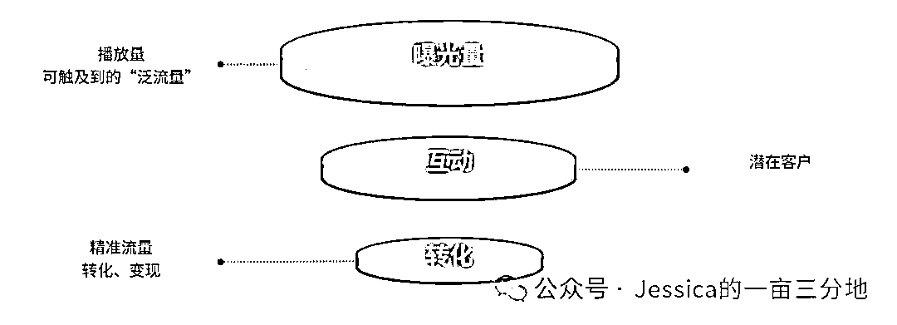
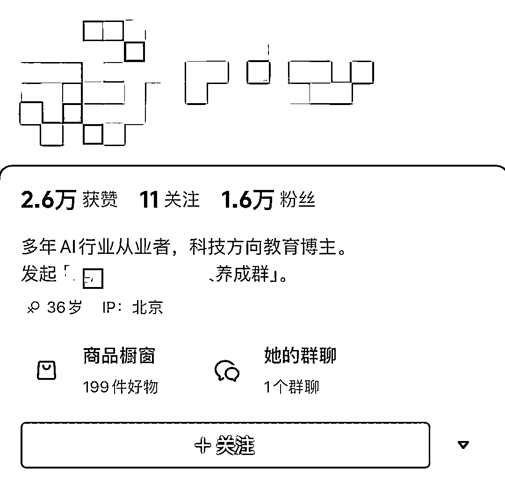
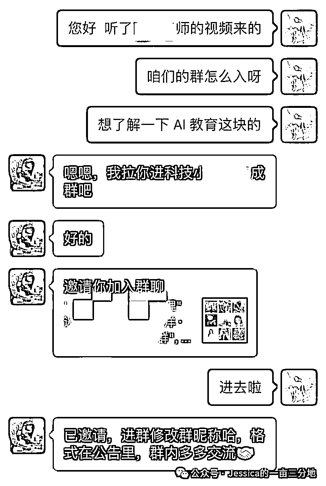
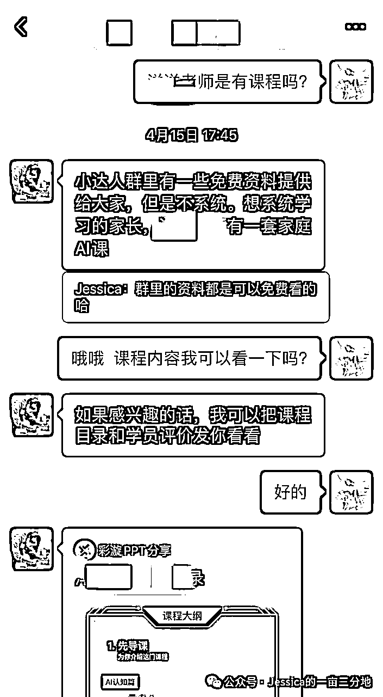

# 怎么做一个赚钱的 IP ！我花了 9 年的总结，拿走不谢！

> 来源：[https://gng5s0pcia.feishu.cn/docx/MyDpd5X9MoTwq2xLY4JcEstpnPe](https://gng5s0pcia.feishu.cn/docx/MyDpd5X9MoTwq2xLY4JcEstpnPe)

大家好，我是 Jessica，IP 孵化老手。MCN机构从业 9 年，曾就职于某细分垂类 top1 mcn 公司高管、某头部数字营销公司-直播电商部高管、两家MCN创始合伙人。孵化运营多个直播电商头部账号，孵化达人100+。

上一期和大家说了要用系统的逻辑来做账号，很多人想知道这个系统应该都有什么。今天的内容就会讲这个系统具体包含的点。全文较长，耐心点才有可能获得更多哦！

你为什么想成为IP？

变现？

提高影响力？

不同的目的，做号的方法是不同的，我们拉齐目标，今天只讲变现！怎么做一个赚钱的 IP ？

泛流量和精准流量的“骗局”

回答这个问题前，首先要搞清楚两个词：泛流量、精准流量

相信很多人听过这样的说法：不要做无意义的泛流量，要做可以变现的精准流量。这句话常被一些“割韭菜”的人来自圆其说自己专业度的问题，做不出来有量的内容就说要做精准流量，不知什么时候精准流量成了低质量内容的代名词了。

记得有一次参加一个做创始人 IP 付费社群的线下分享会，主理人先讲了现在流量难做要做精准流量“内容一定要垂直，才能变现，做泛流量没用”。他举了这样的例子：“很多做MCN的人非常擅长做泛流量，账号粉丝不少，但是变不了现”。讲到创始人 IP 的人设定位问题又说：“老板要接地气、要轻营销、讲自己的一些故事……这样才能破圈”。

有一位老板问：“老师你刚刚说要做垂直的营销内容获得精准流量，主要抓变现，又说要做受大众喜欢的人设，轻营销、讲故事破圈。那我们到底是要做精准流量还是做泛流量呢？”

这位老师回答：“做账号其实“泛流量”和“精准流量”内容都要做，但是要有比例安排”。说了一堆应该怎么分配内容比例，但从底层逻辑来说并没有充分的解释这个逻辑漏洞，果然最后这位老板以“好像懂了”结束了这场问答。

不知道大家有没有同样的困惑。其实这个问题很简单，我们不应该把精准流量和泛流量作为对立的两个因素来看。在我看来，他们更应该是“漏斗”的关系。我们来公域上做 IP也好、做账号也好是为了获得目标用户变现，但获取目标用户的前提是有足够多的人能看到你。

所以获取“精准流量”，更应该说是通过获取“泛流量”从而筛选出更多的“精准流量”，转化变现。只有“泛流量”的池子我们触及的越大，才有可能筛选出越多的“精准流量”。

所以，做赚钱的 IP 就是：围绕自己的“赚钱方式”最大程度的获取“泛流量”。用你的内容让目标客户一眼识别到你。再厉害一点就是：用你的内容“创造”目标客户。

明白了这个道理，接下来我们来说怎么做的问题？怎么围绕自己的“赚钱方式”最大程度的获取“泛流量”？

这个问题要拆开三个部分回答：1、赚钱方式。2、获取“泛流量”。3、围绕赚钱方式做内容。我们一个一个详细说。

1 赚钱方式

赚钱方式

想要做赚钱的 IP，首先要定好怎么赚钱，商业变现的定位直接决定了你能不能赚钱，你能赚多少钱。做 IP 可以赚钱的方式有：卖产品、引流获客、电商带货、付费内容（课程）、广告推广、打赏。上面的例子中提到了一个现象说“很多做MCN的人非常擅长做泛流量，账号粉丝不少，但是变不了现”，这个现象有吗？有，但是这个问题的核心不是因为“泛流量”，而是因为变现路子的问题。

大部分MCN签约达人，主要的变现方式就是做出来粉丝量，接广告、收打赏、直播带货。这一套变现逻辑在 22 年以前都是非常暴力的变现模式，只要粉丝量做出来了，流量有了，根本不愁变现的问题。可以说后台抢着有人给你“送钱”。之前在机构中，我们所有达人的商务后台是我管理的，我每天最烦的就是一睁眼一堆人加我微信，加不完，根本加不完。

但 22 年开始，广告主不只想要曝光，更多的看重转化。这种转变对靠曝光赚钱的账号来说就很不利。其次打赏也是，老板们的“冲动性”消费越来越理智了，赚钱也就难了。但在之前主播一年收入百万、千万的大有人在，不得不说那些曝光量非常恐怖的优质账号，现在接广告的收入还是很不错的，只不过僧多粥少，很多流量不稳定的账号就被“优胜劣汰”掉了。

所以，必须要说的是，泛流量不是最主要的问题，商业定位才是。

这里建议大家，要有自己的产品，设定好自己的变现路径，有产品、有路径再通过公域转化做变现，是目前来说最稳的方式了。自媒体是普通人最容易应用的杠杆。

2 获取“泛流量”

获取“泛流量”

这个就是内容的逻辑了，也是一般市面上教大家做号方法的内容。这里就要涉及做内容的系统逻辑了。这个系统包括：人设、呈现方式、选题、脚本、拍摄、后期、表现力。每一个组成系统的点都很重要，都有泛流量的玩法。由于知识点过多，这块我不一一列举，感兴趣的可以来我的训练营，我手把手的教。

但是这里我会给大家说一个，我觉得要比具体方法更重要的知识点，通用的获取“泛流量”的底层逻辑——用户思维，做用户喜欢的看的内容。这里给6点，检测一下自己的内容是否是用户喜欢看的：

*   内容是否有收获感。内容是否：有趣、令人向往、有共鸣、有用、新鲜

*   内容抓取用户痛点是否有效。和用户的关联度是否高，是否常见、频发。

*   内容可看度。主题是否明确，用户能看的下去的意愿强不强，趣味度、诱惑力够不够。

*   内容难不难懂。用词，要通俗易懂，说话方式要日常。

*   内容舒适度。这个主要涉及到画面、声音问题，千万不要做模糊的、晃动严重的、声音刺耳、听不清等视频内容。这种低质量内容，平台也不给流量的。

*   平台不推荐的内容。重视官方规则，否则你和用户都没有相遇的可能。

3 围绕赚钱方式做内容

围绕赚钱方式做内容

围绕赚钱方式做内容，这是让目标客户识别到你的核心，也是变现的核心。具体要怎么做呢？

首先，你要在你的账号中、视频里体现你是干什么的、有什么样的专长、有什么产品。

其次，你还要展现你是个什么样“靠谱”的人，让大家信任你。如果能有一些“可爱”的元素，让大家喜欢上你就更好了。

再次，你要展现“真实”的自己，要正能量，要自然。浮夸、虚假的内容，现在的用户越来越反感了。

那你可能会问，这种内容是要在每条视频都体现出来的吗？

如果你可以把他们非常自然的都揉进你的内容里，那最好了，但是如果不可以，可以分成不同的视频来展现。视频类型可以分为：人设类、专业类、营销类。

你是不是又要问，这种不同方向的内容占比了？

记住，营销属性越轻越好，建议营销视频占比不要超过30%，多发展现自己专业能力、人格魅力的视频。

那营销转化类的内容怎么做呢？这里给大家一些常见的营销转化的方法：

*   拍摄产品介绍视频、置顶

*   视频中文字标注你的身份、产品

*   橱窗上架自己的产品

*   个人简介提及产品和成绩

*   一切可以展现你工作、产品的场景

这里，有一个新手特别要注意的问题 —— 变现路径，要简化。

*   记住变现的路径每增加一道，就会减少一部分客户。

*   其次一定要有自己的承接产品，产品链接、产品海报、产品介绍等要准备好。要第一时间给用户展示。

*   最后积极主动的展示自己的产品。

类似这样的：

之前遇到过一位知识博主，粉丝量做到 1.4 万，因为赛道很新粉丝付费意愿是很强的，但是整个变现路子设置的十分“含蓄”，非常耽误赚钱。来说一下她的问题。

她是有自己的产品的，有免费社群也有自己的课程产品。但她的账号上没有一点产品的的痕迹。私信回复比较慢，引流到微信之后也没有提有自己产品的事。拉我到她的免费群里，社群的活跃度也不高。还是我主动询问才知道她有自己的课程。

我是有“目的”的接近，不然我这样知道套路、还愿意主动引导的用户真的没有。想给你“送钱”都找不到门。

不要不好意思，一定要直接主动展示我们的产品。现在做流量不容易了，想要等账号粉丝起来了再做变现的老路子已经行不通了，最好的方法就是不浪费每一个观看，最快的做变现。更何况能引到私域的，一定要主动，全方位的展示自己的产品。

如果你在IP打造过程中遇到什么问题，欢迎和我链接。希望你在 IP 的道路上，越走越顺，加油！