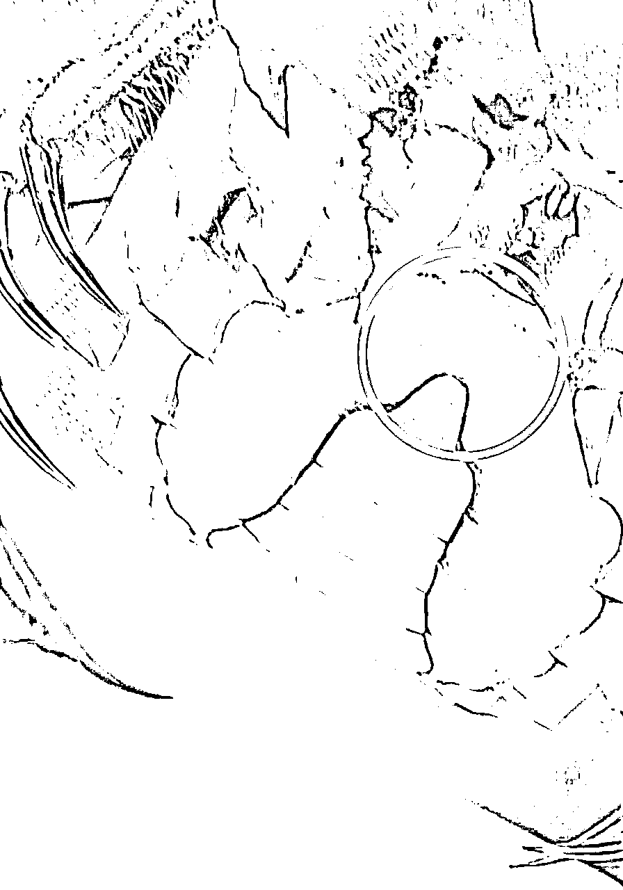

# 小螃蟹大机遇，子承父业，结合互联网，如何把螃蟹卖爆！

> 来源：[https://mg8sdlq5qo.feishu.cn/docx/NYNcdufjro44Mzx5PQCcXkb8nAd](https://mg8sdlq5qo.feishu.cn/docx/NYNcdufjro44Mzx5PQCcXkb8nAd)

生财圈友好，我是星球帅彬，目前就职于常州市交通产业集团，做过很多行业，比如工地上的白帽子，工地上的红帽子，做过弱电，水电，在南京地铁1号线当过调度，苏宁总部做过产品经理，当过销售员，做过程序员等等等一系列的不同工作，不同岗位。

现在在老家算是稳定下来了，但是我有一颗不稳定的心，抱着搞事的心态把传统的大闸蟹行业带到了互联网上，今天就和大家好好聊一聊大闸蟹这个传统的行业是否还能做，拥抱生财有术能否将传统电商和互联网结合起来。

打我记事起，家族就是做养殖大闸蟹的，后来家族成员赚到钱，一个带一个，都开启了养殖大闸蟹的这条路。对于如何养好大闸蟹在当地有很高的话语权。

这个行业就是复耕会给你带来很大的收益，口碑特别的重要，不能因为想多赚点在质量上给客户玩套路。螃蟹一定要挑好，不缺斤少两，能做到满黄满膏，让客户有不一样的体验，我的回头客我粗略的算了一下基本在90%以上。

一开始送的也比较多，断脚蟹小蟹也不值钱，给客户送送，或者便宜的卖卖，客户觉得好，后面就开始买你的礼盒蟹了。没有利他和拓客思维，就做不好一个项目。

授人以鱼不如授人以渔，今天给大家说说大闸蟹项目还能不能做，如何入手，一线养殖户养殖螃蟹、卖螃蟹真实心历路程及加入生财的一些收获。

* * *

# 一、传承创新，蓬勃发展

我的名字叫陈炎彬，1995年出生，微信名字也叫陈炎彬，为什么取真名呢？一是因为真实让大家在虚拟的网络上知道真真实实的你，二最主要的一个原因就是之前用的是网名，每次加人都要自我介绍一下，感觉很烦，哈哈，索性直接改成自己的真实名字了。

我自己家是养殖大闸蟹的，对大闸蟹的知识略懂一些，家族很多亲戚都是养殖大闸蟹的，比如大姨夫，表舅，二伯，三伯等等亲戚，已经形成了地区的一个产业链了

但是这几年我深刻的意识到养殖大闸蟹的多是年纪大的，年轻的很少能吃的了养殖的苦，吃的了养殖的苦也不一定能吃的消过几天就要卖钱了，一下子螃蟹一亩、二亩大批量的死亡。

现在年轻人还是做销售的比较多，像和我同一时代的家族里的几个哥哥姐姐，只有极少的坚持养大闸蟹，大部分都已经开门店或者做互联网直播平台销售了。

我是货真价实的蟹二代，我们家族一开始是我大姨夫在长荡湖里养殖的，后来带动了家族里一帮亲戚在做养殖，目前他也做冷库批发。

我们当地很多的徒弟都是他带出来的，为什么带那么多的徒弟呢，很多人其实都有这个疑问，我多年前也有这个疑惑，直到前几年和他喝酒的时候，他才告诉我。

这里用他的口吻描述一下：“螃蟹养殖，就算你不教他，他有了这个想法，他也会去别的地方学，养殖的投入不是一万二万，有时候可能要赌上身价财产去做这一件事，既然人家来找我就是信任我，我把技术都交给他们，我年纪也大了，希望我们养殖行业能青出于蓝胜于我这个老师傅，而且我是做冷库的，喂养的冷冻鱼块都是自给自足，这时候我帮了他们，他们后面需要养蟹所需要的优质蛋白质就会来找我了。”

（ps养殖大闸蟹要做到荤素搭配，现在很多养殖户都是虾和大闸蟹还有小鱼混养，不过大闸蟹长大后所需要的最多的还是鱼块，不能每天都吃荤，结合东北玉米还有甜番瓜隔着几天分批喂，这样长大的大闸蟹蒸熟后吃的时候不用蘸醋，蟹肉都是甜甜的，黄和膏都肥美香甜）

螃蟹只平时喂养舍得下成本，补充充足的营养才能最后上市的时候达到穿心红的品质，所以他需要给螃蟹喂养很多冻鱼块。自己做冷库可以节约一些成本，也可以在亲戚和其他外面养殖户之间售卖赚一点小钱。

我们家的螃蟹上市时间比较晚，很多老客户都等的很急的，因为品质好所以回头客很多，但恰恰是因为追求品质，所以品质没有达到精品的要求是不会上市的，还是生财的那个思路，不赚快钱，靠口碑积攒客户群体。

有人问我为什么体制内想到帮家里分担一些生意上的事，帮家里卖大闸蟹，因为我是看到父辈真的很辛苦，做为家庭的男子汉，也想帮家里分担一份力量。

每次螃蟹上市的时候父亲和家里的长辈都是晚上凌晨去市场打样，然后精品门市有的是一把秤有的是两把秤就这样慢慢的挑，慢慢的选，普货里面挑精品，精品里面挑穿心红。

每次赶市场都不仅仅是在当地市场，养殖户都是很多市场轮流跑，都是有圈子的，哪里的价格美丽就去哪里赶市场，我见证了很多的心酸历程。

我和父亲去过很多次的市场，一般市场晚上挑普货，凌晨才开始挑精品，所以两点的时候是最忙的时候，真的是很辛苦，不是一般人能承受的。

你以为忙完了第二天就能好好睡觉了吗？

错了，第二天蟹塘还有很多的事情要忙，一塌方的事情要去做，很多事情都要面面俱到，养殖来不得半点马虎。

自己也是真看不得父亲这么辛苦，也会为家庭分担一些责任，年少时吹多了寒风，特别是11月的西北风，又加上过度劳累。我现在的腿也攒满了伤痛，到冬天会疼的不得了，我戏称它是“老寒腿”。

冬季凌晨的螃蟹市场有吵闹、有灯火通明，还有因为寒冷和过度劳累引起的身体上伤痛。

记得去年12月一天的凌晨，我在市场3点多实在是困的不行，想想也是心累，真想放弃不干这一行业了，真不是人能承受的，一个人干了一瓶金小米，就是低度白酒。

但是收到客户的好评反馈，就萌生出慕名的责任感，我觉得能让信任我的人吃上最好的大闸蟹，吃些苦也没什么。所以呀！我还是想一直把养殖和卖大闸蟹这件事情坚持下去。

也不希望父亲这么辛苦了，我还年轻，再多的苦也能吃，但是看到父辈们一把年纪还这么的拼，真的有点于心不忍，每每想到动情之处，眼眶总是不争气的湿润。

当我看到蟹贩子收螃蟹，是按斤来收的，然后他们可以按个卖给客户，着实很羡慕。于是自己也一直在朋友圈帮父亲卖大闸蟹，陆陆续续也是有客户，现在积累的客户90%都是回头客。因为我不怎么爱展示自己，所以吸引过来的都是老顾客，说来也是惭愧。

因为平时扎螃蟹，用刷子刷螃蟹，不喜欢带手套，毫不夸张的和大家说，我现在手上的指纹都没有了...

偶尔手还被大闸蟹用爪子夹一下，不是出血就是破皮。

现在为了家族蟹塘可以更好的发展下去，我就是想多出网络订单，减少去市场的次数，能够直接从蟹塘到客户的餐桌上。这样既可以让老父亲不那么辛苦，又能够给到客户最优惠的价格，还能保证发的每只蟹都是精挑细选的，可谓一举三两得。

我这两年互联网的客户多起来了

承蒙各位顾客信任与照顾，这两年的互联网客户逐渐多起来，让我更有信心去做好蟹塘了。

# 二、市场广阔，前景可期

现在说实话，如果小白入手大闸蟹项目，确实是有一些晚的了，但也不是一点机会都没有，我这里把一些流程还有项目怎么从0-1开展的和大家介绍一下。

俗话说的好，万事开头难，只要头开的好，后面不说是畅通无阻，反正相对来说会走的平稳一些。

大闸蟹项目第一手资源就是养殖，养殖的风险太大，而且太辛苦不建议大家亲自下场养殖，没有前辈的经验很容易赔的血本无归，而且现在养殖都更新到半自动化有的养殖基地已经实现了全自动化可视化养殖。

就是每天哪个塘喂养多少量，系统上面都一目了然，还缺少多少量，无人机的飞行路线设置一天多少趟，每个塘每个区域定投多少。

投入的成本很高，因为有政府补贴所有现在弄可视化农场养殖大闸蟹的年轻人比较多，因为这样农场就依托物联网走向了更高的平台，自己的曝光率也大大的提升，接到优质大单的几率也显著增加。

养殖螃蟹这条路道阻且长，我们就换一条走的通的路，成为中间商，收购螃蟹，再转手销售给大家，赚取收益。下面我就按步骤和流程和大家分别介绍一下：

1.收购螃蟹：蟹季去螃蟹市场或者蟹农那边收购螃蟹，打规格称重，然后按斤称。螃蟹市场大闸蟹上市的时候一般是蟹农会主动送到市场，一般下午晚上会先挑普货（就是质量一般的螃蟹），夜里半夜才会挑精品蟹（黄膏相对不错），挑完精品还会在精品里面挑穿心红质量（黄膏饱和）。

挑出来的精品蟹不会在市场流通，早早的都被人订完，在市场上流通的基本都是普货和垃圾蟹。特别是中秋的时候，价格比较贵，有时候蟹贩子为了一袋精品蟹就会打的头破血流，那时候物以稀为贵，抢到就是赚到，你有渠道一出手就是翻几倍的价格。

临近中午就别去市场采购螃蟹了，那时候精品螃蟹都被人采购一空，夜里或者凌晨去市场有认识的门店可能还会给你留好货，像我们这边就是凌家塘批发市场，兴化的中国河蟹第一市批发市场，南京的固城湖螃蟹批发市场（之前在高淳老街，已经搬到新的市场了）等等。

你认识靠谱的养殖户资源也可以直接去养殖户那边谈合作，一般你需要什么规格的，前一天晚上蟹农会涨笼，打规格，也有通货，然后涨到螃蟹用小笼子绑扎在蟹塘里面，吐一下水，没有吐水的螃蟹会有泥腥味。你也可以晚上收了，放在暂养池里养着，吐一吐水。

如果你一开始做螃蟹，建议别做中秋的单子，有时候你接到单都不一定有螃蟹，螃蟹挑走眼，卖给客户，还会被投诉，有时候很多人信心满满的步入螃蟹生意，失望的离开。信心满满入局，垂头丧气出局。等大闸蟹大量上市的时候做会好一些。

不然可能你一入局，本来没有想割韭菜的，奈何怎么做这个项目都不顺利，无可奈何，赚一波快钱下场。

一般母蟹大量上市要国庆后，11月是吃公蟹的时候，母蟹11月开始成熟，一开始做大闸蟹生意可以用蟹卡入局。

2.蟹卡预售：因为大闸蟹大量上市得10月，但是9月送大闸蟹的人特别多特别是中秋前后，我一般9月中旬就开始做大闸蟹现货生意，不过那时候螃蟹得好好的挑质量。

大家也可以弄个蟹卡系统，然后卖蟹卡，可以自主提货，蟹卡的有效时间一般是2年左右，我设置的是永久有效没有到期时间，因为买你卡就是因为信任你，每年都做回头客的生意的，没必要一点规则卡死客户。

网上让商家做大闸蟹系统一定要问问商家有没有独立的服务器，防火墙一定要做好，不能贪小便宜吃大亏，还是得和靠谱的商家合作。

蟹卡没必要弄的花里胡哨的，简单明了就好，最好能找设计师给你设计一下，或者直接购买别人的版权，别看网上有的图片很漂亮，你直接用作蟹卡的图案，小心别人告你侵权，有时候上面就纯色然后设计一只螃蟹也不错，客户更注重的是你的商品质量。

以及送货时候的礼盒包装还有蟹卡铁盒，蟹卡的包装盒你要做到差异化和服务化可以用私人定制服务，激光雕刻工艺和UV打版机器设计，机器有成本，一开始创业不建议投入过多，等做到了0-1，产生了不错的收益，可以试试私人定制化服务，可以让你的生意更上一层楼。

3.螃蟹运输：销售大闸蟹需要食品经营许可证，如果你做的是熟醉蟹或者是加工类的螃蟹还需要食品流通许可证，正规一点的就是自己弄个营业执照，或者办个公司成本都是几百元钱。如果一开始你私域卖的话，把绑扎好的大闸蟹放在泡沫箱里，里面放上冰袋或者冰瓶，装进包装盒。

就可以走顺丰邮寄了，远的地方是顺丰特快，一般做大闸蟹都是顺丰月付，也有办理地区卡，一次性冲个5万，10万的，会有赠送金可以抵扣快递费用。别看充值这么多，有时候一单运费都要80往上，因为远的地方走的是空运，保证时效性，运费自然而然就贵了。

包装盒子及泡沫箱在市场都能买到，还有绑扎螃蟹的香草，吃蟹工具，老恒和的醋市场都能批发，也有很多中间商批回去，卖这些产品，赚差价，生意就是这样买卖产生收益，要不你是直接生成出售，要不就是中间商赚差价。

我们这边包装盒基本都是从浙江义乌进货过来的，每个螃蟹市场都有通用的盒子和泡沫卖，比如南京高淳固城湖市场，直接去二楼就行，一楼都是卖螃蟹的还有物流送货的，等我们这边蟹季，北方就过了季节了，螃蟹很多都是市场上的普货和垃圾蟹大车子运输过去的。

然后礼盒装的里面要更有仪式感可以放入吃蟹工具，湿纸巾，明信片以及产品产地说明书等等，我今年在想江苏的大闸蟹结合现在比较火的掼蛋（源于江苏盐城）是不是更有社交礼仪。

4.交保护费：这里的保护费就是加入协会，获得协会的授权书，比如阳澄湖有阳澄湖协会，长荡湖有长荡湖协会，固城湖有固城湖协会，每个地方都有各自的管理，会长和分会长，董事以及各付费的会员。

这样你就可以用他们官方的盒子，或者自己的盒子上贴上他们官方的LOGO了，LOGO就用水晶头贴也行，或者你有成本预算自己找厂家设计打造也行。

加入协会没有多少钱，就是求个心安，长荡湖和固城湖几千元都能搞定，阳澄湖的贵一些得上万，不过交了阳澄湖的保护费也就是官方认可的“洗澡蟹”了，你就是合法合规的有产权的大闸蟹了。

5.注册商标：当你走上了一条成熟的路线后，可以注册一个大闸蟹的商标，大闸蟹商标注册时第31类，找第三方公司注册商标价格在500元左右，然后多花点时间在螃蟹包装上面，当然品质永远是第一位，不能为了大闸蟹包装和服务化的品降低螃蟹的质量。

等品质和品牌效应做起来是后面获得大成功的关键，就可以做大客户乃至于超级大客户，一年手上握着10几个左右超级大客户，每年至少赚百万。

当你品质和品牌做起来后，建立了消费者的信任和忠诚度。流量和分销自然会逐年提升，别总自己做别人能不能分销，代理我的大闸蟹，分销只是锦上添花，不能作为雪中送碳。

产品没有问题，利润分成、客诉售后都相对成熟，这样一来销售者没有后顾之忧，自然会更加积极主动地推广和销售螃蟹，形成良性循环。

当然这些是0-1之后的事情了，做项目最重要的是什么是做起来啊，认知很重要，但是实践更重要，试错的成本不可惜，错过的成本比较高。

6.总结一下：如果你不主动和生财圈友链接，不主动参加航海，不主动尝试一些项目，没有一颗成长的心，不在实践中不断的迭代，那你认知再高，实践永远是0。

没加入生财之前，我也被割过很多的韭菜，或许是认知不够，或许是抱着下场干的心态，干就完了。加入生财有术之后，就好像发现了新大陆。原来在行情不景气，市场低迷的状况下，还是有着很多的机会。

和大家链接还有线下机聚会聊的最多的还是机会、发展以及交换一下资源，感觉在这个搞钱的范围你不搞钱不成长都有人拉着你一起前进，关键还是得下场实操起来。

所处环境的财富浓度、人才浓度越高，搞到钱的机会和几率越高。

要么，你追随一位大哥，鞍前马后。

要么，你不断升级打怪，人以群分。

# 三、相聚生财，赚钱有术

我每一期都积极的参加生财的海航活动还有线下聚会，还是那句话，你光看是没有所得没有所想的，有也不深刻，你只有亲自下手去实操，才能获得一手的信息，做到真正有益于自己成长的点，让这些点融会贯通为你自己所用。

就像之前上学的时候同一道数学题有不同的解法，语文更不用说了，一个阅读理解的解题思路有很多不一样的方式，重要的是在你口中用正确的方式解答对这道题目。

航海的过程充满挑战和动力，当你认真、用心、真心去脚踏实地的去做，也一定会有意料之中和意想不到的惊喜和收获。

我就是在视频号海航中遇到了做朋友圈IP的圈友，但是苦于没有自己带货的品，和我链接后希望帮卖大闸蟹，说实话以前还从来没有尝试过招代理，这也算是我的一波尝试和圈友的一次突破，这里先放一些截图。

在交付的过程中，我发现了很多的问题，首先是什么，大家对大闸蟹的知识点知道的太少太少了，很多人吃螃蟹在中秋国庆就开始品鉴，其实真正好吃的时候要等到10月中下旬，苏北蟹（兴化、泰兴）成熟的比较早，受气候和温度的影响成熟周期不一样。

母蟹最好的品尝时期在10月中旬之后，而且越大的母蟹越到后期才越好吃，公蟹成熟的时期更晚一些，要等到刮西北风才算真正品尝公蟹最好的时候，这些人自豪的称为"公蟹党"。

像广州那边吃大闸蟹11月就已经快结束了，所以他们中秋、国庆送礼找我买螃蟹，我都是推荐蟹卡，因为中秋、国庆苏南还没有成熟的大闸蟹到哪里去给你弄精品蟹呢。

有客户急的，也会从苏北给他调货，苏南蟹成熟时间就是比北方螃蟹成熟的要晚一些。

所以我卖大闸蟹是追求质量，质量不好坚决不卖，前期就是卖全母礼盒套装，后期才是公母搭配这样。

很多时候代理也会迷茫，因为对螃蟹很多的知识点不了解。我也发现了这些问题，我就和代理们说，有问题直接发群里或者放不下面子的，私信我，我一个个，一个知识点一个知识点的帮你解决好问题。

这和生财航海实战的理念是相似的，很多的问题你想都是想不通的，只有去做，只有自己亲自入局，下手，才会有感触，才能去迭代。

基本很多问题在生财都能找到答案，这里就像一个个碎片，要有心的人去拼凑，拼凑成一张地图，地图的深处会有个指引，这就是宝藏。

在我帮助和指引下，代理们积极的主动去联系客户，因为你突然开始做大闸蟹，朋友圈的好友会感觉到很唐突，只有放下身段，放下面子，去主动积极的联系朋友，这样才有出单的机会。

走到这一步，客户算是成交了，只有站在客户的立场和角度去思考问题才能真真实实的去解决客户真实的问题，只有真真切切的用真心去换真心才能赢得真心和支持。

我始终和代理们说的一句话是：“生意不是做一天二天的，生意是做的长久生意。”所以口碑很重要，在建立自己大闸蟹口碑的同时要和客户维护好关系，今年客户在你这边买了，好吃。价格在精品蟹里面算实惠，那明年还会再来，你今天骗了客户，质量上缩水了，看似是你赚了，其实长期下来你是亏了，亏了人品，亏了人脉。

做生意是不是有生意经我还真不太清楚，也没有系统化的学习过，因为自己在体制内上班，在体制内就是永远不要当恶人，因为很多人说不定就是你一辈子的同事，有的锅有的错，我都会主动的解决好问题，看似是我亏了。其实事后大家都是明白人，往往会赢得尊重，但是体制内也永远不要当老好人，该翻脸的时候一定要让别人知道你的魄力。

总结下来，生意经我还真不知道是什么，我只知道做人的原则不能变，尊重对手，帮助穷人，弹劾小人。做人需一身正气，或许这就是我的生意经。

看到这里大家是不是很心动，原来出单这么容易，弄个小副业赚点零花钱还是挺不错的，别急让我来打击打击你。

出单的代理往往有一颗坚定不移的心，他私聊客户10个人，聊了很多内容，很长时间但可能都被拒绝了，有的被委婉的拒绝，有的被直接了当的拒绝，不是你不够努力。

还是那句话，不够信任，现在产品那么多凭什么在你这边买大闸蟹呀？是因为你好看还是因为你帅，你说质量好，网上的大闸蟹质量刷好评显示质量也很好呀。

这样就要看你的客户群体还有销售能力了，文章或关系是第一信任，产品是第二信任。

这里你就要把你能说的你能介绍的全部都给客户介绍了，网上的规格是卖的什么规格，用的是绳子吗，绳子湿的绑扎大闸蟹水分会有多少，香草绑扎好还是不好，坏处是什么，我们的优势是什么，都要用到专业的知识。

很多人以为接触了几个月或者几年都已经是行业高手了，这个行业3年算入个行，5年懂行，10年才能算这个行业的翘楚。

而且每个人有每个人的优势我不会强制要求你如何如何去做，我会放开手让你去做你想做的方式，比如私域、视频号、小红书、抖音等平台，这里放一个代理做的小红书平台，数据还是不错的。

后来我参加小红书航海后，才知道还有很多添加客户的方法还有建群引流，所以大家还是要多多参加生财官方的航海活动。

在不断实践中学习到适合自己的方法论。哪怕引流到的客户你后期不做大闸蟹了，也可以在快团团上做商品团购发给自己的粉丝，保质保量，口碑做好，生意差不了。

只有不断的学习相关专业的知识点才能更好的和客户介绍产品，更好的去获客去卖出产品，并不是拼多多便宜，去拼多多下单给客户赚点差价，你要知道拼多多的货来自哪里，你的核心是什么，优势是什么。

圈子很重要，希望大家都能在生财有术这个大家庭里有所收获！

# 四、螃蟹赚钱，不断迭代

目前大闸蟹就是走网络销售平台比较多，打算一直深耕副业帮家里卖大闸蟹。而且我申请了食品经营许可证，食品生产许可证，熟加工工厂资质，及熟食食品许可证，投资了熟食深加工工厂。

大家想办营业执照，可以自己去市场监督管理局办理，很方便很实惠，有营业执照就可以免费在官网申请食品许可证，然后去市场监督管理局拿。

跟着官网一步步来就行，说实话一开始我也不太会弄，但是我经常跑市场监督管理局，然后给办证的妹子买水果吃，一口一个美女的叫着，请奶茶喝，搞得人家主动加我微信，然后帮我弄好，怪不好意思的。

这里说几个申请食品许可证要注意的点，申请主体选择-销售，经营项目选择销售，从业人员-健康证必须要，没有的话就不能申请到食品许可证，上传店内的布局图。

你没有实体店的话（就是为了做互联网大闸蟹销售和醉蟹销售必须要用到营业执照和食品许可证的申请），你可以画一个简单的布局图，设计到图片上传的，可以去同行那边拍摄上传到系统。

然后营业执照没必要去找代办公司代办，当然怕麻烦可以找代办公司，自己办的话可以找个地点，最好是乡下房本必须是绿本，可以直接找市场监督管理局申请营业执照。

但问题就是必须要门店绿本才可以，乡下的私房、自建房也是绿本，如果你要办营业执照需要当地村委会，就市场监督管理局出示的申请，盖个公章，因为涉及到后期拆迁赔偿款等问题。

但是村委会目前不会随意的给你盖这种盖，具体的一句二句说不清楚，但是只要你完成了村委这步，市场监督管理局那边就没有太大的问题。

主要是要和市场监督管理局人员沟通好，如果让她们开心，她们一手帮你办好，都不用你操心。

后面还主动发微信给我问我还有没有什么困难，我说一切都搞定了，她还要帮我推销我的大闸蟹，社牛在哪都能顶起一片天...

我也打算一直深耕这个领域，家族目前是养殖螃蟹，而我打算把我们的螃蟹口碑打出去。利他就是最好的利己，我也会在我懂的领域毫不保留的像大家传授我的知识，有任何的相关问题都可以问我。

我深知赚点小钱很容易，但是想打造一个赚钱的IP就需要源源不断的口碑，所以我保证每一只螃蟹都是足斤足两，我认真挑选的精品好蟹。

我深知以后的社会是个人IP和私域的时代，大家都会比价格比质量，那我先走出来，站出来，把自己展示出来，立个flag一年后视频号弄个个人IP认证哈哈。

然后我也在不断尝试抖音和视频号直播，闲鱼和小红薯获客，都认证商家资质了，这里的商家资质我也会免费注册如果你不会也可以问我，我免费教你。亦仁老大说过极致的利他就是利己。

我自己也在创立自己的品牌，爱惜自己的羽翼，现在的价格都是透明化的，虽然说套路也很多，诚信的商家也不少，不诚信很少能立足这么多年。

如果大家做私域电商的话，也可以借助小程序来销售，小程序的可以放图片还有视频，客户直接下单就可以了，我是自己做的小程序。比写程序要简单多了，也相信大家都能自己学会。

自己做小程序腾讯那边会收300元的小程序认证费用，然后就是自己设计了，一步步的走，还可以设置分销，佣金多少很方便。

自己学会了以后不做大闸蟹了，也能帮忙设计小程序是不哈哈。

建立自己的影响力，我在常州金坛已经有足够的影响力了，但是我深知要做到外面的市场凭自己的影响力是完全的不够的。

得有一帮小伙伴一起赚钱，然后我要会懂得给大家分钱，就像一个董事会一样，给股东分钱，我的用处就是有钱大家一起赚做好分蛋糕的人，钱聚人散，钱散人聚，道理就是这么个道理。

像我父辈和爷爷那辈还是停留在辛苦养殖蟹塘的阶段，不是说这样子不好，只是不出来看看外面的世界，不拥抱改变这样很难有阶级的突破和圈层的升华，这也是我今年加入生财最大的感触之一。

今年想去外面跑跑市场，往往蜗居在一处就会形成视野的局限性，大局观的把控就会失误，我现在带的代理也是因材施教。

我发现有的人比较老实，我就建议他每天发朋友圈，被动获客，我发现有的代理很活泼，我就建议她主动拉群，自己再招代理，她就是代中代，有的代理想法很多，想做视频号，想做抖音，想做...

这时我就建议他先入局一个，精力有限，然后不断的迭代。

很多代理都出成绩了，这让我很高兴。

一个人的力量是薄弱的，之前有位大佬张哥也说过，一个人可以走的很快，但是一群志同道合的人可以在互联网上走的更远，对于新的知识，我也要不断的去汲取能量，创新，迭代，突破。

# 五、相当有趣，冷门知识

螃蟹的黄金周期就那么短短的几个月，因为螃蟹的寓意很好：富甲天下八方招财，富得流油鸿运当头，纵横天下。所以往往是送礼的最佳选择之一。

之前生财的文章教了大家如何选好蟹，其实串心红的螃蟹也会有挑走眼的时候，那是什么时候，我们专业的养殖户就知道了。

这个学艺不精的海贩子就不知道了，就是螃蟹扒开来中间有黑线，那这个螃蟹的质量不一定好，吃起来可能是苦的或者黄有点发绿。

我们长荡湖的螃蟹一般称为苏南蟹，也就是中华绒螯蟹。有专家指出无论是苏北蟹、苏南蟹还是黄河口大闸蟹、东北盘锦蟹，都是中华绒螯蟹。其本质都是一样的，但生长的环境不同，北方地区较为寒冷，因此成熟的比较早。

8月份苏南蟹大都没有上市，这个时候山东东营黄河口蟹会纷纷赶早上市，销售期一直要持续至10月份。

9月份至11月份各地蟹大量上市，这一时间段是一年中大闸蟹上市品种最多、量最多、质量最好的时间段，即所谓的“九雌十雄”大闸蟹。

9月份天气较冷的地方的大闸蟹上市稍早比如泰州兴化蟹、溱湖断蟹、江苏高淳蟹、安徽当涂蟹、江苏太湖蟹、湖北洪湖蟹、山东微山湖蟹等。

10月份至11月，其中就包括大名鼎鼎的阳澄湖大闸蟹及上海本地崇明蟹和松江蟹大量上市了，同时上市的就有咱们江苏金坛的长荡湖大闸蟹。

咱们苏南蟹母蟹最佳的的品尝时间是10月中旬，公蟹最佳品尝时间是11月份。正如郁达夫曾经说过“西北风未起,蟹也不曾肥”。

还有各种的冷的知识点，并不是几年能学会的。比如：螃蟹也会胃胀气，也会消化不良，这个知识点够冷了吧。

大闸蟹也是会得肠炎的，得了肠炎的大闸蟹，行动十分迟缓，而且体色发白，而且在喂养的过程中，你会发现它们没有食欲，有时它们的口中还会吐出一些黄水。

现在治疗主要也是用一些药材，也有一些更好的办法不过还没有得到专家的证实是否管用。

我们养殖户知道了螃蟹的这些问题后，我们有自己的处理办法，会给螃蟹解决好它的疑难杂症，这里就不展开说明了，有兴趣搞养殖的生财朋友我可以免费的教大家。

其实螃蟹越到后期越容易死亡，特别是大蟹死亡的机率很大，去年我家就在母蟹上市前死了2个塘的蟹，蟹塘里面只要出现非自然死亡的螃蟹往往就是一大批一大批的死亡。

像我父辈那个时候3两半的母蟹都是很大的螃蟹的了，现在有很多都是4两以上的大母蟹，更有甚者，今年有几亩，我家用的是小苗种，也能长到3两半左右。

说明现在蟹苗的种确实好了，而且螃蟹吃的也好，养殖户舍得喂呀，吃的都是新鲜的鱼虾、大鱼块、香甜的番瓜、东北的玉米，这大闸蟹能长得不好嘛！

蟹塘的番瓜吃起来都是特别的香甜可口的，味道棒极了，平时也是给大闸蟹增强营养的蔬菜之一。

消费者对于螃蟹的新鲜度、口感和品质有较高要求。只有具备优质的产品才能在市场竞争中脱颖而出。

秋天去产大闸蟹的地方玩，路边都会有大量贩子在卖大闸蟹，打着自产自销的招牌。这个时候你要注意了，很可能你买的4两蟹只有3两重甚至更低。

当然很多网上卖的普货也是一个道理，严重的斤两不足。很多人不相信我们蟹塘的价格还不是最低价，和网上比价格。

这里的套路太多，超35规格，46规格，38规格，49规格，50规格等等。你要相信源头的价格要是做价格比网上还要高，那说明什么哈哈，具体的自己体会。我也不会动别人的蛋糕。

快递大闸蟹的诀窍：内置冰袋，基本都是放2块冰，用空的矿泉水瓶子灌水冷冻好放入保温袋里面，并把泡沫箱封死。在这样一个密封冷冻的环境內，大闸蟹会快速降低新陈代谢，进入类似冬眠的状态，确保收到还是活蹦乱跳的。

大闸蟹基本只能用顺丰大闸蟹专递， 全国绝大多数地区可以次日达。远的地方都是走的空运，大闸蟹的快递费也很贵，比如从江苏金坛寄到广东，一盒大闸蟹快递费要五六十元，寄到哈尔滨甚至要七八十元。

当然有的地址用邮政更快，比顺丰还要快。

硬性成本这么高，你可以想想网上某些所谓“199元包邮”的大闸蟹质量如何了。

现在都是大蟹的多，因为蟹苗品质好，2.5两的都很少。

如果你去门店买大闸蟹，一般店里会按个给你卖，然后规格给你小的，他赚的多，如果你是去蟹农那边买，那就是按斤来，那规格愿意给你按大的来，这样赚头就多，不信你可以去门店试试看，你看你要是按斤拿别人睬你不。

你要是拿10几个或者不是很多，蟹农不会给你操心，别人我不知道，我就不愿意给你弄哈哈，但是我也碰到一个人给了我500，让我捞一网兜，大小都给他，一网兜捞到了7个，有3个4两以上的母，其他的都是中等的，那这种客户我也愿意的。

再分享一个挑选肥蟹的方法，捏起来厚实，拿在手里掂一掂，感觉沉重坠手的，不要犹豫，这就是一只肥蟹。

看肚脐也能看出大闸蟹的肥美和成熟程度，最好的方法还是扒开来看看质量。母蟹肥美的俗语叫“谷起”或“鼓起”，公蟹肥美的俗语叫“挂红嘴”或“红印”。

醉蟹分生醉和熟醉。不同地区口味不一样，浙江地区就喜欢吃生醉蟹，内陆地区喜欢吃熟醉蟹。

醉蟹在江南地区很流行，以螃蟹为制作原料，加以米酒香料精盐等醉制而成，口味咸鲜适中。芳香无腥，蟹味鲜美。

我今年投资的熟加工工厂也在做熟醉蟹还有熟龙虾尾，熟醉蟹也可以用六月黄为原材料，顺丰冷链发货。

从健康的角度来说，要避免吃螃蟹感染寄生虫，就要对螃蟹进行充分加热。不管是虫体还是虫卵，都不可能在高温下存活太长时间，只要保证食物煮熟煮透，就可以放心食用。

大闸蟹捕捞出来后要放进暂养池，目的是让大闸蟹吐出肚子里的脏东西。如果大闸蟹不吐一下水那么吃起来就是一股泥腥味，好的大闸蟹不是从水里抓了直接就发快递的，而是在暂养池里一只只精挑细选出来的。

吃大闸蟹要应时而食，一般来说，母蟹比公蟹先成熟，个头小的蟹比个头大的蟹先成熟。所以9 月下旬大闸蟹刚刚上市的时候，建议先吃2.5两、3两的小母蟹。

后面再慢慢吃更大的母蟹，等国庆节结束、寒露节气的时候，公蟹也可以吃了，前期公蟹蟹膏不多，不够粘牙，到11月就软糯得不像话了，就是是老话“西北风未起，蟹也不曾肥”。

做了大闸蟹生意才知道，物美价廉并不适用于大闸蟹，收购大闸蟹的贩子想在养得好的养殖户那里收购到好蟹，一定要给出高于市场行情的好价格才行，一分钱一分货，玩不得半点虚假。

抓大闸蟹一般都是夜里抓，前期蟹刚上市的时候得下地笼，等到后面蟹正式成熟的时候，晚上就会爬满蟹塘的岸边，直接捡就行了。

不煮熟的螃蟹千万千万千万不能吃，如果你不小心吃了没煮熟的螃蟹，那么很有可能你要去医院挂急诊了。

想吃大闸蟹的原汁原味的话，还是清蒸最佳，古人说“世间好味，利在孤行”，就是建议烹制大闸蟹的时候什么都不要加。

真正好吃的大闸蟹吃起来是香甜清香的口味，特别的鲜，鲜味十足，如果吃到了这样的大闸蟹恭喜你，如果没有吃到，那么可以试试我给你挑选的精品大闸蟹。

有时候你刚刚快递收到的大闸蟹看上去一动不动，不用太过于惊慌，它很可能只旅途劳累在冰瓶的作用下暂时晕过去了，因为冰的温度太低在封闭的空间里面大闸蟹会短暂的休眠，当你解开绑扎螃蟹的草，用水冲下大闸蟹的眼珠子，看！它又是一只活泼的大闸蟹！

还有的个冷知识就是公蟹塘和母蟹塘是分开养殖的，所以清塘是一亩一亩的清这样，10月上市母蟹，11月上市公蟹公蟹上市公母搭配这样卖。

很多人说网上才199元包邮，每次我听到这个话想反驳点什么我又感觉没必要和顾客这么详细的解释，因为有点专业有点闹口不是一句话二句话能说清楚的。

这里我简单的说一下，我们养殖户在15年前金坛才个位数的养殖户，养殖技术参差不齐，但是经过10多年的努力和迭代，技术相对来说都还行。

也舍得喂养下成本，螃蟹只有补充丰富的蛋白质还有荤素搭配才能肥的流油。在选蟹苗的时候就要选择充满活力的蟹苗。目前我们养殖都是自己培育种蟹了和蟹苗了，技术迭代的也越来越强。

但是在这些年里又出现了又一批的养殖户，每次螃蟹上市货也比较多，导致现在市场螃蟹上市的时候，质量参差不齐，有的螃蟹看着很大，其实很空，可以说很难吃。

养殖大闸蟹就和青春期补充营养一样，我们小时候吃的少，但是青春期长身体，要长高长肉多吃有营养的食物，你喂养大闸蟹不懂螃蟹的生长周期，舍不得喂，有的选择的就是小蟹苗，它上市的时候能长的肥长的大吗，像和海贩子长期合作的养殖户直接精品里面选穿心红质量。

# 六、相互合作，共同前行

项目核心问题是货源和质量，还有个最主要的点就是急单，你这边没货，就要去同行那边调货，因为大闸蟹不是你说现在要立马就有了，前期都要下笼，下网然后再拿大闸蟹，而且前期大蟹很少，10月卖的是母蟹，我前段时间也遇到了这个问题。

客户要6两的大闸蟹，当天中午联系我的，我店里不可能有的，要知道大蟹其实比小蟹更容易死亡，而且前期的死亡率更高一些，死了就是什么，就是人民币呀，所以一般大店才敢前期在店里屯一些货，客户又比较急。

我当时去别的蟹塘也来不及了，就去问问他门店有没有，大家都是同行，进货价一看，涨个15-20一斤也就可以的了，一般也是涨个5-10元一斤，因为他大蟹也有客户要，就涨多一些。

这个是麻花绑，也就是大草的意思，绑起来送礼也特别的好看，草正常就是这个颜色，如果你收到的大闸蟹绑扎用的草是灰色那就是陈年的草绑扎的。

质量的话你都要有经验才能看出，扒一下就知道，满黄的状态。好吃的大闸蟹不用醋直接吃，香甜。

行外人看可能就是皮毛，像养殖户就能看得懂什么样子的大闸蟹是一个好蟹了，当然早些年也踩过很多坑，都是经历摸打滚打出来的。

人教人多少次也不会，事教人一遍就行，都是泪呀...

和同行谈别扯那些虚头八脑的东西，谈合作什么别说太多花里胡哨的，直接说分成多少，给他几个点，或者给他的利润是多少，直接了当。

记得前几年有个品牌和小杨哥合作的，网上接了很多的单子，但是价格定的较低，然后各种中间商都要分点，精品蟹就那么点，你这么大的品牌和我们合作然后利润点压得很低。

你说我们能有好螃蟹给你吗，想想也是不可能的，一分价格一份货！所以网上铺天盖地的都是差评，今年的口碑差的不得了。

你要想做大就必须得要团队，有单子，没好货那你得急死。我们养殖户还好一些，做批发的同时带着做做礼盒，因为养殖面积太大，不上市场根本消化不掉。

# 七、经验分享，感谢生财

想要做好一件事情就要坚持不断的努力，不能半途而废，三天打鱼两天晒网是不行的，必须脚踏实地的干！一心一意的干！

只有真心才能换真心，真情但求换真情，真正的做到货“真”（真好吃，真满意，真心值）价“实”（规格实，做人实，螃蟹实）才能把生意一直做下去。

在你想清楚要做什么生意赚钱的时候，首先要考虑的是你有什么资源，然后可以资源变现，如果你没有好的资源的话，不妨多出去走走，学会合作。但是也不要太累。

人生不如意十有八九，男人倒下了，拍拍灰，依旧向前，受过伤流过血和汗或许还有”不争气“的眼泪。不算什么，知足常乐，拥有的要珍惜，失去的不必困恼，只有不断的前进，经历磨难，才会蜕变成一个真正的男人。

人在不同的时间段会有不同的迷茫期，上学时期人生即将完成学业步入社会的烦恼，踏入社会有赚钱和升职加薪的烦恼。

每个年龄段都有不同的烦恼，上学有上学的烦恼，出了社会又有新的烦恼，比如如何维护同事，供应商和不同的客户，每一个都有大学问。

但是我想告诉大家的是所有的事情你去想都是问题，只要你踏踏实实，脚踏实地的去一步步做，都会有答案。

不要轻易的改变赛道，打磨好自己的一技之长，才能诞生出好的产品。

大家如果没有方向，可以在生财有术找到标杆，跟随，努力学习，持续跟随，差不了的。

希望多和大家产生深度链接，有思想火花的触碰，产生不一样的新思路。

引流是商业极为重要的一环。

任何平台最初都有一个爆发增长期，然后会迎来规范期。在增长期，会出现各种各样的商业模式，甚至是欺诈的，平台需要虹吸引流，让大量商家和用户入驻，等到规范期再进行筛选提高质量。

建立影响力是很重要的一环，相当于一个生态位，打造个人的ip，哪怕在一个小的范围小的圈子内站稳生态位，也能不断产生复利的效果，不断向外辐射。

实践才能拿到正反馈，要在一个领域长期地深耕，不断试错，不断反馈，不断复盘，不要轻易地跳来跳去，时间越久越能放大成功的概率。

多多参加生财有术官方的航海活动，以前我总认为认知够了，就能赚到钱，其实生财上看的再多也是纸上谈兵，要多下场实践，才能收获满满，在实践中不断的遇到问题，去解决问题，从0-1,1-10做成一个项目，总结来说下场实践才能赚到钱，认知再高也就是避免被割韭菜。

目前来说分享的就这么多了，后来我会源源不断的补充的，我打算一篇文章不断的打磨，就像一个行业不断的迭代去做一样。

文章努力写的通顺易懂，不断的锦上添花，行业做的服务越来越好，让客户觉得体验感越来越棒！谢谢生财，谢谢各位的阅读，再次感谢。