# 2024，传统企业老板还有翻身机会吗，该如何破局（文末赠资料）

> 来源：[https://hiuyyeqljq8.feishu.cn/docx/NoirdqROkoQSgIxFb1RczbR1ntd](https://hiuyyeqljq8.feishu.cn/docx/NoirdqROkoQSgIxFb1RczbR1ntd)

## 如果你迫切的需要文案资料，请速度下滑

## 如果你想更好地运用这些文案资料，拿到结果。请花费5分钟，深入阅读此文。

# 亲爱的实体企业老板们，24年你们过的怎么样？

### 我是你们的老朋友一凡，从17年就开始深耕实体流量的赋能。

我想，当你打开这篇文章的时候，2024年对你来说，可能过的并不是那么完美，甚至是难！

难在没有新客！难在老客流失！难在同行恶意竞争！难在生意越来越少！难在入不敷出！

2017-2024年，我很有幸结识了10000多位实体从业者

其中有些是企业老板，有些是工厂老板，有些是实体门店老板........

从他们的口中，我了解到有那么一群正在负重前行的实体人

你们每晚都在焦虑生意不见好转，

你们每个月初结算工资时都会被账面压的喘不过气来，

你们被同行的价格战卷的只剩下最后一口气，

你们在自我怀疑，为什么努力拍摄的抖音没有一点引流效果？

你们在纠结——2024年，我到底要不要放弃？

但我想说：只要你的心中还留有那么一丝丝的不甘，那就不要放弃！

### 你还有翻身的机会！

所以，这就是我写这篇文章的意义，希望能够给正在负重前行的你带来一点方向和力量！

因为我做实体流量的初心，本就是：

【希望能够帮助更多的实体老板，通过线上流量改善生意，

让老板自己掌握做流量的技能，不再受价格战的影响，不再受做传统广告付高额费是否能回本的困扰！】

### 去年我们团队潜心研发出了一套AI短视频矩阵系统，可以有效的解决企业、工厂、门店、电商产品宣传、种草、获客的问题：

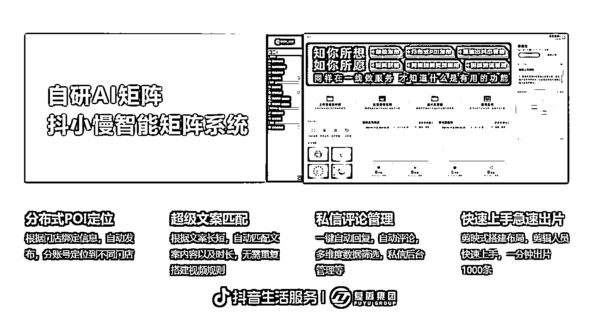

#### 经过稳定的测试，不仅流量稳定（单条视频发布目前最高跑到了99W的播放量），而且获客精准，最主要的是节省人工，一个人用这套系统就可以管理控制成百上千个账号，实现系统自动托管批量发布视频（可发布4大平台：抖音、快手、小红书、视频号），自动评论、回复客户，视频自动挂载POI定位、小黄车、团购、小程序链接等。可以帮助企业、工厂、门店、带货团长等，解决流量、获取精准客户、带货等问题。

我曾经也是一名实体工厂老板，所以我深知从事实体的苦累和面对生意下滑的焦虑。

我太清楚流量对我们实体人的意义有多重要！

流量是什么？流量的背后是人！是生意！是营业额！

我们缺少生意，本质上就是要解决流量问题！

我想说个很扎心的现实，23-24年，并不是所有实体老板都过的很艰苦，

有那么一批老板，他们很聪明，早早参透流量的重要性！

这两年他们不仅没有陷入经营困难的窘境，反而迎风而上，把生意越做越好！

在我身边，就有着这样的一群实体老板，他们既是我的学员，也是我的朋友。

在大多数实体老板还在传统的宣传销售模式的时候， 他们学会了通过线上流量为自己引流获客。

我想带你认识一下他们，也许他们曾经遇到的问题正是你如今面临的困境

最好的老师就是你的同行，希望你能从他们身上获得一些灵感，找到一些解决方法。

# 这是一家在佛山做地板木起家的装修设计集团公司（丰胜集团）

* * *

## 在经历房地产行业持续低迷，家装行业也持续受到影响。

### 他们传统的运营模式，持续面临客户缩减，又无法快速获取更多新客户的困扰·····

在跟我们合作之前，他门品牌在短视频平台没有曝光，一搜索几乎为0的宣传量·····

还靠传统的线下门店，坐等客户上门，在如今的时代，那是极难生存下去的。

合作前我问他——你想在我这拿到什么样的结果？

他说 “老师，我想让品牌效益提高，能获取更多的精准客户。”

那后来这个愿望实现了吗？直接看数据吧：

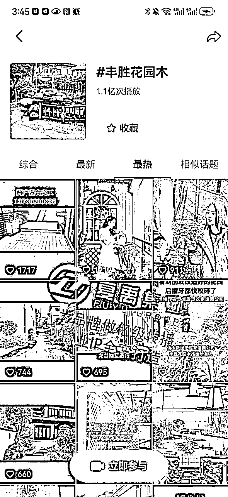

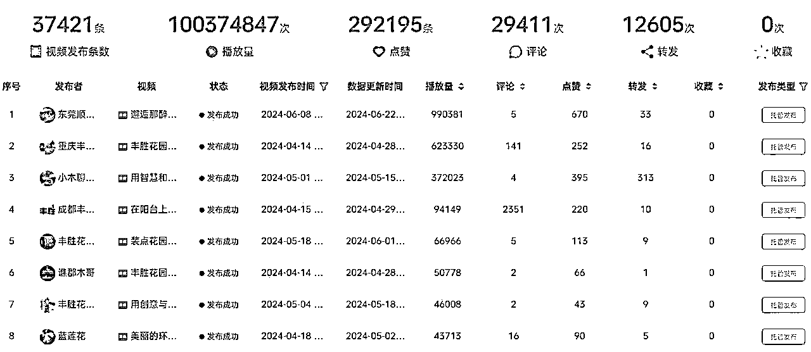

#### 用我们的矩阵系统发布抖音平台：托管了300多个账号，自动发布了37000条视频，获取1亿+曝光量（单条视频自然流破99万+播放量）

合作之后，郑老板特别积极，带领团队执行力也很高，

很快完成门店员工矩阵号的授权托管（100家门店，每个门店提供3个账号），不到三个月时间品牌曝光量从 0到1亿的突破（请问这对企业来说价值多大）

系统的后台大量的进咨询线索，客服分配给销售，转化到私域，进行跟进成交。客户特别精准。

正是因为他带领的团队有超高的执行配合的能力，才能那么快的在抖音上拿到结果。

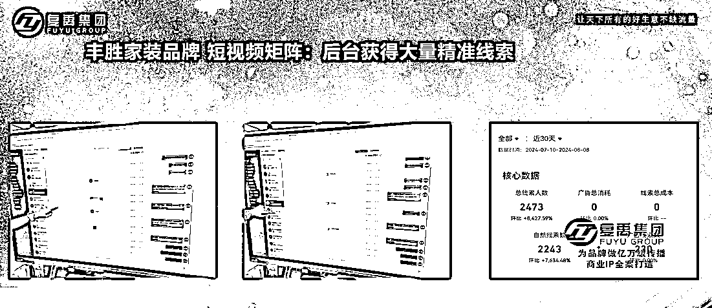

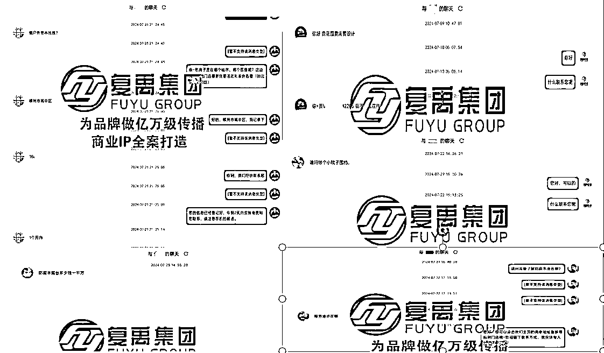

他品牌和团队已经从传统到结合新媒体运营的转变，掌握了线上营销的流量密码，并形成了常态性运营！

我们复禹团队的服务一直都秉承一个原则——授人以鱼不如授人以渔！

有些事情，其实原本我帮你做，很简单只需要2分钟；我指导你做，过程很麻烦需要20分钟！

可我依然选择后者，因为我希望所有的合作伙伴在3个月陪跑伴运营经历之后，

能够真正的学到东西，掌握技巧，跟上新时代的模式转变。

### 这才是我们做陪跑伴运营的初心！

# 这是一家做展会给商家做展台搭建的公司

* * *

### 也是家传统企业，面对同行的竞争，能够拿到的市场份额大量缩减，团队又不知如何布局线上流量·····

我们线上沟通后，了解到他们国内、国外的展台都能搭建，盘子铺的有点大，压力也是挺大，

能支撑这么长时间，确实是有些实力的。

在如今的时代，不及时结合新媒体运营，再有实力的企业，迟早会有拖垮的一天。

后来约了线下，带着团队来到我公司拜访，我们给了他一套矩阵运营方案。直接看数据吧：

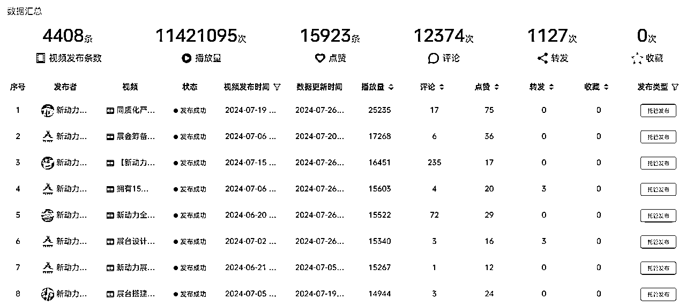

#### 矩阵系统发布抖音平台：托管了100多个账号，自动发布了4400条视频，获取1000万+曝光量

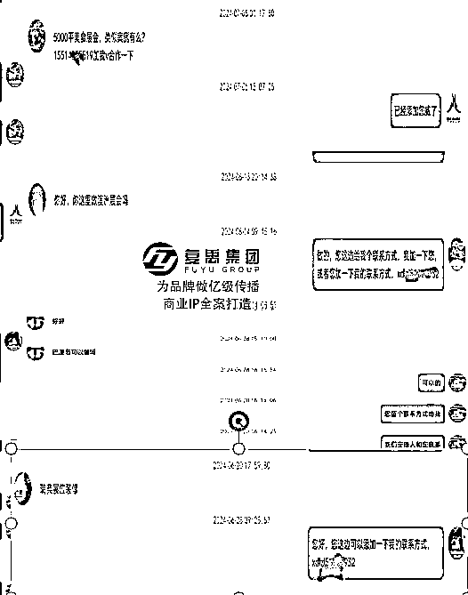

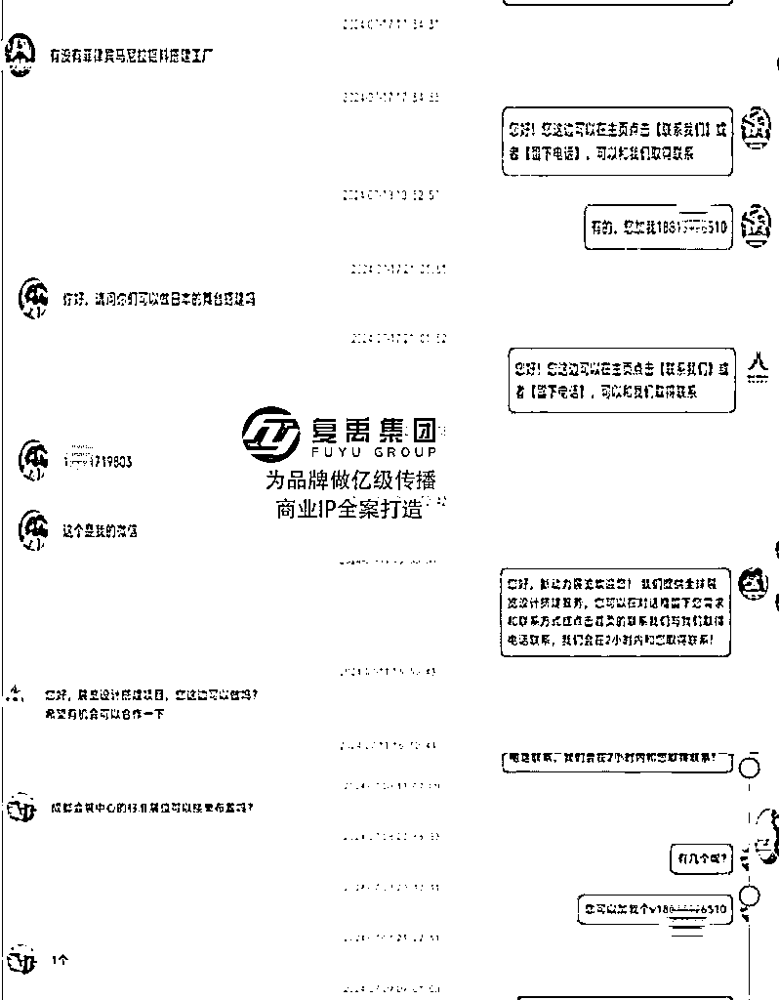

有人会问，这么多抖音账号，去哪里搞的？其实很简单，工厂、企业都有大量的员工，公司给每人提供1-2个 新开的手机号码，每人就能提供1-3个账号，授权给这套矩阵系统自动发布视频就好了，员工根本就不用管， 公司安排一个运营人员负责系统的操作就行了。相当于一个工作人员就能负责上百个账号，完成上百个销售 干的活，运用我们这套低成本高效率的内容生产工具，把卖点、服务和质量全部视频化，（没有什么起号、养号那些环节，只要不是被平台关黑屋的号，正常的号直接开干！）每天自动产出成百上千条视频，霸屏抢流量，轻松覆盖全国,不间断的帮企业引流获取客户。

## 我们帮助工厂用矩阵获取流量获客的案例比较多:

### 例如：槟榔厂发布1200条，634万流量曝光

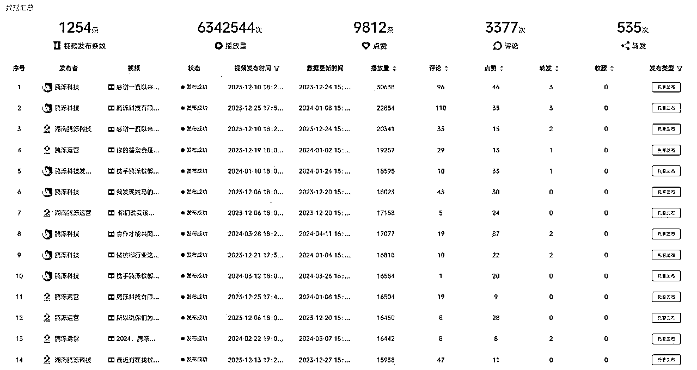

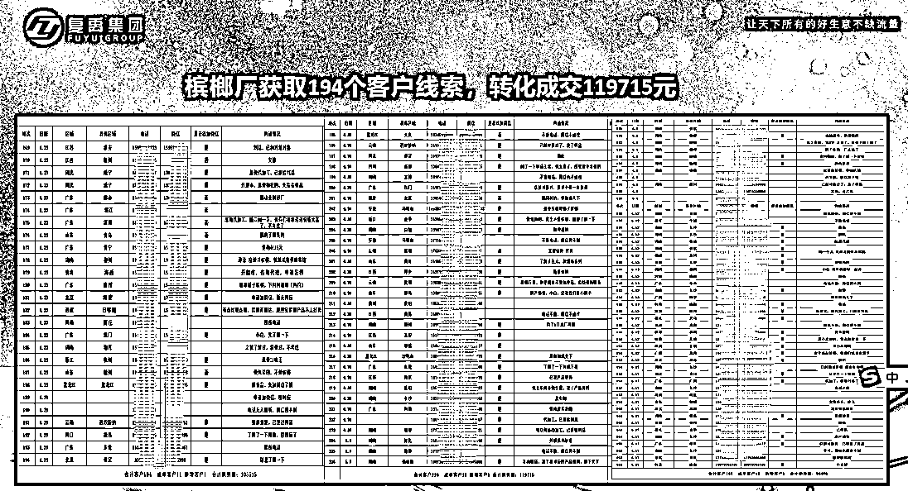

### 例如：礼品工厂矩阵：发布3700条获得1140万曝光量

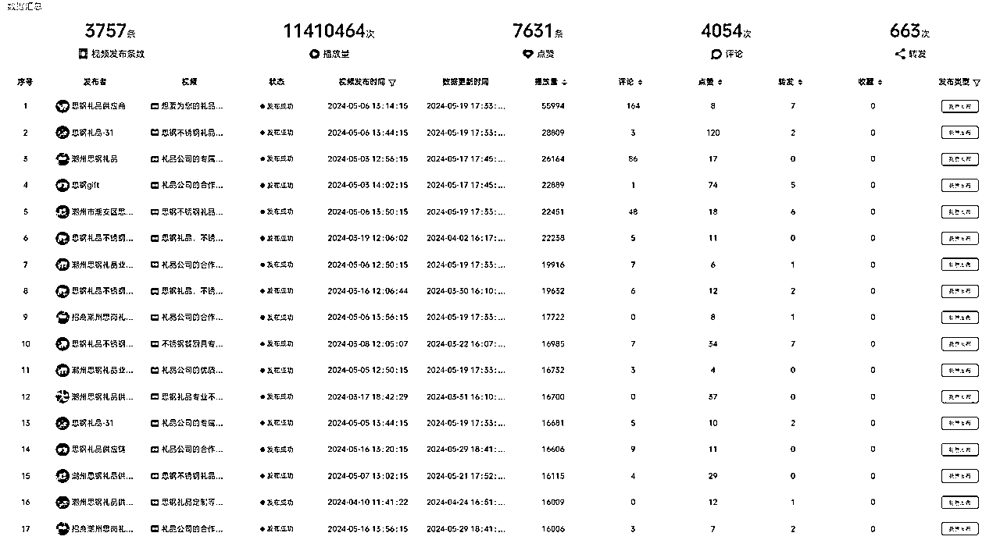

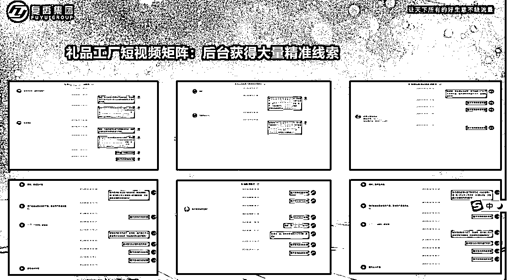

### 系统后台获取大量客户咨询线索。

## 这一家企业有点特别

# 这是一家在广州做美业大健康的集团公司（碧芙里）

* * *

## 陈总企业有工厂、有整容医院和高端医疗医院，并有两家上市企业，他们有个金字塔计划，但唯独缺了一层链接——线下门店，线下门店是链接C端客户与医疗的桥梁。但如何快速布局大量的线下门店，打通这一环节呢？传统的开店费钱成本过大，招商加盟又耗时周期长······

在跟我们合作之前，他们品牌在广州只有一家线下样板店

合作前我问他——你想在我这拿到什么样的结果？

他说 “老师，我想让品牌线下门店快速招商加盟到100家，打通我的企业金字塔第二层。”

那后来这个愿望实现了吗？直接看数据吧：

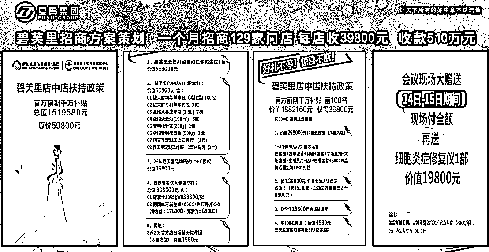

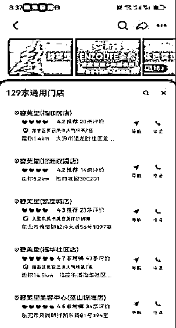

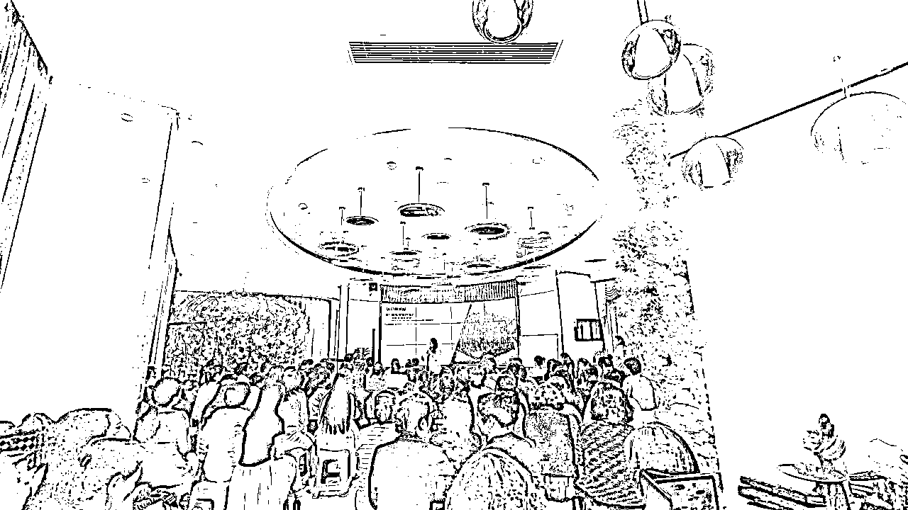

首先帮助他们梳理出吸引人的招商方案，线下结合线上的统一性运营。配合线下的招商会，

一个月时间完成129家门店的加盟。这129家都是有门店的老板，并愿意统一更换成品牌门头。

并形成连锁统一上线抖音平台，上架团购套餐，给每个门店赋能短视频矩阵流量 、直播，给门店引流客户

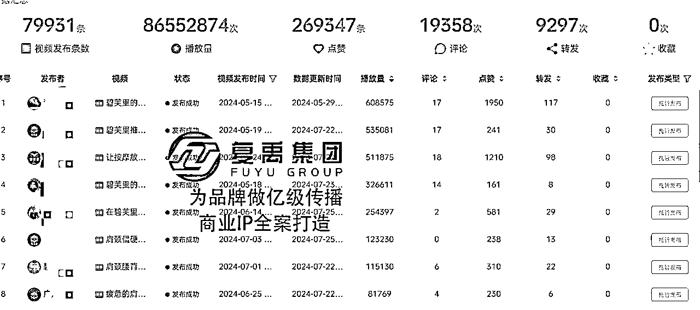

## 每个门店提供3个抖音账号，用矩阵系统托管发布7万多条视频，获得8600万+播放量（单条视频自然流，破60万+播放量）

品牌话题曝光9千万+

### 给品牌方门店做的线下培训

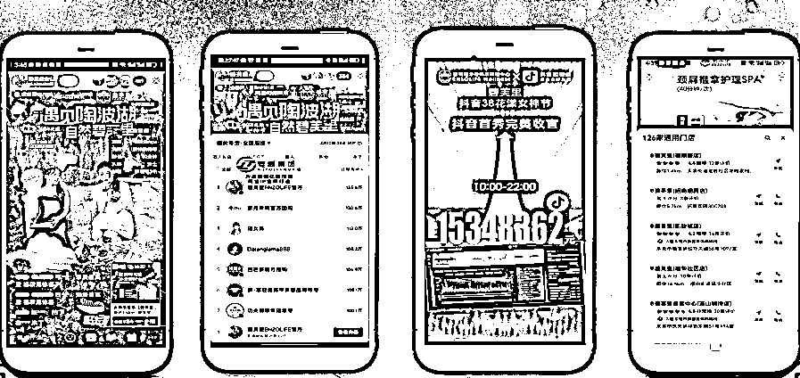

### 3月8日女神节，品牌首播一场售卖1500W GMV

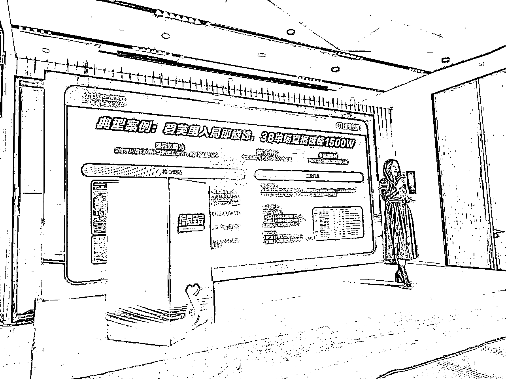

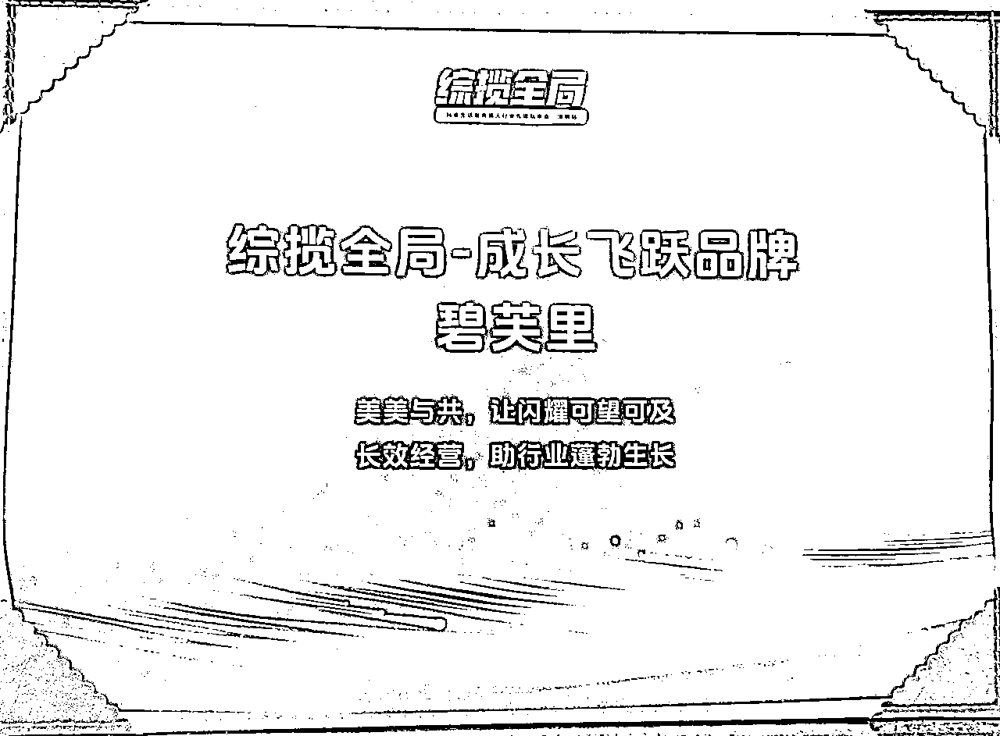

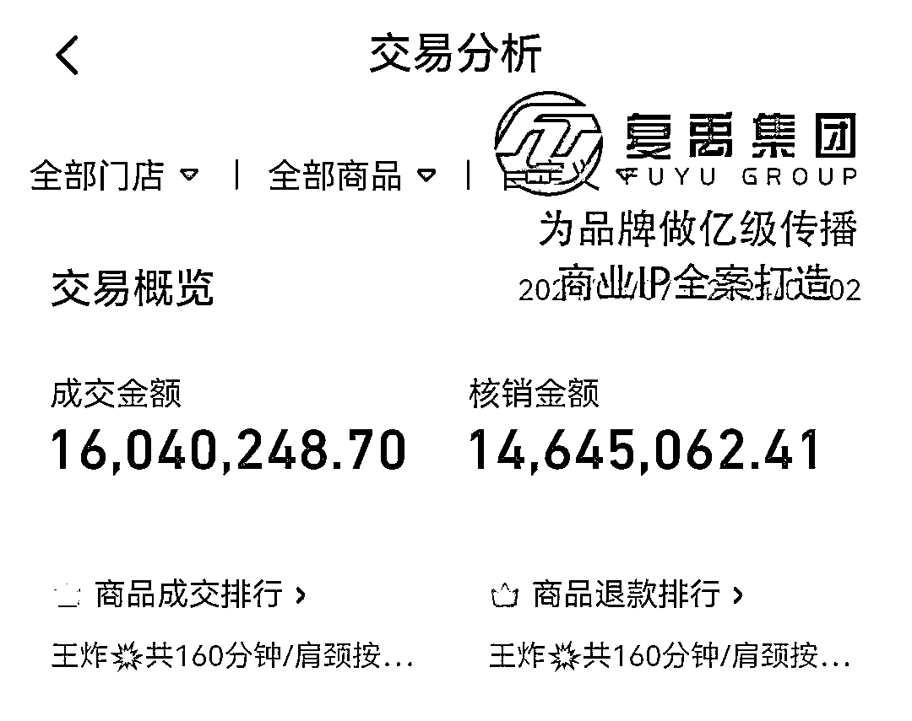

并成为抖音官方的标杆案例，并获得抖音官方颁布的成长飞跃奖牌

在我们团队的帮助下，一个月品牌实现129家门店的招商，之后3个月时间营业额成功突破1600w+！

当然，此时此刻，你看到这里，是否有被震撼到！按照传统的招商模式，是不可能在这么短的时间拿到这样的结果的。所以这就是新媒体玩法的可怕之处。如果你也有同样的问题，可以私信我、告诉我你的情况，我们聊聊，看是否能帮到你。

看过这些老板的案例后，你有没有发现一个共性，

这些老板都在通过抖音流量去转型，去接受新的宣传推广方式。

调整的过程中虽然有点艰辛，但结果注定是好的。

所以如果你想改变，想获取客流，想让生意好起来，你要做的第一步，就是必须得去做转型，结合新媒体 流量的打法。

得认可线上流量对于每一个企业的重要性，得沉下心去好好学习如何获取线上流量

可能看到这里，你是不是已经在怀疑自己了，怀疑我能不能像他们一样？我能不能也学会线上流量？

# 我有信心，你一定可以！

### 我的信心来自于 【我的团队】！

我们从2017年开始一直是给企业赋能流量的团队，同时也是抖音的4星级服务商，服务了有上千家的企业老板，成功帮助他们改善了自己的生意状况。我们深知，每一个企业老板做抖音从新手到老炮这期间会经历什么问题，应该如何解决。

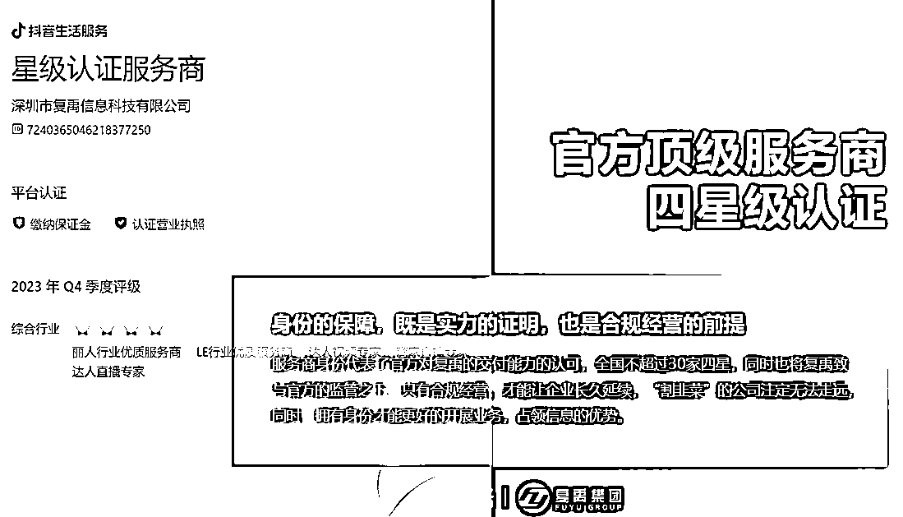

## 普及一下，四星级服务商每个月需要做到的GMV≥2000万

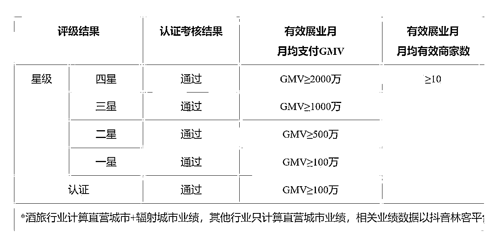

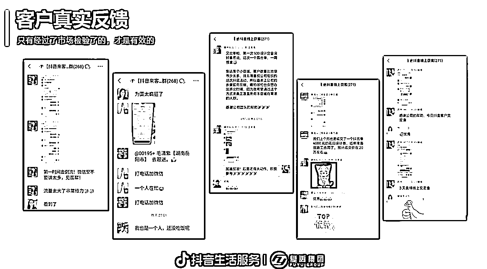

### 这些反馈只是很小的一部分，你可以去我朋友圈，看更多的好评案例。

我一直都认为：抖音是个平台性生意，而平台性生意的特点是有周期的，

和微博，公众号，淘宝、京东一样， 有属于他的红利期，在这个红利期内，普通人几乎是躺着挣钱。

现如今，抖音平台很大一部分红利是放在本地生活板块，平台在鼓励商家自运营抖音，

如果这个时候你还在等，可能红利真就等过去了。之后你再怎么努力也无力破局了。

所以我很迫切的希望所有企业老板能够重视起来，做好抖音！

我希望能听到你们的声音，听到你们告诉我:

你们门店/品牌在获取线上流量的过程中到底遇到了怎样的问题?

你们做抖音最大的难点是什么？

你们最希望我帮助你解决什么问题？

期待得到你的回应·······

# 最后容我小小的打一个广告

我想解答一下，我的【抖小慢矩阵系统】到底是什么？

其实他本质上是我们给企业老板们量身打造一款流量获客工具。

我们设计他的初衷，就是希望老板通过使用它，最后能够给企业带来大量的流量曝光，24小时不间断的给你引流 获客。让你企业降本增效，持续盈利，越来越好！

我们有多对一的陪跑教学群，多对一的指导，让你轻松上手运转起来。带着你们成功，给你们鼓励！

从文案，拍摄，剪辑到发布运营都有涵盖。

帮助没有基础的老板教打好基础，帮助有基础的老板做进阶提升，最主要的是我们给的价格实惠，毕竟是源头嘛！

⚠️你只需要按照我们给你提供的学习内容，听话，照做，就能拿到结果!

2023年是实体行业最为艰难的一年，熬死了很多企业新人，熬怕了很多企业老人。

但你千万别认为别人的倒下，会让你2024的生意回暖，

因为到了春天，行业还会进来新的一批创业者，他们依旧要瓜分你的客户，依旧要瓜分你的营业额！

你必须提前做好规划，有这个心理准备。

所以我呼吁每个企业老板必须提前做好做准备，毕竟翻身的机会永远留给能抓住他的人。

如果你想要更快速的学会如何用矩阵系统给企业引流获客，想要更快速的拿到结果

想要再24年领先同行，建立自己的流量优势。

期待你来选择我！

选择复禹，就两个字——靠谱！

# 最后的最后，我还给你准备了3份【见面礼】

包括【企业矩阵爆款文案库】、【抖音本地生活运营手册】、【抖音拍摄剪辑宝典】， 希望能够帮助到你。

# 企业矩阵爆款文案库

### 文案一

我行业在内卷 时代在洗牌

一定要和愿意 支持你的人在一起

而不是整天给你画大饼的人

我们要学会接纳市场 而不是止步不前

相互成就最终互为贵人

场景：店内真人出镜口播

拍摄：竖屏拍摄 7-10秒

关键词：＃地域+#产品+＃行业

### 文案二

老容易 胖容易

老板娘不容易

开店容易守店容易

赚点钱不容易

这不 不容易的一天又结束了

标题：老板娘不容易

音乐。愿你被这个世界温柔以待

场景。拍真人出镜忙忙碌碌

### 文案三

有人奔着价格找我 有人奔着专业找我

有人奔着口碑找我 有人奔着品质找我

不管你奔着什么来找我

风里雨里 我在店里等你

配乐 落

拍摄场景。店内场景，时长7秒

美键词：

#城市 #行业 #ip名

#同城热点

### 文案四

我不是张杰 给不了你天下

我也不是光良 给不了你童话

我能给你的 是专业是品质是服务

是性价比和一个靠谱的我

音乐：青花瓷（粤语版）

拍摄场景：口播或店内场景

### 文案伍

我不想忽悠客户 更不想欺骗客户

因为他们其实有很多选择

但他却在茫茫人海中选择了我

就凭这一价信任 就一定不能辜负

关键词：#行业#产品#店名

音乐：重生之我在异乡为异客

抬摄场景：真人出镜工作日常

### 文案六

出境是我 卖窗市是我

文案 剪辑 配音 也是我

全程都是我 其实也是没办法的

我不怕丑 我更怕出局

### 文案七

辛苦是幸福的 熬友是值得的

每天劳累是为了更好的明天

生活虽苦，但我不卖惨

感觉努力就是甜的，相信白己！

音乐：离别开出花

场景：老板自信走拍或服务客户过程

### 文案八

什么叫靠谱

前年在,去年在 今年在 年年在

冬天在 夏天在 一年四季都在

不靠造势 不靠炒作

靠回碑和品质用心

标题：靠服务一路前行

场景：真人出镜忙忙碌碌

音乐：再度重相逢

### 文案九

不要迷失在比价的路上

因为价格段有最低只有更低

你会发现

价格比着比着

质量就没了

所有好的品质和服务

都是和价格相匹配的

音乐：潮音椗律

场景：前台自拍

标题：价格比着比着 质量就沒了

形式：回播或者7秒视频

### 文案十

干我们这行的

不能打牌 不能打麻将 不能打顾客

更不能打家劫舍

要是连广告都不能打

不得憋死

配乐：搞笑

拍摄场景：店内场景，时长7秒

关键词：#城市#行业 #ip名#同城热点

### 文案十一

郭有才带火了菏泽

董宇辉带火了陕西

王婆带火了开封

我没才艺也没实力

只有靠谱的产品和服务

怎么才能

让我们这也火一把呢

标题：怎么做才好呢

音乐：诺言

场景：老板忙碌场景或回播视频7秒

关键词：#城市＃行业#产品

### 文案十二

谁不是为生活四处奔波

谁不会为了养家糊口

为了身上的责任 家人的幸福

我们只有不停前进

在磨难中笑着

加油，创业人！

### 文案十三

我是看到视频后找到她家的

她家的款式真的好好看

一次带了好几套夏款

而且她家的衣服质量也不错

比市场上好多都便宜

下次一定的带着我闺蜜过来

标题：XX这家女装是有度力吗？

居然天天都能出爆款

画面：顾客在店试穿，结账

旺场人气画面

### 文案十四

大家趁我没发达快来找我下单

不要看不起我一个卖XX的

当初高启强也只是一个卖鱼的

现在照顾生意发达了绝不忘记

### 文案十五

天天嚷嚷着想发财

结果拍个抖音都拉不下脸

高启强为了发财都能认干爹

想想自己真是愧疚

### 文案十六

家人们 吓死我了

高考第一天睡到中午12点

以为自己错过时间这下废了

一觉醒才想起我是做烧烤的

### 文案十七

我真的要说声抱歉

客户说看我抖音就忍不住想吃

可是我又没办法停下来

真是不好意思

### 文案十八

那时候我以为自己前途无限

后来我碰壁只能做餐饮

一做就是八年 餐饮成就了我

这辈子能把餐饮做好就很ok了

### 文案十九

员工真是难管

上班时间玩手机我说两句

还给我甩脸 真是心累

碰到这样的员工 该怎么办？

### 文案二十

听说到抖音上来要吹牛才能火

那我敢说在武汉

没有几个人不知道我家店

如果你真的不知道 当我没说

### 文案二十一

两年前啥都没有

这一片排面都是我打下来的

请大家不要嘲笑 以为我炫耀

这个店铺就是我最大的骄傲

### 文案二十二

不要问我五一打算干啥了

一个每天两点一线的人能干啥

玩也没地方去 朋友也不带我玩

我还是老老实实给你们服务吧

### 文案二十三

我终于明白

为什么干餐饮没赚到啥钱

但是却感觉自己很自信了

这都是客户给我的底气啊

### 文案二十四

90后在武汉做餐饮

没文化没学历竞争压力大

为了生意厚着脸皮拍抖音

刷到的朋友点个赞鼓励一下吧

### 文案二十伍

你能不能把你打麻将的钱

省下来找我卖件衣服

我也不为别的，主要是为了你的健康

你说麻将馆会不会找我麻烦？

### 文案二十六

我要是卖不出货。就赚不到钱

我就吃不起水果，喝不起奶茶

买不起衣服，看不起电影

不管你是做什么行业，

一定要先照顾我的生意

我才能拿着钱去照顾你的生意

### 文案二十七

自从干了（**行业）

满脑子全是顾客和业绩

送命式的努力

间接性的崩溃

做梦式的爆单

习惯性的失眠

又神奇服的自愈

### 文案二十八

今天 不冷不热也不下雨

天时地利都己经到位了 就差人和了

我的上帝们 你们啥时候出来

配合一下啊！

### 文案二十九

六月小愿望：

店里顾客要像医院候诊室，排队等候

产品开单要像医生开处方，单单成交

数钱数到手抽筋

个个不讲价，还说感谢！

想想都开心

### 文案三十

你早上打开抖音是我

晚上打开抖音还是我_

知道这是为什么吗？

因为得不到你的人

我也要得到你的“眼”

### 文案三十一

贵有贵的道理

不要迷失在比价的路上

因为价格没有最低，只有更低

到时候会发现价格比着比着质量没了

所有好的品质和服务都是和价格相匹配的

好品质总会遇到有眼光的人

好服务总会遇到欣赏他的人

### 文案三十二

天天抖音不是为了博眼球

而是想让你知道

从1月一号到12月31号

周一到周日，我一直都在岗

-对工作负责的人！

才是最值得信赖的人

### 文案三十三

万丈高楼平地起，发财还得靠自己

今天搬砖不努力，明天缺少人民币

在长沙想买xxx的姐妹们

可以来店了

### 文案三十四

如今，五一出去游得看钱

月入10万的国外游

月入5万的省外游

月入1万的周边游

月入5千的老家游

不管你收入多少，我不嫌弃

可以来我店里一游

### 文案三十五

做生意跟谈恋爱如比之像

总联系吧，怕对方烦

不联系吧，又怕被人横刀夺爱

发了信息没回，心里一天都在忐忑

死鬼，你能不能主动点？

### 文案三十六

观察我一年，我在

观察我2年，我也在

观察我5年，我还在

别人用钱砸广告，县花一现

我用钱做品质，合作一生

每位受益者，都是我们免费的广告

### 文案三十七

本来挣钱就已经很难了

结果现在还要想各种文案来发抖音

之前九年教育的作文经常犯难

如今为了稳住老板娘的位置

硬硬生生被逼成 出口成章

### 文案三十八

好产品就像好姑娘

你看开封王婆介绍好姑娘

你喜欢的 别人也喜欢

下手早的就是媳妇，下手晚的就是大嫂

我是在长沙做（**行业）的丈母娘

你还不快来！

### 文案三十九

你到处找类似的，更便宜的

结果处处上当，当当不一样

合理的利润，才有合理的服务

细水长流，才是长久之计！

我在xx（城市）做了5年的教学

就是你找的那个长久之人

### 文案四十

人生得意须尽欢 基本全年无休

新的一天 新的营业

充满新的期待和欢喜

今日已到岗，等你来撩

### 文案四十一

我是做xx的，

不会花言巧语，喜欢实实在在

希望

每月能多接几个单子

每天能多交几个朋友

让自己家庭生活多一些改善

### 文案四十二

你们带着期待来

那我必须让你们满载而归

被认可是一种幸福

被信任是一种责任

一信任换信任，以真心对真心

双向奔赴的感觉才是最完美的

感谢一直支持我的你

标题：生意红火原来就这几个字，

音乐：诺言

场景;口播或老板忙碌场景

标签．#行业#城市#产品

### 文案四十三

市场很乱，同行很多！

价格虽然是关键

但我认为品质和服务更为重要：

我不在意你去对比

但是 我更希望你回来以后跟我说

还是你最靠谱

标题：我一直在

音乐：诺言

场景：口播或老板忙碌场景

标签：#行业#城市#产品

### 文案四十四

所谓性价比

比的是细节工艺

比的是服务 售后

比的是专业效果

而不是简单的一句

他比你便宜

标题：性价比到底是比什么？

音乐：若是月亮还没来

场景：老板忙碌场景或口播视频7秒

关键词：#城市 #行业#产品

### 文案四十五

什么叫贵?什么叫便宜？

价格低没有效果的才叫贵

满怀希望后变失望才叫贵

达到预期效果能解决你问题的

就叫物有所值才叫便宜

标题：能解决问题的贵都是便宜

音乐： 落

场景：老板忙碌视频7秒

关键词：#城市#行业#产品

### 文案四十六

做生意 不拼价格战

因为拼着拼着 质量就没了

做生意 只走品质路

因为走着走着口碑更好了

做生意就是这样

你信任我！我决不辜负你！

标题：你信任我，我绝不辜负你

音乐：希望你被这个世界爱着

场景：本人出镜+日常工作

关键词：#城市#行业#产品名

### 文案四十七

我行业在内卷 时代在洗牌

一定要和愿意

支持你的人在一起

而不是整天给你画大饼的人

我们要学会接纳市场

而不是止步不前

相互成就 最终互为贵人

场景：店内真人出镜口播

拍摄：竖屏拍摄 7-10秒

关键词：＃地域＃产品十＃行业

### 文案四十八

你们都说今年的生意难做

我感觉挺容易的嘛

容易亏 容易老

容易关行 容易倒

还容易破产受不了

你们就说容不容易吧

场景：店内口播

拍摄：店内自拍 时长7-10秒

关键词：＃地域＃产品＃行业

### 文案四十九

做XX行业XX多年

做生意就一个实字

实实在在做生意

实实在在挣差价

实实在在做服务

实实在在赢人心

场景：行头+店内

拍摄：店内回播 时长7-10秒

关键词：＃地域＃产品＃行业

### 文案五十

一个顾套进店叫偶然

两个顾客进店叫巧合

三个顾客概率越来越多

的顾客都选择就叫口碑

所以你做决定我让你满意

场景：店内随拍+产品

拍摄：店内产品合拍 时长7-10秒

关键词：＃地域＃产品＃行业

### 文案五十一

做生意做出了恩爱的感觉

你找来我我是万分喜欢

不来找我，我是牵肠挂肚

初次聊天更有恋爱的味道

毕竟你说句在吗

我得兴奋的不得了

背景音乐： Slide

关键洞：＃服装兴＃产品十＃行业

### 行业节日文案

春节文案

号外号外，（****店）春节特惠套餐已上线！

（双人餐128，四人餐198，六人餐只要288）

岁末将至，龙年踏歌而来，

最幸福的时刻莫过于和家人欢乐相聚，共享美食

一食一味，一餐一情，每一道佳肴都是爱的表达

来（****店），我们一起共度新春佳节！

有种温暖叫回家，有种幸福叫团聚，有种味道呀叫年夜饭

喜迎龙年，我们***菜馆春节不打烊，年夜饭可以开始预定咯

今年的年夜饭就让家人好好歇一歇吧

来（***菜馆），我负责美味佳肴，你负责全家团聚，

你们只管开心吃喝过大年，剩下的放心交给我安排！

新年到，祝福到！

（****店）祝大家一帆风顺，二龙腾飞，三阳开泰，四季平安，

五福临门，六六大顺，七星高照，八方来财，

九九同心，十全十美，百事可乐！

（老文火锅）给大家拜年啦，祝所有新老顾客（龙）年快乐！

（****店）全体员工给大家拜年啦！

祝您事事如意岁岁安，福气满满好运来

岁岁年年常安康，朝朝暮暮有欢喜！

欢迎新老顾客光临本店，共度新春佳节

我怕大年三十晚上的烟花声太响，祝福声太多，

所以今天（**哥）携手我们（***店）全体员工，提前向你送上春节祝福！

愿大家，新年胜旧年，将来胜过往。

年年皆顺利，岁岁都欢喜！

2024年，你的生活百味，都由（****店）来调配。

欢迎新老顾客光临本店，共度元旦佳节！

重新认识一下我，我叫（***），这是我在（*城市开**店）以来，度过的第三个春节，

我不是什么网红老板，也不是什么专业的带货主播，

我只是一个每天起早贪黑用心做（***）的**行业人，

这家**店寄托了我的梦想，也养活了我和几个员工们的家庭。

借此新春佳节之际，我想真诚的感谢一下新老顾客一直以来的支持

祝福每一位刷到我视频的朋友，2024年越来越好，越过越旺！

元旦节文案

越过2023，跨进2024！

新的一年（***店），祝所有新老顾客

所求皆所愿，所行皆坦途！

感恩一路走来，你们从顾客变成了朋友

我们选择了真诚和用心，您选择了信任和支持

2024年，我们会继续努力，坚持用好的品质，做好的口味！

实实在在做生意，不负你们的期待！

元宵节文案

正月十五汤圆甜，祝福送到你身边！

祝你一年胜一年，好运好事喜连连

（***店）全体员工祝各位新老顾客元宵节快乐

月圆之夜，欢聚之时，想要和家人在正月十五吃顿团圆饭的各位顾客

一定要记得提前预约哦，我在（鼓楼路18号）等你光临。

三八节文案

女人长得漂亮叫天生丽质，活得漂亮叫天生励志！

不一定要做谁的公主，但一定要做自己的女王，

3月8号这天，如果你恰好在泰冯路附近，

来（****店），找我领取属于你的女神节礼物吧，让我来宠你!

我希望不管是女生节还是女神节，所有的女性同胞都能好好的宠爱自己

属于女人的数字从来都不是年龄，而是故事

祝愿我所有可爱的顾客们，未来既能挣钱养家又能貌美如花。

3月八号如果你恰好在（泰冯路）附近，欢迎来我的（***店），找我领取你的女生节礼物

在（城市）开（***）店8年了

一不小心就熬到了阿姨级别

突然有点怀念姐姐这个称呼了

岁月终究没有偏袒谁

如果你3月8号恰好路过我的店

可以叫我一声姐姐吗？

315热点

诚信经营不仅只在315，而是要365天

我开***店8年，始终不敢忘记初心

价格合理是我的标准，卫生品质是我的承诺，顾客满意是我的追求！

用心做味道，良心做品质，我相信诚信做生意的人干什么都会有好运！

欢迎大家来我们上林路（****店）监督检查

我在店里期待你的光临！

2.做***（行业）这么多年，越来越感受到诚信315

不仅仅只是一句空洞的口号

而是实实在在的承诺和行动！

我在（泰冯路开火锅店8年），愿为诚信做代言！

315不止一天，而是我的365天

我已等你好多天， 你到底哪一天来？

愚人节文案

1.  据说今天愚人节说谎无罪，

但是在做***行业这件事情上，我们(***店)从来不敢愚人

菜品不愚人，服务不愚人，价格不愚人

诚实守信做生意，实实在在做买卖，靠谱的我等你光临！、

1.  据说今天说谎可以被原谅，那刷到这条视频的你，在评论区叫我一声美女老板娘可好？

今天愚人节我可不愚人，凡是喊我美女的，今天来（***店），统统送***！

最后祝大家天天愚愚快快，总是愚过天晴，一生如愚得水，愚人节 停顿）快乐！

清明节文案

今天有客人问我，清明节放不放假？我在这回答一下：

地球不爆炸我们不放假，宇宙不重启，我们不休息！

风里雨里节日里，我们都在（****店）等你，

没有四季，只有两季，你来就是旺季，你走就是淡季

最后，清明时节，愿所有家人们幸福安康，清清明明每一天！

五一文案

最近啊天水喊我去吃麻辣烫，王婆喊我去开封相亲，

云南喊我去过泼水节，潍坊喊我去过风筝节

我都没去，知道为什么吗？我可不是没钱去旅游啊，

主要是我担心啊住在（鼓楼区）的那些，我亲爱的顾客们

要是五一想做（***）了，找不到我可怎么办呐。

母亲节文案

请一定要善待你的妈妈，因为她的大半生都是为你而活！

也请一定要善待你自己，因为当你成为母亲之后啊，你几乎只为孩子而活

马上就是母亲节了，5月11号带着你的妈妈

来（健康路***馆）感受下正宗的（***产品）吧，

评论区回复妈妈我爱你，我给你准备了一份母亲节礼物

我们一起来送给你亲爱的妈妈。

讲多少句的母亲节快乐都不如好好陪妈妈吃一顿饭

5月11号，让妈妈好好歇一歇，带她来***店享受一次正宗的**服务吧，

凡事进店的妈妈们，我们都准备了一份特别的**产品送给您

愿您岁月静好，生活安康！

520节日文案

520全网都在晒礼物，我也来晒晒我的，

我晒的不是包不是花也不是大钻戒

我要晒的是这些年一直支持我生意的顾客们，

你们的信任和选择，是我520收到的最好的礼物，

感恩有你，做我的顾客，让我宠你！

所有的节日，都是为了提醒大家，不要忘了爱与被爱

生活的美好一半来自美食，一半来自陪你享受美食的人

在这个浪漫的520，带上心爱的人，来我们（****店）共度浪漫时光吧！

山河远阔，人间烟火，

所幸之事，不过饱餐与被爱，

别人都在等520，而我不一样，

我在店里等你！

来日方长，岁月如糖，往后余生，

做我的顾客，我宠你！

六一节日文案

成年人如何理直气壮的过六一？

管他呢，情人节520我都没好好过过，现在过个六一不过分吧？

谁在说你不能过六一？你就告诉他，

就算我长相过不了六一，但是我的收入可以啊

就算我的年龄过不了六一，但是我的存折可以啊!

不过其实过不过六一啊不是重点，

重点是希望我的顾客们往后的日子里，多的是不需要理由的快乐

祝大家无论几岁，童心万岁！六一快乐！

好看的皮囊千篇一律，可爱的灵魂要过六一

人生很短，别留遗憾，想吃就吃，想玩就玩！

六一不只是小朋友的专利，也是我们大朋友的狂欢！

我在（太平路）开了家（***店），这个六一为大家服务我快乐加倍！

1.  儿童节不只是给小孩子过的

它的意义是即使你成为了全世界的大人，

但你仍然是某个人的小朋友

愿你历尽千帆，也有人能让你重新做回孩子，

无忧无虑，永远保持一颗童心！

在这里，（**姐）祝大朋友和小朋友一直被爱，

尽情可爱，永远被这个世界温柔以待！

高考文案

1.  很多（南京）人竟然都不知道为什么高考时间是6月789号

因为678寓意着录取吧，6月9寓意着录取后庆祝摆酒

（***店）在此预祝（城市）考生们，旗开得胜，

评论区打上6789，我们一起为高考学子们加油!

1.  {老板对着店员叮嘱}

小王啊，这两天高考，你一会通知所有员工有几点咱们要注意一下啊。

第一个，（学生凭高考证到店，就送一杯饮品），

第二个，如果出现等位的情况，咱们要优先安排高考生就餐，记得要安抚一下其他的顾客

第三个，如果有家长来给学子打包餐食，一定要告诉厨房加紧出餐，好吧，

千万不能耽误孩子们吃饭！这两天辛苦一下大家多费点心，孩子们高考很重要

还有啊，咱们服务人员如果遇到高考的学子，别忘了给他们加油打气，祝他们得偿所愿，金榜题名！

让毕业不留遗憾，让相聚更加精彩，

升学宴应该去哪里办，来（***菜馆），让我们不负韶华，”晏遇”前程。

咱们家超大的大厅用餐区和十几间舒适休闲的大包间，可同时容纳（300）人用餐，

亲戚再多也坐得下，宾客体验感十足，让你特别有牌面。

期待你来啊文案菜馆和亲朋好友一起分享金榜题名的喜悦！

今年的高考恰好遇上端午节，美好的祝福送给孩子们

高考遇端午，个个全中985

家家插艾蒿，最差录取211

我代表（***馆）全体员工

祝孩子们高考顺利，金榜题名，高“粽”状元！加油！

今天高考落幕，无论结果如何，

（***姐）都在这里祝愿所有参加高考的少年们,，前程似锦！

愿你们不为往事扰，只为余生笑，一切过往皆为序章，所有将来皆可盼望！

虽然高考已经结束，但青春永不散场。

6月9号到15号，所有参加高考的考生凭准考证到店都能（打88折）。

千万别错过这波优惠哦！

在（城市），高考那天，出租车和公交车都是免费的，

校门口也会发免费的矿泉水，学校附近的工地都会为你停工，

全世界都在为你的前途让路，愿你此去前程似锦，一帆风顺。

为助力高考，（***店）店在6月7日至6月9日，

凡进店考生凭准考证可以领取金榜题名套餐一份。

十年寒窗磨一剑，今朝出鞘试风芒，高考即将到来，祝愿所有考生乘风破浪，金榜题名！

端午文案

粽叶飘香香，情谊在荡漾；龙舟响当当，好事要成双！

香包鼓囊囊，互赠情谊长；艾蒿绿油油，思念永长久！

端午佳节到，祝福来报道；（***店），期待您来到！

粽有千般好，美味不单调。

食粽点艾，一节一念。

愿人间烟火处，处处皆平安。

（****店）祝各位：端午安康！

包厢尚有余位，亲们请尽快预定哦！

端午节，祝我的顾客们，

事业“粽”是蒸蒸日上

前途“粽”是闪闪发光

爱情“粽”是甜甜如蜜

身体“粽”是身强力壮

（****馆），未来总“粽”是与你同行！

中秋文案

月到中秋分外圆，花前月下人团圆。

被认可是一种幸福，被信任是一种责任，

感谢所有新老客户一直以来的信任和支持

又是一年中秋节，（***店）全体员工

祝您快乐，不止中秋，而是生活中的每一天！

我们在（城市***路）期待与您共度中秋佳节！

中秋佳节到，所有人都在等着团圆

而我不一样，我在等着你，等你带着家人来（***路）找我吃（***）

你只管放心带家人来，剩下的全都交给我。

保你过一个阖家欢乐的难忘中秋！

即使远在他乡不能回家团圆，一个人也要过好中秋

如果觉得孤单，不妨来（***店）和我们一起过中秋

这一天，我们便是你的家人，想吃啥面我给你做，想聊啥天我陪你聊

我在（***路）同你一起过中秋，不见不散哦！

国庆文案

如果奇迹有颜色，那一定是中国红

何其有幸，生于华夏

（****店）全体员工恭候您的光临，与您共迎国庆！

**行业人没有假期，中秋国庆不打烊，恭候您的光临

温暖你的事服务，感动你的是美食，愿美好如期而至。

国期间请提前预约哦！

国庆不打烊，小店服务不变价格不变配置不变，恭候您的光临！

温馨提示：为您更好的***体验，假期期间提前预定哦！

地球不爆炸，我们不放假，国庆我们坚守岗位，喜迎国庆，想新老顾客致谢

何其有幸，生于华夏，愿山河无恙，祖国繁荣昌盛！

携（***店)全体员工欢迎您的到来！

何其有幸生于华夏，不经战乱，不缺衣食！

我在(城市)为祖国母亲庆生，

祝伟大的祖国繁荣昌盛，祝我家亲爱的顾客蒸蒸日上！

圣诞节文案

(***城市)的朋友们，见一面吧，在冬天，在（***店），在浪漫的圣诞节

不管是东方节还是西方节，都是为了提醒我们和爱的人见一面。

这个圣诞，带你爱的那个他/她来（****店）见一面吧！

今天平安夜，明天圣诞节，2023走到尾声，

愿（城市）的朋友喜欢的都拥有，失去的都释怀

节日的美好，莫过于和爱人朋友欢聚，共享美味

圣诞来临之际，(****店)特地上新了浪费双人餐

戳左下角带上你最好的朋友一起来(***）吧！

### 创业故事类

1、刚开____ （摆摊）最不支持的是亲人，最先看笑话的是朋友。最信任的是陌生人，不要看不起任何一个行业，摆摊不丢人

2、不是我选择了____（行业品类），是____（行业品类）收留了我。包容了我的平庸和自卑。给了我尊严的价值，一路走来不容易。感恩过去，感恩所有

3、____（90后）年农村人，我就是一个做____（行业品类）的普通人，只想通过自己的双手养活一家人，也许没有那么体面，但我真的在努力

4、重新自我介绍一下吧，我是____人（四川省成都市嘉田县人），在____（广州）卖____（行业品类），混的还不错，半辈子挣了三个亿，一个回忆，一个失忆，一个不容易

5、____（90年）农村女，在____（广州）做____（行业品类），一天做300斤麦了1w+（晒自己的业绩），承蒙大家厚爱，我会加倍努力，生活很苦，但有你们很甜

6、90年农村人，我就是一个做____（行业品类）的____（宝妈-女孩），只想通过自己的双手养活一家人，也许没有那么体面，但我真的在努力

7、你们不要笑我吃得多，我的工作干的是体力活，每天起早贪黑不停干____（行业品类），到饭点也从来没有按时吃过，忙了大半天，趁不忙赶紧吃两口，吃完继续拼

8、以前是要面子，根本没想过自己会做____（行业品类），放下面子后发现随便做点什么都比打工强，没有什么比穷更没面子，你们说呢

9、今天一位顾客家里人生日，说就冲着我们家的口味来的，感谢信任，庆幸自己当初选择做____（行业品类），靠自己的双手打拼有今天的结果，加油

10、____（96）年的我今年就____（27）岁了，高中毕业，摆摊开店做____（行业品类）5年了，起不完的早，熬最长的夜，干最累的活，拿最干净的Q，给90后丢脸了

11、刚做____（行业品类）时朋友都说我最多干三个月，现在五年多了，买了车和房，全国各地都有徒弟很庆幸自己的坚持

12、我姓____（黄），在____（广州）做____（行业品类），一人挑起了家庭重担，我不算漂亮但比较实在，划到请不要嫌弃，你的一句话我会开心半天，也会难过一天

13、天天____（工作日常，比如进货上货忙碌辛苦的样子），手和脸都被***伤过，我狼狈的样子你会划过去，再苦再累也是高兴的，要给家人最好的生活再累都值

14、有些人一看到我是做____（行业品类）的，就立马取关了，可恨的连赞也取消了，只是出身不同，就因为我不是明星，不是网红，至于吗

15、我是____（安徽）人，在____（成都）做____（行业品类），他们说我脸皮厚，不怕丢脸，我认为在这个社会比起没有Q ，面子就不值一提，你觉得呢？

16、____（四川成都）人，____（90年的马），做____（行业品类）已经五年。朋友同学都疏远瞧不起，靠自己双手打拼。我不觉得丢人，不努力才丢人

17、今天做了____（工作日常，比如扛了几十待的货物等），从没休息过一天，可能我狼狈的样子你会划过，再苦再累我也开心，因为我要给父母最好的

18、____（90年）农村女，在成都做____（行业品类），每天14小时____（工作日常，辛苦忙碌的内容），不敢休息，没什么大本事，能让父母过好就好

19、这就是真实的我，每天做____（行业日常），虽然我是女人，但什么苦我都愿意吃，只要不向生活低头，努力就会有希望，越努力，越幸运

20、每天都在____（工作日常），周末从未休息过一天，可能我狼狈的样子你会划过，再苦再累我也是开心的，因为要给家人最好的

21、____（90年）的我今年是创业第5年，不偷不抢靠自己努力有车有房，一路走来别人只看结果，却不知道我付出了多少

22、今天店里师傅请假，三点起来____（备货），一直忙到下午两点，看我狼狈的吃饭你也许会划过，但我宁愿苦一阵子也不要苦一辈子

23、我是____（安徽人）、在____（广州）做____（行业品类），他们说我脸皮厚，到处卖脸，朋友都疏远我，屏蔽我，我认为在这个社会比起没钱，面子根本就不值一提，你们说呢？

25、做餐饮嘛！谁不是骂骂咧咧说不干了！第二天有老老实实去开门卖____（产品）！谁不是天天喊着休息！还屁颠屁颠干全勤！更无语的是还想厚脸皮拿餐饮终身成就奖

27、每天发抖音，不是为了当网红，做____（行业品类）是我工作，顾客是我努力的目标，明人不说暗话，我就是想你们都刷到我，来我这里，我请你____（产品）

28、____（96）年的我今年就____（27岁）了，小学毕业，从摆地摊到现在，做____（行业品类），起不完的早，熬最长的夜，忙碌一天一顿饭，给90后丢脸

29、每天过着两点一线的生活，除了____（行业品类）就是带徒弟，出去也是高铁站接徒弟，谁能接受一个没时间陪他还整天不修边幅的女人呢？

30、在外打拼多年，做——（行业品类）——（8）年，——（35）岁拥有自己的第一台车，相比很多人可能有点晚。但是靠自己双手打拼回来的一切，为了家人再苦再累也是值

31、有朋友说我可能是——（广东）最漂亮的——（行业品类）老板娘，我想说，做人一定要低调，把可能两个字去掉，比起夸我漂亮，我更希望你夸我——（行业品类）做的好

33、当初摆摊做——（行业品类）的时候，不敢参加亲戚聚会，怕被疏远瞧不起，现在九年开了两家店一个摊，发现放下面子，你才能成功

34、我是——（四川人），在——（广州）做——（行业品类），每天做——（行业品类）十几个小时，没学历没背景，不知道我这样只会做——（行业品类）的——（90后）女生，在你们心中美不美？

35、我是——（肇庆人），在——（广州）摆滩——（行业品类）。他们都说我脸皮厚，到处去卖脸，我认为在这个社会比起没Q 面子完全不值一提！你觉得呢？

36、每天做——（工作内容）出摊，一年到头从未休息过一天，可能我狼狈的样子你会划过，再苦再累我也觉得，争取给父母最好的

37、早上7点起床做了——（准备工作内容），从不敢休息，我这狼狈的样子你可能会划过，为了家人我愿意放下面子，我要努力靠自己

38、——（广西人）在——（广州番禺区）摆摊——（行业品类），如果你也刷到了我，刚好你也在广州，过来天河区我请你吃

39、——（30）岁不甘打工的我，花了小吃车1600，煤气炉180，5个盆子230，就这样当起了——（行业品类）老板

40、介绍一下，这是我的特色——（行业品类），每天出摊就围满了人，来吃全是回头客，虽然不起眼，但全家5口全靠它

# 如果你需要，【抖音本地生活运营手册】、【抖音拍摄剪辑宝典】可以私信找我领取！微信回复暗号：520+你的行业

### 2、如果你想要询价【抖小慢AI矩阵系统】，或者还有其他问题，也欢迎私信我。

### 微信回复暗号：666（实体门店）/888(工厂）/999（企业）

### 3、希望能得到你的答复，帮助我更深入的了解实体老板的需求，更好服务你们。

你们门店/品牌在获取线上流量的过程中到底遇到了怎样的问题?

你们做抖音最大的难点是什么？

你们最希望我帮助你解决什么问题？