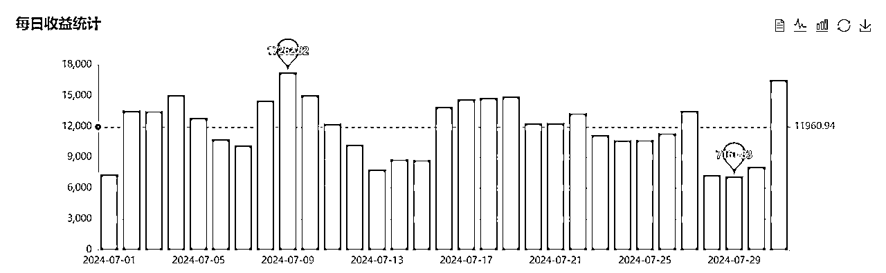
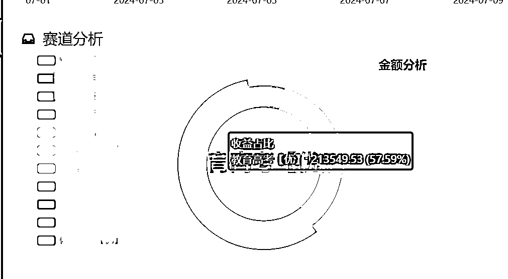

# 公众号流量主7月营收36w复盘。

> 来源：[https://maoge17888.feishu.cn/docx/O5bkdDpfNoVImQxPhBTcBzkvnrX](https://maoge17888.feishu.cn/docx/O5bkdDpfNoVImQxPhBTcBzkvnrX)

# 写在前面

真的好难，四五月份对于做公众号矩阵的来说，真的是毁灭性的，这2个月太难熬了，好多同行都转型了，无奈自己是个犟种，总觉得还有机会，还可以，毕竟这么多年做项目，不管做什么项目，总感觉上半年的3月份后的一段时间很难过。

6月份的时候，流量已经开始慢慢恢复了，立即就开始扩大了账号的数量，6月一个月账号数量就从300多增加了到了将近600，7月底的时候，我看已经有900多个账号了。

期间还很荣幸担任了6月份的公众号航海教练，5月份的时候，我和生财官方的叮叮沟通航海的事宜，当时5月份流量真的是很差，很多号都是起了几天就嘎了，那个时候我给他说，我说6月份可能有机会的赛道是教育赛道和影视赛道，教育赛道是因为高考了，每年这个时间段，都有热点。影视赛道是暑期有多个热播剧上线，那个时候炒了好几年的《庆余年2》也在6月份上映。我觉得热度应该足够大。

好了，接下来我将详细分析这2个月的得与失。

本文所有数据为真实数据，不包含任何水分，不提供任何指导建议，仅为复盘经验分享。

# 得

最大的感受就是赛道定生死，之前我也无数次告诉自己一定要选择周期性赛道，然后通过不断的刷看一看发现新的机会。

我们布局了多个赛道，然而账号数量占比只有12%的教育赛道，却拿到了57%的收益占比。

有一些赛道，虽然之前的是收益可以，但是7月表现却很差。

对于电商来说，选品定生死，对于公众号爆文这个项目，赛道定生死，很多时候，在错误的时间，去做了错误的赛道，白白浪费了大量的时间，做同样的事情，却有不一样的结果。

6月，恰逢姜萍这个事件爆发，持续有10天左右，也为教育这个赛道注入很多流量，当时我们铺了很多姜萍的文章，从这个事件上拿到的收益起码就有3w。后来由于某种原因，全网都不能发了，这个事件算是过去了。

那个时候，我们的账号经常排在次幂数据的单领域榜首，有的时候前几都是我们的账号。

不过教育这个赛道，现在流量下滑已经很严重了，几乎是腰斩，毕竟现在正在举办奥运会，可能大众的目光都聚焦在奥运了，而且现在教育根本没有啥比较有看点的话题了，除了一些败坏师德的负面信息，当然了，这些负面信息，我们一般是不写的。毕竟有不少的风险。

教育这个赛道收益超出预期，还有一些赛道表现也还可以，不过都在预料之中，这里就不再赘述。

# 失

6月份的时候看到有个文案赛道比较火，当时看到很多小号，在发了一段时间，都取得了不错的流量，甚至是篇篇10w+，研究如何生成文章后，就去做了，当时上了将近100个号，做了有半个月的时间，起号的极少，没有一个爆的。当时其实内容已经过度饱和了，看到的哪些爆的小号是4月5月布局的。

原来四五月份的时候，我们这么惨，别人做文案赛道却做的这么好。

流量不会消失，只会转移。

在白白浪费了半个月的时间后，我直接放弃了这个赛道，当时把这个赛道的账号直接换赛道了。还好是换的及时，虽然文案上浪费了这么久，但是换到别的赛道也有起的。总归是不亏。

后来了解到，这个文案赛道，有的是大号带小号起来的，有的是迁移的，有粉丝基础，这样起号比较快。纯自然流在后来几乎没有机会了。

还有一个坑，就是影评赛道，当时虽然预测《庆余年2》会大火，但是没有想到的是，这个剧居然这次播放这么快，不到一个月就播完了。这种一旦完结，热度就很快消退了。

正常应该去认真研究下剧情播放周期，完全凭着之前的经验去判断了，实际上我也不经常看电视剧，对这些也不了解，以为是电视剧，就要播放很久。

最终导致研究了一套提示词，又上了一批账号，但是收效甚微。

还有一个坑，就是策略问题了，明明六七月份，有些赛道表现不错，但是当时还想着寻找新的赛道，真的是即浪费时间，又白白错过了流量。

正确的策略应该是，既然知道哪些赛道不错，就尽可能多铺号，多去搞，而不是研究一个未知的赛道，去白白浪费了账号。

# 写在最后

我知道，当看到月营收36w的时候，有人是质疑，有人是眼红，有人觉得运营1000个号是天方夜谭，有人对AI嗤之以鼻，觉得难登大雅之堂。

关于写作文章我们用的是claude，详细的使用方法，感兴趣的可以去看6月航海，如何3分钟创作1篇原创文章。

至于提效，我们用的是影刀，同样的在航海中我也详细讲述了如何去做。

公众号爆文这个项目，目前还在红利期，有精力可以去试试，其实航海里面有很多教练总结的经验，足够学习了。

致自己：项目不是学出来的，是做出来的。

# 往期干货：

【精华贴】公众号爆文的底层逻辑，实操干货，重新认识公众号：https://t.zsxq.com/GDhx1

公众号标题数据采集工具：https://t.zsxq.com/WBcri

【精华贴】入生财1年，实现公众号爆文年入100w，超详细从0-10分享，万字长文。:https://t.zsxq.com/ZPqOF

Ps：虽然这篇文章没有被加精，但是在我心里它已经加精了。

文案号，如何快速生成精美文章，一秒1000篇，附工具：https://t.zsxq.com/5oHUy