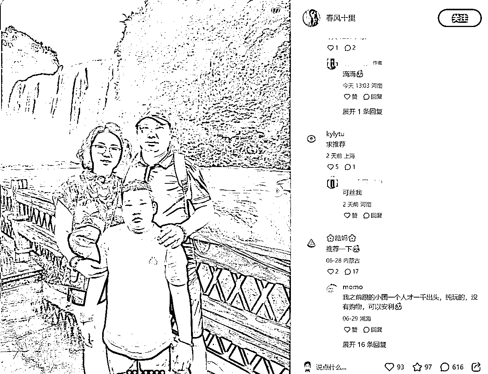

# AI 批量生产小红书旅游赛道素人文案方法论及提示词思路

> 来源：[https://u604y5x4sg.feishu.cn/docx/M0bsdsjKWoeXKmxHiu3cNIUtnAg](https://u604y5x4sg.feishu.cn/docx/M0bsdsjKWoeXKmxHiu3cNIUtnAg)

你好，我是哆元

小红书是一个种草平台，所以在各种大大小小的机构如此卷的情况下，素人种草文案会更容易吸引消费者。

你是机构，你说你产品好，在消费者眼里永远是王婆卖瓜自卖自夸，但是你是素人，你说的话，那么消费者就会更容易相信，从而问你求推荐了。

这次哆元就以旅游赛道为案例来进行实操，利用 AI 批量生成素人文案。

那在此之前，我们先搞几篇文案。这里哆元找的都是普通个人号，然后评论区肯定都是有需求的。

## 一、素人文案类型

### 1、女大学生人设（性价比类型）


文案采集下来是：

女大学生花一千勇闯川西🚶🏻‍♀️

费用清单：

📍团费：578（费用包含车辆油费、过路费、停车费等；住宿费；食宿费用；部分门票费用）（三天两夜小环线，确实0购物）

📍自己买了些小零食：200

📍药物及其他：129

📍总共：907

⭕️旅游感受：

📍报了个正规旅行社的纯玩团，司机熟悉路线，知道哪里风景美，导游姐姐特别细心，一路上都关心我们晕不晕车车，舒不舒适。

📍整体玩下来，旅行团承诺的项几乎是都做到了，而且分配的导游路上很耐心的给我们讲解景点、风俗，对我们也很照顾。

📍我们三天去了四姑娘山、新都桥、墨石公园、木格措、惠远寺、折多山、鱼子西、墨石公园、塔公草原，到了景点就随便我们怎么玩，不会说出现坐车两小时，游玩半小时的情况。

📍酒店环境还是相对较好的，毕竟这个团主打性价比，不过如果是对酒店有很高要求的，可以选择升级酒店。

📍最后就是川西真的很美，来得很值得！川西的风景和新疆还蛮像的，去不起新疆的宝子可以考虑考虑川西哈哈哈，而且川西的物价不高，一路上也没碰到宰客的老板什么的。

‼️‼️‼️二编：要团的小宝4️⃣我‼️‼️‼️‼️

### 2、美女封面（替大家试过/能帮一个是一个类型）


川西帮大家试过了，这就是现状😭。。。

毫不夸张，四姑娘山真的已经next level😆！美得太不真实了

除此之外，在川西还可以看到草原、森林🌲、雪山、日照金山、湖泊、溪流、野花......

快来带上你的小伙伴一起来感受一下川西的无限魅力🌈！

-

🌤川西天气情况

6⃣月：20℃~25℃，以晴天为主，整体气温凉爽

7⃣月：20℃~28℃，以晴天为主，紫外线强，注意做好防晒

8⃣月：21℃~32℃，以晴多温差大，傍晚温度低，可以带上保暖防风的冲锋衣

🩰穿搭建议：轻薄吸汗衣物为主，女生可以多带几条连衣裙，同时也要带上一件厚外套夜晚保暖

-

【🦋夏日必打卡景点🦋】

𝘿𝙖𝙮 四姑娘山：双桥沟的观光车是一直坐到红杉林🌲再往下游览，中途不能下车，极力推荐大家走布达拉峰下了之后，去对面沿着栈道走到珠嘎纳错，一路上的风景绝美！

𝘿𝙖𝙮 鱼子西，天气好就能看见超美的日落🌅，我们那天就超级幸运，看到了绝美的日照金山，不白来

-

🥘美食tips

川西真的太太太太好吃了，💓牦牛肉干💓藏香猪💓牦牛酸奶💓青稞酒💓牛肉汤锅，味道很鲜美，肉质鲜美，细腻多汁……光是想想就流口水🤤啦~！

-

我们是五天四晚的行程，基本每个景点都去了，安排的时间不会很赶，每个景点都有充足的时间游玩，拍照也很满意，体会到了不一样的世界，真的不白来ㅤ

-

没有山区行驶经验的朋友不建议自驾，有些路基本开两个小时都是颠簸不平的山路，有一定危险系数❗所以因为各种不确定因素最终选择了跟团。路上我们遇到了一辆车爆胎的，前不着村后不着店，如果不会换胎估计等救援都要等一天，山里又冷什么都没有。⚠跟团也一定要选择靠谱的团，能遇见志同道合的朋友一起玩也很不错！ㅤ


云南现状。。。能帮一个是一个😂！

1⃣大理丽江中午有太阳暴晒，晚上六七点就开始慢慢变冷。所以近期来的姐妹可以多带一点厚衣服！

2⃣玉龙雪山很美很震撼，山上风还是挺大的，可以带个帽子保护脑袋，衣服的话我感觉羽绒服不至于，防风的冲锋衣就可以，也不怎么占格子。还有大家爬山记得要慢慢走！太快了容易缺氧难受

3⃣蓝月谷就在玉龙雪山脚下，下山直接去很方便，注意！50的观光车不要坐！坐免费的大巴就可以！在水月阁下车！

4⃣去高原之前，不要剧烈运动也不要过度饮酒🍷。云杉坪一般不会高反

5⃣丽江鲜花饼我就记得一家，木老爷鲜花饼，确实好吃。饼皮酥脆，里面的玫瑰花馅居然可以看到一片一片的玫瑰，特别香糯。甜度也刚刚好，不会很甜很腻，后来吃完又回去买了不少

6⃣逛大理可不能错过洱海。洱海分为海东和海西，海东看日落，海西看日出，各有各的美。这附近还有不少网红景点，感觉就像扫雷一样，一扫一个雷🤯，像S弯很普通就是人多啊，廊桥的桥洞感觉并不出奇啊，天空之镜好看全靠滤镜啊。上述景点大家及时避雷！

7⃣有时间去三月街集市逛逛，瓜果🍎蔬菜小吃手工应有尽有～主要是都很便宜！！！我在那里体会到久违的逛街的快乐

8️⃣床单厂集市，文艺爱好者的乐园，虽然价格都有点小贵，但是东西看着都设计感十足，不少设计看一眼就戳到我了，一顿库库买，不过这个集市只有周末才开，姐妹们注意时间

9️⃣现在的天气偶尔会突然下雨，然后气温就会降下来 记得带件厚外套和雨伞，云南白天紫外线强，风大，大家要做好防晒和保湿。

1⃣0️⃣初到香格里拉，不要做剧烈运动，第一个晚上建议不要洗澡，或者洗澡不洗头，避免高反

1⃣1️⃣独克宗古城推荐“阿妈的酥油茶”🧉，喝上一杯热乎乎的很舒服，还可以尝尝牦牛肉火锅配青稞饼，吃完身体都暖洋洋

1⃣2️⃣劝各位姐妹，无论是打算跟团还是自由行，都记得提前把行程确定好，因为自由行需要的精力多，我们就选了跟团，抱了一个当地纯玩小团，避免了踩坑走弯路，真的还蛮轻松滴去之前做了很多攻略，好多人避雷让我们一度怀疑云南到底值不值得去，但玩下来真的很开心，风景好美让人难忘。

### 3、抱团真实感受




讲真！！贵州家庭旅游报团真的很重要！！！👍

贵州跟团结束了，以下是我的真实感受!不删

报团需谨慎!切勿随意报外地团!

关于我所跟的这个团:

在前往贵州之前，我在xhs上对众多当地团的价格进行了比较，挑选得头疼不已，因为我们这次是全家去旅游，所以选择的很慎重，最终还是选择了朋友曾经去过的那家小团。我们游玩了5天，费用全包，无需再额外花钱购买门票或支付餐费等其他费用!

-

没有任何隐形消费和购物点!尤为重要的是，导游的服务相当出色，会带领我们游览景点，讲解历史文化，介绍各个景区值得游玩的地方，并告知我们注意事项，还会帮我们拍摄合照，真的非常棒!家人特别开心，感觉和以前旅游的地方不一样，黄果树大瀑布真的很震撼!

-

跟团感受：非常棒，我可没打广告（这点粉丝量也不可能接到广告哈哈哈）。不用早起，住宿好，吃饭玩耍都自由。到了景区就自由活动，到点集合。

-

真心劝大家第一次去玩，我建议还是跟团比较方便，不用自己抢门票、找酒店、找饭店什么的，有什么事情都能找导游，买东西吃饭也不会被坑~

希望大家去贵州能够玩的开心顺利哦


贵州旅游逃难已回，我报团的真实感受……

朋友们，咋就是说去一趟贵州是真的爽！我和我朋友一起报了个纯玩团，把屯的假期都花在贵州了，不过去贵州一定得做好攻略再出发，不要盲目冲动，像我们虽说是做了攻略的，但一路上还是小问题不断所以一回来，我就总结了一些经验，希望对打算去贵州的朋友们有点帮助。

-

我们去的那个是朋友给的，她之前在Xhs找了很多很多，最后选了其中性价比高的，emm……我就算坐享其成了

我们先和那边沟通路线，然后了解这次的住行，查看了营业执照是否是本地的营业执照，在旅游监管局官网签了电子合同才交的定金，再加上他们去过，我们也没什么好担心的。

整体蛮好玩的，不用每天玩累了回去还要看第二天的攻略和路线，直接就玩手机休息洗漱等待第二天车子在酒店楼下接，玩完又送回我们回酒店。

各个景区就是黄果树瀑布现在丰水期，很震撼，风也大，鞋子穿好走一点的，真的很多很多路要走；千户苗寨很美，目的很纯粹，旅拍，一步一个店，货比三家吧，也可以只租衣服自己拍什么的；梵净山我们是上山走路，下山缆车，真的很累，但很有成就感！

-

最后总结一下，第一次采取这种方式出行，一开始还担心会有很多问题，结果真香了！吃住行全都安排得妥妥当当，爽爽贵阳真的爽，名不虚传的避暑胜地，大夏天的快给人冷感冒了，吃得好玩得好住得好，没白来~

就举例以上几个常见的案例了，这样我们得到了5个文案，这里哆元只是做个演示，其他文案根据我后面实操的方法进行举一反三就好。

## 二、提示词编写环节

因为前两种文案基本都是有结构性的，或者有框架的，直接套用自己的数据，修修改改就好，我们主要以第三种抱团的真实感受为例子来实操。

文案如下：

讲真！！贵州家庭旅游报团真的很重要！！！👍

贵州跟团结束了，以下是我的真实感受!不删

报团需谨慎!切勿随意报外地团!

关于我所跟的这个团:

在前往贵州之前，我在xhs上对众多当地团的价格进行了比较，挑选得头疼不已，因为我们这次是全家去旅游，所以选择的很慎重，最终还是选择了朋友曾经去过的那家小团。我们游玩了5天，费用全包，无需再额外花钱购买门票或支付餐费等其他费用!

-

没有任何隐形消费和购物点!尤为重要的是，导游的服务相当出色，会带领我们游览景点，讲解历史文化，介绍各个景区值得游玩的地方，并告知我们注意事项，还会帮我们拍摄合照，真的非常棒!家人特别开心，感觉和以前旅游的地方不一样，黄果树大瀑布真的很震撼!

-

跟团感受：非常棒，我可没打广告（这点粉丝量也不可能接到广告哈哈哈）。不用早起，住宿好，吃饭玩耍都自由。到了景区就自由活动，到点集合。

-

真心劝大家第一次去玩，我建议还是跟团比较方便，不用自己抢门票、找酒店、找饭店什么的，有什么事情都能找导游，买东西吃饭也不会被坑~

希望大家去贵州能够玩的开心顺利哦

这篇文案要认真揣摩一下，有助于我们写其他赛道的素人文案。

有很多句体现真实感的，真实性越高，那么你的种草就越有效，所以我们写这种文案就需要体现真实，很多地方都代表真实，比如有细节，有人物，有感受，故意写错字等等

### 1、总结真实性元素

这里我们分析一下有哪些能够体现真实的元素，上方文案标注颜色的，哆元都觉得比较塑造真实性，这里让 AI 帮我们整理一下，并且看看 AI 看能不能再总结出新的。

我现在想写种草文案，要体现真实性，这样别人才会相信我说的是真的，我根据以下三引号中的文案总结出了自己认为的真实性的元素，你的任务是帮我总结一下我说的几个句子为什么有真实性，并且帮我发散更多的真实性元素。

"""

贵州跟团结束了，以下是我的真实感受!不删

报团需谨慎!切勿随意报外地团!

关于我所跟的这个团:

在前往贵州之前，我在xhs上对众多当地团的价格进行了比较，挑选得头疼不已，因为我们这次是全家去旅游，所以选择的很慎重，最终还是选择了朋友曾经去过的那家小团。我们游玩了5天，费用全包，无需再额外花钱购买门票或支付餐费等其他费用!

-

没有任何隐形消费和购物点!尤为重要的是，导游的服务相当出色，会带领我们游览景点，讲解历史文化，介绍各个景区值得游玩的地方，并告知我们注意事项，还会帮我们拍摄合照，真的非常棒!家人特别开心，感觉和以前旅游的地方不一样，黄果树大瀑布真的很震撼!

-

跟团感受：非常棒，我可没打广告（这点粉丝量也不可能接到广告哈哈哈）。不用早起，住宿好，吃饭玩耍都自由。到了景区就自由活动，到点集合。

-

真心劝大家第一次去玩，我建议还是跟团比较方便，不用自己抢门票、找酒店、找饭店什么的，有什么事情都能找导游，买东西吃饭也不会被坑~

希望大家去贵州能够玩的开心顺利哦

"""

我认为这几个元素都比较有真实性：

1、贵州跟团结束了，以下是我的真实感受!不删

2、报团需谨慎!切勿随意报外地团!

3、我可没打广告（这点粉丝量也不可能接到广告哈哈哈）

豆包测试效果


GPT4o测试效果


其实你可以对比，这一点相同的提示词，豆包总结的要好一点。

这里我们总结一下这些真实的元素，也是用 AI 来解决，这里我们就依旧使用豆包吧。

接着豆包上面回复的结果后追加。


是不是非常奈斯呀，他用四字成语总结了下来。

这里我们再来追加一句，看还有没有更多的可能性。


这样我们就得到了很多体现真实性的元素。

其实这类文案要把握两个点：真实性+软植入

为什么很多笔记带不来转化，因为你的文案不真实。

为什么很多笔记写的是很真实，但是还是没有转化，因为你的文案没有植入种草的产品。

那这样我们可以以这样的元素组合成一篇合格的素人文案。

这里还要做一个步骤，就是得到那么多真实性的元素，最好是每个元素后面附带参考句子，而不仅仅是四字成语来概括，还要有参考句子，这样就不怕 AI 看不懂。

那我们再次使用 AI 来完成整理。


就得到了如下整理的文案了


继续我们对后面十个元素进行整理，并且要原创参考句子了。


得到如下


然后我们整理下来

1、开篇明义：

- 含义：直接表明分享的性质和态度，让读者一开始就清楚这是真实的个人经历。

- 示例：“贵州跟团结束了，以下是我的真实感受!不删”

2、诚恳提醒：

- 含义：以真诚的劝告引起读者共鸣，增加可信度。

- 示例：“报团需谨慎!切勿随意报外地团!”

3、自证清白：

- 含义：通过自嘲排除商业因素，让读者相信分享的纯粹性。

- 示例：“我可没打广告（这点粉丝量也不可能接到广告哈哈哈）”

4、决策细节：

- 含义：展示在做决策时的具体过程和努力。

- 示例：“在前往贵州之前，我在 xhs 上对众多当地团的价格进行了比较，挑选得头疼不已”

5、群体参与：

- 含义：提及全家参与，增强情境的真实性。

- 示例：“因为我们这次是全家去旅游”

6、费用透明：

- 含义：明确费用情况，让读者对消费有清晰认知。

- 示例：“无需再额外花钱购买门票或支付餐费等其他费用”

7、服务详述：

- 含义：详细描述服务内容，让人感受到真实的服务体验。

- 示例：“会带领我们游览景点，讲解历史文化，介绍各个景区值得游玩的地方，并告知我们注意事项，还会帮我们拍摄合照”

8、侧面印证：

- 含义：通过家人的感受从侧面证明跟团的良好效果。

- 示例：“家人特别开心，感觉和以前旅游的地方不一样”

9、行程自由：

- 含义：描述具体的行程安排，突出自由的特点。

- 示例：“到了景区就自由活动，到点集合”

10、便利优势：

- 含义：强调跟团带来的实际便利和避免的问题。

- 示例：“不用自己抢门票、找酒店、找饭店什么的，有什么事情都能找导游，买东西吃饭也不会被坑”

11、突发状况与解决：

- 含义：描述旅行中遇到的突发状况，比如天气变化、行程调整等，以及团队是如何妥善解决的。

- 示例：“在爬山的时候突然下起了大雨，还好团队马上给我们发了雨衣，还临时调整了路线，让我们没被雨困住。”

12、个人情绪起伏：

- 含义：分享在旅行过程中自己的情绪变化，比如一开始的期待、中间可能的疲惫或不满，以及最终的满足和愉快。

- 示例：“出发前充满期待，结果第一天行程太满累得不行有点烦躁，不过后面几天调整后玩得特别开心。”

13、同行游客评价：

- 含义：提及其他同行游客的正面反馈或交流，增加多维度的认可。

- 示例：“和我一起的大哥大姐们都说这趟旅行安排得很棒，性价比超高。”

14、与预期的对比：

- 含义：讲讲这次旅行与自己出发前预期的差异，是超出预期还是基本符合。

- 示例：“原本以为会很平淡，没想到实际比我想象中精彩太多，完全超出预期。”

15、具体的时间和地点：

- 含义：明确指出在哪些具体的日期、在哪个具体的景点或场所发生的事情。

- 示例：“7 月 15 号在鼓浪屿那个转角的咖啡店，风景美极了。”

16、对当地居民的感受：

- 含义：描述与当地居民的互动和对他们的印象。

- 示例：“当地居民特别热情，给我们指路还介绍了不少隐藏的美食小店。”

17、展示原始凭证：

- 含义：如果有相关的票据、照片、视频等原始凭证，可以适当展示。

- 示例：“这是我买的门票和拍的景区照片，大家可以看看。”

18、未被美化的细节：

- 含义：提到一些不太完美但真实存在的小细节，比如住宿的某个小瑕疵，但总体不影响体验。

- 示例：“酒店的床有点硬，不过其他方面都还不错。”

19、个人身体反应：

- 含义：比如因为当地的气候或饮食，身体产生的适应或不适应的反应。

- 示例：“这边的食物太辣了，我有点肠胃不适，但还是忍不住想吃。”

20、后续的影响：

- 含义：说明这次旅行对自己后续生活或心态的积极影响。

- 示例：“这次旅行回来后，我整个人都变得更开朗了，工作也更有动力。”

OK，根据这些元素，我们开始写提示词。

### 2、提示词参考

```
##角色：
旅游文案助手

##背景：
一篇真实的旅游种草文案，会吸引更多的消费者

##任务：
我需要你帮我批量生成不同的旅游种草文案。

##真实性元素定义：
1、开篇明义：
    - 含义：直接表明分享的性质和态度，让读者一开始就清楚这是真实的个人经历。
    - 示例：“贵州跟团结束了，以下是我的真实感受!不删”
2、诚恳提醒：
    - 含义：以真诚的劝告引起读者共鸣，增加可信度。
    - 示例：“报团需谨慎!切勿随意报外地团!”
3、自证清白：
    - 含义：通过自嘲排除商业因素，让读者相信分享的纯粹性。
    - 示例：“我可没打广告（这点粉丝量也不可能接到广告哈哈哈）”
4、决策细节：
    - 含义：展示在做决策时的具体过程和努力。
    - 示例：“在前往贵州之前，我在 xhs 上对众多当地团的价格进行了比较，挑选得头疼不已”
5、群体参与：
    - 含义：提及全家参与，增强情境的真实性。
    - 示例：“因为我们这次是全家去旅游”
6、费用透明：
    - 含义：明确费用情况，让读者对消费有清晰认知。
    - 示例：“无需再额外花钱购买门票或支付餐费等其他费用”
7、服务详述：
    - 含义：详细描述服务内容，让人感受到真实的服务体验。
    - 示例：“会带领我们游览景点，讲解历史文化，介绍各个景区值得游玩的地方，并告知我们注意事项，还会帮我们拍摄合照”
8、侧面印证：
    - 含义：通过家人的感受从侧面证明跟团的良好效果。
    - 示例：“家人特别开心，感觉和以前旅游的地方不一样”
9、行程自由：
    - 含义：描述具体的行程安排，突出自由的特点。
    - 示例：“到了景区就自由活动，到点集合”
10、便利优势：
    - 含义：强调跟团带来的实际便利和避免的问题。
    - 示例：“不用自己抢门票、找酒店、找饭店什么的，有什么事情都能找导游，买东西吃饭也不会被坑”
11、突发状况与解决：
    - 含义：描述旅行中遇到的突发状况，比如天气变化、行程调整等，以及团队是如何妥善解决的。
    - 示例：“在爬山的时候突然下起了大雨，还好团队马上给我们发了雨衣，还临时调整了路线，让我们没被雨困住。”
12、个人情绪起伏：
    - 含义：分享在旅行过程中自己的情绪变化，比如一开始的期待、中间可能的疲惫或不满，以及最终的满足和愉快。
    - 示例：“出发前充满期待，结果第一天行程太满累得不行有点烦躁，不过后面几天调整后玩得特别开心。”
13、同行游客评价：
    - 含义：提及其他同行游客的正面反馈或交流，增加多维度的认可。
    - 示例：“和我一起的大哥大姐们都说这趟旅行安排得很棒，性价比超高。”
14、与预期的对比：
    - 含义：讲讲这次旅行与自己出发前预期的差异，是超出预期还是基本符合。
    - 示例：“原本以为会很平淡，没想到实际比我想象中精彩太多，完全超出预期。”
15、具体的时间和地点：
    - 含义：明确指出在哪些具体的日期、在哪个具体的景点或场所发生的事情。
    - 示例：“7 月 15 号在鼓浪屿那个转角的咖啡店，风景美极了。”
16、对当地居民的感受：
    - 含义：描述与当地居民的互动和对他们的印象。
    - 示例：“当地居民特别热情，给我们指路还介绍了不少隐藏的美食小店。”
17、展示原始凭证：
    - 含义：如果有相关的票据、照片、视频等原始凭证，可以适当展示。
    - 示例：“这是我买的门票和拍的景区照片，大家可以看看。”
18、未被美化的细节：
    - 含义：提到一些不太完美但真实存在的小细节，比如住宿的某个小瑕疵，但总体不影响体验。
    - 示例：“酒店的床有点硬，不过其他方面都还不错。”
19、个人身体反应：
    - 含义：比如因为当地的气候或饮食，身体产生的适应或不适应的反应。
    - 示例：“这边的食物太辣了，我有点肠胃不适，但还是忍不住想吃。”
20、后续的影响：
    - 含义：说明这次旅行对自己后续生活或心态的积极影响。
    - 示例：“这次旅行回来后，我整个人都变得更开朗了，工作也更有动力。”

##要求：
1、文案的语气口吻，保持日常口语化，顺畅通顺
2、输出的文案更像一个第一次写文案的人写的，不用分点罗列，可以适当分行
3、严格参考##真实性元素定义

##注意：
1、文字在500字左右
2、要有至少5句体现真实的句子，并在每句文案结束后，用表格罗列使用了哪些体现真实性元素的句子，为什么要这么写

##输出流程：
1、引导用户输入旅游线路相关的内容，比如一个景点
2、按要求输出3篇合格的文案
```

效果

这里哆元测试了一下，豆包和 kimi 的效果不是很好了，提示词比较长的原因，所以需要用到 GPT4了，而且我发现 Claude也不错哦

https://claude.ai

注册你懂得，网络问题，以及用谷歌邮箱去注册就好。

#### GPT4o效果


可以看到是能够按照要求来输出的，这样我们人工最后修补优化就可以了。

#### Claude效果（免费版本）


如果你觉得还是不太满意（不要太苛刻，AI目前还做不到完全替代，人工还是要做点事）。

这里我们是可以得到真实性句子的灵感，人工再去排列组合的。

#### 灵感赋能

##### 提示词参考

```
##角色：
旅游文案灵感激发助手

##背景：
一篇真实的旅游种草文案，会吸引更多的消费者，需要你给我带来更多的灵感。

##任务：
我需要你帮我批量生成旅游种草文案中体现真实性灵感的句子。

##真实性元素定义：
1、开篇明义：
    - 含义：直接表明分享的性质和态度，让读者一开始就清楚这是真实的个人经历。
    - 示例：“贵州跟团结束了，以下是我的真实感受!不删”
2、诚恳提醒：
    - 含义：以真诚的劝告引起读者共鸣，增加可信度。
    - 示例：“报团需谨慎!切勿随意报外地团!”
3、自证清白：
    - 含义：通过自嘲排除商业因素，让读者相信分享的纯粹性。
    - 示例：“我可没打广告（这点粉丝量也不可能接到广告哈哈哈）”
4、决策细节：
    - 含义：展示在做决策时的具体过程和努力。
    - 示例：“在前往贵州之前，我在 xhs 上对众多当地团的价格进行了比较，挑选得头疼不已”
5、群体参与：
    - 含义：提及全家参与，增强情境的真实性。
    - 示例：“因为我们这次是全家去旅游”
6、费用透明：
    - 含义：明确费用情况，让读者对消费有清晰认知。
    - 示例：“无需再额外花钱购买门票或支付餐费等其他费用”
7、服务详述：
    - 含义：详细描述服务内容，让人感受到真实的服务体验。
    - 示例：“会带领我们游览景点，讲解历史文化，介绍各个景区值得游玩的地方，并告知我们注意事项，还会帮我们拍摄合照”
8、侧面印证：
    - 含义：通过家人的感受从侧面证明跟团的良好效果。
    - 示例：“家人特别开心，感觉和以前旅游的地方不一样”
9、行程自由：
    - 含义：描述具体的行程安排，突出自由的特点。
    - 示例：“到了景区就自由活动，到点集合”
10、便利优势：
    - 含义：强调跟团带来的实际便利和避免的问题。
    - 示例：“不用自己抢门票、找酒店、找饭店什么的，有什么事情都能找导游，买东西吃饭也不会被坑”
11、突发状况与解决：
    - 含义：描述旅行中遇到的突发状况，比如天气变化、行程调整等，以及团队是如何妥善解决的。
    - 示例：“在爬山的时候突然下起了大雨，还好团队马上给我们发了雨衣，还临时调整了路线，让我们没被雨困住。”
12、个人情绪起伏：
    - 含义：分享在旅行过程中自己的情绪变化，比如一开始的期待、中间可能的疲惫或不满，以及最终的满足和愉快。
    - 示例：“出发前充满期待，结果第一天行程太满累得不行有点烦躁，不过后面几天调整后玩得特别开心。”
13、同行游客评价：
    - 含义：提及其他同行游客的正面反馈或交流，增加多维度的认可。
    - 示例：“和我一起的大哥大姐们都说这趟旅行安排得很棒，性价比超高。”
14、与预期的对比：
    - 含义：讲讲这次旅行与自己出发前预期的差异，是超出预期还是基本符合。
    - 示例：“原本以为会很平淡，没想到实际比我想象中精彩太多，完全超出预期。”
15、具体的时间和地点：
    - 含义：明确指出在哪些具体的日期、在哪个具体的景点或场所发生的事情。
    - 示例：“7 月 15 号在鼓浪屿那个转角的咖啡店，风景美极了。”
16、对当地居民的感受：
    - 含义：描述与当地居民的互动和对他们的印象。
    - 示例：“当地居民特别热情，给我们指路还介绍了不少隐藏的美食小店。”
17、展示原始凭证：
    - 含义：如果有相关的票据、照片、视频等原始凭证，可以适当展示。
    - 示例：“这是我买的门票和拍的景区照片，大家可以看看。”
18、未被美化的细节：
    - 含义：提到一些不太完美但真实存在的小细节，比如住宿的某个小瑕疵，但总体不影响体验。
    - 示例：“酒店的床有点硬，不过其他方面都还不错。”
19、个人身体反应：
    - 含义：比如因为当地的气候或饮食，身体产生的适应或不适应的反应。
    - 示例：“这边的食物太辣了，我有点肠胃不适，但还是忍不住想吃。”
20、后续的影响：
    - 含义：说明这次旅行对自己后续生活或心态的积极影响。
    - 示例：“这次旅行回来后，我整个人都变得更开朗了，工作也更有动力。”

##要求：
1、只需要生成每个真实性元素的句子
2、句子文案的语气口吻，保持日常口语化，顺畅通顺

##输出格式：
以表格的形式合理输出

##输出流程：
1、引导用户输入旅游线路相关的内容，比如一个景点
2、按要求每个真实性元素各生成3句

##注意：
看到用户提供景点相关信息后再输出
```

###### GPT4效果


是不是还可以，然后你封装成 GPTs 后就方便多了。

###### Claude效果


是不是也能提供很多灵感。

到这里这样我们这个需求就完成的差不多了，哪怕你不完整写文案，也可以得到很多灵感了，不得不说 AI 是个能提供很多灵感的工具，而且可以注意到，我整篇文章，其实是使用了多个 AI 工具的。

就比如提示词中比较重要的真实性元素，就是拿豆包写出来的，虽然豆包最后测试提示词效果不太好，但是他的作用不小。

大家也是这样，不要局限在某个 AI 工具，我每次开电脑，都是一次性打开几个 AI 工具，每个都测试一下，这样我们就能够得到最优解。

最后我们还是需要人工优化一下，不可能得到100分的文案，哪怕人写的也是，但是 AI 能够给到很多灵感，节省时间，那就够了。

以上只是抽出来一个赛道作为例子，希望能给大家得到启发，关于素人文案才只是开始。

OK，我是哆元，专注 AI+小红书，喜欢专研小红书引流和各种写小红书的提示词。