# 互联网初创阶段避坑指南1.0

> 来源：[https://vnr4jule4g.feishu.cn/docx/PPTidaJwWovNYjxzlSxc4Pm4n1U](https://vnr4jule4g.feishu.cn/docx/PPTidaJwWovNYjxzlSxc4Pm4n1U)

这段时间一直在关注星球的内容，发现很多小伙伴是超级个体创业或者是初次建团队在跑项目的阶段。本着星球利他的宗旨思维，分享一下我在初期组建工作室的避坑指南，包括设备、账号、微信、收款、管理等问题，少走弯路就是最快的捷径。

# 一、设备避坑指南

## 1、常见设备推荐

根据具体项目来选择设备数量，以普通的私域项目举例:

✔️ 个人推荐：5-12 个号，1 机 1 卡 1 号

✔️ 工作室推荐：30-100 个号，1 机 1 卡 1 号

苹果设备工作室推荐机型

🔺iphone7:工作室钉子户，性价比高、流程速度快🔺iphone8:游戏和短视频居多，功耗低运行速度快

🔺iPhoneSE2:存在感差，直播电商短视频都OK

🔺iphoneX:直播电商短视频养号

🔺iPhone的整体就是保值，潮金工作室也比较喜欢用

安卓设备工作室推荐机型

🔺中规中矩 红米10x

🔺性能好 小米10青春8+128g

🔺多人用的 小米8青春 小米8se

🔺性价比高 oppo r17

原则上：

*   能买二手的就别买全新的

*   能买原装就别买组装（注意辨：无指纹无面容=拆机） 尽量不要去闲鱼

*   能买国行就别买外版

*   买配置别买外观

*   买品牌不买杂牌

*   具体机型：优先考虑8+128GB

*   年限：4年内安卓&6年内苹果机

常见的多开 手机设备推荐

第一款是：摩托罗拉

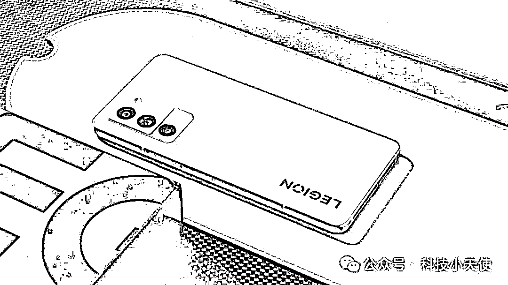

第二款是：联想拯救者Y70

这两款是我自己亲身体验过的，适合多开微信，官方系统自带应用分身不封号的设备。具体的参数你可以直接去官网查看，或者去看测评系列的视频。

ps：关于电脑设备我这里就不做推荐，办公机、游戏机......根据你的业务需求来定，可以自行到哔哩哔哩等平台去查看数码博主们的测评。

## 2、设备｜如何最大程度避免设备风控？

以小红书平台举例，如果账号被封得太多的话，会被封设备，不封设备也会风控，新上的号会出现吞评论以及私信的情况，所以一台设备封过 1～3 个号就需要进行刷机。

#### 1）如果你是安卓设备：

第一步：更改-广告标识符（又称设备标识符）

1.  打开手机找到“设置”-隐私或权限与隐私

1.  把“限制广告跟踪”关闭（把按钮变成灰色即可）

1.  点击“重置广告标识符”然后点击重置（即更改设备标识符）

安卓不会刷机的：https://onfix.cn/rom

第二步：手机重新激活

1.  卸载掉小红书APP软件

1.  先在开机状态下“还原出厂设置”1～2 次。（不知道在哪的可以百度：“XX 型号还原出厂设置在哪”）

1.  然后手机关机，同时按住启动键以及音量减键，然后再刷一次，这样差不多设备就干净了。

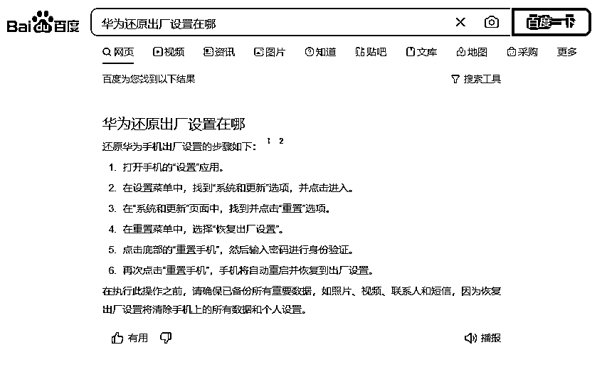

1.  下载安装小红书软件后(手机重启后用流量下载安装小红书，切记不能用wifi)，先不要登录或者注册新账号

第三步：手机网络环境更改【重要】

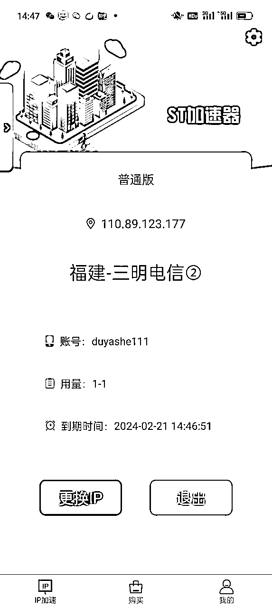

动态 IP 的作用：很多人不知道纯净 ip 怎么搞，我直接给落地思路，实测直接出评论或者恭喜没什么问题。

下载一个 ST 加速器，直接换纯净 ip。（点击下载）

每次用完都切换一下 ip 就行了，手动操作，用多少买多少，建议买独享版。

⚠️ 因为现在一个账号被封，会连同 IP 一起封，因此需要切换动态 IP。

#### 2）如果你是苹果设备：

首先在手机先“还原 iPhone”1 次～2 次，然后电脑下载爱思助手使用爱思再刷一次。

手机设置➟通用➟传输还原 iphone➟抹除所有内容和设置

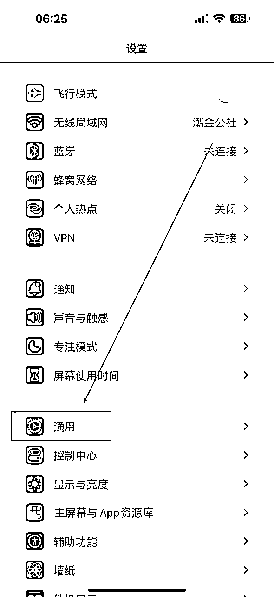

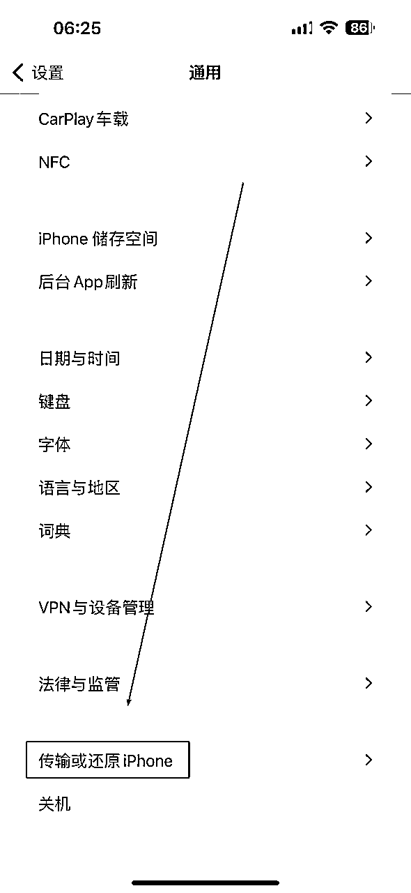

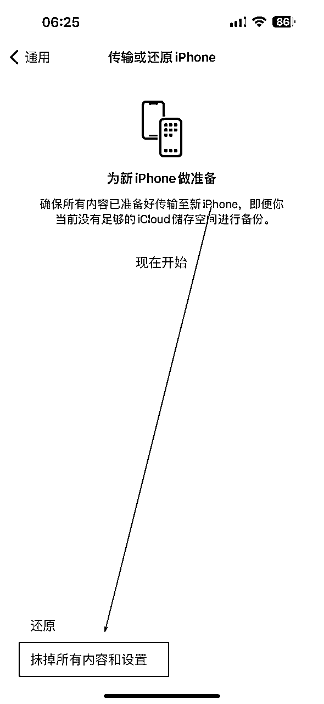

点击智能刷机 ➟ iTunes 刷机 ➟ 连接数据线 ➟ 下载固件 ➟ 点击防数据恢复刷机 ➟ 立即刷机

爱思助手官网：https://www.i4.cn/

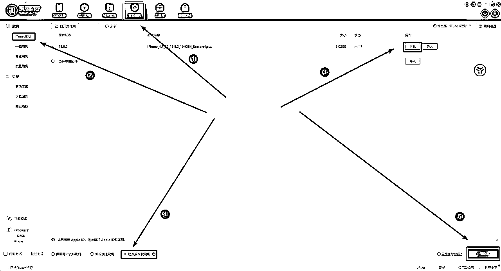

# 二、设备精细化管理

### 1）多插口充电设备

锦上添花，非刚需

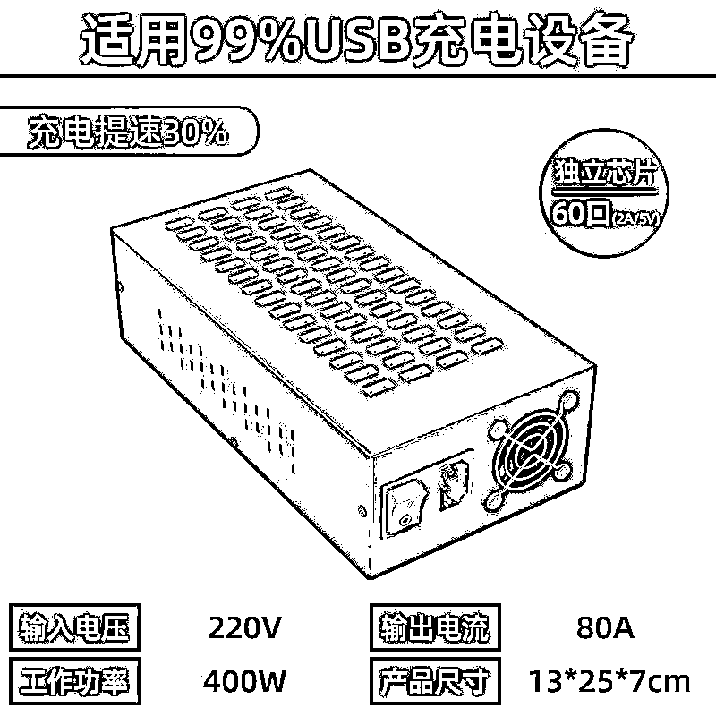

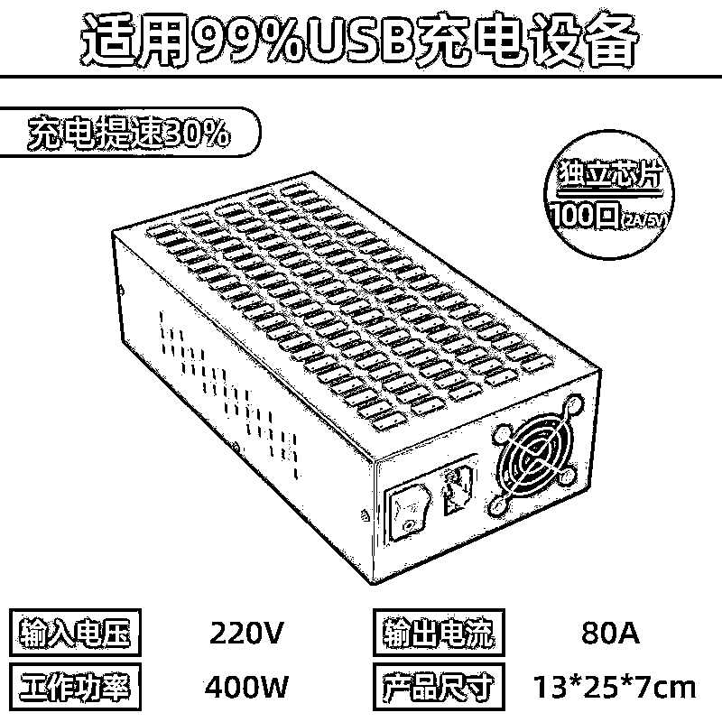

### 2）标签登记

设备背后要做好标签，号卡匹配设备，要做好登记

一些措施，避免公司财产损失。

重要 TIPS （针对员工/线下合伙人）

*   手机在养号和使用时，都要保证号、卡、手机的安全

*   丢失一个号，罚款 xxxx 元。

*   微信注册人和使用人必须分离，不允许使用自己注册的号工作

*   所有信息严格保密，保护同事们的信息安全

*   同事离职后注意更换实名认证！！！

### 3）多号卡应对措施

*   方法一：员工注册号卡

员工入职后联系 三大运营商（合作门店）上门为员工办理号卡

签署好相关协议，或者发红包给员工。

*   方法二：家人、亲戚

三大姑八大姨.....都安排办理号卡

*   方法三：素人分发

素材分发具体怎么玩呢？

第一，测素材。自己拿几个号测一下，确保素材和流量形式没问题的前提下再做这个事。短视频本质是一个素材逻辑 ，内容为王，你的素材做的不好，分发一千条一万条都没有用。

第二，有学生团队是最好的，质量非常高。别找宝妈，别问我为什么，我是专业搞私域的。说下我的玩法，找两个学生头子，一个负责招学生，一个负责管理，发布内容和发钱。

第三，结算，原则上是降本增效。不要多给，根据你的行业、客资进线的难易程度来决定，动动手指，一个学生每月能多赚两三百就特别开心，不要花冤枉钱。

第四，如果有爆了的号，我们可以花个几百块，把号收购了，然后做下投放，我自己试过搞旅游粉，最猛的时候一块不到一个客咨。

第五，你是在不懂招学生去做，也可以boss直聘，不用自己冲会员，你可以通过其他渠道去买，发居家客服，这样成本会少很多。

# 三、账号避坑指南

## ❌记住，一切的账号买卖都是违法行为！

和大家科普一下关于市面上常见的账号类型。

🔺什么是实卡号？ 说白了就是咱们去营业厅办理的号卡，有一些也可以在网上申请。

🔺什么是接码号？说白了，通过渠道接收短信验证而获得的号码。

🔺什么是地推号？是别人通过线下送礼品让别人接收注册小红书的验证码，然后你这边登录

🔺什么是拦截号？一个平台可以查询别人未注册的账号，属于厅卡新号，这叫拦截新，同理还有拦截老号，就是别人注册过的，相当于盗号!

🔺什么是老美号？美国的小红薯号，优点是老号权重高价格低，缺点是有使用门槛

除了实名卡以外，其他接码类型账号均是违法擦边的，轻则蜀黍请喝茶，重则送银手铐。

很多用这类型账号的都是做一些擦边、违法行业居多。各位互联网小白，或者新手村小伙伴，一定要谨慎对待账号问题，不要贪图方便就轻易使用接码类型账号。

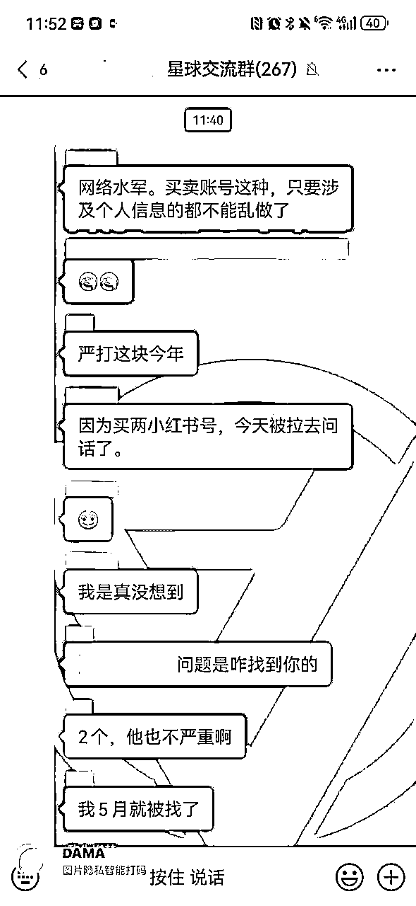

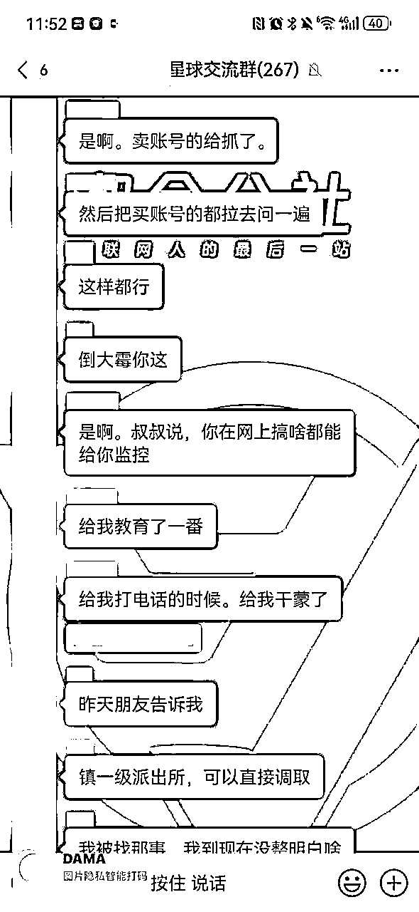

👆就是社群圈友的真实遭遇，因为买了两个账号做项目，直接被拉去喝茶了。

# 四、微信避坑指南

在我看来，对于很多做私域项目的伙伴，微信号就是最宝贵的资产。

# 一个微信 = 一家店

谁的店多，谁的店活得久。

## 1、个人微信号养号防封指南

微信号注册跟养号最重要的就是“真人化”注册+社交行为。

业务号要模拟真人使用，这就是最好的养号！

微信号注册养号流程：

1.  注册时使用手机卡流量 ，不要使用 WIFI 热点。

1.  手机卡不要同一时间注册，需要区分时间段跟多次去进行注册。

1.  注册微信时，先在手机里面添加 5-8 个手机号码。手机通讯录不要是空的，后期注册好微信后直接添加好友，也显得更加真实。帮助你提升帐号权重；

1.  注册新微信，提前准备好每个微信的密码，不同的微信号。不同的密码。建议字符+手机号形式。

1.  个人资料不要一次性填写完，每天填写一点增加日活量，当天可以头像背景设置－昵称设置，不要设置相同的微信头像图片，次日设置一个正能量的签名，微信号可以 28 天后在设置，后面依次为性别－地区－绑定银行卡（5-7 天完成信息设置） 时间流程

1.  新注册的微信加 3-5 个可以控制的微信老号，需互动聊天 5-10 句，要有文字，表情，图片等。7 天内添加人数不得超过 12 人。

1.  让老号在微信里给你备注，加标签，备注电话号码等，千万不要使用摇一摇、附近加好友功能，会严重影响账号权重。

1.  新号不要使用各种营销软件，比如：多开、虚拟定位、自动化抢红包、群广告等插件软件，挂机 24 小时不要退出（微信 APP 不要关掉，后台运行即可）。

1.  绑定银行卡实名认证，和老号可以组建群，进行发红包抢红包活动，增加活跃，发 1 个红包给老号，用另一个老号给本号发红包，可以进一个多人群。

1.  每天手动 1-3 条朋友圈更新，内容为图片，文字都要有， 时间需隔开，每日浏览腾讯新闻，转发订阅号的文章到朋友圈并写分享语， 关注几个腾讯公众号，下载微信表情包和使用微信小游戏。

1.  新号在沟通中不要涉及钱，银行，支付宝，账号，期货这些关键词，如果要说 15 天之后可以再说。3 个月内的号都算新号，期间内加人不要过多，营销行为需要低调。

1.  有效购物流程（时间：建议每周 1-2 次 ）：线下购物，比如超市、水果店、早餐等金额不限，需进行扫码支付。可以购买 10 元理财产品，充值话费，微信滴滴打车等；线上购物：通过微信内京东小程序进行购买。

1.  微信钱包金额不得低于 1 元。

1.  完成语音聊天 30 分钟，至少两次，可以一直开着即可不用说话。

1.  完成视频聊天 5 分钟，至少两次，可以一直开着即可不用说话。

1.  加自己相关的人最少 5-10 人好友。这 5-10 个好友需相对比较熟悉的，万一微信号被封，需要他们配合解封。手机收回后可以进行屏蔽朋友圈（不能拉黑删除）。辅助解封

## 2、微信被封联系腾讯客服的 6 种方式

1.  客服公众号：腾讯客服（Tencent KF）

1.  微信小程序：腾讯客服

1.  客服帮助中心：腾讯客服

1.  微信安全中心 AI 服务：用户输入关键词之后，系统会根据用户提交问题的关键词自动识别给出相应的答案。

1.  腾讯客服电话：0755-83765566（服务时间：09:00-22:00）

1.  微信支付、红包、零钱、支付商户等相关问题，请拨打电话：95017

如果微信账号被永久封禁了，该如何解封呢？

来听听视频中这位老江湖的骚操作👉

# 五、收款风控避坑指南

收款也是很多工作室头疼的问题，远程收款尤其是大额容易风控。

*   用商家版收款或者第三方收款渠道解决这个问题。

*   个人微信号如果想持久，不建议直接收款。

## 1、营业执照参考类目

类目参考

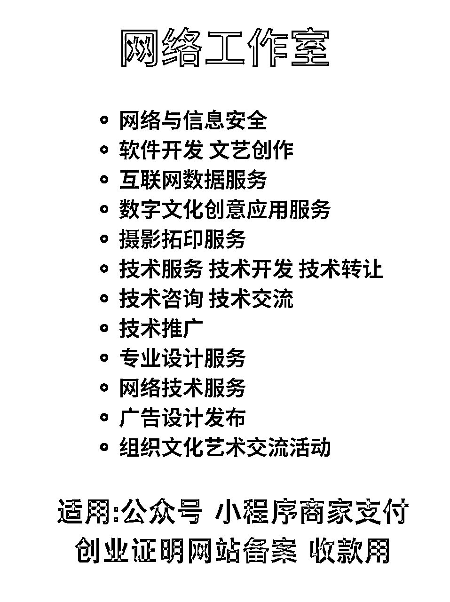

营业执照办理渠道推荐

⭐无地址：淘宝，pdd 都可以

⭐有地址：自行前往当地市场监督个管理局

## 2、商业收款码的申请流程

## 1）微信版本申请链接

直接去微信官方开通，微信支付官网地址：

https://pay.weixin.qq.com/

按照官方教程指引，一步一步引导去开通即可。

## 2）支付宝版商家版本申请流程

开通流程如下：

1.  打开手机支付宝app，点击下方导航栏进入【我的】页面；

1.  点击【商家服务】，如果没有该选项，可以通过首页搜索“商家服务”进入；

1.  未开通商家服务的用户，勾选同意协议后即可开通；然后点击右上角的齿轮【设置】；

1.  在【商家服务-我的设置】页面，点击【我的收钱码】即可查看商家码。

## 3）第三方收款

如果你有实体门店，可以直接可以去银行办理。

如果网上可以选择：虎皮椒、易支付、上海富友这类型第三方收款。

注意一下提现费率。

# 六、人员管理问题

先说一个原则，初创公司招聘一定很难很难招到人才。

举个例子，招聘一个电商运营。什么 boss 什么智联，放心，一个能打的都没有。那还招不招呢？还得招啊。

*   上一家从事的啥类目？只要有同类目经验的优先考虑，无论成功失败。

*   没有就直接看简历，提三个问题：行业前三的店铺以及他们的渠道打法，产品大词的平均点击率和 PPC，上一年的运营预算的花费情况。

上面三个问题你不需要会做，但是一定要懂，不然运营随便就能把你忽悠瘸了。

问的差不多了就招进来先开工，从正式产品上线一个月起。如果一个月内他做的毛利还跑平不了给他开的工资，水货，开了就完了。达不到上面那个要求就是能力不行，不要听他的借口。

有机会和大家分享，怎么找到合适的合伙人。

## 1、人员管理

原则上，每一个阶段都要书面合同，避免后续的纠纷。很多小老板，就是不懂法，被员工坑。

1.  如何招员工

*   大学生（低成本、适合线上兼职）

招聘渠道：校园墙、非官媒公众号、校园兼职招聘群....

*   社招（稳定）

1.  如何找渠道：

*   微信：搜索 xxx 大学公众号，xxx 大学兼职（顺藤摸瓜就会有很多兼职招聘渠道和）

*   社招（适合筛选、线下全职）

*   Boss 直聘

*   抖音招聘

1.  面试阶段

1.  签约阶段

1.  工作阶段

1.  离职阶段

# 七、场地避坑指南

## 创业，非必要不租办公室

不少热血沸腾的青年，拿着东凑西凑的几十万资金，事情没做成，亏完了，很大一部分就是花在了办公室上。

办公室再好看也不是自己的，而且好看和业绩一点关系都没有。

创业初期省钱才是王道，别为了追求所谓的面子。

把钱花在搞流量上面，才是最重要的！

建议：自己家里改造、居民楼、商业公寓....低成本运作

只要一条网线，咱们就可以开干！

## 业务起来了，需要写字楼

中国人特别讲究排场，尤其是接待。有些小伙伴业务需要好的场地。

大家说说该怎么避坑，其中有什么道道。

| 1.办公楼租赁，虽然是按月计费，但一般都要签约至少要 1 年起步，但是也不能长签 3 年以上，一般业主不会同意，或者是需要一定幅度的递增。办公楼租赁的价格很多时候分为“包票”与“净到手”“包票”即是租金内已经包含租赁税发票，“净到手”则是不含。 |
| 2、办公楼租赁还有一项管理费（物业费，按每平每月）支出，这个你要主动去问去咨询才可以，根据行业来说，20 元以下的多数都是没有中央空调或者中央空调费另计的，20 元以上的多为中央空调。管理费通常包含公共部分的水电维修保养、清洁卫生等等。(ps:1.物业费多少？是否含空调费用？ |
| 5、还有就是每个写字楼的中央空调开放时间不一样，很多都是有时间限制和月份限制的。极少写字楼会 24 小时供应，大部分都是供应上班时间（多为 8:30-18:30），另外加班需要支付一定的加班空调费。也有少部分可以自己安装独立空调，如需加班或者不想使用中央空调可以询问是否可安装独立空调。(ps:1.空调时长多少？2.是否可自己调控？3.是否可安装独立空调？) |
| 6、互联网公司经常会有通宵的情况出现，但是写字楼内是不可以住宿（有商务公寓的除外），更不可以明火煮食的，微波炉还是可以用的。不过也有复式写字楼是可以居住或者可商住的写字楼，这些都可以主动去问（ps:是否能住人？) |
| 7、另外就是停车场怎么收费了，一般老板和员工都会办理月卡，所以主要了解月卡多少钱一个月就 ok，承租面积比较大的客户，有送 1-2 个免费停车位置的，记得要争取。（个人业主除外）（ps:①停车费多少一个月或一年？②按年有没有优惠？③临停多少一小时？④日封顶多少 1 小时） |
| 8、如果你的是毛坯办公楼租赁，记得要跟业主要免租期，1～3 个月不等，具体看面积和装修风格需要的时间，这个也是可以商议的。哪怕是带装修的，也会有 1 周左右的免租期，搬办公室也需要时间嘛，对吧！修修补补总要时间吧！（ps:免租期多长时间？) |
| 9、租赁期的递增：一般租期超过一年以上的租赁期都会有不同程度的递增，一般是从第二年或者第三年开始月租金开始递增 5%-8%，有个别的大厦连管理费也一起递增。(ps:1.租金涨幅度多少？) |
| 10、合同签订：以上所有都了解清楚并谈妥后预约时间签订合同，要弄清楚你是跟业主签的还是跟二房东公司签约的。一般来说大业主和二房东都好说话，很多事情都可以找他们帮忙。（ps:你们是大业主还是二房东还是小业主？) |
| 11、办公楼租赁还有一个定金交付使用，有很多情况不允许您直接签订合同，下定金则是最好的折衷方法，一般定金下了以后，业主反悔的话需要双倍返还的 |

# 八、总结一下

创业是要把时间花在刀刃上，一定要有侧重点。

*   比如有做私域流量的，就要把精力放在搞流量环节。

*   比如做电商的，就要把精力放在选品环节上。

*   比如做实体的，就要把精力放在产品和选址上。

.......

另外，地基不稳，再高的楼宇都有可能随时倒塌。

*   创业团队初期，核心是人才。

*   超级个体创业初期，核心是执行力拉满。

*   合伙创业，股权架构很关键，同甘共苦容易，一起享受荣华富贵就容易出问题。这是导致很多初创公司倒闭的关键因素。

任何业务，前期一定要打牢固地基。

合伙人创业就要丑话说在前，个体创业就要执行力拉满。