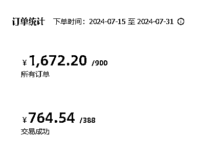
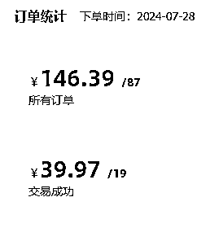
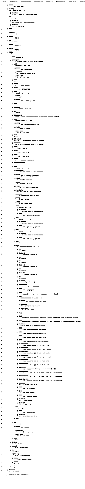
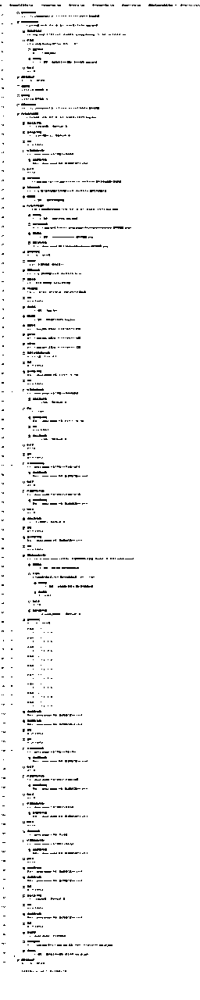
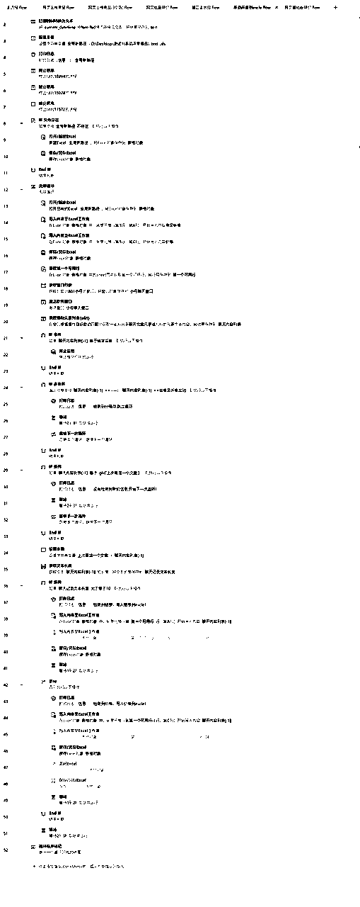

# 怎么用影刀Rpa提升闲鱼虚拟项目的十倍效率

> 来源：[https://riodtlbegu.feishu.cn/docx/PgCsdlYyWomJu9xpFbJcawmunsg](https://riodtlbegu.feishu.cn/docx/PgCsdlYyWomJu9xpFbJcawmunsg)

# 前言:

大家好，我是锦城随笔

最近自己在测试虚拟项目,第一个平台测试的是闲鱼平台

一共做了45天左右,最近每天平均收益都超过一百了！

先上最近15成绩:

平均每天100元，然后最高的一天146元

看起来好像也不咋地，实际上每天真正操作的时间没有超过一个小时

都是使用脚本在全自动跑！

经过几次的更新迭代

从半自动更新到几乎全自动了

先说一下自己目前所用到脚本一共有哪些:

1.采集脚本:包括关键词搜索和同行主页爆品的采集

2.去水印脚本:并且获取标题和文案,使用的接口,效率非常高！

3.上传商品脚本:包括网页端的上传脚本和手机app端的上传商品脚本。

4.批量降价脚本:包括闲管家批量降价和手机app端的批量降价。

5.还有一些不经常用的脚本，包括自动签到过任务和微信监听手动采集脚本等等

这些脚本都是影刀写的,影刀的脚本只能自己写,不能分享哈~

大家有遇到影刀的问题都可以跟我一起多交流！

一会我把最近更新的脚本都放在最底下,大家直接抄作业就可以了！

如果拥有以上的所有脚本，就可以解放双手了！

* * *

本来跟一个朋友交流虚拟项目,也帮忙调试了脚本,准备一起跑虚拟测测

后面这个小伙伴拿了一个账号通过脚本去测试高客单的

结果当天就出单了，利润700+

* * *

做闲鱼虚拟的前面十天左右，自己也都是手动采集，手动去水印，手动上传商品

发现效率实在是太低

现在一共做了40天，已经几乎可以全自动了~

部分展示脚本展示一下哈:

# 一.脚本演示:

## 1.接口去闲鱼水印,获取标题和文案:

## 2.微信监听手动采集的闲鱼链接,自动导入到excle文件：

## 3.其他脚本可以在之前的文章里面看看，都有演示过程:

# 二.抄作业:

## 1.手机端关键词采集脚本:

## 2.手机采集同行主页的爆品

## 3.闲鱼手机端发布商品:

## 4.网页闲管家上传商品

## 5.网页批量降价:

## 6.对接api接口去水印获取标题和文案:

## 7.微信监听并且采集到excle文档:

# 三:写在最后

这套打法同样适用于小红书，个人感觉小红书的天花板应该会高一些！

希望大家通过这套组合拳能够日进斗金！

对影刀有学习或者兴趣的，都可以找我一起交流,知无不言！