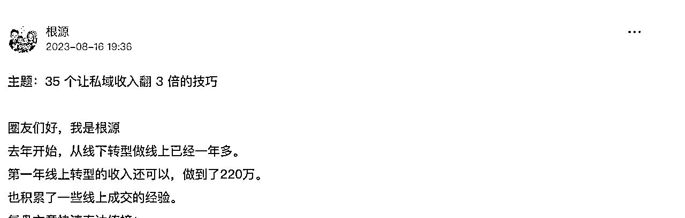
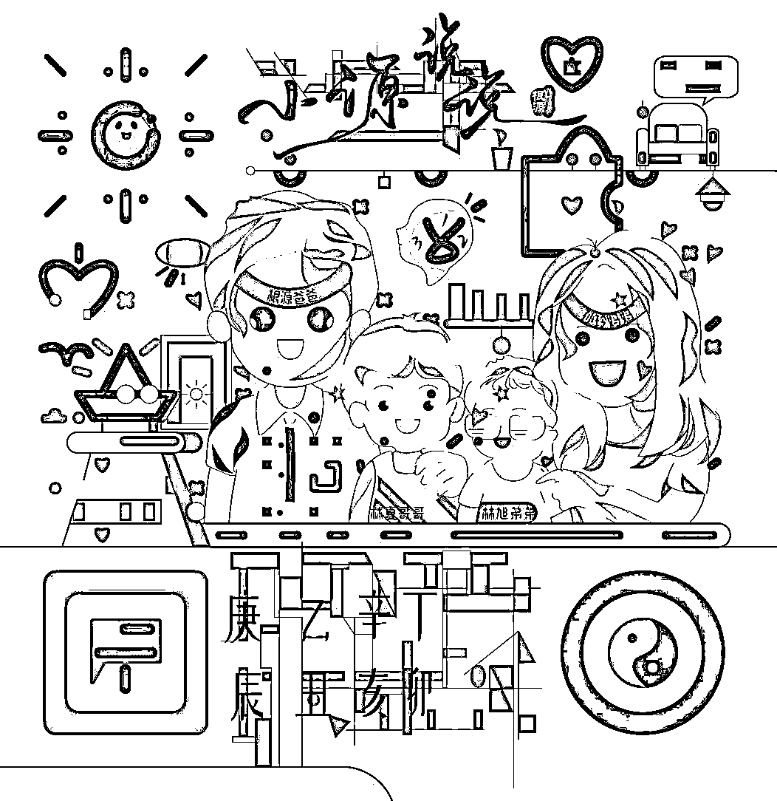

# 《9年传统行业转型第2年，如何维持百万利润》

> 来源：[https://oee5lr7gsk.feishu.cn/docx/QM9Pd3O6HouyucxyZm3cWT13nT4](https://oee5lr7gsk.feishu.cn/docx/QM9Pd3O6HouyucxyZm3cWT13nT4)

全文共：25,069 字

预计阅读时间：12.43 分钟

圈友们好，我是根源

目前已经在知识付费、以及私域运营的赛道深耕两年半

这一年多，跟明白老师还有陈雪美女一起做俱乐部（日新月异俱乐部）

成绩都还稳定，年度基本都能维持七位数的利润

会员的净成长跟复购率，数据也都挺好

这是我23年的复盘

去年的工作效率和成绩我个人其实挺满意

刚好借着复盘的契机，我也梳理了自己

这过去一年到底做对了哪些事情？这些事情是不是可以持续地做下去帮助我获得更好的结果？

也就是让一些做对的事情

变成可以复制，可以持续放大结果的事情

希望这些经验或方法，能帮到正在看文章的圈友

很欢迎看完文章后

能一起讨论。

* * *

# 围绕两件事，持续放大第一年积累的影响力

第一年做知识付费，我给自己定下几个目标。

第一个目标就是我必须得持续的做一些事情。

这个持续可能是上课、可能是发公众号、可能是发小红书……

（当然我只有做「发公众号」跟「持续上课」的动作）

因为当我持续做一件事的时候，我就可以在固定的群体产生一个挺不错的影响力。

那这些影响力的最终就会就能够产出一些很棒的数据：

这数据可能是报名人数，

这数据可能是课程的期数，

这数据也可能是我从中获得到的收入

……

这些都是一个可以让更多的人知道：

你做的确实挺好的，你不止做的好，不止别人说好，同时你还有能够拿的出手的成绩。

那去年有两个对我来说最重要的两个数据。

## 持续增加内容更新的字数

⭕️第一个是内容更新的字数。

因为字数会决定我的内容沉淀到底有多少。

内容沉淀如果不够完整，就会导致人一多就会感觉

这个老师好像也没什么东西，也没什么产品，然后内容也不够丰富…

所以去年一整年，其实我有持续地上课，持续地更新内容

下面是这一年累计的输出字数以及总的上课时长。

* * *

## 持续增加开课的期数

⭕️第二个是开课的期数。

因为期数的关键在于，

我如果说能持续把期数慢慢的变多，可以想象一个场景：

有人一月份报名了

第一期沟通课，

二月到七月他也没报名其他课程，

突然我第八个月找到他，

我就跟他说：

现在的沟通课已经开到了第九期，

他会有什么想法？

他的想法一定是，

这个老师怎么在年初到现在真的一直坚持讲课，

那我觉得这老师应该可以信任，

要不他的进阶课

我尝试的再报名看看。

同时上课期数只要多，那就代表我的内容更新就必须得持续迭代，

因为每一期上课我可能都会有一些新的内容或者是旧的内容的更新。

再来个点是因为当我期数能够不断的增加。

我就有机会可以有更多的新海报，或者是更多的理由，

让一些新朋友知道

我的这个课之所以可以开这么多期，是因为这个课的受众群是还不错的。

所以，这是我去年给自己设定的两个很重要的目标，

就是更新的字数、内容产生的影响力，还有我的期数开的到底是多还是少，

那去年在这个两个部分我觉得做的还不错。

* * *

## 沉淀跟积累是让第二年更顺利的基础

我发现第一年做的最正确的事情，

就是大量的累积内容跟大量的尝试开各式各样不同的课。

因为当第一年的创新以及累积非常多的时候。

第二年开课会有个好处，

就是我可能不用有这么多的创新，同时我也不用有这么多的新构想、新想法。

我只需要深入就好了。

1.  聊天记录变成沟通实战案例

就像去年我的沟通课做了一个尝试，

我尝试着把我的聊天记录储存下来，然后变成一套课件。

这个内容当时只是无心插柳，但是在今年它就变成一个完整的课程，它就变成一个很多字数的课件。

它也可以变成是一个独立的内容，同时它又可以迭代，

我的沟通课可以开一个中阶或者是一个番外篇。

1.  金句衍生成课程

再来是去年上过这么多的课，

包含直播，包含文字，我就请主编帮我总结出了多少金句，

结果一总结，发现金句超过3000多个。

那这就代表我可能光是金句，每一个金句又可以独立变成一堂课，

或者是可以针对每一个金句，再去解释当时这个金句的场景到底是什么，这个又是一堂课。

1.  课程内容变成社群的早报

又或者是开的爱情课、时间管理课，

然后把每一个文字课去做一点点的整理，可能1000字整理成500字。

也就这些内容在今年转型的时候，我们开俱乐部的时候，

每一天的早报，一天可能可以早上播报个三到五分钟。

因为它就变成是社群里面的某一个交付环节，

但这些交付环节其实都没有额外花时间，只是把去年的东西做一点迭代。

可能文字做一点调整，

或者是这个内容做一点修改，

或者是图片做一点优化，

又或者就是一个全新的东西

……

就对于新朋友来讲，这东西就非常的丰富。

就类似小报童

又或者是再次整理修改迭代后，更新到生财，可能会被加精。

...........

这些经过沉淀的文章，再次的精修迭代后，我也拿到了六篇精华

### 所以，沉淀跟累积内容其实很重要，

### 当字数够多的时候，就可以有更多变化的展现方式。

文字可以变成图片，

图片可以变成音频，

音频又可以变成视频

……

但这个东西它其实同一个内容，我只是用不同的方法去呈现。

但如果说，原本沉淀的内容没有这么多，我们就无法做这么大的变化，

所以，第一年的沉淀以及大量内容的累积，如果做的足够好，第二年其实会特别的轻松。

也因为这样，今年的课程创新可能只占了30%，但是过去内容的深入加迭代就占了70%。

又或者是，过去有一些跟私域运营，还有沟通相关的内容，

这个内容可能就可以单独的把标题做一次提炼，然后把内容做一次编排。

我就马上可以多了一个小报童的新产品可以卖。

可能是50条微信聊天的小技巧，或者是50个私域运营让业绩翻倍的能力，

这些东西其实都源自于第一年我的沉淀内容非常的多。

所以，第一年的内容沉淀只要能够做的不错。

就会发现，当我想要去做很多不同变化的时候，因为第一年我的内容量足够，它可以支撑第二年的不同变化。

* * *

# 扎根线上知识付费赛道，第二年设定的两个核心目标

今年是第二年，在年初的时候，我就问自己，第二年我应该要完成什么样的目标？

因为最开始我给自己设定进到知识付费跟私域，我想做三年。

就是我最少在这个行业我都得认真的扎根三年，我才想着如何倍增。

所以第二年我的目标，并没有设定倍增目标。

我设定了两个：

⭕️第一个是

让我的所有课程的价格可以持续地提升。

就是如果原本初始价格是131块，

那第二年我就想让我的初始价格可能变成999元，它可以变成一个三位数的顶。

因为当我的最基本产品变成999元的时候，那就代表付款给我的人，它的质量一定会更高。

在就算人数比较少的情况之下，因为100多跟900多，它中间差了八倍。

所以，如果这个逻辑去计算，我的人数就算减少了1/8，我依旧可以得到同样的营收。

⭕️第二个是

从「个人作战」变成「团队协作」。

这也是我最想做的。

因为我知道一个人做事业，会有非常明显的瓶颈。

如果想让事业和收入，能够稳定持续地增长，就一定得有稳定并且共识度高的团队。

也因为我之前有过丰富的带团队的经验，所以我会想在第二年，也把团队的基本功打得更扎实。

* * *

## 目标一：透过课程的涨价，吸引更多高质量客户

第一个目标，就是课程的涨价机制，我去年产品最低价格是131.4，这个是我初始价格，

但是到了今年的年初，我的产品初始价格就涨到了999元。

在涨价的时候，其实会有一个担忧：

那个担忧就是会不会价格涨了，然后以前曾经为我付过费用的人，他就不再来了。

但我后来发现其实不是这样的。

### 涨价是一种非常有效率筛选用户的方式

涨价，它除了是一种最好筛选群体的方式之外。

也是一种从自己原有的客群里面，去找出那一些对我有更高信任感的群体。

也就是涨价这个机制，本来就是一个把原本的大流量精细化的一种最好的方式。

那同时最有趣的是，涨价之后真的会愿意继续购买你产品的人，

他反而不会是量最大的，反而不会是过去原本的付过钱的学员，而是你在这个过程不断认识新人的那些朋友。

因为过去的那一些圈子是因为我东西只卖100多块，

我原本吸引到的圈子可能60%，他们都是只有能力付100多块、200多块的人。

但我会随着我的知识量、储备量慢慢的变大，我的质感慢慢的提升，我的付费人次越来越多。

所以这个影响力就可以辐射到更多人。

就是有那些能付300多的人，对我感兴趣了，能付500多的人对我感兴趣了。

因为涨价，那些愿意且有能力付900多的人就对我感兴趣了。

课程价格从100多，到500多，到900多，在我看来这三种价格课程背后是不同群体的，这都是不同群体的提升。

所以，因为这个涨价让我在接触到的付费人群的质量真的提高了很多，

但是总量却比原本的少掉了可能20%。但是这个担忧会随着报名的人数越来越稳定，就慢慢消失了。

* * *

### 涨价的过程，不要担心老用户的流失

就是我不再纠结于，

我一定要想尽办法把过去的那一些已经付过费的人（付费100多块的用户）激活。

因为我发现激活不了的。

与其激活这群旧人，

还不如用更多的方式、更多的新内容、或者是更多的宣发，去吸引到更多新的人进来，

就是有付费能力更高的人进来。

所以，在这个地方我做了一个取舍，这取舍也是我觉得挺好的决定。

### 涨价的过程，不要怕流失。

如果说你的内容是真的好，你也确实知道有很大的提升，那就不要怕涨价，

涨价之后去认真的把那些愿意给你付更高价格的人服务好。

这一定比你把时间放在一直想如何激活旧人，要来得更有效率。

当然我虽然这么说，可是我依旧花很多时间激活那些旧人，但是我也花很多时间去拓展我的新人。

我的时间分配比例大概是40%的时间花在照顾我的旧人，

但我的60%的时间会花在如何去找到新的人进来，这是我每天固定会做的一个时间分配。

我每一天都会同时跟旧人聊天，那些原本付过费的人去激活他们。

我的激活不是群激活，是私下激活，就是私下找过去那些在群本来就很活跃的人，去找他们聊。

然后我再不断的去让有固定新人进来，

只是因为我自己的流量并没有那么大，像我去年的微信好友也不过就增加了1000多人。

那今年我的微信好友也增加1000多人，所以，我个人的总量其实没有提升。

但是在总量没有提升的情况之下，我的付费人次竟然是一样的，

那就代表我的价格提升，结果报名的人也一样多，那我的收入肯定也提高。

所以，这是我认为涨价这件事，是我做的一个挺好的决定。

* * *

## 目标二：从个人作战变成团队协作

这个我想重点谈，因为这是我花了快两年的时间，一直在准备，

并且在23年正式开始转变的一个很重要的点。

### 江湖传说：找合伙人一起做事，不会有好下场？

江湖上一直有个传说，那传说叫做：

千万不要找合伙人一起做事，

因为就没多少合伙的，最后是可以有好下场的。

这个话其实我认同，但是我也在想：

### 一个人肯定做不大，也走不远。

真的想要让一个体系有一个更全面的运作，或者是我们希望赚钱稳定度可以更高，

又或者是赚钱的数字可以更多，必然得团队做事。

也就是一个事情能不能做起来，就不是一个人可以完成的事，必须得找人。

但是又有人说，只要找人，最终就很容易可能因为利益，可能因为价值观，然后就拆了。

包含我过去也遇过这种情况，就是合伙一起做事，但最后因为我的能力不是这么好，

然后做着做着从原本大家赚钱，就开始赚钱慢慢地变少，那一定会有缓慢拆伙的这个进程。

那这一次，我给自己设定三年的目标，我依旧想做团队的事，就是我不想一个人做。

那我就在思考：

有没有什么样子的方法可以让大家一起共创，把一件事情做大的同时，

最后可以尽量不要人财两失，而是可以人财两得？

就是关系也得到了并且更稳固，同时钱也赚到了，就大家都一起均富。

我一直在想怎么做，可以不要让我再犯过去的错误，

然后让合伙的事情、团队的事情可以做远做长，并且做大。

* * *

### 为什么会考虑从个人向团队转变？

会想要团队协作，这背后很重要的原因是，

事业如果要持续往前走，我就一定得考虑如何做到降本提效。

因为我同时有过长时间带团队的经验，我知道提效有个非常重要的两个点：

1.  第一个是，『适当的放权』；

1.  另一个是，我并不擅长所有事情，有些事情让更擅长的人来做，能得到更高的效率。

就像我的公域能力其实不强，这事情就可以让明白老师做，我只需要做好高单价转化就好。

就像我的女性群体影响力，根本就远远不如陈雪，这事情就让陈雪负责就好。

又或者是，我的档案编辑能力远远不足，这事情交给伟哥处理就好。（伟哥是我们的行政大总管合夥人）

* * *

#### 降本提效的两种方式

说回到我的第二个目标是如何让我的团队协作可以变的更完整，

就是我如果透过团队去提高自己的产出跟效率。

我想到两条不同的路：

*   第一条路就是：投入同样的时间，产出翻倍

做同样的事情，同样的工作量，

可能我去年十个小时，今年依旧十个小时，但是我的纯利润可以翻倍。

像去年赚了100多万，那我今年能不能够用同样的时间，我却可以换到200万。

或者是接近200万，这是我今年的第一种我觉得可以尝试完成的目标。

*   第二条路就是：产出不变，投入的时间减半

我去年每一天工作十个小时，

我今年能不能够把工作时间缩短为每天可能就5~6个小时，但是我可以完成同样的收入。

因为两件事情其实对于我来讲，它都是一种成长。

第一种是，我在工作时间相同的情况之下，我可以让收入再提高一倍，或者再提高50%。

第二种是，我降低时间，收入不变，那折算下来就代表我的投入产出比其实是增加的。

那这对我来讲，也是一个非常显著的增长。

其实在年初的时候，我并没有把握，就是我是否真的能做到收入再倍增。

因为严格来说，收入倍增会是一个更好的目标方向。

但是我真的不知道，就是我第二年是否依旧可以如此的顺利。

但是，我内心中更倾向的其实是我收入最少要跟第一年持平。

因为可能是我自己的能力底子，以及我的过去做团队的习惯，

我知道在基础不稳的情况之下，如果说太快速的追求翻倍，很容易出问题。

以及未来这个翻倍的结果难持续。

当然再来个点是，

我自己也不太擅长用很少的时间真的做到业绩跟利润的翻倍，这刚好是我不擅长的。

因为毕竟我还是属于个人在做一个新项目或者新赛道。

所以我就在想，那我能不能够最少要做到时间降低，最终我的收入可以跟去年持平。

因为今年只要在收入上可以维持，对我来讲，真的是个里程碑。

因为之前做项目，我发现最难的就是第二年能不能够维持，第三年能不能够维持。

第四年再想着有没有机会翻倍，因为维持的本身其实也是一种很强的能力。

最少随着这个时代的变迁，赚钱变得更困难，

但是我的收入它没有下降，它跟去年是一样的，这个依旧是一种很显著的进步。

所以，

一部分原因是，我确实不擅长做收入翻倍的事；

另一部分原因是，我自己的性格，我可能更倾向于让工作时间降低，但是收入却可以维持在一个跟去年一样的状态。

那如果，我今天想把工作时间降低，那就代表我就不能再个人做事了，

就得开始去培养，有没有信得过的人可以跟我一起做项目。

* * *

#### 从「个人工作」转到「团队协作」效率的提升

目前我的主编可能只需要做文案的编辑，就是我上课内容要转成文字，

以及每个群需要有一个运营的人，包含是我的提问，需要有人转成文字。

当把我的工作从打字变成语音的时候，我的工作效率一定会瞬间可能这个提效两倍到三倍。

因为语音的速度跟打字的速度就是不一样，我打字可能1分钟我可以打150~200字，

但如果说你要我用语音的，我一分钟可能可以说个400~500字，这效率是完全不同的。

那再来个点是当我用语音的时候，我的工作场景就可以抛下电脑了，

因为电脑打字快，手机打字慢，但是我电脑没法用语音直接说，我用手机的效率更高。

所以，因为这样子的环节，同时有主编团队负责整理输出的内容，

刚好我就顺便提高了我的工作效率。

我可能从一天工作10个小时到12个小时，

我会因为改成用语音的方式去做所有的问题回答，包含是上课。

因为去年的文字课是多的，但是今年的直播课变多了，今年开始就做到更高单价的训练营，

所以，我的讲课和答疑的效率提升最大。

我今年的更新总内容比去年多了100多万（今年约330万），

但是我工作的时间每一天却比去年少了接近快5个小时。

然后我去年每一周可能工作到六天；到今年，我每一周的工作降低到只有四天。

* * *

#### 工作效率的提升，生活更平衡，每天的能量更好

这个成长其实在去年，是我真的觉得最大的一个正反馈，

因为这个反馈让我知道就是在工作的过程，我不用因为『希望我的工作赚钱赚的更多，结果我每一天变得更累』。

我们认真做工作的目的是因为我想过上好的生活，

但是我发现有大多数的人，或者是我大多数的咨询者，

他们都会因为我进到工作了，我想让生活变得更好。

结果他一做工作之后，时间一拉长，就发现他人生只有工作，

没有时间陪孩子，没有时间，陪陪家人，没有时间陪老婆，没有时间带自己出去玩。

所以，他的能量就持续的降低。

也就是到底是工作支配生活，还是生活支配工作，

又或者是到底是梦想支配了工作，还是工作支配了梦想？

这是完全不一样的。

我也觉得如果说把所有的心思都放工作，结果我的钱赚多了，

但是我的生活却没有任何的提升，不止生活质感没有提升，我的生活质量也没有提升，

那我就会觉得这样子的做项目逻辑其实是不对的，而且是非常非常不对的。

这只会导致项目做的越大，我只会越忙，当我越忙，我的心情只会越烦躁，当我越烦躁，我的身体就会不好，

然后接着我的生活圈子可能就会变得非常的紧张，非常的压抑，

我随时会担心会不会明天啥啥啥就没了，会有这种情况。

所以，在这个事情上，我一直觉得：

我无论如何都得把我的工作效率大大的提升，从10个小时降到6个小时，甚至是5个小时，

从一周工作六天，我能够降到一周只工作五天。

那我发现就是在去年的时候，我会因为这种情况下去调整我的上课模式，

我发现每周五的晚上我就特别不想上课，那我就想『我就不能减少一天吗？』，

我一周只上四天，我休三天。

那刚好大多数的人，他们可能有其他学习的东西，他们每一天也可以多三天的喘息，

所以，这个举动在去年其实让我的生活状态变得比第一年要来的更轻松。

也就是我真的提高效率了，我提高效率的方法不是增加时间，

而是减少时间，但是我却可以得到同样的成绩。

我觉得这一点其实是我在去年第一个我认为我自己给自己最大嘉许的地方。

* * *

### 选人会比选项目更重要

以前做的项目，大多都是以项目为开始去找人，

也就是如果没有这个项目，我根本就不会跟这个伙伴或者是这个朋友有过多的关系、联系。

因为现在有一种情况是大多数的人的工作伙伴以及他的交友圈是不一样的，

但我觉得这个逻辑其实不太对，因为工作伙伴是我们会花更多的时间聊天、相处，并且互相了解的。

所以，如果同样又是工作伙伴，同样又是朋友，这关系一定有机会可以变得更深。

这次我使用的方法是换个顺序，也就是『先选人，再选项目』。

所以我就在想，那我为什么不先从朋友做起呢？

那用什么样子的方法去找朋友更有机会可以某一天一起做点事？

我用的方法就是

### 从我的学员或者学生中筛选。

这是一群，我们对彼此的信任感都更高的群体。

* * *

### 合作伙伴的筛选是一个双向的过程

但是，并不是说只有付我钱的，我才会合作，

因为每个人的阶段不一样。

那我发现不同阶段的人，

他可以对于一个人的欣赏，对于一个人价值观的喜欢，表达的方法就不一样。

有的人可能是，我付钱给你，我想跟你有更好的关联，

有的人可能是，我报你的课，我在课里面很活跃，我用我的劳力，行动力来表达我对你是喜欢的，

有的人可能是，就像也有一些比较厉害的学员，他可能不需要学了，但他发现你的这价值观我可以参考，这个老师应该可以结交。

……

那我就可以从这些学员中，去有一个更好的筛选。

再一个点是，这种筛选也是双向的，

也就是我平常也在通过某些方式让自己被更多人看见。

因为我觉得我在某些领域上，我是有价值的。

这价值可能是我的行动力很强，

这价值可能是我过去在做某件事情的时候，曾经有过一些不错的成绩，

这价值可能是我觉得我的价值观是非常不错的，

……

这个是有别于目前大多数的交付者，我不是一个只教干货的人，

因为除了教干货这个价值，然后我对朋友挺好的，我对于关系维护挺擅长的。

在去年讲课的这一年，我发现最后能够变成我学生的人。

有一些人，他们本来就很优秀了。

我们是因为共同价值观，所以聚在一起，然后我就去邀请他，我们有没有机会可以先一起有更多的连接。

因为当下可能会有些学问是比较独特的，我可以教你，但是我们之间的关系是平等的。

那有一部分的人，他们可能小年轻，他们现阶段刚出社会，需要有更好的进步。

所以他们得找个好老师，那我觉得在某些情况下我是个好老师，

我也就邀请这些可能有很好特质的小年轻人，他们跟着我上课。

可以上课时间长一点，并且他们会愿意花时间写作业，他们的打卡非常的勤劳。

我用这样子的方法去筛选这个人到底值不值得信任。

所以在选人这事情上，我一开始就有一个非常明确的的选人方式，

也就这个人只要一出现，我可能就会开始花时间去关注他。

* * *

### 『选对人』才能『做对事』

所以，今年的第一大主题就是我如何能够找到信得过的合伙人，或者是信得过的工作人员。

那工作人员在这边我都会用『学生』来通称，因为我在对工作人员的筛选，可能会比较严格。

因为我一直觉得选对人才能做对事。

如果说事情是对的，但是人不对，再好的事情他都不一定能成。

最终一定会陷入到我们得再次的去处理人际关系。

### 我把这个谈叫『人和』，

### 『人和』出了问题，事情就必定会有很大的进度拖垮，以及很大的问题。

今年的工作上的团队，我觉得挺顺利的。

因为去年我其实就非常有意识的在找寻以及筛选和培养能够信得过的人。

那去年从最基本的主编开始，

我每开了一堂课，都会在群里面邀请学员帮我整理上课的档案。

因为我上完课可能有些是视频上课，有些是语音答疑，

但上完之后，上课内容得变成文字整理，那文字整理还得做重点梳理。

我发现如果这个事情都由我来做，我时间就没有这么多。

所以每一次的上课，也因为当时有朋友跟我说，可以用这种方式，应该会有很多人愿意帮老师整理内容。

所以我的工作人员的雏形其实在去年就已经开始有了，

每一期大概我都会主动的问，有没有人愿意能够当这个上课的主编，我把这个角色当成主编。

就是主编这名字听起来也挺厉害的，所以去年累积了很多。

那最后，我真的觉得很棒的主编都已经变成我的学生，我的学生就是我的同行者。

因为我有一个群体，他们找我当教练的群体，他们要给我付六位数以上的钱，

到现在这个钱其实已经涨到了挺高的价格。

* * *

### 『好的特质』比『好的能力』更重要

这个过程有一个关键在于，我认为特质比能力更重要，

就是有些人他写文章能力很强，他的做事能力很强，他非常非常的聪明。

但是他常常说『但是没法完成』，然后可能设定我5月10号得拿出一个东西，但是他总是迟到……

像在我看来，这个可能就不是我喜欢找的类型，

我可能更喜欢找的是他有很好的特质。

然后他这个特质是

有非常好的价值观，

有非常好的个人习惯，

甚至有非常好的态度。

* * *

### 找团队成员，尽量不要用『雇佣上班族』的逻辑

因为我在过去做项目的时候，我就已经引用这种找伙伴的逻辑。

我一直觉得，当我给你固定薪水，你帮我做事，可能我一个月给你5000，6000，

这其实是一个上班族的形式。

那只要用上班族的形式做出来的质感，最终必然只能是上班族能做出的东西。

我认为这个是思维的问题，倒不是好与坏的问题，

因为上班族的想法就是我把事情做完就好了，我只要能交差就好了。

但是能够把自由职业者，或者把副业，或者把创业做好的人，

他的想法绝对不只有上班族的想法，他们的想法都不是我把事情做完就好了。

他们想的是我如何可以把这个事情做的更不一样，我已经做到80分了，我能不能够下一次换个方法做到100分。

也就是我在最开始设定工作人员的这个角色，我就不想用上班族的机制来培养我的团队，

因为这样子的团队培养，未来有一天一定会碰到瓶颈。

那瓶颈就是工作人员会具有流动性，当工作人员具有流动性的时候，

这就代表大多数的固定内容产出，他就一定会有品质的问题。

就是有人做的好，有人做的不好，甚至是可能光在工作上的交接，我就得花上很多的时间。

也就是在这个事情上，我秉持的原则是：

### 能不能够找到以合伙的方式，或者是以共事的方式，

### 来培养能够一起做事的人。

所以我自己有一个特殊的群体，就是我刚刚提到的我的学生就提到的『同行者』这个群体。

因为他们给我付钱，我除了当他们的教练之外，他们如果手边是有项目在做的，他们可能是有主业在做的，

我一直都是充当他们的顾问的角色，也就是他们有任何问题都会找我，然后我都会给出解答。

但同时我也只从这个群体去找能够跟我一起做事业的人，

他们可能做的是一些非常基本的工作，可能是整理文档，可能是这个这个整理上课的内容，可能是帮我运营群。

也就是这些事情都是由他们来做，要能够当这个角色，他不付出点代价，他还当不了。

那这时候这角色他就有意义了，

因为他们是抱持着『老师，我发现跟着你，我应该可以学到很多不同的东西』这样子的心态

去做我可能分派下去的事情，

但如果说变成是

『我只要把事情做完，我交差，老师每个月会给我固定的底薪』的心态，

这个完全就不一样。

所以因为去年做的这个举动，

今年在团队上，我的团队雏形其实共识非常的高。

然后做事效率也非常的高，重点是内容的品质也在一个我觉得很稳定的状态。

* * *

### 团队成员做事的同时，培训他们做副业的能力

回到前面提到的主编的选择，我觉得也因为去年这样子的方式，

所以今年在主编上，如果说我们真的得核算成本，我其实在工作人员上基本上没有什么固定的成本，

而是有收入进来，他们才有钱拿。

这感觉不一样的，就是他们要是啥都没做，那就没有钱。

他们要做事，我收入也会变高，那我就会把我收入的提成可能拨固定的比例给他们。

这个就会让他们做事的时候，会知道『今天我做多少得多少，但是他没有上限』。

可是我知道在第二年用这种方法做，他收入依旧不会太高，

因为，主编类的工作能够拿到的经济产值本来就不高，只有业务工作产值才会高。

所以，第二年我就开始思考着怎么更好的训练我的学生，训练我的主编，

让他们可以具备更好的沟通跟销售能力。

因为当自己人的沟通、销售能力提升，那就代表他就有能力可以去推广我们的社群，

当他有能力推广社群，他就可以拿到至少30%的分润，

这个分润其实足够让他们在副业可以有一定的收入基础。

同时我对于主编的要求就是，他们一定要主业工作，他们不可以全职跟我干，

因为初期在能力不足的时候，他们跟我全职干，开什么玩笑啊，那个很惨的，每天都担心的要死。

我知道贫穷或者是压力，可以让一个人赚钱动力更足，但是这只适用于少数人。

并不是每一个人有贫穷动力的时候，他都真的可以激发起他的赚钱动力，这完全是两回事。

所以，我对于能够跟我一起做事的学生，我的要求只有一个，他一定要有一份自己的工作。

只用业余的时间，只用就是上班空余的时间去做我这边的事，但是在训练强度上我也放的很大。

因为与其说培养他们赚钱，更不如说我想好好的培养他们，

在『未来想做副业的』这个事情上可以打好一个好的基础，就类似：

时间管理能力，

销售能力，

沟通能力，

情绪管理能力，

包含写作能力

……

这些都是我觉得你想把一个事业可以做到更好必备的能力。

也就这些能力只要不够，就算你遇到一个很好的项目，你依旧做不起来，

因为你的基本能力太弱了，太不扎实了。

所以这个雏形，就从去年开始是浮动的主编，到今年就变成固定主编，

也就是我只从一个给我付高价的群体里面去筛选，谁愿意当主编，这个群体以外的人我都不找。

因为这时候就会出现信任感的问题，也会出现在培训的过程产值的问题，

最后也会出现我的团队能不能够稳定的问题。

所以这是第一个，我觉得在今年我做的一个比较好的优化，

那这个优化到了年底发现也挺好，因为所有的社群需要的东西都可以得到一个很好的产出，并且是高品质的产出，

然后大家信任感又特别的高。

我的角色更多的可能是一个老师，因为他们原本是付钱找我当教练，

所以，我更像是一个指导以及培训的角色，而不是他们的老板。

我觉得这个角色其实非常的不一样。

这个角色可以让我们之间的关系，

就不像是公司里面的上下属这么的紧张，就是『反正我交差就好了』这种感觉。

* * *

# 两个核心目标的融合——日新月异俱乐部

23年从一月份到六月份，我依旧是个人在做事。

然后这过程，开始跟明白老师，开始跟陈雪固定每周线下见面，

你可以理解我是他们的老师，可能在某些学问上，我觉得我可以教得了他们。

但是，这过程我们不断相互交流的过程，发现我们在某些地方上的价值观很类似，

然后我们吸引的群体可能也很类似。

所以今年从六月份过后，我就开始不以个人的形式去交付我的内容，

我跟明白，还有陈雪就开始合作做事，我们想做一个年度陪伴型的俱乐部。

因为，我们三个都有各自擅长的能力，那我们发现这些能力，其实它是互补的，它没有相互冲突。

所以，我们讨论了两三个月，更可以说，我们其实在这一年半的相处过程，

就觉得我们彼此应该可以共同的做某一些事情，所以到了年终我们就正式合作。

就是明白的品牌，跟陈雪的品牌，跟我的品牌，我们就正式的不干了，

我们决定联合去共创一个可以打造人生基本功的俱乐部。

* * *

## 合作最开始，最重要的是『如何达成不错的共识』

因为之前有做过很多不同的项目，

我发现合作最困难的其实是，如何在一开始对合作的细节更好地达成共识。

就类似于，怎么设计好分润结构？

可能是因为我们一开始的关系就好，我们是先从好的关系才变成合作伙伴。

那因为这一次的合作，我们是从好的关系开始，所以在谈分润这个事情，我们一开始就有挺不错的共识，

就是我可能提了个方案，他们都会说没有问题，就按照这个方案吧。

所以因为有挺不错关系的基础，分润这个事情我们在一开始的时候其实没有遇到太大的争吵。

但是当时在设计分润的时候，因为每个人的流量都不一样，

就是像我擅长私域，擅长高客单价转化，

那明白老师擅长他的公域，

然后陈雪也有它的公域，

就是我们三个可以理解为我们是完全不同的的流量池子，最后结合在一起做一个大型的俱乐部。

好处就是在初期不太需要担心流量，

比较难的点是，我们该如何可以在一个俱乐部里面各司其职，做各自擅长的事情。

我觉得这是在最开始我们花比较多时间磨合的地方。

所以，如果说你也会有想跟别人合伙一起做项目的决定，

我觉得可以先用一年到两年的时间，可以给自己多一点时间筛选合伙人。

不管是学生老师关系，还是彼此是同学的关系，多一些时间磨合，

这个会在后面真正合作项目的时候，争端会少，然后问题也不会这么大。

尤其你也可以因为长时间的相处，去找到可以真的跟你互补的人。

最怕的就是一个人的擅长高客单价转化，结果这个找的一个合作伙伴也是做私域高客单价转化，

后来却发现，没有人做引流，或者是没有人做统筹，或者是可能都不适合做长时间的战略……

这时候在做项目的时候就会出现一种误区，

因为大多数的合作，其实都会找一个跟自己差不多感觉的人，或者是我看的对眼的人，

但通常，在一开始快速看对眼的人，性格模式都跟自己是很类似的。

所以，合作这件事情，我觉得真的需要花最少一年的时间判断，

并且最好是能够互相学习，或者彼此的同一个圈子有过共识，

这时候再进一步合作，我认为时机点会更好。

同时更重要的是，能不能够在相识的那一年到两年之间，去找到一个彼此共同的价值观。

那价值观可能是我们对于金钱可能都不是这么在乎，当然不是不赚钱，

而是，就利益上来讲，我们可能更在乎的是可不可以把人交付好。

我觉得这些事情都是，初期必须得有一个很好价值观磨合的点，

如果这些点都磨合的不错，多观察一下，这时候合伙就比较有机会顺利地进行下去，

所以，这是最开始我想选合伙人，以及如何在选合伙的过程，可以长时间顺利的一个方式。

* * *

## 在『商业化』和『对的事情』中间，找到一个平衡点

因为三个人合伙做一个项目，就外界来说，这毕竟是个新项目，以前在市场上可能没看过，

所以，我们都还是会从彼此的圈子里面去招生，去引流。

然后固定的每周会有一个对外的宣发，每天我们的群里面都会有一个挺稳定的分享，

像是我们有早报，

我们有晚课

然后我们每周三又有说明会，

有百问百答

……

其实这些事情我们都是慢慢迭代的，就是都在思考怎么做可以符合市场的同时，

又能够做到我们最开始最想交付的样子。

日新月异俱乐部，他做的是一个全面性的基本功提升，

坦白讲，它其实是没有太大“商业价值”的。

因为，现在的大多数的课程都是教你怎么快速的赚钱，怎么快速的起号，怎么快速的做爆款……

但是，我们的价值观一直是

### 一个人的基本功如果不稳，那他就很难承接住好的机会跟好的项目。

这基本功就类似于

他到底有没有经营关系的能力，

他有没有沟通能力，

他有没有销售能力，

他有没有写作能力，

他有没有时间管理的能力，

他有没有情绪管理能力，

他对于金钱的财商知识，

……

他的这些基本功到底扎不扎实，这些能力如果没有，再好的项目给到他，他都做不起来，

也就是如果他一个月只能赚1万，你给他一个超级好的项目，他做起来依旧一个月只能赚1万，

因为他的基本功就在那儿。

所以我们一开始三个人都有一个共识，就是打好基本功真的很重要。

但是『基本功』如果要变成商业模式，就比较不是市场的主流，它是个非主流的东西。

所以，这个过程中我们确实也遇到了一个瓶颈，就是：

### 如何让这个“非主流”的产品可以在市场上能够有一席之地？

所以最开始我们不是那种快速爆发的，

我们的想法是刚开始人可以不用多，我们能够招个一两百个人，我觉得够了，

然后慢慢地带着这些人训练，去做我们觉得正确的事情。

所以我发现商业模式跟我们觉得什么重要，这两个东西要找到一个共通点，要去找一个很好的融合，

我觉得这其实是我们在去年最拧巴的一个细节，就是到底是要以『商业模式』为主，

还是我们要以我们认为的『这些重要的东西』为主。

就像是我们所有的课程都不谈怎么变现，也就是赚钱是你的事，我们只教你具备赚钱的能力。

光这个东西，我们都知道，就是我不想再教别人怎么赚钱。

因为教别人怎么赚，会造成很多纷争的，对方没赚到钱肯定就找你，

就是当我们开始以这个名声下去招生的时候，就会出现一个问题是，

我们就是告诉大家，你只要来找我就带你赚钱，你只要来找我就一定会带你赚钱。

这个方式的后遗症太大了，而且它会有很多的争议。

因为我以前的项目做的方法都是我可以带你赚钱，所以大家找我，

那到后来会发现赚钱这个事情，其实跟能力没有关系，它跟眼界和格局有关系。

就是每个人赚钱能力，他如果说不愿意突破，他真赚不到钱，

他花再多钱跟你学，他不愿意突破，不愿意改变习惯，他真的赚不到钱的。

所以，我们最开始在这部分我们的定位就很清晰。

虽然定位是清晰的，但我们也有很多的困惑，就是我们每次开会都跟内心打架，

那打架就是我们要不开一个变现课吧？看看变现课能不能够引流到更多的人？

但是每次当我们有这样子的会议，开到最后，我们最终都会遵循我们的内在的理智：

就是一开始我们决定不这么做了，

我们就确定不这么做，

我们还是认真的把所有人的基本功打好。

所以，这个反而是去年一整年，最困扰我们的，也最让我们心动跟动摇的。

就是我们要不就开一个带大家可以赚钱的课吧？

但最终我们没有因为商业模式去改变我们的节奏，以及去改变我们的打法。

所以这个其实是在去年我认为最大的一个事情。

* * *

## 俱乐部刚开始遇到的最大问题——种子用户的增长

在年终我们正式从各自的品牌转成联合品牌日新月异俱乐部之后，

其实遇到了一个我认为挺大的问题，就是我们该如何让原本的客户能够知道。

我们换品牌是因为想一起做一件事，而不是因为我们原本做不好。

就在想着我们要怎么去激活那些原本的人，

刚好通过这次的事件，可以一直关注我们的人，可以再次的加入俱乐部。

因为我的定义里面是

没有付出任何代价的学习，或者是没有付出任何代价的进群，其实那个群是没有价值的。

所以，就算我们想更新，就算我们想迭代，我都不会用免费的形式让他们感觉这是你们的福利。

我们让原本老学员进来的时候，我们的设定就是给优惠券，就是跟他们说。

如果说我们已经正式更新为日新月俱乐部，

然后我们提供什么样的福利，跟什么内容，

那如果说你愿意持续支持我们的话，

那只要再付半价，

就可以直接升级成我们俱乐部的会员。

那时候我们花比较多时间在名单的整理上，又重新把名单整理了一轮，

其实我们第一波转化的数据，严格讲来说，并不如我们原本预期的，

就是我们第一个群，那时候第一波拉可能才拉了160多个人，这个人数其实不多。

所以当时光是要让老朋友知道我们有一起做俱乐部，

我们就大概花了一个多月的时间，接近两个月，慢慢的沟通，慢慢的转化，每个人分工不同的群体。

那为了增加效率，我们其实没有采取群发的方式，

就类似在群里面直接发一个公告，我们一起合作做了俱乐部。

我们当时都没这么做，

而是用的一个又老又笨的方法，私下一个一个的触达，私下一个一个聊。

把过去自己的名单慢慢的聊到俱乐部里面，明白聊他的，我聊我的，陈雪聊陈雪的，

所以那时候花了两个月的时间，可是我们发现这么做，效果其实不太显著。

因为当时在年终，他们就会想

我当时付的钱也还没消耗完，

为什么我还得再付一笔钱？

然后只为了升级迭代

那你们升级迭代之后是否真的是我们喜欢的

我也不知道。

但那时候，虽然我们知道数据不如预期，可是我们也没有急，

因为俱乐部既然要做，我们的一开始设定就是最少做三年。

那如果做三年，我们不用急于第一个月一定要爆发性的增长，

我们慢慢做，慢慢的迭代，慢慢的更新，慢慢的增加俱乐部有的栏目。

我们只要持续的做大，持续做的丰富，他们一定要重新再回来一次的。

所以，我们那时候虽然知道数据不如预期，但是我们没有急，

我们没有因为想要快速的让人进来，我们就做一些很大的动作。

当然一部分是我们的底色，就是我们的基础，也不是一个做这种大动作的基础，

所以也能说这个举动我们并不熟悉，所以我们依旧采取我们原本觉得适合的模式。

再来一个原因是

那时候我们感觉俱乐部的规则其实没有那么的明确，

所以我们想着慢慢拉，在人少的时候把我们想要的东西诠释的更完整一点。

人慢慢变多，就可以随着人匀速的增长，让我们的规则也可以变得更加的严谨，并且更加的完善。

* * *

## 「交付模式」会决定你想吸引什么样的人

在去年做俱乐部的时候，我们还有一个拧巴的点，

就是我们的交付模式，可能没有办法快速的吸引很多人。

但是我们自己却知道，这样子的学习是更好的，这样子的学习是更有效果的。

所以，就在想能不能够尝试着把我们自己的人生成长过程中做的东西，教给学员。

但是因为这件事不是短期能有效果的，任何的成长都需要长期的积累，所以可能市场上比较不符合，

那我们到底能不能坚持，初期我们的净流量其实真不大。

就像俱乐部的交付，每天有早报，

因为我们想着内容这么多，每个人进了社群之后，我们会希望你钱都花了，

我们就一定必须要让你花钱之后，在这边可以真的有获得。

* * *

### 透过每天的播报，让星球的内容一点一点影响学员

但如果说，今天我一次性给他10万字的内容，他花钱花完的那一刻，他可能不会看，因为文字太多了。

所以，我们就想着能不能够用一些更好的方法，让他们可以每一天吸收一点，

就跟吃饭一样，一天吃一碗饭，

但我一次性给他两袋米，他不可能一天吃完。

于是我们就开始有了早报，每一天早上可能有五到十分钟。

那主题从销售、时间管理、爱情、写作，一直到财商知识，

周一到周五，我们每一天都有不同的内容播报。

可能每周一只要到了，他如果喜欢看沟通，每周一早上他必须得准点到，我们就会有沟通的内容。

然后，我们又把星球的内容变成是晚课，每一周的晚上都会有个主题，

这主题可能是沟通的主题，连续讲五天。

这主题可能是写作的主题，连续讲五天，

这主题可能是爱情的主题，连续讲五天，

我们扣除假日，每周一到每周五，就会固定的有不同主题的的循环播报。

当然这个主题其实内容很多，绝对足够我们在一整年的时间，

社群会有不断的新内容产出，就是他们看不到重复的。

* * *

### 组合式的刻意练习的训练，让大家具备复合式的技能和抗风险能力

再来就是带着所有人打卡，我们每个月会有一个14天的打卡，

那这打卡最开始其实很单纯，

就是我们做一个写作打卡，

我们做一个沟通打卡，

或者是我们做一个财商打卡，

但是后来发现，单一能力这件事情，在这个时代可能会有点被淘汰，

就是以前是我只要我的编程能力很强，或者是我的沟通能力很强，我就可以独立做起一个事业了。

但是，现在这个时代不太一样，

这时代要的已经不是像过去那种专才，就是我有单一能力就可以做起来。

我们必须要具备『通才』的能力，通才就是我最少要有一个复合式的能力，

我如果会沟通，但是我不会销售，那这就不行，

因为沟通跟销售本质上就是两种不同的能力，

我如果只会写作，但是我不会去这个运营我的私域，那也不行，

因为以前的写作是写了会有人主动来看就能够得到关注，

然后他可能就会因为文章的内容就愿意购买我的产品，

但现在不一样了，现在文章看完底下如果购买产品链接，

你没有一个说明会，你没有一个固定解释的时间点，

你也不知道该怎么介绍，

甚至是你群里面你也都不讲话，

你也不知道该怎么活跃群

……

那这文章写的再好也就这样。

我们很难有一个稳定的现金流的流动。

所以，复合式能力就变得非常的关键，

我们从最开始的单一能力的打卡变成是复合式能力打卡，就是想要透过一些很小很小的举动，

让所有的人可以在这个时代能够具备更多的抗风险的能力。

这是我们想要的真正训练大家的。

所以打卡就变成复合式的打卡，

例如这一期可能是写作加上沟通，那我文章写完之后，会不会主动去找我们身边的朋友，跟他说：

哎，我文章刚写完，我觉得写的不错，你可以看看嘛，我想分享给你看。

也就是我不止写，我还私下的去找人请他们看，

这个训练就变成了「写作能力」+「沟通能力」的训练。

就是我们有很多这种主题，一个月会开一次，

所以一年就会有12次的主题。

* * *

### 成长是一件必须要每天投入一点点的事情

之所以会有这种早报、晚报，加上打卡的交付，

是因为我发现一个人如果真的想要改变，又或者是一个人如果真的想要进步。

用那种事件形式的方法，最多只能让他产生激情，但却很难让他能够慢慢的往前走。

### 因为阻碍一个人进步跟成长最大的元凶其实是『习惯』。

就像我已经习惯暴饮暴食，我今天突然参加一个七天的禅修营，七天的静心营，

然后只能吃素的，每一天三餐正常，

我七天参加完之后，我就真的能够改掉我的习惯，然后身体健康吗？

就是能够因为七天改变这一辈子的习惯，这难度真的太高了。

我觉得学习也是，

像我最开始我的咨询师培训，

最开始都是一个月到三个月，但是后来我就尝试把它变成一年的培训。

我每一天可能固定给出个10分钟到20分钟的课程影片，然后到了后期再直播。

因为我一直觉得只有这种每一天一点点，每一天一点点的方式，

才有机会可以去改变或者是去调整一个人的习惯。

虽然这个交付非常的重，

就像我的聊天成交训练营，每天晚上九点到十点一定讲课，固定讲40到60分钟的课。

一期开完我就再开下一期，一期开完我就再开下一期，

而且我的每一期开课都不是录播，而是重新再上一次同样的内容。

虽然确实耗时间，那耗时间就是我只要收了钱，就代表那时间点我一定得工作，我一定得在场。

但是他能够给我带来一个好处，就是这时间只要到了，我的学生或者学员就知道，该上老师的课了。

也因为这样子啊，他们去年已经上了一年，

今年再上一年就会发现，上完之后的感觉竟然竟然很不一样，

这个不一样在于我在某些思维或者某些做法上真的有变化。

### 因为所有的改变，所有的习惯调整，它都是循序渐进的，

### 我也把就是我们俱乐部的交付叫做细润无声的改变。

就是我们慢慢的，慢慢的让你的某一些习惯，因为我们的某一些举动，它可以产生点变化。

这样子的方式，它其实不符合市场的，因为市场上要的是快，市场上要的是能够马上出效果。

* * *

### 成长过程中，最重要的是培养好的习惯

所以，有一段时间大家很喜欢说「文章有干货，我想学干货就好了」。

可是技术相关的内容，我认为现在去小红书，去百度，如果真的要查，可以找到非常非常多的技术，

但是明明技术这么好找，但是为什么赚钱的人依旧是那一些？

那是因为技术的重点在于，

使用的人是谁，如果使用的人不对，给你再好的技术，都依旧无法把这个技术发挥到最大化。

如果我的习惯不好，你就算给我一台再好的机器，它都没有帮助的，因为这机器就不是这么用的。

所以，重点不是技术本身，而是背后使用的人，他有什么样子的习惯。

我自己的成长也是这么来的，每一天给自己一点点，每一天固定工作一点点，

时间累积长了，我就可以有很好的工作习惯。

那我就希望把我的生活模式也同样的带给俱乐部的会员，

明白老师的生活模式也带给俱乐部的会员，

陈雪也把她生活模式带给带给俱乐部的会员。

也因为这样子，我们就可以吸引到很多跟我们同频的人，

所以我们的俱乐部里面反对问题可能就不这么多。

因为我们教的所有事情都是我们平时日常在做的，我们只是把我们的生活公开，让他们知道，

然后用一个可能更有逻辑的方法表达，让他们知道说如果你想变成这个样子，你应该怎么做。

又或者是你只要按照这样子的方法往前走，

你就可以慢慢的变成「我们现在的这种，你觉得也不错的感觉」。

那这个同时也带来一个好处，就是我们的交付其实没有任何压力，

因为我们做的就只是平时我们生活在做的事情，他对我们来说已经已经不能算是一份工作了，

我们只是把我们的生活习惯去教给他们。

然后去分享我们的生活习惯是什么，那这个习惯最终可以得到什么，

你就可能可以获得类似这样子的生活。

所以交付对我们来讲就不是压力，不管是输出，不管是直播，

我们甚至都不太需要准备，我们就可以马上的做。

这同时又带来一个好处，就是当我们上课没有压力的时候，

我们就可以持续不断的更新新内容，我们就可以持续不断的输出。

这个其实在最终交付上，会让我们感觉就是交付就跟喝水一样，讲课就跟吃饭一样，它不是这么的困难。

所以我们的内容会非常非常的多，

我们的内容输出可以跟去年比花更少的时间，但是我们可以产出更多的内容。

也就是我们用了一年的时间，想办法在我们的工作跟生活找到一个平衡点，

那这时候就不会因为工作好烦我不想做，或者是生活好无聊，我想做点改变。

因为我们的生活跟工作，它们其实同时并进的，

这个其实是在做这个俱乐部的时候，我们可能最最骄傲的地方，也是让我们感觉最最轻松的地方。

* * *

## 一套完善的产品体系至关重要

如果要扩大社群的受众，有一个很重要的点，就是

### 一定要有一套完整的、有着不同价格梯度的产品/服务。

就像俱乐部其实是有一套很完善的产品/服务的体系：

从最初阶的日新月异俱乐部会员，是999元，

再往上就是，聊天成交训练营得3000多块（每一期会涨价）

那再来是俱乐部的平衡人生年度训练营，

最后还有终身教练的服务。

那如何区隔这些不同的产品/服务的交付？

* * *

### 初阶产品：俱乐部会员

对于三位数的交付，我们只会用文字交付。

就是在俱乐部会员群里面的人，

得到的都是文字的课程或者解答。

学员可以在俱乐部学习很多文字的课程，

以及我们都有每个月一期的行动营来训练大家。

但大原则就是，课程和培训，我们都不直播。

* * *

### 中阶产品：训练营的交付

从999元进阶到这个3000多块，4000多块的训练营。

就变成直播课，而且一定是现场直播，不是录播课。

一个是中阶的课程，一定是会更深入地把某一个主题，

可能是销售、

可能是写作变现、

可能是时间管理、

可能是爱情经营、

可能是情绪管理

……

做更系统地培训

再一个点是，因为直播课可以现场互动，

无论是教学还是现场的答疑，

都可以因为互动，做更深入的讲解和解答。

* * *

### 高阶产品：平衡人生年度训练营

然后再进阶到更高阶的，像我们的这个这个平衡人生。

这个高阶产品可以理解为，

我们一次性把俱乐部的五大系列主题的中阶课程打包起来，

作为一个年度交付的产品。

也就是报名高阶课程的学员，他可以在一整年参加所有中阶课程的学习和复训。

* * *

### 终极产品：终身私教学生

那再来就是教练服务，这是俱乐部最高客单的产品，也是六位数的产品。

这是一个很特殊的群体，也是我之前提到的『同行者』，也是我的终身私教学生。

他们有任何问题，都可以私下找我咨询，

以及对于这个群体我会有更深度的培训。

* * *

### 不同产品的交付规则越清晰，后续就可以越轻松

然后因为我们的999俱乐部里面是有一个群里面你随时可以提问。

但是，这个提问我们有一个原则，就是我们只在群里解答，

那如果你觉得不好意思，可以选择私下提问，然后我们会匿名到群里给你解答。

我觉得交付最难的，不是涨价或者不涨价，又或者是你价格体系，

我认为最难拿捏的其实是我们怎么确定不同的价格，你可以给出什么样子的服务。

因为如果说在服务的过程，我们没有拿捏好，

就会导致那些付高价格的人会觉得我那些付三位数的人，

他都可以得到这种服务，那我为什么要给你付三四千块？

就像可能会有会员私下发问题跟我说，

老师，我这个问题比较隐私，你能不能够私下给我解答，这时候我一定会认真的解释，

因为你既不能让他感觉你不服务他，你又不能让他感觉你区别对待我。

所以我一定要跟他说：

对不起

因为我无法私下解答的原因是

私下解答就会被我归类成

一对一咨询

我的收费会比较高

那如果你能接受的话

我在群里给你解答

那你如果怕不好意思

我就帮你匿名

当我把这个规则解释的越清晰，其实他们都可以接受的，

但最怕的就是，我的对外咨询一小时收3000块，

结果有一个人，他只是俱乐部的会员，私下找我提问，我就直接给他回答了。

他就说：

老师你能不能够通融一次，破例一次，私下给我回答，我只要一次说好。

那这个人一辈子不会找你咨询的，他就会想：

哎呀，我就去求一下老师，他就能够多送我一次私下的什么什么什么……

所以，在做这种量大交付的时候，或者是价格体系很鲜明的时候，

我认为把服务的规则列的越清晰，这个讲师或者交付者的价值感也能够越清晰，

不然就会导致我们变得没有价值，就是什么人来，我们都可以给他更高的东西。

所以，三位数的会员，不愿意付更高的金额去训练营。

然后可能原本是付很高金额找我的人，他就会觉得：

好不值啊？

就是我为什么付了这么多的钱，

但是我享受到服务

就是跟那个三位数享受到服务器是一样的？

那我就没有必要给你付这么多的钱？

这个其实是一个社群，能不能够持续的有高单价付费的关键，

就是我们能不能够很清晰的做好每一个价格区间，到底能够有什么样子的交付规则。

这个规则做的越清晰，就可以得到一个好处，

就是交付者的价值会变得非常的珍贵，就他们不会随便的想消费我们，

那我们就可以给出更多的时间去服务那些更愿意持续支付高单价支持我们的人，

他们本来就应该获得更多的时间，以及我们更多的服务，这个是本来就是应该的。

因为你要想，如果说付越多钱的会员，愿意在成长上给出时间越多的会员，

结果他得到的却是跟那种刚加入的会员是一样的，这不合理呀！

这要是换成我，我心里也不开心。

所以如果说有一个完整的知识交付体系，并且有清晰的交付规则，我觉得这件事情它是一个至关重要的。

这种规则一开始没有定好，后面的交付会非常非常的麻烦。

所以，这是一个我觉得我自己做的，我就是我们做的挺好的一个点。

也就是如果说你的知识体系希望做到高单价的转化，希望做到高单价的交付，这个事情就是一定要放进去的。

因为这事情你放进去，放的越鲜明，

他们就越知道，我如果想要得到一个什么样子的服务，我就必须得支付更高额的金钱，

那只有这么做，交付者的工作效率跟价值感才可以真正的提升。

* * *

## 设定合理的群人数，让群管理和活跃度更有效率

我们从七月份开始正式做了俱乐部，一直到了十月中旬左右，

我们才正式的拉满一个大概两百人的群。

那时候，就拉着拉着，我们就想着，

如果我们要这个年度群的陪伴，可以变得管理更加的轻松，我们就得一开始设定群的人数限制。

我以前其实提过一个概念，这个群的人数越多，他就很难称得上私域。

所以，第一个群在满260人的时候，我们就直接拉第二个群，

也就是第一个群我们就不再继续放人了，因为200多人的群，在管理上、在活跃度上会相对地好管理。

所以，我们在大约接近年底的时候，我们才正式的拉满一个群，就是第一个260人的群，正式满群了。

那时候，也持续的有我们的训练营，就是四位数的训练营，然后会员能够给优惠，

所以当时我们的分工就是明白老师负责会员群的拉新，

然后我就负责会员群内部的转化，我们各自分工做各自的事情。

* * *

## 俱乐部说明会的三次迭代，引流和社群福利如何兼顾？

当时每周三的晚上8点到9点，我们都会有一个俱乐部的说明会，

因为以前我做直销的时候，我们每一周都会开一次公司的事业说明会。

就是每一周都会邀约新的人进来，那个人在现场听完之后觉得不错，就会付费变成会员，

那我一直觉得当时的这个东西，当时的这个系统其实非常的好。

所以我们也把这个模式沿用到俱乐部的招生，就是我们希望外部的学员可以了解我们。

那时候每周三我们都有一个固定的文字的解说，然后可能我们会有六天的时间拉群，

那有时候群可能有30多个人，有时候可能有十几个人，那个群可能20多个人。

我们的原则就是那个群不管多少人，我们每周三就固定做一次说明会，

然后每做一次说明会，文字就做改变，内容做迭代，然后从文字又变成直播。

但是前期发现，可能是俱乐部属性的关系，也可能是我们真的在那个时候能力还不那么足，

我们认为很好的俱乐部，用一个非常好的方法去解释。

但前期在做文字的招生，以及做直播的招生的时候，发现效果其实不如预期。

所以后来就想着要不换个方法吧，一定有更好的方法，

我们就尝试着，不认真解释俱乐部在做些什么，而且变成会员问答的形式。

这样子，说明会同时也变成俱乐部队内的福利。

就是每周三我们针对会员内部可以有一个直播形式的问答，然后他们得提前预约。

每周三我们的俱乐部的内部问答，同时就会对外招生，

也就是今天想听俱乐部的人，他们进来之后，听的就是我们内部的百问百答。

就是会员可能会提出

跟项目有关的，

跟赚钱有关的，

跟爱情有关的，

跟情绪有关的

……

各式各样不同的问题，

因为解答某一个会员问题的过程，其实同时可能帮助其他听众更好地思考，

甚至听众有同样的困惑，也可以得到更好的解决。

这种方法我们自己会觉得其实挺吸引人的，

因为内部的会员喜欢这件事，每次我们直播只要开，大概都会有100多人。

近百人来现场参加，然后如果是说外部有人进来听，最少那个氛围感觉是不错的。

所以我们那时候从文字的说明会，到了直播的说明会，后面就不单独做说明会了，

而是换成了百问百答的形式。

也就是我们每周三固定的对外的说明会，同时变成了对内部会员的直播答疑，

这既增加了内部的福利，同时也让外部的学员对俱乐部的价值观和内容，在实战问答的过程中有更好地呈现。

我们用了四个月的时间，不断的做迭代，

内容也迭代过，直播也迭代过，然后最终迭代成了这种问答的形式。

* * *

## 社群的持续成长和迭代，是稳定增长的基础

那我发现就是真的想让一个社群稳定地增长，

持续地迭代一定不能够断，就是我们得持续的想能够来一点什么创新的，

或者是能够来一点什么更有效果的方式，然后用数据检视这个效果到底有没有用。

如果没用就，真的不能够在原本的方式一直熬着，

因为熬的时间长了，我们也会疲惫，然后外人也会疲惫，

尤其当我们的引流流量不是这么大的时候，我们就会花很多时间在考虑怎么转化。

所以，后半年我们就是把固定的行为重复做，就是会员的固定运营。

1️⃣从早报到晚课，到百问百答，然后，对外的说明会也持续的进行，

然后四位数的训练营也持续的开，然后对于俱乐部内部的福利也持续的增加。

2️⃣从原本的固定的服务到开始我们有了押金打卡，

押金打卡就是能让各位我们有不同的主题的训练。

就类似这个副业暖身前的训练营，

让他们知道做副业之前有些事情如果没有准备，你的副业很难做起来。

3️⃣又或者是赚钱小课训练营、又或者是沟通中阶训练营，

就类似这样子的小课，我们就会持续地尝试开，

那开的过程，我们也不免费，可能会员收个39，可能会员收个59，

或者是用押金的形式开。

我之所以会坚持一个新东西要收钱的理由只有一个，

因为只要那东西一变成免费进群就一定不会珍惜。

所以我宁愿收小钱，我也不愿这个东西是免费的，

我宁愿那个群的人不要这么多，我也不愿意大家进来之后也不看群，

心里就想这东西既然免费，那它可能就不是那么重要。

所以，所有的动作当在新增的时候，要么有押金，要么得付费，

这个是当时在下半年我们持续重复在做的事。

当然因为那时候我们的课程体系挺丰富的，

我们从三位数的、四位数的、五位数的到六位数的课都有，

一直到最后的教练服务，收20万的服务都有。

就营收来讲，可能我们的高客单价转化数据还可以。

所以，到了年底，我们三个主要合伙人的营收都基本有七位数，

也就是就这一点，我们还是挺开心的。

就最少第二年的转型，我们的整体成绩不至于下降，我们赚的钱不至于变少。

所以，这个是当时我们觉得算是挺有正反馈的事情。

* * *

# 把自己的生活过好，事业和团队才能更稳定地增长

那接着回到前面说到的一个点，

也是我们做俱乐部的过程，我一直很重要的一点，就是工作跟生活的平衡。

## 团队和事业越大，生活状态就一定变得压抑吗？

应该这么讲，有一个思维对我来讲，其实特别的重要。

因为我同时也是个咨询师，然后我自己也曾经带过大团队，

我发现我在带团队的时候会遇到一个我觉得很难解决的困境。

那个困境就是:

当我团队越大的时候，我的时间必然越少，

就是团队人越多的时候，我的时间必然越少。

然后我在咨询很多比较优秀的人，

他们可能有一间属于自己的公司，然后规模也挺不错的。

发现他们都没有生活，

他们可能回到家都不知道几点，

然后六日真的需要陪伴家人，就累的要死，

不想出门，又或者是跟孩子的沟通不太好，

甚至是老公跟老婆基本上也没什么聊天。

所以，我一直会跟自己说，这困境其实是习惯的问题，

那习惯就是当我习惯每一天工作12个小时，十年之后，我依旧会一天工作12小时，甚至更高。

因为我已经习惯每一天都得花时间去工作，然后工作很长的时间。

所以我已经疏于跟另一半沟通，我也疏于跟我的孩子沟通，我也疏于去认真享受我的生活。

也就是，我们原本是希望好的生活，

好好的工作的目的是为了维持好我的生活。

但很多人，大多数的时候，我工作越好的时候，

反而会让我的生活状态变得更加的压抑，或者变得更加的不能动弹。

* * *

## 最好的时间管理方式是『固定时间做固定的事情』

所以我会一直强调，或者是一直刻意地去配比我的时间，

就是我要怎么配比工作时间可以让效率提高的同时，还可以让我的生活是不会被压缩到。

那我就得想尽办法让自己可以有更好的时间分配，或者是更好的工作管理，

甚至是我提到的一个名词叫『能量管理』。

所以，我的工作时间就开始改了。

### 因为我的工作时间会决定我的客户是怎么看待我，

### 或者是我的客户，我的学员怎么使用我。

我目前每天的工作流程大概是这样子的：

早上8:30~9:00会正式进入到工作，并且工作到12点，

那12点工作完之后，我一般下午是不工作的。

就是下午的12点到13点，

可能吃饭，可能运动，然后接孩子，然后在家煮饭，

可能这些都弄完，大概就已经晚上七点了。

我到七点之后才开始进入晚上的工作，

就七点到十点是我的讲课加处理晚上讯息的时间。

每逢六日我就不工作，

也就是，六日我不太回讯息，

大多数可能都在自己玩手机、陪家人

或者是回复我有个同行者的群体，

我可能只跟同行者玩在一起，

但是一般像会员群的讯息、训练营的讯息，

我几乎是不太回的。

那我发现这样子的工作时间当固定的时候会有个好处，

一开始可能有人不习惯，就是：

哎，老师我下午两点找你，

可是为什么你都没回

你是不是不在乎群？

但是可能过了一个月，过了两个月，每一次他问了一次我都会说：

对不起

因为下午我在运动

（或者是我在陪孩子）

那我一般都会在晚上七点的时候

会回复完白天的讯息，

那如果说你讯息是晚上11点发

我可能11点我就不会回

因为得陪老婆

所以可能第二天才能回复

当我说很多次的时候，跟我付费过的学员都会知道，这个是我的生活模式。

所以当他下午给我发信息，我只要回的速度慢，他只会觉得：

哎，这老师的生活其实是非常好的，

我想变得跟他一样。

又或者是，

老师晚上就回晚了

他肯定不是故意没看见

而是他这时候他真的在做其他事情。

我发现这样子的时间分配，就可以让工作跟生活不被打扰。

就是工作就是工作，生活就是生活，

你不会因为这个生活到一半，然后有工作的事情就逼着你得一定去做它。

当然有时候还是会有一些小的意外，就类似有人可能说：

老师，我这事情真的非常的重要，你能够先帮我回复吗？

那如果遇到这种情况，我肯定会回的，因为毕竟是急事嘛，

但是也没有那么多这一类的事情，所以这种情况只能算是一个个案。

我把这种方式称之为：

### 『固定时间做固定的事』。

一个人想要有好的能量，一个人想要好的情绪，他最好的点就是固定时间做固定的事。

因为当你固定时间做固定的事，

你的付费者也会知道在什么时候找你，

他们内心中不会觉得你服务不周的点。

那可能有人会觉得，我就希望你能够快速回复，那这种人他可能就不会吸引到我的群里面。

因为，我都在想，如果说生活过的不精彩，工作怎么可能精彩呢？

一个人生活过的不精彩，生活过的压抑，他肯定就没有好的情绪，

他只要没有好的情绪，他交付就不会交付的好。

所以这其实是新的一年，我在工作跟生活的调整上，我觉得做的最好的一个决定。

就是我开始会刻意的调配我自己的工作时间，这时间我会逼自己不工作，

像下午到了，我会逼自己不看手机，看手机也只是刷小红书，刷短视频，或者是玩手机，我不会去回讯息的。

甚至我都知道这讯息跳出来了，我也不会去回他，

我会知道说这个时间并不是回复讯息的时间。

因为这样子，我就控制在一个相对比较平衡的状态。

* * *

# 尾声的过去历史介绍

我是根源，同时也是第四期的生财圈友

一个有 2w+ 实战案例的心理咨询师

12年线下销售、团队管理经验。

2022 年开始转型线上，做一些知识付费的项目。

过去曾发表过几篇文章

都能看到这，代表你对文章的喜爱

肯定有一定的程度！

也欢迎阅读过去我写过的历史文章。

2021年的文章（精华x1）

1.  精华《直觉式萨克斯 透过社群成功变现146万》 https://t.zsxq.com/116B1bcYc

1.  《73项被动收入打造》 https://t.zsxq.com/11EHjTH0P

1.  《杭州夜话02场，夜话官复盘》 https://t.zsxq.com/19IkX4UMl

1.  《年入百万，团队从20人到4万人》 https://t.zsxq.com/19JYt77hL

1.  《主题：如何更有效的链接见面会认识的圈友》 https://t.zsxq.com/19VY2LWg4

2022年的文章

1.  《互联网小白，第 1 次做线上产品，7 天赚回 10 倍门票》 https://t.zsxq.com/11ooZZbM7

1.  《把捣乱分子『逆势』转成爱用者的好方式》 https://t.zsxq.com/19lipLhJ5

1.  《 好的内容，是目前依旧没退旧流行的变现方式 》 https://t.zsxq.com/19BLMAYw1

1.  《明白老师的一个启发，让我从100天日耕的过程赚了30W+》 https://t.zsxq.com/19BgNoxfi

2023年的文章（精华x6）

1.  《私域的意义不是管理，而是经营》 https://t.zsxq.com/19WEsfSq1

1.  精华《9年传统行业 1 年时间，从一无所有，到年入 200 万》 https://t.zsxq.com/10nmEr1cA

1.  精华《25个提高微信成交率的小技巧》 https://t.zsxq.com/11AgRW24F

1.  精华《35 个让私域收入翻 3 倍的技巧》 https://t.zsxq.com/11FmV2aqZ

1.  精华《续篇 - 25个提高微信成交率的小技巧（26 - 50）》 https://t.zsxq.com/13yRbmUwo

1.  《 私域话题：涨价之后，如何回复以及留住客户？》 https://t.zsxq.com/11UJk9HxQ

1.  精华《成为自由职业者的20个必备特质 》 https://t.zsxq.com/14XTxhh15

1.  《 36个让私域成交率翻倍的实战指南！ 》 https://t.zsxq.com/17zSrYzvk

1.  精华《产品线有引流体系，如何通过沟通促成升单？》 https://t.zsxq.com/17ocUJEFA

1.  《知识付费赛道，如何透过处理『反对问题』，增加用户粘性和复购率？》 https://t.zsxq.com/181fSc5rv

2024年的文章（精华x3）

1.  精华《第一次尝试「问答群形式」的公域往私域转化，7天变现11万》 https://t.zsxq.com/18gBXlWxE

1.  《 线上新手，我是如何用一套固定流程，累计成交 300 万高价产品？ 》 https://t.zsxq.com/18IWgDiXo

1.  精华《 私域话题-如何在客户咨询过程中，透过三个步骤提高2倍成交率？ 》 https://t.zsxq.com/196Ad34aR

1.  《私域的十倍增长话题：不同信任程度的客户，如何提升成交率？》 https://t.zsxq.com/YKHGT

1.  精华《 为什么都是做副业，我能第一年就达到七位数？ 》 https://t.zsxq.com/APodD

1.  《 写作赛道，如何使用「算账思维」精准地评估产出？》 https://t.zsxq.com/ymcEE

1.  《 私域+知识付费话题：如何通过增加合理的触达次数，提升2倍以上成交率？》 https://t.zsxq.com/elSxU

多亏加入了生财有术

让我少走了很多弯路。

也积累了一些经验、心得

如果圈友有什么需要探讨的

欢迎加我微信「 AF54094 」交流~

▲

也能扫码撩我~