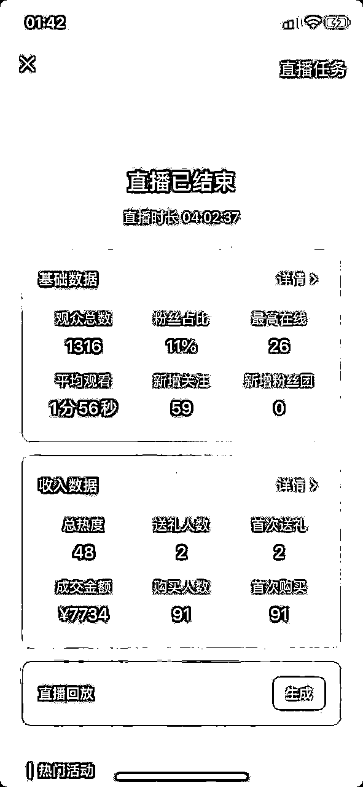
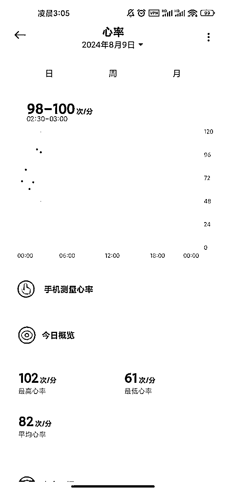
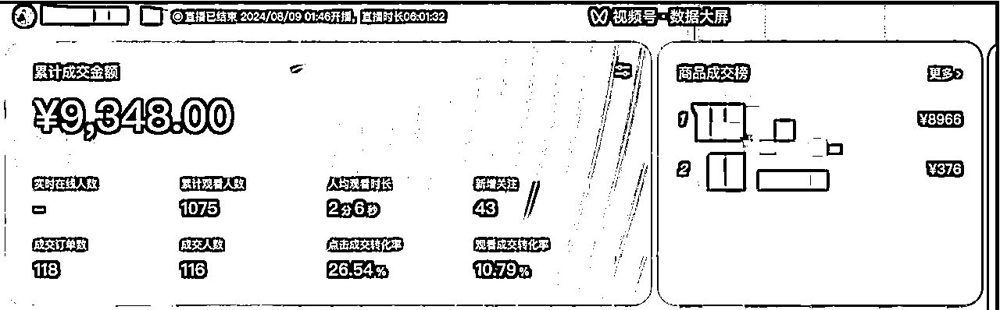
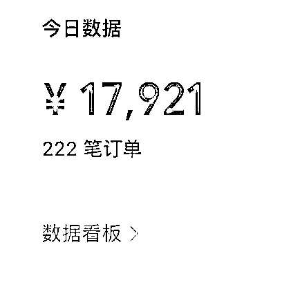

# 视频号口播航海，新手第一次爆单1.8GMV，我是如何接住这波流量

> 来源：[https://eim9fzbtjyh.feishu.cn/docx/MPm0dD0KDowjnmxvxkncRHUFnWO](https://eim9fzbtjyh.feishu.cn/docx/MPm0dD0KDowjnmxvxkncRHUFnWO)

# 自我介绍

哈喽，大家好，我是清水，今年4月份刚刚加入生财的圈友，目前是一名全职奶爸，并且全力在找寻合适自己的项目过程中。

今年参加过小红书店铺、小红书达人、视频号带货长航海，都实现了0-1，成功下船。

但是我觉得零星的出单这并不是我认为的0-1，真正的0-1应该就是有爆发有爆单，才是做一个项目真正让人向往和挣钱的打开方式，谁来生财不是为了挣钱呢？你说是吧~

# 爆单过程

视频号口播第二期的航海马上就结束啦，赶着最后给大家分享上周四晚上的那次爆单，

整个过程都还历历在目

那么直接来跟大家讲讲到底是怎么回事吧。

我走的历史书籍这条线，因为还在带所以具体哪个品就不说了。

当天针对这个品我录制了三条带货视频的文案

周三发布了一条（就是爆了的那条）

周四发布了一条

一直到周四晚上8点刚刚从外面回到家，发现周三晚上发布的那条播放到了6000（播放量，放到航海大家都数据里面其实并不是一条很高的播放）

但是我也有在持续观察每分钟的互动数超过了2次，一直有点赞喜欢。

然后我做了一个至今为止最明确的决定，马上开播

## 开播准备（其实完全没有任何准备）：

1、设备：电脑+手机，都备好电源，手机支架，最好有散热的东西（得亏的苹果手机播了3个小时的时候，手机快热爆炸了，抓紧冰箱里面弄了冰袋出来降温）

2、灯光：客厅的灯光比较亮，平时录制视频都是白天，当天晚上开播的，把所有东西都搬到了客厅餐桌上。

3、话术：当时完成没准备，去找了正在卖书的直播间，看了2分钟，扒了一段现在看来非常差的话术，哈哈哈哈，以下

“欢迎直播间的家人们，第一次来的家人可以，点点关注，点点赞，，刚刚视频里的那本书，确实觉得书不错，可以拍一下，都是包邮到家，现在是北京时间XXXX，对那段历史感兴趣的 可以带一本回家”

是不是挺可笑的，但是就这样的话书还是能出单的

4、样品：没有样品

## 开播

第1-2小时

21:30的时候慌里慌张的就开始了，其实一开始很尴尬，真的是第一次做直播，不过最近录口播还是是减少了一点紧张感觉

开播后就一直在那自言自语，记得电脑端打开直播大盘，同时开播的时候把商品上架，也可能看到有没有人进来

有人进来了 就多讲讲，就这样讲了大概一个来小时，诶还真的卖了几百块钱，感觉还挺不错的。

当时还想着卖了1000元就不卖了

这里有个致命错误，我上了商品后一直没有点击商品讲解，所以商品不会出现的直播界面，而是需要再红色购物袋里面点击才能购买。

这导致我前面2个小时，一直不断的引导用户点击购物袋，再点击商品购买，这显显然是会减少转化的

但是直播间还是不断有人在下单，虽然慢了一点，如果一开始点击了讲解，我估计当天的GMV至少能多几千

我在发现这个问题的时候立马进行了调整，果然立马有好几个人下单购买。

## 疯狂出单

第3-4小时

没有想到的是，开播后2-3小时，我整个人变得非常的亢奋

从一开始只会念那段无聊的话术后，也会开始用自己的理解讲解书籍的内容，同时也能够较好的跟直播间的人进行互动。这时候GMV因是来到了5-6K的区间了

同时爆的那条视频竟然不知不觉的来到了10W的播放量

真的直播和短视频是可以双频共振的，这是我没有想到的

一直播到3小时后，整个人确实有点疲惫了

又累又渴又想上厕所又不敢走开，哈哈哈

但是直播后后面整个人变得就比较轻松了

甚至吃吃东西喝喝水

每当我一说我主播播了太久了，嗓子哑了要下播了，就咔咔有人下单，真的是太有意思了

## 代播

第4个小时的时候真的坚持不住了

航海3群的家人们可能见着我在群里疯狂找人代播求助的情景，哈哈哈哈

因为这次带的品佣金不高

代播夜间是50/小时，其实还挺高的

还犹豫了一会要不要播。

咬咬牙还是上吧，不管凌晨是赔是赚，也算是跑了一遍流程了

好的这时候我下播了，这是我四个小时的成绩单，哈哈哈哈

好的，这时候时间来到了凌晨的两点钟，我看了一下代播姐姐上播了时候不一会就出了好几百，我就想着那一定稳了。

我立马整理了一下想着接下来要做什么

听了群里圈友的建议，剪了7条原视频去重视频，准备4点发布，补一下视频

其实这是百货打品的玩法，第二天鹏师在群里说并没有补视频一说

两点钟我怕打扰到家人休息，就没回房间睡觉，在沙发上躺了下来

而此时我根本不睡着，脑子里面一直在过今天晚上的事情哪里没有做好，已经现在播的怎么样了，明天会怎么样。一直到凌晨3点我的心率一直突突突的

## 楼塌了

中间强行平复心情，做腹式呼吸终于是睡了一会

一直到早上5点，我起床补了视频，GMV这会应该是跑了3000+，我想着那代播费用是不愁了

让代播姐姐继续播

实在太累又回去睡了了一个半小时，

6点半，发现补的视频也都跑了2000左右，可能还是有点用，但是不多，哈哈哈

关键的视频被人投诉了

因为原视频使用了一部分书籍画面，没有想到被原作者发现了。

这时候确实有点慌了。时间也太早，没人求助

投诉可以选择申诉或者承认自己违规，这是我也不敢轻易的点

因为直播现在跑的很好，基本都是20人左右的在线。

一直到7点半，因为投诉没处理，被判成立了

一共2个小时的处理时间，对我来说是懵的

生效后，视频查看不到了

直播间流量短视频流入的瞬间，没有了，虽然还有直播间推荐的进入的。

其实是不精准的

又播了十几分钟，GMV 在线都没有

下播！，至此我的爆单之旅结束了

# 复盘

至此当日直播10个小时整一共直播加橱窗1.8WGMV，后续还有零星出了一些，包括其他的账号

## 问题

1、对最重要的违规，自己的思考，确实用了人家的视频，虽然只露出了手和字，但是没有办法。但是如果当时选择有异议多拉扯一下，又可能会让直播多播一会，那可都是钱啊。

2、一开始没有点讲解，导致商品购买流程增加，其实也损失不少GMV

3、直播话术，完全没有成体系，没有塑品、没有逼单，后期对这块还是需要精进一下。毕竟一开始都是想着自己先播一下

4、视频其实爆得，还比较看运气的，后来看这条视频，确实觉得还拍的不错，其实对于爆款视频感知还是比较弱，目前还是以量取胜

5、应该还有很多一下子想不出来，如果有圈友看出来，也欢迎跟我说哈

## 反思总结

1、后期视频一定要减少违规可能性，包括文案、画面、视频等，如果没有这次违规我其实有信心至少跑到中W

2、直播整个流程操作还是不熟练，第一层手忙脚乱都是自己来，有了第一次后，后续做起来应该就能得心应手了

3、带货视频达到6000播放，每分钟1-2互动，一定要尝试上播。数据低也可以尝试，流量视频也可以尝试

4、有产出的情况下，不要怕一定要找代播，一个人是熬不住的，一定要抓紧放大这次机会

5、书籍带货，总体还是走的长期运营的逻辑的跟百货还是不太一样。只是没想到这次竟然还是通过直播的方式短时间能卖出这么多货

6、虽然粉丝数量还没过1000，但是违规的处罚目前看，也就是视频下架，账号显示正常，一直怕会有限流，最近几个发了流量视频有个四千多播放，总算是放心了。至少账号没事

到这这次梦幻的爆单经历就结束了，作为视频号口播小白，生财新人，有这样一次经历，真的让我对这个项目有了更大的信心，虽然佣金其实并没有达到我的预期，但这个应该是我裸辞后3个月通过努力挣到的第一笔还算客观的费用

也希望各位圈友都能都够达成自己的目标

有任何疑问的也都可以联系我，知无不言~

那么我们下一次爆单见吧！！！