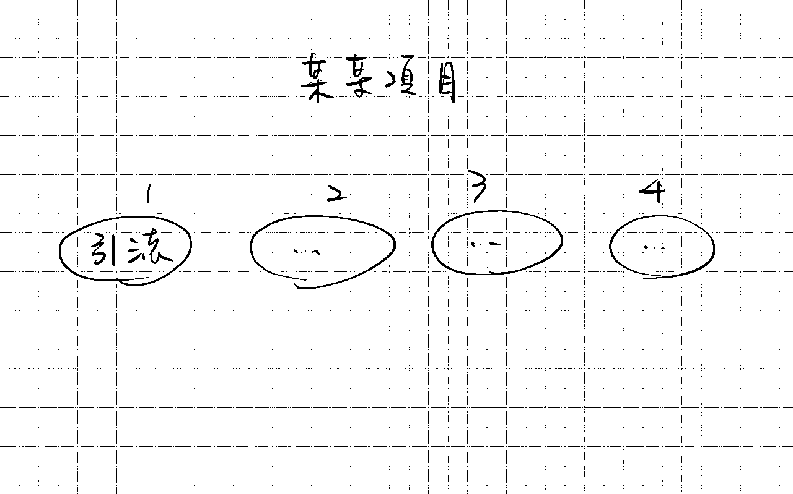
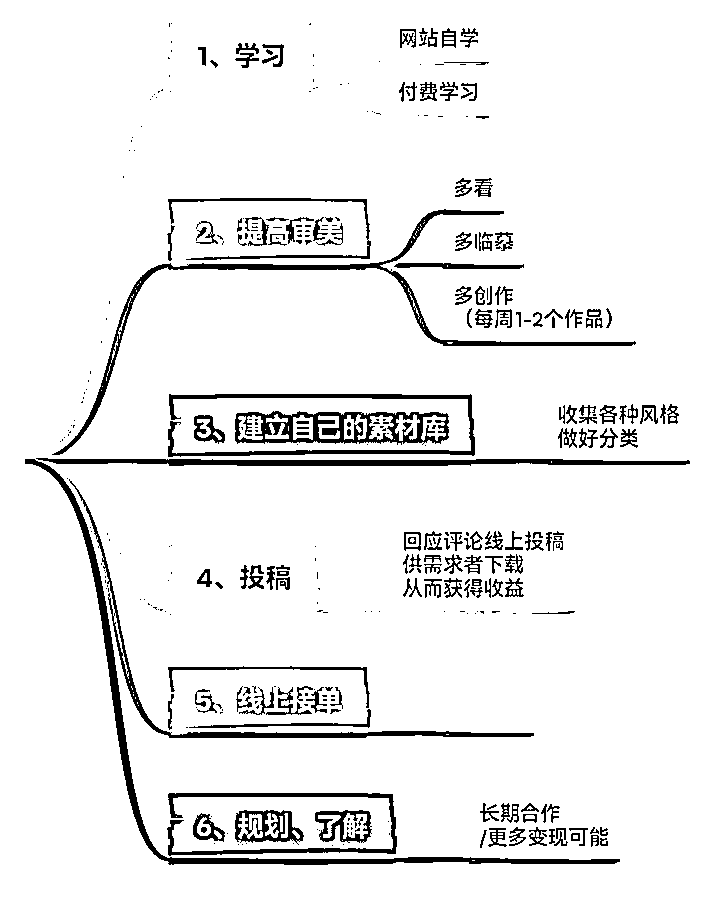
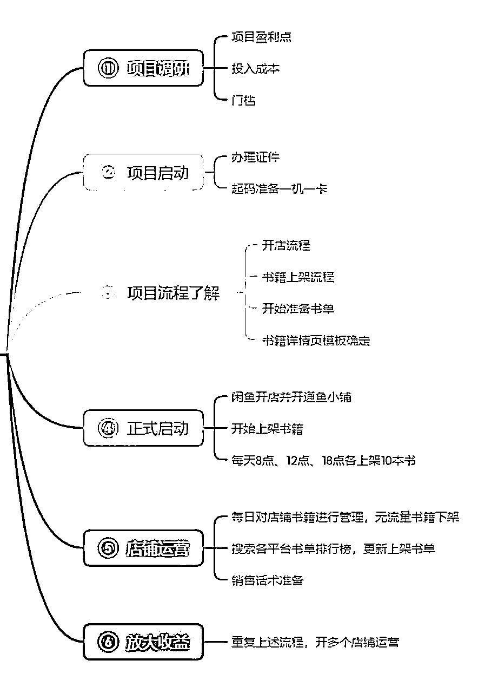

# 《用这 13 个思维，我做过的副业全都成功变现！》

> 来源：[https://oee5lr7gsk.feishu.cn/docx/QZeZdLyTWocSwaxRb7CcBVmunaf](https://oee5lr7gsk.feishu.cn/docx/QZeZdLyTWocSwaxRb7CcBVmunaf)

全文共：18,142 字

预计阅读时间：12.12 分钟

圈友们好，我是根源

目前已经在知识付费、以及私域运营的赛道深耕两年半

这一年多，跟明白老师还有陈雪美女一起做俱乐部

成绩都还稳定，会员的净成长跟复购率，数据也都挺好

今天依旧想谈一谈副业这个主题

我一直觉得赚钱的本质，是认知的问题。

一个人的认知和格局越高，赚钱就能越轻松，

这个认知也是思考和执行的顺序。

高手之所以能比一般人更容易把项目做成，以及赚更多钱，

是因为他们清楚地知道，每一个项目，我思考的顺序是什么，我执行的顺序是什么，

以及在执行的过程中，我如何做，才能增大成功的概率。

因为我自己有12年的自由职业和持续做了很多副业项目的经验，

在做了这么多项目之后，我发现赚钱的底层逻辑是相通的。

我也想通过这篇文章，提炼我自己思考如何做一下新项目的底层逻辑

也结合我自己过去的一些经验和看法

希望这些经验或方法，能帮到正在看文章的圈友

很欢迎看完文章后

能一起讨论。

* * *

# 副业赚钱不是能力问题，核心是认知的问题

我还记得2012年我的老师跟我说过，她说

### 赚钱跟能力的关系不是最大的，一个人的能力只能决定他是否能赚钱，

### 但是一个人赚钱能够赚的多少，决定在他的认知。

一个人的认知只要不到，他的赚钱，就一定不会提升。

这是我在12年前听到的一段话，至今我依旧印象深刻。

但是当时我其实不认同这句话，

我觉得赚钱就应该是能力问题，怎么会是认知问题呢？

那到底什么叫认知？又到底什么叫格局？

这是当时我对这个事情的困惑。

那时候大概困惑了好多年，我一直都觉得老师在骗我，

一直到了近几年，我才发现原来这是事实。

赚钱真的跟能力没有太大的关系，而是你认知到哪，赚钱就会到哪。

但到底什么是认知？

### 认知是一种对于做法以及想法的顺序。

我举个例子，有人可能说，

老师，我想做副业，

老师，你告诉我，我应该选什么样的副业最好？什么样的副业适合我？

这个问题其实在我的世界里面是一个错误的结构，

因为一个副业没有经验的人，一个对于赚钱不熟悉的人，

他要做的从来都不是选择一个副业，什么副业适合我，

他要做的是找一个人，让那个人给他推荐干什么，接着他就是听话照做，过程中不抱怨。

也就是呢，正常的认知叫做我要找一个我喜欢的副业，

但是我的认知叫做找一个人，让那个人直接给你推荐一个副业，你就只要做那个副业。

这两种顺序是完完全全不一样的，

因为一个不熟悉赚钱的人，他当下的认知怎么可能找到一个适合他的副业？

这是一个很荒谬的想法！

就像一个不会打篮球的人，你让他挑一双好球鞋，他挑不来的。

一个不会跑步的人，你要让他挑一双好跑鞋也挑不来的，

所以，认知决定你的做法顺序，也决定你的思维顺序。

所以，所有的副业能不能够做的好，

也决定在你这个副业执行的顺序到底是对还是不对？

逻辑很重要、顺序更重要，因为逻辑就是一种顺序

别小看用正确的顺序做项目，保证你事半功倍

但是到底要怎么规划顺序？到底什么才是清晰的顺序？

也就是把你目前做的项目，又或者准备想做的项目，做一个『顺序排列』

这个项目做的顺序应该是什么，先清晰的列出每个大模块

可能五个步骤

可能十个步骤

……

反正你能想到多少步骤，就写出多少步骤，要越清晰越细致越好

* * *

# 重新思考副业流程的顺序

逻辑很重要、顺序更重要，因为逻辑，就是一种顺序

别小看用正确的顺序做项目，保证你你事半功倍

但是

*   到底要怎么规划顺序？

*   到底什么是清晰的顺序？

⭕️第一点有提到

把你目前做的项目，又或者准备想做的项目，做一个『顺序排列』

做的顺序应该是什么？

这个顺序排列，必须得『图像化』

先清晰的列出每个大模块，细节能先不写，先把大框架写出来，

就类似于下面这张手绘的图像

就像这样，先把大的模块写出来

因为模块写出来，才能重新思考这样的顺序，到底对还是不对

⭕️第二阶段，修改成大模块

可能五个步骤、可能十个步骤

反正你能想到多少步骤，就写出多少步骤

原则就是，越清晰越细致越好。

* * *

# 手绘副业项目的流程图

我们看这张图，这是我在网络上随便找的一个项目

这个副业内容，是帮别人做ppt，一个不大、同时也有市场的项目

我认真看了一下结构，拆解了出了六个流程，分别是：

1、学习

2、提高审美

3、建立素材库

4、投稿

5、线上接单

6、规划、了解

也就是，一共有六个步骤

手绘之后，我会把流程用导图的方式，重新做一次呈现。

重新对自己的流程，做一个排列

手绘后转成导图，可以更清晰的知道所有过程的细节。

转换的过程，因为可视化的转变，能评估

我目前拆解的顺序有没有可能导致，变现出现了阻碍，又或者是扩大出现了阻碍

同时，还可以在观察的过程做一个重新排列

或者是更新、插入新的流程、步骤

就像上面我拆解出项目文章的顺序

1.  到底是提高审美优先，还是素材库优先？

1.  到底是投稿优先，还是学习优先？

然后，这过程一定少了些什么

才导致，目前出现了很大的阻碍

* * *

# 如果想要赚到钱，需要补足哪些能力？

修改后的步骤，如果你想要真正的落实执行

想真的做到赚钱，还缺乏哪些能力？又或者是，应该再补足哪些能力？

到这个阶段，就得从大框架来找出目前有哪些能力是自己不足的

最优先的方式，先别急著找老师付费，而是先找找，有没有能免费看的文章

又或者是精华帖有相关的详细内容，从中找寻并边看边学

这里很容易出现一个状况

就是没有控制好学习成本，想著这不会，就花钱学一学

但多数的副业刚开始，需要的技能，真的都不用很深入

现有的很多文章跟免费内容，其实都足以解决90%以上的问题

（除非像是编程，这种特专业的，那另当别论）

副业的初期，一定要考虑的做副业的成本

这太重要了，因为做副业就是做生意，

做生意不考虑成本，大概率公司不会赚钱。

* * *

# 用一个更好以及更正确的顺序来经营项目

对我来说，能不能够把一个项目做好，很大的关键倒不是自己的能力有多强，

而是我可不可以把项目用正确的顺序来做，一个好的顺序可以让项目快速盈利。

但如果说在做项目的过程顺序出问题了，

就会导致拖了很久，但是依旧没有赚钱，又或者是一开始做就赔钱。

所以我会非常在乎做一个项目，

我能不能够用一个更好以及更正确的顺序来经营项目。

## 做新项目最好的起步方式：找有结果的人，直接模仿

之前有一位学员做咸鱼二手书的项目流程梳理，我就以这个例子来做一个讲解。

学员的最优先顺序叫做项目调研，他分了三块

*   项目盈利点

*   投入成本

*   还有门槛。

但如果是我，我可能不会把项目调研放在做闲鱼二手书的第一个优先次序。

想象一个场景：

之所以会选择做这个项目，

一定是看到某一个帖子，或者是某一个优秀的人，

又或者是你感觉这个项目好像我能够操作，

但是就算你认为这个项目你可以操作，一定是有某一个人做了，

你觉得这个逻辑好像可行，这个逻辑应该能通，这个逻辑应该适合我，你才会开始进行这个项目。

所以，对于这个项目来说，

我第一个一定不会以项目调研为优先，我会直接模仿。

我会直接找做这个项目有真实成绩的人，

因为他写的帖子一定有一个完整的操作顺序，只要他有操作顺序，我会完全的照抄。

我不会这个在操作顺序之前，有任何跟这个写帖子的人不一样的地方。

假设他的顺序是一到七，那我的顺序也会跟他一模一样，做一到七，

所以其实项目调研这个部分，在一开始这个问题就解决了。

做这个二手书的项目，

### 我的最优先顺序跟最优先的层级，一定是我要模仿谁，

### 又或者是我要跟随谁，又或者是我要按照哪一个帖子跟着照做，

这个会是我的第一个操作的步骤。

* * *

## 在模仿的过程中，边做边补足能力，跟增加认知

也就是第一步骤，我会模仿，

当我模仿之后，我会把这个我想模仿的模仿者，他的流程一个一个写下来，

并且去评估这十个流程，又或者这七个流程有哪一块是我做不到的，

有哪一块是我能做到的，有哪一块是我需要提前花时间准备。

只要我能够清晰的知道流程，并且给自己一个判断，

我就能够在最开始去算出这件事情我能够多快回本，

这件事情我是否要支出什么样子的费用，

又或者这个事情有没有哪一件事情是我一开始我就得赶快去申请的。

举个例子，如果说今天我要煮晚餐，

我的最优先顺序一定是我得先知道今天我要煮什么，

第二个，我就得看冰箱缺什么，厨房缺什么，我得先去买嘛。

我得先把外卖叫好，因为外卖来需要时间，可能需要40分钟，

那当我开始准备要做饭的时候，我最优先的事情一定不是备菜，我一定是先煮饭，又或者是炖汤。

因为煮饭跟炖汤都是一个需要40分钟以上的事情，

尤其如果说我知道炖汤要一个半小时，煮饭需要40分钟，

那我一定会先把炖汤的事情都弄好，接着我才去煮饭。

就像是今天做闲鱼二手书，这里面，有一个叫做办理证件。

办理证件一定需要时间，那我会把那个最需要时间并且在做的过程，

很关键的事情在一开始我就做了。

所以我

*   第一阶段是，『模仿』

*   第二阶段是，把这个模仿对象的步骤一个一个写下来，

*   第三阶段是，

接着我会把每一个模仿步骤要做的事情，做一个时间列表

哪一个优先，哪一个次之，

哪一个是我暂时不急，也没有关系。

当这个列表列出来之后，我就能够对于这个项目有一个最初步的判断，

什么时候能变现，什么时候能做好前期的准备，

以及什么时候我能够去补足我所不懂的能力，我不会的能力，

这时候你才会知道你要补什么，你要准备多少钱，你要准备多少时间，

你才可以有一个对于项目更清晰的认知跟判断。

* * *

## 前期的听话照做，是快速获得正反馈的关键

我先假定学员的这张图片，他已经模仿的某一个这个帖子的成功者所列的流程。

那我要做的事情就是我模仿对象出来了，我的这个列表也出来了，

1.  我就会在项目盈利点后面括号备注（我想赚你多少钱）

1.  我会在投入成本后面括号备注（我要投入的实际金额是多少）

1.  我会在门槛后面括号备注（如果说我想要满足这个赚钱条件，我应该需要具备什么能力）

也就是，这整张表格会是一个

我来判断我在做的时候还缺什么，还需要什么的一个评估点，

而不是我的操作流程。

然后下面有一个开店流程，开店流程我需要多少时间，我需要准备什么，以及现书书籍上架的流程，

这流程有哪一个事情是我现在做起来困难的，

然后我要花多少时间做，又或者是这个闲鱼开店并开通小铺，

那我需要具备什么样子的资质，这个资质他申请需要多少时间。

……

我会在一开始

就把所有的时间段跟我所有想完成的一个阶段性目标，会把它列的很细节。

这时候我就能够知道我第一步应该要做什么，

我第一步要做的一定是那个最繁琐的过程，

因为这时候我已经不是判断项目能不能做了，

而是我要判断我怎么做可以让这个项目拥有更快的获利方法，我能够赶快的变现。

因为一个项目能不能变现，决定一个人可不可以有好的正反馈，

一个人只要有正反馈，他就可以在做项目的过程可以更起劲，可以觉得这个项目有希望。

所以总结就是

如果就学员这个项目来说，

⭕️流程一：

一定是先找出一个对标人或者是对标文章，

然后完全模仿他的流程。

⭕️流程二：

把这个人的流程完全拷出来，并且在每个流程的细节上

写上我想完成的目标，需要完成的时间，需要准备什么，

以及如果有我缺的，那我应该怎么去补，

这个过程可以同时知道，我需要付出多少钱，我需要这个进多少货，

又或者是我需要准备多少资料，又或者是我需要办多少证，

这个可以在第二个步骤就全部出来了。

这个时候呢，我不会有自己的声音，我会完全的照做，

而且我会把它的流程完全照操，并且复制做三个月以上我才会开始做变化跟转换。

⭕️流程三：

完全照抄这个人帖子上的操作流程，

但是，前两个月我不太会问，我会以看文章，我对于文章操作步骤的理解来去做。

因为在前期有一些试错过程是需要自己去走的，

同时在前期有一些事情，如果说你没有真的自己实操，

你就不会知道这里面有哪一些门道，这里面有哪一些细节，

又或者是这里面有哪一些事情是必须得经过一点时间，我才能够得到结果。

就像是我跟一些人说，你在做销售的过程，

如果你想要能够突破成交的这个阻碍，你必须得先谈100个人。

当我这么给学员建议的时候，他可能聊了三个被拒绝，就是说老师为什么有我又会被拒绝。

聊了十个被拒绝，又说老师为什么聊了十个我都没有成交。

因为他没有真实的走过这个过程，所以我就算告诉他，

他为什么被拒绝，他为什么没成交，其实都没有用。

所以，在操作项目的第三步骤，

最难的就是我如何能够完全的照做，

并且给自己三个月的时间，我再去找人问，

这个时候项目才可以有一个更完整的逻辑。

所有的项目其实都可以参照这三个步骤，

### 那这三个步骤有一个很大的关键跟很大的注意点，

### 就是在完全照抄的过程，不要有自己的声音。

只要你有自己的声音，这个项目的完成度或者这个项目的进度一定会大大的被拖延，

除非你曾经在某一个领域有过非常好的成绩，这个成绩可能是你能够赚个两三万以上，

那这时候你的看法可能就会正确。

但如果说你过去没有过成绩，只是一个初次想尝试做副业的人，就完全不要有自己的声音。

这个才可以让项目的初期做的更加的轻松，跟更加的顺利以及更加的流畅。

* * *

# 熟悉平台的规则以及给自己设定清晰明确的短期目标

刚好谈一点我以前自己做项目的一个经历，

就是在做项目上，我自己的变现其实用了很长的时间，

尤其当赚到一些挺不错的收入也确实用了挺长的时间，

那我都在想，当时我到底走过了哪一些路，

可以让我后期的变现过程能够稍微的比一般人要再好一点。

所以今天会以我的经历谈一个很重要的思维——熟悉平台的规则

## 熟悉平台的规则，可以更好地借力平台获得反馈

我当时第一份工作做的是直销，

就是我离开上班族之后的第一份工作，也是跟着老师的第一份工作，

那时候，直销的体系其实挺简单的，就是把东西卖出去，要么卖产品、要么卖会集，

那在最开始了解这些公司的时候，我其实也不太知道公司的规则，

我也不太知道这个公司是否有价值，我其实都不知道的。

当时，老师只说如果你要做，你在入会的时候，要对产品有了解，就必须得买那个比较大的套组，

所有的经营者都一定要买套装，那时候的套装我记得是一两千块吧，

反正2000块以内，确定的金额我也忘记了。

对于当时的我来讲，其实是一笔很大的钱。

但是反正老师都开口了，他都讲你想在这边成功，一开始就必须买套装，

所有的经营者都必须买套装。

所以我也买了套装，花了快2000块，也挺心疼的，毕竟花那么多的钱。

那买了之后呢，就开始使用产品，

但是我买产品之后没有隔多久，我那时候发生了一个对我对于我来讲挺深刻的事情。

老师只说

如果你想把一个事业做好，

一定要知道这个事情，又或者这个项目，有什么样的规则，尤其是赚钱的规则，

又或者是如果这是个平台，你要清楚制度规则。

就类似今天我加入生财有术：

我得知道生财有术里面，认真写文章，

如果写的好，分享的好，可以得到精华，

有了精华就有龙珠，有了龙珠在生财里面最少你已经可以超过80%以上的人。

当你有了龙珠，你就能够在发文章的时候可以放上自己的微信号，

就会有人主动的链接你，你就能够在这个平台有更多认识的新朋友，

以及你就能够得到更多的好机会，认识更多更优质的人。

这个就是一种平台的规则，但这个叫做隐性规则，

就是并没有在公告里面写着一定要写文章，

这个只是大多数的人在平台里面想要得到更多的活跃而得出的一个结论。

所以做任何项目之前，又或者你想接触任何的平台，关注项目之前，必须得先知道规则，

当你对于规则的理解越清晰，当你对于规则越明确，其实只要按照规则走一定不会得到太差的成绩。

尤其像很多的文章，或者是你去听很多的演讲，那些做的好的人都会讲顺应平台，

假设这个平台说目前扶持视频号，那你就认真把视频号做好。

如果这平台讲说，他禁止把微信号放在什么什么地方，你就不要在那个地方放微信号。

所以，我觉得先知道这个平台的规则，

### 这个项目的规则是进行一个项目之前要花最多时间了解的。

当时我其实没有认真了解规则，

但是老师有跟我说规则，所以那个时候，我的想法很单纯，

就是老师让我干嘛我就干嘛，

那时候平台的规则呢，就是推荐八个人，最开始的第一关卡。

只要把会籍卖出八个，就能够得到一个最基本的位阶。

就是我们当时是有不同的等级嘛，一级二级三级，

我们那时候的等级叫总监，我只要推荐八个人，我就能够上总监。

所以当时那个平台对于经营者的最基本规则就是，

拿到总监是所有的新人，甚至所有的经营者第一阶段一定要做的。

那推荐八个，感觉不这么困难。

但是，对于我来讲，对于一个新人来说是很困难的，

那时候我其实很庆幸啊，我庆幸的是因为老师把规则研究过了。

所以，她没有告诉我规则是什么，她只跟我说你需要做什么。

我觉得这是跟着一个人的好处，

这样可以让你省下很多了解规则，又或者重新去理解规则的时间。

所以那时候呢，我的第一个点是有人帮我了解规则，

* * *

## 给自己设定阶段性的目标

接着上一个思维，

因为老师帮我了解规则，同时老师给我设定了一个时间段，

这件事情太重要了，一定要给自己设定这个项目的阶段性目标。

就例如我当时的阶段性目标是我一定要推荐八个人，

那时候我记得是2月20号吧，因为2月份只有只有28号呀，就剩八天

所以在2月20号的时候呢，老师就跟我说，

这个月底之前，如果说你没有推荐八个人，我就不带你了，我觉得你在这个工作上你是没有天赋的。

所以，第一个月我的这个目标就是我必须得想办法完成八个人的推荐。

那时候，我的目标很明确了，我知道我要做什么，

虽然我的能力不足，但我知道我要做什么，这就很重要。

虽然我知道我的能力不足，但是我知道我要做什么，

当我的方向确定的时候，我却不会有太多的想法，反正先做了再说。

我就想办法去推荐八个，那老师说月底，我想着距离月底还有时间，一看日期发现糟糕，剩八天。

然后，老师讲完的隔两天，刚好是周六跟周日，

也就是扣除假日，我就剩六天，这是一个非常紧迫的一个过程。

但是就是我清楚的知道我的目标要做什么，

所以，当你知道规则之后，

如果说你是自己研究的，当然我不会希望自己研究，我会觉得找一个人教你做，这是一个更有效率的方法。

所以，知道规则之后，

第二件事就是给自己设定一个阶段性目标，

那这个阶段性目标千万不要设的太长，

就不要说什么我希望三个月之后可以赚5000块。

我希望半年之后可以有这个第一阶段的小成绩，

千万不能这么设定目标，

### 目标一定要时间短，并且要有一个很清晰的数据，

### 也就是目标越清晰，你的做法能够越落实。

就像有人可能想做咸鱼，你可以说我给自己设定两周的时间，

我要在咸鱼的这个平台可能赚到1000块，可能赚到5000块，

然后，第一阶段的目标不要设的太低。

不要把目标设到让自己听了就发现，

哎呀，

这个项目好像没什么希望，

这项目做起来也就是这样，

所以，给自己设定一个清晰的目标之外，

这目标必须要明确，然后时间不要太长。

目标设定的模板就是清晰的时间加上清晰的数字，

一定要把所有的目标量化。

接着在了解规则的前提之下，有清晰的时间跟清晰的目标，

这个目标越短越好，尽量在两周之内，不要超过两周。

如果说你的项目在一开始可以这么设定，你的副业的进展肯定不会太慢。

* * *

# 对赚钱这件事有正确的认知，并且对「钱」保持尊重

我发现大多数的人在做副业的时候赚钱速度不快，

又或者是赚钱可能没有那么大的效率，又或者是赚到的钱可能不如自己的预期，

就是明明那么多的人做个副业都赚了那么多钱，但为什么我做副业好像没什么成绩？

其实有个很关键的点，除了顺序之外，第二个点是对钱的认知。

## 对赚钱这件事，有一个清晰的认知

什么叫对钱的『认知』呢？

有太多的人把赚钱这事情看的太容易了，

就是我今天看了一篇帖子，发现他有步骤，他有做法，他有细节，

好像我只要完全照抄，完全模仿，我就能够得到同样的收入，我就能够得到同样的结果。

但其实并不是这样，赚钱是一件非常困难的事情。

你要想，今天一个上班族，

每天得九点或者八点，甚至有些公司可能七点整到公司准时打卡。

打卡到六点，再打卡下班，有时候可能还需要加班，你必须得连续30天。

如果扣掉休假，连续26天，每一天做着同样的事情，

你才可以领到工资，才可以领到收入，

也就是赚钱本来就复杂，赚钱本来就困难。

但大多数的人会想着

哎呀

看了一篇文章

这文章也就这样子

我照做就好啦。

但为什么赚不到钱？因为你把赚钱看的太容易了。

所以，这里想谈的主题是认知，

如果一开始你对于赚钱本来就不是很简单的认知，这个时候你才有机会赚到钱。

因为有了这个认知，你才会把赚钱这个事情看的严谨。

有很多人会想着

哎呀

要不我尝试做做副业，

我其实不太喜欢听这样子的语言跟文字表达，

是因为尝试就是来玩的，尝试不是玩真的，而是玩玩。

如果说你带着玩玩的心态来赚钱，在初期没有任何经验的情况之下，很难有收入。

那有人却说，

老师，我听过有一些有钱人就提到，赚钱轻松点啊。

赚钱，不是一件很困难的事情啊。

那是因为这个人过去成功过，

你要想，如果今天讲这个话的这个人，他曾经一年赚过五百万、一年赚过一千万，

那他确实可以说一个20万的项目，30万的项目，玩玩就好了。

因为他的格局已经很大。

但是就算这些人说赚钱只是玩玩的，你会发现

他在做任何跟赚钱有关的事情，他依旧很严谨，他依旧非常的小心。

所以必须要对赚钱有一个清晰的认知，

就是赚钱很困难，赚钱很严谨，赚钱需要每一步都小心翼翼，

甚至赚钱得在每一个步骤，每一个环节都尽量的做到好，做到极致，

这样子你的赚钱就会相对的容易。

* * *

## 你是否是一个会尊重每一笔小钱的人

接着第二个认知叫做『你对于钱到底尊不尊重』。

这个思维其实大多数的人不曾想过。

你要想，再一个初期赚钱的项目，

假设你可能做的是一个99元的这个陪伴群，又或者是39元的分享群，

又或者是你买一个25块的东西，又或者是你做这个咸鱼，然后卖一个100块的东西。

其实在副业的初期，你做的一定是低价产品。

那我们就知识付费为例，如果说你卖一个39元的产品，

当你在卖给别人的时候，你心里面总会想

哎呀，

为什么今天我我收了39块，

结果我的群里不活跃，

这些人不认真，作业都不写。

但是之所以会有这样子的情况，

都是因为你自己在支付39元、100元产品的时候，你也不会认真。

因为你打从心里就觉得

哎呀

39元就不是个钱

99元就不是个钱，

当你开始有这样的认知，就代表你对于钱开始有了不尊重的感觉。

我记得在当时我第一次做知识付费的时候，

那个群好像是299元吧，这个钱对于当时的我来讲是很大的，

因为那时候我没有那么会赚钱啊，那时候我记得是2019年一个月也就赚个五六千块，

所以299元、39元对于我来讲是一个很高很高的价格。

我花的时候我会考虑的，我会考虑这个钱我到底有没有能力花，

我会考虑这个钱花了之后，这明明可以让我搞定三天的午饭跟晚餐，但是我难道要花钱去学习吗？

但是，我最后我还是决定付了我付的第一笔299元的线上知识付费，

我可认真了，所有的内容我都用逐字稿全部打过一遍，

我把内容做一个重点整理，我把内容做一个很完整的分类。

也就是我会很重视我每一笔花的钱，

### 当你开始尊重钱的时候，你就可以吸引到一些也会尊重钱的人来跟你购买，

### 也就是你会多认真看待你付的每一笔钱。

甚至那时候就算是一个9.9的群，群里面讲到的所有任务，所有作业，我一定是第一个完成的。

因为我知道每一笔钱都不容易，我也知道每一笔钱如果我不认真的去看待，那我这个钱不就白花了吗？

所以这是关键。

那我就在想，就像当时的俱乐部的赚钱小课的成员，虽然付的钱比较少，

也就付101块，这钱不多的啊，这钱你省下个一天吃饭你就能省出来了。

但是省出来之后，付费进群之后，

你会发现好像不是那么认真对待作业，好像不是那么认真的看内容，

好像也不是那么认真的做互动，这个其实是一个人之所以赚钱会很困难的很大原因。

也就是

### 第一个认知叫做『赚钱本来就不容易』，

### 第二个认知叫做『你是否是一个会尊重每一笔小钱的人』。

我真的会尊重每一笔花出去的钱，

所有花出去的钱，我一定会认真的看档案。

也因为这样，我在知识付费上花的钱其实不多，

我一年我最多跟三个人做知识付费，我不会再花多了，因为我知道我没有办法学那么多。

第二个是我知道有大多数的东西，可能看了内容，看了简介，跟老师聊天，

我就觉得这个老师的内容我可能目前不需要学，又或者是我已经会了，

所以当你开始会尊重每一笔钱的时候，

当你开始会尊重每一笔花费的时候，那你的赚钱就有机会可以提升。

第七个重点，有两个非常重要的认知

1.  第一个认知是：我对于钱到底尊不尊重，

1.  第二个认知是：我知道赚钱本来就不是一件容易的事情。

* * *

# 贯彻思维：把一个项目认真贯彻到底

我发现大多数的人做副业的时候，会很快速地遇到困难

又或者是做了一阵子，结果他想要达到目的却不如预期，就放弃了。

从第一次提到的小目标然后认知然后对于金钱的尊重

第四个我觉得是：有没有办法贯彻某一个思维做到底

我们总希望学了一个东西可以马上有效果

我们总希望做了一件事可以马上赚钱

我们总希望今天学一个新东西可以马上得到正反馈

……

但是这不可能

因为所有的新东西，都是我们世界里面原本未知的思维。

就像今天投球

我今天新学了一个投球姿势，你会发现怎么投都投不进

但是，这个老师用同样的姿势怎么投都投得进

原因是什么？

重点都不是投球姿势，而是他投球的经验多了，他投的命中率就高。

那这老师在学习的前期，他可能花了半年的时间发现他怎么投都投不进

然后到变成怎么投都能投得进

我称这个思维叫做「贯彻思维」

什么叫贯彻呢？

贯彻的意思就是，我在学一个新东西的时候我会不会给自己一个时间段

那时间段我的设定是，最少三个月到半年。

如果严格定义我会定义半年

也就是，我学了一个新的方式，我学了一个新的思维

如果我的尝试我的认真贯彻没有超过半年以上

我都不会评价这东西不能用，甚至整个过程我都不会改变方式

我会把同样的方法连续做半年，

我才会去评价原来的这个东西不适合我

又或者是原来这个东西它好像没办法赚钱

因为很多的事情，如果说你没有贯彻，其实你没办法懂其中的道理

哦，原来这地方

做到了第二个月会遇到这样子的情况

原来这事情，做到第三个月会遇到这样子的情况

甚至原来这个事情我做了半年，

我才可以达到讲师说的效果

这是一个过程，

很多的过程都得自己走，而不是我单纯看文字我就能够得到的

但是很多人会很急，就是我看完之后，我去告诉自己我一定可以在半个月得到效果

半个月只要没有效果，那就代表这方法是不对的，就代表这老师说的方法不对

一定有更好的办法，所以我决定再找其他人。

你就会发现你得从零开始，换了一个人的思维，就得从零开始

除非你过去在做事的时候，真的有属于自己的成功经验

如果说你过去曾经成功过有过很好的经验

这时候你可以尝试着融合自己的经验

但如果没有，如果你是个新手，过去都没有这样子的经验

你会发现你在做的时候你就不能够融合自己的经验，因为你融合自己的经验没有用

老师给的方法是100分

你的方法是-10分，一融合之后呢就变成90分马上扣了分数

就是你不止没办法完全的模仿完全的抄袭还会扣分

所以，贯彻思维就是

当你在学一个新的项目或者是新的方法的时候

你要做的事情应该是我能不能够让自己坚持最少三个月

这三个月不换人、不换方法、不换项目

如果说可以有这样三个月以上的坚持，你才能够做到一定的成绩，你才可以知道：

哦，原来这个老师说的过程

我必须得先有实战，我才可以得到这样子的结果

很多时候，没有实战是根本看不到结果的。同时没有实战，也不可能获得反馈。

我还记得以前在学销售的时候，

当时学销售我们在早会最重要做的事情就叫背逐字稿我也称那个叫刻钢板

也就是老师会给我们一套话术，那个话术可能有300字

然后，那300字，老师的要求就是

见到客户你一定要把这300字全部一字不漏的讲完

因为这300字是客户听完之后一定会有兴趣的话术

而且那个话术，也是老师用了好几百次的聊天，好几百次的谈客户精炼出来的话术

那时候，这事情对于我来讲非常的困难。

因为我就得背，那背完当然不难，我多背几次我就能背熟了

最难的是我要跟客户当聊到产品的时候，一字不漏的把同样的话术说出来讲给客户听

我最开始在这么做的时候，发现我讲完了，客户也没成交。

所以，讲了一次我就告诉自己这方法没用，这话术没用，老师说的是错的。

然后，我就说

老师

我觉得你这个话术，我讲了之后，

客户也没成交啊，我能不能够换个方法

老师说

不行，你最少讲三个月

我就这么硬生生的讲了三个月，

因为当时所有的面谈，我都要把录音发给老师听，所以只要没有讲老师就会知道

三个月之后，我发现有一个很神奇的事情发生了

一个月前我一开始在学话术的时候客户不太理我

但是当三个月之后我再讲同样的话术因为我练了很多次了

我发现客户竟然听完之后会有兴趣

我就在想到底发生什么事情，会导致同样的话术却有不同的结果

就是因为熟悉，因为话术的音调，话术的肢体，话术我要如何拆

可能在这个时候，得讲前100字，

然后再聊三四句，再讲后面的100字，

再聊几句，得讲再后面的100字

也就是

我开始会知道，原来同样的话术，

会因为经验的不同，会因为现场环境的不同，我就有不同的组合

以及我会改变我的说法，改变我的语调，然后同样的话术最终客户就成交了

但是如果没有这三个月的练习，

我没有办法得知原来同样的话术我应该怎么说

所以初期的背、初期的模仿，你就得认真做三个月

你才知道这个模仿，跟这个照做，它到底应该达到什么样子的效果

这个效果只有靠你个人大量的实战，才可以得到同样的效果

* * *

# 固定时间做固定的事

接著是一个很重要的思维叫做『固定时间做固定的事』

我记得以前在当老师助理的时候，

那时候呢老师每天早上五点会起床，因为我的老师是一个不太需要睡眠的人，

在八字里面她叫身强格，所以她睡的少，然后她睡的晚起的也早。

我还记得有一次，他两点的时候给我发信息说

根源，你要帮我做个档案

然后他四点就起床了，就问我

根源，你做好了吗

结果那整个过程我都还没起来过，所以，这是身强格的特点

我发现，老师他只要这个早上起床，他第一件事情就会运动

他每天会给自己半小时到一小时的运动，因为他只要不运动，他的体力就跟不上讲课。

运动完之后，他会吃个早餐

接着开始看书，他每天会花30分钟到一个小时的时间看书。

因为他五点起床，所以运动完+看书+洗澡，可能大概差不多七点到七点半

然后，结束之后就会提着他的小行李箱到办公室

到办公室之后，就会先跟我说

根源，你先进来办公室一下

你要先帮我整理今天的待办事项

今天要做的事情是哪一些

然后他就开始整理客户名单，整理一早的行程

开始邀约跟客户确认今天的见面是否能够如期

然后什么时候会有人来，接着就开始早会，

早会之后结束大概是11点半、12点老师会大概睡个半个小时。

因为这时间都是他准备要开车到客户家的一个时间

可能是客户来，可能是老师去客户家拜访他

那如果老师出去，就会有助理开车

那时候我帮老师开车，所以在车上就是老师睡觉的时间

接着下午大概到六点，就是老师谈完客户，可能会谈一个或者谈两个

接着就是晚上的讲课，从晚上的六点半开始就会讲课到九点

可能是团队的培训，可能是领导人的会议，可能是产品的解说，

可能是对外的事业说明会，就是我们要招募，要增员

接着，大概九点我们就会做一个内部的会，差不多到10点或者11点

有时候如果晚上有课那就更晚

但是，不管老师多晚回家，他一定会写很多本日记，

反省日记、感恩日记、财富日记、业务日记、客户整理，以及隔一天的名单整理

同样的这件事情老师他做了快20年

也就他20年每一天都没有变的就是他固定时间做固定的事

那因为我一直跟在老师的旁边，所以对于这个事情我非常的有印象

我也非常有感觉，我那时候就能知道，老师的成功是有道理的。

而且当时老师他同时做两份工作一份是保险，一份是直销。

那时候，老师做直销是因为他的女儿直销，老师觉得在成长的过程，他陪伴女儿的时间很少，

所以他就想着要不我就陪陪女儿做点她的事情吧

所以，老师一到五做保险，六日做直销。

那一年，老师做到了全国保险的第一名，以及那一间直销公司全国的第一名，他一周只用两天做。

那我发现老师在做直销的时候，他依旧很认真

虽然那是个副业。

所以，当时我学到的一句话叫做

### 你是用副业的心态看待主业还是用副业的心态看待副业？

也就是没有主业副业之分，只有你用什么心态看待这件事情的区别

那几年，我悟到了一件事

尤其到了近两年甚至我过去在很不好的时候

我悟到的事情是

我们总想着完成一件事，我们总觉得能力很重要，专业很重要，

这个确实确实重要

但是我发现这个不是决定一件事情能不能够做好的因素

而是很多的事情都不是不会而是不熟悉

初期，我能不能够每一天给自己两个小时

可能晚上的9点到11点这时间，

只要到了，我一定会固定的钻研我的副业，我一定会固定的经营我的副业，我一定会固定的对副业做复盘

就是我会不会每一天给自己挪出这样子的时间，来固定做这件事

我发现当你把一件事养成习惯的时候，

当你每一天知道时间到了，我就得做副业的时候，你就会开始重视这份工作

就跟每天早上八点到了，我知道要去公司打卡，

每天六点到了，我知道我要打卡下班，

这个叫做我重视它，所以固定的时间做固定的事，是我们对于一件事情的重视。

当我能够重视到一定的基准，这个时候我就有机会可以把一件事情做好

因为这是认知的问题

也就是，假设你目前手边有副业，

我想问的第一个问题就是你会不会每一天都挪出一个固定时间，

可能是早上8点到10点，

可能是晚上的7点到9点，

可能是什么什么时间的两个小时或者三个小时

这时间到了，你就是干副业，其他事都不干。

放下主业、放下带孩子、放下你的情绪，

就是认真的把副业做好，去钻研我的副业哪里做不好，或者去开始追踪自己副业的进度。

这个观念如果有，副业100%能做的好

因为我一开始我在做知识付费的时候，或者我一开始我在做其他项目的时候，

我也不是一做就做的很好

但是我有个习惯是，如果前提我想要认真把一件事情做好，

我一定会挪出一个时间，那时间到了我就是干固定的事。

* * *

# 跟比你厉害的人，一起定期复盘

接著也是一个重要的内容，

就是如何可以让做副业的时候，赚钱可以持续，以及赚钱能够稳定

我想这个词多数人都听过，就叫『复盘』。

但是，我对于复盘的定义，可能跟你们对于复盘的定义不太一样，

因为大多数人的复盘都是

我今天做完事情之后，

可能每一周或者每一个月我会认真的看一下

我的项目出了什么问题，我的副业可以怎么样的进步，

又或者是我目前做的事情可以怎么精进，大多数都是个人完成这件事

但是，这样的复盘对于一件事情是否能精进，是没有太大的关系

以前有一个这个故事三个臭皮匠胜过一个诸葛亮

这个我是不信的，因为思维跟认知就在那儿

三个只有3万块认知的人

是永远想不出100万的项目应该要怎么做

也就是大多数人的复盘

最大的问题在于你的复盘都只是跟自己做

又或者是你的复盘，只是跟你的同样阶层的同伴做，或者是同事做

这样子的复盘基本上等于没有复盘

我记得以前在做项目的时候，我其实没有这样的问题，

是因为那个时候我跟着老师，

然后每一天我们在教室里面，都会复盘完今天的总结才会回家。

所以那个阶段的我只要复盘，一定是老师跟我一起复盘

同时，因为那时候我帮老师开车，

每次只要上车，见完老师的客户 上车，又或者是老师谈完我的客户 上车，

上车老师问的第一句话一定是：

你今天学到什么？

我每一天可能会被问超过五次到十次的

哎，你今天学到什么？

我发现那个时候养成的习惯就是

我的复盘多数都是跟一个比我厉害的人一起做，而不是只有自己复盘。

同时我也不会只跟同事复盘，

只跟我的同伴复盘，因为这个复盘最后你会发现没有太大的帮助。

因为同样阶层的人是无法发现到更高层的问题

所以这里想谈的一个思维是，你目前项目做了，

那你手边有没有一个你可以信任，又或者是你付费给他又或者是某一个群那个环境

可以让你想要研究现阶段的事情，有什么样状况的时候，

可以有人及时的跟你说，这个可能有更好的解法

这个解答可能有更好的说法，又或者是这个项目应该能有更好的顺序。

我当时的复盘，基本上是做到每天，大概会有两次的复盘，

就是最少会有一次，至多会有两次

因为我们那时候的复盘都是当下

假设上午见的一个客户就会有一个复盘。

下午见了两个客户就会有复盘，

晚上我们开完会还会有复盘

所以那个时候的复盘我们会持续的发生

当时的复盘比较简便，

我们更多都是透过问答，透过回应的方法，

就是回答老师的问题，又或者是会边听录音这样子的方式来复盘。

也因为当时复盘的次数很多，所以每一次事情发生的当下，

我都能够及时的知道，

哦，刚刚哪里做错，刚刚哪里做的不好

因为那个时候，当下及时复盘，又可以让我的记忆非常的深刻

因为刚刚才谈完客户，所以每次客户一谈完，

老师只要问到见客户的过程中的什么细节，我马上就能记得，

同时也会因为复盘让这件事情的印象变得更深刻。

所以如果说现阶段，你希望你的副业可以有一个快速的增长。

不谈快速吧，如果你希望你的副业可以有一个稳定的增长，那这时候你得问问自己，

当你想复盘的时候，

⭕️第一个你能不能够做到，

固定两天或者三天最少做一次复盘，

一周最少要有二到三次的复盘，这是一个基本。

⭕️第二个是有没有人能够帮你复盘。

如果你发现，你身边没有一个比你高的人帮你复盘，

那你的副业可能就会有非常慢的增长，因为你的改变速度是慢的。

你看，一天复盘一次，代表一周你有七次的机会可以进步。

但是一周如果复盘三次，代表你一周只有三次的机会可以进步，

那如果说你每天复盘两次呢，

那就代表你每一周有14天可以进步，

所以，这个思维想谈的是

你手边有没有一个能够复盘的人。

* * *

# 对于金钱的正确的认知——为什么要赚这部分钱？

第十一个顺序是：主题是『对于金钱的认知』

这个主题挺有趣的

我说一个故事我在2014年做投资的时候，当时做投资算是我人生的第一桶金

那时候赚的钱多一个月大概都可以赚六位数左右

那时候发生一个挺好玩的现象，

因为当时我是团队长然后我要负责讲一堂课，我们当时课分两种

第一个课叫「技术课」，

就是教他们怎么操作软件，

教他们怎么判断下单教他们怎么更好的看对指标赚钱

第二个课叫做「风险管理」，

也就是当你赚了钱之后，我会去探讨

为什么很多的人，在投资的时候，明明我们下的是同一个项目下的同一个货币，但是有人赚钱，有人不赚钱？

甚至，我们下班的时间也一样，但为什么有人赚钱，有人却不赚钱？

甚至，我们都赚钱出场了，为什么有人可以留住钱，但有人却没法留住钱？

那时候，在上课的时候发现一个情况，

当时我们的操作技巧，包含是我们当时使用的这个软件，

大概可以做到每一个月能够换来八到十个点左右的获利。

如果遇到好的趋势，一个月赚个20个点是没问题的。

因为那个时候也算是外汇的比较好的时机

那时候在上课的有一个小年轻人我记得是95后，

他投资了1万块的美金也就是大概7万块的人民币，

用了两周的时间赚到了1万块美金

也就是依旧也赚到了7万块的人民币

他用了一个月的时间做到100%获利

但很有趣的是，第二个月之后，他的人生一个月可能只需要花个5000块的人民币，

但是因为他多赚了7万照道理来说，他应该可以多存下7万才对，这个逻辑没问题吧？

我每个月只要花5000，然后这个月突然赚了7万，

那所以我生活费一样依旧只花5000，那多了那个7万要干嘛，肯定存起来啊。

但是，半个月之后，这个人把7万块再次的花掉了。

那时候，我就很好奇为什么。

然后当时讲课的时候，我提到一个观念，那观念叫做「你知不知道为什么赚这笔钱？」

也就是打仗的时候，有人会问

哎，你那么认真的打仗，那你到底为何而战？

如果说你不知道为何而战，你会发现你就会打的很空虚，你会打的没有目标。

当时在现场，我们的一个组员的妈妈也来了，我就问了，我就说：

妈妈我想问一下，

如果说你一个月突然多出了7万块，

你会做什么事？

那妈妈就说：

肯定先存起来啊，，这个尿不湿该买的买一买，

然后孩子的学费得留，然后这个孩子买衣服的钱得留，

孩子报名兴趣班的钱得留，

那剩下的钱可能还可以剩下个几万块，

我一定存起来啊，因为未来会有一些临时急需用的钱，

我如果这钱不存起来当急需的时候，

我该怎么办？

接着我又问这个年轻人：

你有没有想过，

你人生一个月多7万之后你要干嘛？

当我这个题目问完之后，

他第一个就傻了：

一个月多7万呀，可能去吃点好吃的，

去玩点好玩的、去住一点好的酒店，

去买点喜欢的东西，大概就这样吧。

答案其实都对，妈妈说的也对，这个组员说的也对，

但你会发现，当一个人没有管理大钱能力的时候，

一笔钱只要进来，他会处处处于一个手足无措的阶段，

就是那钱来了，我该怎么办？

也就是，如果说你想把一个好的副业做好

你必须得清楚地知道副业赚到的这些钱我应该要拿来干嘛？

通常一个没有目标的人，他只要透过副业赚到钱，他就算赚了大几万

一个月之内这大几万还是会花掉，

不管是玩乐花掉也好，不管是再次的学习其他知识付费呀，

反正这个钱他一定会用各式各样的方式流掉。

也就是你们曾经听过，

运气赚来的钱，他可能会凭实力把每一笔赚到的钱都亏掉

所以这个思维想谈的主题是

你有没有想过「你的副业想赚多少钱？」

你有没有想过「副业赚到的钱，这个钱你会花到什么地方？」

你有没有想过「你会怎么处置你赚到的钱？」

* * *

# 『不干会死』思维

这个思维，同时更是全部里面最重要的一个叫做：『不干会死』思维

我想，想做副业的原因，多数都是因为钱不够多，想多赚点钱

又或者是，我有某种目标，不透过副业基本上无法完成

但不管是哪种，有没有一个「你完成不了就会死」的理由？（这是一个夸张的说法）

也就是你有没有一个『不得不』的理由？

举个例子

原本没孩子的

我一个的开销是8000元

我的工作一个月赚8500元

这是一个能平衡生活的薪资

但如果，生孩子之后

我每个月的开销因为多了孩子，变成10000元

但我工作的薪资，依旧是8500元一个月

这代表，每个月我都会透支1500元

这就是一种『不得不』

当你目前处在这样的状况，副业做的都会比一般人要来的更好。

因为你是带着目的找副业，而不是边做副业边找方向跟定位。

有多数的人，副业只是一个人生的加分项，但不是必要项

但这个加分，对于人生来说，有加分跟没加分，对于生活其实没影响

也就是，找到一个不得不的理由

绝对远超过你有多少能力，你的专业有多强

因为一件事情的『动力』，决定执行的速度跟效率，还有完成度

这个思维很短，但却是我认为最重要、最关键的事情

* * *

# 用对的认知跟顺序，让赚钱事半功倍

以前，老师曾经跟我说过

想赚到一般工资，有能力、有专业就行

但赚到工资以外更高的收入，

单纯只有能力、专业，是不够的，

但有更清晰的认知

老师又跟我说

赚钱是一件很不容易的事情

想赚更多的钱，每走一步

都得战战兢兢

任何一步，都得小心的走

任何一步都得谨慎。

这是当是老师跟我说过的话

我觉得想稳定的赚钱，一定要有更正确的认知，

因为有更正确的认知，就可以有更正确的步骤。

这就跟做饭一样，饭要做的好吃

重点都不是你有多好的颠锅技巧，而是，能不能把放食物的顺序放对。

就像炒一盘青菜

切蒜头

切菜洗菜

热锅

倒油

加点水盖锅盖闷菜

盐巴

炒菜

如果你先加盐巴，再热锅，然后才开始切蒜头

事情都做了，但就因为顺序不对，就会决定，最终的菜到底好不好吃。

### 赚钱也是一样，尤其做副业

### 正确的认知，决定更好的顺序

顺序只要对，按照顺序走

就可以更有效率的赚钱

今天想分享的这篇文章

做法并不多、更多的是一种做事情的顺序

以及看待事情的认知、习惯

『新的』方法 v.s 『正确的』方法

这个正确的方法不需要你思考

只需要在你看过很多方法后，先思考，再从中总结出

*   什么样的顺序更好

*   什么样的顺序更正确

接着，一个项目就可以做成，就可以赚钱。

这过程中，还有一个最不可控的因素，也最难控制的因素，就是你的『主观』。

主观很可怕。

因为，你可能会看着正确的方式，但却不照做

如果能把这主观因素拿掉，认知正确，方向也正确

目前生财有术里面的所有副业，只要方向对的、顺序对了

我觉得想赚到一些钱的难度应该不高

（我自己也尝试了部分，都有挺好的正向反馈）

分享到这，最后祝福各位生财有术！

赚钱加油，一起赚点钱、过上好生活。

* * *

# 尾声的过去历史介绍

我是根源，同时也是第四期的生财圈友

一个有 2w+ 实战案例的心理咨询师

12年线下销售、团队管理经验。

2022 年开始转型线上，做一些知识付费的项目。

过去曾发表过几篇文章

都能看到这，代表你对文章的喜爱

肯定有一定的程度！

也欢迎阅读过去我写过的历史文章。

2021年的文章（精华x1）

1.  精华《直觉式萨克斯 透过社群成功变现146万》 https://t.zsxq.com/116B1bcYc

1.  《73项被动收入打造》 https://t.zsxq.com/11EHjTH0P

1.  《杭州夜话02场，夜话官复盘》 https://t.zsxq.com/19IkX4UMl

1.  《年入百万，团队从20人到4万人》 https://t.zsxq.com/19JYt77hL

1.  《主题：如何更有效的链接见面会认识的圈友》 https://t.zsxq.com/19VY2LWg4

2022年的文章

1.  《互联网小白，第 1 次做线上产品，7 天赚回 10 倍门票》 https://t.zsxq.com/11ooZZbM7

1.  《把捣乱分子『逆势』转成爱用者的好方式》 https://t.zsxq.com/19lipLhJ5

1.  《 好的内容，是目前依旧没退旧流行的变现方式 》 https://t.zsxq.com/19BLMAYw1

1.  《明白老师的一个启发，让我从100天日耕的过程赚了30W+》 https://t.zsxq.com/19BgNoxfi

2023年的文章（精华x6）

1.  《私域的意义不是管理，而是经营》 https://t.zsxq.com/19WEsfSq1

1.  精华《9年传统行业 1 年时间，从一无所有，到年入 200 万》 https://t.zsxq.com/10nmEr1cA

1.  精华《25个提高微信成交率的小技巧》 https://t.zsxq.com/11AgRW24F

1.  精华《35 个让私域收入翻 3 倍的技巧》 https://t.zsxq.com/11FmV2aqZ

1.  精华《续篇 - 25个提高微信成交率的小技巧（26 - 50）》 https://t.zsxq.com/13yRbmUwo

1.  《 私域话题：涨价之后，如何回复以及留住客户？》 https://t.zsxq.com/11UJk9HxQ

1.  精华《成为自由职业者的20个必备特质 》 https://t.zsxq.com/14XTxhh15

1.  《 36个让私域成交率翻倍的实战指南！ 》 https://t.zsxq.com/17zSrYzvk

1.  精华《产品线有引流体系，如何通过沟通促成升单？》 https://t.zsxq.com/17ocUJEFA

1.  《知识付费赛道，如何透过处理『反对问题』，增加用户粘性和复购率？》 https://t.zsxq.com/181fSc5rv

2024年的文章（精华x3）

1.  精华《第一次尝试「问答群形式」的公域往私域转化，7天变现11万》 https://t.zsxq.com/18gBXlWxE

1.  《 线上新手，我是如何用一套固定流程，累计成交 300 万高价产品？ 》 https://t.zsxq.com/18IWgDiXo

1.  精华《 私域话题-如何在客户咨询过程中，透过三个步骤提高2倍成交率？ 》 https://t.zsxq.com/196Ad34aR

1.  《私域的十倍增长话题：不同信任程度的客户，如何提升成交率？》 https://t.zsxq.com/YKHGT

1.  精华《 为什么都是做副业，我能第一年就达到七位数？ 》 https://t.zsxq.com/APodD

1.  《 写作赛道，如何使用「算账思维」精准地评估产出？》 https://t.zsxq.com/ymcEE

1.  《 私域+知识付费话题：如何通过增加合理的触达次数，提升2倍以上成交率？》 https://t.zsxq.com/elSxU

1.  《9年传统行业转型第2年，如何维持百万利润》 https://t.zsxq.com/61VlK

1.  《把副业做到超过主业收入，你必须得知道的20件事！》 https://t.zsxq.com/bkbd1