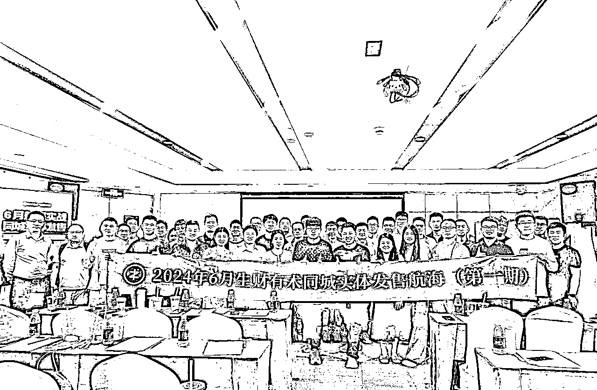
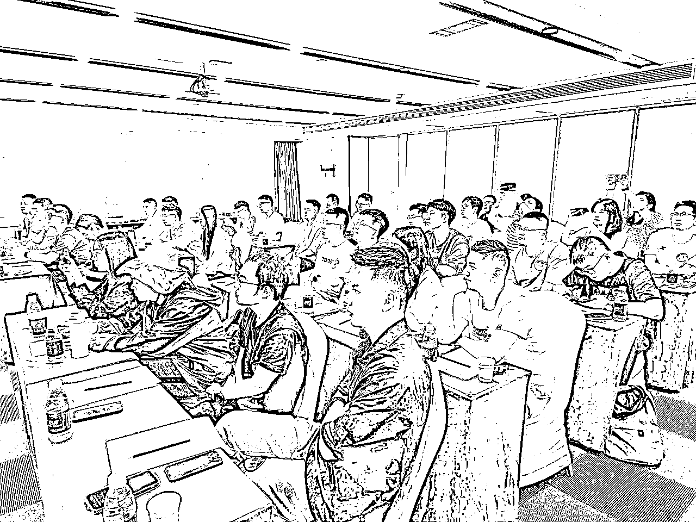
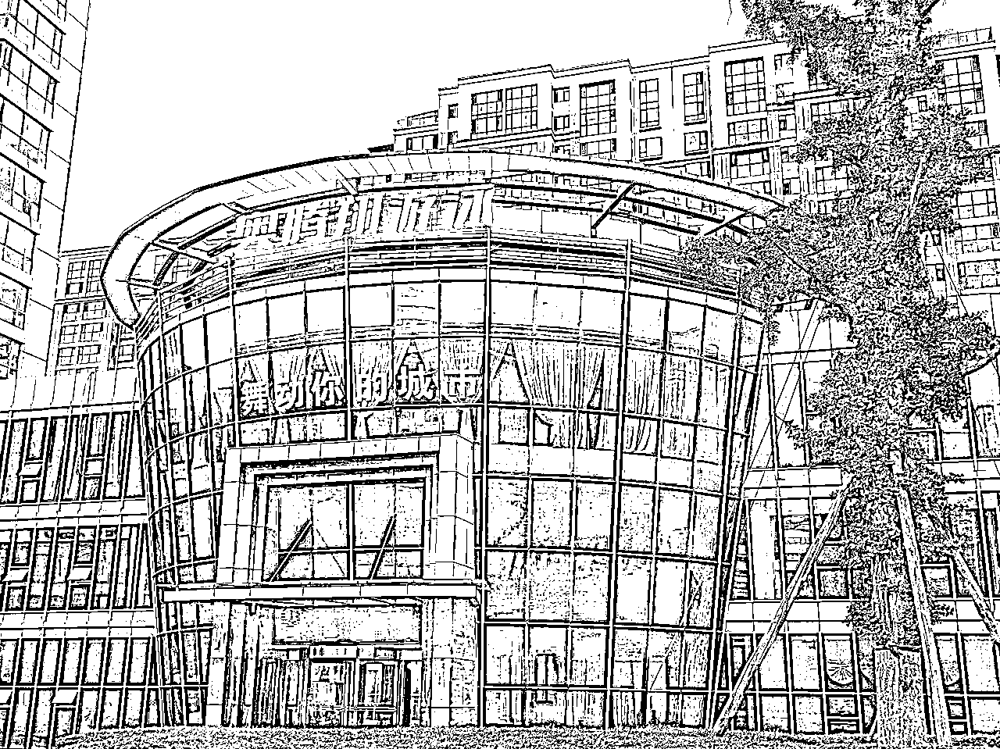
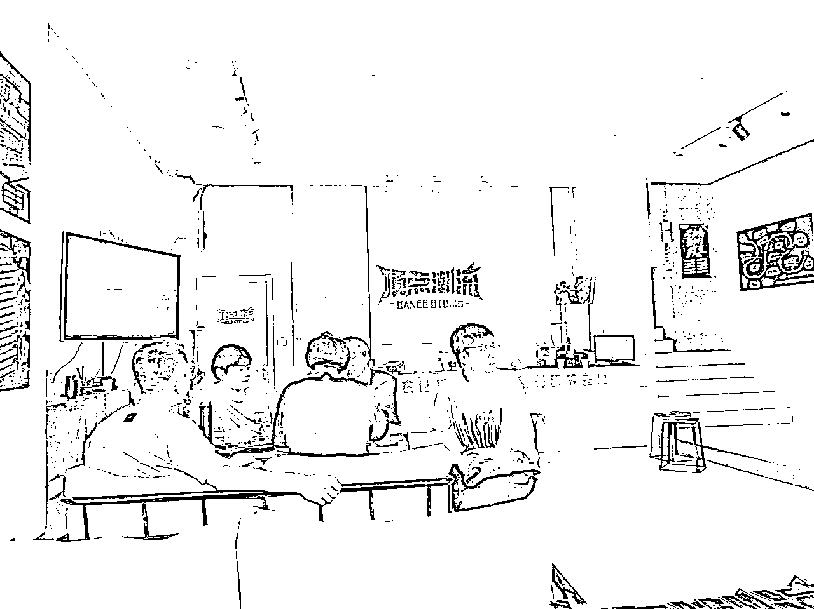
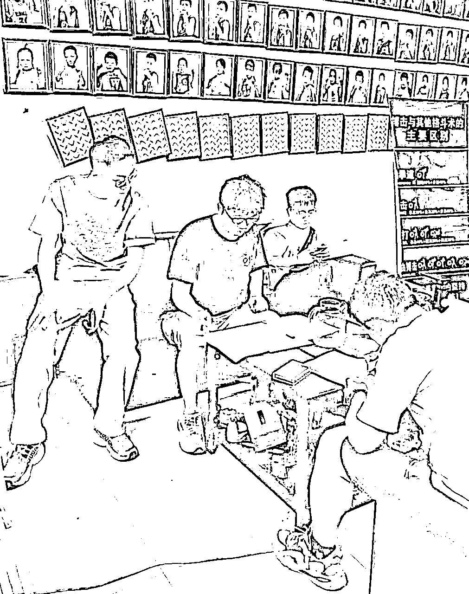
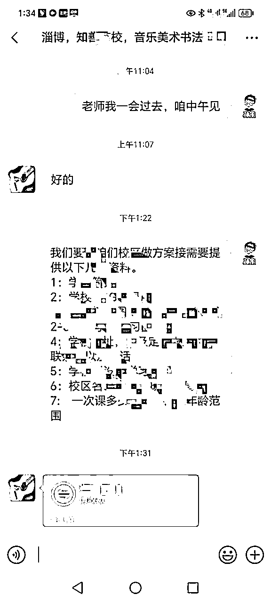
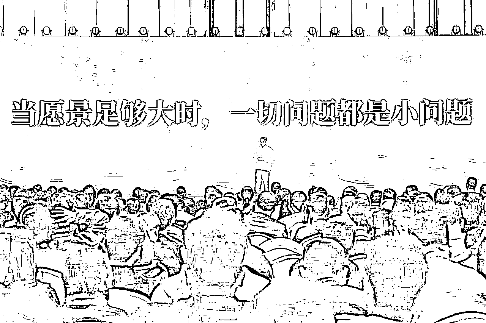
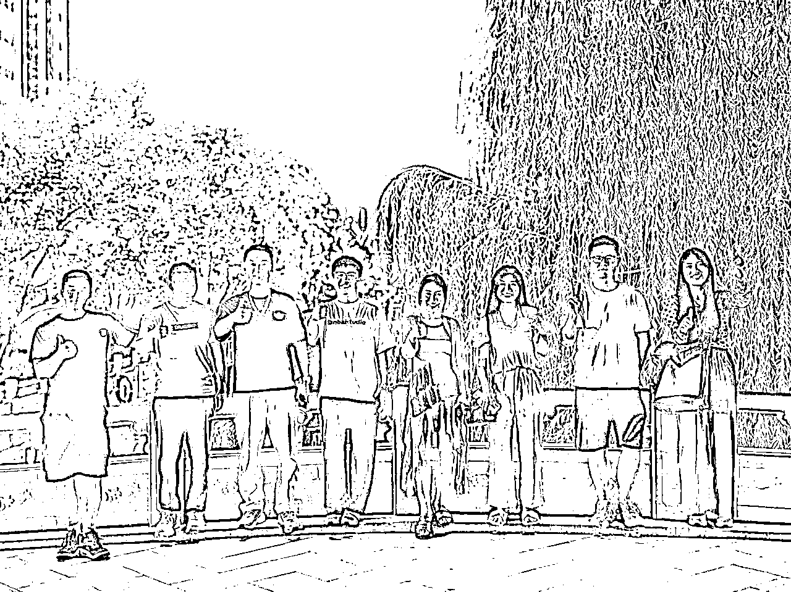
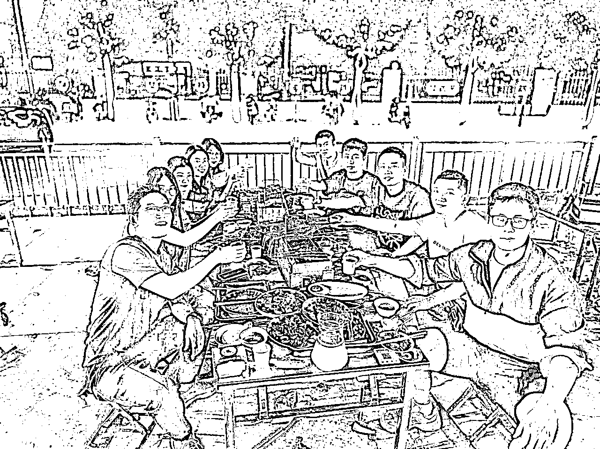
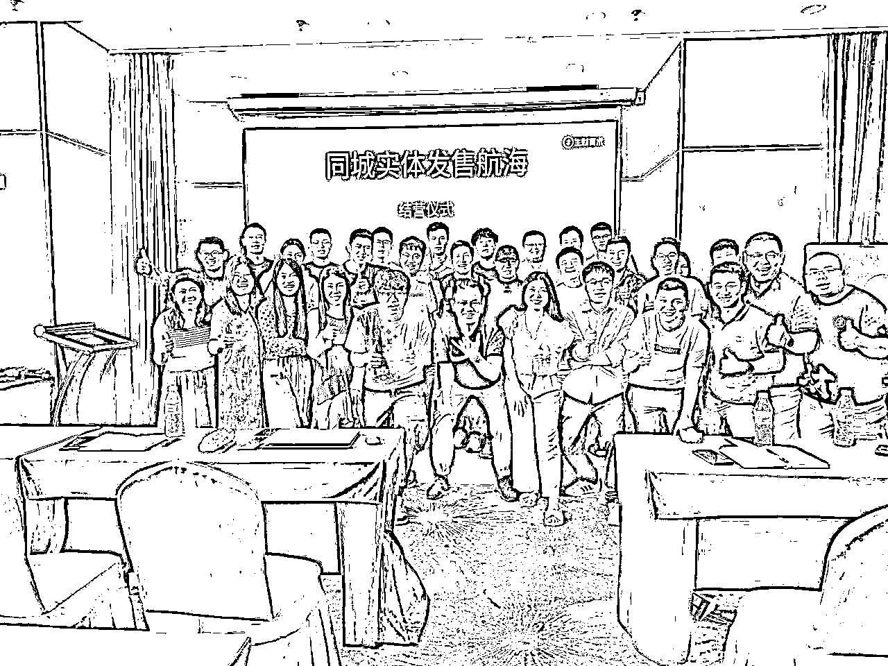

# 实战一个月，揭秘同城实体发售航海：昙花一现 or 机会所在？

> 来源：[https://qijso432vwy.feishu.cn/docx/Rg7PdvZOvoGOPpxmq0McGg2lnFc](https://qijso432vwy.feishu.cn/docx/Rg7PdvZOvoGOPpxmq0McGg2lnFc)

各位圈友大家好呀，我是李李～

8年家居行业从业者，设计师&中层管理，帮助企业从0-1搭建产品体系并落地门店，服务包括4家上市公司在内的近30家企业；

也是一名斯坦福人生设计教练；准瑜伽教练；专注实体服务和个人成长，目前裸辞开启人生副本中。

作为6月生财第一期线下航海——同城实体发售项目的亲历者，31人团的一份子。我在这次航海中3周签约15单，项目实收金额3w+。淡季数据不算亮眼但也是同期中业绩前排。

距离航海结束已一个月时间，高密度的日常还历历在目，中间也遇到一些朋友来询问项目相关问题。

正值第二期开营也是8月旺季来临之际，分享一下实战一个月的经历和收获，希望能给关注该项目的小伙伴些许解惑和答疑，也让下一期见面的小伙伴加深了解提前准备。

# 一、6月航海中，我们一线作战的真实体感

## 1、为何一眼相中同城实体项目？

航海宣发时，正值我离职一个月，打算GAP一年挖掘体验新赛道，也看是否有机会结合原有家居行业或设计版块。

然后就一眼相中了"同城实体发售"的线下航海；虽然当时不确定项目的具体内容，但仅凭航海名的六个字，就有十足的吸引力。

作为传统行业从业者，也一直在思索怎样更好的结合线上来帮助线下实体门店，更高效精准的获客并转化。

因此作为实体人的DNA狠狠动了。 我火速在生财搜索航海发起人——孙策孙总及其项目相关帖子，刷到了孙总的经历以及大致清楚了要做的事情，结合自身情况判断之后，确定要报名参加。

## 2、做了一个月这个项目究竟是在做什么？

线上初筛+电话面试过后，首批航海的31人团正式确定，我们天南海北的汇集到济南，9-10号参加了为期2天的培训，然后火速分城分队，1个助教带着7人左右的团队直接开始下场实战。

主打快准狠，实践出真知。

*   那动辄跨城一个月的大行动，这个项目究竟在做什么呢？

内容上来说项目主要分为3大步骤：商务签单+交付转化+售后服务

商务签单环节 ，也是我们这个月的主要工作内容，就是陌拜实体客户（当前以艺术、运动、文化课等教培行业为主，未来会拓展医美、大健康等新领域新行业）——线下寻找目标客户直接登门拜访，针对对方现状给出发售方案，并收取意向金达成初步合作意向。

方案制作好之后再二次上门确认细节及活动时间，随后对接交付同事开始活动执行。

交付转化主要由后端同事完成，通过线上公域流量推广，结合线下地推及私域裂变等多种手段同时作用，在短期内帮助实体商家获客并达成高客单转化。

售后则由我们前后端同事共同配合跟进。

战略上，通过集中团队区域化作战的方式，快速占领城市客户份额；然后力求多点辐射到面，最终覆盖全国市场并达到各城深耕的项目愿景。

*   相对而言，这是一个逻辑简单直接，上手较快，正反馈及时，身体上较为辛苦的项目。但正所谓大道至简，也意味着它拥有快速扩大全国铺开的项目潜力。

## 3、30天的心路历程以及我们做到了怎样的数据？

前面有提到，我们在2天的培训后即刻分城上岗直接实战，助教带了人均半天不到我们就自己下场开干了，达到了2天后团队就陆续开单，航海结束100%全员开单的成绩。

这也是该项目的一大特点——快速实战快速拿到正反馈。

我自己第五天才出第一单，算是团队中出单较慢的了。后期复盘了原因，技术是其次，主要的卡点反而是心理上，也是这个项目对我而言的最大挑战；

此前从未做过陌拜，甚至也没做过专门的销售工作，因此前面两天我总是问自己，这个项目适合我吗？我可以做好吗？适合长期来做吗？有核心壁垒吗？过多的怀疑，或者说放不下内心"孔乙己的长衫"，一直怵于第一步——迈出房门，接受自己要去做陌拜这件事。

同组的@李智 给了我很多的鼓励，而且看到大家陆续开单，我也会有一种大家做到了我也一定能做到，而且必须要做好的心态。

周遭的氛围可以帮助摒弃很多无谓的想法去专注于当下做好眼前事。

这里也想感谢一下同期的小伙伴，在我迟迟没有开单的时候，接收到了团队超多的善意和帮助。

@李智 一天结束后特意陪我拜访到晚上8点半，持续不断的给我鼓励；结束回去@李刚 帮我梳理了一遍完整的流程分享自己的话术；回到酒店@懒羊羊 又主动邀请后续和我同组想帮助我开单.

还有很多诸如此类的关照。

也因此在成功克服心理卡点之后，带着大家的帮助和鼓励我在第二天成功开单，而且一旦拿到正反馈，后续的持续开单就变得轻松且顺利了。

*   这也正是线下航海的一大魅力：把你丢进战场，身边战友的状态，领队的鼓舞，团队的帮助，都会带领你奋勇向前，很难再有逃兵心态。

*   而一旦克服心理卡点就能成功一半。

这可能也是以往一些小伙伴线上航海没有拿到结果的共通点之一——保有一定的怀疑而不是选择持续信任并勇往直前，以致于难以坚持。

涛哥常说一句话：因为看见所以相信。看见了身边人的数据和案例，选择相信并加入一个项目；

也因为相信所以看见。当你坚信之后，摒弃一切自我怀疑或不安的心理因素，全情投入做好当下，就一定能收获第一份结果。

*   如果说每个项目都有"道"和"术"的问题，那我觉得在这个项目中，道和术在团队的背景下是水到渠成的小事。

首先就"道"的角度而言，这个项目是孙总打磨了3年之久，且团队已经跑通的项目，而且还在持续不断的更新迭代。我们在一个月的下场实战中也能体会到商家的需求是切实存在的。我们当下最重要的就是听话照做，主动下场出击。

而"术"的问题，也是整期线下航海中能快速提升的一大板块。

的确，没有销售经验，也让我在前期好几次卡在临门一脚的逼单成交环节。

但不同于职场环境或线上各自单兵作战的模式。线下大家每日复盘，队友实时沟通，遇到问题提出问题即刻解决，当天或次日把解决方案带入实战中验证，这个成长和经验的累积是飞速的。稳扎稳打保持进步，开单甚至爆单就不是问题。

*   因此，这是一个门槛不高人人可做的项目。跟紧团队，每个阶段做自己当下能做到的就够了，前期用数量博概率，后期用技术博质量。就一定能拿到结果。

# 二、为何选择8月继续并肩作战？

## 1、项目符合长期可累积的特点

这个项目的模式比较简单，架构的搭建也足够清晰，因此能快速的铺开甚至达到全国化；而且同城业务本身就符合长期可持续可累积的项目特点，这一点也是吸引多数人加入的主要原因之一；

## 2、古话常说成事在人

正所谓跟对人做对事，跟随孙总一个月我能感受到他是一个真诚且踏实的人，目前自己也一直活跃在项目一线，而且在以往的项目中也带领团队拿到过大的结果。

因此我们这一期16个人选择了信任并继续跟随。

## 3、分润足够清晰且占比够高

做项目的目标之一也一定是赚钱，而这个项目的分润模式也足够清晰且公开，同样得益于项目发起人——孙总，在项目培训初期就有跟我们明确的表达过项目分润模式及比例，个人的业绩及利润的可控感较高，也因此会让团队更有冲劲。

## 4、团队氛围非常融洽

团队小伙伴是我这次航海最大的收获之一，得益于生财的氛围和线下航海的场景，二者缺一不可，让我们形成了亦师亦友、密不可分的"作战部队"，这是线上航海或者其他社群所无法体验到的并肩作战的情谊。

在此基础上，团队小伙伴持续合作共同向前，也会越来越熟悉和密切，有助于项目的开展和团队的扩大。

## 5、项目及个人发展空间较大

当前的教培行业在达到全国化后可实现跨行业跨领域的模式复制，或者单个城市深耕的方式。而且在项目发展到一定规模，积累到足够多的私域之后，也会有更多想象空间和不同的玩法，上限变得无限大。

这也让我们一直跟随或者早期加入的小伙伴有了更大的发展空间，从超级单兵到合作带队再到城市合伙人，发展路径是清晰可预见的。

## 6、个人能力短期内可有效提升

首先这个项目能让我们在短期内快速的接触小型实体商家，我最高一天拜访过30家，见到12家老板/负责人，交流半小时以上的达7家；这种方式有助于我们快速了解一个行业，感知门店运营好坏的共通点，提升自己的实体商业敏感度；

快熟迭代自己的销售能力，涛哥上次去分享我有问到一个问题：当前项目中我们需要培养什么样的核心竞争力以增加壁垒，涛哥回答说销售能力；这一点也是根源等多位老师反复提到过的，销售能力确实是当下市场中个人核心竞争力之一。

而在这个项目中不论有无销售经验，都一定能在一期航海结束时或多或少快速提升自己的销售能力、逻辑能力和表达力。

同时针对一直处于单一行业的人而言，能多维度的看到当下市场形态下，基数最大的小商家是如何通过线上线下结合运营来实现破圈或自救的。

## 7、深度体验一座城市

这是我个人的小私心，裸辞后的一年计划中希望每个月都能有新的体验和收获，也希望可以在不同的城市深度生活感受。而这个项目正好契合了我探索新赛道、创造新成长、以及深度体验新城市的需求。

# 三、借用很多小伙伴问到的一句话：你觉得这个项目适合什么样的人来参加?

这也是我在加入6月航海前期有考虑过的，结合一个月的实战，有了一些变化。

## 1、有一个月的充足时间

第一点也是我觉得最重要的，需要有一个月以上的充足时间且能出差，可以all in －这个项目，至少航海期间70%的精力要倾注在这上面～如果同时还有其他较为占据时间的事情在同步展开，可能难以平衡。

## 2、会骑电动车的人

这点写出来可能会让人疑惑，因为上一期我们的主要交通工具就是电动车，也是最便捷且高效的交通方式，边走边看且随停随走。所以来参加本次航海的小伙伴建议提前苦练电动车技术，直接决定了你的时效和安全性。当然防晒装备也请备好！

## 3、有BD或陌拜经验，或者有信心想要尝试的人

如果有BD或陌拜经验，在这一期航海中就更如鱼得水了，或者本身就是实体行业从业者，在这个航海中可以充分发挥自己所长专注签单并力求签高质量的订单。

当然如果没有这方面经验但是愿意尝试也有信心做好，那航海结束后就会和我一样收获一个销售新技能了，且日后不论从事哪个行业这个技能点一定大有作用。

## 4、如果你是亲和力极强的，或者生活中就是一个受人喜爱的大E人

虽然我是一个i人哈哈，但是如果你具备亲和力极强的特点，或者是人见人爱的大E人，能快速拉近关系，当然是有助于你快速拉进和客户的距离，帮助成交快速拿到正反馈。

## 5、正在寻找新项目的人

如果你原本就在寻找新的项目，且眼下没有其他选择，正巧这个项目有一点吸引力或者心动，可以勇敢尝试，一个月内低成本验证一个项目，超值！

## 6、想寻找团队他律敦促自己进步的人

如果你以往尝试过较多的线上航海项目，苦于单兵作战没有氛围难以坚持，正好这个项目也感兴趣，可以过来尝试和体验一下团队作战的热血感。

# 四、写在最后

结营的时候，涛哥作为惊喜嘉宾来分享时说过一句话——相信相信的力量！

当下能做的就是跟对人，选好道，尽力做好眼前事。结果定会随之而来。

希望今天的分享对大家有用，也期待8月9月旺季来临的时候，有机会和各位优秀的正在看帖的你，成为队友携手作战，共创佳绩！

