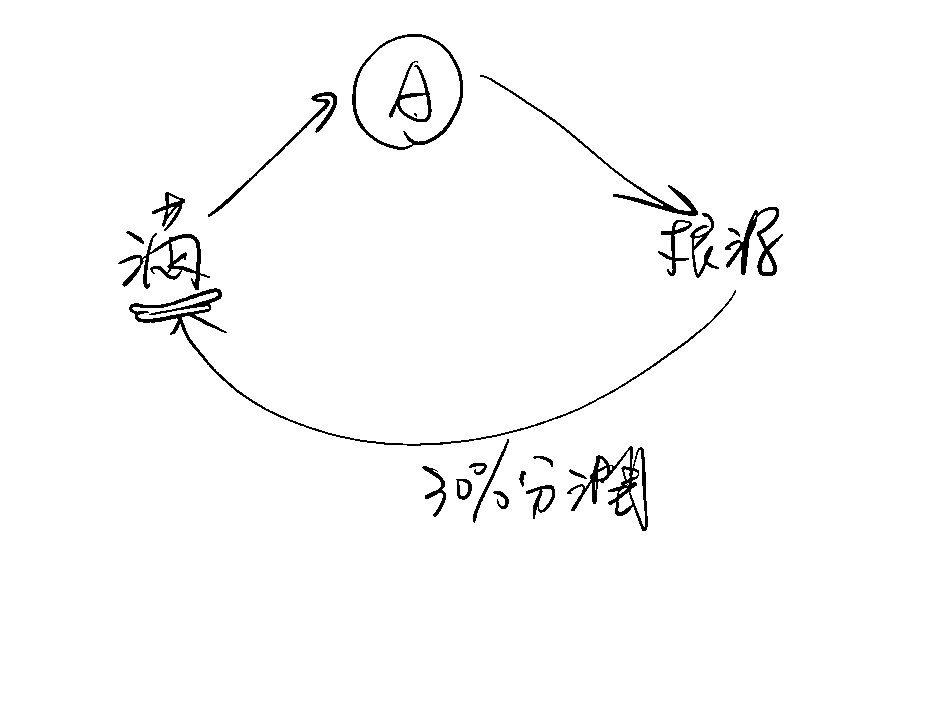

# 《把副业做到超过主业收入，你必须得知道的20件事！》

> 来源：[https://oee5lr7gsk.feishu.cn/docx/RCjldUoN7o1DlZxqwqNcnIe9ndd](https://oee5lr7gsk.feishu.cn/docx/RCjldUoN7o1DlZxqwqNcnIe9ndd)

全文共：6,732 字

预计阅读时间：7.12 分钟

圈友们好，我是根源

目前已经在知识付费、以及私域运营的赛道深耕两年半

这一年多，跟明白老师还有陈雪美女一起做俱乐部

成绩都还稳定，会员的净成长跟复购率，数据也都挺好

今天想谈一谈副业这个主题

我其实从12年参加工作，就一直做的自由职业，也就是做自由职业，我有超过12年的经验

我一直觉得副业能做好，都不是能力的问题，

而是我是否具备一些好的习惯跟特质，以及我对于副业有没有正确的认知。

当一个具备好的习惯跟认知的人，就有机会在副业这个方向上

做得更稳定，也更容易出成绩。

刚好这篇文章，我来谈一谈对于这个主题自己过去的一些经验和看法

希望这些经验或方法，能帮到正在看文章的圈友

很欢迎看完文章后

能一起讨论。

* * *

# 副业能不能做好跟能力无关

### 副业能不能做好

### 跟能力无关，取决于你的习惯好不好。

我发现大多数的人在做副业之前，或者是已经有了副业之后，

当发现副业成绩不如预期，都会先告诉自己：

一定是我的某个能力不足，

所以导致我副业没法做好。

我得想办法花点钱

再去学一些我暂时没有办法学会的能力，

当我的能力学的越多，

副业一定能做的更好。

但其实这是个误会，因为能不能够把一件事情做好，能力真的不是最大的因素。

一件事能不能做好，真正的关键在于他的习惯好不好。

这个习惯就类似

我会不会有一个今日事今日毕的习惯，

我会不会有一个面对问题不逃避，会去解决问题的习惯，

我会不会认真的去把昨天没做好的事情复盘的习惯

我会不会在复盘之后，发现这个错之前已经犯过了，所以，这一次我觉得要比昨天再更进步一点点的习惯。

……

这些都是做事情的习惯。

因为，能力这个东西最好学，我只要报个课，看一篇文章，刷一个视频，

每一天花个半小时，一个小时重新学习，能力必然可以补足。

但为什么很多技术非常好的人，他在公司其实整体的稳定度都很不错，

但进到副业之后，会发现我的收入怎么没有提升，我为什么总是做不好？

那是因为他没有习惯让自己在做副业的时候，把一些好习惯放进去，

所以能不能够把副业做好，关键在于我平时有没有养成好的做事习惯，而不是我到底拥有多少能力。

* * *

# 副业初期，千万不要把主业辞了

很多人做副业的出发点都是因为

做主业太无聊了，

我的老板总是打压我，

我的同事不喜欢我，

……

所以，我不要做主业了，然后毅然决然辞职去干一个新副业。

大多数初期做副业的人，如果有这样子的决定，他的副业大概率会很惨。

因为，想做副业的前提一定是

我希望人生可以因为多一个副业，多一条现金流，让我的人生能够更快的好转。

而不是因为我主业做不好，所以我选择副业。

结果，当他把主业辞了，本来发现原本有一笔很稳定的现金流，

结果现金流突然断了，他心里就开始变得非常的没有安全感。

这个没有安全感就会让他副业的开始会有面临着极大的压力，

不管是生存的压力，

还是金钱的压力，

又或者是不习惯的压力，

……

他的副业反而会做的不好。

所以，很多人原本觉得，我天天干着这个看起来没有希望的主业，我的人生是黑白的，

殊不知，一离开主业之后，全职干副业，他的人生就全黑了。

所以，初级做副业的人一定要谨记，不要那么快的把主业辞掉。

因为多一项副业是为了让我们的生活可以更快的达成目标，而不只是为了我只想逃离主业的痛苦。

* * *

# 不要习惯单打独斗，学会找好的环境跟好的老师

在做副业的开始，一定要记得不要一个人盲目的干，不找环境，同时也不找老师。

你最好找一个能够带领你的人，或者是跟你一起干的伙伴。

因为，做副业的最开始一定不会做的太好，除非你原本的工作能力就非常非常的卓越，

甚至你在主业已经有独立把一件项目做成的能力。

因为副业的开始没有办法做好，都是因为很多的弯路得走，但是弯路一定要走过这么多吗？

我觉得做副业的开始是不一定的，

如果有一个比较有经验的人带着你，他真的可以让你少走非常非常多的弯路。

所以，在做副业的初期，如果你真的决定要把副业做好，

### 一定要找一个大家一起做类似项目的环境，一个群，或者是找一个人带着你。

这样子可以有助于副业一开始就能更好的更快的得到一些反馈，

以及养成把副业如何能做得更好的好习惯。

* * *

# 为自己设定清晰的目标

我觉得做副业的人，和上班族有一个挺大的不同

就是上班我只要把老板给我的工作完成，做完我到时间就能拿钱

那副业或者自由职业者，会完全不同，就是要达到什么样子的收入，要如何做事，都得我自己来规划和执行

所以，当你决定要进入副业了，

我要给自己设定什么样子的年度目标，

以及设定什么样子的每日行程

这是非常重要的一件事

我这么讲吧

我刚开始到杭州的时候，我要找房子，我第一次把58同城打开，我差点懵了

踏马的，我要找房子，结果一打开，十几万个房源，怎么找呀

我不知道怎么找哎，杭州这么大，什么地方的都有

后来我就开始锁定了，找萧山

然后那时候我跟我的朋友一起来，跟我的组员一起来，

不只找萧山，我还得找四房以上

我当把全部的限制条件放上去以后，

我发现整个萧山，我能找的房子，只剩三间

有没有发现，我就能够很精准地知道，我要去什么地方看房

所以我就用一天时间去找房，

然后付好了押金，那一天晚上我们就住进去了

我就只用了一天的时间

那如果我可以很清晰地知道，

### 我当自由职业者的这半年，我到底想赚多少钱，

### 这时候你才能知道，我的副业必须要做一个什么样子的转换，

* * *

# 把目标“嚼碎”

大多数人做副业的一开始之所以会心里这么的烦躁，或者是不安。

都因为他把副业的目标设定的太高，就类似

我要先赚到第一笔1000块，

我要先成交十个人，

或者是我要把一堂课先快速的做好

……

这在一开始的时候，可能会因为目标过大，而造成的失望。

那什么叫把目标嚼碎？

就类似我今天早上六点到七点，我一定要准时起床，用一个小时认真的做作业。

我晚上八点到了，我一定要抛开所有的事情，尽量把副业做到十点，十点之后才可以休息跟睡觉。

这个其实就是一个非常非常小，我能够逼自己完成的小目标。

当我开始可以把目标嚼碎了来做，我每一天就会有种成就感，那成就感别人盯不了，我只能自己给。

又或者是我今天我一定要把1000字的文章打完，感觉这个事情非常的微不足道，

但初期如果这么设定，一个月过后，我每一天都完成自己设定的小目标，我就会开始变得有自信。

只要我有自信，做副业就可以顺利，因为一件事情能否顺利，

### 关键在于我能不能够长时间让我的心情保持在一个相对愉悦的状态。

把目标设定的越小并完成它，就可以让我持续的维持一个好的能量状态，我就会变得有自信。

这个时候就会更容易的在副业上能够更快速地做出成绩。

* * *

# 固定时间做固定的事

在一开始对于副业还不习惯的时候，有两种做副业的方式：

*   第一种方法是，今天什么时间空，我就什么时间做副业，

*   第二种方法是，我每一天给自己设定一个固定时段做副业。

可能早上的六点到七点，然后晚上的8点到11点，我每一天给自己设定固定的时间做副业。

第一种的副业稳定度一定会远远不如第二种，因为当我开始会随时的调整我每一天做副业的时间，

就代表我是一个没有习惯性掌控自己时间跟行程的人。

做副业的开始要做的并不是快速得到成绩，

而是让自己的身体有一个感知，时间到了，我就要做副业。

就很像是现在大多数的人，可能九点上班，他八点自然就起来了，

因为他的身体知道九点得准时到公司，不然会被扣钱。

所以在做副业的一开始，一定要让自己养成一个习惯

时间到了，我的身体就会告诉自己，我该做副业了。

这是一种用心理暗示让自己的心、身体更有准备的一种行为，

这个会让副业的效率，在一开始就可以有很显著的提升，同时这也是一种下定决心的点。

因为我要认真做副业，所以每天这个时间到了，我一定要想尽办法把我其他的事情先做完。

这时间我就可以空着认真的把副业干好。

所以，在做副业的初期，要让自己有一个非常稳定的固定时间去做副业，这是一件至关重要的事情。

但大多数的人都会觉得，

反正是个副业，

就是一个副的，

所以我想什么时候干就什么时候干。

这样子他的身体在初期就很难习惯，我竟然还得再去忙于另外一个副业。

所以，他就常常会处在一个没有做好准备的状态，副业要做好的时间就会拉长。

* * *

# 尽可能大量增加副业的时间

就是当你的副业，原本只是要平均赚到1万~3万的时候，

但是呢，你准备要全职做副业，你设定的目标却是你原本要赚到的钱的两倍，或者两倍以上

那就代表，你的能力得提升两倍，你每天的聊天的人的数量得超过原来的两倍以上

是的，我们用「量」去衡量最快

假设你这半年完全不成长，

你的成交率不变的情况下，你能做的只有增量。

只有增量，那你给自己做好增量的准备了吗？

增量就是增加时间

这是很直观的呀，就是在能力不变的情况，

我能做的就一件事情，把我的时间增加

增加大量的时间，去塞满我的副业需要完成的点。

因为只有这样子的目标设定，才能让你从主业这个范围离开的当下，你心里面不会觉得慌张。

这件事情太重要了，这是很多人，从主业换到自由职业者的时候，没有准备好的一个重点

这东西只要没有准备好，那就只有死路一条

* * *

# 给自己一个固定时间学习的习惯

一定要给自己一个固定时间学习的习惯，无论做副业有多累。

因为这是一个陌生领域，或者是一个陌生的环境，或者陌生的做事习惯，

每一天不管怎么样，一定要给自己一个小时的学习时间，针对副业的学习。

这个学习

可以是看群里面的的文字课件，

也可以是上某一个老师的直播，

也可以是你花时间去整理你过去的笔记，都好。

每一天最少要给自己一个小时的时间学习。

这样子在做副业的过程，你才不会因为自己的脑袋持续的没有进入新的东西，

导致眼界没法变大，习惯无法改变，重点是你没有一个比对的标准。

每一天学习有个好处，当学习的时候你都会自然的去反省，

老师说的这件事情，我今天忘了做，

老师说的某个习惯，我今天又忘记了，

老师上课说到的过去因为某一个小事而犯的错，我上次明明听过了，今天又犯了。

……

所以学习不单纯只是让自己到了某一个固定的学习场景，

同时你也可以通过比对，跟一个比我更优秀的人到底在做事的过程有什么样子的差距。

这个会让自己就不会因为工作的忙碌，副业的忙碌，

而又回到了本能的习惯，然后又依旧用本能在做事。

所以，这个事情就变得非常的重要，一定要给自己最少一个小时以上的固定学习时间。

* * *

# 培养自己复合式的技能

副业是一个复合式的技能，你只会专业，副业干不起来的。

做专业，你觉得你不会推广，那有用吗？

没用的，所以副业不能只有单向式地学，

所以我才说，老师要慎选，你不能选一个只会专业的老师。

这老师要知道怎么教你推广，教你曝光，怎么教你去介绍自己，这是老师需要做的事情，如果找一个老师都搞定这些了，那就找一个就好了，那如果发现这个老师解决不了，但他专业我喜欢，那你就找两个老师。

就假设做知乎好物

知乎好物要不要写文章？

要不要学会怎么看数据？

要不要学会产品？

那会不会有人来找你？知乎你的粉丝量多不多？关注量多不多？为什么这文章多人看？这文章少人看？

这个你觉得要练吗？

需要，你得对这个有敏锐度，对不对？那你觉得这件事情是专业赛道，还是推广赛道？

如果说你在学专业的过程，你专业学了 3 个月，会不会你同时又具备了推广能力？

会呀，所以副业这个东西本来就都要会，因为副业没有人给你工作，你的工作就是多样性的。

* * *

# 不要误把学习当副业

很多人会把做副业跟学习混为一谈，

大多数的人一开始可能会花个1000块、2000块去学一项技能，就告诉自己我要学副业，我要做副业。

结果，把精力都花在技能的学习上，学了之后到了真正去做副业的时候，就觉得副业果然难做。

学习和副业是两个完全不同的事情。

学习叫做『吸收东西』，可是副业叫做『我不止吸收，我还得输出』，

我得把学的东西去跟别人讲，我得真的去实战老师上课说的。

例如

每一天日更小红书，

每一天日更视频号，

每一天要去找五个人说，我准备转型做副业，你可以给我个机会听我介绍一下我的新产品吗？

但是很多的人他学完之后他也不会做，然后只按照自己原本的习惯，通过学习给自己一种安慰。

我今天上课了，我有进步了，

今天我又坚持第二天上课了，我又有进步了

……

这时候会发现我学到很多很多的东西，但是我却没有实质的成绩跟实质的一种获得。

所以，在一开始做副业，一定要厘清我到底是来学习的，还是来做副业的？

* * *

# 严格控制副业上的学习成本

副业其实严格来说它就是一项生意。

一个生意人在开店的时候，如果我可以多花一天去比较，

让我的物料可以便宜个一块两块，这是一件多么有产值的事情，

但是很多人都忽略这一点。

一开始都会觉得，反正就是个副业，不会我就花钱学，不懂我就花钱学，

但是会发现钱不断的流出去，可是却没有任何一笔进账，越花就越慌。

没做副业还有存款，做了副业不止没赚钱，连存款都花光了。

所以，在做副业的时候，一开始你要控制自己的学习成本，

就是我可能花了一笔钱给A老师，我发现A老师有三种不同的课：99元、399元跟3000元。

如果在需求没有特别明确的时候，我会建议一开始先从便宜的学，

学的过程可以同时筛选这个老师是不是我喜欢的，这个内容是不是我所需要的，我能不能直接实做？

刚开始有这样子的想法，就可以控制自己在副业上花钱的成本。

像我过去有个习惯，我一次最多花两笔钱，

这两笔钱只要没有赚回来，我就会逼自己不能再花第三笔钱。

像目前虽然我现在副业已经相对的成熟了。

但是我依旧会认真的控制成本，每一年有一笔钱是我必花的，就是生财有术。

但是第二笔钱我一定要找一个新的环境，或者是某个旧环境需要续费，

我一年最多只花两笔到三笔左右的钱，我不会再多花。

就算我知道这东西是我目前非常必要的，我依旧不会再花。

因为我的原则就是我一年只限定自己能花三笔付费的钱，

像今年到现在，我其实只付了一笔就是生财有术，另外的两笔我连付都还没有付。

所以，在初期控制自己的副业成本是至关重要的。

* * *

# 花钱之前先认真评估

其实在学习副业技能或者是找环境的时候，贵不代表一定好。

很多时候之所以会觉得一定要买贵的产品来学习副业，

是因为我们内心中总有一种做事情的习惯，就是对于便宜的东西不珍惜。

但是做副业的开始，成本的把控是一件最重要的行为，

很多时候，你买一个老师99元的课，跟买他699的课其实是一样的，

你获得的内容可能都一模一样。

只是699的课变成是打卡或者是训练营的方式，

但是其实99元给的内容就已经足够丰富，也足够你用了。

所以，在一开始想选择副业学习的时候，

花每一笔钱之前，都可以先花更多时间去找，能不能够用更小的代价获得同样的内容，或者是同样的技术。

当然，这个最小代价不是去找盗版，而是去找这个老师是否有其他比较便宜的课，

或者是他可能有公众号、小红书那些暂时还不用先花钱就可以获取到的知识，先找先评估。

先边看这个老师是否是你喜欢的风格，

当你真的已经确定了，我决定跟这个老师学，他真的是我这一辈子觉得最好的老师。

当这个想法出现，你的所有评估点都完成之后，再去花大钱做这样子的决定，

但是初期我都会建议有些钱能够少花，尽量少花，能够控制成本，尽量控制成本。

因为做副业从来都不是脑袋一热，就拍板决定的事情，

尤其在你还不太习惯这个行业领域有什么重点之前。

* * *

# 学会记录自己从零开始的经过

我想，当过上班族的人，对于某一件事一定不陌生，叫做『工作日报』。

日报就是每天回到家，我一定要把今天干了些什么，哪些做的好，哪些做不好，

在公司的某个软件上写下一段小日记。

这日记，一方面是记录那天有没有什么遗漏的，

另一方面就是让主管看哪些事你有干，哪些事你没干。

甚至这个都会是一个能不能够领到稳定全勤奖金的一个固定考核指标。

为什么做记录？我一直觉得记录很重要。

因为只有记录，

我才能知道我今天到底做了些什么，哪些好，哪些不好。

尤其在做副业的开始，只要有做记录，我们就能够重新的去反省。

我原本说今天说要做123，怎么到最后我啥都没做，我做了456，难怪没有成绩。

有可能我日后不会再看我的复盘，但是在写下记录的过程，我就能够慢慢的去反省，

今天副业之所以没有成绩，就是因为我根本没有按照目标做，或者是我根本没有按照老师给我的步骤来做。

在一开始，只要我用我的本能去做事情，只要不记录，

我就不会发现我竟然一直都在用本能做事情。

所以记录自己的副业经过太重要了。

如果没有这个，做副业的前一到两个月可能会完全出不了成绩。

就算你出得了成绩，做着做着会发现，我不是应该要越做越有效率吗？

可是我的成绩却会在一个地方一直不前进，一直不前进。

所以，做副业的过程，把每个阶段都记录下来至关重要。

记录的过程也不用多，一天其实能写个三五百字就够了，写完再睡觉，

这个可以在做副业的过程，极大增加赚钱效率的事情。

* * *

# 每天清晰地列出一天的待办

每天早上一定要有一个今天要干嘛的待办事项，

我觉得当好一个上班族不是一件难事。

因为上班的工作，一天早上只要到了公司，可能会开早会，小主管可能会发今日的日报，

我只要按照上面的步骤一个一个的做完，我就会对于今天要做的事情非常有方向。

但是很多人做副业的时候，不会把这个习惯沿用到做副业上面，

因为他不会认为原来公司每天做的这种那么烦躁的事情，竟然可以如此的有效果。

所以如果说已经有一个确定的副业要做。

每天早上，把一天的待办写下来

甚至是每天睡觉之前，一定要让自己写下明天哪些事情是我必须要完成的，一项一项的列出来。

一天只要你可以列五项，完成五项。

副业一定会有非常大的进步，但是只要没有列出每一天我今天副业要干什么的待办事项。

做副业的过程就会有一种我今天到底干了啥，

甚至还有一种无头苍蝇的感觉，我不知道我到底要完成些什么？我不知道我的进度哪里遗漏了？

所以做副业的过程，每一天的工作待办事项就会变得至关重要。

* * *

# 让自己有『静下来』的能力

这时代其实速度挺快的。

所有的信息，每一天咻咻咻有好多好多新资讯。

其实，过多的资讯不会让人觉得充实，只会让人觉得急躁，

甚至恐惧，甚至担忧我跟不上的话怎么办？

但是，当人生要多出另外一个时间做全新的事情的时候，

必须要有一种学会让自己静下来的能力。

有人可能会用冥想的方式，我让自己静坐十分钟，静坐20分钟，这个也行。

有人都静下来的方式可能是运动，我只要去跑步，跑个30分钟，回家冲个澡，

我就是感觉今天一整天我静下来了。

有人可能是玩手机，玩个半小时游戏，刷个半小时短视频。

又或者是因为我以前学过魔术，我只要把牌拿在手上，把玩个20分钟，我也会静下来。

就是当一个人静下来的时候，做事情会有更高的效率。

### 因为情绪越稳定，做事情的效率一定可以提高。

静下来的方法有很多种，只要找到一个自己习惯同时也喜欢的就好，

千万不要找那种自己不习惯的，就可能有人他根本就无法静下来，坐在那边冥想20分钟，

越冥想越觉得想睡觉，那就不要用这种别人说的方法。

可以去回忆过去哪些事情在做的时候会让自己觉得愉悦，

会让自己觉得做这个事情我可以处在一个心情相对平稳的状态，那就选这个事情。

做让自己静下来的事情，不分大小，不分快慢，只要可以让我的心情能够平稳就行了。

这也像是我们在看影片的时候，有一种转场，从A的场景到B的场景。

那在做影片剪辑的时候，都会有一个叫转场设置，可能是旋转的转场，可能是放慢的转场，可能是菱形收尾的转场。

反正很多不同的转场，这个转场就像是我做主业跟副业转场。

像我自己，我最喜欢的方法就是三种：

1.  一个是睡午觉，睡个15分钟，这15分钟尽量趴着睡，因为躺着睡可能就起不来了，

1.  又或者是我会玩牌，把扑克牌拿在手上，练习个五到十分钟的手法，我就能静下来了。

1.  又或者是玩手机游戏，把游戏当天该解的任务解一解，大概也就十分钟，15分钟，玩了之后，我就静下来了。

我会让自己静下来之后，再去做下一件事情，再去做我的副业。

* * *

# 关心身边朋友的习惯

95%以上的副业，其实都需要卖东西，

卖课、卖产品、卖自己、卖软件、卖很多有的没的……这些都是卖东西。

因为，副业大多数都得有销售行为，

但是如果谈销售，你就得知道我要卖给谁。

大多数的人做副业，之所以在进去副业之后会这么的困难，

就是因为他没有人可以卖，又得重新去认识一堆人，重新认识一堆新朋友。

然后，新朋友认识的过程，你又得跟他产生信任感，一开始就很难得到正反馈，

因为都是跟那些不熟悉的人，那他们怎么会跟你买呢。

所以，在刚开始做副业，一定要开始去给自己一点时间去经营关系，

这关系不管是旧关系也好，不管是新的群体的新朋友关系也好，

一定要有那些随时可以捞个二三十个人出来聊天的状况，这是个最基本的。

这样子你在做副业的初期，你才知道就是怎么启动。

当你的关系处理的越好，你的副业启动速度就会越快，

当你关系处理的越差，你平时完全不去跟新旧朋友聊天、寒暄这一类的，你的副业启动速度就一定会越慢。

* * *

# 从轻资产的副业开始起步

关于副业的方向，我一直建议，先从轻资产的副业开始。

你想什么时候开始其实都行，因为副业本来就没有时间限制。

尤其一个副业真正的关键在于

一个人能不能够妥善地运用自己的时间。

这是自由职业者最必要学的内容，就是我要如何妥善运用我的课余时间。

再一个点是，轻资产代表前期没有太大的投入，

这会降低你的试错成本，以及如果发现需要调整方向，也可以更灵活。

* * *

# CPS是最好的一种副业启动方式

CPS 其实是一个很好启动的项目。

如果你想做副业，做 CPS 叫分销，我卖别人东西，我有佣金。

我的销售课，我的课程其实是有 CPS 的。很多人卖不好的原因只有一个

应该这么讲，要能够把 CPS 做好的人，他必须得有一个很关键的点，

### 叫做别人服务，别人交付服务。

多数的人都没有做到服务。

我画一张图好了。

今天这个是我的一位学员。这个是根源，学员推荐了他一个朋友A，买我的课。OK？

这个过程是不是买完之后诶我就可以给学员一个 30% 的分润？

这个没问题吧，这个就是一个 CPS 的概念，对不对？

赚钱模式其实是非常非常好的。尤其涛哥也提过万物皆可CPS。

但是做不好的原因是因为，学员把这个课程推给A的时候，A跟我买单的那一刻，学员就不再服务他了。

学员会认为我拿到了30%分润，我已经拿到分润了。

既然拿到分润了，就给根源老师好好服务就好了。

如果学员跟我的关系不是很好，我在服务他的过程需要跟学员汇报吗？我不用跟他汇报的。

因为如果我认真服务好他，结果他跟我买的第二次的产品，他又持续地购买了。

这过程我需要跟学员报告吗？

不需要。因为学员这过程完全没有服务A，完全不服务的。

所以 CPS 很多人做不好的原因只有一个，当他把我推荐给A的时候，这一次他就认为我们的服务已经中断了。

反正A已经归老师了，对不对？多数是这样子的。

所以 CPS 最好的点就是

今天 CPS 我做好之后，我必须得好好地去服务我的客户。

也就是这时候，我会建议，假设你真的想做分销，想做别人课程的分销，

你最好卖这个是你听过的课，甚至这个课程你在里面。

这个非常非常的重要。

所以，如果你真单纯只是想赚钱，去做 CPS 就好。

但是这是一条比较短的路径，这是个短期赚钱的路径。

### 你如果真的要做长期，你一定得做服务。

因为 CPS 是一个最好在服务的过程，让你自己从卖别人的产品的过程，同时会出自己的产品。

* * *

# 敢收钱是启动副业的关键

很多人对于副业都会有一个误会，就是我必须得能力很好，我必须得有定位，有方向。其实不是的，完全不用的。

因为你要想一件事，我就这么讲，如果你单纯只是学了某一个课程，你在课程上抄笔记，你觉得这件事情是有产值的事情吗？在没有互联网的时候，这件事情就是我在家写开心，对不对？但如果在这个年代，你具备一个整理笔记的能力，你觉得这个能力能不能够帮你换到一点钱？

客户：

嗯哼。

我认为是可以的，因为年代不一样。现在很多笔记侠，他的工作就是负责写笔记，拿出去卖，负责写笔记，甚至跟人家分享，你们来看看我每一天学习写的笔记，我一天写半小时，我今天工作就是把我的笔记分享出去，我可以做一个围观群，我可以收 19\. 9。也就是：

我们要真的进入到副业的关键都不是你能够拿出什么东西，也不是你的能力有多好，而是你敢不敢开口跟别人收钱。

这全部是谈业务能力，副业的启动全部是业务能力，跟会不会做课没有关系的，真的。很多人都以为会做课才能启动副业，都骗人的，敢收钱才可以启动副业。

* * *

# 副业的本质，就是卖自己

很多人可能会觉得副业是在卖内容，比如专业知识、商品……，这一点我不否认

但我想跟进一步谈的是，副业其实卖的是自己。

也就是只要我跟对方有足够的信任，我才有机会把东西卖出去，以及把这件事做大。

就比如我好了

我得尝试介绍自己，哇这个太难了，我跟别人比，

我就是赤裸裸的自己，我没有公司背景，

我跟他介绍，我觉得我很棒，我觉得我怎么样，我觉得这个课很棒，

别人说你的依据是什么，你说不出依据的，

因为副业就是把自己卖出去。

我得透过各种各样的方式，跟对方建立信任。

这也是我觉得副业以及建立个人IP的关键。

* * *

# 尾声的过去历史介绍

我是根源，同时也是第四期的生财圈友

一个有 2w+ 实战案例的心理咨询师

12年线下销售、团队管理经验。

2022 年开始转型线上，做一些知识付费的项目。

过去曾发表过几篇文章

都能看到这，代表你对文章的喜爱

肯定有一定的程度！

也欢迎阅读过去我写过的历史文章。

2021年的文章（精华x1）

1.  精华《直觉式萨克斯 透过社群成功变现146万》 https://t.zsxq.com/116B1bcYc

1.  《73项被动收入打造》 https://t.zsxq.com/11EHjTH0P

1.  《杭州夜话02场，夜话官复盘》 https://t.zsxq.com/19IkX4UMl

1.  《年入百万，团队从20人到4万人》 https://t.zsxq.com/19JYt77hL

1.  《主题：如何更有效的链接见面会认识的圈友》 https://t.zsxq.com/19VY2LWg4

2022年的文章

1.  《互联网小白，第 1 次做线上产品，7 天赚回 10 倍门票》 https://t.zsxq.com/11ooZZbM7

1.  《把捣乱分子『逆势』转成爱用者的好方式》 https://t.zsxq.com/19lipLhJ5

1.  《 好的内容，是目前依旧没退旧流行的变现方式 》 https://t.zsxq.com/19BLMAYw1

1.  《明白老师的一个启发，让我从100天日耕的过程赚了30W+》 https://t.zsxq.com/19BgNoxfi

2023年的文章（精华x6）

1.  《私域的意义不是管理，而是经营》 https://t.zsxq.com/19WEsfSq1

1.  精华《9年传统行业 1 年时间，从一无所有，到年入 200 万》 https://t.zsxq.com/10nmEr1cA

1.  精华《25个提高微信成交率的小技巧》 https://t.zsxq.com/11AgRW24F

1.  精华《35 个让私域收入翻 3 倍的技巧》 https://t.zsxq.com/11FmV2aqZ

1.  精华《续篇 - 25个提高微信成交率的小技巧（26 - 50）》 https://t.zsxq.com/13yRbmUwo

1.  《 私域话题：涨价之后，如何回复以及留住客户？》 https://t.zsxq.com/11UJk9HxQ

1.  精华《成为自由职业者的20个必备特质 》 https://t.zsxq.com/14XTxhh15

1.  《 36个让私域成交率翻倍的实战指南！ 》 https://t.zsxq.com/17zSrYzvk

1.  精华《产品线有引流体系，如何通过沟通促成升单？》 https://t.zsxq.com/17ocUJEFA

1.  《知识付费赛道，如何透过处理『反对问题』，增加用户粘性和复购率？》 https://t.zsxq.com/181fSc5rv

2024年的文章（精华x3）

1.  精华《第一次尝试「问答群形式」的公域往私域转化，7天变现11万》 https://t.zsxq.com/18gBXlWxE

1.  《 线上新手，我是如何用一套固定流程，累计成交 300 万高价产品？ 》 https://t.zsxq.com/18IWgDiXo

1.  精华《 私域话题-如何在客户咨询过程中，透过三个步骤提高2倍成交率？ 》 https://t.zsxq.com/196Ad34aR

1.  《私域的十倍增长话题：不同信任程度的客户，如何提升成交率？》 https://t.zsxq.com/YKHGT

1.  精华《 为什么都是做副业，我能第一年就达到七位数？ 》 https://t.zsxq.com/APodD

1.  《 写作赛道，如何使用「算账思维」精准地评估产出？》 https://t.zsxq.com/ymcEE

1.  《 私域+知识付费话题：如何通过增加合理的触达次数，提升2倍以上成交率？》 https://t.zsxq.com/elSxU

1.  《9年传统行业转型第2年，如何维持百万利润》 https://t.zsxq.com/61VlK