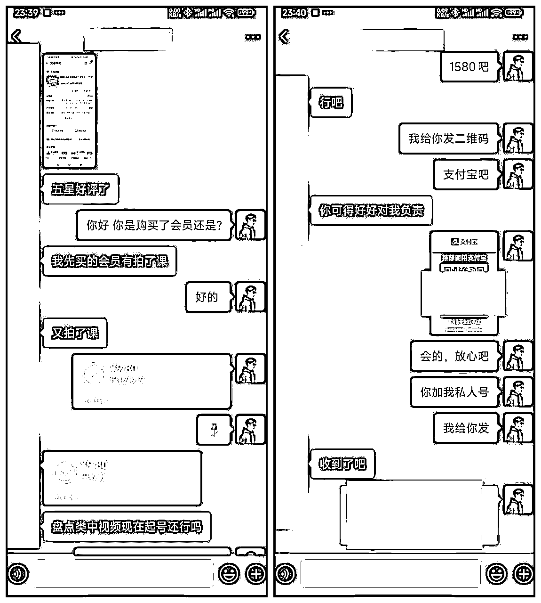
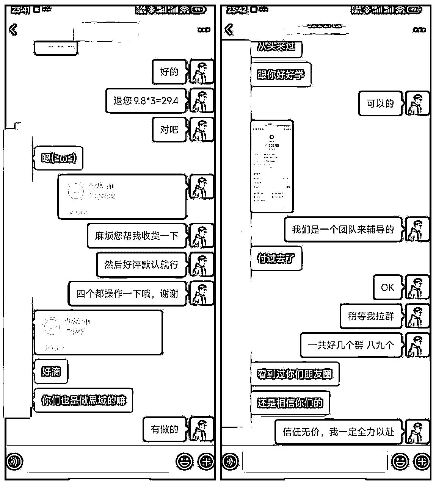

# 放弃年营收千万的互联网公司，我通过淘宝引流做知识付费，实现前后端双丰收！

> 来源：[https://i1b2b7wb64k.feishu.cn/docx/RMeAdNlG5oBUMMxhQ97cugQHnOf](https://i1b2b7wb64k.feishu.cn/docx/RMeAdNlG5oBUMMxhQ97cugQHnOf)

生财圈友们，大家好，我是大海，90 后。

我曾经是一名社恐程序员，后来成立了一家软件公司，连续三年营业额突破千万。经过四五年的创业，公司运营稳定后，2023 年底，开始尝试第二曲线，入局知识付费赛道。

7 个月，利用淘宝售卖虚拟资料和微信私域卖课，跑通 0-1，赚到了知识付费的第一个 50 万。

加入生财四个月，看到圈内许多大佬都在分享干货，我也跃跃欲试，不过我深知我在知识付费领域的成绩与圈内大佬相差甚远。经过一周的构思，又熬了几天夜，终于完成了自己在生财的第一篇帖子。

此前我就是一个比较传统的互联网人，今年才认识知识星球，了解到生财有术。

起初加入的期望并不高，但随着我大量阅读生财的精华帖，并参与了一次航海之后，发现生财真的是一个非常“真诚”的圈子，大家在圈子内的分享都毫无保留，干货满满。

因此，我也想将自己在创业道路上走的一些路，踩的一些坑，以及我是如何“误打误撞”开始做

知识付费，并且如何拿到一点小小的结果的经历分享给圈友们，希望能够帮助到大家！

因为我此前有过四五年的成功创业经历，所以我在做知识付费的过程中，并没有感觉到很难，反而觉得一路都很顺利！

先展示一下我 2024 年的收益成果

淘宝店铺纯虚拟资料收入，近五个月收益 22 万，利润大约在 15 万左右，加上 1-2 月份的，利润在 20 万左右

私域收入大约在 41 万，利润在 30 万以上，就按照 30 万算，在售卖虚拟资料过程中，网盘拉新奖励 3w

那么 2024 年度总利润就是 53 万。

# 一、我为何要转型做知识付费？

很多人看到前面我介绍我自己的软件公司年营业额超千万，肯定会质疑，为何我会选择一年只能赚几十万到一百万的生意作为公司的第二条业务线呢？这就不得不讲一下我的第一次创业经历！

## 1.第一次创业

我是程序员出身，因为所处的城市地处西北，工资并不像北上广深那样高，所以我也希望通过副业来增提高我的收入水平。好在平时我也并不是很忙，公司工作压力很小，因此，我利用休息时间和上班摸鱼时间做了很多外包私活项目，这段经历也给了我极大的创业信心。

2018 年，时机成熟后，我辞职开始我的创业之路。创业首选自然是软件开发，主要是在淘宝网接一些软件开发外包的订单，随着业务量增大，在 19 年注册了软件公司，并成功邀请到两位投资合伙人。

以下部分截图都是我曾经创业路上的真实朋友圈

经过 2018 到 2023 年的经历，看似我的创业已经很成功了，2020 年到 2023 年平均营业额都超过了 1000 万。

## 2.成功创业背后的问题

但是看似光鲜亮丽的成功背后，其实有着各种挫折和不堪，其中最让我头疼的就是交付问题！

接触过软件开发的人都知道，软件开发的过程极其复杂，需要至少六七个角色的参与，还需要各种监管，需要很强的管理，控制成本，才能保证利润。放个流程图大家就知道有多复杂了。

这是我公司目前的软件开发流程，中间需要很多岗位参与：产品经理、UI 设计师、后端工程师、前端工程师、项目经理、测试工程师、运维工程师！

而在 IT 行业，这里的每一个岗位的工资都很高，哪怕在我这个三线小城市，一个程序员的工资也得近 1W 每个月，而且还得 13 薪加奖金！

而以上流程，仅仅是交付流程，没有包含流量和销售团队的 CRM 流程。

看似每年营业额一千多万，但管理六七十人的团队，成本可想而知！每月员工工资需要 70 多万，一年下来 800 多万，加上其他管理费用，到头来利润仅有一二百万，很多还是应收款。

而且高强度的工作也让我身心俱疲。

可以说这与我想象中的轻资产创业完全不相同。

但是人生的路，每走一步都算数，凭借着这些年创业的经验和无畏的勇气，我和合伙人商量了以后，决定将公司的业务完全交给合伙人来打理！

而我，则要开始一段全新的，义无反顾的、破釜沉舟式的、真正的轻资产创业！

## 3.我的被“割”经历和成长感悟

在创业之前我肯定是实现进行了考察，我发现有很多在抖音上做知识付费的“老师”，教别人做图文带货，做直播带货的，先将用户从公域平台引流到私域，然后再进行转化。

我也主动付费参与过几个项目，当时我的想法很简单，就是学会这门技能，然后像这些“老师”们一样去给别人教学！

经过一段时间的学习摸索，我发现普通人确实难以通过这些项目赚钱，尤其是当前自媒体这么卷的情况下，这种概率会变得更小。

如下，展示两张“老师”跟我的沟通记录，让大家感受一下！

这是我跟一个“老师”学习无人直播项目，我问任何问题，他都会给我说一些假大空的话，到后来直接就不回复我了。

这个就更可恨了，我跟他学习淘宝虚拟店铺的运营，但是他不知道我其实自己也是个电商老鸟，从 2013 年接触淘宝一直到 2023 年，整整十年，而我的软件业务基本盘也是主要通过淘系引流！

我跟他学习虚拟店铺运营主要是为了快速复制他的教学模式，因为我知道自己整理一套 sop 还是挺慢的，花 1680 买一份靠谱的 sop 也不错！

结果可想而知，我再一次被“割”，与其说“割”，更不如说被骗。

这位“老师”让我上传了五十多个产品，价格都是几毛钱，然后第三天他派人过来将我店铺所有的链接都拍一遍，并告诉我我“出单”了。

普通人可能真的会以为自己出单了，但是我是懂淘宝的，我发现我的新店铺，第三天访客数量是 1，转化率达到了惊人的 100%，于是我发现自己被忽悠。找老师理论了两句，他就把我拉黑了！

这就是我孤身入局知识付费的第一课！

对我来说，钱并不多，但是的确有一些失望，因为他打击了我继续做知识付费的信心，让我觉得这行就是忽悠人的。

当然，作为一个成长型心态的人，每一次被割，我都能学到很多，总研究一些真正靠谱的项目，也总结了几条割韭菜的小套路：

1.  一对一指导，看似靠谱，其实是不敢拉群，怕你跟其他付费学员通气，起哄闹事。

1.  朋友圈狂晒无脑收益，宣称有手就行，日入四位数。

1.  过度承诺：承诺三天买车，七天买房，等等。

主要就是利用我们想要拿到一个结果/想赚副业这份钱的急迫心情。

虽然这几次经历都是失败的，但是这比起我第一次创业来说，真的不算什么！

不过我彻底放弃了在抖音上找师傅学习的想法，既然跟别人学习的路走不通，我就选择自己出发！

首先我仔细分析了在私域做知识付费的几个重要环节：引流-私域经营-销售转化-交付。

首先要搞定的是引流，那我肯定首选自己熟悉的领域，2020-2021 年我在淘宝平台做软件定制化业务，连续一年多都是这个领域的头部，我自然会选择淘宝为主要引流阵地！

# 二、选品上架和基础设置

## 1.注册

打开 https://ishop.taobao.com/ 点击 0 元开店

直接免费注册，然后输入自己的手机号注册即可，也可以用自己已有的淘宝账号作为卖家账号，注册后选择个人店铺，然后完善资料，一切信息都填写真实的信息即可。

按照流程完善信息即可。

初期不需要缴纳保证金，出单后再缴纳即可！

注册完成后，下载千牛电脑版和手机版，用注册好的账户进行登录，后期管理产品，接待用户，管理订单都需要用到千牛。

## 2.选品

很多人将想做副业、网赚、自媒体的粉丝定义为创业粉，但在我看来，还是有区别的，创业粉的概念应该要大一些，最起码应当是个小团队，而目前圈内所谓的创业粉概念，其实都是一些想做副业的，想做自媒体的，在网络上赚钱的个体，所以我将他们区分开来。

网赚粉：就是想利用互联网赚钱的人，如钟爱挂机项目，撸平台收益，玩游戏赚钱的项目的人

自媒体副业粉：想通过抖音，小红书等自媒体平台赚钱的人。

当然，仁者见仁智者见智，名称并不重要，重要的是理解人群画像，才能够找到适合他们的钩子产品和交付产品。

做电商的都知道，七分选品，三分运营。我们要选择的品类肯定是以能够吸引想做副业、网赚、自媒体为主。

首先我定位了两个方向：一个店铺主营网赚项目教程，一个店铺主营自媒体素材和教程。

我搜索了淘宝上关于网赚的教程，发现普遍价格都偏低。

其实看到价格偏低我就知道，大部分吸引的都是爱占便宜的白嫖党。

从用户付费能力的角度考虑，白嫖党的转化概率肯定是要低一些的。

而且，低客单的产品，评价区很容易沦为其他同行的截流阵地，如下图：

是不是又拓展了个引流思路？可以去淘宝买几分钱几毛钱的同行业教程，然后写一段带图评价，记得带上自己的微信号，哈哈。

言归正传，我经过一个多月的测试，发现这个店铺引流过来的用户质量不高，正如我上面所说，这类群人多数是白嫖党，且幻想不劳而获，挂机暴富！显然这不是我要的用户！

与此同时，我也在测试第二种选品方向，自媒体素材和教程方向，结果就要好很多！甚至出乎我的意料。

首先看一下竞品：

客单价高，月付款人数都在四位数，这就非常夸张了，我们在做引流的过程中，我们的钩子产品每个月都能帮我们赚几万块！再加上后端转化，简直王炸，想想就很刺激！

OK，我们的选品方向就已经确定了，以售卖自媒体素材和教程为主。

“中视频，图文带货、小说推文、直播背景素材、搞笑素材、风景素材”可选的方向非常多！

## 3.如何生产素材？

记住一个字“抄”！咱们普通人一定要学会抄，我们不具备生产素材的能力，我们直接抄别人的素材就可以。

要知道，在淘宝上售卖的这些素材几乎都是没有版权的，你将别人的热卖产品买过来，改一下名字就变成了自己的。

不要舍不得十几二十块钱（如果实在舍不得就到多多平台去购买，卖完申请仅退款即可），要买就买销量和评价最好的素材，然后对标做标题，做主图，做详情页！

## 4.标题制作

我们以此产品作为对标产品（注意不要选择天猫店的对标产品，天猫店的产品一般竞争力比较大），先来制作标题。淘宝是搜索电商平台，所以关键词非常重要。

首先，我们要了解这个产品的核心引流关键词。

那么我们需要借助的是官方的生意参谋，自 2024 年 4 月后，所有店铺都可以使用生意参谋，打开生意参谋按照如下图顺序添加竞品

选择监控列表，选中竞品，点击竞品分析

选择竞品分析页面的来源分析，可以看到竞品的核心成交关键词，记得一定要点击支付买家数，访客并不代表成交，支付买家数才能看到真实的情况。

接下来我们把这几个核心关键词复制下来，保存到表格里

我们在制作过程中，要将排名靠前的核心关键词优先写到标题的开头，其次是结尾，因为淘宝搜索的规则是优先搜索标题两边的关键词。

在这个过程中要注意避免重复叠加关键词，譬如我们不要反复的出现影视这个词，虽然他很重要，但也不要多次出现，除非标题剩余字数（最多 60 个字符）比较多。如果不足 60 个词，那就要想办法凑够 60 个词。

制作标题的原则其实比较多，但是我们是抄别人的，别人已经把标题优化好了，我们只需要改一下顺序，顺便根据他的关键词销量做下微调，所以方法比较简单，按照我如上所述的方法就可以。

## 5.主图和详情页的制作

PS 作图不适合普通人，我们采用的是稿定设计进行主图制作，百度搜“稿定设计”打开网站！（做图没有标准方法，顺手，适合自己就可以）

选择稿定设计，是因为这里有许多模板可供选择，选择电商，物料区域选择主图或者详情页，然后找到自己喜欢的样式，或者找到和竞品相似的图片。

虚拟产品的主图多数以汉字为主，清晰醒目为主，并没有特殊要求，一般的模板美观度也不差。下面我们选择一个模板，录制一段操作视频。

如果我们上的品比较多，详情页可以直接搬运竞品的详情页，稍微做一点处理即可。可以使用 360 浏览器批量获取套图的功能，如下：

## 6.上架产品

打开电脑端千牛控制台，选择商品-我的商品，点击发布新商品

类目选择：商务/设计服务-设计服务-设计素材/源文件 或者 商务/设计服务-设计服务-样图/效果图销售

这二者的区别是：前者不能够进行付费推广，后者可以进行付费推广（以前的直通车，现在合并为万象台无界）

下一步发布商品

输入制作好的标题，发货时效选择 24 小时内，我们是自动发货，基本上秒发！

一口价可以写到比你实际售卖的价格高 30%-50%，后面会讲到如何进行打折操作！

因为我们是虚拟物品，所以都是没有邮费的，初次添加商品时候，需要创建一个运费模板

创建好以后刷新即可显示，然后选择你创建的包邮运费模板

主图一共五张，首图非常重要，一定要描述清楚我们售卖的素材卖点！如果经常改价格，则主图上不要标记价格，否则要经常换主图。

其他主图视频，3:4 图片等根据自己的精力情况进行上传，影响并不大。将详情页上传完成，点击立即发布即可。

发布完成后，2 小时后，用全标题在手淘中检索，看能否搜到宝贝，如果搜不到宝贝，则可能是因为标题或者图片有问题，则需要重新定位问题原因，进行修改。

若无任何问题，则可以开始部署第二天的运营工作！

## 7.自动发货配置

自动发货我们采用的是阿奇索，在千牛工作台-服务-服务中心-搜索阿奇索

阿奇索是付费插件，一个月 15 块，一个季度 38，半年 68，每天可以发 500 单，对于我们普通店铺来说足够用，也比较便宜划算！

购买成功后，开始配置阿奇索

如上，点击宝贝设置-首次设置添加宝贝，将我们的网盘链接，或者网盘群号输入到使用说明中，用户购买后，阿奇索会自动发送小卡片到用户的淘宝聊天框，用户点击领取后可以查看具体获取到完整的使用说明内容。

值得注意的是：我们是可以在阿奇索中设置引流钩子，可以以加微信赠送素材，教程，或者一对一教学为钩子的内容。微信关键词可以换成徽 xin 或者其他用户能看的懂的内容。

## 8.网盘群以及网盘钩子的设置

售卖虚拟资料必须使用到的就是网盘，市面上常用的网盘主要以百度网盘和夸克网盘为主！若想通过拉新赚取佣金，则可以选择夸克网盘。

但是我们购买的同行素材大多都存放在百度网盘中，我们需要自己将百度网盘的资源转存到夸克网盘中，且同行每次更新的素材都需要及时存入夸克网盘中，过程比较繁琐。

正常情况下，可以采用网盘链接分享的方式发送给用户，但网盘链接的劣势就是当资源体积较大时，无法一次性转存，用户需要每次打开分享的链接进行素材的获取和下载，因此我采用的是网盘群的方式进行素材的发放。

网盘群还有另外一个好处，就是可以在群里发消息，能直接触达一部分用户！

打开网盘电脑版，选择消息，点击创建群组-立即创建

创建成功后，设置里将群名称改为与素材相关的名称，并设置全员禁言

然后选择聊天框中的网盘图标，选择我们售卖的资料，将资料发送到网盘群中

我们的素材资源中，可以放一张图片，设置钩子，一般都以免费赠送素材、教程或者交流群为钩子，正常用户看到交流群或者免费字样，往往会选择加好友！

因为我们售卖的资源客单价都是在 9.9-39.9 左右，用户还是比较重视素材质量和服务的，所以钩子不宜设置过多，否则给用户造成的体验不太好！

# 三、店铺运营

淘宝商品的运营中，曝光、点击、转化是三个核心要素，它们相互影响，共同决定了商品的销售表现。

## 1、曝光

曝光就是指商品被买家看到的次数，是商品销售的第一步。影响曝光的因素主要有：

1.  搜索排名：商品在搜索结果中的排名越高，被买家看到的几率就越大。这跟商品的销量、评价、点击率、转化率等多个因素相关。

1.  付费推广：如直通车等，通过付费可以提高商品在特定位置或人群的曝光率。

1.  店铺和商品权重：店铺的整体权重和商品本身的权重也会影响曝光。权重高的店铺和商品更容易获得淘宝平台的推荐和曝光。

1.  商品信息优化：包括商品标题、关键词、类目、价格等信息的优化，有助于提升商品在搜索和推荐中的曝光率。

在前面我们已经将标题、关键词、类目价格等确定了，那么我们主要做的就是销量、评价、点击率、转化率的人为干预！

### 1）基础销量和评价

做电商的都知道一句话：十个电商九个刷，还有一个往死刷！

没错，我们在新品上架以后，一定要通过补单的方式做一些基础销量和评价，这在各大电商平台是被默许的，前三天的基础销量和评价也很少会引起商品降权。

许多新手可能不知道去哪里找补单的资源，我分享一个比较简单的方，到抖音上找一些讲淘宝电商的视频下面，去看评论区，有很多人发主持找商家，这种就是做截流的，你直接在下面回复一下，自然有人会来私信联系你，到时候加他微信就可以。

补单资源的价格一般是一单 8-10 元，也有便宜的 5 块钱的，这个根据自己的实际情况来选择，但一定要选择能包评论的，可以先合作一两次试试水。

前三天我们采用非搜的方式进行补单操作，什么是非搜呢？就是非搜索渠道，包括淘口令，二维码，链接、或者搜索店铺名称进店找到宝贝下单等等。

我们将自己产品的淘口令、二维码、链接复制给放单的主持，每个宝贝每天操作三单。第四天以后可以陆续收货和好评！可以做一个如下图的表格。

一般情况下，我们要求做单的账号必须是 3 心实名以上，注册满半年以上。

做单过程中要模拟正常用户的操作，浏览 1 分钟主宝贝，副宝贝浏览 30 秒，但是过程中不能截图，这些淘宝都能监测到。

### 2）销量提升阶段

第四天开始，可以开始介入搜索渠道的补单，以搜索+非搜的方式进行。

我常规的操作如下：

第四天：全标题 2 单，非搜 2 单（淘口令，二维码，链接，或者搜店铺进店都可以）

第五天：全标题 2 单，非搜 3 单（淘口令，二维码，链接，或者搜店铺进店都可以）

第六天：半标题 2 单，全标题 1 单，非搜 1 单（淘口令，二维码，链接，或者搜店铺进店都可以）

值得注意的是，如果第六天半标题搜不到，那我们就继续进行全标题的搜索操作。

这里有个小技巧，就是利用炮灰词的方式来帮助关键词提升权重，这个方法了解的人比较少，但是百试百灵。

譬如我们标题里加入两个生僻字，例如“ 弢劼”，将原标题“电影视剪辑教程解说文案生成器抖音原创中视频素材电影解说教程”改为“电影视剪辑教程解说文案生成器弢劼原创中视频素材电影解说教程”。

那么我们做补单的时候，可以将半标题或者核心关键词与炮灰词组合到一起，如“影视剪辑教程弢劼”，因为当我们搜索核心关键词“影视剪辑教程”时，因为权重不够，导致我们搜索不到商品，但是加上炮灰词以后，全网只有我们这一个商品，很容易搜到。

这样进行多次补单操作，我们核心关键词的权重也会慢慢起来。

当通过核心关键词可以搜索到商品时，炮灰词的使命就完成了！

当补单进行到 7 天左右，我们要观察流量的数据情况，看一下商品是否入池，判断是否入池的指标就是看访客数是否大于补单数，一般我们选择竞争力不大的产品时，7 天都能够顺利入池。

入池后则可以少量的进行核心关键词补单，不可超过真实订单量的 1/3。

当订单比较稳定的时候，可以逐渐将补单的动作停止。

### 3）付费介入

3 天基础销量和评价做完以后，我们也可以通过介入付费推广来提升商品的权重，这种方式的好处就是不用担心降权，而且我们做的是虚拟产品，只要推广的费用小于等于销售额就是赚的。

之前的直通车现在已经全面变更为万象台无界，入口在千牛工作台，推广-关键词推广-点击新建关键词推广。

按照如下方式进行选择

然后，添加我们需要推广的宝贝，然后推广方案这里一定要选择“添加自选词”，然后下方推荐的词包和关键词都不要进行勾选，继续点击更多关键词

在推荐关键词里找到跟我们产品匹配的核心关键词，若没有匹配的核心关键词，则进行自定义搜搜联想。

一般来说，我们通过生意参谋通过竞品分析统计出的核心关键词都是可以出价的，选择匹配方案为精准匹配方式！这样，用户通过搜索我们添加的关键词就有一定的机会出现在首页推荐中。

创建计划完成后，我们也可以在计划中查看关键词的点击情况，转化情况，也可以进行关键词的添加和修改等操作。

在计划的高级设置中也可以设置我们的投放时间，一般可以将 0-8 点设置不投放，避免广告费浪费。当然每个产品属性不同，有些产品夜晚成交比较高，则可以重点选择夜晚进行投放！

关键词投放是通过点击来进行扣费的，前期我们要密切关注数据：

若曝光较多，但是点击较少，则需要进行点击优化，在本节的第 2 小节会讲到如何优化转化。

若只有点击，没有转化，则需要对产品和服务进行优化，在本节的第 3 小节会讲到如何优化转化。

## 2、点击

点击是指买家在看到商品后，点击进入商品详情页的行为。影响点击的因素主要有：

1.  主图吸引力：商品的主图是买家第一眼看到的信息，因此主图的清晰度、美观度、卖点突出程度等都会直接影响点击率。对于我们虚拟素材产品来讲，核心卖点关键词一定要足够明显，排版整齐，重点突出就可以！

1.  价格竞争力：价格是影响买家点击的重要因素之一。在同等条件下，价格更具竞争力的商品更容易吸引买家点击。所以，我们要看竞品的价格是多少，在销量，评价不如竞品的情况下，价格不能比竞品高，否则没有吸引力！

1.  销量：高销量更容易获得买家的信任，从而提高点击率。用户能够在搜索展现的列表页面看到商品的销量，如果销量较低的情况下，用户点击的概率的确会低一些。但是淘宝现在的展现形式与以往不同，对于新品，则展现的是用户的已支付数量，对于老产品则展示近一个月完成交易的数量，因而可以将对点击的影响降到最低。

## 3、转化

转化是指买家在浏览商品详情页后，最终下单购买的行为。影响转化的因素主要有：

1.  价格：合理的定价能够激发买家的购买欲望，提高转化率。价格过高或过低都可能影响转化效果。对于咱们虚拟素材，产品过低的话，用户会质疑产品的质量，而且引流来的也多数以贪便宜的，白嫖的粉丝居多。而价格过高则会让用户望而却步，所以还是要定一个比较合理的价格。

1.  详情页设计：清晰、美观、描述清楚的详情页设计能够提升买家的购买体验，提高转化率，我们可以将网盘的资源截图放在详情页，方便用户阅览到主要的分类。

1.  用户评价：用户评价非常重要，我们大部分人在购买商品之前都会看评价，所以我们在做基础评价的时候，一定要用心，图片和文字都要写的真实一点，建议不要使用 AI 来代替，因为 AI 写出来的东西一眼就能够判断出来，会让用户觉得很假。所以在评价方面，我们不能偷懒

1.  客服：有一些用户在购买时会咨询客服一些问题，我们要做到及时响应，准确的回答用户的问题，这样也能提升转化率！

以上就是我在操作店铺中的基本操作。

当然，我们在实际操作的过程中，还是要综合考虑各种因素，我认为的好的运营一定是具有以下几点品质的：

1.  市场和产品的理解力：对于咱们自媒体素材虚拟资源一定要有了解，了解自媒体的一些新玩法，了解同行的一些新动向。

1.  数据分析能力：要善于利用生意参谋、万象台无界这些工具，观察产品的流量，转化率等的起伏变化，同时呢还要经常注意竞品的数据变化。

1.  创新思维：不断寻求新的营销手段、促销方式、内容创作等，以吸引消费者注意，保持店铺活力。

1.  持续学习能力：持续学习是任何行业都应该具备的能力，现在淘宝平台也开始重视短视频，直播等板块，所以必须与时俱进，持续学习。

# 四、引流到微信

做知识付费，引流真的太重要了，没有引流，就没有后面的一系列流程。前面我们已经介绍了两种下钩子引流的方式，我们回顾一下，顺便介绍另外两种引流方式，尤其是第四种，是我要重点介绍的引流方式：

## 1.阿奇索引流

通过在阿奇索发货信息中，以赠送资料素材教程为名义，留下自己的微信号

## 2.网盘引流

通过在用户购买的网盘资料里留联系方式，以赠送资料，教程，或者交流群的方式进行引流。

## 3.店铺欢迎语引流

用户在进行咨询的过程中，首先看到的是我们的欢迎语，如下图：

我们可以在欢迎语中设置好钩子信息，吸引用户点击，从而将微信号发送给用户，进行引流。

设置方式如下：

点击千牛工作台左侧的客服-接待工具，然后欢迎语话术中可以填入想要让用户看到的消息，如我设置的是几个项目免费带，那么用户来咨询时候自然能看到这个欢迎语，哪怕他不购买商品，也有一定概率会添加我们的微信！

这样我们就将咨询中的访客也进行了引流！

## 4.通过店铺活动引流

这是我重点介绍的一种引流方式，并非此种引流方式能引流大量的人，而是因为这种方式能在引流的过程中培养和用户的信任关系，从而让成交变得非常简单！

我们的素材基本上都是没有任何成本的，但是用户一般只会购买一个素材，基本上不会产生任何复购，因此我设计了一套玩法，在店铺中加入了一个会员 VIP 的商品。

其他商品价格设定基本在 29.9 元，而会员仅需要 19.9 元，加入会员的好处是可以免费获取全店铺的素材！当然是有规则的。

用户首先需要购买我们的 VIP 产品（19.9）然后加到我们的微信，然后他可以将店铺里的喜欢的产品进行下单，下单后收货好评，我通过微信再将多余购买的产品以红包形式退还给用户。

这样做有 3 个好处：

1.  利用人们占便宜的心理，将用户引流到微信

1.  用户在充分享受 VIP 权益的同时，帮助我的店铺做了销量以及好评！这多么划算呀，正常我们找刷手还需要花钱，而且人群标签不精准，而这是精准的真实用户！

1.  经常和用户互动，还发红包给用户，一次几十块钱，可以大大增加用户对我们的信任，有利于其他私域产品的成交和转化。

事实上，我也的确通过这样的方式，将私域陪跑服务卖给了许多伙伴！

以上几例，都是先在店铺享受优惠活动，办理会员，我多次发红包给他们。逐渐产生信任后，他们付费找我学习。

还有一些伙伴，在购买店铺商品加到我微信后，我经常会找他们帮一些小忙，譬如帮我在店铺做个销量，写个好评，我会给他们发几块钱的红包，长此以往，信任就逐渐建立了。

总之，无论哪种引流方式，引流后，我们都要进行一些养粉操作，可以通过一些小活动，来养一养用户，让用户从你这里获得一些好处，慢慢建立信任，付费的基础一定是信任，总会有一部分人选择跟你付费学习！

# 五、私域产品和转化

## 1.私域卖什么产品？

说实话，引流这个动作，我从去年底开始做，一直到今年初，做了两个多月，但是我的私域却一单都没有成交！

不是因为我没有产品，而是因为我想找到一个合适的产品，找到一个能够长期坚持做，且真正能够为用户创造价值的产品！

在这个过程中，我也走了一些冤枉路，付费跟许多所谓的大佬学习过，要么项目周期太短，要么学习过程中的体验不好，交付太差！

不过最终我还是找到一个好的方向，那就是将我团队能力复制给别人，我想这总应该没错的！

于是，为了提供更多服务，我花时间学习了从抖音，小红书，公众号等平台的引流方法，通过团队实操拿到结果以后，将产品包装完成。

正式开始收学费，教我的学员做流量，做 IP，并且花钱对接了几个团队，从中挑选出几款可以供我的学员去分销的产品。

没想到一经发布，在朋友圈推了一段时间后，找我付费的人还挺多，而大部分都是通过淘宝过来的用户，这给了我极大的信心。

于是 2024 年我就坚持主做这一个产品，后来我慢慢接触到知识星球的一些大佬，才听到一个新名词叫做“合伙人”，我才明白，原来我误打误撞做的东西竟然跟别人类似。

## 2.私域的经营

早在 2019 年我做软件开发创业的过程中，我就了解了私域的概念，也一直在通过私域进行“软营销”，分享一些我在努力奋斗写代码，帮助用户解决问题的日常，也促成了我创业阶段的许多订单。

2020 年公司成立以后，我给销售部门培训过程中，也重点强调私域的重要性，但当时我们用户增量太大，通过个微短期内完全无法承接，因此我们采用了企业微信来承接，当时拥有大概 8 万私域用户。

在这个过程中，我发现企业微信相较于个人微信的优势就是能够加大量好友，但是用户的触达方面，个微明显要优于企微。

因此从这次创业开始，我一直选择的都是个微，在去年年底就注册了八个微信，我本人管理 3 个，员工管理 5 个。

然后逐渐开始微信养号和私域运营！

### 1）立人设：

最好的人设，我认为还是要坚持做自己！

千万不要走到一个误区，认为我们做知识付费，就要假装高冷，假装是一个大佬，那样把自己伪装成另外一个人，自己都不知道怎么和用户沟通！

譬如我，不是一个高冷的人，我就会热心的回答每一个朋友的咨询，哪怕他问的问题很小白，我也会认真的回复。

不做自己，会很累，也会很容易露出破绽，给用户的体验值也会下降，所以我的看法就是做自己，且要做真诚的自己！

### 2）怎么发朋友圈

对于如何发朋友圈这件事，我一直以来认为，不能够输出"强营销"的内容，我看到许多人在朋友圈秀一些不切实际的收益图，配一些比较低级的，如“上车、嘎嘎赚钱、月入几万”的配图时，我总觉得如果是我，我一定不会选择付给他们。

因为，从我的角度来看，这样的文案内容，只能够吸引一些互联网小白，且缺乏思想深度。作为一个有血有肉的人，我们的朋友圈一定是要真诚，且能够感染到用户的！

所以，我给自己的朋友圈定义的发圈标准是：宁缺毋滥！

当然，在朋友圈的经营上，我还是下了一些功夫，也有一套自己的见解。

#### 1.打卡+感悟类：

一般我会选择在早晨发打卡感悟类的朋友圈，因为我有坚持运动和听书（读纸质书的时间较少）的习惯，因此我每天运动完或者听完书，会配合自己的一些感悟发到朋友圈。

早晨大家大家时间都很紧张，在路上，或者吃早餐时候刷刷朋友圈，所以不要写长文！

#### 2.教学反馈

自媒体常流行一句话叫做“酒香也怕巷子深”！我觉得说的有道理，既然我们想要挣私域的钱，就一定要让用户了解我们的产品、服务、和成绩！所以，我们不要觉得不好意思在朋友圈秀出我们的肌肉。

在 2020 年我当时在朋友圈秀了一下我公司和中国石油大学的合同，紧接着就有好几个高校联系我们并达成了合作。所以，有时候一个朋友圈就能帮你促成好几单交易。

#### 3.好评+感谢反馈

在电商平台购物，我们一定会去看评论区的评价，如果有差评，那会大大影响我们购买的决策！

但是在朋友圈，这是一个我们自己做主的地方，我们当然要秀出关于我们业务的好评反馈（当然，一般情况下哪怕有差评我们也不会放在朋友圈里让大家看）。

好评可能是一句话，一个红包，我们在日常工作中，要善于发现营销素材，当用用户给我们好评的时候，及时截图，整理好，再编写一段话术，征求朋友的同意后，图片打码既可以发布朋友圈。

#### 4.日常生活+感悟

作为一个真实的“人”，我们的日常生活也是必须要晒出来的，但是在朋友圈的占比不要太大，一两天有一次即可！

当然这里还是应该要注意，日常生活必须是你的真实生活，千万不要在网上找个坐在迈巴赫里喝咖啡，夜店里搂美女的视频，现在的用户都不傻，一眼就能看出来真假！

同时，我们在分享日常生活的时候，也要让用户感觉到我们依然是重视用户的，所以可以将生活+工作结合在一起：如休闲不忘处理客户问题，出行在圈里通知下消息晚点回复等等

#### 5.反面教材+感悟

林子大了什么鸟都有，有时候我们会遇到一些奇葩，过来怼你两句，或者输出了一段难以理解的言论，这时候，许多朋友可能会觉得非常气愤、恼怒，从而影响心情。

但是，对我来说，这都是不可多得的朋友圈素材。

反面素材是可以引起用户对朋友圈的注意力的，当你发了一段“别人把你拉黑了，删除了，骂了你一顿”这样的朋友圈开头，大部分人会驻足看看到底发生了什么事。

用户是有自己的判断的，加上你自己对对话的感悟和理解，用户大概率会增加对你的认可！

#### 6.劝退+感悟，立真诚人设！

之所以会有劝退篇，是因为的确有许多人的钱我们没办法赚！

如：需要电脑的项目，但是用户没有电脑，而用手机办公效率会很低；负债的用户想通过一个小项目翻身，想法不切实际；用户梦想一夜暴富，只要你过度承诺，他就敢付费。

以上几种情况，我相信大部分人都是不会收的，当然我们也可以将这些劝退的对话作为素材，发到朋友圈，配合一些感悟文字，让用户感受到你是一个真诚的，善良的，不割韭菜的人！

以上是我常用的六种朋友圈内容方向，还是回归到“真诚”二字，我觉得万变不离其宗，只要你的朋友圈是在真诚的输出内容，不管你是高冷型的，还是热情型的，都自然能够吸引到一部分人。

## 3.转化

前文中提到的立人设，发好朋友圈，其实最终的目的都是为了转化，让用户购买我们的产品，为我们的知识付费。

当然，除此之外，我们在与用户的日常沟通中，也需要注意一些转化的细节。

### 1）不群发消息，不打扰用户

相信圈内的大部分人都是以兼职的形式在从事自媒体工作，那么我们的精力一定是有限的，我们的私域用户获取数量也是有限的，因此我们要更人真的对待每一位用户。

群发消息适合大团队。流量冗余的情况下，通过群发以量取胜。但是小个体如果群发消息，换来的要么是删除，要么是拉黑，转化的几率很低很低。

### 2）沟通过程中，不要急于求成

用户首次咨询时，不要急于转化用户，耐心的将产品介绍清楚即可，适当的情况下，可以让用户先仔细了解清楚再讨论付费问题。

有许多人，聊两句就逼单，问用户要不要学习，要不要付费，这样大概率会增加用户的抵触情绪，结果可想而知。

### 3）适当劝退，表达真诚

对于一些想要一夜暴富，躺赚的用户，更要给他们讲清楚，任何事情都需要付出努力，没有那么多躺赚的好项目，放弃异想天开的想法，如果没有下定决心之前，就不要轻易尝试做 IP，做知识付费。

但凡是能听得进去你这些话的用户，后面被割的概率会小很多，当他做好准备的时候，就是找你付费的时刻。

### 4.活动促销

搞活动一定要有名头，要么是到期涨价，要么就是优惠名额倒计时，总之就是要给用户一种紧迫的感觉。

活动之前一定要进行预热，让用户知晓你接下来活动的消息，这个过程可以维持一周左右，当到了活动时间，开始倒计时，这几天营销的频率可以增加，朋友圈可以发一些用户付款截图，并配上名额减少的文案。

关注你的用户就会感觉到越来越紧迫，通过这种方式，往往能促进成交！

值得注意的是，我们一定要搞真实有效的活动，既然公布了涨价的信息，到期就一定要涨价，否则到期却不涨价，过段时间又搞这种涨价的活动，吃相就很难看了！用户会觉得你非常不真诚，已成交用户或者潜在用户都会受影响。

关于搞活动的周期，这个和自身的产品有关，客单价越高，活动频次要越低，周期越长。

私域的转化非常依赖 IP 的影响力，你的朋友圈，公众号文章，短视频等都能够帮你树立良好的形象，只要用得好，则可以事半功倍。

以上，就是我对转化方面的一些见解。

当然，我认为我的转化能力肯定是有一定缺陷的，因为我在整个销售的过程中，有点佛系，所有的动作，只能够吸引同频的伙伴。

基本上成交的用户都是比较有认知的伙伴，他们懂得付出才有收获，明白成一份事业要选好方向然后长期深耕。不过在我看来，吸引同频伙伴能让你的工作顺心很多，这何尝不是一种“赚到”呢？

# 六、结语

经历了这几年的创业，中间遇到过许多挫折坎坷，但一路跌跌撞撞也成长了许多，提到对创业者有哪些建议，我相信我还能再写一万字，日后我有机会再到圈内进行分享。

不过，我认为创业路上的坚持和学习固然重要，但是最重要的还是要先出发上路！

一个糙粗的开始，就最是好的开始，想干一件事，你可以非常糙粗的去干，忘掉一些失得的去干。

互联有网两句话，叫做：不是大吃鱼小鱼，而是快吃鱼慢鱼

很事多情，等你清想楚了，黄花都菜凉了。

想越得多，越不去敢干。

不要想着要把事情做的多么完美，先去一混段时间，你就会发现己自进步神速，而且能力越也来越强，只你要敢迈那出一步，以后会就越来越熟练，也就有会成绩，有起色。

这就是由慢到快，由量变决定质的变过程。

干的烂总比干不要好，先完成完再美。

以上，就是我的全部分享！

我是大海，路还远，我们山顶见！