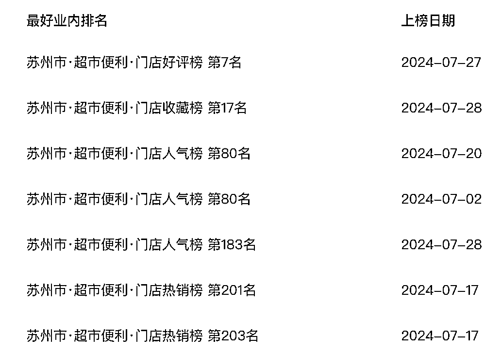
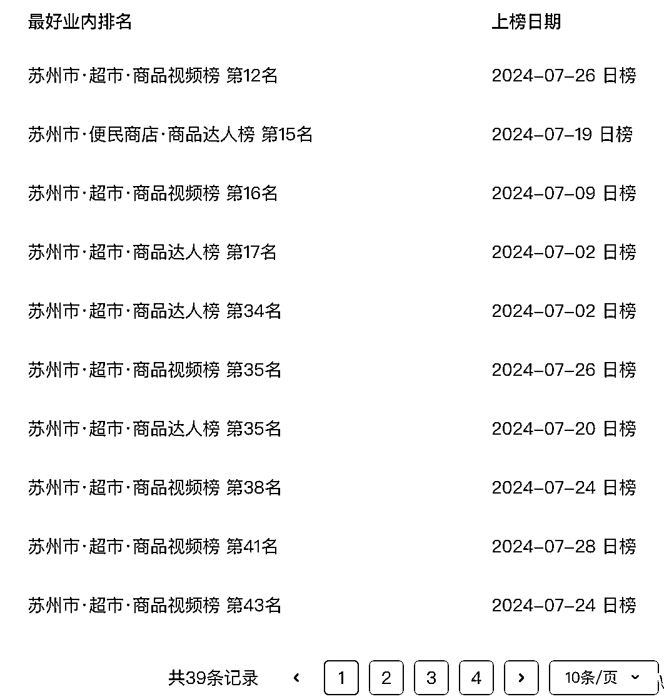
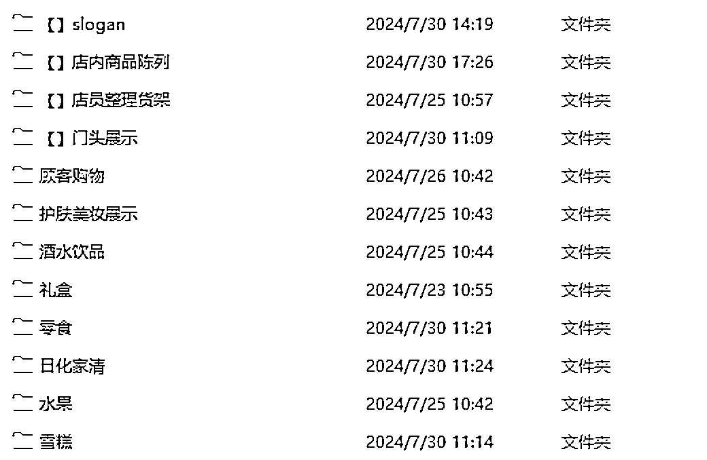
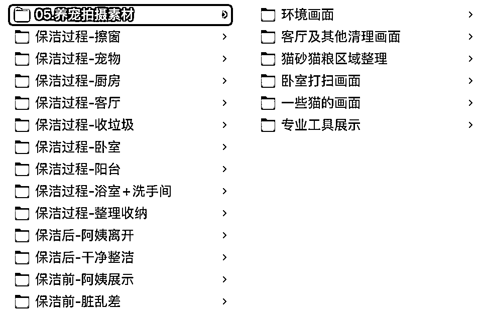
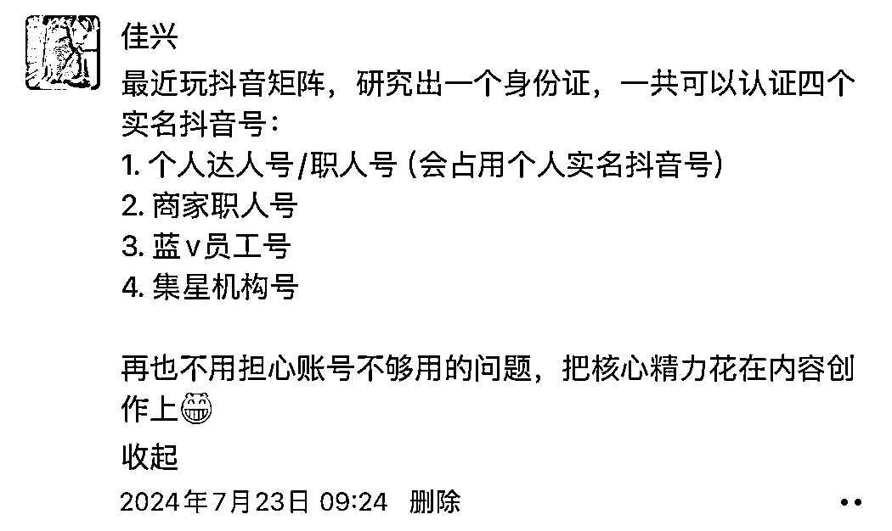
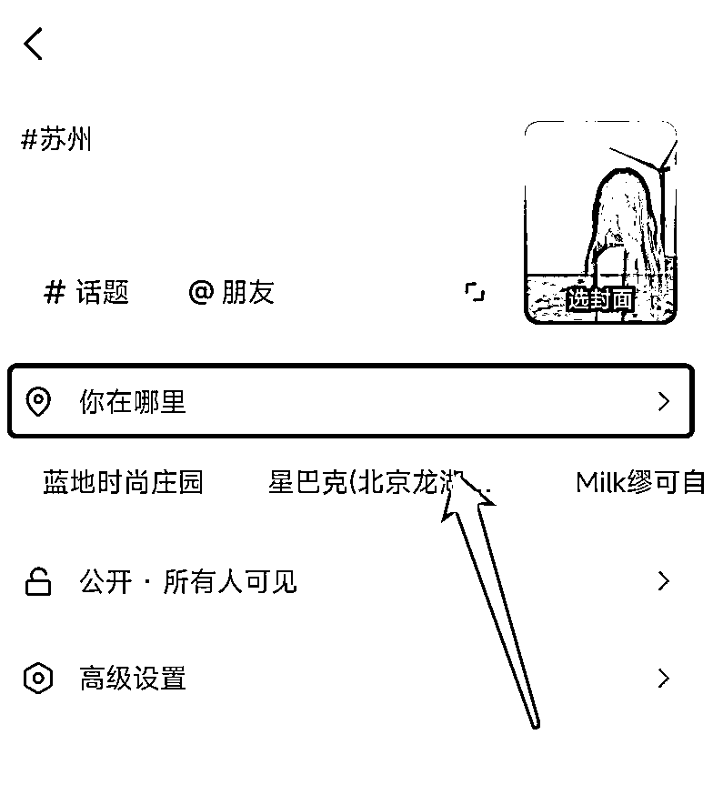

# 2024 年本地生活商家从业手册·终极版（生财专享）

> 来源：[https://pegsoswrxe.feishu.cn/docx/T9ZndxNRyoEdtGxG1BwcxN04nRr](https://pegsoswrxe.feishu.cn/docx/T9ZndxNRyoEdtGxG1BwcxN04nRr)

# 前言

单月发出 10 万条抖音短视频，霸屏目标城市用户，快速完成品宣种草 + 转化成交，月销售额 7100 万，这是我过去一年的操盘案例之一。

大家好，我是佳兴，本地生活流量增长操盘手，2023 年运营操盘了两个家政连锁品牌，分别通过抖音本地生活获得了十倍增长，也在之前的文章里给大家分别做过案例分享：

*   实战复盘，如何用两个月时间从零打造一个热卖 10 万单的抖品牌

自然流薅到手软，本地推通投拉满，是打造抖音本地生活头部标杆品牌的不二打法。

2024 年我又从 0-1 操盘了一个苏州便利店连锁的抖音起盘，目前月营销费用控制在 5000 元左右，主要用来找探店达人，内部团队有三个人（总成本不到 4 万），分别是：

*   我，负责搭建抖音来客、矩阵账号，规划组品策略、内容脚本创意、内容生产策略等各种基建工作；

*   一位视频剪辑，负责按照我的思路，把视频剪辑出来，目前日产 500-1000 条视频；

*   一位商品运营，负责按照我的思路，进行多门店商品套餐组建、上架及优化，目前工作不饱和，我正准备把她培养成官号主播，每天抽时间进行官号直播。

再说下成果，我从 5 月份初开始给公司组建团队，第一周绑定了 106 个职人矩阵号，第二周测试出了爆款脚本，一天 20 万自然流播放量，目前稳定在平均每天 3-5 万短视频播放量，120-150 个左右客户到店核销。

这里不说交易额，是因为超市单品的价格极低，比如一瓶百岁山我们抖音只卖 1 块钱，交易额肯定不高，重要的是客户到店的升单，以及体验过我们的产品和服务以后的高复购。

目前除了刚开业的一家加盟店还没上榜，其他 11 家自营门店都有上城市榜单。

商品套餐也是频繁上榜，唯一的遗憾是目前我们只能卖一些「零食、饮料、家清、日化」等标品，还没有上鲜食、熟食等热门流量品，也没能拿到「冰杯」这种特别适合 DIY 组品的优质供应链。不然我们营销端能做出的效果，至少还要再好上几倍。

我能从事抖音本地生活行业，得益于生财有术圈友的无私分享，去年入行，也是通过入职生财圈友的公司拿到了大的结果。

饮水思源，今天我就把自己的最新实操经验，分享给各位圈友，enjoy！

咱们文章主要围绕商家如何低成本内容获客展开，共分为 5 部分来讲：

1.  商家短视频的底层逻辑：如何在抖音高效发传单

1.  没有专业编导，如何高效创作「有效内容脚本」

1.  没学过摄影，如何拍出合格的视频剪辑素材

1.  剪辑人手不够，如何高效完成视频生产

1.  没钱找达人，如何低成本完成视频分发

# 一、商家短视频的底层逻辑：如何在抖音高效发传单

方向不对，努力白费，实体商家做抖音，最重要的不是生产高播放、高赞评的爆款内容，而是在抖音高效发传单。

注意这里不是说爆款内容不好，而是 99% 的商家根本没有做IP、做爆款内容的能力，一味追求爆款内容，很容易因为拿不到正反馈而半途而废。

商家做抖音的目的只有一个，就是通过短视频内容，让你的本地客户看到你，记住你，购买你，最终目的是吸引目标客户到店消费。

所以我们引出这篇文章的第一个重点：实体商家做抖音，就是换一种形式发传单。

发传单大家都不陌生，无非是把自己的门店、产品、服务、案例以及地址，经过设计，打印成一张张营销传单，然后把这些单子发到用户的手中。

传统的线下发传单有下面几个步骤：

1.  传单内容设计（我要展示哪些信息给用户）

1.  传单印刷（把设计好的内容生产出来）

1.  传单分发（找低成本发单员把传单发出去）

1.  用户接受传单

1.  用户阅读传单，并产生后续动作

1.  无情丢弃

1.  产生兴趣

1.  把传单保存下来

1.  电话咨询/到店消费

很简单对不对？

在抖音发传单，也是同样的道理，只不过是把传单换成了短视频：

1.  脚本设计

1.  视频生产

1.  素材拍摄

1.  成片剪辑

1.  账号分发

1.  用户刷到短视频

1.  用户观看短视频，并和视频产生互动

1.  无情滑走

1.  兴趣完播

1.  点赞

1.  评论

1.  收藏

1.  点击 POI 查看门店信息

1.  购买团购券

1.  到店消费

看起来有点难？没关系，接下来我将给大家一个个拆解，非专业选手如何进行高效短视频创作。

# 二、没有专业编导，如何高效创作「有效内容脚本」

想要视频跑的好，出单脚本少不了。

首先我们先统一下认知：什么叫「有效内容脚本」？

平台鼓励的优质内容：真实可信、声画优良、有用有趣。

我认为的有效内容：易制作、能过审、转化好。

如果有得选，一定要做平台认为的优质内容。

如果没得选，那就先做能帮我们赚钱的有效内容吧。

我不认为实体商家有稳定产出「平台认为的优质内容」的能力，否则就没必要做生意了，不如直接去做网红。

因此，我们做抖音短视频的第一步，就是要做出符合下面三个条件的脚本：

1.  视频结构简单，满足自动化剪辑的条件

1.  不违规，能过审

1.  转化好，能出单

那么，一切变得简单起来。

### 2.1 探店达人贡献内容模板

在抖音本地生活江湖里，有一帮活跃的内容贡献者，每天都在创作大量的带货短视频内容，那就是「团购达人」。我们创作内容脚本的第一种方式，就是找本地的达人过来探店，注意一定要找 5-7 级有短视频创作能力的实探达人，我一般都是直接找当地的短视频榜单达人，一条视频大概 300-1000 元不等。

联系达人的方式，就是用「抖音来客」app 的达人带货功能，可以进入达人广场“选妃”，如下。

我目前是每个月找 10-20 个榜单达人进行探店，要求是输出一条时长 30 秒以上的主片和一条 10 秒左右的副片，等他们都发布以后，关注视频的数据表现，再结合自己的一些筛选，往往就能产出 3-5 个相当不错的短视频脚本。

如果你说预算实在有限，连探店达人都不想找，那还有一种方式，即「找对标 + 二次创作」。

### 2.2 找同行对标

用你的行业关键词/品类关键词/品牌关键词，在抖音搜索对标视频

### 2.3 拆解视频脚本

从以下维度，拆解对标视频的内容脚本

如果你是新手，建议的对标视频脚本：

*   画面：场景、画面简单

*   音频：纯配音/bgm，无口播 or 对白

比如下面这样，数据表现好，制作简单，正是绝佳脚本：

找到合适的对标脚本以后，我们只需要把视频的文案和剪辑素材替换成自己的即可。

下面给大家展示一个简单的视频脚本案例，是我今年 4 月份给一个慕斯蛋糕品牌做的分镜头内容脚本。

# 三、没学过摄影，如何拍出合格的视频剪辑素材？

### 3.1 八字诀

要想视频转化好，素材质量要提高。

视频剪辑是指将多个视频片段进行剪切、组合和编辑，以创造出一个完整、流畅的视频作品的过程。

这些提前准备好，用于剪切、组合和编辑的视频片段，我们称之为「剪辑素材」。

视频成片的表现效果，和剪辑素材的质量息息相关，因此拍摄剪辑素材也是我们要做的功课之一。

这里我把自己常用的的「八字诀」教给大家，学会这八个字，足够你拍出 80 分以上的视频素材，这八个字就是：推拉摇移，远中近特。

其中，「推拉摇移」是我们拍摄过程中最常用的四种镜头运动方式，也叫「运镜」。「远中近特」是我们拍摄中镜头与拍摄主体的距离位置，也叫景别，下面我给大家展开说说。

### 3.2 运镜

*   推镜头

*   推镜头就像是你拿着一个放大镜，慢慢地靠近你要观察的物体，物体在你眼前变得越来越大、越来越清晰。

*   具体的操作方式就是通过调整摄像机镜头的焦距或者直接移动摄像机从远处到近处，使得画面中的某个部分逐渐放大，从而让观众的注意力集中在这个放大的部分上。

*   推镜头可以让观众感觉到场景的深度，也能够创造出一种期待感，就像是在说：“看这里，这个部分很重要！”

*   拉镜头

*   拉镜头和推镜头的视觉效果正好相反，想象一下，你手里拿着一个望远镜，开始时你把望远镜对准了一个很近的物体，然后你慢慢把望远镜拉远，物体在你的视线中就变得越来越小，同时你能看到更多的背景和周围的环境。

*   具体的操作方式就是通过调整摄像机镜头的焦距或者直接移动摄像机从近处到远处，使画面变得更加开阔。

*   摇镜头

*   摇镜头我们可以想象刘姥姥初进大观园，脚不动，脑袋却到处乱看，就是这种效果。

*   一般拍摄门店环境、景点环境可以使用摇镜头。

*   移镜头

*   想象一下，你在游乐园坐过山车，摄像机就固定在你前面，随着过山车一起移动，这样你就能拍摄到沿途的风景。或者，你在看一场赛车比赛，摄像机固定在赛车上，随着赛车一起飞驰，这就是移镜头的效果。

*   具体的操作方式就是摄像机沿着一个直线路径移动，同时拍摄画面。这种移动可以是水平的、垂直的，或者是对角线的，关键是摄像机保持在同一个平面上移动，而不是上下或左右转动。

### 3.3 景别

*   远景

*   远景镜头通常用来展示广阔的场景或环境，没有主体，或者主体在画面中显得相对较小。

*   中景

*   中景镜头通常从人物的腰部或膝盖以上拍摄，展示人物的上半身和部分周围环境，探店达人常用。

*   近景

*   近景镜头非常接近被拍摄对象，通常聚焦在人物的脸部或某个特定的物体上。

*   特写

*   特写镜头是比近景更近的镜头，通常聚焦在非常小的区域，如眼睛、嘴唇或手部动作，用来展示极其细微的表情变化或物体的纹理，增强观众对细节的关注。

### 3.4 常用素材拍摄手法及成片案例

1.  开场介绍：

*   运镜手法：使用固定镜头或轻微的摇镜头。

*   景别：使用中景，展示探店者和店铺的外部环境。

1.  外部环境展示：

*   运镜手法：使用远景和移镜头，展示店铺的全貌和周围环境。

*   景别：远景，展示店铺外观和周围环境。

1.  进入店铺：

*   运镜手法：使用推镜头，从外部到内部的过渡。

*   景别：中景，展示探店者进入店铺的动作。

1.  环境介绍：

*   运镜手法：使用移镜头或摇镜头，展示店内布局和装饰。

*   景别：中景到远景，展示店内空间和细节。

1.  特色展示：

*   运镜手法：使用近景和特写，聚焦特色元素或装饰。

*   景别：近景和特写，突出展示特色菜品或店内装饰。

1.  菜单介绍：

*   运镜手法：使用推镜头，从环境到菜单的过渡。

*   景别：特写，展示菜单上的文字和图片。

1.  制作过程展示：

*   运镜手法：使用跟镜头或推镜头，跟随厨师或服务员的动作。

*   景别：中景和近景，展示制作过程的动作和细节。

1.  品尝体验：

*   运镜手法：使用近景和特写，捕捉品尝食物的表情和反应。

*   景别：特写，展示食物的质感和品尝时的细节。

1.  成片演示：

# 四、剪辑人手不够，如何高效完成视频生产

这里直接给大家展示下我们团队的视频生产 SOP，我认为是目前效率最高的方式，大家可以直接抄作业

### 4.1 剪辑思路

批量混剪的底层思维逻辑是，根据视频模板，对切片素材进行不同的排列组合，这里我给大家画了两张图，方便理解。

#### 精细混剪

#### 简单混剪

### 4.2 素材整理

每个月集中一到两天拍出 1000 条以上剪辑素材，分门别类保存好，保持定期更新；

### 4.3 自动化剪辑

剪映做好模板，用剪映自动化工具自动剪辑，平均每天产出 300 条短视频，以下内容为模板的几个要点；

*   BGM（一般为纯音乐）

*   配音（AI 配音 or 人声）

*   字幕

*   视频标题（前三秒显示那种，类似歌曲 MV 里的歌名）

*   去重贴纸/滤镜/画中画等（欺骗平台算法，降低内容重复度）

### 4.4 职人矩阵分发

使用公司的 100 个矩阵号分发，平均一个号每天三条。

我们公司只有一个应届生剪辑，短视频这块就我俩人在做，轻松完成任务。每天 300 条是门店的流量承接上限，而不是我们的产出上限，我们目前只在单城市有 12 家店，覆盖面积就那么大，所以不需要发太多短视频。

根据估算，我俩的产出上限是现在的十倍以上，至少每天 3000 条短视频问题不大，目前还没有发挥最大价值，哈哈。

关于批量自动剪辑，我研究了市面上各种常见的批量剪辑工具（也有叫 AI 混剪工具，其实跟 AI 没有任何关系，不过都是剪辑素材的不同拼接和排列组合），最后发现这个工具根本就没那么重要。

批量剪辑不在工具，而在于剪辑思路，最开始我们没有用工具，我直接按照奇杰老师航海课程里讲的思路培训剪辑师，他手剪也能做到一天 150 条。

# 五、没钱找达人，如何低成本完成视频分发？

### 5.1 分发账号越多越好

视频产出以后，下一步就是要找到账号去发，很多商家最头疼的不是剪辑视频，而是多账号分发。过去一年我在账号分发这块业务里，花出去几百万预算，最多时每个月要给 5000+ 达人做任务分发，也算有一定实操经验，这里给也大家分享下。

首先，根据账号归属人的社会角色，我们所使用的账号分发渠道有以下几类：

*   探店达人

*   迄今为止，依然是最直接有效的分发渠道，只是有摸彩票属性，需要支付高额前置车马费，ROI 无法保证。

*   新店开业、连锁加盟必备

*   <如何找探店达人>

*   云剪达人

*   诸多全国连锁品牌的起盘流量密码，多为三线以下地区宝妈兼职，流量红利期性价比极高。

*   后来由于平台抵制「高重复度」的搬运视频，清理低质云剪账号，死号无数，效果大不如前，赚剪辑费不出单的账号比比皆是。

*   不建议小商家找云剪达人，但对于全国连锁的大品牌，云剪达人依然性价比极高，需要好好维护。

*   核心是要通过数据后台，找到真正的云剪出单达人，并用出单奖励维护住，避免达人流失。

*   门店员工、亲朋好友

*   抖音官方一直在帮商家「去中间商」，职人功能就是最好的体现。

*   只要是一个实体店就至少有一个员工，一个员工至少可以生成 2 个职人号

*   由于官方对职人的检查不严格，因此个体户可以启用亲朋好友的账号来做职人号

*   门店客户

*   这个就比较简单，客户到店，发视频就能领个礼品，很多人愿意参与下

*   同城兼职

*   大学生、宝妈等等

*   这个就不展开说了，大家自行搜索「招兼职」

*   无实名认证的本地抖音号

*   我们衡量一条视频是否有效的核心要素是，能不能挂载正确的POI

*   无实名认证的本地抖音号，也是可以挂当地位置的

*   这个特别适合单城市矩阵，一般人我不告诉他

### 5.2 门店 POI、发布话题

1.  视频挂载门店 POI，抖音就会基于地图定位，优先推荐门店附近的人刷到这条视频

1.  即使抖音账号不是达人，也可以挂 POI，也就是「位置」

1.  如果是连锁店，一定要开启「智能内容推荐」

1.  指定发布文案和话题标签，有助于精准推荐和搜索曝光

# 六、结语

我从去年跟着生财圈友的家政项目鲸致生活入行本地生活，到后来操盘天鹅到家团购短视频做到抖音家政第一，再到创业做本地生活服务商三个月草草收场，又受邀回归职场负责一个连锁品牌的整体线上营销。

这一年，我经历了抖音本地生活从红利爆发到同行内卷，平台规则变换，再到市场回归冷静的流量周期。

这一年，我获得了有生以来最刺激的人生体验，曾经求职生财被拒的小垃圾，竟然被亦仁鼓励创业和投资，还被邀请上生财航海家大会做分享（社恐上台寸草不生，感谢涛哥和工作人员的帮助才没翻车）。正当我以为自己从此走上人生巅峰的时候，突发后院起火，大意失荆州。

兴奋的时候，以为自己就是天选之子，业务高手我最牛逼，做啥成啥。

失意的时候又一度抑郁，觉得自己无比傻逼，不愿社交，不愿讲话，躺平几个月不愿进行任何工作之外的内容输出。

“那时她还太年轻，不知道所有命运馈赠的礼物，早已在暗中标好了价格。”

最近状态松弛下来，想通了很多事，不再过度关注「果」，而是思考如何多种「因」。

回顾起这一年多本地生活的从业经验，各种夸张的 GMV 看得麻木，但唯独看不到「利润」在哪。这也是很多「流量型」从业者的苦闷之处，远远望去，本地生活热火朝天，觉得很赚钱，一头扎进来，却发现有流水没利润。

还拿家政举例子，对流量从业者来讲，家政是个极好的生意，无需开店，一头对接阿姨、一头对接消费者，我们只需要做好流量和劳动者供给的匹配即可。

但实际算下帐来，抖音一单 3 小时日常保洁的价格目前是 139 元，咱们取个整算 140：

*   其中阿姨的成本是固定 30-40 元/小时，3 个小时的阿姨成本就是 90-120 元；

*   抖音作为平台方，需要抽成 5% 是 7 元；

*   这行的达人佣金一般是 8%，那么达人还要抽成 11.2 元；

*   税务成本 3-5 元；

*   每一单还要花 1-2 元买保险；

*   即使买了保险，阿姨在顾客家里发生一些突发情况，造成客户巨大损失，作为商家也无法规避责任，前段时间天鹅到家月嫂发生顾客家婴儿死亡事件，这种如果是小品牌估计直接就被干倒闭了。

那么请问，利润在哪？甲方都没利润，服务商代运营就更难赚到钱，这是一场零和博弈。

做抖音需要的内容编导、剪辑师、达人运营、直播运营、主播、本地推投流成本等等，这些成本谁来出？

做到最后你会发现，妥妥在给社会做福利：

*   平台绩效有了

*   社会就业有了

*   员工工资有了

*   阿姨赚到钱了

*   达人赚到钱了

唯独操盘手赚不到钱，笑哭。

最早从事本地生活，是觉得「实体商家」是好捏的“软柿子”。我们做互联网的人见多识广，认知高、骚操作多，进可招商、卖券、云连锁，退可卖课、培训、代运营。

现在从事本地生活，是觉得这个行业做起来踏实。虽然相比较纯互联网行业，实体服务又脏又累，但能通过好的服务把生意一天天做起来，把客户口碑一点点积累起来，最终形成「品牌」，这是一件非常幸福的事情。

放下傲慢与偏见，带着爱与尊重，重新认识本地生活。

实体生意投资成本高，回本周期长，赔钱概率大，非常不受赚习惯快钱的互联网人待见。

但纯互联网行业有第一没第二，内卷严重，垄断者通吃，我自认不是天才，做不了第一，因此我选择更普惠的本地生活。

人间烟火气，最抚凡人心。

致敬每一位认真开店做交付的「商家」，和每一个认真打磨技术的「手艺人」！