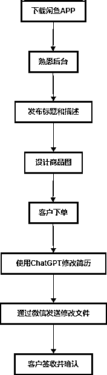
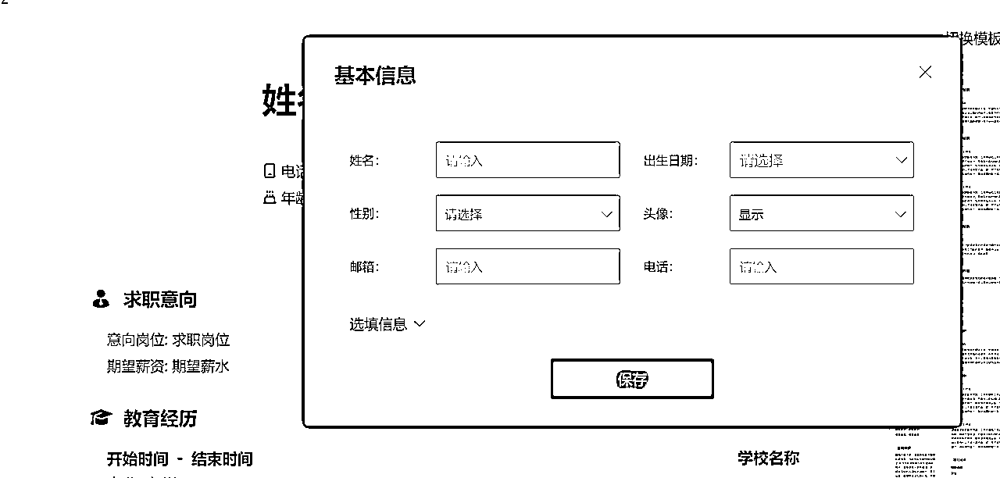

# 实操分享 可复制 2024 半年纯利润破25w 这个项目功不可没------ai＋简历优化私域交付

> 来源：[https://lv9qj6hfr4z.feishu.cn/docx/UST1dq6hkojyBXx1wIIcIXmfnvg](https://lv9qj6hfr4z.feishu.cn/docx/UST1dq6hkojyBXx1wIIcIXmfnvg)

我是荷包蛋糕 2年圈友 四年独自做项目的经历 00后 坐标 天津 如今已经从一个平平无奇的小镇做题家成长到现在靠项目实现月入六位数 半年纯利润破25w 今天分享一个我基本盘中的一个分支业务 的概念和实操流程 希望能帮助大家 ai的提效和加入 可以帮助我们获得更多的视野 提供更多的赚钱思路与可能性。

# gpt 简历 制作并且优化项目教程(7.29加餐）

简历是一份求职者的个人陈述，详细展示了他们的教育背景、工作经历、技能特长以及个人成就。简历的目的是在短时间内向招聘者展示求职者的核心竞争力和职业潜力，从而获得面试机会。在当今竞争激烈的就业市场中，一份精心制作的简历尤为重要。它不仅是求职者与招聘者之间的第一道桥梁，更是求职者自我推销的有力工具。优秀的简历能够突出求职者的独特优势，吸引招聘者的注意，增加进入下一轮招聘流程的机会。因此，简历的质量直接关系到求职者的职业前景和发展潜力，重要性不言而喻。赚钱的核心在于解决痛点，而在求职市场上，痛点就是如何让自己的简历脱颖而出。当前求职市场竞争日益激烈，加上招聘过程的自动化和AI技术的迅速普及，越来越多的人在找工作时需要简历优化服务。

简历代做项目，顾名思义，就是为客户提供简历制作和优化服务，从中赚取劳动报酬。赚钱的核心在于解决痛点，而在求职市场上，痛点就是如何让自己的简历脱颖而出。当前求职市场竞争日益激烈，加上招聘过程的自动化和AI技术的迅速普及，越来越多的人在找工作时需要简历优化服务。简历优化师通过深入了解求职者的背景、技能和职业目标，提供个性化的简历设计和优化建议。他们不仅精通简历的结构和格式，还擅长使用专业的语言和关键词，使简历在招聘者和自动化筛选系统中脱颖而出。

简历优化师的服务包括但不限于：

1.  内容优化：根据求职者的经历和目标，重新组织和润色简历内容，突出核心竞争力和成就。

1.  格式设计：使用专业的简历模板和设计，确保简历视觉上清晰、美观且符合行业标准。

1.  关键词优化：在简历中加入适当的关键词，提升简历在自动化筛选系统中的通过率。

1.  个性化建议：根据求职者的职业目标和市场需求，提供针对性的求职建议和简历调整方案。

1.  覆盖信和其他文书：除了简历优化，还可能包括求职信、推荐信和职业规划等相关文书的撰写和修改。

## 市场分析

### 毕业生数据分析

2024年应届毕业生人数创历史新高，达到1179万人，比去年增加了72万人。面对如此庞大的毕业生群体，就业市场竞争愈发激烈，尤其是在热门行业和一线城市中。为了在激烈的竞争中脱颖而出，越来越多的毕业生认识到简历优化服务的重要性，专业的简历优化可以更好地展示自己的技能和成就，提升面试机会和就业成功率。简历优化服务因其能够提供个性化的指导和专业的修改，满足了毕业生们对于高质量简历的迫切需求，市场需求也因此不断增长。

### 客单价范围及服务

*   价格范围: 大多数服务的价格在20-400元之间，具体价格因人而异，取决于个人的背景和需求。

*   服务内容: 包括简历制作、修改、润色，以及附加的介绍信和面试辅导等。

### 提供服务的优势

*   个性化定制: 根据客户的学历、背景和需求进行个性化定制，提升简历的独特性和吸引力。

*   高效便捷: 快速交付，通常在24小时内完成，为急需的求职者提供便利。

*   专业指导: 提供专业的HR指导，提高简历的通过率和面试成功率。

## 做之前的小贴士

用ChatGPT来帮忙写简历，想要制作一份成功的求职简历，这10个小贴士一定要记牢！要不记下来，或者干脆打印出来贴在办公桌旁。虽然用ChatGPT能帮你提高效率，但前提是你基本功要扎实：

1.  具体一点: 用清晰、详细的信息，描述你在每个角色中的职责和成就。

1.  数据说话: 提供数字、统计数据和百分比，证明你在以前角色中的成绩。

1.  用主动词: 在每个项目符号点的开头使用一个动作动词，展示你的参与程度和重要性。

1.  突出成就: 聚焦具体成就和它对你的影响或作用。

1.  关键词定制: 为你担任的每个角色创建独特的提示，方便展示你的技能。

1.  考虑受众: 想想你申请的职位类型以及招聘方在寻找什么。

1.  简明扼要: 保持提示和答案简短明了。

1.  诚实: 不要夸大或捏造要点中的信息。

1.  用专业术语: 使用你所在行业的相关语言和专业术语。

1.  寻求反馈: 向值得信赖的朋友、导师或专业招聘人员寻求反馈，保证你的项目要点能吸引别人的注意。

## 项目总体操作流程图

## 项目详细拆解

### 接单平台的选择:咸鱼

咸鱼作为阿里巴巴旗下的二手交易平台，拥有庞大的用户基数和高粘性的社区氛围，能够为服务提供者带来广泛的客户资源。平台操作简单，开店门槛低，不需要复杂的审核和费用，对新手创业者非常友好。用户多为年轻人和学生群体，他们正是求职简历优化服务的主要受众，需求量大且购买力强。此外，咸鱼提供便捷的沟通工具和交易保障机制，确保买卖双方的安全和便利。平台的搜索和推荐算法能够精准匹配客户需求，提高服务的曝光率和转化率。操作流程如下：

#### 下载并熟悉闲鱼APP

*   下载闲鱼APP：通过淘宝授权登录闲鱼APP。

*   初步熟悉：下载后不要立即更改任何信息，避免违规。先浏览闲鱼的主页面、功能按钮板块，熟悉一下闲鱼的后台操作。

#### 发布标题和描述

闲鱼是一个自由的平台，标题只要不违规即可。我们可以去寻找高曝光高浏览量高评论的同行产品直接模仿 参考案例如下

#### 不同风格的产品图例子

#### 产品发布选项

### 接单后的实操流程

#### 确定需求

【确定身份】话术

*   话术1：您好，请问您是职场人士、应届毕业生，还是国外留学生呢？

*   话术2：您好，请问您目前的身份是刚毕业的学生，已经有工作经验的职场人士，还是在国外留学的学生呢？

*   话术3：您好，请您告知一下您的身份背景，是刚毕业的应届生，职场人士，还是国外留学生呢？

【确定工作经验】话术

*   话术1：请问您已经工作了几年？有几段工作经历可以分享一下吗？

*   话术2：为了更好地帮您优化简历，请问您有几年的工作经验？曾经有过几份工作？

*   话术3：请您简要介绍一下您的工作经历，有几年的工作经验？之前的工作岗位是哪些？

【确定岗位意向】话术

*   话术1：请问您正在寻找特定岗位还是广泛地投递简历？

*   话术2：请问您的求职方向是特定的岗位还是希望广泛投递，增加机会？

*   话术3：您是否已经有明确的目标岗位，还是打算广泛投递简历以增加面试机会？

【了解具体需求】话术

*   话术1：请问您希望重点突出简历的哪些部分？例如工作经历、项目经验、技能特长等？

*   话术2：您希望我们在简历中重点强调哪些内容？是工作成就、项目经验还是专业技能？

*   话术3：为了更好地为您服务，您希望我们在简历中突出哪些方面？例如实习经历、学术成就或特定技能？

【了解特殊要求】话术

*   话术1：请问您是否有任何特殊要求或需要特别关注的细节？

*   话术2：在优化简历时，您有任何特别的要求或需要我们特别注意的地方吗？

*   话术3：您是否有任何特定的偏好或要求，例如排版风格、用词习惯等？

#### 报价策略

报价取决于与客户的聊天经验。根据客户的付费能力和质量要求进行灵活调整。感觉付费能力强、质量要求高的客户，可以适当提高报价；反之则可以降低报价。常用报价区间包括：29元、39元、49元、59元、66元、99元、128元不等。

1.  根据客户预算制定方案

*   客户预算高：提供高质量、个性化的简历服务，详细优化简历的每一个部分，包括内容、格式、用词和排版，确保简历能够在众多求职者中脱颖而出。

*   客户预算低：提供基本的简历服务，使用一键生成的简历模板，确保简历具备基本的清晰度和专业性，但不进行深度的个性化调整。

普通简历（29-69元）

*   适合初级岗位或预算有限的客户

*   简单的格式调整和基础内容优化

高质量简历（69-99元）

*   适合中高级岗位或对简历有较高要求的客户

*   全面优化简历内容，强调个人优势和成就，专业格式设计

特殊需求或高质量简历（99-199元）

*   适合有特殊要求或需要个性化设计的客户

*   深度定制服务，包括内容、格式和视觉设计，提供多个版本和修改建议

#### 谈单话术案例分享（两个案例）

#### ai辅助制作优化简历教程

确认简历大框架并且收集整理客户信息，一般就是这些（可以通过WPS简历助手和客户确认）：

客户基本信息直接找客户要 自我评价等部分用gpt直接生成 根据客户身份来发挥例如

我给gpt的

gpt给我的

一句一句输入简历助手，就跟填问卷一样 一行一行输入就行

最后一键生成

内容不满意的可以用gpt持续优化 常用提示词：

这是我的简历。这个职位将由直接经理审核，我担心这不足以清楚地传达我的价值观。重写它，展示我如何是这份工作的合适人选，以及我将怎么加入团队。[粘贴完整简历文本]

格式排版不满意 就用简历助手一键替换

很简单 百分之80的单子都可以用这样的模式来做。

#### 使用ChatGPT制作和优化简历时的注意事项

##### ChatGPT可能在简历部分之间重复内容

你有说话不过脑子的朋友吗？如果有的话，那么使用ChatGPT之后，你又多了一个这样的朋友。ChatGPT说话从不过脑子，因为它从不自我编辑它生产的东西。什么意思呢？意思就是，它可以在不同的部分重复相似的经验要点等车轱辘话。所以，使用ChatGPT时，一定要仔细检查简历，避免重复内容。最好对自己的简历多查两遍，小心总没大问题。

##### ChatGPT倾向于1:1重复职位描述

如果你根据职位描述来制作简历，ChatGPT可能会倾向于1:1重复职位描述中的内容。我就遇到过这种问题，明明是想让它做优化，结果它却把我写的1:1照抄了一遍。HR评估你的简历时，希望看到一个逻辑讲得通的故事，说明你可以在新环境中复制过去的成功。因此，记得一定要调整ChatGPT的输出文本，让这些文本以最适合你专业的方式讲出来。同样，你也可以要求ChatGPT不断重新生成响应，从中选择一个更好的替代方案。

##### 使用ChatGPT美化成就

没有经历却去瞎编，是制作简历时最常遇到的问题，使用ChatGPT时也会发生这种情况，特别是在上一份工作和下一份工作之间相隔很久时。ChatGPT可能会开始自己编造内容，这一点一定要注意，否则谎言只能用谎言来圆，早晚会被戳破。因此，要确保所有提供的信息都是真实的，并对ChatGPT的输出进行仔细审核。

##### ChatGPT倾向于使用重复的语言

如果你想使用特定或技术语言，ChatGPT可能会倾向于使用重复的语言。更重要的是，这个人工智能并不准确地知道你的工作如何影响业务和你的成就背景。ChatGPT不具备真正的思考能力，简历中的很多小细节，有时候能比正文部分更能抓住面试官的注意力。然而，放在ChatGPT那里，遇到它搞不懂的地方，它会一遍又一遍地要求你修改。因此，使用细节来表现你的专业，尽量避免让ChatGPT处理复杂的专业名词。

#### 可能会用到的提示逻辑

##### 针对性提示词

1.  职业目标

*   提示：根据我的职业目标，优化简历内容。

*   示例：请根据我的职业目标优化简历内容，确保突出我的数据分析和战略规划能力。

1.  行业专用简历

*   提示：根据行业标准，优化简历内容和格式。

*   示例：请根据IT行业的标准，优化我的简历内容和格式，突出我的编程和系统架构设计经验。

1.  成就描述

*   提示：将我的职责描述改为成就导向的描述。

*   示例：请将我的工作职责描述改为成就导向的描述，突出我在提高团队效率和完成项目中的贡献。

##### 特定部分的优化

1.  工作经历

*   提示：详细描述我的工作经历，突出每个职位的成就和责任。

*   示例：请详细描述我的工作经历，突出每个职位的成就和责任，尤其是我在提升销售额和客户满意度方面的成果。

1.  教育背景

*   提示：详细描述我的教育背景，突出与职位相关的课程和项目。

*   示例：请详细描述我的教育背景，突出与市场营销职位相关的课程和项目。

1.  技能部分

*   提示：优化我的技能部分，确保涵盖所有与职位相关的技能。

*   示例：请优化我的技能部分，确保涵盖所有与数据科学职位相关的技能，包括数据分析、编程和机器学习。