# 用AI做冰淇淋建筑 最简单高效的保姆级教程

> 来源：[https://hq5823whbx.feishu.cn/docx/Ul12dDOgco26GHxRmdocAg1Ongb](https://hq5823whbx.feishu.cn/docx/Ul12dDOgco26GHxRmdocAg1Ongb)

很多经常上红书的小伙伴，一定看到过这种冰淇淋建筑，最近特别火爆！账号涨粉超级快！

后期接广或者带货，搞培训，做旅游类账号 都是可行的。

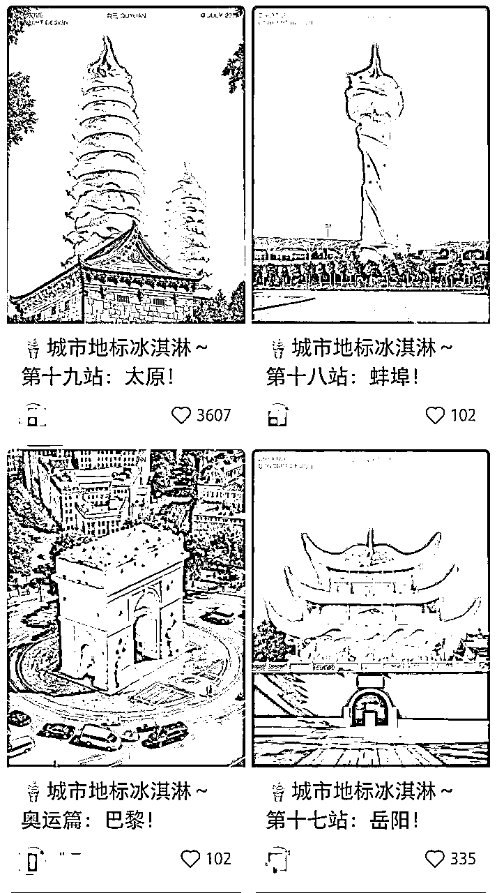

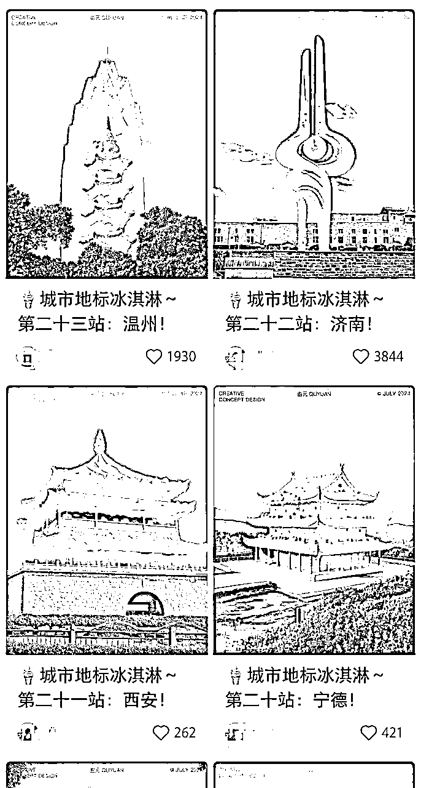

很多不会用AI的小伙伴，看到都很好奇，质疑是怎么做出来的？

其实会AI 的小伙伴 一看就知道是用AI做出来的

那么怎么做呢？

下面我们会给出最简单可行的教程，相信会AI 的小伙伴一看就会。

不会AI 的小伙伴，学AI 也非常简单，大家按我们的步骤一步一步操作 就行了

如果还有不懂的，可以问我，

先看我们做的一些图

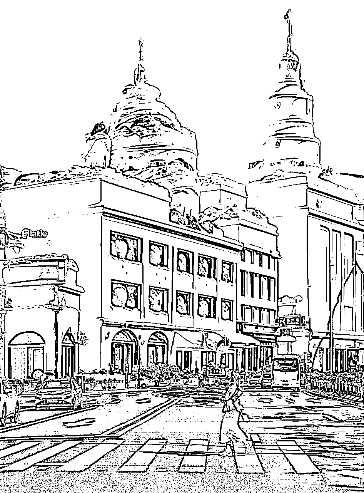

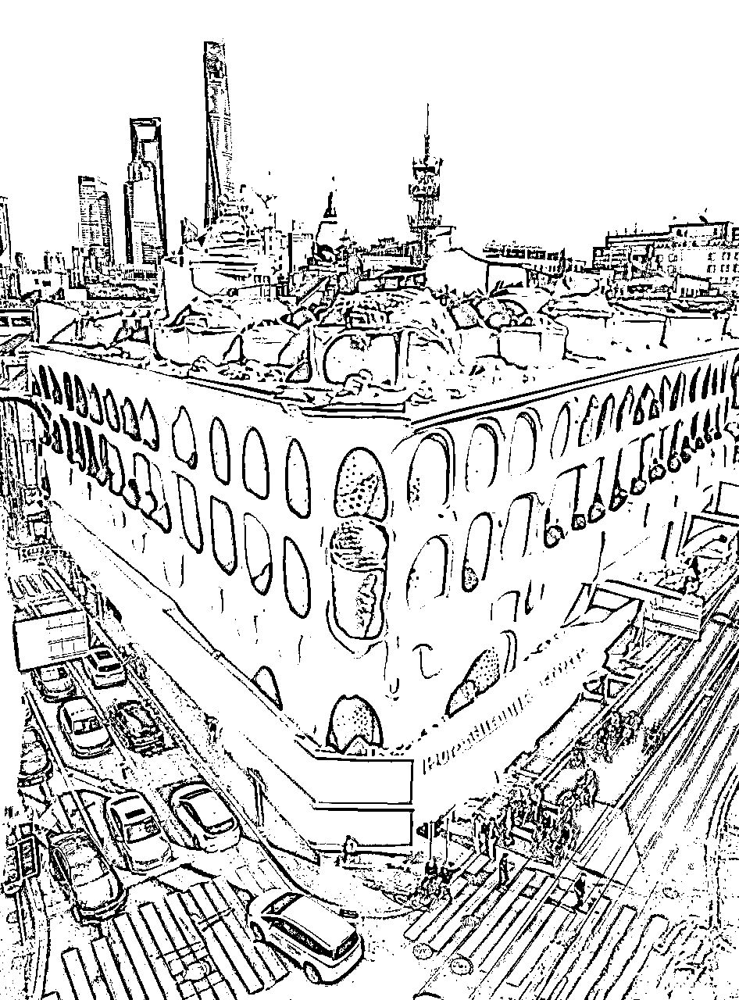

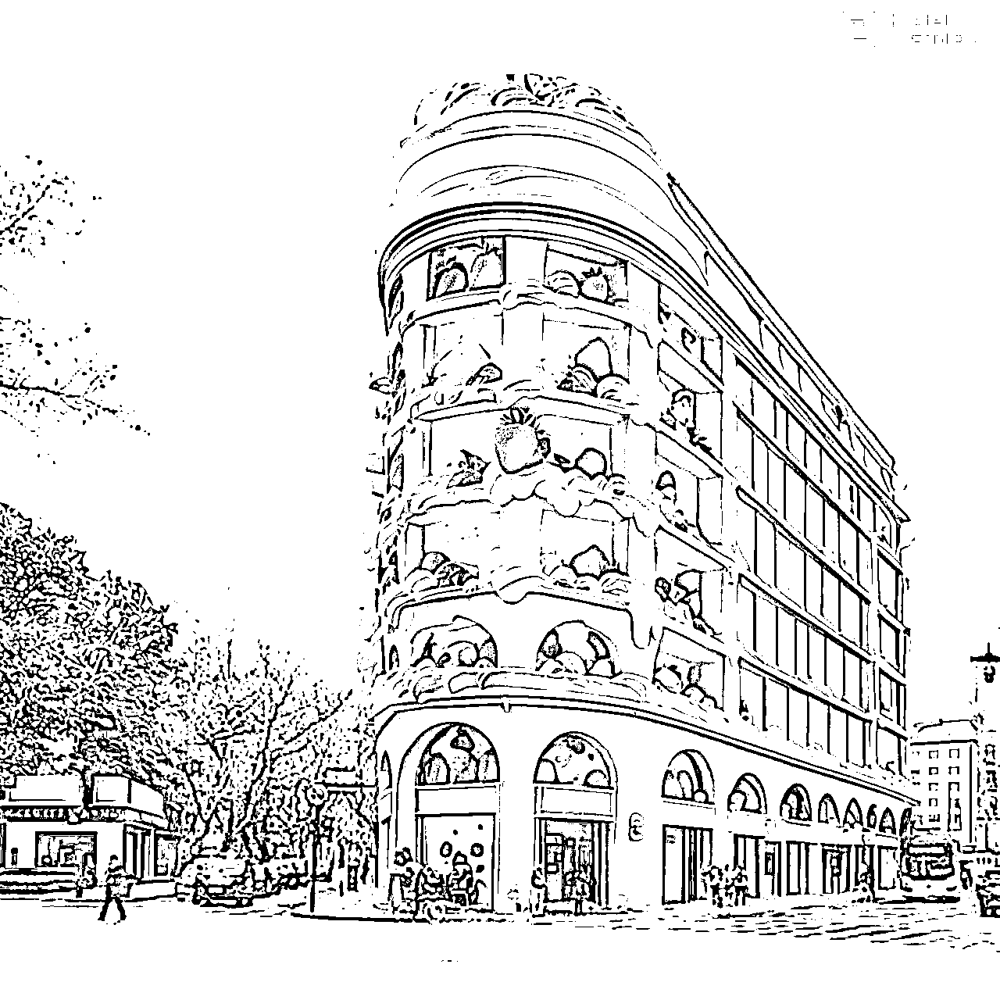

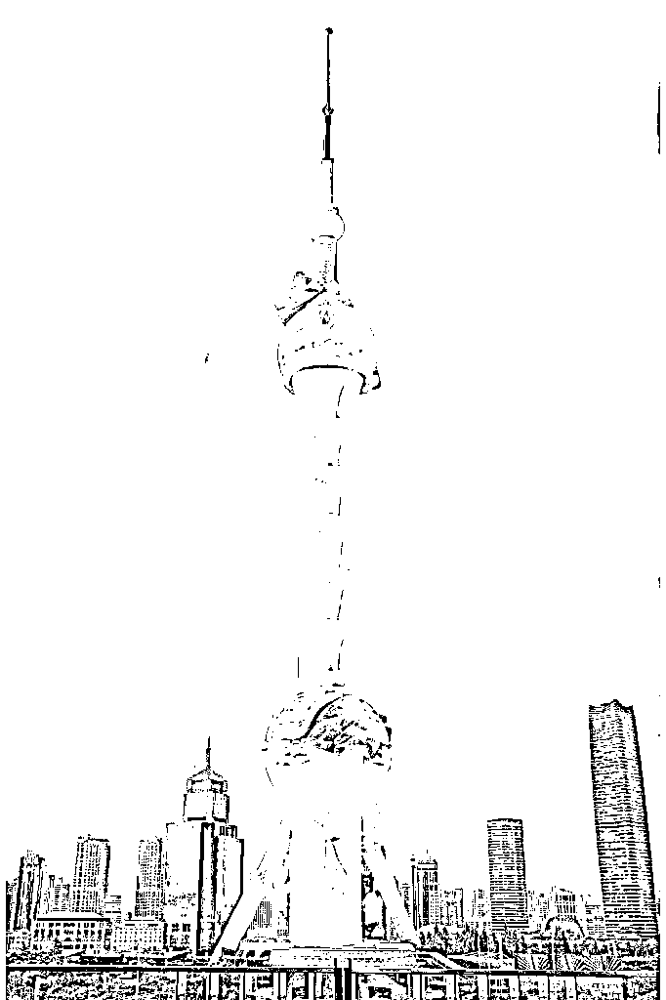

这些图是我们做的上海的一些建筑，当然只要学会方法，全国各地的建筑 咱们都能做

# 一、准备工作

### 1. 打开 “即梦 AI ”，注册并登录

https://jimeng.jianying.com/

### 2.明确设计理念。

- 思考您想要的冰淇淋建筑的风格、形状、颜色和特征。

- 可以准备一些参考图片或关键词，以更清晰地传达您的想法。

# 二、输入描述

### 1. 打开“即梦AI” 工具，首页选择“智能画布”选项。

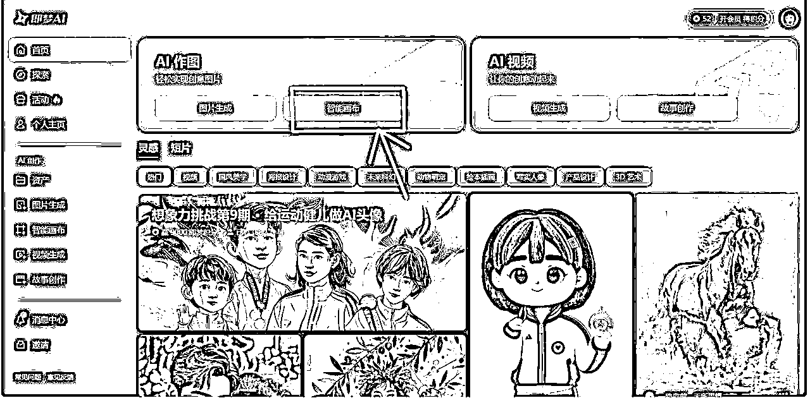

### 2.打开画布后选着“上传图片”选项，导入需要制作的图片，并调整合适的画布比例。

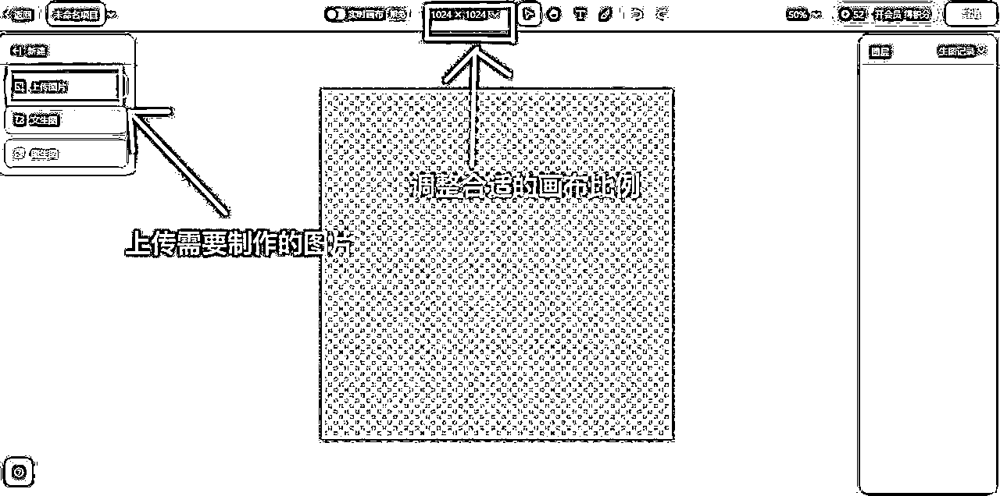

### 3.选择“图生图”模式，在“描述词”选项，用详细且富有想象力的语言描述您的冰淇淋建筑。

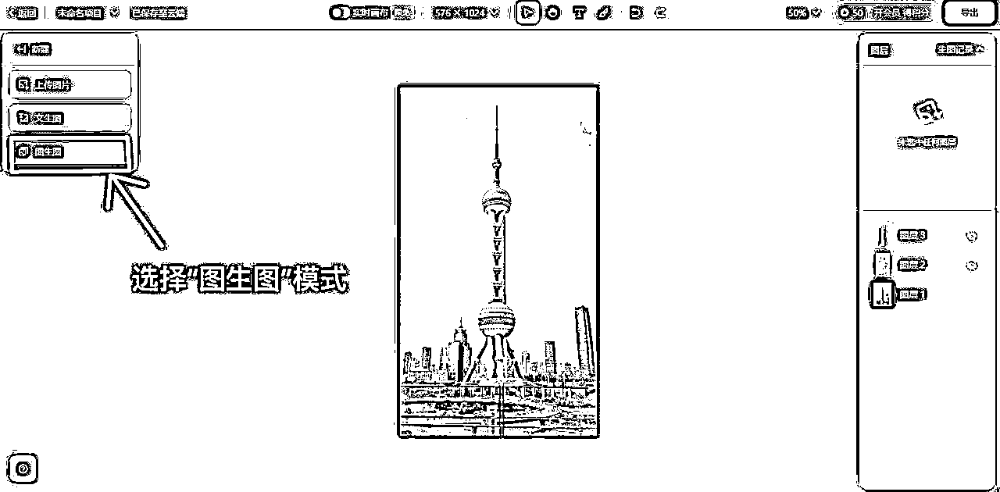

- 例如：“一座由草莓冰淇淋、巧克力冰淇淋和香草冰淇淋组成的城堡，城堡的尖顶是彩色的冰淇淋甜筒，墙壁上镶嵌着糖果和果仁，周围环绕着冰淇淋做成的花朵和喷泉。”

- 尝试使用不同的词汇和表述方式，以获得更丰富多样的结果。

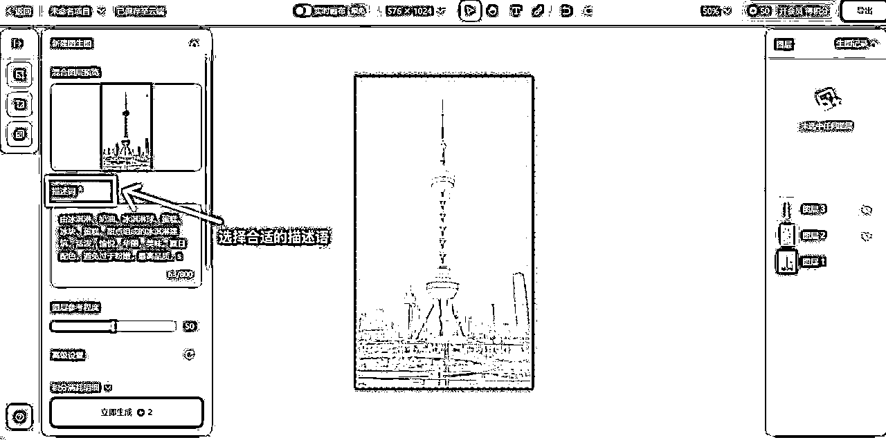

### 4.在高级设置板块，点击“风格参考'”选项，导入想要生成的参考图片。

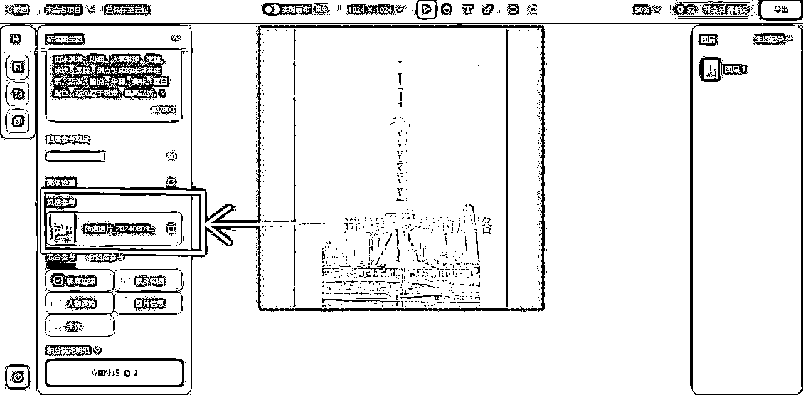

### 5.选择“混合参考”选项，点击“轮廓边缘”，参考程度选择60—80。

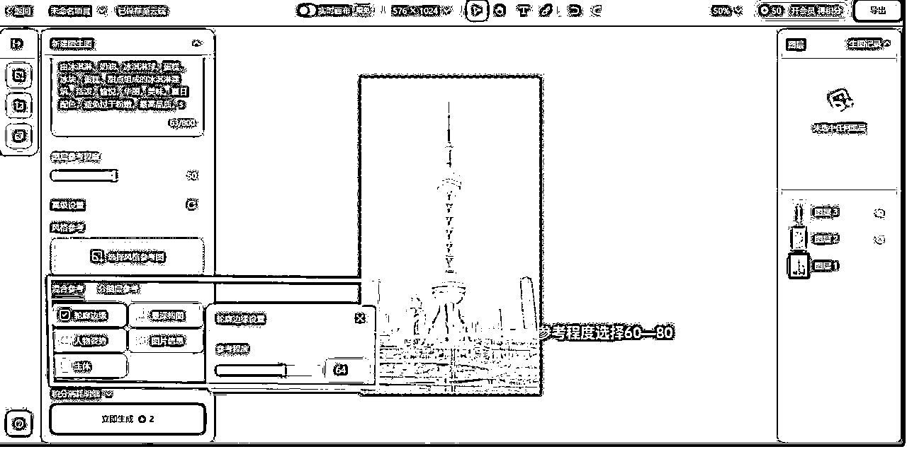

# 三、生成图像

### 1. 点击“立即生成”按钮，等待 AI 生成冰淇淋建筑的图像。

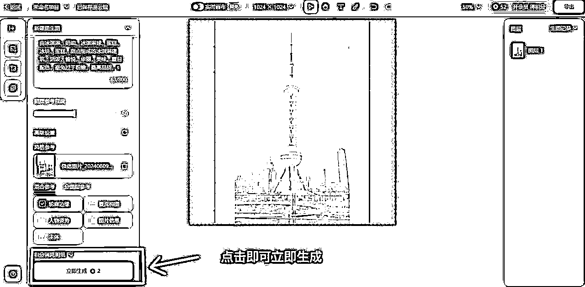

# 四、筛选和优化

### 1. 查看生成的图像，选择您最满意的结果。

### 2. 如果对生成的图像不够满意，可以对描述进行修改和调整，重新生成。

# 五、细节与调整

### 1.点击“HD无损超清”，优化画质。

### 2.点击“抠图”，把需要的主体扣出来，叠加到原图上。

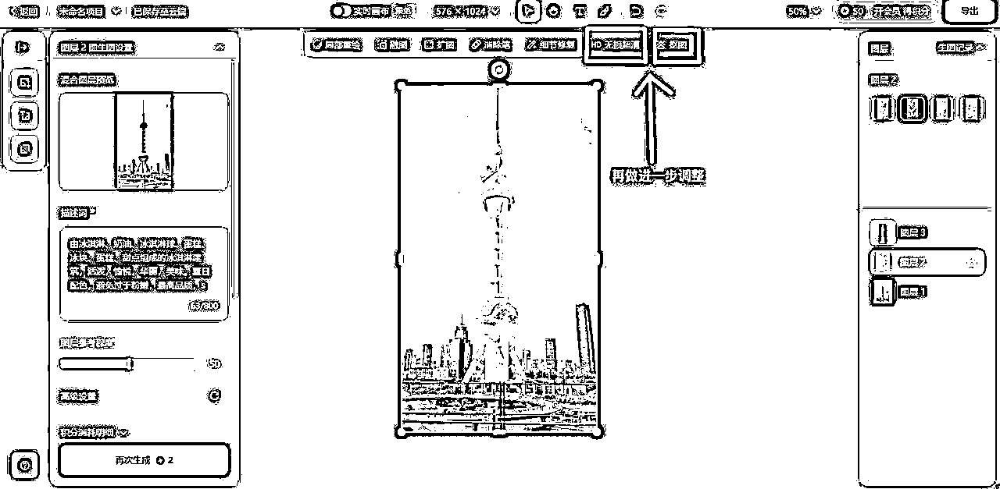

### 3.调整细节，点击“局部重绘”或者“消除笔”，优化画面。

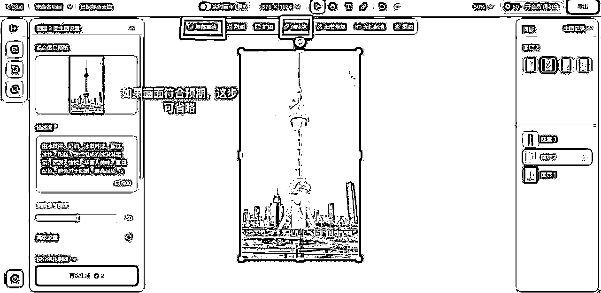

# 六、图片导出

### 1.导出设置选择JPEG格式，2x尺寸，选择当前画板为导出内容，最后点击下载选项。

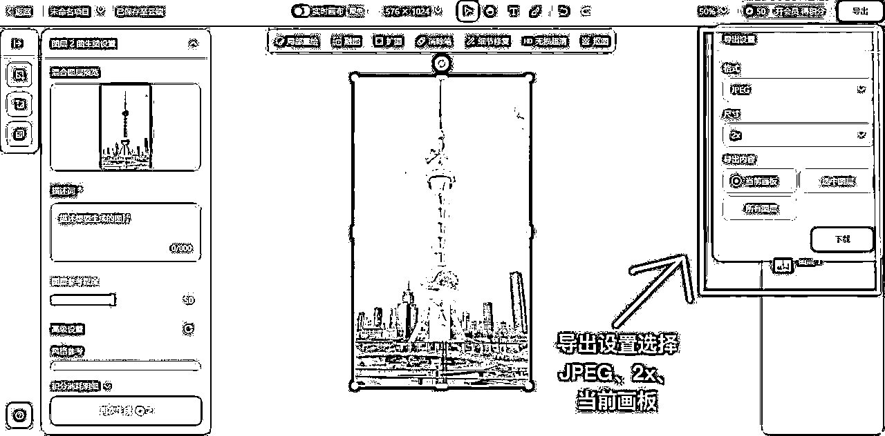

### 2.在文件夹打开保存好的图片。

# 六、后期处理（可选）

### 1. 如果需要，您可以使用图像编辑软件（如 Photoshop）对生成的图像进行进一步的修饰和完善。

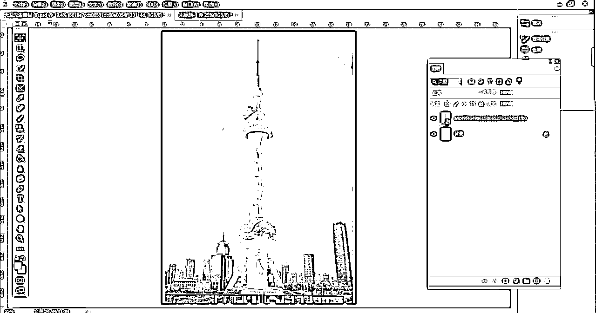

通过以上步骤，您就可以利用 AI 生成令人惊叹的冰淇淋建筑图像了。

不断尝试和创新，您将能够获得更加独特和精彩的设计！

这个教程是我们整理出来的最简单高效的教程，小伙伴们可以跟着做做看，有什么不清楚的欢迎找我解答