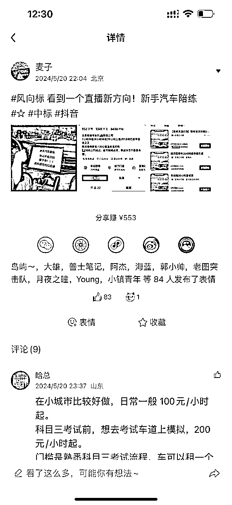
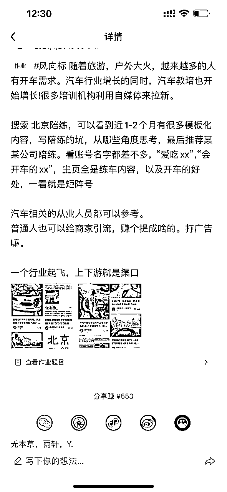
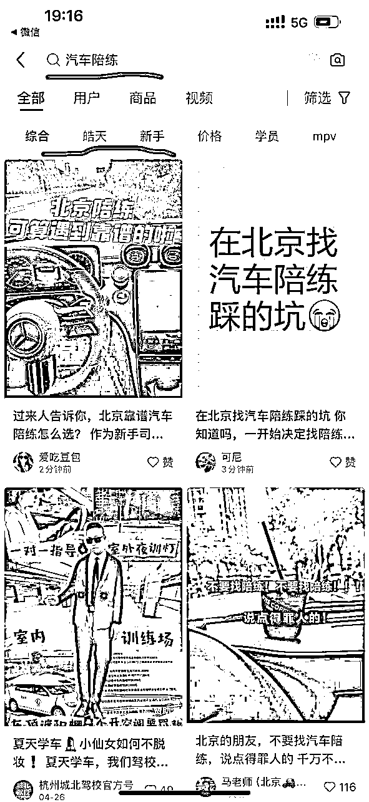
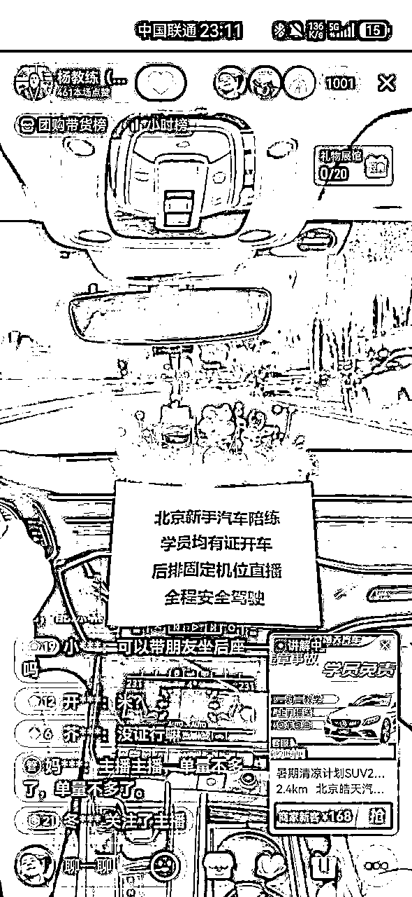
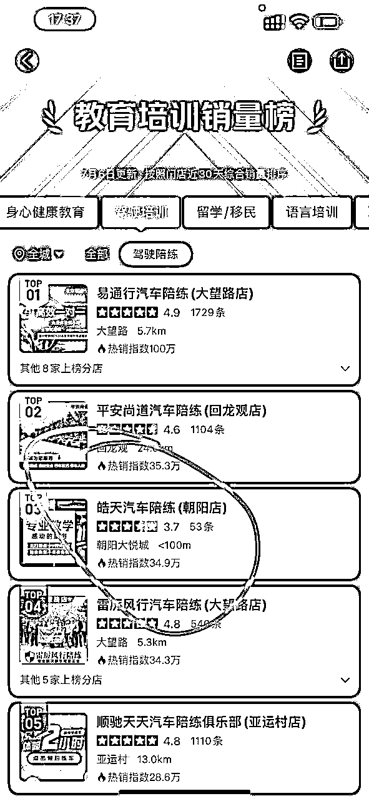
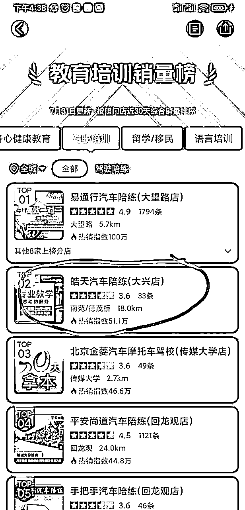
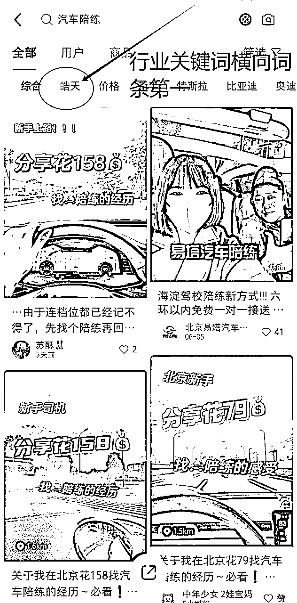
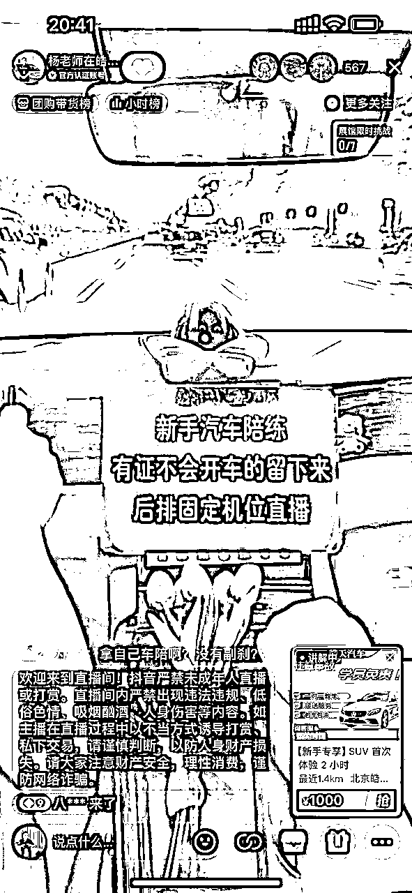

# 能落地！同城生活服务垂类小赛道，两个月跑通5000万营收模

> 来源：[https://lan8xwabyiz.feishu.cn/docx/Apf6d7nkBomJWaxjUHXcfBV8npd](https://lan8xwabyiz.feishu.cn/docx/Apf6d7nkBomJWaxjUHXcfBV8npd)

# 项目选择底层认知：

大家好，我是老杨。今年我们团队不断的在测同城项目的流量，核心逻辑是同城的生活服务类项目是完全可以用 20w 去撬动 1000 w 利润的。我们的选品逻辑只有两个 ：

1、项目的投入和产出是否符合标准，投入不超 50w；

2、项目的利润是否满足年 利润 1000w 以上；

我们在北京通过全域流量组合拳两个月拉爆同城蓝海赛道，年内做到营收5000万，除此之外同步成功孵化上海，杭州，深圳，郑州，贵阳，太原等城市合伙人成功跑通0~10，如果你抱有怀疑的态度，那么本篇文章一定要看完，相信会完全粉碎你对于同城生活服务+流量玩法的固有认知。

纯干货,能落地!非常适合个人、新手小白、团队扩展新项目。2024，同城生活服务大有可为，加上全域流量解决前端获客问题，两个月轻松拉爆一个城市。

# 项目介绍

## 一、具体赛道：同城汽车陪练服务

上周朋友微信发给我，有几个圈友发了我们团队目前在做的一个同城生活服务产品（汽车陪练）直播的截图，（见下图）没想到我们的产品短短几个月就火出了圈，那今天正好我给各位圈友们做个大概的拆解和玩法。

感谢圈友们的认可

汽车陪练通常大家理解的是刚拿到驾照的人，其实真正有消费主力的用户群体是拿证 5 年以上的 30 岁以上女性，这部分人群占到了 90%，

简而概之就是帮助有证不敢上路的司机上路开车，教练提供一对一陪练服务。如果你在所在城市没有听过，那就对了，这正是机会所在！纯刚需，二转升单率极高。

## 二、两个月实战战绩

汽车陪练这个项目是我们今年 3 月底开始立项，用了 一周的时间从小红书单日获客 30 单（体验课），5 月份开始抖音放大目前稳定在每天 200 单，北京最头部的公司去年营收 4000 万，单日体验课 30 单，从入局到一天吃到竞对一周的量，我们只用了两个月，感兴趣的大家可以去点评搜索一下相关数据。

在大家看起来是一个非常小众的赛道，但图一是我们在小红书拿到的结果，开屏四块内容三块是我们的。图二是抖音直播的画面，小众垂直赛道在深夜能突破在线一千人。

图一：小红书开屏除了商业投流广告都是我们的内容

下图图三是我们抖音单场直播（两小时），纯自然流跑的情况，可以说我们是全北京第一个跑出来的直播间，从最开始起号的在线10个人，零星出单，到现在稳定下来矩阵账号一天做多场直播早，午，晚每日能稳定在200单引流课程，我们确实也踩了很多坑，也遭受了同行各种各样的打压，没办法实力摆在这，一天两百单，一个月6000单，这个量相当于北京头部竞对去年一年的量，我们这套打法进入到任何同城实体那就是碾压，直接拿到北京90%以上的量。

这套玩法一经打出，便引发了各地同行的拙劣模仿，但是他们只会一味的照搬我们小红书的文案，复制我们抖音的直播话术和直播场景，导致消费者对单调重复的内容愈发厌倦，市场也变得越来越卷。现在我们已经升级2.0的全新玩法，跑量以后的自然流还是不那么稳定，要想持续放大最后还是要走投流和付费。能通过付费稳定放大的才是好的商业模式。我们研究出了一套“黑科技”，可以通过小红书聚光投流和抖音本地推做到极低的投入微付费获客，免费+付费，双管齐下，从满是抄袭和打压的底层竞争业态里成功厮杀出来。

## 三、流量通吃

圈友们看到的前段体验课只是引流品，后续二转升单客单价 3000+，二转转化率 50% 以上。汽车陪练这个项目的在北京的线上流量（除点评外）基本被我们吃掉了 80% +，目前我们也在拓展全国市场。按照目前我们的营收增长模型，年内即可冲击 5000w 的营收。

# 项目的核心壁垒和具体玩法

## 一、核心壁垒

同城生活服务类的项目前端的流量非常好打，甚至说可以是有手就会。核心壁垒是在规模化的过程中遇到的两个交付端的问题：

1、服务的标准化，这个是我们收集了市场上排名前 10 的汽车陪练公司经过 2 个月的整理优化出来了一套完善的SOP，包括培训、招人管理体系

2、规模化的交付，线下业务优秀的交付团队是通过时间积累起来的，通过时间积累形成的壁垒很难短时间内突破，刚刚说到的头部陪练公司二转客单价 5000+，二转转化率 70%+，转介绍率 30%+，这个是需要非常强的后端团队才能做出来的效果。

竞对用了 8 年时间来沉淀和筛选核心的交付团队，我们 4 个月的 时间虽然打破了流量壁垒，但是交付壁垒无法短时间内打破。所以我们把北京的后端交付分成了几个服务商来做，其他城市也是采用的服务商模式。

这个项目最大的 Bug 就是二转的销转和交付都在同一个司机手里，这个才是最难把控的点，我们在控飞单和服务质量上付出了很多的时间精力，但好在最终找到了解决方案。

目前全国的头部也是北京的头部，8年时间沉淀下来后端稳定在80+陪练教练，而我们只做了4个月，通过boss，小红书，抖音等平台，目前只积累下来30+陪练教练。只要有一个10个人的稳定后端团队，是足够在全国的任何城市快速打响第一枪的。

截止24年7.31日，我们在大众点评好评热度排第二，全网销量第一

## 二、具体玩法

### 小红书

具体的玩法其实很简单粗暴了，大力出奇迹，该类目在小红书每月的帖子是500篇，那我们就用大量的矩阵账号铺量，快速占领关键词。同时优化 SEO 排名，再配合微付费，一整套组合拳下来，我们做到了两件事：

1.吃下每天90%以上的自然流量。打个比方，我们一天的发帖量就是原来同行一个月的发帖量，完全是降维打击。

2.打造专属商业话题，凝聚品牌势能。通过大量的矩阵分发我们在两个月内成功做到了小红书横向词条商业话题的全国第一。

### 抖音

抖音的玩法就是本地生活的打法：多开店，多发视频，多直播，多达人探店。抖音本地生活的打法还是比较简单好用的，同时为了让品牌迅速在同城拉爆，也做了一些话题性的内容：比如说团队用我的闲置车去做陪练车直播。

灵活利用我车库里的闲置车辆，做争议性和话题性的内容直播

## 三、对比同行的优势

### 1.流量

从大鱼吃小鱼，到快鱼吃慢鱼。

正如上文提到的流量通吃，我们汽车陪练这个项目的在北京的线上流量（除点评外）基本被我们吃掉了 80% +，目前我们也在拓展全国市场。通过小红书文案加地域标签和抖音视频矩阵号的方式，实现北京总部流量反哺各地服务商，服务商无需考虑如何获取流量，通过本部的流量扶植即可在前期获得可观的单量。后期做好点评和自主直播也可以实现流量获客。当然，我们也有傻瓜式的全套的多平台获客SOP。

同时总部也会不断优化流量获取渠道和玩法，目前我们正在测试截流方式拓客。测试下来截流的流量非常精准，不少的同行总会一直抱怨没有流量，其实流量不会突然消失，只会不断地更新玩法和获取方式。因此我的团队以天为周期每天复盘数据每天总结优化，力求跟上不断变化的流量。

### 2.私域+精细化运营

“私域”是我们的用户场景，而“运营”则是我们达成目标的手段和方法。因此，我们的重点在于“精细化运营”。这意味着我们需要从用户的属性、渠道、行为和场景等方面更加细致地分析，以进行更精准的运营活动。关键在于运营用户，而不仅仅是运营渠道。精细化运营的核心是针对不同细分用户群体的运营。在深入挖掘用户需求的基础上，我们可以优化运营策略和体验链路。这是一个动态迭代的过程。通过选择合适的时机、渠道和方式，我们可以为不同私域用户提供更准确的解决方案，从而提高业务转化效率。

我们有很多的高客单成交甚至是建立在顾客上体验课之前。哪怕是没有直接成交，通过+v以后在私域的沉淀也可以在后期一个月内通过不同形式的触达实现转化。这就是私域精细化运营的重要性。

简单一点的从朋友圈的真实人设打造，每日发圈条数和图文内容敲定，再到回复话术，二访，三访流程以及社群活动策划运营等。我们都有一整套的精细化运营SOP。

只有每一个环节都做到颗粒度足够细，才可以实现转化率的最终提升。

## 3.全域组合拳

从传统的大众点评，到抖音，小红书，闲鱼，视频号等各大流量开口，总之一句话只要是流量在的地方，我们就一定会关注，自热，截流，付费，只要有一条路径能跑通，就能实现快速放大。

## 4.付费黑科技

我们的投手正在测试最新的聚光投流方法，通过这套方法可以做到比市面上所有同行都低50%的获客价格。

用这套玩法，我们完全能够 15-30 天去打透一个赛道，轻松获客线下传统实体10倍乃至百倍的量。

# 三、分析总结

未来5年的红利一定是在同城业务，前端流量+私域的精细化运营+同城线下交付的模式 一定是一个超级大的红利，创业者在选择赛道、选择项目的同时要从未来3年的时间跨度上去评估这个赛道的可持续性。

我经常跟我的团队讲：我们选择新的项目，一定是要去做降维打击的事情，不要去跟比自己能力强的团队卷，即使卷的过，未必能赚到更多的钱。相反我们要去找到更多傻子都能赚钱的赛道，冲进去用最快的时间把傻子干死或者收编，在行业红利期的时候玩命干，这样才能在行业下行的时候快速撤退。同城的业务对于稍微会做点流量的团队来说就是降维打击，我们还同步测试了少儿体能培训、旅游、月嫂家政这几个行业，都是可以快速获客放大的行业，后续也会给大家做详细的拆解复盘。

现在的大环境已经不允许我们再重资产的投入去创业了，圈友们在选择项目，赛道的时候不妨可以多看看同城生活类的。我们目前同步在测试、放大的 项目都是我刚刚在 说的生活服务类。

如果圈友们有更好的赛道和产品欢迎多交流。

# 四、感谢

感谢提供平台，希望链接到更多有相同愿景的圈友，大家一起互惠共赢，存利他之心，行利他之事。