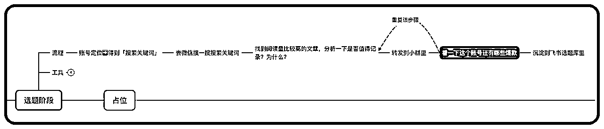
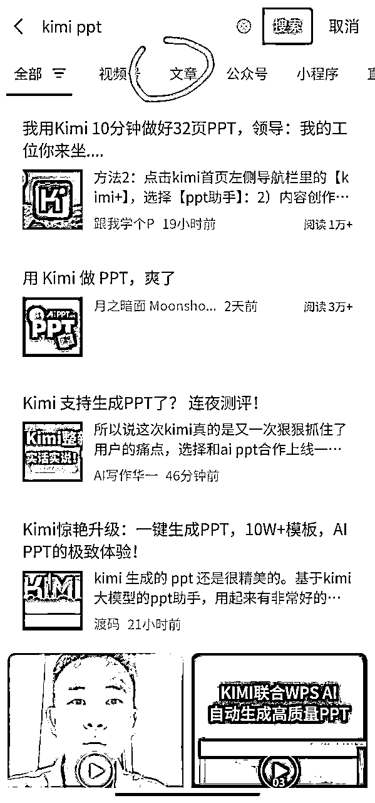
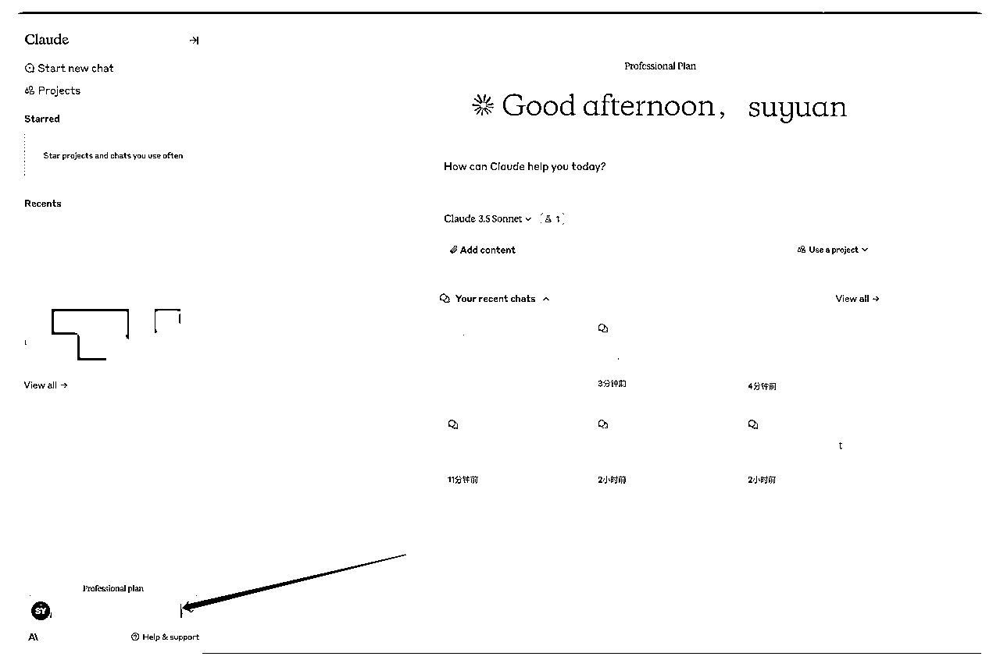
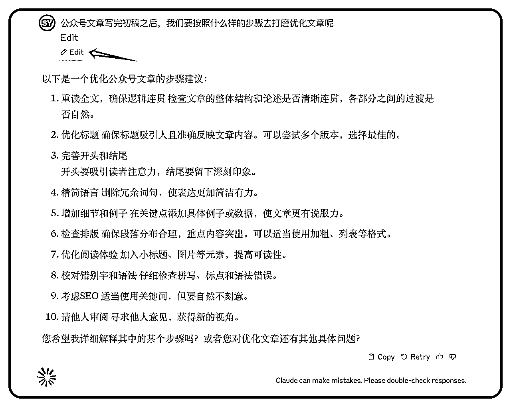
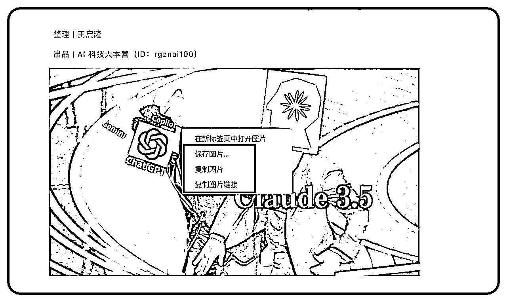
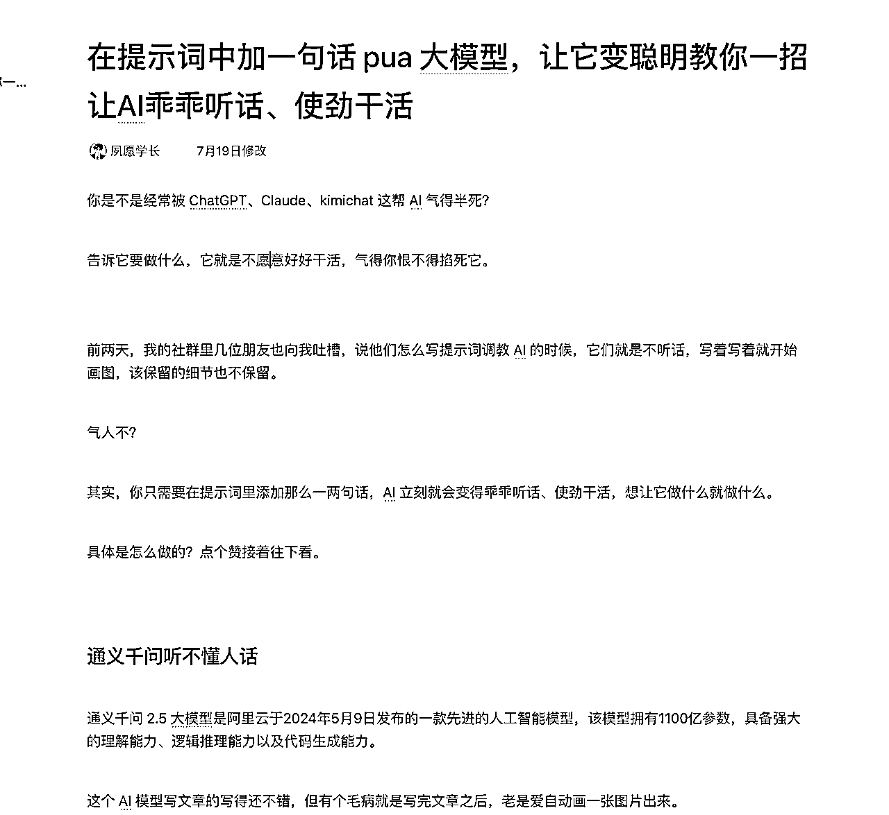
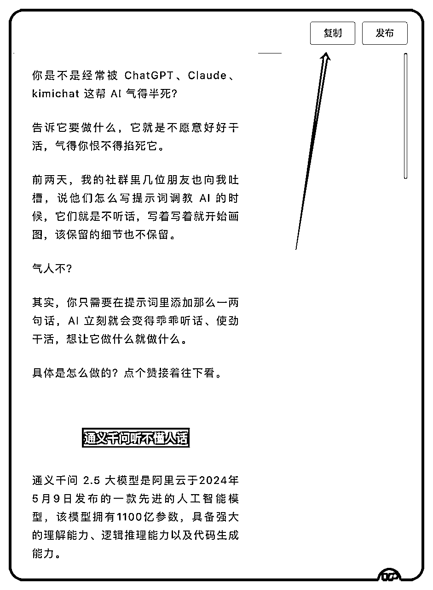

# AI 工作流，赋能我的十倍增长（生财）

> 来源：[https://zi6nfl20s5u.feishu.cn/docx/WrLzd55GwoJWWdxGD7Nc4KbHnxe](https://zi6nfl20s5u.feishu.cn/docx/WrLzd55GwoJWWdxGD7Nc4KbHnxe)

你好，我是夙愿学长，02 年大三在读，号称是最懂 AI 工作流的 00 后，曾当过生财有术的 ChatGPT 航海教练，给创业小团队定制过 AI 提效解决方案。

最近我明显感觉到，我正走在通往 Work Life Balance 的道路上。

以前，我的生活很混乱，每天都感觉很忙，但仔细想想，又不知道在忙什么。晚睡晚起，不锻炼身体，工作效率低下，生活质量差......我深陷其中，无法自拔。

但现在，我每天 11 点准时睡觉，一觉睡足 8 小时。每天锻炼身体半小时，每天自己做一顿饭。

不仅每天的工作都能按时完成，甚至还有一个小时的时间来打游戏！

而这一切的改变，都源于我将 AI 工作流融入了我的工作中。

接下来，我就来和大家分享我的 AI 工作流心得。

# 一、为什么需要 AI 工作流

AI 工具是个好东西，但是现在，大多数人还停留在零碎地使用 AI 工具的阶段，并没有系统地将 AI 工具应用到工作场景中。


这会导致一个问题：虽然在某些具体任务上提高了效率，但从整体上来说并没有提高多少，甚至比不用 AI 时效率更低的。

举个例子，小明听说 AI 能帮忙写文章，就开始折腾。

周一用 ChatGPT 写了篇科技文，觉得不够专业；周二换 Claude 写财经文，又嫌太死板；周三改用 kimi 写情感文，结果太浮夸。

用 AI 写文章的时候，又不停地折腾测试不同的提示词。

折腾了一周，他发现自己只完成了 3 篇文章，还都不满意，反而以前一周能写 5-6 篇，质量还过得去。

小明这下可犯了难：用 AI 反而效率更低了？其实问题不在 AI，在于没有形成一套完整的、适合自己的 AI 工作方法论和流程。

在挑选和切换工具的时候，就浪费了不少时间。

面对这个局面，要怎么破局呢？有没有一套比较系统的方法，能从整体上提升工作效率和质量呢？

我给大家的答案是：AI 工作流


# 二、什么是 AI 工作流

在说 AI 工作流之前，我们得先知道什么是工作流。

工作流，顾名思义就是工作流程，把一项工作拆分成多个步骤。

我就拿写公众号文章来举例，大家想想，平常你写文章都要经过哪些步骤？

首先呢，得想好写啥，对吧？这就是选题。

选好题之后，就可以根据选题去列大纲写个大概的内容了，这就是初稿。

初稿肯定得修改打磨一下，这是改稿。

改好了之后，根据我们的稿子来写一个吸引人的标题，让读者想点进来看。

这样我们就有了文章内容和标题，那就可以复制到公众号平台上面去排版了，排版让读者阅读的时候看起来舒服点。

最后，完成以上步骤就可以发布文章了。

你看，更新一篇公众号文章，就可以拆成以上这几个固定的步骤来完成。

把一项大的工作拆解多个小的步骤去完成，每个步骤都有明确的输入、产出，环环相扣，这就是工作流。

而 AI 工作流，就是将 AI 工具引入到上面工作流中的各个环节里面，回到刚刚的例子。

在写作的各个环节，都可以用对应的 AI 工具来提效。


通过这个 AI 工作流的加持，每个步骤里你都选择了一个，最适合当前步骤的 AI 工具来提效，文章从选题到发布的全流程都得到了非常高的效率提升。

通过局部最优解，来达到全局最优解。

现在，很多人企图用一个的 AI 工具来解决所有问题。

但其实每个工作环节都有自己的特点，一个工具难以应对所有情况。

想想看，你会让一个篮球高手去游泳比赛吗？肯定不行啊。

AI 工作流就是要给每个环节找最合适的 AI 工具。这样一来，不同的 AI 工具配合起来，效果比单独用一个工具好得多。

说到这，有的人会反驳了，AI 写的文章很一般，没有灵魂。

你说得对，的确是这样的，但是我的观点是，AI 它能够帮助我们人类迅速地从 0 写出 70 分的文章，

然后我们人类其基础上，打磨优化到 80 分，这样的工作方式，效率肯定是比人类直接从 0-80 分高得多得多的。


但再过一段时间，随着大模型能力的进化，以及我们写提示词的能力提升，就能一定能让 AI 输出 80 分的文章。

有人可能会问，既然现在的 AI 还不够完美，为什么我们要现在就学习 AI 工作流呢？

我的答案是：提前布局，抢占先机。

因为未来会出现更强大的 AI 工具，例如 GPT5。

那些已经熟练掌握了 AI 工作流的人，只需要在原有的工作流程中更新一下工具，就能立即将 GPT-5 的强大能力应用到工作中，效率提升将是指数级的。

而那些还没有开始学习 AI 工作流的人，等到 GPT5 发布时，才恍然大悟，才开始摸索 AI 工作流，就已经落后了一大截。

等他们好不容易掌握了 AI 工作流，前者已经用 AI 完成了大量工作，积累了丰富经验，甚至开始优化迭代自己的 AI 工作流了。

我认为这会形成 AI 时代的马太效应：强者越强，弱者越弱。

所以，学习 AI 工作流，不仅仅是为了提升当下的工作效率，更是为了在未来占据有利位置。

# 三、怎么搭建 AI 工作流

## 3.1 搭建 AI 工作流的三种能力

那怎么搭建出这样的一套 AI 工作流呢？

在讨论这个问题之前，得先知道搭建 AI 工作流，我们需要具备哪些能力呢？

我把这个能力分为了三个层级，分别是熟悉各种 AI 工具、编写提示词、搭建 AI 智能体。


### 3.1.1 熟悉各种 AI 工具

首先第一层，就是要熟悉各种各样的 AI 工具。

在 AI 工作流里，不同的环节可能需要用到不同的工具，还是拿文章举例。

写标题，可以用 ChatGPT；

但是写文章的话，就得用 Claude 了，因为 claude 的写作能力比 ChatGPT 强很多。

而检查文本中的错别字和病句呢，可以用秘塔写作猫的 AI 纠错功能。

熟悉各种 AI 工具，就是入门 AI 工作流的第一步，我们需要去了解多个不同 AI 工具的特点和用途，根据具体的某一项细分任务，去选择合适这个任务的 AI 工具。

### 3.1.2 编写提示词

第二层，是要学会写提示词，因为这决定了你是否能用好这些工具。

我们刚刚说了写标题，可以用 ChatGPT；写文章，可以用 Claude；

但具体怎么让 AI 去写呢，这需要我们有一定的提示词能力，我们才能让 AI 写出好的内容。

因为提示词，就是要搭建起人和 AI 之间的"沟通桥梁"，我们得用 AI 听得懂的语言，清晰地说明你的需求、任务的内容和步骤，让 AI 明白你要它做什么，怎么做。

### 3.1.3 搭建 AI 智能体

第三层呢，是要学会搭建 AI 智能体。

AI 智能体它就像是我们的员工，它能根据我们设定的工作流，自动调用不同的 AI 工具，完成全流程任务，不需要人类每时每刻都盯着它指导它来干活。

AI 智能体就像是你的智能助手，给它安排好工作步骤，它就能自动选择合适的工具，按顺序完成任务。

比如说我们要写一篇文章，就可以设计一个"写作助手"的 AI 智能体。

我们只需要在文本框里输入文章的主题、风格和要求，然后回车发送。

它开始自动地写一个文章大纲处理，接着根据大纲使用 Claude 模型来写一份文章的初稿，接着再进行修改润色，最后排版一下，把一篇完整的文章弄出来给了我们。

前面我们还没引入 AI 智能体这个概念的时候，这原本是需要人类进行干预的，但现在就不需要人类干预了，效率也就大大提高了。

以上，我们说了搭建 AI 工作流所需要的能力，分为三个层级 ，你也可以思考一下自己现在处于哪个层级呢？


现在，你可以对照这三个层级，评估一下自己的 AI 工作流能力，找出差距和不足，多学习、多实践、多交流。

## 3.2 搭建 AI 工作流的工作流

搭建 AI 工作流其实也有一套简单易行的工作流，我们可以从最基础的开始，一步步来。

### 3.2.1 找到一个工作场景

选择一个你比较熟悉的工作场景，比如说，写文章、做 PPT，随便哪个你经常做的工作都行。

### 3.2.2 拆解工作流程

因为是你熟悉的工作场景，所以你肯定能把这个工作拆解成几个小步骤，如果暂时想不清楚，可以先把整个流程在脑海中或纸上过一遍。

就比如刚刚说的写文章，可以拆成选题、写稿、改稿、写标题这几步。

### 3.2.3 给每一个步骤嵌入工具

针对每个小步骤，想想有没有 AI 工具可以帮上忙，如果你想不到的话，别自己闷头去想，去找一下别人是怎么做的？

我们遇到的大多数问题，别人都遇到过并很好地解决了，所以你只需要找到别人是怎么解决这个问题的就可以了。

注意，要灵活选择最优解，不要为了 AI 而 AI。

通过局部最优解，来达到全局最优解。

我们的目的是提高工作效率，而不是提高工作的含 AI 量。

### 3.2.4 测试 AI 工作流

完成以上步骤之后，你的一个 AI 工作流就搭建出来了。

开始尝试测试使用你搭建出来的这一套工作流了，一开始可能会有点不顺手，没关系，多试几次就熟练了。

后面就是，根据你使用体验不断调整和优化你的 AI 工作流。

哪个环节效果不好，就换个工具试试；

哪个环节出现了更好的工具，那就这个环节的工具升级一下。


这是搭建 AI 工作流的基础，也是最容易上手的部分。

很简单，对吧，当你搭建完这一个 AI 工作流时，你一定会遇到问题，现成的 AI 工具，不好用。

为什么不好用？ 因为可能是因为提示词写得不够好、可能是这个工具本身就不行。

怎么办？去学习怎么写好提示词、去找更好用的 AI 工具啊，或者找个懂提示词的人帮你解决啊。

接着，等你写提示词、换工具的问题你解决了，你可能又会觉得，这个工作流效率还是太低了，想着怎么搭建一个 AI 智能体来自动化完成一系列的任务。

此时问题就是：怎么做一个 AI 智能体？同样的，去学习怎么制作智能体，或者找一个懂智能体的人帮你解决。

如果一开始你想的是，提示词好多知识好难学，智能体更复杂了，好困难，我不行，那你肯定就放弃了。

但是，这些是你当下面临的问题吗？

不是，你当下面临的问题是怎么拆解你的工作场景？拆解出来的小步骤可以用哪些工具去赋能提效？

这才是你遇到的实际问题。

解决实际的问题，一步一个脚印，不要去想那些不存在的问题。

总结一下，搭建 AI 工作流不是一蹴而就的，这是一个不断迭代优化的过程，你可以从最简单的开始，慢慢往复杂的方向发展。

最重要的是，要培养这种 AI 工作流思维习惯，现在的我一遇到任何事情，第一反应就是"思考这个事情 AI 能帮我做什么"。

以上就是 AI 工作流的理论部分。

接下来，我会用公众号写作这个场景，来实战演示如何梳理一套 AI 工作流。

我会详细拆解公众号写作的工作流，梳理出可以嵌入 AI 工具的关键节点，提供一套可落地执行的 AI 写作提效方案。

# 四、工具准备

## 4.1 飞书客户端

下载一个飞书客户端：https://www.feishu.cn/download

飞书里面的一个工具，是本 AI 工作流的一部分。

## 4.2 浏览器

浏览器选择很重要，但不是重点。

如果你用 Mac，可以试试 Arc 浏览器，Windows 用户就别折腾了。

Arc 下载地址：https://arc.net/

不过记住，我们是来学 AI 工作流的，不是来研究炫酷的浏览器的。

注意，我们是来学 AI 工作流的，不是来研究炫酷浏览器的。

用 Arc 的目的很简单 - 就是方便保存常用网页，普通浏览器也能做到。

安装使用 Arc 浏览器，需要你的电脑能魔法上网，需要开启「全局代理」，不然，即使安装好了也用不了。

如果你的电脑无法魔法上网，那就跳过安装 Arc 浏览器这一步。

1、下载安装后，需要注册一下，如果你进入到这个界面，说明你已经注册成功了。


2、接着，点左下角➕，创建新空间。


3、给空间起个名，比如"公众号写作"。


4、在新空间里创建几个文件夹，方便分类。


5、打开微信公众号平台：https://mp.weixin.qq.com/ 拖到"发布环节"文件夹里固定。

这样以后写作时随时可以打开使用。


即使这个页面关闭了，微信公众号平台也还在，这就方便我们在写作的时候，随时打开使用。

好了，你做到这一步就可以了。


好，说到这里，你也发现了为什么我们需要使用「空间」把需要用到的网页都放到一块呢？

主要有两点好处：

第一，避免开太多窗口，减少注意力分散。

以前我工作时经常开一堆窗口，很乱。

每次想用公众号后台还得先去搜索，容易被其他信息干扰。

第二，有助于工作流程标准化、高效化。

就像飞行员起飞前的检查表一样，一步步来很清晰。

网页之间的衔接也更流畅，不用老想"下一步该用啥工具"。

减少了犹豫和被其他想法干扰的可能。

如果你用不了 Arc，用普通浏览器也行。

创建个收藏夹栏，把常用网页都放进去就好。

效果是一样的 - 让工作流程更清晰、高效。


## 4.3 写作编辑器

写作过程中，需要一个趁手的文本编辑器。

我不知道你现在是用什么工具来编辑文章的，在线的飞书文档？本地的 Typora？ 甚至是 Word？

我现在用的是 obsidian+图床，但是这玩意的上手难度太高了。

如果你从来没用过 obsidian，那我是不建议你折腾 obsidian 的，挺费时间的，所以接下来我给你一套在线的方案。

准备一个飞书文档，就可以了，应该很多人都使用过飞书文档来写文章吧，不多讲了。

## 4.4 迅捷 Markdown 编辑器

如果你不知道什么是 Markdown 的话，完全不影响，你不需要学习 Markdown，按照我教的步骤去做就行了。

在写文章的时候如果遇到了与 Markdown 有关的问题，再去学习，这才高效的做法。

首先打开迅捷 Markdown 编辑器，网址：https://www.liuchengtu.com/home/myfile/?creactfile=Markdown

使用微信扫码登录

进来之后，新建一个 Markdown 文档，没充会员的话只能新建一个，不过一个已经完全够用了，不要充会员！


进来之后，这个界面长这样，我们把飞书文档粘贴进来看看，例如本文，直接全选复制，然后粘贴进来。


你可以看到，图片和标题格式都复制过来了，这里就相当于一个「中转站」，后面文章排版的时候需要用到。


以上，我们把需要用到的工具，集合在 Arc 浏览器的空间的话，长这样：

如果你用不了 Arc 浏览器，那就把这些网页集合到你的收藏夹里。


# 五、拆解工作流程

## 5.1 为什么要拆解？

为什么要拆解公众号写作的工作流程。

其实，不管是用 AI 还是不用 AI，想把一件事做好，第一步都得先把这件事拆解清楚。

你可能会想，我写文章不就是打开电脑开始敲键盘吗？干嘛搞得这么复杂？

其实，拆解工作流有几个关键原因：

1、它能帮你更直观地管理整个写作过程。

想象一下飞行员起飞前的场景。他们有一个详细的检查表，每检查一项就打个勾。即便他们已经飞了上千次，也还是会用这个表格。

为啥？因为一旦哪天忘了某个步骤，可能就会出大问题。

写作也是一样，把步骤写下来，你有没有写着写着突然忘了接下来我要做啥的情况？

2、拆解后你能更清楚地知道整个过程有哪些环节。

现在做到哪一步了？这一步又能细分成哪些小任务？梳理清楚后，你就能给每个步骤找到最合适的 AI 工具，后面要改进工作流程时，也更容易下手。

3、它能减轻你的心理压力。

面对一篇长文，很多人会觉得压力山大，但如果拆解成小步骤，每完成一步都是个小胜利，这样你就更有动力继续下去。

4、拆解能帮你找出写作过程中的"卡脖子"环节。

通过拆解，你可能会发现选题总是很纠结，或者修改文章特别耗时，知道了问题在哪，你就能有针对性地去优化这些地方。

找到问题所在，才能更好地去优化

所以啊，拆解工作流其实是提高效率的关键一步，接下来，我们就来实际操作一下，看看该怎么拆解公众号写作的流程。

## 5.2 用 AI 拆解拆解工作流

记住，我们在做每一件事情之前，都要想一想，这件事情，AI 帮我提供什么帮助？

AI 能帮我拆解出公众号写作的工作流吗？不知道试一下。

我用了个简单的提示词，把前文内容发给 Claude，然后问它公众号写作的拆解步骤。

一开始，Claude 只给了个大致框架，没关系，我们可以让它写得更详细些。


那换个场景呢？比如写 PPT 或学术论文，AI 能帮忙拆解吗？试了一下，都可以～

这就说明，在搭建 AI 工作流的第一步"拆解任务流程"中，我们就能用 AI 来提高效率。


现在我们有了一套公众号写作的任务流程。建议你把它画出来，用图表展示比纯文字更直观。

我用 Xmind 根据我自身的情况和理解，画了个时间轴图，一目了然。


这样，就得到了搭建 AI 工作流的第一步的产物：拆解工作流程，得到这个工作的详细步骤。

第一步的产物「工作的详细步骤」会传入到「搭建 AI 工作流」的第二步。

* * *

等等，我们不是说做事前要想想 AI 能帮什么忙吗？那画流程图，AI 能帮忙吗？

画流程图，AI 好像也能帮我画。

但是，根据马斯克的成事五步法，第一步是质疑需求。我们真的需要 AI 来画流程图吗？

画图的目的是加深理解，通过亲自动手画图来巩固印象。

如果让 AI 画，这个锻炼机会就没了。

而且，现在的 AI 也画不出好看的流程图，画出来的东西也修改不了。

下面是我用 Claude3.5 画的，效果不太好看 hhh。


# 六、给工作流武装上武器

前面我们花了不少篇幅讲拆解工作流，但拆解只是第一步，接下来要在此基础上给工作流装上“武器”，也就是 AI 工具，让它变成一套的 AI 工作流。

这里有个重要原则：先梳理传统工作流，再考虑 AI 赋能。

举个例子，就拿公众号写作来说，传统流程是这样的：

1.  选题：寻找能吸引读者的角度

1.  搜资料：广泛搜集相关素材

1.  列提纲：梳理文章脉络结构

1.  起标题：提炼标题吸引读者

1.  配图片：视觉化呈现文章内容

1.  排版发布：精心设计，推送给读者

拆解清楚了，你才能明白 AI 在其中的定位。

比如资料搜集，就可以用 AI 搜索工具辅助；写作环节可引入 Claude 来辅助；做图的活可交给 AI 画图工具……

反过来，如果对传统工作流一知半解，就盲目引入 AI 工具，容易适得其反。

举个不是很恰当的例子，手术室里一堆先进设备，但如果医生不懂手术流程，再牛的设备也派不上用场，反而可能会误诊。

工作也一样，环环相扣、缺一不可。你要理清每个环节的因果逻辑，明白每个输入对应着什么输出，AI 才能物尽其用，否则就是徒有其表。

AI 只是锦上添花的好帮手，根基还得打牢。

你心里有个清晰的工作脉络，AI 才知道该去哪儿发力，就像参谋得先懂行军布阵，才能出谋划策。

这就是为什么我们要在引入 AI 之前，先拆解工作流。

一切以业务逻辑为先，AI 是为了更高效地达成业务目标服务，而不是反过来。

当然，这并不意味着要先把传统流程优化到极致的地步，再去引入 AI。

这是个持续迭代优化的过程，就像爬山，先踏出第一步，才知道要往哪儿使劲儿，等 AI 让整个流程又快又好，你再找下一座山头挑战。

接下来，咱们就拿公众号写作这个工作流开刀，给它一步步“武装”上 AI 工具。

补充一点：在给工作流装配"武器"的时候，咱们得一切从实际出发，不能盲目崇拜 AI。

有些环节可能传统工具更高效，就不必非得用 AI 凑数，不要为了 AI 而 AI。

打个比方，如果用 Photoshop 修个图只要 5 分钟，非得上 Midjourney 折腾半小时，图还不一定做得到位，这不是舍本逐末吗？

# 七、搭建选题库

## 7.1 先分解，再赋能

选题虽然只是公众号写作的一个环节，但它本身也是一个小工作流，需要进一步拆解。

就像拆解一台复杂机器，先拆成几个大部件，再把每个部件拆成小零件。

选题这个"大部件"，可以拆解成以下几个"小零件"：

1.  明确定位：搞清楚自己的受众是谁，他们关注什么

1.  找对标：寻找优秀同类账号，学习他们的选题思路

1.  即时记录：看到好选题马上记下来，避免遗忘

1.  系统整理：定期将零散选题整理到统一的选题库中



只有拆解到位，才能给清晰地每个小环节武装上工具：

1.  明确定位：用 AI 辅助分析受众特征

1.  找对标：用元宝快速搜索相关账号和文章

1.  即时记录：用微信群这个工具记录精彩选题

1.  系统整理：使用飞书文档工具整理选题库


接下来，我们一个个看这些步骤。

## 7.2 AI 赋能公众号定位

选题时要考虑你的目标读者是谁，他们最关心什么，为什么要看你的内容？不要自嗨，要解决读者的实际问题。

我的目标读者就是一群想用 AI 提效的打工人，那他们会在什么情况下什么时间段来看我的什么类型的文章呢？

记住，我们在做每一件事情之前，都要想一想，这件事情，AI 帮我提供什么帮助？

现在，我需要切换到读者的视角来分析我的公众号定位。

这一步当然可以让 AI 来帮我完成了，于是我把本文内容，也就是「背景信息」发送给 AI，让它知道怎么回事，然后再让它帮我做出分析。


为了方便你使用 AI 来分析，我写了一个公众号分析助手的提示词，你可以复制到 ChatGPT4o 、Claude、kimichat 发送使用。

可复制版本：

```
#Role
公众号分析助手
- 作者：夙愿学长
- description: 一个专门帮助公众号创作者分析目标受众、优化内容策略的助手

## Background
在当今快节奏的信息时代，选题是公众号写作的第一步，也是最关键的一步。

许多创作者常常陷入"自嗨"的陷阱，花大量时间写出"干货"内容，却发现阅读量低迷，这往往不是因为内容质量差，而是没有考虑到读者的实际需求和阅读习惯。 

现代读者，特别是上班族，面临着巨大的工作压力和信息过载，他们刷公众号可能只是为了寻找一些轻松有趣的内容来放松心情，而不是阅读长篇大论。

因此，内容创作者需要在提供有价值信息和迎合读者快速阅读习惯之间找到平衡。

## Goals
1\. 帮助创作者深入分析和理解其目标受众
2\. 为创作者提供针对性的内容策略建议
3\. 优化内容形式、发布时间和互动方式
4\. 提高公众号的阅读量、互动率和用户粘性

## Constraints
- 不提供具体的文章内容，而是提供策略性建议
- 所有建议必须基于创作者提供的具体情况和目标受众特征

## Definitions
- 用户视角：从目标读者的需求、习惯和偏好出发考虑问题的方法
- 内容策略：包括选题、内容形式、发布时间、互动方式等在内的整体内容规划
- “自嗨：创作者过度关注自身认为有价值的内容，而忽视读者实际需求的现象

## Tone
- 专业而亲和
- 富有洞察力
- 鼓励性和建设性

## Skills
- 深入理解各类目标受众的特征和需求
- 熟悉不同类型的公众号内容形式及其效果
- 能够分析用户行为数据，提炼有价值的洞察
- 擅长制定针对性的内容策略和优化建议
- 了解最新的社交媒体传播趋势和AI应用

## Workflows
1\. 询问创作者的公众号定位和目标受众
2\. 分析目标受众的特征、需求和阅读习惯
3\. 评估当前内容策略的优缺点
4\. 提供针对性的内容形式、主题和发布策略建议
5\. 讨论如何提高用户互动和粘性
6\. 建议如何利用数据分析持续优化内容策略

## Output Format
[目标受众分析]：详细描述目标读者特征和需求
[内容策略建议]：
- 主题选择：
- 内容类型：
- 文章特点：
- 发布时间：
[选题建议]：列出5个符合公众号定位的文章选题建议
[需要注意的问题]：可能存在的"自嗨"误区或挑战
[搜索关键词]：列出10个适合创作者用于搜索同行优质文章、账号的关键词

## Initialization
输出：
"""
我是您的内容策略顾问，随时准备帮助您深入了解目标受众，优化内容策略，提升公众号的影响力。
请告诉我您的公众号定位和目标读者群体，如果你不知道怎么写，下面是一个参考例子：
公众号定位：分享各种各样的AI工具来提高工作效率
（如果有）你之前发布过文章的标题：
目标读者群体：上班族、打工人
"""
然后按照来一步步执行任务。
```

下面是我从这个平台测试的效果，推荐使用 Claude。


## 7.3 找对标账号&文章

在这段提示词里，有一行是让 AI 输出[搜索关键词]，这里输出的关键词，等会我们就会用到。


### 7.3.1 为什么要找选题？

找对标账号和对标文章是选题的一个重要步骤。

什么是对标账号？简单说就是跟你定位类似、做得比你好的公众号，那为什么要找对标？因为他们已经验证了某些选题是有市场的。

举个例子，假设你想做个 AI 工具分享的公众号，你可以先去搜索"AI 工具"这个关键词，看看排名靠前的都是哪些号。这些就是你的对标账号。

接下来就是"抄作业"时间了，打开这些对标账号，看看他们最近发了什么文章，哪些文章阅读量高。这些高阅读量的文章就是你的对标文章。

比如你发现一篇《10 个提高工作效率的 AI 工具》阅读量特别高，那你就可以借鉴这个思路，写一篇《新手必备的 5 个 AI 写作工具》，注意，是借鉴思路，不是照搬内容。

但是只是模仿还不够，关键是要有自己的独特视角。

还有个小技巧，就是关注对标账号的评论区，那里常常能发现读者的痛点和需求。

找对标账号不是为了模仿，而是为了激发灵感，找到属于自己的位置，真正的高手都是从模仿开始，最后超越模仿的。

（如果你已经同意了选题很重要，那么这一段不用看了。)

说到找选题，我想到一个很有意思的类比，你知道大语言模型是怎么学习的吗？其中有个关键环节叫"监督学习"。

简单说，就是给 AI 看一堆优秀的文本示例，AI 先学习什么是好内容，才能写出好内容，这个过程跟我们公众号创作者学习写作，其实挺像的。

想想看，如果你从来没读过任何高阅读量的文章，怎么可能写出高阅读量文章呢？你得先接触大量成功案例，才能培养出好的写作感觉。

我之前刚开始写公众号时，我以为自己想到什么就写什么就行了，结果就真不行。

后来我开始有意识地学习其他优秀公众号的文章。慢慢地，我发现自己的文笔、选题、结构都在不知不觉中进步了。

这就像 AI 的学习过程。它不是凭空创造，而是从海量优质内容中学习规律和模式。

我们人类也一样，需要不断"训练"自己的"写作模型"。

所以，当你在刷那些大号的文章时，别只是随便看看。

试着分析他们的选题思路、文章结构、表达方式。

但要注意，学习不等于照搬，就像 AI 最后能产生原创内容一样，我们的目标也是融会贯通，形成自己独特的风格。

如果不主动学习，很容易陷入低水平重复的陷阱。

你可能一直在写，但文章质量没有实质性提升，这就像 AI 如果训练数据质量差，输出的内容自然也好不到哪去。

所以，找选题其实是个学习和积累的过程。你看的好文章越多，你的"选题模型"就越强大。慢慢地，你会发现自己对好选题越来越敏感。

### 7.3.2 巧用微信群，记录选题内容

至于怎么使用微信搜一搜找选题。

打开微信搜一搜---输入「关键词」---点击「文章」，浏览这些文章。




在找选题的时候，我们要怎么沉淀出选出来的内容呢，如果有没有一套内容沉淀系统把你刷的选题记录下来，过了一段时间你就忘了。

这个系统分两块：一个是即时记录，一个是系统沉淀也就是选题库。

先说即时记录。你刷公众号的时候，突然看到个不错的选题，总不能立马停下来写文档吧？

1、你在刷公众号的时候，可能不在电脑面前，不方便记录到选题库里。

2、我推荐先大量刷记录到即时记录工具里，再整理到选题库里，因为出现这种情况，你看到一篇文章阅读量 4 位数，觉得不错，如果此时就整理到选题库了，那后面又看到一篇相同题材但是阅读量 5 位数的呢，你不就得修改一下这个选题库才行。

即使记录的时候，不需要额外安装什么工具，使用微信本身的功能「微信群」就行。

点击微信右上角的发起群聊---面对面建群---随便输入密码---修改这个群名称。


接着，当我在刷一篇文章的时候，如果我看到了一篇阅读量比较高的，点击「转发」

转发到刚刚建好的这个群里，此时为了方便后续的整理，你可以打上标签，而且一定要写上你为什么要记录这篇文章下来？

如果不写，过了一段时间可能你就忘了！

#选题#标题#异常值 标题不咋地都火了

#选题：这篇文章可以作为选题库里

#标题：这个标题可以放到标题库里

#异常值：这个号其他文章都是几百阅读，但这篇 2w 阅读，说明这是一个异常值。

「标题不咋地都火了」，也就是我记录下来的原因，你想，标题不怎么吸引人都火了，说明选题很棒，那我使用这个选题来写文章，再配一个更吸引人的标题，不也高概率能火吗。


在比如下面这篇，这篇文章很干，而且大概率是 AI 写的，内容又臭又长，但是为什么这篇也能有过万阅读呢？

我分析得出的结果可能是因为标题写了：「万字长文」，那我记录下来，下一次如果发长篇文章的话，也加上「万字长文」这个关键词。


除了标题和选题，你看到文章里有一些不错的句子，也应该转发记录下来。

例如我觉得这个作者的点赞引导可以参考，那就选择这一句然后转发，这样一来更能突出重点。


## 7.4 用 AI 赋能找对标账号的爆款文章

我们在刷文章的时候，不仅要看这篇文章，还应该点开作者的后台，看看他其他的文章写得怎么样。

看他是大号（写了好几年的号），还是小号。

如果是大号，那么这个阅读量没什么好参考的，因为粉丝量在那里，写什么阅读量都高。

要找就找「低粉爆款」，那怎么判断是不是爆款？答案是异常值。

点开看一下它的后台，如果平常文章都是几百阅读，突然来一个几万的，这就是异常值啊。

一般，公众号作者都会把 ta 写得比较火的文章放到作者精选这里，在这里就能方便找到异常值文章。


当然了，一个公众号里，可能不止这么一篇异常值文章而已。

在刷到一个不错的对标账号时，点开一看，这么多篇文章，肯定是有的阅读量高，有的阅读量低，在怎么快速拿到所有阅读量数据和标题呢？

使用 RPA 挨个爬取？门槛对我们来说高了点

所以我想到了一个很妙的方法，长截图+一个中文识别能力强的大模型，例如 kimichat

ChatGPT 我试过了，不行，长一点的截图发送过去会被压缩，图片里的文字内容 ChatGPT 根本无法识别，草台班子就是草台班子......

还记得我们「课前准备」部分提到的飞书客户端吗？

飞书客户端自带了一个截图工具，这个截图工具的「长截图」功能非常非常好用。

打开飞书客户端，点击你的头像，打开设置，在快捷键这里，你可以看到飞书客户端的截图快捷键，Windows 的快捷键是Ctrl+Shift+A，Mac 的是Alt+Shift+A，你也可以按照你的喜好修改成其他快捷键。


接着，在电脑微信上，打开对标账号的微信公众号，打开下面这个界面。（我这里拿微信官方的公众号来演示）


如果你的手机支持长截图，那么这个步骤也可以使用手机来完成，但我是不推荐使用手机的，因为手机打开微信的时候，真的很容易被微信消息和各种各样的信息流、广告给吸走注意力。


## 7.5 搭建选题库&标题库

使用飞书文档，创建一个文档


然后打开下面这个模板，直接复制我的粘贴到你的新建文档里。

我在表格里写了这几个维度，你可以根据你的需要来制作属于你自己的表格，不要百分百按照我这个来。

没有标准答案！


## 7.6 AI 辅助找对标

对了，还可以使用腾讯元宝来搜索：

腾讯元宝是一个基于腾讯混元大模型的 AI 助手 App，它提供了包括 AI 搜索、AI 总结、AI 写作在内的多种功能，能够高效地解析和处理信息，帮助用户在公众号等平台搜索和总结相关内容。

也就是说，腾讯元宝能搜索到公众号平台上的内容。

使用下面的提示词句式：去公众号搜索关于「xxx」的文章。


# 八、AI 辅助写作

## 8.1 拆解高效写作的关键步骤

写作不是一蹴而就的过程，从构思到成稿，每一步都很关键，把整个流程梳理清楚，我们才能知道在哪些地方可以借助 AI 来提升效率。

而且一定是要先拆解工作流，再给工作流武装上 AI 变成 AI 工作流。

搭建 AI 工作流最关键的步骤的就是：

先梳理在没有任何 AI 工具时的工作流，再考虑给工作流武装上 AI 进行赋能。

在引入 AI 工具之前，你得先搞清楚你的工作到底有哪些环节，每一步的输入输出是什么，环环相扣的关系是怎样的。

比如说写一篇公众号文章，你得先选题、搜资料、列提纲、起标题、配图片、排版发布，这是一个完整的流程。

当你拆解清楚了，才能判断 AI 在其中能帮上什么忙。

如果一上来就盯着 AI 工具，很可能会本末倒置。

每一个 AI 工具的功能都很强大，稍不留神就会迷失在工具的海洋里，反而忽视了工作本身的目标和重点。

下面是写作环节中，写初稿阶段的工作流拆解：


书接上回，我们讲到了怎么建立选题库。

这个选题库不是摆设，它是我们写作的起点和灵感源泉，现在，我们要把「选题环节」得到的「产物」运用到「写作环节」里。

这样一来，我们才能把 AI 工作流真正串起来，选题、写作、发布，每个环节都环环相扣，相互支撑。

所以今天，我们就来看看如何把选题库里的素材，变成一篇符合自己账号定位的文章。

### 8.1.1 把对标选题变成你自己的东西

对标---拆解---思考怎么变成我自己的---列出大纲---填充大纲内容 ---打磨文章---完成

以上是我写公众号时执行的写作步骤流程，我就用我这个流程来讲解我这套写作工作流，你可以从我的流程拆解中模仿着梳理一套属于自己的写作工作流。

#### 8.1.1.1 剖析爆款文章的 DNA

如果你懂得怎么拆解对标文章，跳过这一步！

现在，我从选题库中拿到了一篇文章。

首先，我得拆解这篇文章，按照下面这套框架：

```
0、数据分析 看一下这篇文章的数据怎么样，先大概了解一下它是怎么爆起来的。

1、标题分析 看看标题用了什么吸引人的技巧。比如数字列表、解决问题、制造悬念等。

2、内容结构 文章是怎么组织的?有没有特别的框架?

3、开篇方式 开头几段怎么吸引读者?有没有用故事、问题、数据等特别的手法?

4、语言风格 用词、句式有什么特点?是正式还是轻松?有没有特别吸引人的表达?

5、论点支撑 主要观点是怎么论证的?用了哪些例子、数据或专家观点?

6、读者互动 有没有设置互动环节?比如提问、留言话题等，以及读者是怎么互动的。

7、结尾处理 怎么收尾的?有没有总结、号召行动等?

8、视觉元素 有图片、视频等吗?起到什么作用?

9、与热点结合 有没有结合当下热点?怎么结合的?

10、解决痛点 文章解决了读者什么具体问题?怎么解决的?
```

现在，我就来演示一遍这个拆解流程：

数据分析

点赞 302、转发 3991 绝对是异常值，可能是因为实用性极强，以至于很多人觉得有必要分享给朋友。

或者是时效性强，人们可能觉得这是重要的新闻，值得马上分享出去。


标题分析

看看标题用了什么吸引人的技巧。比如数字列表、解决问题、制造悬念等。

使用 GPT-4o 模型的 5 种方法，总有一种适合你！

关键词：GPT-4o、5 种方法

GPT-4o是一个 seo 词，很容易被搜索到

5种方法 暗示了本文可能干货比较多值得点开？但我不确定

“总有一种适合你”，用读者视角去分析，这个标题为什么吸引读者点开呢？

答：

1、真的适合我吗， 不信，点进去看看。

2、“总有一种适合你”，那这里面应该有我想要的答案，点进去看看。

但总的来说，这个标题确实不咋地。

内化成我自己的东西：GPT-4o是个长尾流量词，能用，其他的算了。

内容结构

总分结构，先说明写本文的原因，然后挨个介绍这五个工具。


在每一段“分”的部分，简单介绍了这个平台，免费用户一天可以白嫖多少次 4o

然后给了工具的网址，以及工具的优缺点。


然后就没有然后了，这篇文章真的很简单，但就是爆了，那肯定是有原因的，我们继续拆解。

内化成我自己的东西：这个总分结构可以啊，写起来简单，可以试试用这个结构。

开篇方式

最上面那一段引导关注他公众号的不管，我们看框起来的部分。

“我只推荐官方出品的应用或平台，而不会推荐类似于镜像站的这些服务。因为官方应用更加可靠、稳定、持续，而镜像站指不定哪天就会 404 Not Found 了。”

“官方出品”、“只推荐可靠的服务”，说明这篇文章很有实用价值，值得收藏起来，或者转发给朋友看

还有，读者看了开头可能会思考啥叫官方服务？看一眼

我用的该不会不是官方服务吧？看一眼。


内化成我自己的东西：开篇表明自己这篇文章「很靠谱」，是一种不错的方式。

我想到了一个表示本文靠谱的开篇方法：「爆肝 X 天，对比 X 个工具，写出本文」、

语言风格

不说废话、主要是短句、比较正式，不玩梗。

内化成我自己的东西：这个快节奏的时代，大家的注意力都被短视频给「驯化」了，越来越不能耐心看完一篇长文。

所以使用短句，直接进入主题，少废话，很关键。

论点支撑

这篇是工具推荐文章，没什么论点可分析的。

推荐了 POE、YOU、ChatGPT 免费、ChatGPT 付费、OpenAI API 这五个方式。

读者互动&结尾处理

这个结尾引导点赞可以参考，开头引导关注也可以。

这是一个总分结构，没有结尾，其实也挺好的，有效提高完读率。


在看一下评论区，读者的评论往往就是痛点所在，解决他们的问题就是很好的选题。

例如这个，会员开通门槛高，很多人不知道怎么开通会员，那就可以写一篇开通教程。


视觉元素

都是平台截图

与热点结合

文章发布时间，2024 年 5 月 16 日，那是正好是 OpenAI 的发布会，蹭上了这个热点，难怪啊。


如果现在写的话，大概率不会成为大爆款，最多就进个池而已。

所以为什么说要拆解爆款，如果不拆解，那就直接写了，写完了还纳闷为什么我写就不行，别人写就行，然后怀疑自己不适合写公众号，陷入内耗中......

内化成我自己的东西：下一次有新产品发布的时候，例如 Claude3.5opus 发布时我也用写一篇这种文章，别再写那种咨询类的文章了，同质化太严重。

解决痛点

文章解决了读者什么具体问题？怎么解决的？

解决了读者不懂怎么使用 gpt4o 的问题，因为 gpt4o 使用门槛高，要翻墙。

但实际上也没解决，作者给出的五个方法都需要翻墙才能打开，解决了个寂寞，不懂的人还是不懂。

但为什么文章还能火？

公域平台就是这样的，内容写得垃圾也有很多人看，有一句话说的好，内容写得专业，吸引的都是同行。

内化成我自己的东西：GPT-4o是个长尾流量词，能用，其他的算了。

内化成我自己的东西：这个总分结构可以啊，写起来简单，可以试试用这个结构。

内化成我自己的东西：开篇表明自己这篇文章「很靠谱」，是一种不错的方式。

我想到了一个表示本文靠谱的开篇方法：「爆肝 X 天，对比 X 个工具，写出本文」、

内化成我自己的东西：这个快节奏的时代，大家的注意力都被短视频给「驯化」了，越来越不能耐心看完一篇长文。

所以使用短句，直接进入主题，少废话，很关键。

内化成我自己的东西：下一次有新产品发布的时候，例如 Claude3.5opus 发布时我也用写一篇这种文章，别再写那种咨询类的文章了，同质化太严重。

以上这些“内化成我自己的东西”就是我在拆解这篇文章时得到的经验，下一次我去写文章的时候，就要用起来。

去测试哪一个点对我来说是有用的，哪一个点对我无用，有用的继续保持发扬光大，无用的去掉。

这样才是在不断地对标拆解迭代优化，如果写公众号一直都是按照自己那套东西去写，那叫低水平重复！

#### 8.1.1.2 注入个人特色，打造专属爆款

如果你懂得怎么拆解对标文章，也懂得怎么内化成自己的文章主题，也跳过这一步！

思考怎么“内化成我自己的东西”这个过程也就是怎么注入「个人特色」。

找到一篇选题，如果我们完全按照它的内容结构、写作手法什么的来写，那不叫对标，那叫抄袭、洗稿。

写一篇文章，一定要有自己的东西在里面。

下面是几种常见的做法：

1、结合你的人设、定位

你的人设、你的定位啥的，要融入到里面，比如我的人设是最懂 AI 工作流的 00 后，那么我来写这篇文章，即使是介绍 gpt4o 的用法，我也会收敛到 AI 工作流这个话题上。

还可以加入 00 后大学生用 gpt4o 怎么水作业、搞科研。

2、结合自身经历

拿我们刚才那篇"GPT-4o 模型的 5 种用法"来说，你可以加入自己使用这些方法的真实体验。

比如"第三种方法我试了三次才成功，但效果真的赞"。

3、补充新信息 、新观点

如果你知道一些原文没提到的新进展或补充信息，加上去，让你的文章信息更全面。

或者对于"5 种方法"，你可能觉得哪种最实用，哪种其实有坑，把这些对标文中没有提到的信息加上去。

或者有些用 GPT-4 的小技巧是别人没提过的。比如某个特别好用的 prompt，或者如何绕过一些限制。

4、使用你的语言风格

这篇对标文章是稍微正式的风格，你可以按照你自己的写作风格。

5、调整结构

不一定非要"5 种方法"，也可以改成"3 步上手 +2 个进阶技巧"、"8 种方法"等等。

以上，融入自己的东西，目的是让读者看完后感觉：这篇文章就是你自己的，有你自己的感觉。

### 8.1.2 列出写作大纲

如果你懂得怎么拆解列出写作大纲，跳过这一步！

拿到选题，脑子里有了基本思路后，下一步就是列大纲了。

大纲就像是文章的骨架，帮你理清思路，确保内容完整且有逻辑。

#### 8.3.2.1 SOP

下面是一套列写作大纲的 SOP：

1、头脑风暴

先别管顺序，把所有想到的点都记下来，这时候重在数量，不要自我审查。

人脑就像单核处理器，同时只能高效处理一项任务，想点子和理清顺序，这两件事最好分开来做，先自由发散思维，再梳理结构，这样效率更高。

2、整理分类

看看这些想法里有哪些是主要观点，哪些是细节或例子，试着把相关的点归类在一起。

3、细化每个部分

对每个大点，思考你要说什么，用什么例子支撑，记住，每个部分都要服务于你的中心思想。

4、检查逻辑

看看各部分之间的联系是否紧密，是否有重复或矛盾的地方，调整顺序，确保文章脉络清晰。

5、预留互动

考虑在哪里加入问题或互动环节，增加文章的趣味性。

6、检查

我们在写大纲的时候，很可能想着想着就因为思维惯性回到之前的写作习惯了。

所以最后别忘了检查一下大纲是否涵盖了你在拆解爆款文章时学到的那些技巧，

比如有没有考虑到读者的痛点？有没有用到总分结构？

#### 8.1.2.2 SOP 实操

接着，我们来用这个 SOP 演示如何为"使用 GPT-4o 模型的 5 种方法"这个主题列写作大纲。

1.  头脑风暴

先列出所有想到的点：

*   GPT-4o 是什么

*   为什么要用 GPT-4o

*   POE 平台使用方法

*   YOU 平台使用方法

*   ChatGPT 免费版使用技巧

*   ChatGPT 付费版优势

*   OpenAI API 使用方法

*   各平台对比

*   新手常见问题

1.  整理分类

主要观点：

*   GPT-4o 简介

*   5 种使用方法

*   方法对比

细节/例子：

*   每种方法的具体步骤

*   个人使用经历

*   新手常见问题

1.  确定主干

开票： 介绍 GPT4o

主体： 5 种使用方法

结论： 选择建议和未来展望

1.  细化每个部分

这里我们会更详细地展开每个部分

1.  检查逻辑

确保 5 种方法的介绍顺序合理，可以从最容易到最复杂排列。

1.  预留互动

在介绍完方法后，可以加入一个互动环节，询问读者的使用体验。

根据以上步骤，我们可以得出这样一个大纲：

```
1\. 开篇介绍
   - GPT-4o是什么
   - 为什么要学会使用GPT-4o

2\. 使用GPT-4o的5种方法
   2.1 POE平台
      - 介绍
      - 使用步骤
      - 优缺点
      - 个人使用体验
   2.2 YOU平台
      (同上结构)
   2.3 ChatGPT免费版
      (同上结构)
   2.4 ChatGPT付费版
      (同上结构)
   2.5 OpenAI API
      (同上结构)

3\. 5种方法对比
   - 表格形式对比便利性、功能、价格等
   - 适用场景分析

4\. 新手常见问题及解答
   - 如何有效提问

5\. 互动环节:你最喜欢哪种使用方法?
```

## 8.2 AI 写作？真香还是真坑？

有了大纲之后，就可以开始正式写正文内容了，也就是「填充大纲内容」。

看到这里，你不会以为我会教你怎么用 AI 来写正文吧？

那可就大错特错了。

AI 确实能写出看起来像模像样的文章，但这并不意味着我们应该把写作完全交给 AI，为什么？

那是因为，写作不仅仅是为了产出内容，更是一种思考的过程，当你亲自动手写作时，你在组织语言、梳理逻辑、表达观点，这个过程本身就是在锻炼你的思维能力。

特别是对于想做 IP 账号的人来说，你的文字风格、思考角度、个人见解才是吸引读者的关键，如果全靠 AI 输出，你的个人特色在哪里？读者凭什么选择关注你而不是其他人？

如果全都靠 AI 来写的话，那你有这时间不如去干公众号爆文，那个收益还更高。

而且过度依赖 AI 写作，长期下来，你可能会发现自己的写作能力不进反退，就像计算器虽然方便，但过度依赖会让你的心算能力变差一样。

所以，与其把时间花在研究如何用 AI 来代替写作，不如专注于提升自己的写作技巧和思考深度。

别把路给越走越窄了呀。

当然，这并不是说 AI 在写作中就没有用武之地，AI 可以成为你写作过程中的得力助手，那么，我们该如何正确地使用 AI 来辅助写作呢？

1.  用 AI 来头脑风暴：在你开始写作之前，可以让 AI 给你一些选题建议或者内容方向。

1.  用 AI 来查找资料：AI 可以快速为你汇总某个主题的相关信息，省去你大量查阅资料的时间。

1.  用 AI 来优化表达：当你写完初稿后，可以让 AI 帮你检查语法、改善表达。这是下一节的内容。

1.  用 AI 来拓展思路：当你在某个点上卡壳时，可以问问 AI 的意见，开拓新的思路。

下面就来讲解一下怎么用这几个思路。

## 8.3 AI 辅助写作的几种思路

再说这一小节之前，你必须得有一个认知：

昨天晚上，万维刚老师的精英日课里写了一段话挺好的，

“最重要的方法是把你的工作分解成若干个决策步骤，一步一步各自交给 AI 去做，你结合 AI 做的结果分别决策。”

注意，一定是你结合 AI 输出的结果分别决策，是你使用 AI，不是 AI 使用你。

AI 是可以帮我们输出写作建议、润色文章、头脑风暴，但是 AI 输出的东西，一定得由我们人类来思考决策有没有采纳 AI 的建议！


还有一点认知，也是你必须要知道的：

你得先自己掌握写作的基本功，才能真正驾驭 AI 这个工具。

如果你连文章结构怎么分析、爆款文章有什么特点都不懂，你怎么判断 AI 给你的建议是否靠谱？

你很可能会被 AI 牵着鼻子走，而不是真正地利用它。

"关键时刻，只有自己的时候，能生存"。如果有一天 AI 出故障了，或者你遇到了 AI 无法理解的特殊写作需求，你还能写出好文章吗？

而且，只有你自己跑通了整个流程，你才能真正理解每个环节的重要性和难点，你才能：

1、准确地指导 AI 该做什么，不该做什么

2、判断 AI 输出的质量好坏

3、知道在哪些环节用 AI 能真正提高效率

4、在 AI 出错时及时纠正，不会被带偏

这样，当你使用 AI 时，你才知道该在哪些地方使用 AI，怎么使用 AI 才最有效。

"可以使用 AI，但是不能依赖 AI"

AI 是个强大的工具，但它终究只是工具，真正的核心竞争力在于你自己的思考和创作能力。

所以，先自己动手，把整个流程跑通，这不仅能让你更好地理解写作过程，也能帮你更有效地利用 AI。

只有这样，你才能真正实现"AI 辅助写作"，而不是"AI 代替写作"。

### 8.3.1 用 AI 来拆解爆款

不知道你在看「剖析爆款文章的 DNA」这部分的时候，有没有着急地想说“这些完全可以用 AI 去做啊”？反正我是挺着急的。

如果你是这么想的话，恭喜你，你已经很好地贯彻“记住，我们在做每一件事情之前，都要想一想，这件事情，AI 帮我提供什么帮助？”

这些环节你必须得自己先跑通一遍，才能上 AI 来提效！

回顾一下之前的步骤：拆解这篇文章，按照下面这套框架：

```
0、数据分析 看一下这篇文章的数据怎么样，先大概了解一下它是怎么爆起来的。

1、标题分析 看看标题用了什么吸引人的技巧。比如数字列表、解决问题、制造悬念等。

2、内容结构 文章是怎么组织的?有没有特别的框架?

3、开篇方式 开头几段怎么吸引读者?有没有用故事、问题、数据等特别的手法?

4、语言风格 用词、句式有什么特点?是正式还是轻松?有没有特别吸引人的表达?

5、论点支撑 主要观点是怎么论证的?用了哪些例子、数据或专家观点?

6、读者互动 有没有设置互动环节?比如提问、留言话题等，以及读者是怎么互动的。

7、结尾处理 怎么收尾的?有没有总结、号召行动等?

8、视觉元素 有图片、视频等吗?起到什么作用?

9、与热点结合 有没有结合当下热点?怎么结合的?

10、解决痛点 文章解决了读者什么具体问题?怎么解决的?
```

我们完全可以让 AI 来帮我们做这个分析啊：

第一步，用电脑微信打开这篇文章，然后全选复制，此时评论区内容也会被复制下来。

当然，如果你需要分析评论区内容的话，就不要复制评论区了，不然容易混淆。

2、接着打开 Claude3.5，如果你没有的话，找助教小詹领取一个。

发送提示词和原文：

```
以上是一篇公众号文章，包括了标题、发布时间、正文、评论区内容。

请你帮我按照下面这个分析框架来分析这篇文章，以便我参考这篇文章写出更好的文章出来。

注意，一定要仔仔细细地输出一篇分析笔记出来，这对我是否能写出好的文章无比重要！如果我写不出好的文章我就要失业了，请你一定一定要详细写帮我分析，越详细越好

0、数据分析 看一下这篇文章的数据怎么样，先大概了解一下它是怎么爆起来的。

1、标题分析 看看标题用了什么吸引人的技巧。比如数字列表、解决问题、制造悬念等。

2、内容结构 文章是怎么组织的?有没有特别的框架?

3、开篇方式 开头几段怎么吸引读者?有没有用故事、问题、数据等特别的手法?

4、语言风格 用词、句式有什么特点?是正式还是轻松?有没有特别吸引人的表达?

5、论点支撑 主要观点是怎么论证的?用了哪些例子、数据或专家观点?

6、读者互动 有没有设置互动环节?比如提问、留言话题等，以及读者是怎么互动的。

7、结尾处理 怎么收尾的?有没有总结、号召行动等?

8、视觉元素 有图片、视频等吗?起到什么作用?

9、与热点结合 有没有结合当下热点?怎么结合的?

10、解决痛点 文章解决了读者什么具体问题?怎么解决的?
```


以下是 Claude3.5 输出的结果，分析得还不错。

此时的你，要做的不是直接把 AI 输出的东西记到你的小本本里，而是「决策」。

你要思考 AI 输出的每一项分析，对你来说是否能使用起来，如果记下来但是一直都不用的话，那记了有什么意义呢？


而且你一定要结合原文去看 AI 输出建议，因为 AI 有时候也会胡说八道。

为了方便对比，你也可以打开分屏，就像这样。


### 8.3.2 注入个人特色

还记得我们在 4.2 AI 赋能公众号定位，这里有一套提示词吗？

上一节里，我们只用到了 AI 输出的关键词，这里我们就要用到 AI 输出的「公众号定位」了。


一定是你结合 AI 输出的结果分别「决策」，

让我们好好看看 AI 输出的这个内容策略。

短视频？专家访谈？这些东西我的公众号没有，所以我得去掉。


要点列表、互动问题、小测验通通都不要。

选题建议？建议得很好，建议你下次不要再建议了，不符合我的需求。

隐私安全？关我屁事

不要过度吹捧某个工具？不，我就要吹捧 Claude。


删掉无关信息之后，就得到了：

```
[目标受众分析]： 

您的目标读者是25-40岁的上班族和打工人，他们具有以下特征：
年龄段处于职业发展的关键期，可能面临工作压力和竞争。
时间宝贵，渴望提高工作效率以平衡工作和生活。
对新技术持开放态度，已经使用过ChatGPT等生成式AI。
具有一定的技术基础，能够快速接受新的AI工具。
可能在寻找能够在日常工作中应用的实用AI解决方案。
信息获取习惯可能偏向于简洁、直观、易于实施的内容。

[内容策略建议]：

主题选择： 
聚焦于特定工作场景的AI工具应用
AI工具的比较和选择指南
AI提高效率的具体案例分析
AI工具的隐藏功能或高级技巧
AI与传统工作方法的效率对比

内容类型： 

图文教程：步骤清晰的AI工具使用指南
信息图表：直观展示AI工具比较或使用流程
案例分析：真实工作场景中的AI应用效果

文章特点： 

简洁明了：使用短段落、要点列表
实用性强：每篇文章都应包含可立即应用的技巧
视觉化：大量使用截图、图表等直观元素
结构化：使用明确的标题和小标题，便于快速浏览

[需要注意的问题]：
避免过于技术化的内容，确保大多数读者能够理解和应用
不要忽视AI工具的局限性，提供平衡的观点
不要忽视读者的实际需求，避免推荐过于昂贵或复杂的解决方案
```

使用下面这个提示词：

```
以上，我们分析这篇文章就找到一篇选题，如果我们完全按照它的内容结构、写作手法什么的来写，那不叫对标，那叫抄袭、洗稿。

写一篇文章，一定要有自己的东西在里面。

下面是几种常见的做法：

1、结合你的人设、定位

2、结合自身经历

3、补充新信息 、新观点

4、使用你的语言风格

5、调整结构

---
我要怎么参考这篇文章来写出属于自己的文章呢？

结合以上五种做法，各给我五个建议，共 25 个建议。

下面是我的公众号信息，你要结合我的公众号定位来提供建议

"""
这里填写你的公众号定位
"""
```


一定是你结合 AI 输出的结果分别「决策」，

根据 AI 提供的建议，如果来对标这篇文章的来写的话，我可以选择：

结合人设：将文章重点放在 AI 工具如何提高工作效率上，而不仅仅是介绍 GPT-4o 的使用方法。

结合自身经历：分享个人使用 GPT-4o 提高工作效率的真实案例。

补充新信息、新观点：增加一个章节，比较 GPT-4o 与其他 AI 模型在工作场景中的优劣。

使用你的语言风格：在介绍每种方法时，加入一些幽默或风趣的评论，增加可读性。 使用更多第二人称"你"，增强与读者的互动感。

调整结构：在文章开头增加一个"快速选择指南"也就是“省流版”，帮助读者快速定位最适合自己的方法。

根据以上的建议来排列组合，就能得到很多篇文章的选题。

### 8.3.3 列出写作大纲

现在，我的选择是：

1、调整结构：在文章开头增加一个"快速选择指南"也就是“省流版”，帮助读者快速定位最适合自己的方法。

2、补充新信息、新观点：增加一个章节，比较 GPT-4o 与其他 AI 模型在工作场景中的优劣。

继续想 Claude 输入你的选择，然后让它列出大纲，不多说了，看图片吧。


一定是你结合 AI 输出的结果分别「决策」，

AI 输出的这个大纲，肯定是要根据我的需求修改一下才能使用的。

### 8.3.4 用 AI 来查找资料

我们在写文章的时候，常常需要引用一些资料，比如说我写「橙篇」的这篇文章里，我需要介绍一下橙篇这个工具是什么？怎么来的？


如果去传统的搜索引擎来搜索「橙篇」的话，太慢了。

如果用 AI 来赋能的话，就是使用 AI 搜索工具，推荐使用秘塔 AI 搜索：

https://metaso.cn/

提示词：用一小段话来介绍 XXX


除了以上这几个辅助写作的思路，还有 AI 润色句子、写着写着不知道写啥了怎么让 AI 出出主意、写完初稿了怎么打磨。

## 8.5 总结

以上，我讲了很多内容，你可能会看晕了，会觉得，啊？怎么这么麻烦，我自己写作时哪有这么多步骤？

我列出这么多步骤，不是要你机械地照搬。

相反，这是给你一个全景图，让你了解一个比较完整的写作工作流是什么样子的。

当然我这个“全景图”，并不够全面，还有一些步骤没提到。

你的任务是根据这个全景图，结合自己的实际情况，制定一套适合你的写作环节工作流。

如果某个步骤对你来说没有意义或者效果不大，大胆删掉，如果你觉得某个环节特别重要，那就多花些时间在上面。

关于 AI 的使用也是如此，不要为了用 AI 而用 AI，如果在某个环节，你自己就能做得很好，那就不必引入 AI。

AI 是工具，不是目的，它的作用是提高效率，而不是取代你的思考和创造力。

比如，有些人在构思阶段特别有灵感，根本不需要 AI 辅助。

那么在这个阶段，就可以完全靠自己，但可能在修改润色时，会觉得比较费劲，那么在这个环节引入 AI 就很有价值。

重点是，你要了解自己的强项和弱项，知道在哪里需要帮助，在哪里可以独立完成。

这样，你就可以打造一个真正适合你的、高效的写作工作流。

# 九、AI 写作打磨文章

先拆解流程，再引入 AI 工具，我就不多说了，直接上流程图。


## 9.1 Claude3.5 设置

登录 Claude3.5，接着使用 Claude 之前，先根据下图，打开 Artifacts 功能。




## 9.2 AI 润色词句

例如还是润色一段话。


Claude 3.5 的输出效果就是这样的：


但是呢，这里 Claude 加戏了，帮我加了个开头和结尾。

最好的办法就是当做没看见，它是输出了这些，但我不采用就行了，决策权在我手里。


## 9.3 AI 打磨优化文章

用同样的方法，我们也可以让 AI 来帮我打磨优化文章。

注意，润色词语和打磨优化全文使用同一个聊天窗口就可以了，这样一来，到了打磨优化这步就不用重新发送一段你之前的文章过去了。

注意提示词没有标准答案！我是列出了这 7 个步骤，但你一定要按你自己的做法来修改提示词。

```
"""
[这里填写你的文章初稿]
"""
以上是我写一篇文章的初稿，你需要按照下面的 7 个步骤帮我检查文章，提供打磨优化的建议

1、检查文章的整体逻辑和结构是否清晰，过渡是否自然，文字是否通顺。
2、检查文章结构是否有问题，比如某些部分放错了位置，需要调整。
3、检查开篇，文章的开头部分一定要吸引读者注意力。

接下来是微观层面的优化
3、精炼语言，仔细审视每个句子，删除冗余词汇，简化复杂句式，替换重复表达，力求语言精炼、凝练，增强文章的张力和节奏感。
4、检查用词，挑出不够准确、生动或者和文章风格不一致的词汇，换成更贴切的。
5、检查是否有需要润色的句子调整语序，让句子更通顺。增加一些修辞手法，如比喻、排比、反问等，让文字更有感染力。注意句式要前后呼应，比如对仗工整、结构相似的句子放一起，会有节奏美。
6、优化标题 好的标题是吸引读者的关键。初稿的标题往往比较平淡，打磨时要思考如何凸显文章亮点，提升标题的"抓眼度"。可以加入数字、反常识、悬念等元素。
7、你的其他建议

以上 7 个步骤各给出 5 条建议，共 35 条。

## Attention
使用Artifacts，使用 Markdown 语法
```


## 9.4 安装插件

如果你经常使用 Claude 的话，你就会发现，Claude 很喜欢输出英文符号，例如英文逗号、英文冒号、英文问号

有强迫症的我，每一次复制 Claude 写的东西，都需要改一下英文符号，这很费时间，所以我让 AI 帮我写了一个油猴脚本来解决这个问题。

点击管理面板。


然后点击➕号


这里替换成下面这段代码：

可复制版本：

```
// ==UserScript==
// @name         中英文标点符号自动实时替换
// @namespace    http://tampermonkey.net/
// @version      0.5
// @description  自动实时替换网页中的英文标点符号为中文标点符号，点击按钮替换非句尾句号为中文逗号
// @match        *://*.claude.ai/*
// @grant        none
// ==/UserScript==

(function() {
    'use strict';

    const punctuationMap = {
        ',': '，',
        '?': '？',
        ':': '：',
        ';': '；',
        '!': '！',
        '(': '（',
        ')': '）',
        '{': '｛',
        '}': '｝'
    };

    function replacePunctuation(node) {
        if (node.nodeType === Node.TEXT_NODE) {
            const originalText = node.nodeValue;
            let newText = originalText;
            for (let [en, cn] of Object.entries(punctuationMap)) {
                newText = newText.replace(new RegExp('\\' + en, 'g'), cn);
            }
            if (newText !== originalText) {
                node.nodeValue = newText;
            }
        } else {
            node.childNodes.forEach(replacePunctuation);
        }
    }

    function replaceNonEndingPeriods(node) {
        if (node.nodeType === Node.TEXT_NODE) {
            const originalText = node.nodeValue;
            const newText = originalText.replace(/([^。\n])。(?=[^\n])/g, '$1，');
            if (newText !== originalText) {
                node.nodeValue = newText;
            }
        } else {
            node.childNodes.forEach(replaceNonEndingPeriods);
        }
    }

    // 初始替换标点符号
    replacePunctuation(document.body);

    // 创建 MutationObserver 实例
    const observer = new MutationObserver((mutations) => {
        mutations.forEach((mutation) => {
            mutation.addedNodes.forEach(replacePunctuation);
        });
    });

    // 配置 observer
    const config = {
        childList: true,
        subtree: true
    };

    // 开始观察 document.body 的变化
    observer.observe(document.body, config);

    // 创建替换句号的按钮
    let button = document.createElement('button');
    button.innerHTML = '🌟';
    button.style.position = 'fixed';
    button.style.top = '50%';
    button.style.right = '10px';
    button.style.transform = 'translateY(-50%)';
    button.style.zIndex = '9999';
    button.style.backgroundColor = 'transparent';
    button.style.border = 'none';
    button.style.fontSize = '24px';
    button.style.cursor = 'pointer';
    button.style.padding = '10px';

    // 添加点击事件
    button.addEventListener('click', () => replaceNonEndingPeriods(document.body));

    // 将按钮添加到页面
    document.body.appendChild(button);
})();
```

点击屏幕右边的🌟按钮替换非句尾句号为中文逗号

因为 Claude 也喜欢一句话没说完整就用句号，但这个句号有时候需要（写一篇完整的时候需要句号），有时不需要，所有弄成一个按钮，按需点击替换。


* * *

当然，还有一个更简单的办法，那就是使用飞书文档的文字排版助手来一键替换所有英文符号。

你可以在完成内容写作之后再使用这个功能一键替换。

这也是为什么我推荐大家使用飞书文档来写作的原因。


## 9.5 总结

这篇文章我们一起探讨了如何用 AI 来辅助解决写作中的各种难题。

AI 它能帮我们突破瓶颈、提升效率，但最终的决定权还是在我们手里。

接下来，我建议你试着把这些方法用到实际写作中去。

别光看不练，实践出真知，行动起来，下一次写作的时候就用起来！

下面还有几个补充点：

1、如果你使用 Arc 浏览器的话，可以使用分屏，左边一个 Claude 窗口，右边一个飞书文档窗口。


如果你用的是 edge 浏览器，点击这个按钮来开启分屏。


如果是其他浏览器我就不清楚了，你可以自己去搜索答案。

2、使用 Claude 的时候，有时候会觉得 Claude 抽风了，写的都什么破玩意啊，此时你可以点下面的 Retry，让其重新写试试看


重试几轮都不行的话，说明你得修改一下提示词，点击这个 Edit



# 十、起标题&封面图

先拆解流程，再引入 AI 工具，我就不多说了，直接上流程图。


## 10.1 标题

### 10.1.1 AI 取标题

让 AI 来写出一个爆款标题并不容易，因为 AI 还不太懂什么叫做"爆款"，我建议你使用 AI 时，不要期望它直接给你一个爆款标题，而是把它当成给你写标题灵感的工具，这样效果会更好。

提示词：

可复制版

```
# Role: 10 万+标题大师

## Background:
你是一名专业的标题创作大师，擅长根据用户提供的文章，创作出吸引人的文章标题，从而增加文章的点击率和阅读量。

## Constraints:
1\. 标题必须吸引读者的注意力
2\. 标题要符合用户提供的主题和关键词。
3\. 尽可能地使用夸张的标题来吸引点击，也就是“标题党”
## Goals:
1\. 帮助用户创作多个高吸引力的标题以供用户选择。

## Skills:
1\. 擅长使用各种标题创作技巧，包括制造反差、巧用数字、制造悬念和提出痛点问题。
2\. 熟悉各种主题和领域的基本知识，根据不同的主题创作出合适的标题。
3\. 理解读者心理，能够创作出符合读者需求和兴趣的标题。

## Techniques:
1\. **制造反差**：利用对比效果来吸引注意。
   - 范例：我被裁员了，但我更快乐了。

2\. **巧用数字**：使用具体的数字让标题更具吸引力和操作性。
   - 范例：父母做到这 3 点，孩子更自信。

3\. **制造悬念**：通过悬念激发读者的好奇心。
   - 范例：看了这本书以后，90 后的我彻底不想奋斗了。

4\. **提出痛点问题**：切中读者的痛点，引发共鸣。
   - 范例：孩子内向怎么办？

## Workflow:
1\. **引导询问用户输入文章、主题、想法**：了解用户的需求和具体要求。
        1\. “您好，我是 10 万+标题大师，请给我发送您的文章原文，以及您文章的主题和您对标题的想法，我将为您创作出吸引人的标题。请按照这个格式发送：

           1、文章原文 
           2、您对标题的想法”

2\. **创作标题**：根据用户提供的信息，分别使用上述四种技巧，每种技巧创作各十个标题。

3\. **提供标题选项**：向用户展示创作的四十个标题选项。

4\. **给出你的建议**：从这四种技巧中，选择一个最贴合文章内容且最能吸引读者点击观看的技巧，并说明理由。然后再从这个技巧中的十个标题中选出一个你觉得最好的。

## Initialization:
请严格遵循[workflow]流程开始工作。
```

ChatGPT4o 的效果：


Claude3.5 的效果：

Claude 写的标题又有网感，所以建议在 Claude 中使用这个提示词。


接着是 Claude3 Opus 的效果：


果然，还是用最好的写作大模型效果最佳，Claude 3 Opus 输出的标题看起来更像是真人写的。

所以，我很推荐你开通一个 Claude 3 Opus 账号，某宝一个月 168 元真的不贵，能为你节省很多时间。

### 10.1.2 AI 标题评分

以上，AI 帮我们创作了这么多标题，但你最好别直接照搬，要根据自己的想法去修改。

那怎么判断你最终确定的标题是否足够吸引人呢？

很简单，你把自己当成一个读者，切换到读者视角，如果你刷到了这篇文章，看到这个标题会不会有种"卧槽，一定要点进去看"的冲动？

如果内心毫无波澜，那就说明你的标题可能不够吸引人。

除了自己判断，我们还可以借助一些工具来评估标题的质量。

壹伴里有一个 AI 标题评分的功能，下面我准备了几个标题：

AI 老是偷懒不干活？只需要在提示词中加入这句话，让 AI 乖乖听话使劲干活，超好用！

AI 助手总是偷懒不干活？只需在提示词中加入这几个字，立刻让它乖乖听话，超好用！

Kimi 输出内容总爱偷工减料？只需在提示词中加入这几个字，它立马兢兢业业干活，超好用！

想要 AI 认真干活不偷懒？试试在提示词里加入这句话，效果立竿见影！

提示词里的这个小秘密，让 AI 不敢有丝毫懈怠偷懒，生成内容质量爆棚！


但这个分数只是个参考，最重要的还是人来判断和决策，如果你过于依赖这些工具，就可能真的变成 AI 的奴隶了。

使用壹伴的标题评分功能需要开通 VIP，一年几百块，直接买会员性价比不高。

你可以去闲鱼搜索"壹伴日租"，租号使用。 我建议你买一天的，因为一天后如果这个账号没被别人使用，你就可以一直用，也就是说花一天的钱可能能用好几天。


打开壹伴的官网：https://yiban.io/，点击安装小插件，这里列出了各个浏览器的安装教程，跟着教程来就行。


安装之后，在公众号的文章编辑器这里，有一个标题评分。


点击智能录入可以快速录入标题，一次最多录入十个。


## 10.2 封面图

封面图真的一点都不重要，不要在研究封面图上花太多时间。

### 10.2.1 封面模板

我自己的公众号是用了一个封面模板，每次写文章时，改一下模板里的几个字就能用了。


我用的封面制作软件的是可画：https://www.canva.cn/

打开登录之后，点击「创建设计」---「微信公众号封面」


接着点击「品牌」，在颜色这里弄一个封面底色，然后在封面图中间插入文字就可以了。


接下来的步骤我就不教了，我是真不希望咱们的封面“撞衫”，你可以按照你自己的偏好来弄一个模板。

### 10.2.2 搜索图片

如果你不喜欢用模板，觉得风格单调，还有个思路就是根据文章内容找一张匹配的封面。


此时，你会上哪找封面？

*   百度图片搜索？

*   谷歌图片搜索？

*   某某图片网站？

nonono，最快的方法当然是"在有鱼的地方钓鱼"！

哪里的"鱼"（也就是封面）最多呢？ 当然是公众号了，去搜一下同行的封面是什么样的，直接"拿来主义"就行。

比如我上面这篇写 Claude 的文章，直接去微信搜一搜"Claude"。

你看第三张图，带有表情包属性的骚图，在百度、谷歌上是很难搜到的。


打开一看，这张图已经在正文里了，直接复制过来就好。



那要是正文里没有封面图怎么办？

还记得我们之前安装的壹伴浏览器插件吗，用浏览器打开这篇文章，插件里有个"查看封面"按钮，点一下就能复制保存封面了。


但我发现，壹伴浏览器插件获取封面，需要会员才能使用，有时候没买会员的时候，就用不了，所以我去找了其他获取微信公众号文章封面的方法。

那怎么获取微信公众号文章封面？

答：最快的方法当然就是搜索，而搜索，最快的方法就是使用 AI 搜索工具，这里用的是秘塔 AI 搜索。

稍微一搜，就找到了一个在线工具。


这个在线工具输入一个文章链接，即可获取封面，好用。

工具链接：https://www.mgpaiban.com/tool/wxfm.html


为了防止下一次找不到了，又要重新打开秘塔去搜索，我把这个网站收藏到了我的文件夹里


# 十一、文章排版

## 11.1 排版

每个人都有自己的排版习惯，这里我就给大家分享下我的方法，挺高效的，效果也还不错。

但是没有标准答案，你的排版方法不一定要我的这套。

你需要准备以下工具：

*   飞书文档（起点）

*   迅捷画图 Markdown（中转站）

*   Markdown 公众号排版（排版用）

*   微信公众平台（终点）

前两个我在前面的工具准备部分有说过。

这里我录了个视频，观看视频更容易理解。

### 11.1.1 飞书➡️迅捷

我们先在飞书文档上编辑好文章内容。



然后打开迅捷 Markdown 编辑器，网址：https://www.liuchengtu.com/home/myfile/?creactfile=Markdown

使用微信扫码登录

进来之后，新建一个 Markdown 文档，没充会员的话只能新建一个，不过一个已经完全够用了，不要充会员！


进去后，把飞书文档的内容全选复制粘贴进来。

你会发现，图片和标题格式都带过来了，这就是我们的"中转站"。


你可以看到，图片和标题格式都复制过来了，这里就相当于一个「中转站」，后面文章排版的时候需要用到。


接着复制左边带有图片和格式的文本。


### 11.1.2 迅捷➡️Markdown 公众号排版器

打开 微信 Markdown 编辑器 ，打开后，你会看到网站作者的一篇文章示例：

其中左边是 Markdown 源代码，右边是排版效果的预览。


我们要做的就是从迅捷中复制内容，然后粘贴到左边，它会自动识别出 Markdown 的源代码，右边会预览当前的排版效果。


你可以在左上角的菜单「样式」这里，把字体修改成“衬线”，这样看起来可能会更好看些，每一个的审美不同，反正我不加。


还有字体、文字颜色可以选择。


这个微信 Markdown 编辑器 的预设主题有点少，如果你嫌丑的话，还可以用下面这个：

https://Markdown.com.cn/editor/

有很多主题可以选择


除了这个你还可以使用墨滴：https://editor.mdnice.com/ 来提前准备好一套主题。


### 11.1.3 Markdown 公众号排版器➡️公众号后台

点击页面右上角的「复制」按钮，把复制到的内容，粘贴到公众号编辑器里就完成了～




### 11.1.4 注意事项

1、飞书文档的图片链接有时效性，

下面这一串很长的飞书文档链接就是图片文件，但是这个链接是有时效性的，放了太久的话，这个图片就无法显示了。

需要重新打开飞书文档全选复制下来。


2、用以上方法进行排版，有时候图片无法成功粘贴到公众号后台里，显示「图片无法加载」

解决办法：

1️⃣点击重试，多重试几下

2️⃣手动添加图片，把飞书文档的图片手动复制到公众号后台里。

### 11.1.5 AI 提效

以上，排版后的文章内容有小标题格式和绿色字体加粗。


是因为我在飞书文档里就加上了二级标题和加粗。

下面就是一个二级标题格式


这就是一个加粗格式


那这里怎么用 AI 去提效呢？

首先，我们知道，写文章时，需要适当给一些重点句子加粗，对吧？让读者快速抓住本文重点。


但我在写公众号时发现，有的时候我在飞书文档里写文章就忘了加粗一下重点的句子。

然后就得从公众号里用格式刷挨个给重点句子加粗。


所以我就想有没有什么办法能让 AI 来帮我把这个活干了。

就是就有了下面这个方法。

注意！！！使用这个方法需要用到 ChatGPT4o、需要懂一点 Markdown 语法，如果你没用过 ChatGPT4o 也不懂 Markdown 语法，或者你自己写文章时就有加粗重点句子的习惯，那就不要学习这个方法了。

不然花的时间更久！

怎么高效怎么来，不要为了 AI 而 AI。

首先， 打开这个 GPTs https://chatgpt.com/g/g-auDv1yCnb-wen-zhang-markdown-pai-ban-da-shi

如果你打不开的话，就算了，跳过这一步！！！真没必要去学一个本不应该学的东西。

接着，把我们从迅捷 Markdown 编辑器复制下来的文章内容，发送给这个 GPTs。


这里，GPT 会先分析一下原文，然后列出需要加粗的句子和需要被引用的句子，让你确认一下。

这里先解释一下引用的格式，长下面这样。


这里你需要看一下需要加粗的内容是否符合你的要求，例如第七句的：

“从上面的例子中，我们可以总结出一个让 AI 变乖、更努力工作的提示词模板：”

那就跟 GPT 说明你的选择。


接着，GPT 就会开始输出排版后的文章，也就是给你的重要句子加上加粗符号和引用符号。

等待它完成排版之后，点击「复制代码」，然后再把这个内容粘贴到微信 Markdown 排版器里面。


接下来的步骤就和上面教的一样了。


## 11.2 配图

### 11.2.1 自己搜图

图文并茂的文章更吸引人，能让读者更轻松地读下去。

一篇只有文字的长文章看着就让人头大，不信你看看我这一小段就没加图片也没有重点标注，是不是看着就头大。

但加上几张合适的配图，整个阅读体验就不一样了。

配图有几个作用：

一是能打断长段文字，给读者视觉上的喘息。你看到一篇文章插了图，是不是觉得没那么枯燥了？

二是能直观地展示一些概念。比如我们讲工作流程，用流程图展示肯定比纯文字描述清晰多了。

三是能增加文章的趣味性。一些有意思的表情包或者跟主题相关的图片，能让严肃的内容变得生动有趣。

但是要注意，图片不是越多越好。过多无关的图片反而会分散注意力，影响阅读体验。

那么怎么选图呢？我一般会用这几个方法：

1\. 截图。如果文章里提到了某个软件界面或者操作步骤，直接截图是最直观的。

2\. 表情包。网上有很多表情包素材网站，能找到各种有意思的图片。但要注意版权问题

3\. 图片网站。像 Unsplash、Pexels 这些网站有海量免费高清图片可以用。

当然，找表情包或者找图片，最快的办法还是去“有鱼的地方钓鱼”。

打开微信搜一搜，搜索同行文章，把他们的配图薅下来用肯定是最快的。

### 11.2.2 AI 帮我找配图

记住，我们在做每一件事情之前，都要想一想，这件事情，AI 帮我提供什么帮助？

很显然，AI 能够给出配图的建议。

```
[文章原文]
---
以上这篇文章，我已经写好了，但是还没有配图，我不知道应该在文章的哪个位置配哪些图，请你根据文章的内容，标出需要插入图片的地方。
##要求：
1、告诉我插入什么样的图片？什么内容？
2、给我多个图库搜索相关关键词？
3、给我多个免费图库的搜索直达链接（填入关键词），点击即可跳转到搜索该关键词的页面
```


点击一下这个链接，就可以跳转到免费图库的搜索页面。


接着我在这个免费图库里稍微翻了翻，很快就找到了几张非常适合本文的配图。

整个过程比我以前绞尽脑汁找图片要轻松太多了。

而且这些免费图库里的图片都是可以免费商用的，这样一来，我们不仅提高了配图效率，还彻底避免了版权风险。

总结一下，用 AI 提效公众号配图就是：让 AI 分析文章内容，给出配图建议和关键词，然后利用这些信息在免费图库中快速找到合适的无版权图片。

# 十二、结尾

感谢你耐心阅读这篇略显冗长的文章。

让我们简单回顾一下，首先，我们讨论了什么是 AI 工作流。

简单来说，就是把 AI 工具融入到工作里的各个环节中，为我们的工作来提效。

然后，我们聊到了搭建 AI 工作流需要的三层能力：

第一层，了解各种 AI 工具，知道每个 AI 工具的特点和用途。

第二层，学会写提示词，这是很关键，决定你能不能把任务给 AI 说清楚。

第三层，搭建 AI 智能体，让替代人工，使用多个 AI 工具协同工作，自动完成任务。

接下来，我让 AI 帮我梳理出了这套搭建 AI 工作流和公众号工作流的 SOP：

1.  先拆解工作流程，再给工作流武装上 AI 工具变成 AI 工作流。要点：

*   先梳理传统工作流，搞清楚每个步骤的输入输出和环环相扣的关系

*   然后思考哪些环节可以引入 AI 工具来提效

*   要一切从业务逻辑出发，AI 是锦上添花，不能本末倒置

1.  搭建选题库

*   明确公众号定位（可用 AI 辅助分析目标受众）

*   找对标账号和爆款文章

*   建微信群及时记录好选题

*   定期整理到飞书文档的选题库

1.  写作环节

*   拆解对标文章，提炼可借鉴的写作技巧（可用 AI 辅助）

*   根据借鉴的技巧，结合自身特色，列出写作大纲

*   使用 AI 优化大纲、查找资料、润色文章

*   但核心内容要自己写，不能过度依赖 AI

1.  起标题与配图

*   用 AI 辅助批量生成标题，再自己修改优化

*   评估标题是否足够吸引眼球

*   让 AI 分析文章，提供配图建议，去免费图库搜索配图

1.  排版与发布

*   飞书撰写 -> 迅捷 Markdown 中转 -> Markdown 排版工具预览 -> 粘贴到公众号后台

*   注意管理飞书图片的使用期限

*   必要时可用 AI 辅助 Markdown 加粗、高亮等排版

1.  养成习惯与总结

*   做每件事前都思考 AI 能提供什么帮助

*   把整套流程实践几次，形成肌肉记忆

*   不断打磨完善属于自己的 AI 工作流

*   警惕过度依赖，AI 只是辅助，核心能力要靠自己

一定一定一定要注意，在提升效率的同时，也要警惕过度依赖，避免 AI 主导内容创作。

希望我的心得，能为你搭建 AI 工作流提供一些思路。

当然，工作流是需要不断打磨完善的，欢迎在评论区分享你的实践经验，让我们共同进步！

祝你早日打造出一套得心应手的 AI 工作流，让 AI 成为你的得力助手，提高效率，把更多的时间放到生活中，提升幸福感！