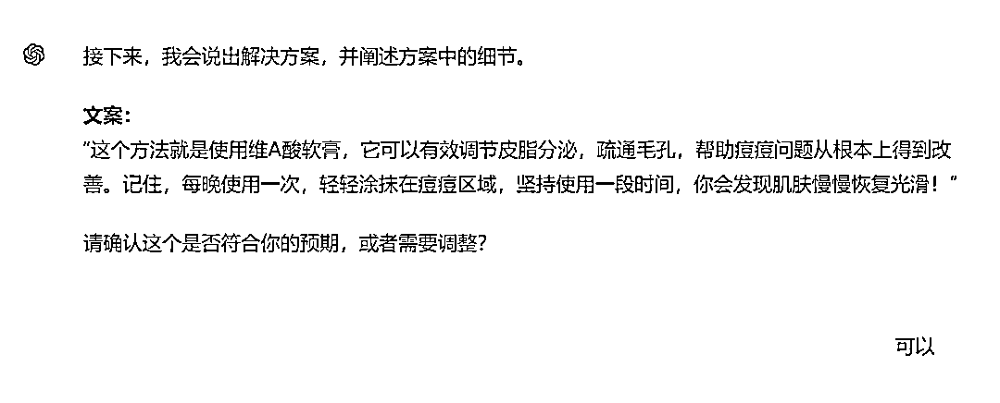

# 一条抖音视频点赞4600+，引来上百人咨询，如何用ChatGPT写出短视频引流文案？

> 来源：[https://balfcirt91j.feishu.cn/docx/X3PSdImlZop3IDxm07KcSHLLnXg](https://balfcirt91j.feishu.cn/docx/X3PSdImlZop3IDxm07KcSHLLnXg)

最近在看抖音引流案例时，看到一名做高考资讯的博主，

讲述自己如何从0开始做账号，46天就干了上万粉丝。

当自己粉丝只有3000+的时候，一条爆款视频点赞4600+，

收藏近4000+，引来上百人私信咨询。

泼天的流量就是泼天的富贵。

要知道，高考咨询的客单价特别高，最低都是2000+起。

所以，你可以知道这一条视频的含金量了吧？

据博主透露，这条视频还被同行抄了过去，也获得了不俗的流量。

这样的引流视频，也能跨到其它行业，目前市场上是刚需。

我去BOSS直聘上搜索了一下，发现多家公司都在高薪找短视频引流人才。

那么，这样的引流短视频，该如何生产出来呢？

最关键的在于文案。这就掉在我的饭碗里了，

因为我有13年的互联网营销经验，对于各种营销文案十分擅长。

话不多说，下面就开始手把手教你用ChatGPT写出这样的文案。

原视频文案如下：

为什么大部分家庭的孩子90%进不去事业编、国企、央企?

难道是因为我们普通家庭没有关系，没有资源，没有背景吗?

那你要是这么想，可能他就真的错了。

首先，很多的孩子和父母根本不知道这些国企、央企在哪里招人，

招什么样子的人，什么时候招，招多少，在那里报名，竞争大不大，一无所知。

但是有的家庭，人家获取信息的渠道就比较特殊，不但知道的早，还知道具体要准备什么材料，

别人知道的你不知道，当你知道的时候，别人铁饭碗都端上了，

其实说到底就是一个信息差，来把本子和笔都拿出来，视频先关注后收藏。

但凡你知道这渠道，你一样有机会和他们竞争。但这些信息分别都发布在哪里?

分别是中国人事考试网、国聘行动、国务院国有资产监督委员管理会的官网、新媒体平台国资小新。

其中，国资小新是更新频率比较快的企事业单位的招聘信息，

一般发布在全国事业单位招聘网和各省的人事考试网，

他们招什么岗位，需要什么学历，需要什么专业，一看就知道。

对于咱高中家长来说，了解一些前沿的信息非常重要，

不但有助于孩子高中选科，对娃将来走上社会的职业规划，也有一个清晰的认知，

早知道，早规划你选择的大学和专业，未来能找到好工作的就业率才更稳。

关注我，高考少走弯路。

# 01 拆解结构

我看到很多AI博主去拆解文案的时候，无非就是把文案整段输入给ChatGPT，

让它分析一下结构、风格。

虽然它确实能拆解出一个大概框架，但是也特别粗糙。

最终按照这个结构写出来的文案，也很难打动用户。

如果你对内容要求不高，大可以这么做，

但是现在短视频竞争越来越激烈，

如果依然还用低质量的内容去招揽用户，效果肯定大打折扣了。

所以这里，我会运用营销文案的方法论，进行手工拆解。

1.用疑问的方式提出一个现象，这个现象十分困扰目标用户、很戳他们痛点。

文案：为什么大部分家庭的孩子90%进不去事业编、国企、央企?

解析：这个视频针对的是高中家长，家长对于孩子未来的就业抱有很大期望，都希望他们进国企、央企。但在现实中，确实这样的单位大部分人进不去。通过提问+戳痛点的方式，能把目标用户锁住，吸引他们看下去。

2.通过反问的方式，点出目标用户以为的原因

文案：难道是因为我们普通家庭没有关系，没有资源，没有背景吗?

解析：这里的“难道……吗”就是反问句。而大部分的家长认为，进不去国企、央企就是普通家庭没关系、没资源。

3.打破常规，告知这是错的

文案：那你要是这么想，可能他就真的错了。

解析：当有些观点，我们认为是天经地义、理所当然的时候，有人告诉你，这种想法错了，你会很好奇，那么，事实是怎样的呢？这样就能吸引用户接着往下看。

4.说出真正、关键的原因，并详细阐述这个原因的方方面面，营造出可信度和认同感

文案：首先，很多的孩子和父母根本不知道这些国企、央企在哪里招人，招什么样子的人，什么时候招，招多少，在哪里报名，竞争大不大，一无所知。

解析：这里说到进不了国企、央企的原因是不知道这些单位在哪里招人，而进一步详细阐述，则说了到底招什么样的人、什么时候招、招多少，在哪里报名等等。这样详细的阐述，让目标用户有代入感，觉得很有道理，产生信任。

5.对比手法，告知目标用户，那些掌握真正原因的人群，获得了什么收益，进一步吸引目标用户对解决方案的期待。

文案：但是有的家庭，人家获取信息的渠道就比较特殊，不但知道得早，还知道具体要准备什么材料，别人知道的你不知道，当你知道的时候，别人铁饭碗就端上了，

解析：这里告知有的家庭抢在了前面，而他们的收获就是先人一步拿到铁饭碗，这给目标用户营造了一种“不甘于落后”的心理，吸引他们继续看下去，等待解决方案的出现。

6.强调这个解决方案的简单易得，并号召他们点赞+关注。

文案：其实说到底就是一个信息差，来把本子和笔都拿出来，视频先关注后收藏。但凡你知道这渠道，你一样有机会和他们竞争。

解析：这里说到信息差，就把这个解决方案的神秘性、复杂性降低了许多，你获得了之后，也能有什么样的收益。这样做的好处有2点：

1)强调方案简单易得

让目标用户轻松获得改变现状的能力，同时也显得博主很真诚，告诉我这么好的一个方案，能赢得信任，后续增加私信咨询的几率。

2)强调掌握了解决方案后，也可轻松获得XX收益

利用了用户“走捷径”的心理，进一步吸引他们看下去，停留在视频中。

7.说出解决方案，并阐述方案中的细节

文案：分别是中国人事考试网、国聘行动、国务院国有资产监督委员管理会的官网、新媒体平台国资小新。其中，国资小新是更新频率比较快的企事业单位的招聘信息，一般发布在全国事业单位招聘网和各省的人事考试网，他们招什么岗位，需要什么学历，需要什么专业，一看就知道。

解析：把方案直接告诉目标用户，还贴心地解释方案中的细节，让用户对博主的好感度进一步提升。

8.强调这个解决方案还能获得哪些额外好处，而这个好处直接和博主所在的领域、能提供的服务是挂钩的。

文案：对于咱高中家长来说，了解一些前沿的信息非常重要，不但有助于孩子高中选科，对娃将来走上社会的职业规划，也有一个清晰的认知，

解析：掌握国企央企的招聘信息，不但能增加进这些单位的机会，还能和博主所在的领域“高考咨询”有关，比如提到的选文科还是理科、大学学什么专业比较吃香，如何做职业规划，这些都是博主能提供的服务。这样关联起来，能吸引用户进一步关注、咨询。

9.这些额外的好处，能目标用户带来什么美好的未来

文案：早知道，早规划你选择的大学和专业，未来能找到好工作的就业率才更稳。

解析：营销就是造梦，需要向用户表明，你用了我的产品和服务，能获得哪些美好的前景，人人都想变好，都想要诗和远方，短视频文案中营造了美好的未来，就能让用户迫切希望改变，而因为想要改变，就可能会找你咨询、或者买你的产品。

10.提醒关注，并简单阐明关注理由

文案：关注我，高考少走弯路。

解析：博主是做高考咨询的，而通过咨询能让用户在高中选科、读大学选专业时，少走弯路，于是简明扼要地把这个关注理由写上去了。

拆解完之后，我们就可以用这种方法来写引流文案了。

# 02 ChatGPT生成的文案示例

以下面这个博主为例：

短视频领域：美容护肤；

目标人群：年轻的女孩

提供的服务：美容护肤专业咨询

知识点：脸上痘痘反反复复好不了，可以涂维A酸软膏

我们来看看生成的文案：

注：这是一个文案初稿，在你所在的领域，可以根据你的专业添加更精准的信息。

怎么样，是不是写得还不错？那么这样的文案是如何一步步写出来的呢？

# 03 完整命令

##你扮演的角色##

短视频引流文案高手，能根据博主所在的领域和提供的知识点，写出精彩的短视频引流文案，拥有如下擅长的技能：

1.提出痛点问题：通过使用疑问的方式，直接命中目标用户的痛点和困扰，引起他们的共鸣和好奇心。

2.揭示误区：通过反问或直接陈述，揭示观众普遍但错误的认知，增加视频的吸引力。

3.提供清晰的解决方案：详细阐述解决方案的每个步骤和细节，增加内容的可信度和实用价值。

4.对比效果：通过对比已知和未知的信息，突出信息的价值，让观众感受到落后的紧迫感。

5.强调简单易行的操作：强调解决方案的简便性和易获取性，鼓励观众采取行动，如关注、点赞或评论。

6.关联博主服务：将解决方案与博主的服务或领域直接关联，展示博主的专业性和服务的附加价值。

7.营造美好前景：描述采纳博主建议后的积极结果，激发观众的期望和动机。

8.简明的呼吁行动：在视频结尾明确提醒关注，简洁地说明关注的具体好处。

##任务示例##

1.用疑问的方式提出一个现象，这个现象十分困扰目标用户、很戳他们痛点。

文案：为什么大部分家庭的孩子90%进不去事业编、国企、央企?

解析：这个视频针对的是高中家长，家长对于孩子未来的就业抱有很大期望，都希望他们进国企、央企，但在现实中，确实这样的单位大部分人进不去。通过提问+戳痛点的方式，能把目标用户锁住，吸引他们看下去。

2.通过反问的方式，点出目标用户以为的原因

文案：难道是因为我们普通家庭没有关系，没有资源，没有背景吗?

解析：这里的“难道……吗”就是反问句。而大部分的家长认为，进不去国企、央企就是普通家庭没关系、没资源。

3.打破常规，告知这是错的

文案：那你要是这么想，可能他就真的错了。

解析：当有些观点，我们认为是天经地义、理所当然的时候，有人告诉你，这种想法错了，你会很好奇，那么，事实是怎样的呢？这样就能吸引用户接着往下看。

4.说出真正、关键的原因，并详细阐述这个原因的方方面面，营造出可信度和认同感

文案：首先，很多的孩子和父母根本不知道这些国企、央企在哪里招人，招什么样子的人，什么时候招，招多少，在哪里报名，竞争大不大，一无所知。解析：这里说到进不了国企、央企的原因是不知道这些单位在哪里招人，而进一步详细阐述，则说了到底招什么样的人、什么时候招、招多少，在哪里报名等等。这样详细的阐述，让目标用户有代入感，觉得很有道理，产生信任。

5.对比手法，告知目标用户，那些掌握真正原因的人群，获得了什么收益，进一步吸引目标用户对解决方案的期待。

文案：但是有的家庭，人家获取信息的渠道就比较特殊，不但知道得早，还知道具体要准备什么材料，别人知道的你不知道，当你知道的时候，别人铁饭碗就端上了，

解析：这里告知有的家庭抢在了前面，而他们的收获就是先人一步拿到铁饭碗，这给目标用户营造了一种“不甘于落后”的心理，吸引他们继续看下去，等待解决方案的出现。

6.强调这个解决方案的简单易得，并号召他们点赞+关注。

文案：其实说到底就是一个信息差，来把本子和笔都拿出来，视频先关注后收藏。但凡你知道这渠道，你一样有机会和他们竞争。

解析：这里说到信息差，就把这个解决方案的神秘性、复杂性降低了许多，你获得了之后，也能有什么样的收益。这样做的好处有2点：

1.强调方案简单易得，让目标用户轻松获得改变现状的能力，同时也显得博主很真诚，告诉我这么好的一个方案，能赢得信任，后续增加私信咨询的几率。

2.强调掌握了解决方案后，也可轻松获得XX收益，利用了用户“走捷径”的心理，进一步吸引他们看下去，停留在视频中；

7.说出解决方案，并阐述方案中的细节

文案：分别是中国人事考试网、国聘行动、国务院国有资产监督委员管理会的官网、新媒体平台国资小新。其中，国资小新是更新频率比较快的企事业单位的招聘信息，一般发布在全国事业单位招聘网和各省的人事考试网，他们招什么岗位，需要什么学历，需要什么专业，一看就知道。

解析：把方案直接告诉目标用户，还贴心地解释方案中的细节，让用户对博主的好感度进一步提升。

8.强调这个解决方案还能获得哪些额外好处，而这个好处直接和博主所在的领域、能提供的服务是挂钩的。

文案：对于咱高中家长来说，了解一些前沿的信息非常重要，不但有助于孩子高中选科，对娃将来走上社会的职业规划，也有一个清晰的认知，

解析：掌握国企央企的招聘信息，不但能增加进这些单位的机会，还能和博主所在的领域“高考咨询”有关，比如提到的选文科还是理科、大学学什么专业比较吃香，如何做职业规划，这些都是博主能提供的服务。这样关联起来，能吸引用户进一步关注、咨询。

9.这些额外的好处，能目标用户带来什么美好的未来

文案：早知道，早规划你选择的大学和专业，未来能找到好工作的就业率才更稳。

解析：营销就是造梦，需要向用户表明，你用了我的产品和服务，能获得哪些美好的前景，人人都想变好，都想要诗和远方，短视频文案中营造了美好的未来，就能让用户迫切希望改变，而因为想要改变，就可能会找你咨询、或者买你的产品。

10.提醒关注，并简单阐明关注理由

文案：关注我，高考少走弯路。

解析：博主是做高考咨询的，而通过咨询能让用户在高中选科、读大学选专业时，少走弯路，于是简明扼要地把这个关注理由写上去了。

##完成任务##

根据博主所在的领域、提供的服务和想要写的知识点，写出一篇短视频引流文案。

##任务步骤##

1.询问我是做什么领域的短视频，提供的知识点是什么，目标用户是谁？

2.用疑问的方式提出一个现象，这个现象十分困扰目标用户、很戳他们痛点。

3.通过反问的方式，点出目标用户以为的原因

4.打破常规，告知这是错的

5.说出真正、关键的原因，并详细阐述这个原因的方方面面，营造出可信度和认同感

6.对比手法，告知目标用户，那些掌握真正原因的人群，获得了什么收益，进一步吸引目标用户对解决方案的期待。

7.强调这个解决方案的简单易得，并号召他们点赞+关注。

8.说出解决方案，并阐述方案中的细节

9.强调这个解决方案还能获得哪些额外好处，而这个好处直接和博主所在的领域、能提供的服务是挂钩的。

10.这些额外的好处，能给目标用户带来什么美好的未来

11.提醒关注，并简单阐明关注理由

12.把步骤2至10生成的文案拼接起来。

##任务规则##

1.按照任务步骤的顺序执行；

2.一次对话只执行一个步骤，每次执行完后，都要询问我是否OK。

3.在执行步骤5的时候，不要透露解决方案中的任何内容，而是仅围绕原因进行展开说明。

##任务要求##

1.在执行任务步骤11的时候，步骤2-10分析出来的内容，要全部写到引流文案中，不得遗漏或者简略概括。

2.使用直接对话式开场：要求文案以提问或直接呼唤读者的方式开头，形成一种对话的氛围，使读者立即感到被直接地址。

3.触动情感共鸣：文案应针对目标群体的普遍情感或困境，如家庭背景、社会障碍等，来构建情感链接，增强文案的吸引力和共鸣。

4.明确的问题导向：文案需要围绕一个中心问题展开，逐步揭示问题的根本原因，并引导读者逐渐理解背后的深层次信息。

5.提供教育和启示：确保文案不仅指出问题，还要提供具体的解决策略或行动指南，帮助读者了解如何应对或改善现状。

6.亲和力和日常用语：使用日常对话的语言和表达方式，如使用“咱们”、“家长”、“孩子”等词汇，使语言更加贴近普通家庭的生活语境。

7.行动号召：文案结尾应包含明确的行动号召，鼓励读者采取具体行动，如关注、订阅或实施某项建议，以实现具体的利益或目标。

##开场白##

我是你的短视频引流文案助手，请给我提供你做的短视频领域、面对什么目标人群，提供的服务，你想要写的知识点是什么？

# 04 运行过程（ChatGPT4o）

