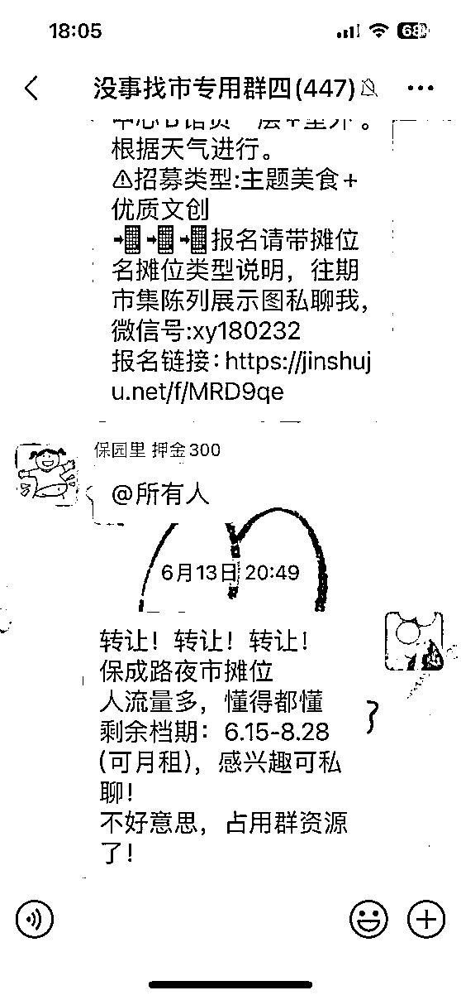

# 零零后裸辞摆摊如何一天赚回半个月工资-拆解复盘

> 来源：[https://i0megxkkigz.feishu.cn/docx/Y6nPdMay8oOjMhxgPBec0G9nnPc](https://i0megxkkigz.feishu.cn/docx/Y6nPdMay8oOjMhxgPBec0G9nnPc)

大家好，我是零零后紫馨，去年毕业后工作到今年四月底，想趁着年轻多试试，探索更多的可能性，开始了漆扇摆摊。生财大佬太多太多啦，本着利他，真诚的心态来和大家分享我的经验，希望能给大家带来一点点帮助～一起生财有术

一天利润：摊位一1038.4＋摊位二810＋摊位三664-310（团扇）-80（摊位费）-【46.95（大漆）＋12.5（一次性手套）＋8.79（印章）＋14（桌布）＋29.29（广告布）＋20.45（展示架）＋37.37（中号盆）＋25（吸纸巾）】×3=1539.35

项目概述

非遗漆扇，全称非物质文化遗产漆扇，既是一次传统手工艺品与现代市场的巧妙融合，也是一场生动的文化体验活动。这类扇子不仅具有实用价值，作为纳凉工具，更因其精美的艺术性、独特的工艺技巧以及深厚的历史文化底蕴，被视为一种极具收藏价值与艺术欣赏价值的传统手工艺品。通过非遗漆扇的制作与展示，可以传承和弘扬中国传统漆艺，让更多人了解并珍视这份非物质文化遗产。

项目来源和选择理由

可能因为自己平常搜搞钱的信息比较多，刷小红书一个偶然的契机，刷到夏季摆摊适合卖手工现榨橙汁与非遗漆扇的一个视频，但站在客户角度思考觉得漆扇更新颖，刚好马上到夏季，漆扇既美观又实用，主打的自己体验自己做，便将品定为漆扇，随即在生财搜漆扇，发现有漆扇的风向标，这波热度得赶上，更明确了做漆扇的信念

市场调研

非遗漆扇在小红书，抖音，视频号上确实很火，有很高的点赞量与评论，可放进现实中又情况如何呢？因为我现在是在武汉，便先就近考察下武汉是否已经开始有漆扇了？已有的话生意如何，是否值得投入？在各大平台搜武汉漆扇，江汉路地铁站刚好有一家，她家也有小红书号，第二天中午就去江汉路，先去付费做了一把，学习下手法，观察摆台，刚好有一家咖啡店，我便找一个方便观察的位置从她家开摆到收摊，一波接一波的人流，几乎经过10个人，就会有8个人去买，每次做围观的人也很多。欧克，漆扇可以搞，晚上回去就开始采购物料

物料准备

在平台搜索漆扇材料，比较价格，评论选优质渠道，筛选后我1:1复制。然鹅遇到了一个大问题，我在1688上进团扇时，因为平台有着超100有优惠，于是我采购了100，结果自己试的时候上色不明显，扇子还裂缝，给我当头一棒，第二天都要出摊了，结果我的材料出现了问题，在重新买已然来不及了。懊悔之前没意义，得想着怎么解决，脑海中浮现了三个方案 一先在1688上搜有没有武汉的供应商，终于找到一家在汉阳国博那儿，结果客服说不是从武汉发货；二在小红书，抖音上搜下漆扇进货，武汉同城；三是汉正街找不到的话就去漆扇同行那儿进货，妈呀，凭着搜商终于看到一个账号是线下采购的，然后我主动询问下得知汉正街有批发，第二天早上就去一家一家看，一家一家问，终于找到了四家，这次吸取教训，先一家购买一把，看看效果，拿着四把回家先实验一遍，果不其然其中有个贵三毛的效果还差，最终筛选了一个再去汉正街批发，然后下午正常出摊

漆料有两种，一种是便宜的腰果漆，但是有毒，一种是大漆，无毒安全性更高，首先得对得起自己的良心，所以进货的时候毫不犹豫的买大漆

市集信息

之前没摆过，也不知道怎么加入，还好现在是互联网时代，其实很多信息网上都可以搜到，在平台上搜索“武汉摆摊”“武汉市集”有很多招商信息，便扫码进群，然后发送作品报名。还有个渠道，有些入行比较早的人，他们肯定也有群，我怀着利他的心态去跟他们聊天，互相分享市集信息，互相推荐另一方不在的群聊（截图）。你了解到的市集信息越多，就能比同类的先报名，不错过有活动的好时机，比如五月份的青山江滩那儿有国际沙排比赛，知悉后马上报名，有活动的加持就有人流，有人流的话就有生意。

自己在四月底摆过，是可以赚到钱的（最小MVP）为了赶上五一，六一，端午节假日的风口，准备再加两个摊位(矩阵化)，全程复制我的搞法，这样自己通过发兼职信息，招到一个，还有一个自己表妹，整理好话术，培训下手法，熟能生巧，后面顾客都觉得是美术生哈哈哈

风险管控

保成路夜市在汉口很有人气，女性与年轻人居多，这与漆扇的用户群体是一致的，提前考察了下，目前只有一家漆扇且位置比较偏，为了赶上六一，端午，询问夜市办负责人，加了两个摊位老板的微信，等摊位空出来后我们再搬进来，终于有空一个一米的摊位，只能季租3600，确定好后准备摊车，当时在咸鱼，淘宝看了很多摊车，基本在1000左右可能还不太扎实，通过问我爸摊车制作怎么搞，他通过一个熟人知道古田四路那里有个二手市场有卖的，从框架，底座，KT版全程自己搞。本钱赚回来了，还小赚了点，出摊的时候就下雨，我也拴Q了，看新闻，看天气了解到后面是梅雨季节，不出摊就固定损失40/天，剩下两个月2400也是支出，于是在之前加入的市集群里发布信息，通过沟通筛选了几个，想着尽快把这个摊租出去，便制造已经有人特别有意愿租的假象，挺有效果的，从发布信息到成交签合同只用了三天

延伸思考

1没有进行线上引流，可以直播做漆扇然后引导下单

2没有拍摄视频经营账号，可以与靠谱的供应商合作，分销材料拿提成

3可以用优惠或赠送的方式促使顾客扫码加微信，经营好粉丝群，朋友圈，老顾客可以线上下单

4与活动方合作，承接团建体验，研学活动

收获

1获取有效的信息很值钱，比如A地方有活动有招商，你刚好赶上时机，比信息堵塞守在一个地方更灵活，更高效

2输送情绪价值很重要，这点是在摆摊的过程中慢慢悟出来的，做出来的每个扇子我都会夸一遍，从颜色搭配上升到意境，一半天成，一般人成，即便是顾客觉得做的不是很好看，情绪价值给到位，顾客还是会买单

3摆摊两个最关键的点是选址和选品，人流高的地方品不行也白搭，品受欢迎没人买单也不行

4心态调整很重要，不是每天都能破千，很有可能你守到晚上正收摊的时候才开第一单，也有概率今天挂零，摆正好心态就好了，因为个别几天不能代表这个月的整体情况，焦虑内耗也没啥实际作用，遇到问题就去解决问题

5灵活变化

A变化价格，在江汉路的顾客群体多是大学生，年轻人，消费力度并不高，但是在华发的顾客群体多是附近的居民家长，商场环绕，消费力度高，在华发摆的前两天价格与之前定价一样，但是每天就四五把，晚上回去思考，同样的数量如果把单价提高，那么我的利润是更多的，那么我的利润是更多的，于是第三天开始把原来的29→39，折扇39→59，果不其然，营业额明显比前两天多

B变化地方，第一次摆是在三环外的商场，那天只卖了两把，可是之前在江汉路的漆扇还是挺受欢迎的，那么不是品的问题，就在回去的车上跟市集负责人发消息，第二天换到二环的商场内，渐渐有了起色

## 第一次写生财的帖子，如有写的不好的地方，还请各位圈友多多指教，感恩~