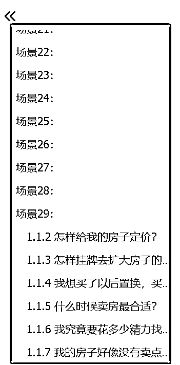

# 留学从业者转行去「大蓝海」，2个月卖出1个小目标的产品❗️（第一集）

> 来源：[https://ht16ej1tui.feishu.cn/docx/YY8ad4fYXo9WnWx0KKfcVp9gnzb](https://ht16ej1tui.feishu.cn/docx/YY8ad4fYXo9WnWx0KKfcVp9gnzb)

2024年，这些赛道/岗位的人已经业绩下滑，或者即将面临下滑。

他们是【留学、金融、语言培训、健身、宠物（尤其是猫）、设计、奢侈品、传媒、音乐、艺术、戏剧、咖啡、做发型和染色的美发馆（护发/白转黑除外）、动刀子的医美（不用动刀子的除外）、酒吧、ktv、电影院、高尔夫、轻食、卖得死贵死贵的面包店】等等。

这类赛道，统称为男剪女布赛道，在接下来的10年，会继续下滑。

如果你正处在以上赛道，看到这里，你要及时转行。

我会在本文向你揭露：

1）这些赛道下滑的原因

2）我们该去做什么赛道

你好，我是22-23年在小红书留学赛道和合伙人陈铭Ivy做了2700万营收的珍妮子，我们及时转行去了超高客单赛道。

感兴趣的老板可以看我们往期帖子：

1️⃣https://t.zsxq.com/DT1SJ

2️⃣https://t.zsxq.com/aPL7f

3️⃣https://t.zsxq.com/XXl6X

4️⃣https://t.zsxq.com/Fvvr8

5️⃣https://t.zsxq.com/LhyXR

6️⃣https://t.zsxq.com/2Wg9U

7️⃣https://t.zsxq.com/49u9r

8️⃣https://t.zsxq.com/r7CMz

在这2个月里，Ivy和我刚转行进来，公司共签了11套房，其中7套已经卖出去，总金额近1个亿，分别是1套2000+，1套800+，1套700+，1套4000+，1套200+，一套1400+，一套400+。4套正在帮房东找精准客户。

之前我曾因为写过【老板避雷手册】和【小红书留学赛道趋势分析】而突然爆火。

在那之后，很多留学同行找到我，说自己遇到了【业绩下滑】的情况。

有的是把运营团队全部裁员；有的是死死挣扎到24年8月，把运营人员裁到只剩一个；有的是关闭公司，转行去了别的行业。还有的老板派手里的大将，经常花大几万去上自媒体课程，并且开始亲自上场，做个人ip，拍摄视频，讲解留学赛道的干货。

但这一切，不过是雪崩来临之前的前兆。无论再怎么挽救，雪依旧会崩。

因为全世界的人，都因为口罩这段时间，而“石化”了。此处可以理解为：

不再像20年之前一样，追寻享乐。

不再像20年之前一样，热爱旅游，热爱迁徙，热爱出差。

不再像20年之前一样，追寻中产的快乐，开豪车，买名表，买奢侈品，在脸上动刀子搞大型yi美，送孩子上国际学校。

他们开始：

追寻平平淡淡、看得见的稳定生活。

开始喜欢宅在家里，或者就留在当地。而不是全球各地到处跑。

开始没那么追求物质欲望，喜欢存钱，不再为“自己想要，但不那么需要”的东西付费。

中产开始追求性价比，以前男剪女布赛道中“为溢价买单”这种常有的事情，现在很少发生了，因为中产不买账了。

底层的人一直在老实干活，有些人反而趁口罩期间富裕起来了。但这群人一般都不是男剪女布，他们闷声发财，所以大家观察不到：“其实财富不是消失了，而是转移了”。

早就有一部分人，赚得盆满钵满，只是这部分人，不爱在网络上发声。

就像【京dong、淘bao的业绩在下滑，比不上拼duoduo】，一个道理。

人们只是把打给淘b和京d的钱，转移给了拼dd。

我在前面提到的那些男剪女布赛道的人，他们之所以收入下滑，是因为他们的钱，被石头赛道&石化的男剪女布赚走了，包括：【收纳师、上门做饭阿姨、正骨医生、做发质保养的老板娘、中医理疗师、懂调理体质的营养师、上门私教老师、好吃便宜又卫生&自己做包子的老板娘、科技公司等等】。

如果继续细分，那么钱还会被这群人赚走：

【人工智能工程技术人员、物联网工程技术人员、大数据工程技术人员、云计算工程技术人员、农业经理人、物联网安装调试员、智能制造工程技术人员、虚拟现实工程技术人员、电器电子产品环保检测员、康复辅助技术咨询师、集成电路工程技术人员、食品安全管理师、电子数据取证分析师、碳排放管理员、数字化解决方案设计师、口腔卫生技师、有色金属现货交易员】等等。

回到前言，在几乎所有的留学同行，要么拼命烧聚光投放费，半个月烧掉10万；要么拼命卷运营，发现也卷不出啥水花；要么死死挣扎，面临公司倒闭危机时，

我和我的合伙人Ivy，已经于2023年4月开始，就在悄悄转行，并且早已铺路。

所以，当今年，很多人业绩下滑，公司开不下去，给员工降薪的时候，我们这个创业三年的小公司，业绩稳步增长，摆脱了“创业公司往往三年倒闭”的魔咒。

以下是本文的细分目录，无论你是否在上海，这篇文章，都会对你有帮助。

1.  珍妮和Ivy，从留学行业转行后，在做什么？

1.  我们正在做的，是一个什么样的赛道？

1.  这个业务的优劣势

1.  为什么两年做了2700万，却只在这个项目上停留？

1.  如果你人在上海，欢迎加入我们。

# 珍妮和Ivy，从留学行业转行后，在做什么？

最开始，我们只是做代运营，只服务客单价在上万的老板，并且收老板们2万/月的基础服务费，从签单额中抽取提成。通过收取较低的服务费，借此发现新的高客单好项目，技术入股。

这样的高客单好项目，是Ivy严格筛选的。有的项目虽然客单价也在上万，但Ivy觉得增长空间不够，所以就算老板要给我们打钱，要找我们续费，我们也委婉拒绝。因为代运营不是我们的主要赚钱途径，而是我们吸引高客单老板找到我们，借此让我们技术入股的方式。

因为我们要找的，是下一个，能快速做到2700万营收的项目。

结果我们在今年找到了，

这个项目，是给卖房的房东提供卖房营销咨询，陪跑+全案落地。

对于很多房东来说，把自己价值几百万甚至上千万的房产卖掉，很可能是他一生中能接触到的最大的几笔交易之一。

前来买房的客户，理论上来说，可能是房东能接触到的最大客户。

然而很多人面对自己最大的交易以及最大的客户时，没有应对经验，没有销售技巧，这样很有可能少卖几十万，甚至根本卖不掉。

房东急需一个专业的团队，为他提供卖房全案服务。

很有意思的是，这两年房产经纪这个行业里，房子越来越难卖，但没有中介去思考：【如何去更好的服务极其有需求的房东】，却都在【抢着服务买家。】

这是一个刚出现的蓝海市场，且目前没有专业靠谱的公司去满足。

所以我们在没有任何IP打造、纯公域引流、靠小红书几个新起小号的情况下，两个月获取客资上千组，成功变现7位数。

# 我们正在做的，是一个什么样的赛道？

可能有人会和我说：珍妮，你这不就是房产中介吗，我做过，可累，我不想做。

是的，如果只是房产中介，那你一定很难。

可我接下来要说的是【卖方代理】，注意，是代理。他不是【传统中介】哦。

卖方代理是单边代理的一种类型，单边代理模式源自美国，在全球已经逐渐成熟&产业化。这个模式使得房产经纪人拥有了独立的立场。

卖方代理指的是：只代理【找我们帮忙卖房子】的房东本人。我们完全站在房东的角度，维护房东的权益，为房东做房屋营销策划、全城营销推广、销售反馈，帮助房东快速将房屋卖出。

（珍妮小声bb:就是不维护买家利益的意思）

而做【卖方代理】和做【传统中介】相比，最大的好处是：

1）卖方代理人可自由支配工作时间，按自己的节奏和时间安排工作，还可以拿到较高佣金。不像传统中介，只能在特定时间开展业务，拿到的佣金还得分公司大部分。

2）卖方代理人可以为客户提供个性化&全方位的服务，因为他们不再受制于公司的流程和规定，可以根据客户需求灵活地提供服务。

3）卖方代理人是先收客户咨询费，然后才开始作业，因此有足够的时间，打磨自己的业务能力，使自己的能力和收入同步上升。而不是像传统中介一样，即使没有先收费用，也要开始帮房东推广房源，以至于传统中介总是做无用功，最后一年能卖出1-2套房就不错了。

作为一名卖方代理人，我们需要用自己在房产行业的【专业能力和行业资源】，为房东提供卖房思路梳理及落地执行，帮房东把卖房过程变得更顺利。

举个例子：

从【专业能力】而言：

我们需要掌握的知识，就有

1）如何识别客户需求，甚至及时和客户断舍离

有的客户会掩藏自己的真实需求，他们不仅会浪费我们时间，还会让我们亏本。

2）做市场调查

很多信息并不透明，又或者口耳相传的信息，其实是错的。

3）提取房源卖点

不是只靠房东本人就能梳理出来的，就算问中介，也不一定能拿到真实信息，还要去跟进往期带看客户，才能综合找出卖点。

4）设计房源宣传页

宣传页上要放哪些信息？哪些信息不能放？发朋友圈、微信群、公众号、小红书、抖音和视频号的宣传信息，要怎样排版&怎样设计核心信息，才有可能出爆款、最快扩大曝光量？

5）团结中介，让他们愿意把我们的房子变成主推，加大房源带看量

怎样找到有我们目标买家的中介？走访50个中介，可能只有5家中介会和我们一块卖房，怎样找到核心中介？怎样和核心店长搞好关系？如果我们的房子很烂，怎样调整，可以让中介愿意相信我们的房子很好，并且帮我们主推？

6）利用自媒体，最有效的曝光房源，而不是做无用功

不同的信息，应该优先放在哪些平台？标题、封面、标签、地理定位，都怎么设置？发布时间选什么时候合适？不同类型的房子，怎样拍摄，效果最好？用什么音效？是做口播稿还是采访稿？

7）在谈判桌上帮助房东，避免房东被中介和买家砍价

举个例子：

买家同时看中了我们房东（A房东）和别人家房东（B房东）的房子。

甲品牌的中介公司代理了B房东的房子，他们想让买家买B房东的房子，而不是买我们房东的房子，他们安排了假客户来套路A房东。我们怎么让A房东相信：“这是一个假客户？”我们怎样设计商业计谋，去扰乱B房东的心态，让他不愿意卖房子给这位买家？

乙品牌的中介公司，为了能撮合成交，快速拿佣金，把我们房东的房子从770万砍到710万，我们要怎样套路买家，并且给房东提供买家的心态信息，让房东以750万甚至770万的价格卖出？

8）扰乱买家的心理，让他不再砍价、并且激情之下-下定金，买咱们的房子

买家还是想砍我们房东的价格，我们要怎样判断：我们的房子，就是这个买家【同样预算里】能买到的最好的房子。

要怎样让买家相信我们的建议，并且马上下定金？

9）处理二手房可能涉及到的法律问题、金融问题

等等。

以【如何识别客户需求，甚至及时和客户断舍离】为例，

曾经有个房东，和我们聊得特别好，人也很健谈的样子，那时候我们线上销售环节还不太成熟，就想着【在没有收取前置费用】的情况下，先去【房东家里看看房子】。

结果小助手去了两次，一来一回本身就耗时，到了之后，房东找我们拉各种家长里短，就是不付钱，在我们帮他找了一些数据后，他给我们发了150块的红包。。于是我们放弃了这个房东。

并且决定：如果房东不能先支付前置费用，我们是绝对不会去房东家里看房的。

后来这个房东，又在线上和线下各种咨询，绕来绕去，还是找到了我们。这时候，我们依旧不接单。因为接待一个错误的客户，不仅会浪费精力，而且很有可能要赔钱。

也因为各种各样的血泪史，我们不仅学会了从线上聊天记录中识别筛选客户，还学会了避免在线下见面时，被人浪费精力。

其次，我们以：

【做市场调查】为例，

这时候需要调查的就有：

1）房源本身的卖点；（不是只靠房东口头说就能找出来的）

2）房东卖房的心态；（很多房东一开始会掩藏自己的真实心态，因为一开始房东很难做到百分百信任我们。所以我们需要靠不断观察，去发现他的真实心态）

3）小区哪一栋楼哪个户型好，他们家的装修怎么样？用的什么牌子？对方是因为什么原因想卖房？到底急不急着卖房？（一旦急着卖房，就可能把自己房子调到最高性价比，甚至愿意砸盘卖房。这时候，就会对我们代理的房东不利。）

4）这个小区和隔壁小区，甚至整个板块同价位的小区相比，有什么优势？开发商是谁？哪个小区的物业最负责，为什么？

5）买这个板块的买家，一般是出于什么原因买房？他们年龄多大、是否已婚、可能从事哪些职业？他们可能在哪些商圈工作？我们要去哪些板块找到他们？是否需要通过自媒体，跨城市吸引到他们来买房？

6）这个板块的房子，和其他版块的房子相比，优势在哪？

我们的买家除了可能看中这个板块的房子，还可能看中哪些板块的房？

其他竞品所在的板块里，哪些房子挂牌价和我们差不多？

他们的优势和劣势是什么？

如果出现有一家成交价特别低，背后的原因是什么？

我们要怎样和买家解释清楚，以免让他觉得自己可以用同样低的价格捡漏？【进而对我们代理的房东不利】

以上是两个比较浅显的例子。

我们再来看看，成为卖方代理人，所需要具备的行业资源:

举个例子，如果是为了快速知道：会买我们房子的买家，会出现在哪个商圈？平时住在哪里？我们就要找到这个商圈的所有中介。并且统计该商圈哪些中介的市场占有率最高，然后重点联系市占率高的中介。

而这些中介里，也不是所有人都会愿意推我们这套房子，甚至可能有中介会想：

1）你这套房子太破了，推不出去，成交无望，别来烦我。

2）我为什么要帮你卖房？就为了我自己拿1%，你也拿1%？有没有办法我一个人把2%全赚走？凭什么你该赚走1%？我宁愿我只拿0.5%，我也不想你去赚到这1%。

3）我愿意帮你，但我同事不愿意，所以你的房子带看量还是上不去。

而买卖二手房，又会涉及到税务、金融贷款问题，甚至可能涉及到重新装修、找收纳师等问题。

同样是金融贷款业务，我们能帮房东省钱的同时，我们自己还能多赚钱，但其他人就做不到。

同样是重新装修，房东如果找了A团队出设计图并且重新装修，就会被坑出血泪。但如果找了B团队，就可以用划算的价格让自己的房子变了个人，堪比做了医美整rong。

以上，都是做卖方代理人时，可能遇到的，大大小小的问题。这也需要我们具备极强的个人能力。

# 这个业务的优劣势

#### 【卖方代理】这个职业，有什么优势？

##### 优势1：这是一个上升赛道。

过去几十年，卖房子是不难的，当房东想卖房时，小区门口随便找中介挂个牌就能卖掉。

而现在，越来越多的房子卖不掉。

当和自家房源差不多的竞争对手太多、买家持币观望&不一定主动咨询，而是只在刷自媒体房产广告的情况下，中介手里的买家就会显得有限，这时候，中介会误以为“市场上买家特别少”，进而帮着买家砍房东的房价，以此促进成交。房东因此不得不遭受屠龙刀。

甚至有的房东，因为同小区挂牌房源又有几十上百套，他家房子又平平无奇，于是他的房子就会面临雪藏，过了一两年都卖不出去。

但是，大部分的房东，都不希望自己房子太慢卖出，谁都希望3-6个月内能把房子卖掉，而不是拖一两年，甚至三四年。

于是，房东开始需要【卖方代理人】，卖方代理人不仅能帮房东包装美化宣传房子、提高房源曝光量、找到最高出价的客户、还能帮房东在谈判桌上谈判，避免房东因为心态不稳，而贱卖房源。

而【卖方代理人】这个需求，在未来几十年，只会越来越被市场需要。

那么，越来越被市场需要，还体现在哪些细节里呢？

房子和老婆一样，对于大部分老百姓来说，是没法随便换的，所以珍妮以“婚姻”举例：

70-80年代的时候，女人们一般都没有化妆品，往往都是素面朝天的，那时候的女人也不怎么注重保养，也不怎么去外地打工，大城市还没有出现“男少女多”的情况，所以在那个年代，在当地找一个对象是比较简单的。因为漂亮的村花特别少，大部分竞争对手都和自己差不多。

但是现在不一样了，很多女人都会化妆，而且会做医美，让自己永远保持年轻的状态。

这时候，如果有个女人不化妆、不做医美、还处在男少女多的一线城市，不管是学历、性格、智商、情商又都平平无奇，社交圈子窄，天天都要打工，回家还要加班的话，

哪怕去相亲，她都要给婚恋机构交上万服务费的（就有这么贵）。

而一线城市的男人，就可以不用交钱，因为一线城市的婚恋情况就是男少女多。（农村是男多女少。）

注：

此处讨论的是去婚恋机构找长择对象，一线城市的女人才需要付费。

如果是去酒吧找短期对象，往往是男人占女人便宜，此时是男人付费、女人免费。

换到房产上也是一个道理，现在上海有些小区的房子，

慢慢开始被卖方代理人所代理（女人开始化妆&做医美），

但还有很多小区的房子，没有被卖方代理人代理（女人素面朝天），

甚至这些小区的挂牌房源特别多（一线城市女人巨多，竞争对手太多），

可是特别出彩的房源很少，绝大部分房源都是平平无奇的（刘亦fei特别少，绝大部分女人的长相都是当不了明星的），

所以，在未来的一线城市，如果还有房东，不找卖方代理人，他的房子又没有特别出彩，他又没有时间知道优质客户在哪里，也没有精力把自己的房源曝光给更多优质客户，他就一定非常难卖出去或者很难卖出好价格，或者侥幸卖出，但是被人屠龙刀。

（还有女人，在男少女多的城市，不会化妆，不医美，长相智商情商学历全都普普通通，不是刘亦fei，又天天打工，没有时间社交，也不知道什么样的男人才是值得嫁的好男人，就一定很难进入一段好婚姻，可能会嫁给渣男。）

尤其是有硬伤的房子（比如户型有问题，房子泡过水），在以上buff叠满的情况下，如果还没有卖方代理人，完全不可能卖出去。（好比：脾气特别臭/长相特别差/有过大型感情黑历史的女人，在以上buff叠满的情况下，如果不能潜下心来修炼学习情感知识，几乎完全不可能进入好的婚姻。）

而这时候，被卖方代理人代理的房子的优势就出现了：房子更整洁，装修舒适，价钱合理（不是笋盘价，可能没法被买家严重大砍价，但也没有价格极其浮夸让人觉得是割韭菜），房子的所有优点和缺点都被代理人明明白白扒出来了，这个小区的用户素质也都如实告知，买家就会更愿意买这样一套房。

因为这好比：在男少女多的一线城市，有一个女生，打扮得更舒适，性格更好，虽然她要的彩礼钱是10万，而不是2万，但是彩礼钱没有那么离谱，至少不是杀猪盘，我知道了女生的优缺点和她的工作、她家人的背景、知道她家没有黑历史、没有欠债，那么大部分男人会更愿意娶这样的老婆。

因为对于大部分男人来说，老婆一旦娶了，就不是随便能换的。

对于大部分老百姓来说，房子一旦买了，也不是随便能换的。

当然，可能有人会问我：珍妮，那我买房的时候，找一个【没有被卖方代理人】代理过的房子，不就好了嘛？

我可以往死里砍价，反正对方没有【卖方代理人】，不懂谈判技巧，我可以压价，我就不用出彩礼钱娶老婆了，我还可以入赘。

不排除有这样的情况发生，我们把同样的场景换到婚姻里，就是：

我主动找一个不化妆、不做医美、在男少女多的城市、长相学历智商情商全部平平无奇、天天要打工加班的老婆，我往死里压价，我PUA她，我不给她彩礼，我还要她在一线城市的房本上婚前加我名字。

但是，真的会有女人愿意这样嫁吗？一个再平平无奇的女人，她身边一定有闺蜜，可能她的闺蜜嫁的很好，那她就会向闺蜜取经“怎样可以拥有一段幸福的婚姻”，然后就被安利“找卖方代理人”。

假如她身边连一个可以取经的人都没有，甚至没有朋友在她被人PUA、被人狂砍价的时候提醒她，那这样的女生，基本是有硬伤的，可能是情绪超级大黑洞、负能量严重、周围的人都不想和她相处，多相处一秒都觉得窒息。

她竟然不仅没有朋友，她还没有对外取经的渠道！互联网多方便啊！她竟然连渠道都找不到！

换到房子上，也是一个道理。如果有一套房子，因为没有卖方代理，就能被人狂砍价成功，这得是多么糟糕的一套房子呀！什么样的人，才会买这样一套房子呢？

另外，还会存在一种情况，就是未来市面上的【买方代理人】也越来越多，买方代理人就只维护买家利益，帮买家用低价买到好房子。

这就好比：在男少女多的城市，开始有一波男人，学习【泡妞技巧、如何让女人三天为我花20万】，在这种情况下，作为女方家长或者女方本人，就算认识到自己女儿/自己再普通，但凡想要嫁一个好人家，一定会学习情感知识。就好比，作为房东，但凡不想被人砍价到贱卖房子，一定会找卖方代理人。

所以！

真正想把自己嫁出去、进入一段好婚姻、不被渣男PUA的女人，一定会在颜值、情商、性格、学历、厨艺等各方面卷自己，

未来真正想把房子卖掉、卖出好价格，而不是被贱卖的房东，一定会卷自己，会找卖方代理人！

这就是一个非非非非常明显的上升赛道的需求！

当然也有部分女人觉得这样很累，直接摆烂，嫁给渣男也没事，大不了离婚，

也有部分房东会直接摆烂，让房子烂在自己手里，卖不出去就算了，大不了做养老房。

但这部分人，也不是我们的客户。

其实，卖方代理人这个模式，在国外，尤其是美国，已经发展得非常成熟了。美国已经演变到【房东】需要支付成交费用的6%。

越来越多的房东需要专业的卖方代理人，来包装美化宣传自己的房子，让卖方代理帮自己维护利益、把房子尽快卖出一个合适的价格，而不是为了成交，像中介一样，帮着买家来砍自己的价。

##### 优势2：这个赛道现在还没有太多人进入。

这个赛道，其实十几年前就有人进入。但是：

没有人把【卖方代理人】做得很好。

也从没有人，把它做成一个体系。

这就好比，在湖南，一直都有辣椒炒肉这道菜，但直到费大厨辣椒炒肉出现，才突然打响了一个品牌。

如果要细说原因，主要分为以下几块：

1）10多年前，就有中介因为能和房东维系好关系，而拿到卖方代理的资格，但他们做的并不好，他们虽然拿到了【卖方代理】的授权，但他们做的不成体系。

2）10多年前做中介的人，往往都是没有选择才做中介。他们缺乏做咨询或者项目统筹的能力。但现在的卖方代理已经不一样了，卖方代理相当于一个帮房东把房子用最快速度卖出合适价格的智囊团，但凡没有接受过高等教育，都没有这样的能力、能在这个行业出彩。而现在这个行业，急需高素质的人才。

3）以前，做卖方代理的人，因为和房东关系特别好，房东很信任他。因此，当卖方代理人找到传统中介，让对方帮忙多带看房源的时候，卖方代理人会对中介说：“这个房东是因为特别信任我，才把代理权交给我的，房子一旦成交，我会从你这边抽钱哦。”

中介当然不乐意啦！谁愿意被卖方代理人抽钱啊！

但现在的卖方代理，像我们合作方的公司，都是从卖家那里收1%，不从中介手里抽钱，中介可以直接拿成交价的中介费（具体由中介公司决定，市面上0.69%-3%都有。）

所以这时候，中介和卖方代理人不再是敌对关系，而是合作共赢关系，中介会愿意和我们合作，一起卖房。

基于以上三点原因，市场上真正能进入卖方代理人行业的人，特别、特别少。

##### 优势3：现在的市场，对【卖方代理】非常有利。

买房子是一个需要慎重考虑的事情，想买房的人往往需要一个周期，他可能天天刷自媒体房产信息，但是他在持币观望，所以他还没有去线下咨询，这就导致，中介认为：今年买家特别少。

我们很难清楚买家究竟会从哪里出现，但是我们能从各大二手房挂牌网站找到一堆卖家，这就导致，中介认为：现在挂牌的房子可太多啦，卖家太多，买家太少啦。

于是，一个中介手里可能有几十套甚至几百套二手房。在这种情况下，中介的注意力非常有限，绝大多数中介没法帮房东用最快的速度，卖出最合适的价格。甚至80%的中介会遗忘房东的房源。（我们做过调查。）

叠加中介也认为【买家特别少】，那么他们为了成交拿到佣金，就会跟着买家一块砍房东的价钱。

房东当然生气啦！有的房子挂牌一年甚至一年半了，发现房子还没卖出去，这就够急的了！好不容易有人带看，一上来就是屠龙刀！真是要被气到喷人一口盐汽水！

房东也急着卖房子，所以他们就会找到咱们【卖方代理】，让我们聚焦精力，快速、且用合适的价格、帮忙卖出自己的房子。

所以，现在的市场，对【卖方代理】，非常有利！因为需求在这里！叠加前面提到的“这个市场上做得好的人特别少、不成体系”，所以这时候，我们能找到一个“懂体系”的人，就是完爆潜在对手，碾压潜在入局的人！

另外，小声bb一句！上海真正值得买的房子，看似有一二十万套，但实际上，除去有硬伤、价格特别高的房子，市面上能剩下来的好房子，永远只有两三万套。

一个小区，三四十套在卖，但是真正值得买的房子，如果没有硬伤，价格也合理（不是笋盘），基本一两个星期就卖掉了。

那些没有那么快卖掉的房子，都是需要卖方代理的，否则，非常非常难卖掉，毕竟自己的竞争对手有20万套呢。

##### 优势4：先进来的人，可以最快拿到客户的转介绍，吃到最多的红利。

一个手里有一套房甚至2套房的人，他往往还有七八套房，他的同事朋友也都有很多套房。服务好了这一套房，房东就可能把其他房子也交给我们来卖，甚至把同事朋友都介绍给我们。

这时候，就已经不需要靠线上流量来获客了，光是服务好老客户，就够赚得盆满钵满了。

而且有的房东有置换需求，这时候我们可以转换为【买房单边代理】，而不是【卖方单边代理】，此时我们的职责是：帮房东淘到价格最合适的房子，就算卖家的房子被我们通过心理战术，而最后贱卖了，我们也不对卖家负责，我们只对买家负责。

##### 优势5：客单价极高，收入没有天花板上限。

中国的富人很多，一个富人身边又有N个富人，富人又喜欢买千万级别的房子，就算买几百万的小房子，都可能家里有多套。（珍妮真见过家里有50多套房的富人。。）所以服务好一个客户，就有下一个转介绍。

而富人在卖房这件事情上，很希望有人能帮自己省时间、把房子卖出好价格，所以他们不仅有【卖方代理】的需求，还个人素质很高，不像卖低客单价的产品一样，面对的客户比较难伺候。

之前举了一个例子，大致是房东本想2100万能卖出去就好了，最后我们帮他卖了2195万，就算支付完中介费，以及支付完给我们的1%，房东依旧是赚的，他高兴到请我们吃饭。

接下来，房东又给我们转介绍了两个房东卖房的业务，又通过我们租了一套房子，现在还在委托我们帮他找需要买的房子，而且还跟我们说如果买下房子，装修也可以考虑委托我们。

如果能做下来这个客户【买房和装修】的生意，一个客户给我们创造的收益差不多会有80多万。

其次，房子的终身价值高。有些人结婚的时候会买房，等孩子上小学了，可能买学区房，就算以后学区房这个概念不存在了，他们也可能置换房子，把小房子换成大房子，如果市中心的房子住腻了，又可能去郊区买一套。

实际上，在国外，很多卖方代理人，即使到了60岁，70岁，也还是能把这份工作做的特别好。因为：他年轻时积累的客户，他还在。只要有那么几十个客户一直愿意找自己买卖房产、租赁房子，那代理人这辈子的吃喝用度就不愁了。

这个逻辑有点像卖保险。但卖房和保险最大的区别在于：保险不是刚需，保险可买可不买。但大家都需要房子，就算不买房，也会租房子。

如果你也和珍妮一样，想要别墅靠海、买一线城市海景/江景大平层或者住到周杰lun隔壁天天听演唱会，那就来做这个赛道。

做卖方代理，至少，从珍妮的视角来说，比做留学赚钱太多了。。。

##### 优势6：收益的确定性

卖方代理和传统中介最大的区别还体现在【收益的确定性】。

房东在卖房时会选择多家中介公司挂牌，最终只有一家成交，并拿走全部佣金，其他人劳动归零，所以经常会出现一个中介忙活一整年，做了很多事情，但最后零收入。

传统中介，他们就像无脚鸟，永远不知道自己人生的下一秒会发生什么。因为，他时刻都在害怕：

1）房子被中介维护得很好，很容易卖出，可是中介手里没有客户，房子会被其他中介成交。

2）中介手里有这个客户，客户可能不买这套房子。

3）客户想买这套房的时候，房子已经被人卖掉了。

4）房子价格太高，客户不买房了，客户跑了。

5）房子突然下跌，自己的客户想买房，但房子被别人卖掉了。

6）...

如果房东选择卖方代理，那就不一样了，因为房东从一开始就只会选择一个卖方代理人，由卖方代理人为房东制定营销方案，对接所有的中介。最后不管谁卖掉的，这个代理人都有收入，代理人有根基在了。

我们现在是每套房在签约时需收取1万的前置费用，成交后收取成交额的1%。

##### 优势7：工作自由

卖方代理从本质上，与传统中介相比，不是在为中介公司打工。

卖方代理可以自由支配工作时间，在业务成交收入上也能有较高提成。在工作性质上是与私人律师相似，可以一个人独立作业，也可以组一个小团队，类似经纪事务所的方式。

##### 优势8：行业虽然容易进入，但是很少有人能做好，因而可以有极深的护城河。

这个行业，看似简单，实际上非常复杂。

就像小红书运营也非常简单，但是想要做好，永远都做好，是很难的，因为永远会有变量发生。

我和Ivy做两年2700万营收以来，我作为一个做运营的，就感到：运营看似容易，想要做好，持续为公司带来利润，很难。

有时候我设计出来一个模板，特别好用，安排全团队用上后，马上整个小红书那个赛道全是抄我们的。

平时还会遇上一字不动复制我们笔记的。

还会遇到因为我们抢了太多市场份额，天天举报我们笔记的。

还有加上我们微信，潜伏在朋友圈，只要我们一发“和他们业务相冲突”的朋友圈，就举报我们微信的。

连续举报我们一个月的那种！甚至有企业号都被举报到永封。

我甚至需要去培训Ivy和我的爸妈，我们的公公婆婆，把长辈们联合起来，教他们【如何在小红书举报别人的笔记】，就为了在对手举报我们的时候，索性发疯，乱杀一气，把对手吓到再也不敢举报我们。

有些运营打法，也不是每时每刻都适用，这三个月能靠这个打法和模板躺着赚钱，三个月后就又不行了，总是要花时间测试新模板。

当然，还有很多麻烦事，比如在小红书开始要求留学赛道全面开聚光后，就要办一大堆海南个体工商户执照，就为了认证蓝V，每认证一次蓝V，就要花600块钱。以前一个执照能认证三个蓝V，现在一个执照只能认证两个蓝V了。

以前我们为了省聚光投放费，就自己拿小号去私聊客户，一直以为自己把联系方式发出去了，后来才发现：哦原来这些花式发微信号的骚操作，全都被屏蔽了啊。客户根本看不到我们发的微信号。

再后来，我们又让客户主动留微信号，然后发现：哦原来客户发的微信号，也有的会被小红书屏蔽啊。

所以我们就不得不反复找解决方案，找到一个：能把我们微信号发出，又能让客户留下微信号的方式。

可以看到：小红书运营，有太多太多太多变量了。

如果各位屏幕前的董事长没有感受到这样的变量，那是因为你的赛道还没被管控到很严格，是件幸事。

就像我在24年，曾在情感赛道、卖房赛道都发过笔记一样，都没有遇到过“像留学赛道”这么多的管控。

甚至在我分析过的40多个高客单赛道中，有的赛道简直蓝海到：平台引流根本没人管的！

卖房，可就不一样了。卖房的变量，比小红书运营还多。

比如：

这个房东怎么样；

卖房心态如何；

她有没有对我们说真话；

她这套房子如何；

有没有硬伤；

是否需要重新装修；

找的装修公司很不靠谱怎么办？

是否需要请保洁收纳；

中介不愿意帮我们推广怎么办？

愿意买这套房的买家在哪里？在哪个板块？在哪个核心中介手里？

怎样和核心中介、核心店长搞好关系？

用哪些方式，调动所有有潜在客户的中介，愿意帮我们的忙？

到了签单这一步，买家明明出的价格非常合理了，房东突然反悔了，不愿意卖怎么办？

买家卖家价格全都谈拢了，房东想越过我们，去小中介那里成交怎么办？

怎样在一开始防止自己被这种试图跳单我们的客户白嫖？怎样识别他们？

要成交了，怎样帮助房东拿到更多到手的钱？

有一个中介，宁愿自己只赚0.5%，甚至一分钱也不赚，也不希望我们卖方代理人能赚到那个1%怎么办？

所有变量，叠加在一起，这一行的真实难度就很大，很大。

所以，这必须是拥有咨询能力和项目统筹能力的人，才能做好这个行业。

传统中介，他们以前太依靠信息匹配去赚钱，以至于很多人，还没有发展出这样的能力。

通过这样类比的方式，我想屏幕前的董事长能明白：

卖房的变量比小红书还复杂。

这个行业入门很简单，2小时就可以弄清楚别人三个月学的东西，但实际上操作起来会遇到很多困难。

因此，想要靠小红书做超级大的生意，是很难的。（如果只想一年搞个几百w净利润还是很简单）

同样的，如果只是想进入卖房这个赛道，比如某次很快卖出了一套房，血赚10w佣金，这也很简单。

可是到了下一套房，房东和房子不一样了，心态不一样了，遇到的买家和中介又不一样了。这就很难。

因为难，叠加以前中介这个行业并没有吸引到过太多具备咨询和项目统筹能力的人。所以，这个行业的护城河，很深，很深。

#### 【卖方代理】这个行业，有什么劣势？

那么你可能会问我，珍妮：这个行业这么好，难道它没有缺点吗？

有的，当然有。

##### 劣势1：对人的基本素质要求太高

卖方代理从本质上来说是一个咨询职业，我们能用自己的经验帮助房东去处理一个几百万甚至几千万的房子，而且每一套房子都极度非标，地段、小区、户型、楼层、装修、朝向、实时竞品、实时市场变化等，这对人的基本素质要求是很高的。

如果没有学习力和自驱力不强的人，那么这个行业绝对不适合进入。

##### 劣势2：房产交易周期长

一套房子的成交周期少则一个月，长则半年甚至一年，这需要我们有极强的耐心。做为一个小白，刚入行的前半年很有可能完全没有收入。

我们团队能短期赚到钱的核心原因是在小红书流量这块做到极致了，同时我们合作的房产公司老板在这个行业也沉淀4年了，特别给力，但这不适用于刚入行的小伙伴。

没有耐心的人，也不适合进入这个行业。

##### 劣势3：行业配套资源并不成熟

我在优势里面有说到：这个赛道属于蓝海赛道，进入的人并不多。

这是一个优势，但从另外一个角度来说，也是劣势。

因为这个行业是近两年才在国内兴起，行业的配套资源并不多。

我们在代运营过程中，一直和我们合作的房产公司老板说：“希望他们能多开发几个城市”。

老板直接说：“开发一个新的城市，建立卖方代理的配套资源最少两百万起。”

上海的小伙伴有福了，如果想开始，可以直接用到我们的配套资源，但其它城市的小伙伴可以再等等。

##### 劣势4：看似自由，但没有那么好混。

就好比前些年裸辞的人，又回大厂打工了。因为当他们真正拥有了自由以后，反而过得浑浑噩噩，不洗头发不刷牙，随便吃点饭，熬夜到凌晨三点，最后身体垮了。

又或者因为脱离了平台给的底薪，所有钱都要靠自己挣。这时候，反而容易心态不稳，并且很可能一顿操作猛如虎，一看微信两毛五。

最后，还是得回去打工。

就好比Ivy和我，虽然在留学赛道两年做了2700万营收，但我们就是个创业小公司，没有职业经理人，每天争分夺秒办事情+搭建团队，甚至连我俩怀孕的时间都要彼此算一算，轮流生小孩，以免耽误公司进度条。

我们自由吗？当然自由，我们可以自由选择什么时候睡午觉，什么时候吃早餐，哪天去见哪个客户，只和我们喜欢的人相处，拒绝掉我们不喜欢的客户，也没人能压榨剥削我们。

但我们工作是很努力的。

自由并不等同于摆烂。

尤其对于我这种二老板来说，我就是一个打辅助的，我要做的就是给公司送流量。公司小红书运营团队的命脉，握在了我手里。销售团队的命脉，握在了Ivy手里。

但是运营这东西，平台的规则总是在变，我的对手总是在卷，如果我不能降维打击我的对手，我就会不得不一直在里面卷，甚至连累全公司一块卷。

所以我从24年3月1日开始，每周一到周六，都在分析小红书运营的打法，直到现在，已经分析了40多个赛道的打法了，每个赛道的卷王程度，我全都了解。哪些赛道可以降维打击哪些赛道，我摸得一清二楚。哪些赛道的打法很适合照搬，我也很了解。

因为只有我懂，我才能把我们白手起家的小团队培训出来。如果我不懂带人，我们能给的底薪又不高，我们凭什么搭建团队来赚钱呢？是天上会掉下来一个：明明可以月入10万的仙女，愿意来我这屈尊，干月入5000的活吗？

但这份工作，对于Ivy和我来说，也是一种自由。

因为运营+替代运营老板解决麻烦，本身就是我爱做的事。今年我的工作强度是去年的3-4倍，但因为是在上升赛道干活，而且做的是自己喜欢的，所以我每天都很开心。

##### 劣势5：不是所有中介都愿意配合我们。

我们作为卖方代理人，从房东那里抽成交的1%，不从中介的口袋里拿钱，中介还能收到自己原本满打满算的佣金。这本应该是一件双赢的事，为什么中介还不愿意配合我们呢？

因为，就如我在优势第2条中所说，这个行业，曾经有卖方代理人进入，他们不仅做的不够好，没有搭建出体系，他们还从未找房东要过成交价的1%，而是从中介的口袋里掏钱，问中介要佣金。中介一听到“什么？你做代理人啊？你离我远点”。中介是真的很不开心！

所以，不是所有中介都愿意配合我们，我们得主动和中介讲清楚：这套房卖出去后，我不拿你的佣金。你的佣金，全是你的，甚至你帮我们带看房子，你还有额外的红包、blabla好处！

# 为什么两年做了2700万，却只在这个项目上停留？

作为两年和Ivy做了2700万营收、靠1500块白手起家的人，Ivy和我的骨子里，都只服强者。

我们不仅挑客户，还挑项目，我们遇到了很多来给我们派单或者找我们续费代运营的老板，但我们只在【卖方代理】这个项目上，彻底停留，并准备在接下来至少10年都深耕这个行业，就像Ivy和我深耕了8年留学行业一样。

在整个运营打通流程环节，我们的合作方给了我们充足的资料，一开始就给我们指了条明路，而不是让我们在错误的房产买卖逻辑上试错碰壁。

我们做2700万那两年，主要靠自营和代运营业务挣钱，如果各位老板看过我以前写的帖子，可能知道：我们自营业务一年只有100-160万的gmv，其他都是靠代运营业务挣钱。而那个自营业务，由于AI的诞生和平台的打压，已经在24年5月，基本死掉了。

相当于我们团队一直都是靠做流量，给别人送人头，来赚钱。

但直到我们的合作方出现，他从更高维度，降维打击我们，点醒我们：【不要只做一个送流量的人，流量不值钱，系统才值钱。你想想以前的保险公司，想想近几年突然壮大的保险团队，是不是都是搭建了系统，团队作战后猛赚钱的？做流量，你就总会有“要和别人卷”的那一天。但做系统，不会。】

因为在23年曾被交付端的人狂坑，所以我写出了【老板避雷手册】，并且在那之后，我们特别注意筛选交付后端。我们只和做事踏实的人合作，而不是和【爱打嘴炮，嘴上一套，做事就是另一套】的人合作。

如果后端的人做事不踏实，Ivy和我连代运营费用都不敢收，因为会浪费我们的精力。毕竟我们做代运营，就是为了后期的技术入股，长期合作。

而我们的合作方，恰好是一个工作极其踏实、喜欢并实践【华与华正道】价值观的人；这样的老板，愿意拉我们一块搭建系统，是我们的超超超超超级大荣幸。这样的好机会，当然要赶紧抓住。

所以，

Ivy和我的内部团队，开始狂补房产知识。

从快速看完【上海房产界好几个公众号&视频号最近半年的内容】，我们还看完了得到app里徐姑姑的【房产经纪人】课，以及学习了【贝壳经济学堂】的知识。

我家墙面上也有一张2米长的上海大地图，方便我晚上抱着小孩哄他睡觉的时候，自己记一下各个板块的位置、常见地标和学校等等。（不过这个用处没那么大）

我们梳理了销售端和客户打的所有腾讯会议电话，把其中29个典型场景全部梳理了出来，并且延伸出了【卖房百问百答】，草稿版本，合计106页。

一开始，我们只测试了第一篇笔记，投入小红书市场，看看效果。没有想到马上爆了，所以开始安排团队全员来写做。

很遗憾我不能在这篇帖子里，把我们的具体打法到底如何做的写出来。因为有些内容，只能给「想加入我们」的人看。

但你只需要知道：卖方代理，是大蓝海就好了。

毕竟卖出一套2000万的房子，佣金就是20万，想不发财，都难吧。

# 如果你人在上海，欢迎加入我们。

如果你人在上海，可以来我们上海办公室坐坐。

如果你人在其他城市，也可以和我们多交流呀，因为我们接下来会扩展业务到其他城市。

这是未来10年，第一个，大大大蓝海。

晚一点进来，就很可能要去红海里和别人厮杀。但是，先进来的人，可以吃到最多的红利。

Ivy和我两年做完2700万营收后，却已经从留学行业转行了。

如果你在以下行业：

留学、金融、语言培训、健身、宠物（尤其是猫）、设计、奢侈品、传媒、音乐、艺术、戏剧、咖啡、做发型和染色的美发馆（护发/白转黑除外）、动刀子的医美（不用动刀子的除外）、酒吧、ktv、电影院、高尔夫、轻食、卖得死贵死贵的面包店

早点了解一个新的蓝海，早为自己铺路，就是为10年后的自己，争取更多选择权。

# 致谢：

我可能在曾经的文章中已经致谢过无数次，但我还是要致谢一遍！

感谢我的合伙人陈铭Ivy，感谢和我们一起做代运营的合伙人海里，感谢给我们派单代运营的大boss、我们的神秘合作方，感谢我们整个代运营团队背后的小伙伴！

感谢梁靠谱梁医生的销冠群、芷蓝姐的玩赚合伙人、拱卒的创峰会、理白的乐活星辰会！

感谢生财有术！

宇宙的梦之端源自这里！

因为我和我的合伙人靠在生财学的精华帖，顺利起家，

又在生财遇到了给我们派单这个项目的大BOSS，

还遇到了和我们一起操盘的神秘合伙人，

以及平时指点我们的梁医生、芷蓝姐、拱卒、理白！

从月入3000的雅思兼职老师，到实现第一个年入百万，到两年做了2700万营收，到两个月卖出1个小目标的产品，谁能想到啊！！！！21年我还是个创业小白呢！

命运的齿轮从22年初进生财后开始扭转！！！

生财是每个搞钱伙伴的创业梦源头！！！！！！！！！！！！！！