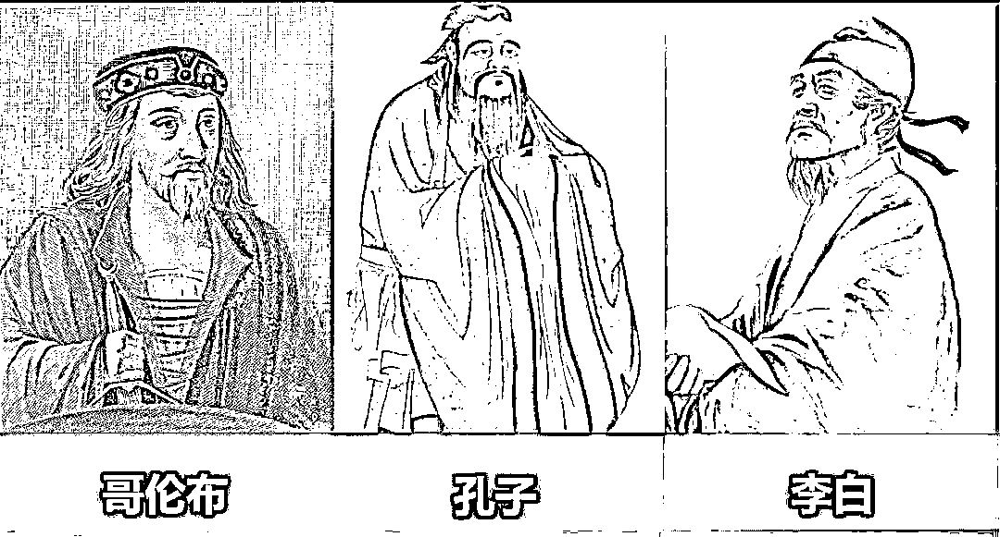
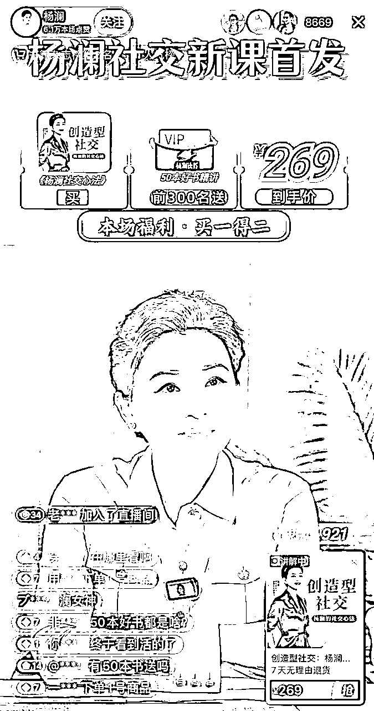
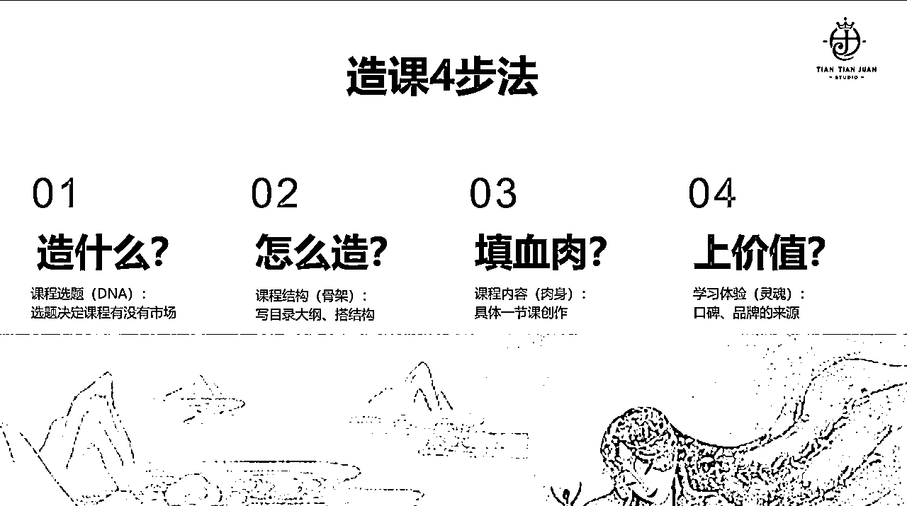
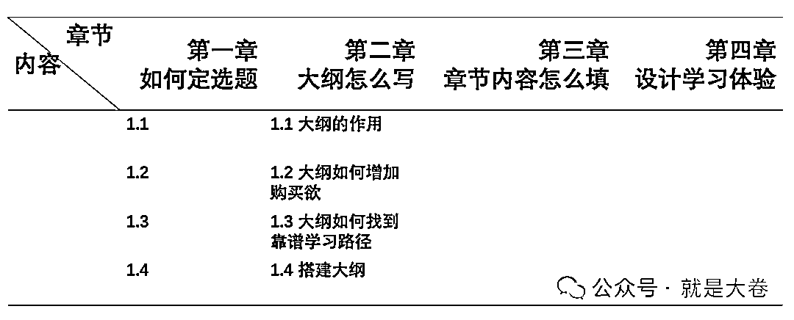
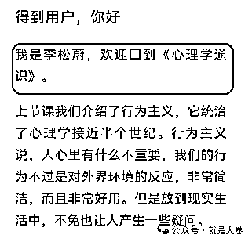
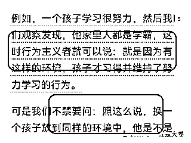
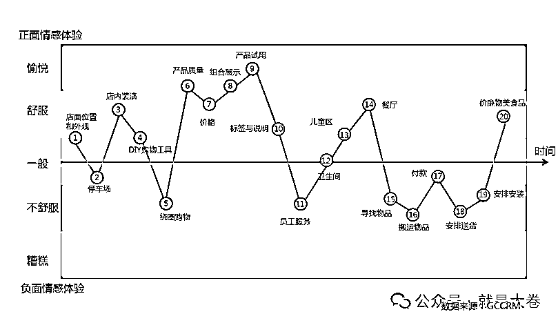

# 我花7年时间沉淀的知识付费做课方法论，拿走不谢

> 来源：[https://qfkv7opheu.feishu.cn/docx/YfGRdltORo1NxtxvUR5c69ernXg](https://qfkv7opheu.feishu.cn/docx/YfGRdltORo1NxtxvUR5c69ernXg)

我是大卷，知识付费专业课程制作人，趁最近不忙，完成下今年的flag，粗来卷一卷，希望能帮普通人打造属于自己的知识资产。

# 一、知识产品能干嘛？

你想做爆款课程为的是什么？

是变现吗？

真的是变现吗？

真的真的是变现吗？

我们先对齐做课的目的，再根据目的制作课程。

目的不一样，做课程的方法其实也不一样。很多人做知识付费目的比较单一，就是想变现。但其实，我们现在理解的知识变现并不全面。因为从古至今，其实大家都是在靠知识变现。

## 【个人：知识变现的他们】

哥伦布：他没有钱，拿自己的知识找女王融资，所以知识可以得到融资。

孔子：我前段时间旅行去了泉州孔庙，发现全国孔庙好像很多。孔子去周游列国做宣讲，孔庙在中国的数量超过 1, 000 座，孔子通过知识得到的是名誉。

李白：最为大家熟悉的是他的诗歌。他通过诗歌得到唐玄宗的喜爱，被招入了翰林院。李白用知识得到了官衔。

再说说当代离我们近的人：

张朝阳：前段时间《张朝阳的物理课》上了热搜。为啥？因为大家觉得搜狐创始人，除了是个成功的商人，还挺有书生气。你看，课程还给他增加了一个人设--书生气、有情怀。

脱不花：得到了CEO，出了一门课《怎样成为高效学习的人》，这个课程在得到上免费，一个 CEO 时间多宝贵啊，但是却花时间做了一个免费的课程，为什么？

这个课程的学习人数已经超过 100 万人，所以你看，我做了一门课，免费让大家去学，通过这个课有 100 万人认识了我，是不是可以扩大我的影响力？如果这个课做得还不错，你就会对我有一个印象，对我打上某个行业/领域的标签。之后如果你有这方面的需求，也肯定会想到我。

杨澜：著名主持人、企业家。前段时间开始做直播并且直播开始卖课。像张朝阳、脱不花、杨澜这些社会精英，他们的收入、社会地位、名誉是远高于普通大众的，但他们现在做课卖课，赚钱肯定不是主要目的，课程更多的是作为一个营销手段。

课程其实就是你的名片，让更多人了解你，帮你获得声誉。而你却只花了一份时间去制作课程，让课程在不同平台、时间、地点帮你获得声誉。

要声誉干啥？个人声誉存在复利。啥意思？最典型的一个例子，罗永浩欠了几个亿，上了征信黑名单，靠自己的个人声誉去直播、去带货、去接广告，才上演了一出真还传。作为牛马的你我，如果欠几个亿，这辈子怕是还不清了。这是声誉能带给你的最直接的影响，除此之外，声誉能带你进入更高的圈层，而且这个圈层还不一定花钱就能进。

## 【行业：用知识产品做杠杆的行业】

刚才讲的是人，再聊聊行业，为什么有的行业也要需做一门课程作为知识资产？

前段时间一个药企找到我，说想做一套课程。因为研发了新药，想通过免费课程的形式吸引一波用户。怎么吸引呢？课程内容讲养生之类的，课程中再植入他们的新药。

你看以前花钱投广告，别人都是带着防备心理去看。现在你做成课程，来的都是目标精准用户，而且不用你求爷爷告奶奶求着他看，他自己催着你的更新课程，看得还仔细。

还有保险行业，做保险其实还得教育市场，我之前想给我妈买保险，我妈特别抵触，说都是骗人的，给我气够呛。如果你的行业也需要教育市场，你可以做一个课程，这个课程不为赚钱，为的是帮你节省时间，教育市场。同时课程如果做得还不错，你的专业力是不是还能得到认可？客户对你的信任感是不是也高？

做房地产卖房也一样，做课能帮你放大主业务。怎么做？你的课程就教别人如何挑学区房、如何判断物业靠不靠谱、避坑之类，学员对你产生信任，如果想买房你手上刚好还有房源，是不是就会来看看？因为你们前期建立了很深的信任感，他还觉得你专业，你的建议他就愿意听。

还有的人，其实对做课没需求，就是听一听，看一看，这东西是不是对我有帮助？其实，课程还能帮你做知识沉淀。我自己真实的案例，我把自己做课多年的经验梳理下来，拿着梳理的文档，去面试找工作，工资翻了100%。所以你看，把自己的工作经验梳理下来，拿去面试，一年多个20-30万是不是也挺香？

# 二、 4步爆款做课法

具体做课怎么做呢？做课其实就跟女娲造人一样。

## 第一步：造什么

选题就是你课程的DNA，你得知道你想造的是男的还是女的。

选题选的不好，选的不对，课即便做出来了，基本上也卖不动，所以一定要先解决选题这个问题。你的选题决定了课程变现的天花板，你的选题市场需不需要，能卖多少钱。

如何确定选题呢？一个原则：好处明确。

市面上我们看到的所有知识付费课程，选题基本上就这三类：

好多人说：我实在不知道该做啥，工作也就那样，没啥值得可输出的；我自己也没啥特长爱好，下班平时也就刷刷短视频、看看剧、打打游戏。

其实选题没有你想的那么难：

*   你有没有类似的成功经验？

*   你有没有做什么事情，别人不擅长，但是对你来说易于反掌？

*   你做什么事让别人经常羡慕、夸奖？

## 第二步：怎么造

课程的结构就像人的骨架。骨架决定人长得怎么样，课程的大纲目录也决定了你这课怎么样。

怎么去搭建整个课程的结构目录？怎么去设计别人看一眼就觉得好，就想买的目录呢？

其实大纲，回答的就是一个问题：我这门课程可以帮助谁，通过学习什么东西，实现什么？

怎么回答呢？解决大纲的三个问题：

1.  增加学习购买率，辅助你成交收米。写大纲一定记住这一点，别人看了目录能增加购欲望。

增加购买欲，起点是需求和市场，你要解决用户的问题，用户的问题基本上就这三类：

1）恢复原状。7 天解决孩子写作业拖拉磨蹭，只要你恢复了原状，这个问题就解决了。

2）防范问题，你30 岁如何科学的管理皮肤，不要褶皱起斑，不要松弛。

3）追求理想，有改善的空间，顶级课程制作人培养计划，为了追求一个理想的状态。

你的课程能解决的是什么？是能帮助学员恢复原状，还是能防范问题，还是能追求理想？我们从这三个里面去考虑学员的需求是什么？到底有没有市场？

1.  帮学员找到合理靠谱学习路径

什么叫找到靠谱的学习路径？举个例子，我要教大家从 0 到 1 去做一门简单的课程，现在大家的现状就是：不会做课，零基础。我接下来要做的事情就是把差距补齐，教你什么内容能让你从0基础到会做课，要把这个差距补齐，规划出学习路径。

差距其实就是你的现状跟你想要达到的目标不一致造成的。我们要做的事情就是补齐中间的差距。

我怎么去补习差距呢？我教你选题怎么选、目录大纲怎么搭建？一节具体的课怎么写？怎么设计课程体验？你看从起点到终点，我在一步一步的帮你补齐知识上的盲区。

现在我们基本上可以回答这个问题了：

我这节课程可以帮助零基础的用户，通过学习如何选题、写大纲、填充具体的一节课，设计课程体验，实现从 0 到 1 制作一节简单的课程。

所以你看回答完这个问题，就可以开始搭建大纲了。

3\. 搭建整个知识结构

怎么搭建呢？给自己画个表格：

把第2步整理好的学习路径，填写到第一行中，这一行就是你的大章节。

填好之后，挨个去填每一列--这一列就是你大章节所包含的课程小节。在填写列的时候，要考虑：我要讲什么内容能完成第一行大章节我所写出的题目内容？

以我教大家写大纲为例，我告诉大家大纲怎么写呢？

*   大纲的作用是什么？有3个作用，分别怎么去实现。

*   大纲如何增加购买率，

*   如何找到靠谱的学习路径，

*   怎么去搭建大纲。

整个表格写完之后，你的大纲就有了。标题虽然有了，但它是学名，不好传播，还要给这些标题起个艺名，让它好看、好卖、好传播。

## 第三步：填血肉

咱具体的骨架有了，它还得有血有肉，那么具体的一节课怎么去做呢？具体的每节课该讲什么？怎么讲才能讲出效果？

做课公式=固定开头+问题/场景+解决方法+感情案例+固定结尾

举个例子：得到李松蔚的《心理学通识》

这个课程每一节课开头都是“得到用户，你好，我是李松蔚，欢迎回到······”

那固定的结尾是什么呢？结尾做一个总结，画一下重点，布置一下作业，这就是固定的结尾。

开头跟结尾有了，中间的知识点怎么展开、怎么去讲呢？首先一定要记住，干货不值钱，不要一上来就告诉学员干货是什么！

要用挑战和问题，或者应用场景引入，让大家先产生兴趣。

然后再讲干货、知识点+举例子验证知识点有用。

这一节课写完了，你接下来的所有课程，都要按这种格式去创作，为什么？

贝律铭说过“重复产生统一，统一形成风格。”时间久了，大家一听到你课程的开场白，就知道这是你的课，你的风格就形成了。

## 第4步：上价值

每个人都有独一无二的灵魂。那么你的课程怎么做才能脱颖而出区别于其他课程？就在于学习体验。

同一个品类、同样的内容，为什么有的课程能卖3年，年营收上亿，而有的课程卖2个月卖不动了，没人买？很大一部分原因就在这儿，学习体验不好。

学习体验其实很微妙，大部分人做完课程完全不考虑设计课程体验。怎么设计体验能把你的课程拔高 N 个档次，顺便再升华一下你的个人品牌呢？

我们可以参考宜家的体验来设计课程体验。我父母有次要买擀面棒，我让去宜家买，结果俩人回来骂骂咧咧，说进去之后就出不来，硬是逛了四层楼，结账还排了老长的队。

但我觉得逛宜家体验还可以啊！为什么呢？我们看它这个图。

（宜家体验峰值）

出去逛街，我们心情本来也还不错，宜家蓝色的大楼，设计也比较简约，一进门又有小推车又有购物袋的，体验比较中性，不会差。

逛的过程中，有风格各异的样板间可以参观，也会挑到自己比较喜欢的物品，体验还不错。

又逛了半小时，人有点多不想逛了，还有人在这打卡摆拍，就开始烦了，但是你又出不来，走几步到了自助餐厅，东西还蛮便宜，也不难吃，体验感又上来了。

最后买完东西出来结账，排队的人多体验感又不好了，但是结完账一出来，甜筒、鸡肉串、热狗都特别便宜，还这么好吃，感觉下次还能来。

所以你看，宜家给到你的是这么一种体验--开头跟结尾的体验绝对不差。哪怕中间可能服务没到位，体验不好，那也一定要在结尾给他拉回来！这其实就是著名的峰终定律。所以咱们在设计课程体验的的时候，一定也要记得把开头和结尾的体验设计好。

* * *

每个步骤好像都不难，但是每个步骤里面都有很多小细节，把每一个细节都做好了，课程的生命周期就能延长，祝你课程大麦。