# 用奔袭战的战术思想，做好同城实体发售

> 来源：[https://aso41gpxhm.feishu.cn/docx/YfIUdZXf1oWYPJxRoqccTpeintz](https://aso41gpxhm.feishu.cn/docx/YfIUdZXf1oWYPJxRoqccTpeintz)

大家好，我是孙策，生财5年老圈友，生财私董会成员，熟悉的老圈友都知道，

在线下拉新这个领域做到了全国头部，带领数百个圈友在这个领域赚到钱，其中不乏赚到几十万、几百万；

22年，我又深扎到同城这个赛道，帮助同城实体做驻店发售，流量增长，仅用4个月时间，公司单月收入过百万，

23年打磨整个的模型，切连锁品牌，单个连锁品牌给公司带来的收益就过200万；

24年开启全国化，4月份开始孵化模式，以孵化营找到合作方，能在全国各地找到对应的合作方，来撬动；

## 第一期同城实体发售航海成绩汇报

同城实体发售第一期航海我们是在山东开展，接下来我们重点的省份在江苏省，预计会覆盖江苏大部分城市。

目前这期航海也靠岸了，结合这期航海，先说一下我们的复盘数据。

同城实体发售孵化营上半年三期总复盘，下半年再出发，我们三期的成绩是这样的：

第一、第二期是在山东临沂、济宁，

70%以上的人个人月到手1万+，其中20%-30%的个人到手月收入大几万，

第三期，在山东济南，也就是这次升级后的，同城实体发售航海，

1、30位船员，结营后 16 位船员接受孵化，2 名船员愿意再次复训，也就是说 70% 以上的船员留在团队跟着团队继续发展；

2、全员百分之百开单率，普适性强；

3、助教加船员合计变现 60 万+的佣金；

4、人均变现 1 万+（不是个人到手）；

相比很多实战航海项目，我们的数据是很优秀的。而做到以上这个数据，对于需要在 30 天拿结果，又是 B 端服务的项目，其实大家都有极大的付出。

首先，大家在2-3天的时间，需要消化大量的内容，包括理解项目逻辑、课包设计难点，快速理解并执行，对个人的要求特别大；

而且当时航海在6月，在济南是最热的时候，大家顶着40度的高温，每天持续上门沟通商家、设计方案，每个人都有过被拒绝的经历，对于船员们来讲可以说是体力与身体的双重磨练；

达成合作后也并不是最终结束，在订单的交付过程中，商家的预期在不断变化，处理商家的预期问题也比较复杂。

但即便有各种各样的困难险阻， 大部分船员都一直想办法跨过去，坚持实战拿到结果，一起走到航海靠岸，才有了更多的自我突破，也有了现在展现给大家的成绩。

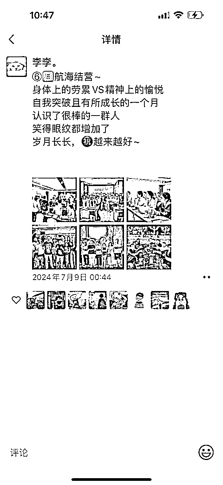

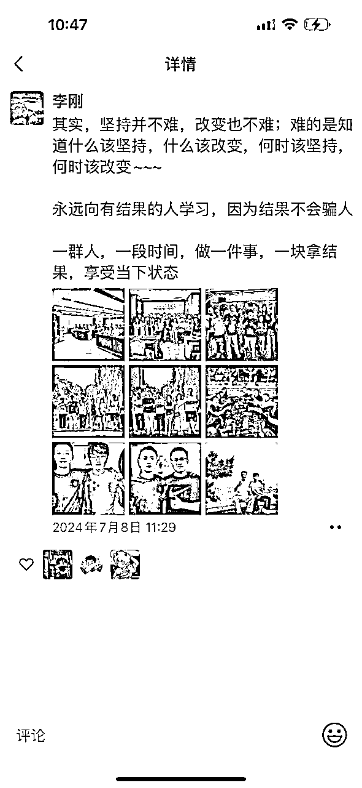

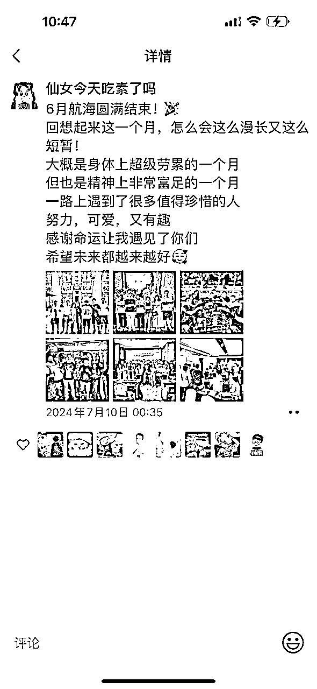

当然，对比之前的其他实战航海项目，我们这个同城实体发售航海是比较特殊的，是一群新人在一个地方共同做一个新项目，其实就是从较远距离，以快速机动接敌的方式对敌方实施突然袭击，这在军事战术上叫做奔袭战。

### 项目介绍

有一些圈友不了解项目，下面的链接讲述的特别清晰

关于同城实体发售项目本身的介绍，可以直接看我上一篇帖子：《同城实体发售，为什么一个城市可以做到几十上百万？毛利70%以上》

这里面的项目逻辑写的特别清晰，本文不过多赘述。

为了做好这场航海我们做了下面几个动作

## 6月航海我们是怎么作战的：30 天重度线下陪跑

因为项目特点是聚焦同城，且考虑到让大家更好的跑通项目，我们同城实体发售航海的形式是：闭关 30 天，一群人来到一个城市 2-4 个周，完成这个城市实体商家的开拓，并帮助这个实体完成流量增长，且成为这个城市这个类目最优秀的团队。

凑在一个城市，一群人做一个事情、完成一个目标有这样的好处：

*   在项目端

1、全国市场足够大，能在每个城市，找到对应的合作方，建立一个全国化的渠道；

*   在个人端

1、来到一个全城市，没有退路，执行力会拉高，成功率会变高

2、创造他律（他人监督），人本质上惰性很大，在一个优秀的组织里，当有一批优秀的人，是可以把偏后的人、惰性较大的人带动起来的，先富带动后富，让这批人有更多的行动力，来实现整体进步；

3、能结识一批新战友；

无论是在战略端还是圈友端，我们选择了30天的线下集训实战，军事战术上叫做奔袭战，所以我们用奔袭战的指导思想来做：

我们把 30 多个圈友分为大概 5 个小队，每一个小队都有一个经验相对丰富的助教老师带领；

每个圈友在成单到交付的过程中，都会进行 1V1 的帮扶，确保每个人都能完成最小的 mvp；

圈友与圈友也会 2 个人、3 个人形成互助小组，共同出动，相互监督、相互督促、相互打气；

如何做好一期同城实体发售航海，整个逻辑围绕的，其实就是如何打好一场奔袭战：

1、上下同欲者胜 - 目标足够统一

2、杀猪用牛刀 - 先胜而后战

3、以人为本-确保构建一个战斗力的团队

4、战而后定 - 把一个城真正占领

5、星星之火可以燎原 - 用奔袭战术奔袭更多的城市

6、同城全国化 3.0 模式 - 路径足够清晰

接下来会以这 6 点来讲讲上一期同城实体发售航海我们做了哪些事情，以及后续我们将会怎么做。

### 1、上下同欲者胜 - 目标足够统一

打好一场奔袭战，第一核心是目标足够统一，就是上下同欲者胜，也就是说全军上下意愿一致。

*   对于 30 个船员来讲，我们的目标就是：在 20-30 天的时间，拿下这座城 50% 以上的市场份额；

为了达成这个目标，我们所有人都需要有以下的共识：

① 单位密度内合作的足够多：一个同城的实体店的大多数客户是三公里范围圈，也就意味着身边的竞争对手特别多。竞争足够激烈，他就会更愿意跟我们合作；

② 通过案例撬动案例：当实体老板看到我们往期有规模化身边成功案例，他们就更愿意跟我们合作。

*   对于整个组织来讲，大家是一个整体。你的案例我可以拿来用，我的案例可以你拿来用，团队的案例可以大家共用，大家是共生关系，一荣共荣，真正做到了上下同欲。

6 月航海如何让大家目标统一呢？

我们做了两天的线下大课，把整个的项目逻辑以及我们的优势讲清楚，下面是上课现场以及上完课之后的复盘，就能很清晰的看出，我们对课程是认真准备过了。

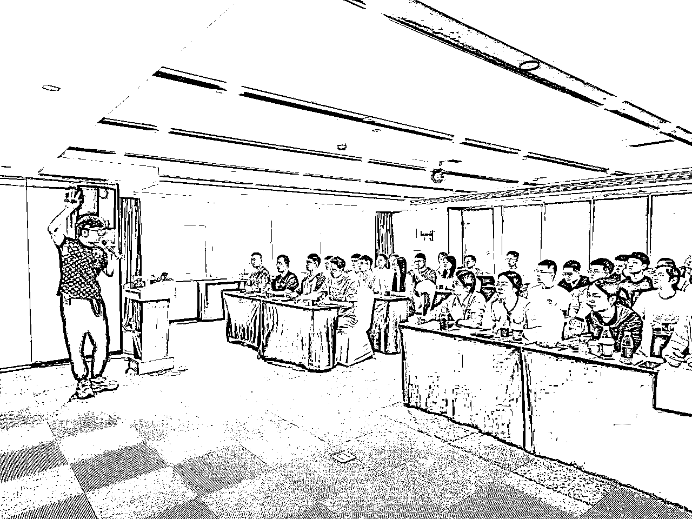

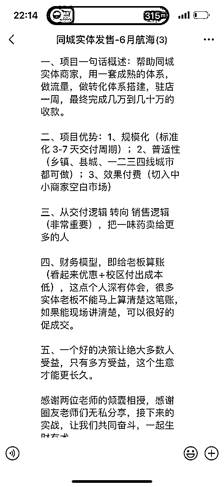

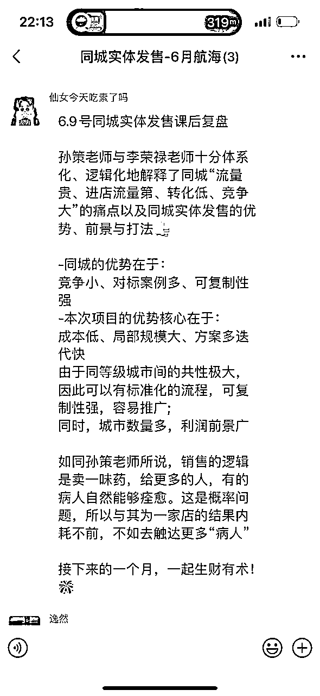

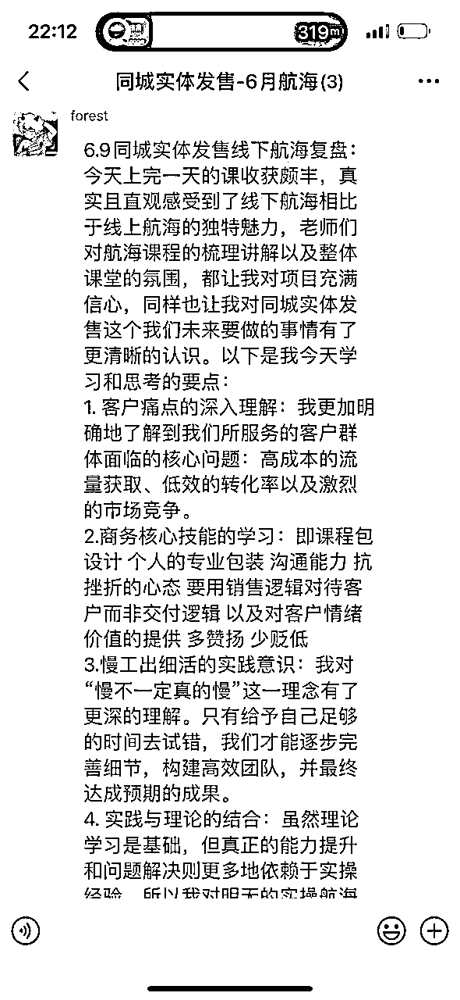

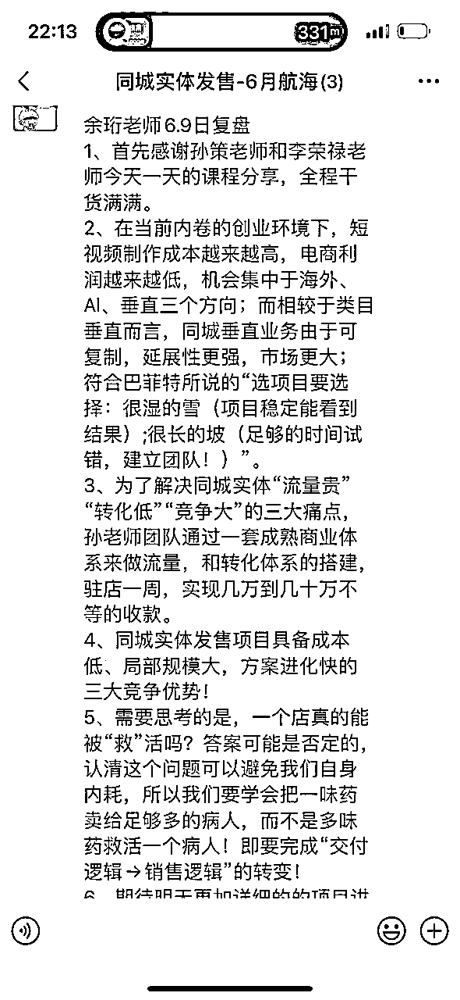

### 2、杀鸡用牛刀 - 先胜而后战

奔袭战的特点就是快速机动、乘敌无备、攻其不及；强调速度性、突然性，趁敌人防备松懈、以及未做好准备或者是反应不及的情况下，以最小的代价取得巨大的战果。

我们进入一个城市，这个城市本身也有在做同城发售业务的，是我们的竞争对手的。

如果在对手反应不及的情况下，快速取得巨大的战果，这就需要我们过去的人要比对手专业性更强、兵力更多，所以说我们要有规模优势、专业优势，先胜而后战，我们先能赢，才去打这一场奔袭战，我们指导思想是杀鸡用牛刀。

6月航海中我们是怎么做的？↓

*   区域规模领先：我们投入到一个城市的兵力，在商务端 10 多个人，交付 5、6 个人，在兵力数量上是碾压级的，在这个城市的本地团队是打不过我们的。

这是我们在一个城市的人数，兵力是碾压级的

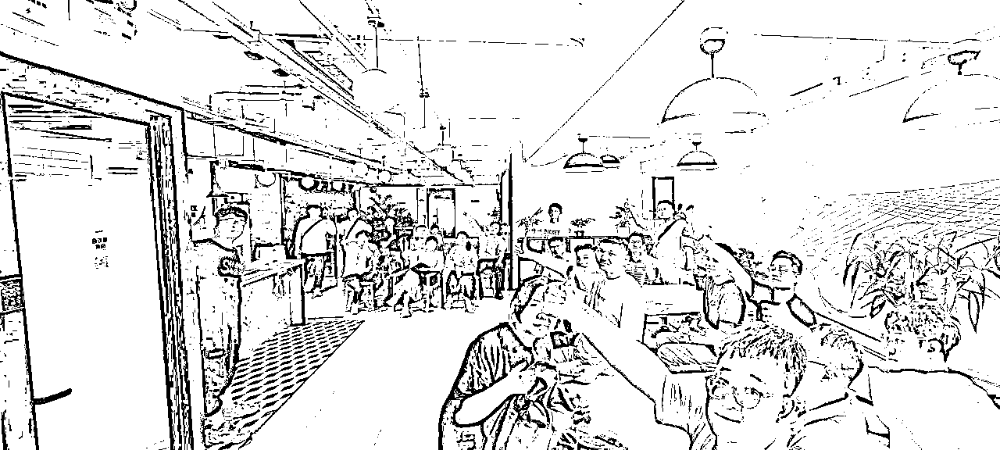

*   战斗力领先：我们每天都开复盘会，把当天碰见的问题全部解决，确保每个人每天得到快速进化，以实现战斗力领先；

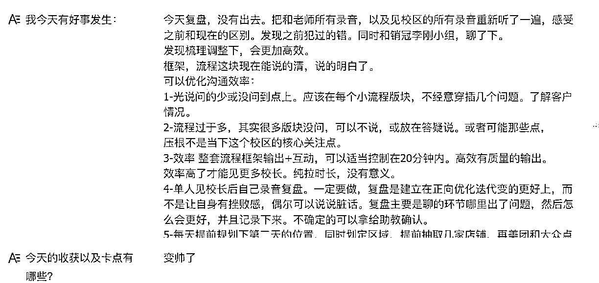

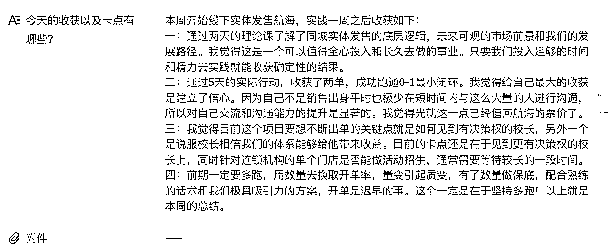

下方图片就是我们开完复盘会的合影，后面的电动车就是我们的战车。

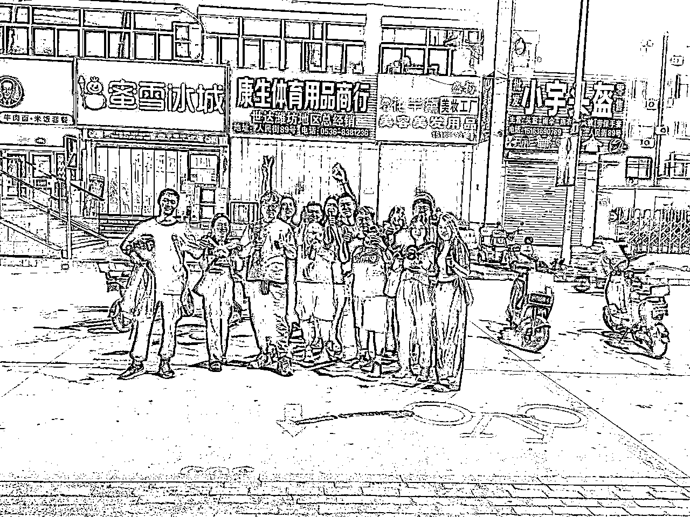

*   装备领先：我们的服务产品，相对来说是多的，抖音、私域全都上，确保我们的产品具备市场竞争力。

通过以上这些区域规模、战斗力、装备，多方面领先，突袭一个城，快速拿到大部分份额，且对手反应不过来，这样团队的人效都变高了。

我们还进行对应的加餐服务，邀请嘉宾来提供新的弹药库，邀请了涛哥加餐。

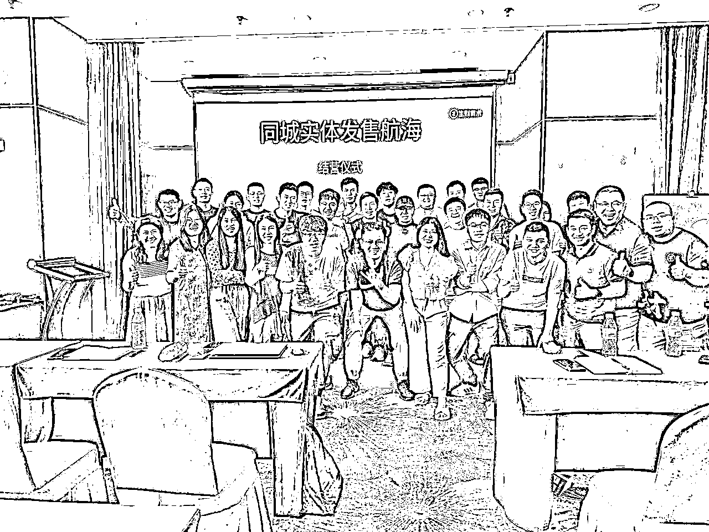

而在接下来的航海我们也将延用这一策略，继续扩大规模，同时开启更多城市的份额。

### 3、以人为本-确保构建一个战斗力的团队

所有的商业竞争，本质上是人的竞争。在航海中，我们尽力做到以人为本，让组织中的每个人都能发挥自己的优势，不受各种繁杂的事情困扰，让这个人更高效。

所以我们在航海中设置了以下四个“以人为本”：

① 让这个人更好的去获客

在接下来的航海中，为了帮助船员更好的获客，我们会在服务客户的产品端做的更完备，比如：有地推、有抖音、私域，后面我们还会增长 AI、小红书、工具等产品线，让同城的客户更愿意跟我们合作。

② 让这个人更好的去赚钱

核心在于构建快速赚钱的产品。

私域发售目前可以成为主流的快速赚钱的产品，但是不够多元，所以我们正在构筑多条收入产品线，抖音后续的长期的服务收入、私域沉淀的收入、工具的收入，让收入更多元、更稳定。

③ 让这个人更有长期价值

这个项目做的是同城商业的增长以及营销，在这个体系成长出来的人，都是懂实战、懂商业的增长专家。

本身这个个体就是有价值的，后续也可以通过专家人设可以去赚钱。

④ 让这个人更高效率

项目涉及到的海报设计等工作，我们有配备专门的人处理各种杂事，让这个人更高效。

## 8月航海，我们还会做什么？

6月航海只是一个开始，接下来的 8、9 月份是培训机构的需求旺季，对于我们来说是一个非常好的行动时间，因此在接下来这期航海中，为了更好的迎战，我们还做了更多的准备：

### 4、战而后定 - 能在一个区域进行深扎进而占领

持续深扎的核心就是要有完善的产品线更好的服务商家、更多的产品线来变现。

一场战斗不是为了战斗而战斗，而是为了“定”而战斗。所以奔袭战队过去之后，需要有一批人紧接着跟上，把这个城市占领，也就是说有一部分人要驻扎在这个城市持续深耕。

因此后续会安排深扎团队这个角色，他们在这个城市做占领，持续的在这个城市深扎，我们有两套体系把这个城市占领：

体系一：同城实体赋能发售

围绕的实体赋能这方面，8月航海准备的产品线更多元化，对于商家有更好的创收、对团队更多的变现产品线：

1、继续做私域发售服务，帮助实体商家直接创收，一直是我们的强有力的优势产品；

2、新增抖音服务，帮助实体持续曝光以及持续锁定用户，船员也可以从这个环节打开新的收益线；

3、新增 AI 工具，各个方面给实体商家进行提效，交付更轻松；

体系二：同城业务本身

等实体发售业务在这个城市做成熟之后，这个深扎团队后续就可以尝试拓展：

*   同城渠道，本质上是构建了一整套的线下渠道体系，很多同城的服务产品都可以落下来，共享充电宝、支付等；

*   同城商业，优质的同城业务可以进行共享。

两套逻辑都具备深扎逻辑，深扎一个城市，足以支撑一个团队在运作。

### 5、星星之火可以燎原-用奔袭战术奔袭更多的城市

类目垂直成为一个类目的天花板之后，需要不断的找新类目，同城垂直对于类目垂直的优势就是，在一个城市打爆之后，可以在中国各个城市进行扩张，国内的各个城市本质上就是平行世界。

因此我们搭建了多个奔袭小队，去攻下不同的城市，在上一期，山东潍坊、德州、聊城、济南，四个城市做了对应的业务，如开头所说，都取得了一定的成绩。

而接下来 8-9 月份的航海计划是：

1、搭建多个小队，能同时在江苏4-5个城市进行作业，在两个多月时间，能把江苏大多数城市做一遍；

2、8-9月份是开学旺季，对于航海来说，这个时间是有对应效益加成的；

### 6、同城全国化 3.0 模式 - 路径足够清晰

开头自我介绍时，我说过 24 年的重点是通过孵化的模式进行全国化，我也简单分享一下我的思路和全国化的路径：

*   第一阶段：打造超级单兵（懂整个的商务逻辑）

*   第二阶段：建立奔袭战队战队长（懂商务、懂交付、懂管理），队长带领团队（人数 10-20 人）跟着我们在不断奔袭中，扩充起自己的团队。

*   第三阶段：发现合适的区域合伙人（懂所有产品），对城市进行深挖，实现多城市的“区域之王”。

建立起全国化的渠道、在实体赋能领域成为同城服务之王、在同城商业领域成为变现之王。

通过上述的逻辑，大家其实能看出来，我们希望和大家一起做一件很长期的事情。

这不仅仅是一个航海，其实是一个真正能深扎几年的事业，同城不仅当下能赚钱、未来也能赚钱。

新一期的航海将会在 8 月 8 日开启报名，8 月 24 日开船。接下来我们会组成 5-10 个小队，在江苏省开展业务，开始新的一轮奔袭战。

在这之前，我们还会在 8 月 7 日在生财有术视频号开启一次直播对谈，和大家聊聊上期航海的情况，详细讲讲同城实体发售项目中大家关注的机会、玩法干货，以及分享这个项目的一些新信息。

感兴趣的小伙伴，可以扫码预约直播，我们一起聊聊同城商业，以及新城市的机会如何，新一期的航海怎么玩。

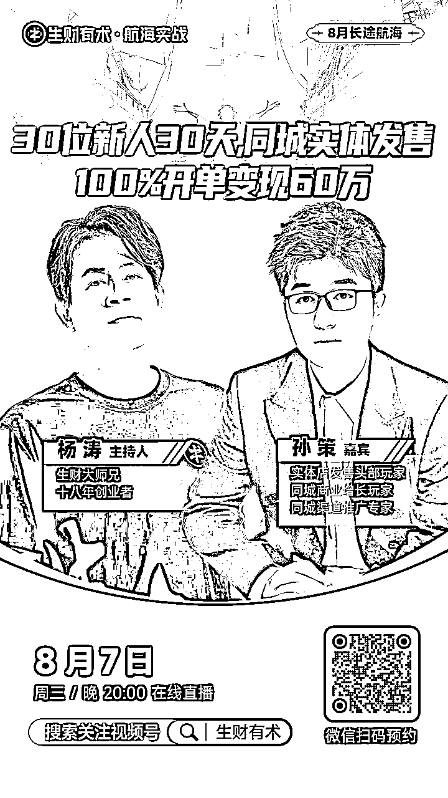

## 写在最后

同城实体发售第一期航海对所有人来说，是以关系经营而不是项目经营。

通过人生维度分析这次航海，人其实到工作之后很少有机会从 0 出发，在一个时间不夹杂任何其他味道的认识一群人。

共同做一个事情，会给其中的部分人结成深厚的友谊，未来也有可能通过另一个项目又走在一起。

这次航海对于我来讲，我重新认识了解一批优秀的人，我确信能跟一批人走下去，对于船员来讲也一样，也会认识一批优秀的人，也会跟一批人走下去。

最后，大家一起生财有术！