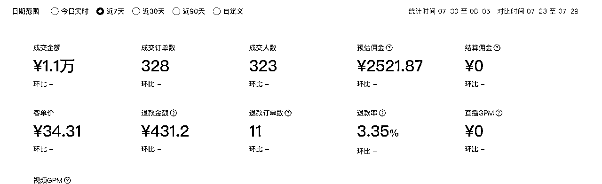
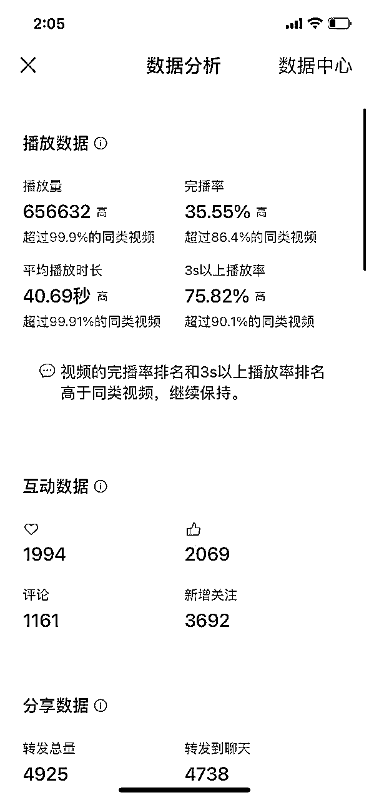
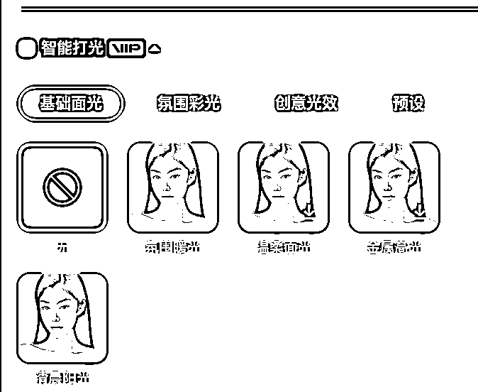
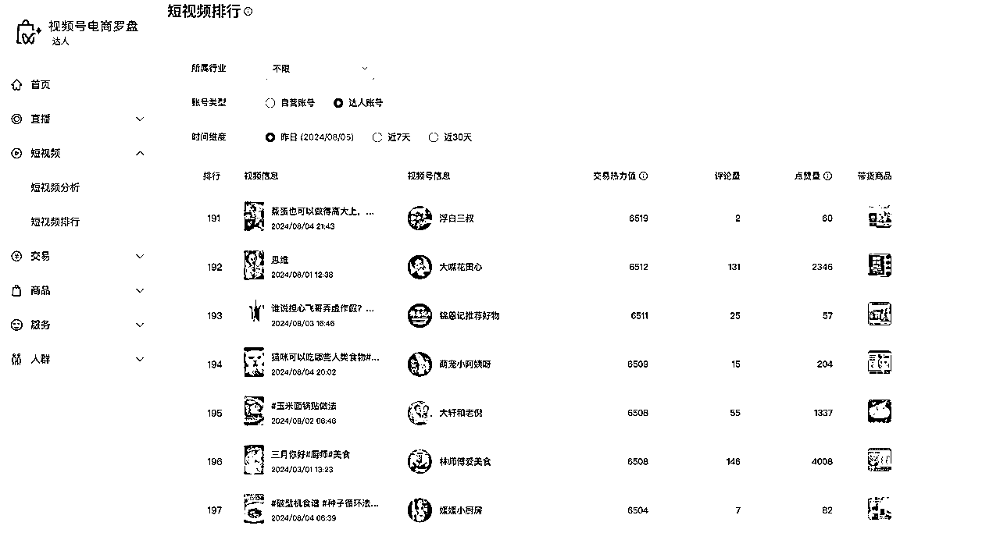

# 视频号口播航海，14天爆300单，我是如何完成变现的

> 来源：[https://irxd56ii8t.feishu.cn/docx/Z7m5dRBE9oHLIDxeU3BcdXaznne](https://irxd56ii8t.feishu.cn/docx/Z7m5dRBE9oHLIDxeU3BcdXaznne)

# 自我介绍

大家好，我是香君，曾经也是一个大厂员工（某大家都知道的短视频平台直播公会运营），今年30，去年年底离职。原因也很好笑，因为害怕大厂的『35岁定律』而选择脱产进行自由职业的研究，给自己一段gap的时间为自己的人生铺路。所以，最早的时候听过文师讲他自己的经历，我真的感觉灵魂共振。今年3月份加入生财，在此次航海之前跟过一次【小红书电商】航海，虽然也跑通了闭环，但是变现效率很不理想。在听说第一期视频号口播航海效果非常不错的时候果断抢课。

在此次航海中也拿到了相对不错的结果，最近七天累计带货GMV1.1万元。最高一篇阅读量达到了65.6万观看，大多数的货都是从这条爆单的。

OK，秀完战绩，接下来我就给大家拆解一下我的关键动作

# 一、自我审视和定位

因为我之前的工作之前接触过很多大家见过没见过的KOL，自己也亲手带过一些。所以我深知就算再NB的人，也要经历流量的真空期。就算有再好的内容也没可能直接爆火，十几亿人口比咱们聪明的有的是，所以不要自负或者自卑先干再说。但是也不能盲目，拿到项目先要结合自身的特点进行分析，看看自己走哪条路合适。当我读完了航海手册之后，我就开始解构自己做出了如下的分析：

本着所有事情都要从兴趣出发的角度，我从始至终一直在历史这个坑里面咣当。

# 二、开始尝试拍摄&剪辑

## （1）拍摄

因为从来也没有出镜过，因此一开始我很听劝，是从文、鹏二师给的口播稿子库里面开始挑的文案进行拍摄的。我的口播录制工作流分成了三个阶段：

1.  整段录：开始的时候，比较天真的以为需要保证整体视频的连贯性，需要整段整段的大段进行录制，这种录制方法有以下几个缺点：

1.  费时间：大段的台词录制结束后不满意再删，再录一条视频需要录制一个小时左右的时间

1.  没法精准掌控情绪：常常是因为其中一两句感觉力量感不够，导致整段不要重新录

1.  剪辑费事：每次需要拖进来多个文件进行统一的角度，音量等调节，极大的降低了剪辑的效果

1.  用说得相机的分句拍摄：这么搞效率是上来了，但是缺点也很明显，就是APP识别的气口并不是那么精准，有很大概率会把开头的第一个字儿的发音裁掉一半，甚至就没有

1.  一镜到底：目前正在用这个办法，甭管中间错多少回，就一镜到底，后面再剪，整体内容的连贯性就大大的提升了

## （2）剪辑

剪辑大家应该都会用智能口播了，粗剪完成之后，可能还会留下很多的气口。长一点的视频，一个个搞气口其实也挺浪费时间的。所以我写了一个简单的python脚本，主要的思路是通过分贝量大小，来筛除有用的切片最后拼接到一起。

如果想要用的话看这个文档：

## （3）注意事项

我一般都是使用抠图，为了让抠图更自然扣的更清楚建议大家拍摄和剪辑的时候要做以下动作：

1.  整理发型：尽量把头发压结实一点，让画面尽量少的出现发丝，这样抠出来人更干净

1.  最好买块绿幕：买块绿幕能极大的提升抠图的效果，搭配取色抠图和智能抠图扣两遍，效果会更好

1.  要善于使用剪映的智能打光功能，调一遍光会让画面更自然

# 三、选品

目前我的选品处在一个比较浅的阶段，属于是一个追平台爆款的阶段。秉承着“在视频号爆了的流量稍微改一改肯定会再一次爆”的原则，我最近选的品都是在【视频号电商罗盘】里面筛出来所有图书类的sku，再根据品类和文案来判断自己适不适合搞这一条

# 四、打磨文案

我在没爆之前，就被投诉过抄袭。加上我看了好多文案其实根本就没那么大的爆点。因此很早之前我就着手拆解文案。我目前拆解文案的逻辑是：

1.  黄金三秒一定要爆（很多的文案库里的文案在我看来都不是很爆），打磨逻辑：

1.  爆点前置，把最吸引人的结论先放到前面讲一遍

1.  开头两秒钟多用夸张修辞，包括：醒目的数字，抓人的音效以及夸张的形容手法

1.  保证完播率要高：

1.  先讲故事，最后再引出产品，确保不会前中期流失率过大

1.  述品的部分应该简短精悍，不要加过多的废话，这点我也做的不太好，一般的视频不介绍产品的部分完播率会再30%以上，但凡开始介绍产品就掉到15左右。（自我反思应该是述品后面垫的废话太多了，本来述品就比较伤完播率，再加上废话导致后面用户划走的几率更大）

## 因此打磨文案的逻辑，在我看来应该如下，仅供大家参考：

1.  受众分析

需要你分析自己的用户画像

1.  受众喜好分析

需要你分析自己的用户画像

1.  文案结构

开头

使用悬念、震撼数据或引人好奇的问题吸引观众停留：

•示例1：你知道为什么现代科技无法解释这场战役的奇迹吗？

•示例2：1949年10月，新中国刚刚成立，士气正式高涨之际，24日，解放军下令渡海进攻，趁势将国民党…

中段

逐步揭示信息，增加细节，保持观众兴趣：

•示例1：1945年，这场战役中，一个小兵用仅有的子弹创造了不可思议的奇迹。

•示例2：你们以为1949年新中国成立，国家就安全了，世界就和平了吗？其实，在新中国前30年，局部战争…

高潮

通过情感化的语言或故事达到高潮，激发观众的共鸣和兴趣：

•示例1：他在子弹用尽后，依然冲向敌人，保护了战友，成为不朽的传奇。

•示例2：请问14年的抗日战争中，哪个省没出过汉奸？14年的抗日战争中，我国出了两百多万个汉奸…

结尾

呼应开头，进行总结和升华，留下深刻印象：

•示例1：这场战役不仅是历史的奇迹，更是人类精神的象征，永远铭记在我们的心中。

•示例2：搞清楚这个问题，你们就会明白百年海军的真正利益，目前…

1.  特殊技巧

•视觉效果：配合图片或视频素材，增强内容的视觉冲击力。

•互动提问：通过提问或引导观众思考，增加互动性。

•情感共鸣：通过情感化的语言，激发观众的共鸣。

•呼应主题：在文案中多次呼应主题，强化记忆点。

👆🏻 以上就是我的一些思路，供大家参考

当然，大家用AI赋能的话，方法是这么玩的：

1.  搞几篇文章喂给AI，让他总结规律

1.  反复尝试穷举凝练，直到你满意为止

1.  将凝练好的方法论让AI输出prompt，保存用于输出文章

过程有点复杂，篇幅原因，有需要的咱们可以另外沟通讨论

推荐好用的AI：chatgpt、cluade、lama 3.1 70b版本（网上有很多微调版本可以试）

# 五、挂车策略调整

起初不管挂车或者是引导到橱窗进行转化，流量和整体的购买率都不够强。我复盘了我自己的内容，总结出了以下几点：

1.  整体的妆造还是不够让人信服，例如：讲历史的情况下，我穿北面，Moncler的背心儿，上面有大号的logo整体的观看效果就是会很差，反观穿了对襟袍子或者没有logo的衣服效果就会好一点，因此需要给用户提供沉浸感；

1.  通过多维度的介绍撬动用户的心智，让他们有有点想买的冲动。并通过“买一本少一本”，“最近出版社放福利”等等手段进行逼单，让用户加剧购买重读；

1.  在符合平台规范且条件允许的情况下，尽量制造话题对立，让本来有自己观点的人充分参与到讨论中来，让那些不明真相的吃瓜群众产生购买意愿。

这样的行动会促进销售转化，有句话说的好，一力降十会，在绝对的流量面前，就能产生高转化，所以说一千道一万。就是如何短平快的，把你要传达给用户的信息密度提上来，让用户能一口气全都咽下去，才能引导他们进一步的做付费动作。因此我认为，提高转化精炼逐字稿的内容密度，其实是最重要的方式之一。

# 六、经验和教训

1.  尽量多准备号，有些隐形限流是完全不可控的，没有办法规避

1.  不要太过于在意流量，有效的流量可以给你带来收益，无效流量除了好看没什么用处

1.  不要跟别人攀比，战胜自己日拱一卒，才是最大的进步

# 七、心态建议

心态一定要强大，有一句话我特别喜欢，也送给大家【如果你从未失败，证明你玩的不够高级】，这个世界根本就没有一个一成不变的安乐窝，唯一不变的就是一直在变。要是接受不了失败，建议大家还是尽早回去上班。

自由职业或者说创业是个自省的过程，首先要修心，只有好的心态才能不断地汲取营养，再试错再迭代，才能够到一些东西。

而且，就算没有结果也不要害怕，失败本身积累下的经验就是最大的财富！