# 小红书引流流钩子怎么下不违规，一天导流100+

> 来源：[https://ci4gfx0d76u.feishu.cn/docx/NWordditOoAWquxV1ndc9X0CnRf](https://ci4gfx0d76u.feishu.cn/docx/NWordditOoAWquxV1ndc9X0CnRf)

所以我另辟蹊径今天分享总结一些搜集总结和我自己常用的引流方法

## 一、主页曝光

#### （1）主页引导

1、瞬间引导

设置入口现在不好直接进了

可以找有设置过瞬间的号

点进他的主页的瞬间就能进入了

或者可以使用旧版本，入口在右上角

找不到入口可以找我要红薯号

先创建5张带文字的图后，然后倒序 打卡5次

旧版入口：

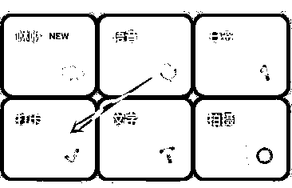

他人瞬间入口：

效果如下

之前可以连起来留微，但是容易被举报

2、简介@引导

@小号 这个方法好像容易检测了，而且小号要是挂了还得重新修改，不推荐

@的小号可以是名字钩子，或者小号笔记留钩子

3、背景图引导

注意不要有违规词，如果红薯与微信同号，可以用箭头指向小红书号，略加说明。

比如下图箭头可以指向群聊、红薯号

4、帖子置顶

将带有钩子的图置顶，可以配合双联图

目前这样留微信也挺稳，下面有双联图的制作方法。跑了几千关注都没问题。

发的笔记不够多不能置顶，好像要5个以上

可以发一些仅自己可见的笔记就行了

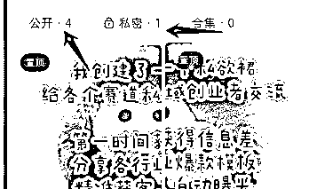

5、头像（引导作用，别留联系方式）

尽量也用谐音字，目前也会检测头像，这个不稳

6、昵称曝光

比如：回关领资料。看我收藏 等等

然后配合rpa自动化脚本去主动点赞收藏关注别人，达到主动曝光目的 。

注意要善用谐音，举个例子：徊观玲恣料。不然容易检测（同行是最好的老师，可以学习别人怎么设置）

7.用笔记小红书号放联系方式钩子

不封禁，不会被识别屏蔽。也不要求能加热，只要不屏蔽就ok。

#### （2）主页留钩子

1、双联图

美图秀秀先创建一张4:6的图，做好后，再按4:3分割。然后发两次帖子。效果如下：

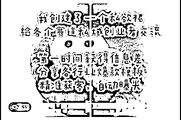

2、收藏小号笔记，引导看收藏

可以用那种0.1的号就行，不求有流量，只要发出别人能看到就行。

图文里可以大胆留钩子，只要能发出来。而且成本也不高。

3、小红书号（可改与微信同号）

然后简介引导，例如：红薯号同\/

或者配合背景图引导

4、笔记留钩子（小号使用）

这里可以用一些特殊图，比如这个网站

https://photofunia.com/ 可以生成生活化图

效果如下，据说可以过头像检测（自测）

5、主页挂群聊

置顶笔记，让别人知道你有个群

或者用背景图指引

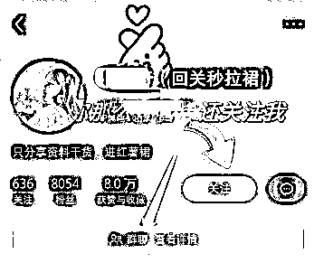

#### （3）帖子收藏留钩子

先收藏小号笔记

然后引导看收藏

收藏旁边还能创建多个专辑，合并成微信

不过链路太长，需要点收藏，再点专辑

专辑有其他用法，可以看私信曝光

也可以直接置顶帖子

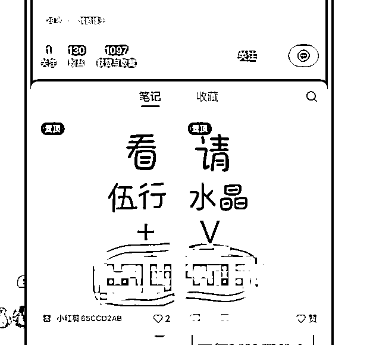

## 二、帖子内曝光

#### （1）帖子内留钩子

1、帖子带标记

在发布笔记时，右划可以看到标记两个字，相当于直接在图里@，这时候被@的号可以带钩子，比如（这里领资料）可以用炮灰小号。

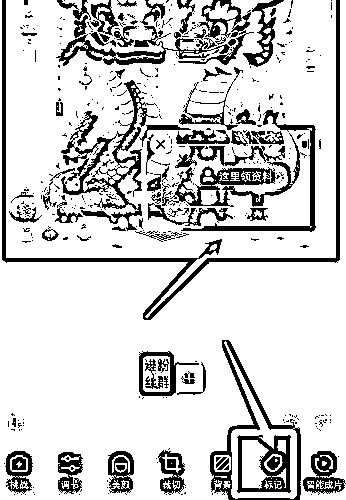

进阶玩法：可以标记多人，可以用多个小号设置好名字，防止检测

效果如下，尽量错开一些，不用摆太整齐

2、投票组件

发布笔记可以同时发起投票，设置3个选项，分开设置对应的钩子

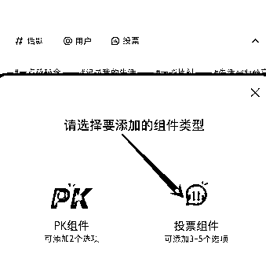

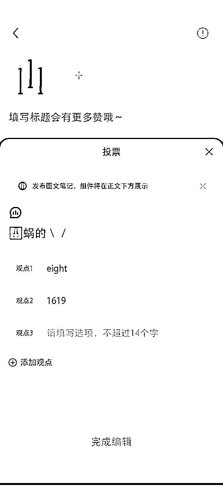

效果展示

3、pk组件

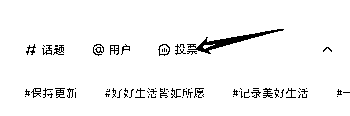

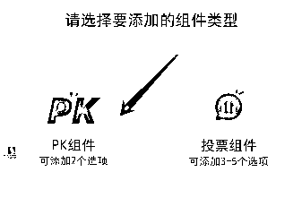

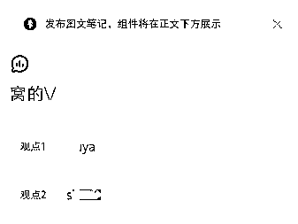

#### （2）评论区留钩子

1、评论区小号提问，大号留小红书群

目前会直接显示群名字，委婉留钩子

激进一些，群聊名字改：🌏xxxxxxxxxx

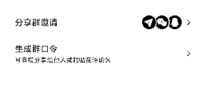

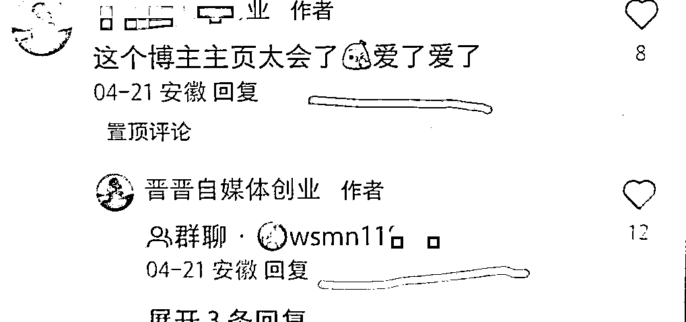

2、评论区@小号

这个应该都懂，小号要能看到帖子就行

3、A种B收，相当于唱双簧

a问b答，评论流钩子，两号唱双簧，导流到b号

要先打造好b号主页

或者b@c，b当素人，推c

## 三、私信曝光

如果私信对方收不到，一般是号权重不够

可以多刷刷帖，点赞 收藏 关注 养下号

#### （1）正常私信

1、诱导发v，我们主动添加

看你怎么引导对方发v了

你的内容够吸引人就容易引导

适合高客单后端

2、私信发图

最好用手写的图，且一张图不要一直用

不想写字 可以生成手写字

不要太端正，背景尽量复杂一些

这个网站很多字体 免费在线生成

背景支持自定义

但是有水印，可以打空格调整位置

https://www.chh6991.xyz/pc.html

还可以用键盘，扑克牌，计算器等 做图

3、拍摄一段视频，末尾留v

比如：先随便拍一段桌面，结尾拍到 手写微信

发完后，说：看最后哦 宝

4、直接发语言念微信

不用自己念，用小程序配音，可男可女，可以选多种风格，可用方言，多弄几个，每次手机发语言的时候就点一下播放，或者下面这个小程序，我用的一直不错，一些好的配音需要付费，99永久，按需购买哈

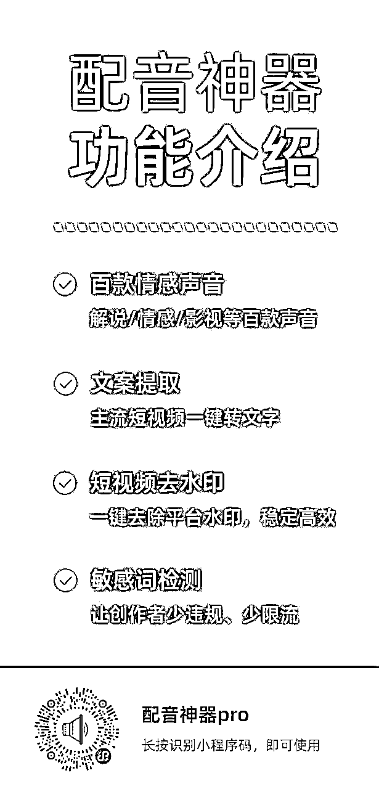

5、笔记专辑共享

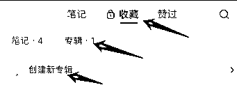

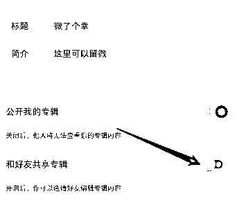

创建好后直接邀请好友发过去

不在最近聊天列表里，可以先打个招呼

效果如下：

5、笔记跳转加微图片

目前我主要用这个，直接跳转图片

可以自定义分享页面和跳转内容，

这个可以直接用小号在群里发

#### （2）强制私信

此方法对于那些号权重不够的，被平台吞私的

比如0.1新注册的小号，发了对方收不到消息

1、笔记专辑共享

先给陌生人发个表情打招呼

这样对方就在你最近聊天里

然后创建专辑，勾选后直接发过去

2、发私信后撤回

第一步就是把名字设置为钩子。

比如 主页收藏专辑领取资料

换成谐音词

然后，在收藏专辑留联系方式。

之后你发出消息后马上撤回

对方会收到：xxxx（你的名字）撤回了一条消息

3、无限私信

理论上无限

原理：一个号可以私信10次。注销后可以马上注册，大概能重复8回，相当于一个号一天80次

别用自己的号，用号商的就行，一个号成本2-3

这样反复注销的号如果玩自热，后面权重会低

缺点：发几次后需要刷机 每10次换ip

优点：可以大胆发微信，只要我注销够快，就封不到我

## 四、群聊曝光（很稳定）

#### （1）群聊留钩子

1、群聊留钩子

例如：兔费玲xxxxx资料

2、置顶广告内容

例如：这里领，xxxxxxx窝的v

自己验证是否能过，可以自己另外创建一个群，用来测试置顶内容底线

建议用小号来发，然后大号置顶

3、设置群主名称

比如：先看置顶消息，移步v

这里要打开新人入群欢迎。这样有人进就能看到你的名字

入群欢迎只有新进来的会看到，不会打扰其他人

4、小号直接群里发笔记跳转微

这个链路也很丝滑

点击笔记后，会直接跳转到指定图片

5、ai助手导流

群聊点击加号，添加ai助手，可以自定义ai助手头像和名字

把联系方式拆开填写（可以先再一个群申请好ai助手，通过后就可以在其他群直接添加）

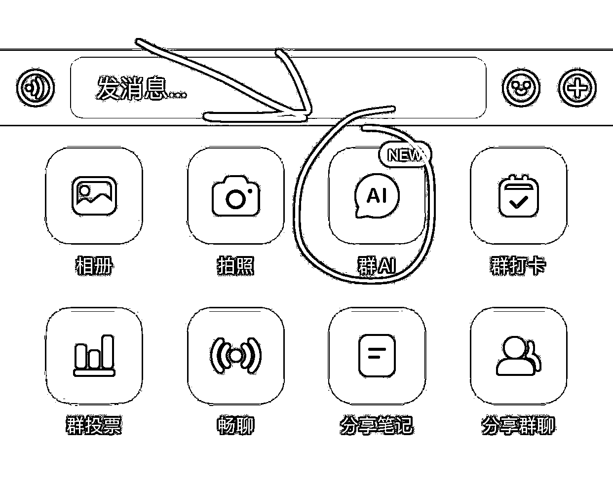

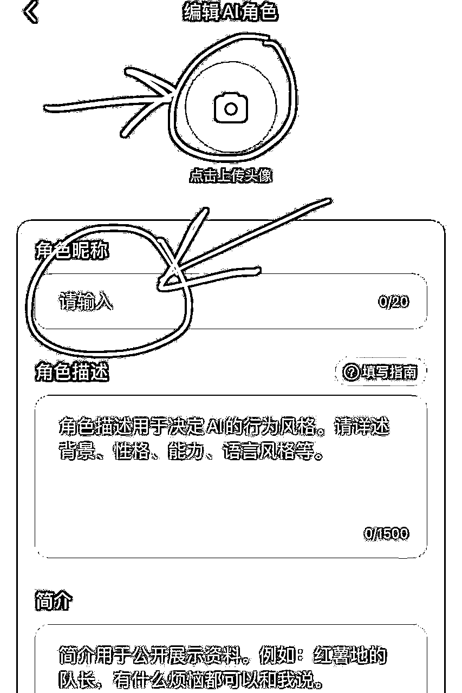

效果如下

6、群打卡导流

与ai助手一个位置，测试直接留也能过审核，有个缺点，打卡时候大家都能填写内容，且不能撤回打卡内容，容易有同行捣乱，自己试一下

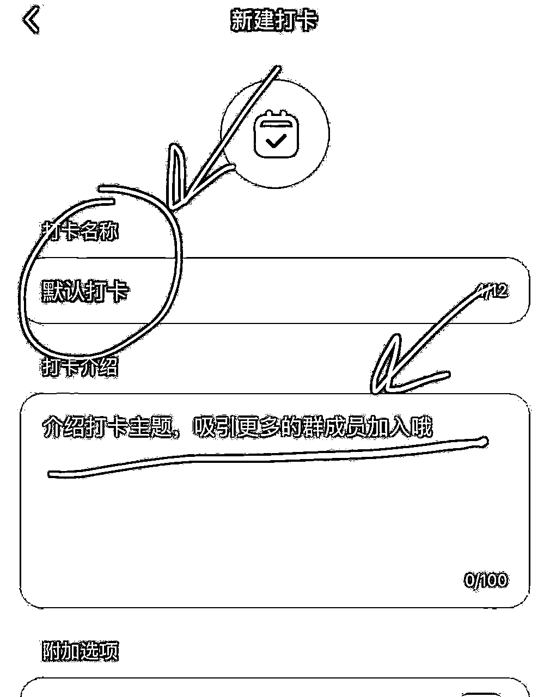

7、群投票导流

与帖子内投票同理，自己看看

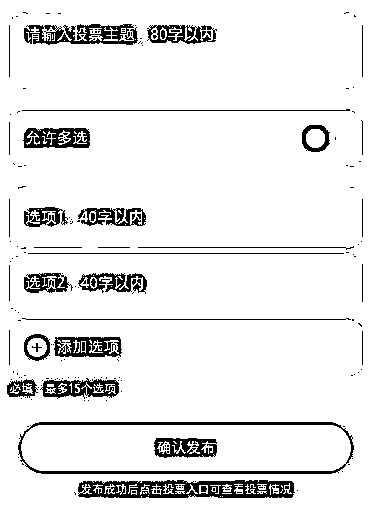

8、省事玩法

去年小红书群是可以禁言的，目前已经修复

但是功能还是可以继续用，不过任何人都不能发言（这样就不怕同行来截流了）

群主也不能发信息，不过可以发群公告，达到@全体的功效

然后再配合上面置顶群公告和设置群主昵称，就可以了

#### （2）群聊隐蔽钩子

结合瞬间思路，群前面5个弄自己的号

利用头像，五个联合起来=你的微信

然后群主昵称引导看群成员列表

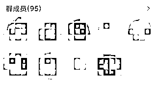

如果圈友有更好用的引流方法。。。

欢迎交流。。。