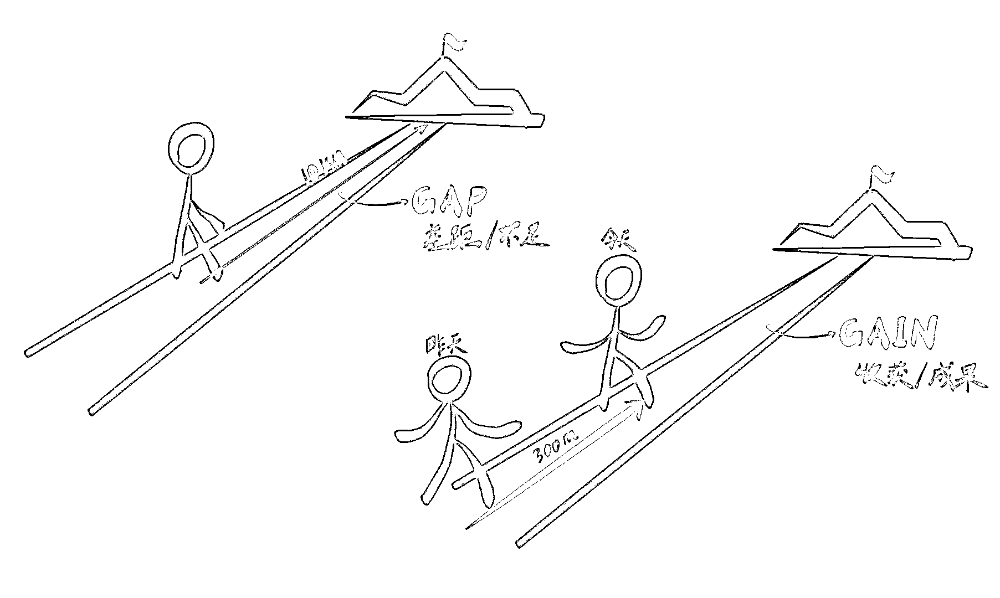
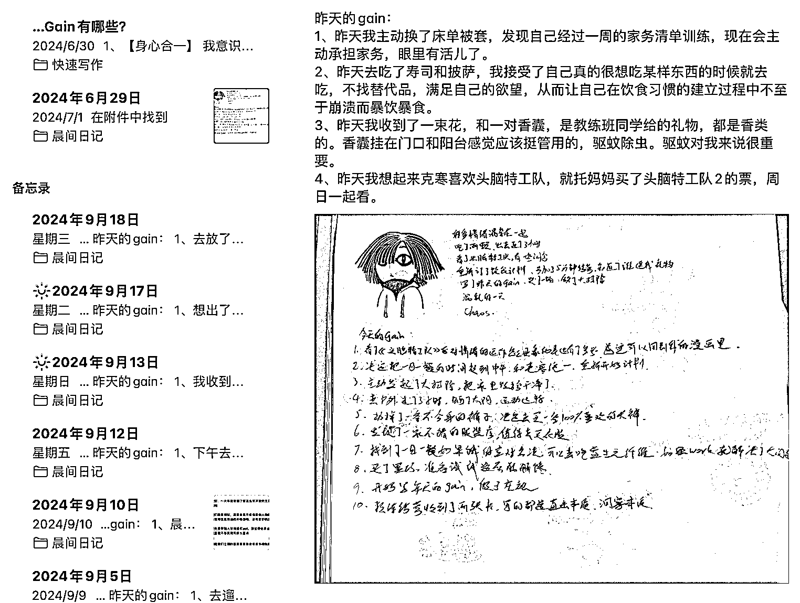
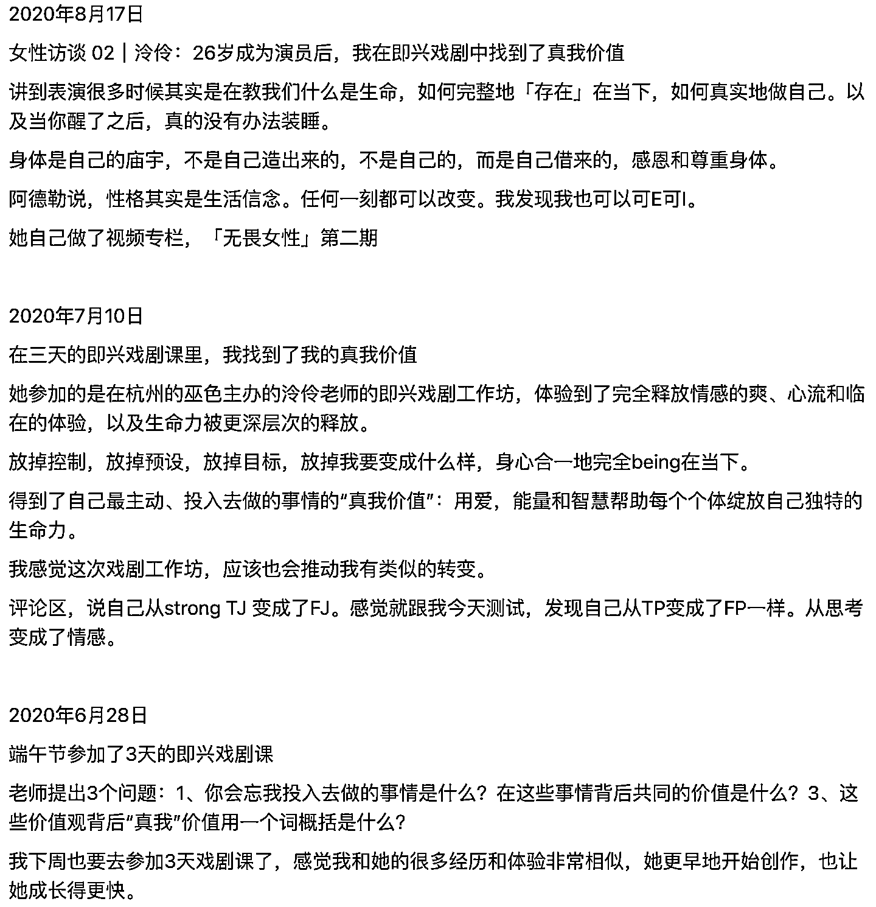
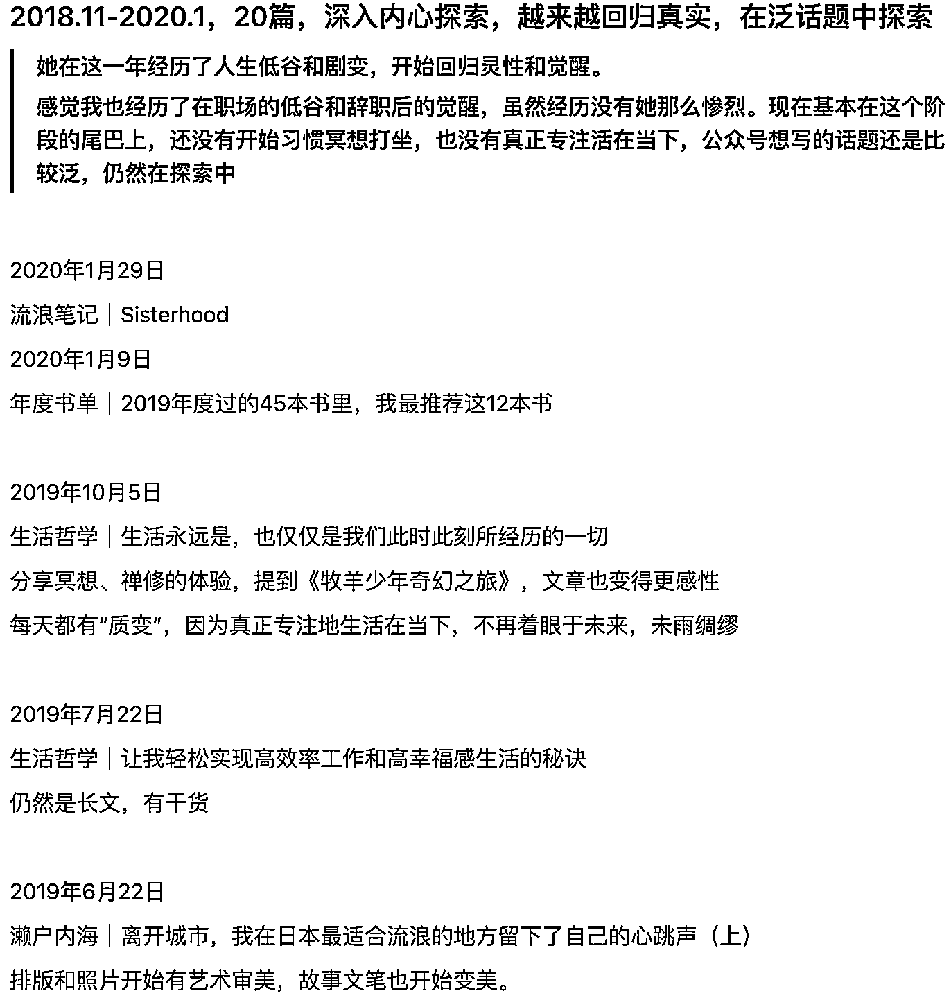

# 从一看赚钱帖就焦虑浮躁，到平和开放地吸收信息，我是如何转变的

> 原文：[`www.yuque.com/for_lazy/zhoubao/ulmrlh98oloo82m5`](https://www.yuque.com/for_lazy/zhoubao/ulmrlh98oloo82m5)

## (精华帖)(363 赞)从一看赚钱帖就焦虑浮躁，到平和开放地吸收信息，我是如何转变的

作者： 兰卡

日期：2024-09-20

估计有大半年没有在生财的知识星球里泡着了，昨晚打开认真看了看帖，突然意识到，我的心态发生了 180 度大转弯。

从第一篇看到十几篇，越看越精神，感觉好像在挖宝一样，这里挖一点金砂，那里挖出来一颗宝石，然后不停地在 flomo 里记录有借鉴意义的信息。

然后意识到，天啊，有这么多优质的信息可以拆解、吸收、打开我的商业眼界，有这么多具体的事情可以尝试，这些人真厉害啊，太好了！太好了！

作为一个高敏感人格，我想记录一下我是如何发生这样的转变的，可能对有着同样困扰的圈友们有所启发。

### 一、从 Gap 的思维，转变到 Gain

可能很多圈友都听过《10x Is Easier Than 2x》。这本书是我在 2023 年 7-8 月就开始接触了，当时就觉得 gap 和 gain 的思维描述太牛了！

gap 的思维，就是关注自己和理想标准之间的差距，要么是一看到有别人做得好就感到自己不行、不够好、根本赶不上；

要么是一看到自己和理想目标之间有距离，就觉得自己得做好长时间才能达到这个目标，或者如果没有做到 100%，那就是 0。

然后自我打击，灰心丧气，产生焦虑。

而 gain，就是关注今天的自己比昨天的自己进步了哪些，看到的是“成果”。于是就会更关注当下我突破了什么，收获了什么，还可以做什么。

  

Gap 和 Gain 的区别

举个例子，有些圈友可能跟了一期航海，做了 3 天打卡后放弃了，然后觉得自己啥都没做成，就开始自责、懊悔。

但是，愿意去报名下场行动，还做了 3 天，就是 gain，就是收获，就会比之前啥都没干的自己，更往前走一点点，有更多的经验可以总结呀。

难道不是比昨天的自己，又进步了一点点吗？不是比昨天的自己，又离理想中那个赚钱能力强、做事又有成就感的自己又近了一点点吗？

这个思维对我冲击很大，我也知道自己之前反复出现的焦虑、挫败感，都跟 gap 思维的根深蒂固有关系。

但真正要消化里面的思想、改变自己的思维，还是需要时间的累积。

幸运的是，有好几件事帮助我把自己的 gap 思维，转变成了 gain：

**一、我在每天早上的晨间日记里，加了一条，写昨天有什么 gain，也就是收获。**

刚开始写的时候，跟挤牙膏似的，冥思苦想半天也挤不出两三条。我就想放弃。

但我老公克寒说，你给自己一个硬性规定，至少写 5 条。

我就跟写作业硬堆答案似的，把各种之前我觉得根本算不上收获的事情也写了进来，比如：

“今天去湖边散了散步，发现云真的很美”、“下午去遛了狗，这样晚上遛狗就不用被蚊子叮了，我感觉优化了一个生活习惯“、”今天没点外卖吃，自己做的饭，感觉更健康“、“学会了巴氏刷牙法，原来我之前一直没刷到过死角”……

  

在晨间日记中记录的 gain

重复确实是有力量的。才写了 3 个月左右的 gain，我就发现了原来每天我都有进步，都有收获。

原来很多改变的过程中，会有那么多细小的事情发生，最终引发质变。

**原来有很多我原来看不上的收获，却真真正正推动了我内心的蜕变。**

这种感悟，也迁移到了赚钱搞事业上，我没有再像以前那样，只看重最终的赚钱结果，而是在意我在这件事上的每一个微小改变。

甚至只是朋友圈的内容写得更顺手了，意识到早上的时间拿来完整地工作会更高效了，给自己安排每周至少一天的休息日来调节身心了，都是事业和赚钱上的 gain，都是收获。

**二、近距离观察和交流了几位朋友没开始创业之前的人生故事，到创业之前的低调积累和试错，再到创业之后一步一步地解决所有问题。**

之后，我切身体感地意识到：

没有人的成功是我们看到的那样，就花了一两年、两三年时间一跃而起。

**有大量的信息，是在冰山之下的**。你看不到 TA 在读书求学时代打下的基础，看不到 TA 的家庭氛围熏陶，看不到 TA 性格中的闪光点，看不到 TA 之前反复磨练的基本功，看不到 TA 在做这一个项目之前走过的那么多路，看不到 TA 做了好多好多尝试，大部分都“失败”了。

当然会觉得，为啥那么多人能快速获得成功，为啥我不可以。然后情绪又开始上头。

**三、我把我喜欢的一位博主的公众号内容，从 2014 年到 2024 年至今，一篇篇的日期、标题打字码到我的笔记里，然后基本每一篇都加上了我的一两句批注，记录她的人生变化、思维转变、内容调整、商业尝试和复盘、我的共鸣和启发等等。**

长长的一篇笔记里，走过了她的 10 年。

  

  

博主拆解笔记的节选

我用这种“笨办法”，一个字一个字地码出来，才能深刻地感受到：

1、改变是一个漫长的、螺旋形上升的过程，绝不可能在 1 年内就从一点迹象都没有到完全脱胎换骨、且永不返回到之前到模式。

2、人一旦有了改变的苗头，就无法阻挡，最终一定会“念念不忘，必有回响”。所以一切问题，必定能解决，都是时间问题。**而一切焦虑，都是因为不接纳自己当下就是这个样儿，需要花很多很多时间慢慢磨。**

3、我现在的思维认知、动手能力、内在课题，都处在她 2020 年上半年的阶段。所以如果直接拿她现在的商业模式、产品和内容质量和我的对比，就会有一种吊打感，然后让我觉得想要模仿她，这一步台阶也迈得太大了，无从下手。

但是如果和她在 2020 年上半年的那个时间段对比，就更有信心去往前走几步，而且也清楚地知道，接下来可能做哪几件事，会为之后的事业起步打好基础。

于是心态就放平了很多。

这又引申到了我想讲的下一个事情。

### 二、接纳自己的节奏

了解了一些人的人生经历之后，我意识到，每个人都有每个人的课题，每个人在不同的时间段，要去解决的课题都不一样。

有些人是亲密关系，有些人是自我价值，有些人是身体健康，有些人是快速还房贷，有些人是鼓起勇气离开职场……

在创业赚钱这个目标上也是，不同的人当下要解决的最重要的事情不一样。

比如，我可能在创业之前，不是从 0 起步，而是从-10、-100 起步，一是因为脑子里塞进去的限制性信念太多了，对自己的不相信、没价值感太多了，二是因为身体小毛病不断，情绪也越来越低落，健康上明显出了问题。

所以我在离开职场之后，选择了好好休息 1 年，甚至，去学习怎么真正休息；

去上课、和家人沟通、做教练对话等等尝试，来处理遗留多年的关系和内在的课题；

去看医生，吃药，针灸，多出去走走，多晒晒太阳和拉伸，开始给自己做健康的食物；

去搬到良渚文化村，养在青山绿水里，用大自然的安静舒适的能量滋养自己；

交了一群热爱生活、也有自己创业节奏的朋友，体会到原来我不需要像一个工具一样提供价值，也会获得爱；

去沉浸式打游戏，要玩就玩彻底，玩得痛快，然后意外地通过玩《塞尔达》让我意识到世界是旷野，而不是爬台阶的金字塔；

……

总之，就是一边调理自己的身心健康，一边去通过好好过日子，来理解硅谷王川说的那句话：

**“少数人慢慢会终于发现，内心深处追求的，实际上是一种心灵和身体高度自由和流畅的状态。**

**做自己有兴趣的事，对不高兴的事情说不，做事的过程变成一种游戏，在这个游戏中按照自己喜欢的节奏学习/成长，然后顺便赚越来越多的钱。**

**那么这个过程就会非常享受，而原先企图可以追求的“经济自由”只是一个顺带的产物。”**

我把我心里的“坑”填的差不多了，让我从-10、-100 逐渐往回拉到 0，就会以一种更加积极主动的状态，在事业和赚钱上重新起步。

身体有力量了，内心更成熟强大了，能量就会往外溢，整个人也自发地会主动想往外拓展，想去创造点什么，想去直面商业游戏。

**这就从恐惧驱动的“我不赚钱不行、我必须要好好赚钱”，变成了爱驱动的“我想创造更大的价值，我想发挥我的潜力看看能玩出什么名堂，我想 Build something”。**

于是再打开生财的知识星球，去看帖，去学习和行动，就顺畅多了。就有种，我真的是扛着把铲子，兴致勃勃地到处看哪里能挖宝石的感觉了。

在这个过程中，我觉得最关键的是，**无论觉得自己有多“慢”，有多“走弯路”，都别骂自己。**

做过很多次教练对话、也给别人做过很多次教练对话之后，我深深意识到，我们做的每一件事情，背后必然有积极意图。

说白了，没有人会成心绊着自己、给自己拖后腿。

去和心里的小人对对话，问问 TA 在想什么，TA 当下真正想做的事是什么，先理解自己，就会用更适合自己的方式达成目标。

今天，我在分享我当初的决定是先休息至少 1 年的时候，很坦然。虽然过程中有无数次煎熬，但这个决定，是突破对停下来的恐惧、跟着心的感觉去做的。

有可能先休息不是最好的方式，有可能如果直接创业会更高效。

但管它呢，我的感受很好，也从没有后悔，那就行了。

我的意思是，判断自己在创业和赚钱上当下要做什么、自己决定自己的节奏，是一件很主观的事，也很难 100%印证是不是正确。

但我现在的想法是，没有一条路是唯一正确的、清清楚楚拆解出每一步的步骤的。那都是我们一厢情愿的幻想。

模糊的正确就行了，没必要苛责自己每一步都有很高很精确的投产比。

**往哪走都是往前走。**

所以，只要在这件事上行动了，尝试了，都是往前走。甚至让自己休息好，也是往前走。

### 三、从“TA 本位”变成”我本位“

前几天有位朋友说，看我的朋友圈看了一年，感觉像是在看一个人从建立起“小我”，到如今刚开始走向“大我”的过程。

我的感受是，真好，这就是我想要的。

当我们自己的内心都摇摇欲坠、经常被恐惧、焦虑、愤怒、抑郁、麻木等情绪冲刷的时候，被各种噪音、信息冲刷得一两天一个主意、还唯恐错失某条赚钱信息的时候，可以先去关心一下自己，感受一下自己的存在感。

先爱自己，关注自己要什么，在想什么，喜欢什么，不喜欢什么，像个小孩子一样肆意妄为一点，想买什么就放纵地买一点，**活得任性一点也没关系。**

比如我之前花了 3 个月的时间打《塞尔达》，一直打到地图完成度 100%。去他的咨询业务，去他的线上教练课学习，去他的锻炼身体。

我就是想玩游戏，我从小到大就只有学习、工作、日复一日地“精进”，从没有痛痛快快什么都不管地长时间玩过游戏，我就是想感受一下自己像一个小孩子一样、每天就是玩的感觉。

昏天黑地打了 3 个月，有一天突然玩好了，就放下了。然后再也没有沉迷过。

然后发现，这 3 个月不生产任何东西，不创造任何价值，没有任何成长，天也不会塌，日子照样过。

类似的尝试，我还做了很多，比如每天就在家里躺着，再焦虑也让自己停下来，学会适应想干什么就干什么；

比如重新拾起自己画画的爱好，一幅又一幅地画，感受纯粹的快乐；

比如让我老公克寒给我做了无数场教练对话，让我一次次地在内心探索不同的话题；

比如把自己之前不敢花钱、今年又特别想实现的心愿清单列出来，然后发现竟然总共也就两三万能解决，立刻花钱；

比如和妈妈直接表达，什么时候生娃、要不要出国、能不能养狗、做什么工作等事情，是我的课题。他们的反应，是他们的课题。我怎么面对他们的反应，又是我的课题；

……

通过各种尝试，我在实践中一点点主体性强了，越来越能把我自己的意图摆在第一位，而不是别人怎么看、别人是怎么做的、外界有什么阻碍。

然后就会把注意力从外界放到自己身上，把心神收了回来。

于是就对来到我生命中的人和事不做评判，注意力很难被完全牵着走，而是关注，**这会给我传达什么样的信号？**

比如说，现在的我，即使看到一篇营销味儿很浓、刻意引流的帖子，心里的想法，也不是：

“啊，这篇帖子味儿太冲了不想看。”

而是：

“这个标题起得过于夸大了，我之后自己起标题需要格外注意避免这一点。”

“这篇内容谈到的思路还是很有价值的，打开了我对这种商业模式的眼界。”

“数据可能有水分，也可能是选取了利润比较高的几天选择性宣传了，也有可能人家讲的是真的。但不重要。商业模式学到了就行了。”

“感受到作者其实意图还是很积极的，写得也很认真，可能只是在这个阶段做了不合适的事情。可能是之前的社群规则就对这种行为没有刻意禁止。感觉我自己泡社群的话，得提醒自己不要这么做，对群主和圈友来说观感不好。”

**“一切都是我的资源。”**现在好像真正开始理解这句话了。

### 四、自己动手去做一件完整的事情

最后想分享的是，完整地做好一件事，会对自己脚踏实地地赚钱非常有帮助。

完整地做好任何事都可以，如果时间能拉长到一周、一个月以上，就更棒了。

当我连续 3 天早起第四天就熬夜然后睡了一上午之后，就意识到那些长期早起的人，有多厉害；

当我写第 1 篇、第 3 篇、5 篇文章的时候，就意识到那些长期更新的高质量博主，有多厉害；

当我给家里人做了一顿色香味俱全的饭的时候，就意识到那些每天给家人精心准备饭菜的人，有多厉害；

当我打德扑场场把“筹码”输得裤底都没了的时候，就意识到那些面对 80 分、90 分的好机会都能坚持原则直接弃牌的人，有多厉害；

当我游戏玩了 3 个月打怪还靠硬砍的时候，就意识到那些能出连招还不受伤的玩家，有多厉害；

……

过去这 1 年来，我自己动手做了很多之前没做过的事情。**每做一件事，就会意识到，做相同的事但能做完整、持续做的人，有多厉害，比我字面上理解的，厉害多了。**

在赚钱上也是，我现在意识到了，生财里，好多好多好多厉害的人啊，虽然我原来也知道有好多好多好多厉害的人，但我没意识到有这么多这么多这么多厉害的人啊。

就，大家都好牛啊，你们怎么这么牛，能把这个项目的步骤做完一遍就很牛了，还能写一篇文章分享？！还能跑通项目？！还能持续赚到钱？！还能迭代成天花板更大的项目？！

天啊，这都是我的宝藏。我要向大家学习。

* * *

当然，一个人的转变，肯定不是两三个因素就能促成的，我只是尽可能地回忆了我觉得有效的动作。可能尤其适合高敏感的、内心情绪更加丰富的圈友。

如果你觉得某一种方式有效，就可以**在重要的事情上下重注。**

比如，也许只是每天记录自己的 gain，甚至只是隔三差五记录自己当天的 gain，就会有很明显的改变。

不管怎么说，先分享出来，也许就对某一个人有启发。

感谢生财有术的存在，也感谢主动分享的圈友们，祝大家每一天都快乐！

* * *

评论区：

小吴姐 : 又遇到一位“10 倍增”圈友[握手][握手]
清风 : 这篇文章真好
李凤娇 : 持续保持修养，持续自我迭代，看自己，真棒👍 Max : 很真诚的表达，有被感染到，很棒。
亦仁 : 一切皆为我而来
忠哥看世界 : 谁说世界上没有感同身受
姚先森 : 目前我就是这种状态 ：看不下去 几万字[撇嘴][撇嘴]
车夫子 : 第一感觉:牛
第二反应:文章很有 power.共鸣感十足
第三反应:读出来，一个字一个字的读出来
第四反应:按照里面的方法试试，
第五:感谢🙏，我感觉到了对我有用的东西，我想试试看！

* * *