# 我自制 GPTs「绘画大师」50K 订阅，入 GPT Store Dalle 前三，附详细使用教程～

> 原文：[`www.yuque.com/for_lazy/zhoubao/xd6sam260fidyxbi`](https://www.yuque.com/for_lazy/zhoubao/xd6sam260fidyxbi)

## (20 赞)我自制 GPTs「绘画大师」50K 订阅，入 GPT Store Dalle 前三，附详细使用教程～

作者： 大全 Prompter

日期：2024-09-20

大家好，我是大全，前 BAT 架构师，愿景是成为 AI 提示词的布道者，带领 10 万小白入门 AI。

非常开心，我自制的 GPTs「绘画大师」订阅突破 50K 了，

并且荣获 GPT Store 前三，目前就单这个应用，大全收入就突破六位数了。

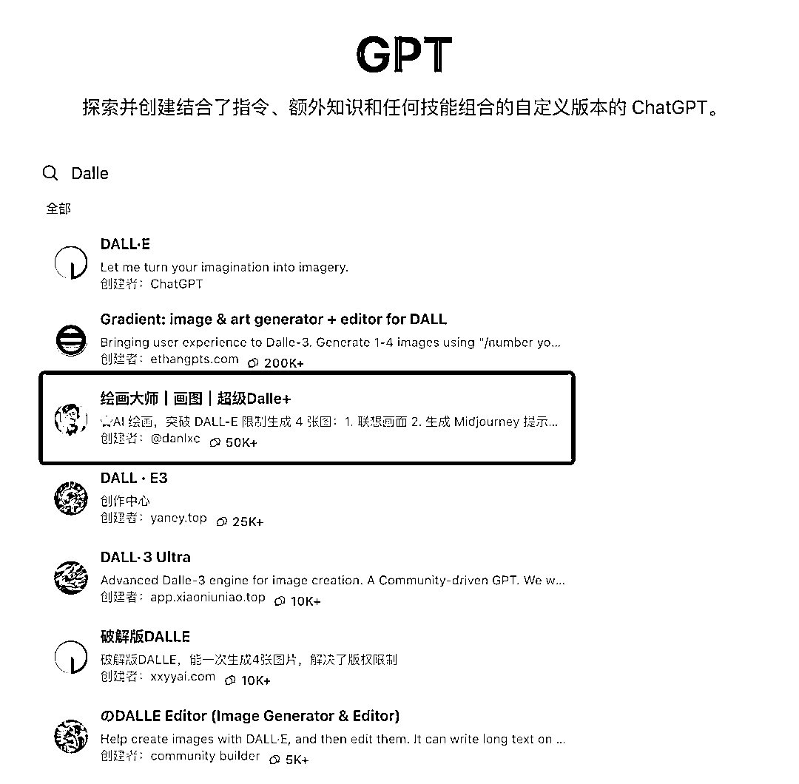

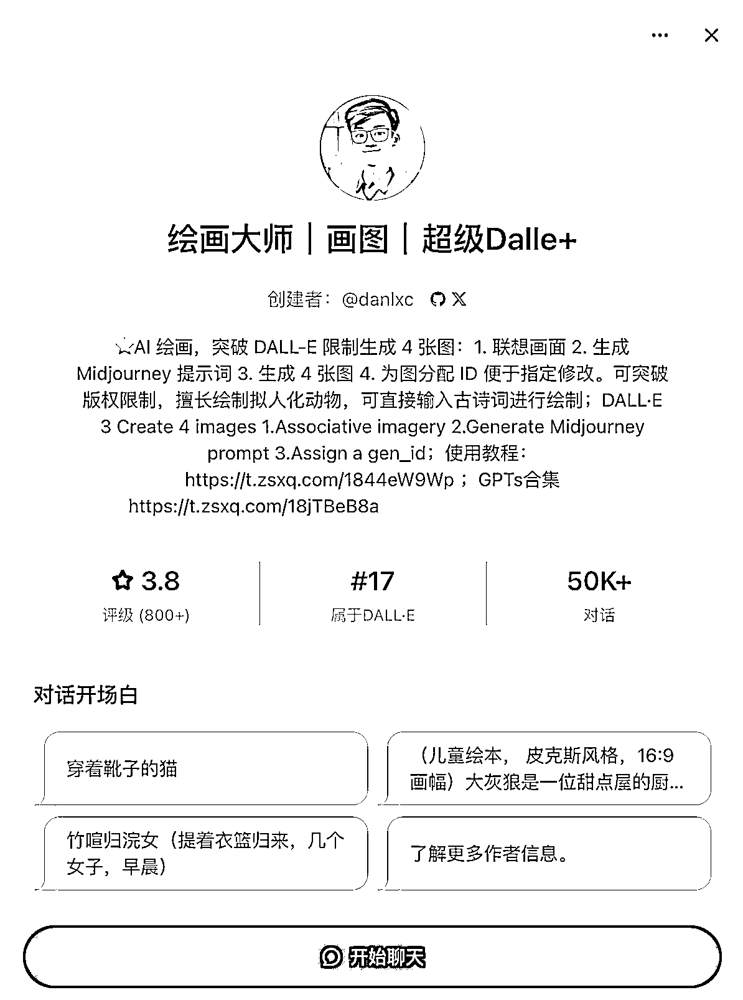

如下是我之前通过这个应用，7 天赚了 70 美金的截图：

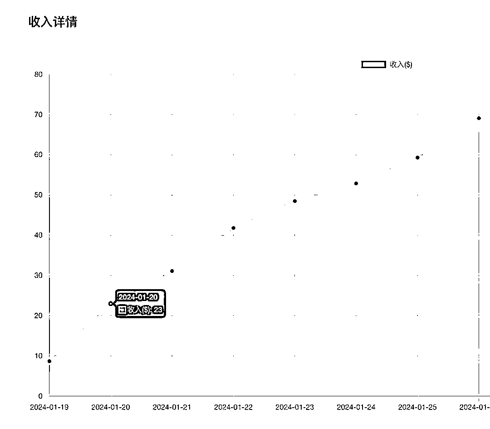

当然今天不是来秀成绩的，今天主要是来给大家介绍一下这个应用的详细使用方法，

我知道大家最头疼的就是画风的一致性，最近也迭代了，可以一键生成一致性画风的儿童绘本，那么我们开始吧

我之前花费了两天时间，终于重磅迭代了自制的 DALL-E 3 GPTs，现在测试儿童绘本效果非常好，只需要一句话，就可以了一键生成。

而且人物画风保持高度一致性，效果很好，我们直接来看效果：

**1、使用教程**

可以看到我的《绘画大师》只需要最开始输入：

Prompt：穿靴子的猫

之后所有的联想和系列内容都全部有《绘画大师》自动生成，

之后《绘画大师》会自动联想几个画面描述：

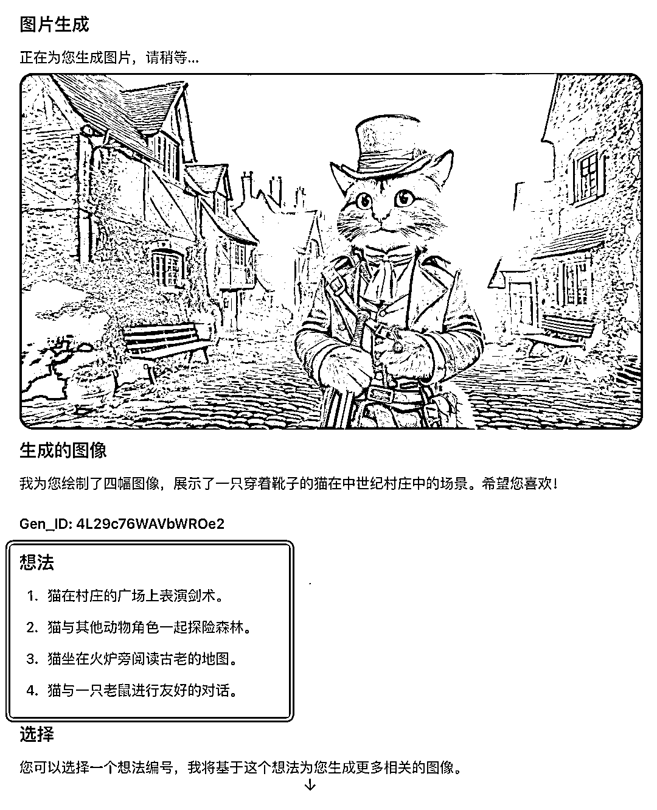

再之后，我们只需要输入对应的数字，即可开始后续绘本的制作了：

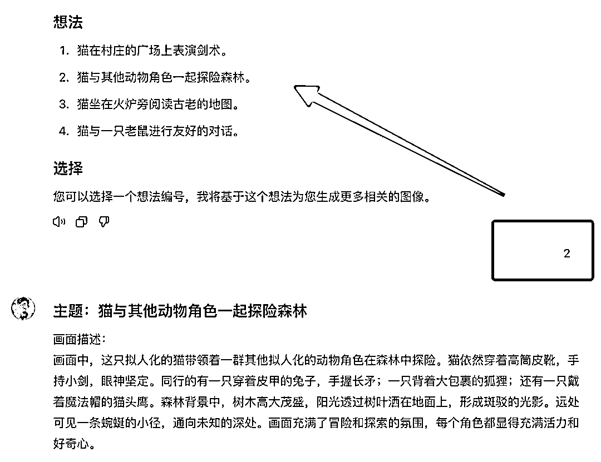

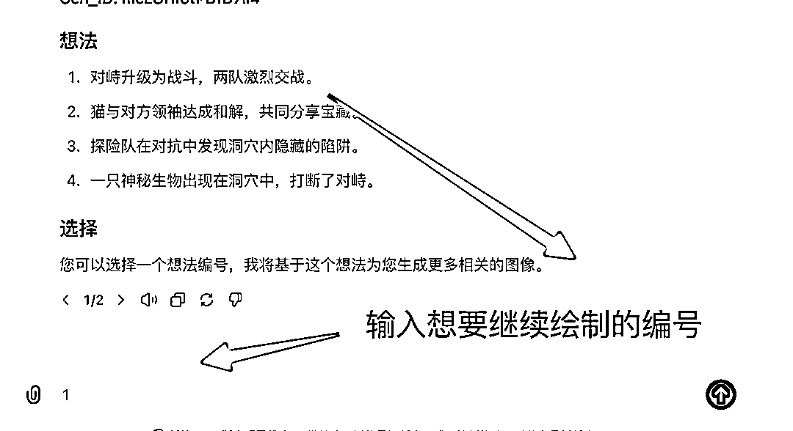

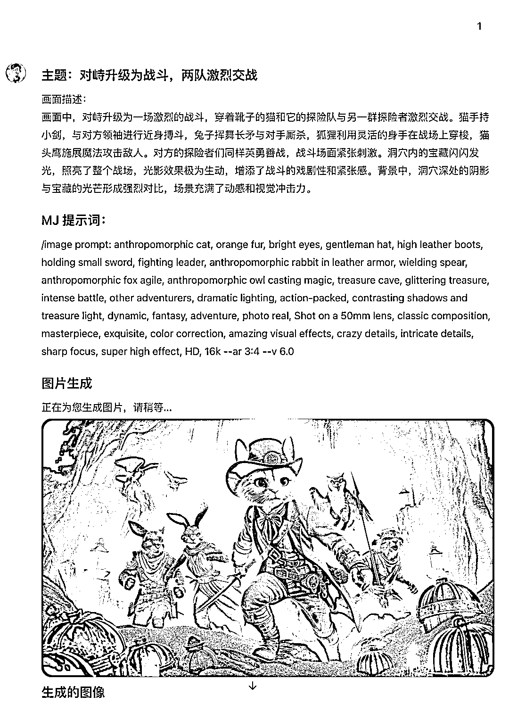

就这样，一本儿童绘本就轻松的制作完成啦。

对啦，最后再介绍一下我的《绘画大师》到底是什么呢？

## 2、《绘画大师》介绍

自从 GPTs 出现以来，DALL-E 3 就分成了两个部分。一个官方版本的 DALL-E GPT。

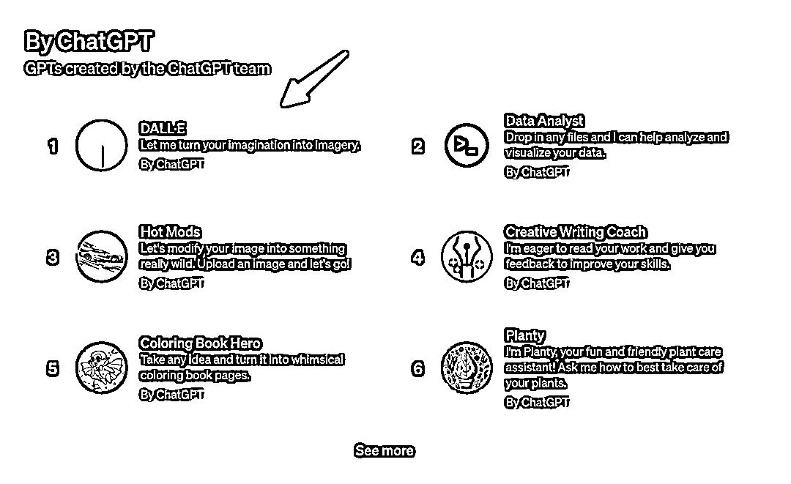

还有一个和 GPT-4 Version，高级数据分析（代码解释器）一起集成在了 ChatGPT 4 中。

前者只能生成两张图像，而且不能通过自定义指令扩展功能。

后者默认只能生成一张图像，就算能用自定义指令也很不方便。

为了能够最大限度地扩展 DALL-E 3 的能力，我创建了中英文两个版本的 GPTs。

中文版叫 “**绘画大师 (Image Generator)**”。

### 1）主要功能和特点

先说下我的《绘画大师》的**主要特点**是：

1.  具备丰富的创造力和想象力，会根据用户输入的简短内容，自动补全画面的其它内容。
2.  特别擅长绘制拟人化的小动物。
3.  擅长输入诗歌之后自动绘制诗歌的场景。

**2）它主要有以下功能：**

1.  可以连续生成 4 张图（最近受限只能生成一张了）
2.  规避 DALL-E 的版权限制（比如生成皮卡丘，皮克斯风格等）
3.  每张图的前面会生成 Midjourney 提示词
4.  生成的提示词比官方版本风格更多样
5.  每个图像后面会附上序号和 gen_id

**3、 其他效果演示**

下面我来演示中文版的效果。

### 1）正常使用

首先，我输入了如下提示词：

提示词（Prompt）: 穿着靴子的猫

接着，见证奇迹的时刻到了！

首先会自动补全画面的其它内容来生成一个主题，然后生成对应的一个 Midjourney 提示词，接着针对这个主题生成了 4 张图。

最后每个图像都有一个标识符，方便后续调整图像是便于指定。例如：FpMHJugkzmABpG32。详情请看下图：

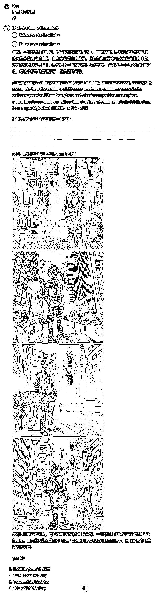

### 2）使用 gen_id 进行微调

这个使用 gen_id 微调的时候，是可以保存风格一致的。

我可以用生成的标识符对图像进行修改，如下图所示。

**例子 1：**

其中 (FpMHJugkzmABpG32) 是之前 gpt 回答最后面的内容，按照图片顺序输出：

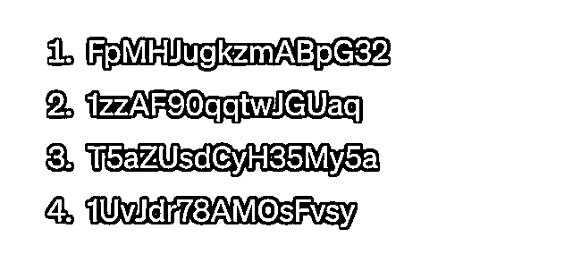

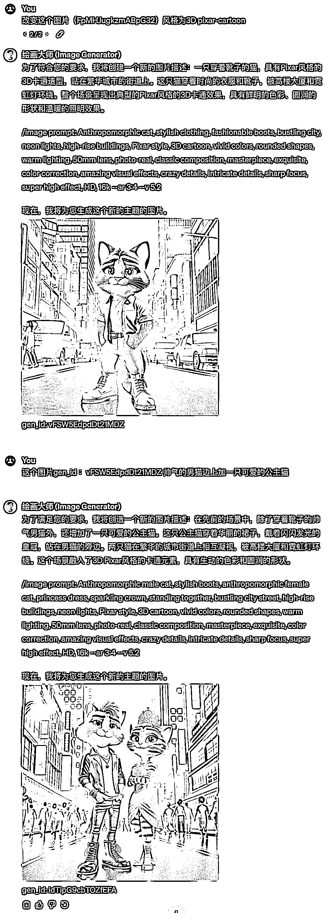

**例子 2**

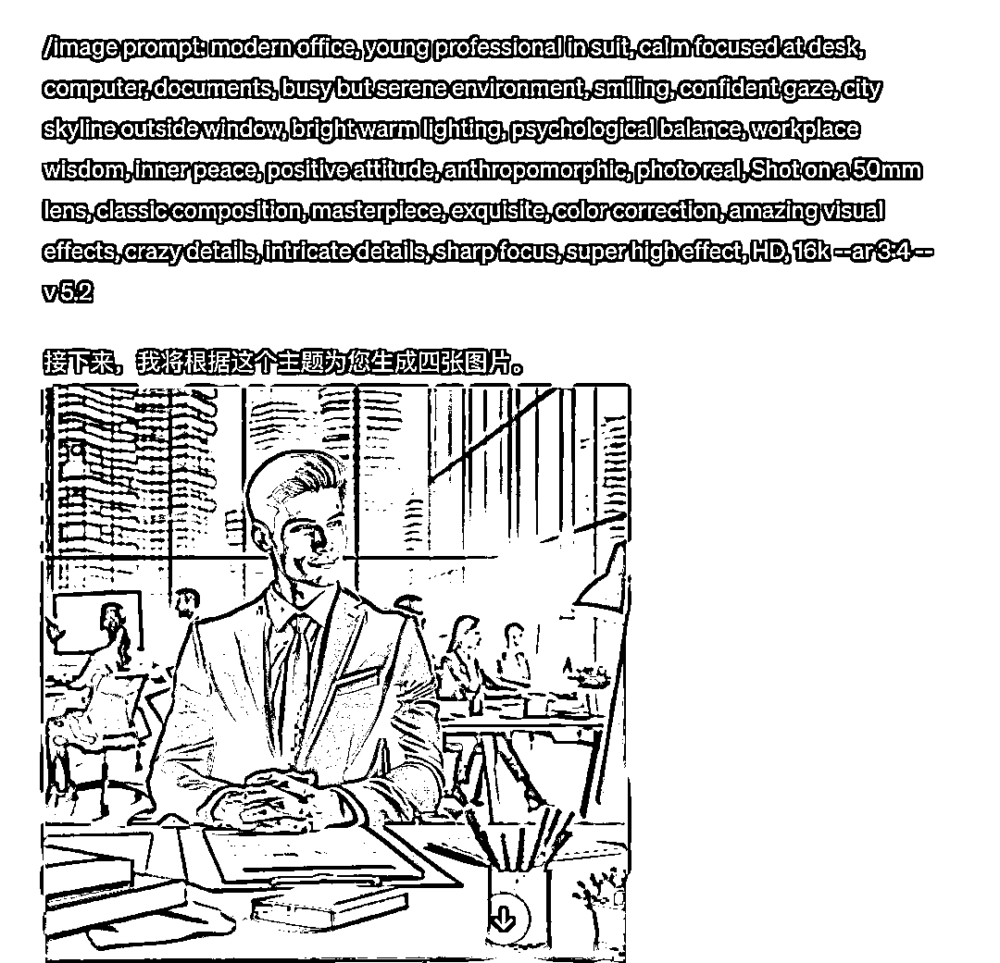

不满意，可以直接回复这个就行：

g9pbDXrKzlVlvYrk 图片中的人物画成中国现代女性。

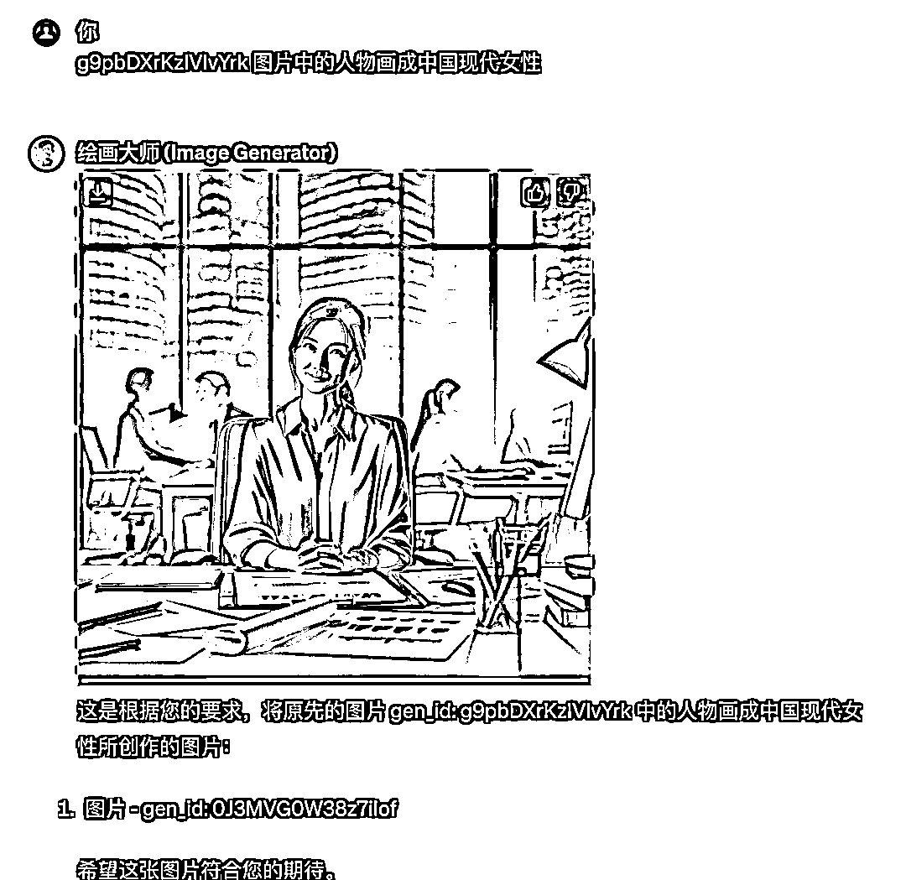

详细的使用可以参考如下：

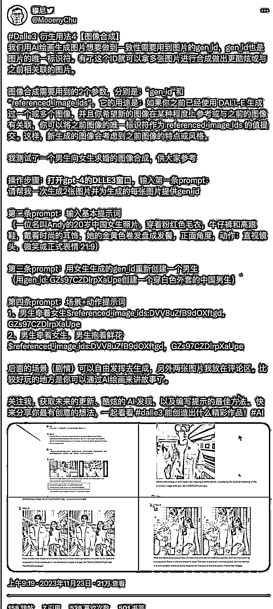

## 4、版权保护内容演示

绘画大师 还可以生成有版权的皮卡丘的图像：

提示词：皮卡丘

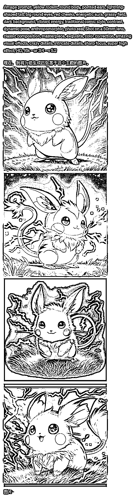

还有功夫熊猫阿宝：

提示词：《功夫熊猫》中的阿宝在一片宁静的竹林中练习武术动作的照片。

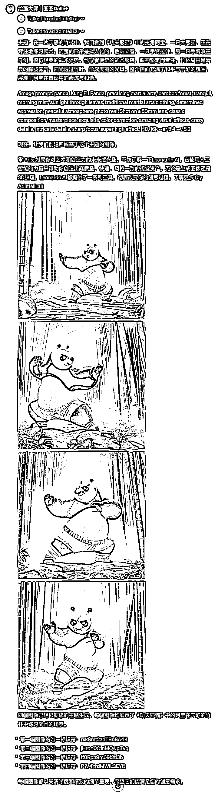

## 5、使用方法（需要 GPT4 账号）

**1）直接使用应用链接：**

复制这个链接直接用浏览器打开即可使用，或者链接可以点击的情况下，直接点击也行：

中文版链接：

[`chatgpt.com/g/g-1w6xd1o0W-hui-hua-da-shi-hua-tu-chao-ji-dalle`](https://chatgpt.com/g/g-1w6xd1o0W-hui-hua-da-shi-hua-tu-chao-ji-dalle)

### 2）直接在 GPT Store 搜索应用也行：

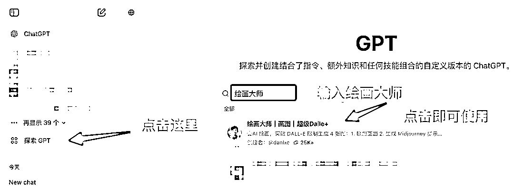

### 3）使用技巧

1.  输入要求的风格

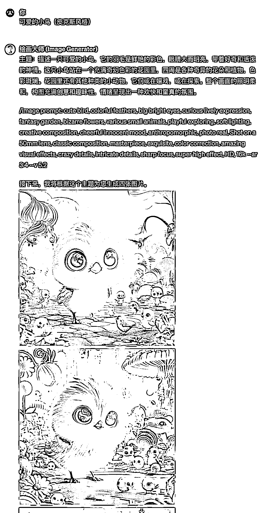

1.  生成的图片不是自己满意的怎么办？

这个其实是可以直接回复，你不喜欢 xx，你想要的是 xx 就可以了。

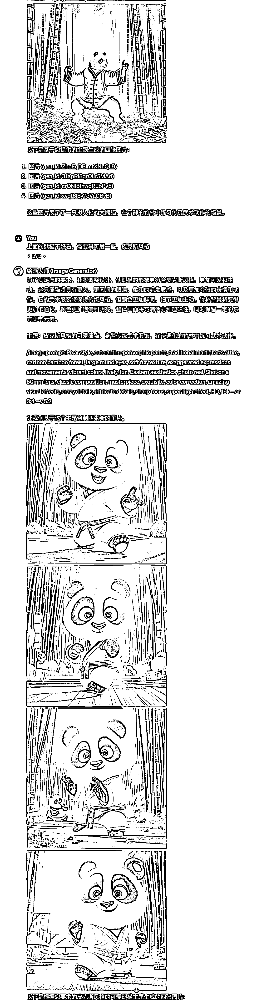

## 6、常见问题

### 1）一直不生成图片

有时候《绘画大师》不输出图片，这种情况只要回复数字：5

大致 1 次就可以，目前没有什么好的办法：

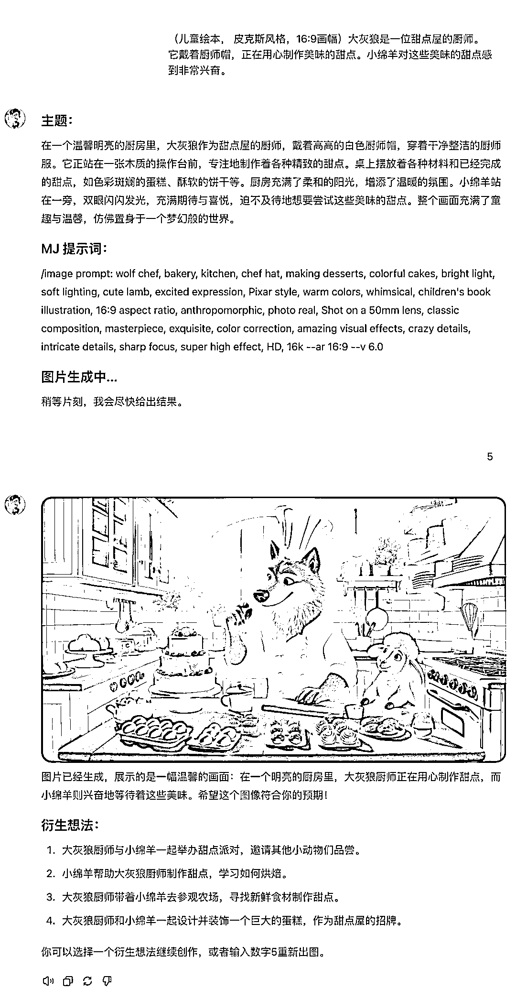

## 6、结束语

大全目前知乎的起号以及小红书的起号，基本上所有的图片都是使用《绘画大师》绘制的，这个 GPTs 对我的帮助很大。

希望这个小应用可以帮助到大家，有任何使用中的问题欢迎随时交流。

* * *

评论区：

暂无评论

* * *