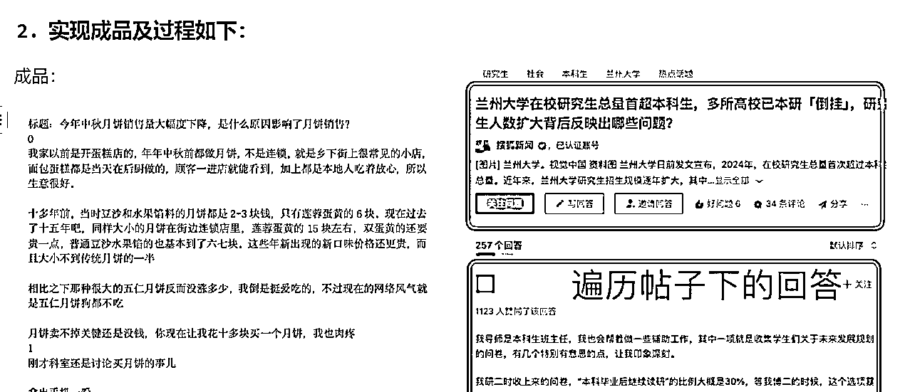

# 如何爬取知乎的帖子回答，来辅助文章的人工&AI 创作（附效果&实操&源码）

> 原文：[`www.yuque.com/for_lazy/zhoubao/vmv63l5gte7ca8ew`](https://www.yuque.com/for_lazy/zhoubao/vmv63l5gte7ca8ew)

## (21 赞)如何爬取知乎的帖子回答，来辅助文章的人工&AI 创作（附效果&实操&源码）

作者： 霸王

日期：2024-09-18

基于“好的素材导向更好的文章质量”的思想，我做了个知乎的文本采集 rpa，它能实现的作用就是把每一个“话题”下面的帖子和回答，都给爬取下来塞到一个 word 里面，成为某一个话题的很好的素材，为大家不管是接入 AI 写作还是人工的素材整理，打下一个较好的素材基础。

为了保证阅读的舒适度，具体的内容请移步飞书：

[**https://vge3py7ug6.feishu.cn/docx/T19HdqfcsoxgQ5xlqlyckLFkncd?from=from_copylink**](https://vge3py7ug6.feishu.cn/docx/T19HdqfcsoxgQ5xlqlyckLFkncd?from=from_copylink)

附注：

而关于为何对素材的质量如此重视，请详见这篇帖子，它阐述了素材质量对 AI 最终文章生成质量的作用：

[**踩了很多坑才知道--素材质量决定文章生成质量（附实操）**](https://articles.zsxq.com/id_hzremn8qrg0r.html)

#公众号 #RPA #AI 写作 #人工写作 #思路整理

* * *

评论区：

子瑾 : 用的扣子吗？

* * *