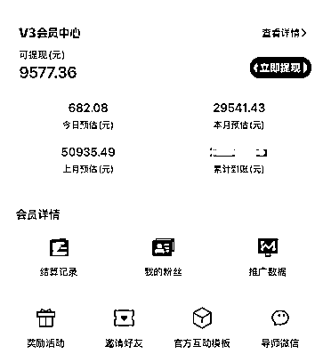

# 入局短剧项目半年，复盘和项目拆解

> 原文：[`www.yuque.com/for_lazy/zhoubao/lwb06ydg4wcfu9gf`](https://www.yuque.com/for_lazy/zhoubao/lwb06ydg4wcfu9gf)

## (15 赞)入局短剧项目半年，复盘和项目拆解

作者： 左哥

日期：2024-09-20

大家好，我是左哥，三月份偷偷入局短剧项目，中间经历平台各种波折，终于迎来了稳定阶段，今天分享一下这个生态的各种玩法和具体链路，希望对大家有所启发。

今年所有网赚圈的伙伴，其实都有一个共识，已经没有太多新项目有红利了，大部分还能赚钱的项目都是老项目新玩法，并且都有一定的门槛。

就像我们经常说的一句话：今年变强了，但是利润反而低了，有点像逆行扶手电梯，很努力地往前走，但是只能保持现状。

这个时候我们只有 3 个选择。

1、选择可能有增量的赛道，比如 AI 相关。

2、出海，去一些还有增量的区域，比如东南亚国家。

3、生态降维，去更简单的项目上面淘金，用更高级的打法，去整合更多利润。

左哥选择了第三种，目前也算拿到了一些成绩，接下来分享一下短剧这个项目的主流玩法，希望对大家有所帮助。

## 一、什么是短剧

我理解的短剧项目有点像**高配版的小说推文项目、低配版的切片项目。**

简单来说，就是把一些爽文小说翻拍成短视频的形式，快餐式剧情，很短的时间内多个爽点和冲突。

把这些视频通过各种剪辑分发到抖音或者快手上面，然后挂上链接，用户看到关键点的时候结束，只能选择充值看全集，只要用户充值我们就有**54-70%**的佣金。

## 二、短剧项目怎么赚钱

**目前生态链路：制剧方--短剧平台-分销平台-分销团长--分销达人-用户**

目前这个行业生态已经趋于稳定，没有很暴力的玩法，基本上在做的收入都比较稳定，模式足够轻，卖的也是虚拟产品，有足够的想象空间。

目前比较适合我们网赚圈的有三个打法，简单分享一下。

### 1、自营模式

**业务链路：单人跑通 SOP-矩阵账号-团队 SOP-每天大量分发素材-投产比打正放量-异业寻找增量**

招募专业的剪辑员工，**每个人 5-8 个账号，每个号每天发布 2-3 条混剪作品**，做垂直方向，专门做男频或者女频。

这个就是博爆单概率，可能一条视频爆了，就有几千上万的收益。

引用我们网赚圈的一句话，数量足够多，爆单就是必然事件。

这里有几个难点，也简单跟兄弟们分享一下。

（1）自营的前提是先有**案例**，也就是团队必须有一个已经拿到不错成绩的人。

（2）抖音账号要**实名**才能发布，目前一个人只能实名一个号，所以实名渠道也卡住了很多人。

（3）算好**投产比**，大城市人好招，但是成本高，小城市成本低，但是人难招，目前人效在 1.5W+算不错的成绩。

总结：自营模式比较稳定，比较适合**1-10 人的团队**，有条件的话，也可以多拓展几个方向，比如切片或者小说推文等。

### 2、代理模式

**业务链路：种子粉-裂变和引流-粉丝分级-持续运营-以量取胜-管道收益-私域运营-多重变现**

#### (1)业务概况

代理模式的逻辑就是万物皆可分发，通过引流或者买粉的方式积累第一批种子粉，然后教种子粉去剪辑分发+裂变。种子粉大部分都是以兼职或者副业的方式切入，所以执行和出单会比较弱。

所以我们一定要有一个用户分级的动作，把已经出单或者执行力比较强的伙伴，全部拉到一个核心群里，提供更好的教学和激励。

目前行业中用的比较多的分销平台就是好省短剧，可以高效的帮助团长管理好下面的代理和剪辑达人。

#### （2）流量获取

目前比较好的流量洼地就是抖音、小红书渠道，以自营引流为主，代发裂变为辅。

自营引流一般以自热为主，这个分享过很多次了，不展开讲，重点分享一下代发的模式。

代发的逻辑就是线上寻找剪辑兼职处理素材，再通过兼职代发到公域平台，大量地吸粉，这个模式比较适合小团队，有兴趣的可以交流一下。

### 3、CPS 模式

有点像淘客的模式，通过在公域投流广告引流粉丝到私域，然后卖短剧赚取相应的利润。一般以公众号或者企微承接为主。

但是今年出了很多类似红果短剧的平台和免费看剧的机器人，这个模式回本周期已经比较高了，如果没有低价粉渠道，不要尝试。

或者有二次变现的方法，比如除了发剧之外，再卖卖其他产品等。

## 三、需要准备什么

### 1、基建

手机、电脑、抖音账号（1-5 个），短剧分销平台，基础的剪辑教程

### 2、选择剪辑方向

搬运剪辑、混剪、燃剪、解说剪辑，不同方向难度和产出都不同，最好找相应的老师学习。

### 3、交流群

任何公域型项目，都需要一个交流渠道，这样每次规则、玩法有卡点的时候，可以第一时间解决。

## 四、大概产出情况

自营模式，**人效大概是 1.5W 以上**，如果成本在 7K 的话，招募 10 个人的团队，每个月就是 8W 的利润。

代理模式，一般有 500 人的核心群，每个月的管道收益大概在 5-10 万左右

CPS 模式，左哥没有尝试过，同行数据的话，大概半年左右回本，但是流量渠道比较难拓展。

### 项目的优点

1、足够轻，一个人也可以启动，做得好，一年几十万也有机会。

2、对于有私域的人而言，可以快速启动，相当于二次变现，赚 CPS+CPA。

3、项目已经进入稳定期，虽然利润不够暴力，但是能入局的话，至少有很长时间可以吃到利润。

### 项目的缺点

1、不够暴力，目前都是原创的打法，意味着门槛比较高，见效慢，很多同行赚不了慢钱。

2、生态比较保守，赚钱的团队基本都是各玩各的，没有圈子可以交流。

3、天花板比较低，目前做的比较好的，一个月也就几十万，百万级别就属于超头了。

## 五、什么人适合干短剧

1、有一定剪辑基础，每天能抽 2-4 个小时，执行力比较强的伙伴，适合副业/自由职业去切入，自营的模式。

2、本身有兼职、副业、创业粉等私域的伙伴，可以从粉丝中快速的洗一些粉出来冷启动，CPS+CPA 的模式。

3、执行力比较强，能接受赚慢钱的伙伴，前面慢、中间快、后面稳，自营的模式。

4、有带团队的经验，先打案例，人效做起来以后再通过人力矩阵去扩大利润。

## 六、短剧接下来的生态变化和红利趋势

短剧已经火了小 2 年了，中间经历过几次红利窗口，分别是行业红利、玩法红利、平台红利，造富了一群人，同样也淘汰了一群人。

现阶段，整个行业的生态已经趋于稳定，现在入局占好生态位，基本上都可以吃到稳定的红利，玩法和利润不会波动很大，坚持深耕基本都能赚钱。

玩法也趋于原创，顺应平台，目前抖音平台也有很大的流量扶持，起号相对简单。

但是因为之前搬运玩法和现在免费短剧出来以后，劝退了很大一批人，从生态的角度来看是好事，劣币驱逐以后，良币才能更好更持久的生存。

## 总结：

短剧一定不是一个暴力项目，但是非常适合现阶段新人入局，因为生态不会有太多起伏，入局即赚钱。

但是入局的门槛已经比较高了，无人带，没有精细化运营的模式，也很难有大的利润出来，我对这个行业的认知就是 3 个关键词：稳定、精细化、赚积累的财富。

* * *

评论区：

暂无评论

* * *