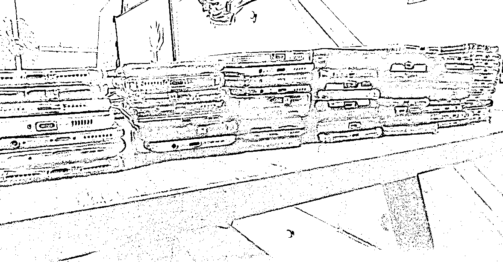

# 在小红书铺 80 个矩阵号，如何批量注册蓝 v 号、批量谈货源，以及批量混剪？

> 原文：[`www.yuque.com/for_lazy/zhoubao/xxqob1nocx6mw0pc`](https://www.yuque.com/for_lazy/zhoubao/xxqob1nocx6mw0pc)

## (精华帖)(187 赞)在小红书铺 80 个矩阵号，如何批量注册蓝 v 号、批量谈货源，以及批量混剪？

作者： 吴成

日期：2024-09-03

大家好，我是圈友吴成。

今年 4 月份加入生财，生财有各个领域的大佬，每一位在外界看来风光无限的大佬在自己所在的赛道做的风生水起，让我这个小透明一直不好意思分享自己的经历。

但，作为一个从底层挣扎起来的普通人，在大学毕业 10 年之际，分享自己最近的一段高光时刻吧。

也非常感谢生财平台让我看到崭新的创业新世界！

我本身是一个程序员，15 年踏入大城市深圳，跟大部分程序员一样，自学编程。

现在的我，已经不再年轻，虽然面临着 35 岁中年危机，也有房贷压在身上。

每每看着自己 2 岁的儿子，做小红书遇见的每个卡点，测品失败时的失落都无所畏惧。感谢体贴我的妻子，一直支持着我起起落落的这三年的创业经历。

由于在实体行业亏过大钱，受过无尽的煎熬，所以当我踏入生财这个社群，发现有这么多低成本轻资产创业的机会和项目时，我信心满满。

虽然这半年小红书创业小有所成，但也会焦虑于对未来几年的规划。

创业的前两年开了一个火锅店，还亏了大几十万，把我毕业这么多年辛苦积攒的积蓄亏了个精光。

同时家庭生活的各种开销也很大，我老婆为了可以更好的照顾孩子，全职在家养育我们的孩子，前两年找家人借钱筹来的首付买的房子直到今天还在天天各种延期，搞得焦头烂额。

创业不说需要大资金，至少需要有一笔闲钱，开火锅店几乎让我全部的资金消耗殆尽，同时自己也负债筹钱的首付，我已经没有力量去做任何需要资金门槛的生意。

一分钱难倒英雄汉啊！我只能靠低成本轻资产的生意取得成功！在我人生最低谷的时候，我的妻子没有对我有任何的指责，而是默默的陪伴我鼓励我，让我觉得无比温暖，给我莫大的动力坚持探索！

虽说初次创业像个傻逼一般的选择重资产的实体餐饮，让我内心体验了一把屋漏偏逢连夜雨。

最近几年也是一直在网上找着各种副业来做，有些小有成功，有些最后不了了之。

在生财挖掘的小红书电商带货这个赛道，慢慢摸索进去后总算舒了一口气了。

在做小红书店铺上，很多次想要放弃，在大的正反馈来临之前，一直不断的有问生财电商大佬@书豪各种小红书店铺选品和侧品以及运营实操方面的细节。

感谢@书豪让我成功的踏入了电商创业这条路，在我人生的低谷期解决了我实操和心态方面的各种卡点。

虽然小红书带货整体操作并不难，但是后来越做发现虽然能小赚，但是单兵作战赚的比较累，很多地方效率很低，把人忙的不可开交，从素材效率、剪辑效率、发货效率都耽误了很多时间，于是就研究了很多工具和很多批量化操作方法，注册了 80 多个号，做了半年赚到了 120 万。

我也知道很多圈友剪辑视频、选品测品、找素材有很多卡点导致效率很低下，今天我把我自己经营 80 个小红书号降本增效的方法以及工具等实操各个方面的细节分享给大家，不为炫耀技术，只是感恩生财在我人生的低谷期给我打开了一扇新世界的大门

具体的操作步骤我也整理到了飞书文档：[`halulxp5w5.feishu.cn/docx/PPcrdO11CodhE3xr2jZcP26tnTd`](https://halulxp5w5.feishu.cn/docx/PPcrdO11CodhE3xr2jZcP26tnTd)

这是我买的 80 部手机

* * *

评论区：

黄岛主(副业项目) : 学习了
无所从来 : 学习了
Meng : 厉害了[强][强][强]
Meng : 向大佬学习，已收藏，希望我做小红书也能这么厉害[奋斗][奋斗][奋斗]
脑海中的橡皮擦 : 80 个号，实名怎么解决？
爱拍照的 will. : 好详细 谢谢
群群 : 能请教一下具体的操作吗，愿意付费，请问怎么联系你
朱维涛 : 一个人操作 80 个号吗？那真的太牛了。即使有自动化工具，工作量也非常大。文章里主要讲的技术细节，希望多分享点运营的细节。

* * *