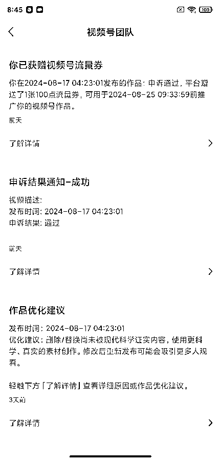
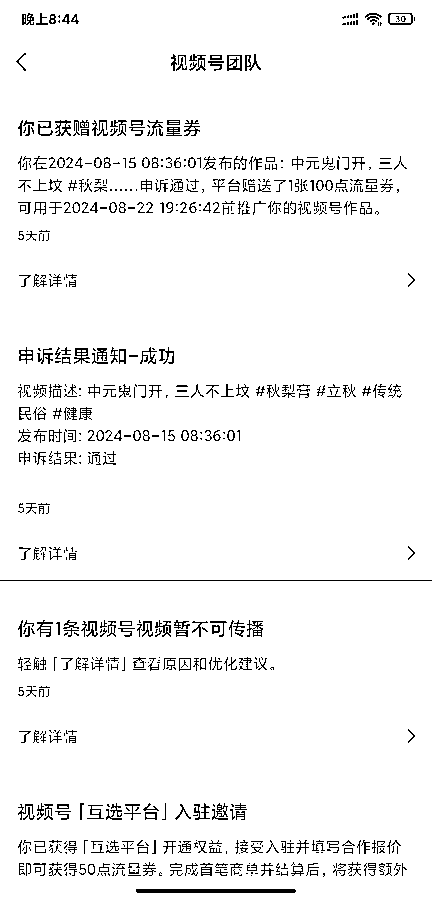
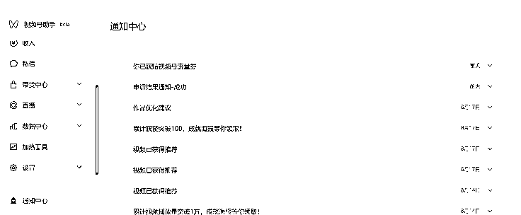

# 视频号带货如何降低违规率

> 原文：[`www.yuque.com/for_lazy/zhoubao/rxk64ozczgdyd6wo`](https://www.yuque.com/for_lazy/zhoubao/rxk64ozczgdyd6wo)

## (26 赞)视频号带货如何降低违规率

作者： 韩商量·有内韩

日期：2024-09-02

今天我和大家聊聊视频号带货怎么降低违规率。

因为这是一个连续剧，所以单独看这篇主题，你可以会感觉没头没尾，建议你看一下我前面分享的其他干货主题：

1、千万播放、条条爆款的口播视频，是如何实现的？

可以从我头像进入，也可以点击链接：[`t.zsxq.com/G7HUx`](https://t.zsxq.com/G7HUx)

2、打造条条爆款的口播带货视频，首先要学会判断素材文案是否是真的高爆率。

可以从我头像进入，也可以点击链接：[`t.zsxq.com/gmmkp`](https://t.zsxq.com/gmmkp)

3、我做口播带货是怎么提升爆率的？

可以从我头像进入，也可以点击链接：[`t.zsxq.com/Kp69u`](https://t.zsxq.com/Kp69u)

我准备写完这个主题后，下一篇主题开始写爆款文案案例的实战拆解，讲述我创作每一篇爆款口播文案的心路历程，也是纯干货输出。

如果过程中有一些疏漏的点，请大家留言给我，我根据需求补充相关主题。

今天就先讲讲这个降低违规的事——

一提到视频号带货，总有人泼冷水，说视频号违规率高。

但是，就我自己做口播带货以来，我的违规率是极低的！

所以今天我给大家分享一下我是怎么做到的。

说视频号违规的朋友，你说哪不违规？

我明白告诉大家，看我主题的朋友，大多是互联网的玩家，而我却是一个互联网的开发者，从事开发互联网平台工作 16 年之久。

玩家的很多违规，对我们来说也是无奈之举，以前我们做电商平台的时候，违规关键词库是随时接受指示进行补充的，有一次我接到指示，麻将两个字都是违规的，所以麻将牌、牌机都得下架，你跟谁说理去？

规则是人家平台的，平台之上还有大平台，不要对抗规则，顺应规则赚钱就行了，没什么可抱怨的。

带货赚钱，就是要在人多的地方卖东西，抖音流量那么大，我们还是从抖音转战到视频号的，不就是因为视频号相比抖音要更好做一些嘛？

对我来说，视频号目前已经是比较好的带货平台了，至于抖音顺手的事。

我做口播带货，打的品类不多，大方面来讲，有百货也有养生品，接触过的文案，从内容结构上讲，都是面向中老年人群的。

我们出现违规，无非以下几种情况：

1、内容违规。

2、被错杀。

3、被举报。

我先把这三类违规情况讲一下，最后讲一下违规终审的机制和规避措施。

一、先讲内容违规这个问题，大概有几个方面：

1、话题违规；

2、诱导分享违规；

3、诱导下单违规；

4、使用了违禁词。

这话题违规的事吧，真的是看道德底线：

上来就说视频号违规率的朋友，我觉得咱们客观点，扪心自问，你干的那事真的就不是违规的事吗？

这几天，口播带货几乎全民在打急救毯、应急蜡烛之类的。

先不说文案，大家凭良心说，这东西对普通人有用吗？你自己会用吗？

我可以负责任地说，我卖的一切产品我都会用，而且是天天用。

我卖的牙粉，我天天刷牙都在用，我的团队也在用，最近我们卖的秋梨膏、玉灵膏，我和我的团队都自己吃。

要知道，我可是个户外运动的深度爱好者，登山、徒步、重装创越、潜水、攀岩都搞的，我只有在野外的时候才会准备这个急救毯，所以这就是小众产品。

几块钱的东西，竟然能上千万上千万地走量，靠的不就是文案吗？

那这文案大家看看都是啥？

宣传第三次世界大战，宣传冰川时代就要来临......

这是制造谣言、传播恐慌啊，平台限流还在其次，真要有人报了网警，这是要依法办事的，按法律至少也是个行政责任，这得拘留 10－15 天，再罚款！

说起网警，去年那爆火的狗血文案，就是那个小姨子跟他爸跑了的事，就是有人报了网警，好像是当事人被拘留了 10 多天。

我国法律里明确有一条，叫做公序良俗！

狗血文案的话题都是违背伦理的，违背法律的！

赚钱没有错，但是这种文案煽动的就是中老年人，这和线下卖黑五类有什么区别？

所以这办的就是个违规的事，就别说平台违规率高，就这种文案被限流还要怪平台，有点不讲理了吧？

我有精神洁癖，所以这种涉及到扰乱公共秩序、违反公序良俗的话题我不但不写，我还不拍。

人要有是非观的，这种话题已经触碰到社会的道德底线了。

老吾老以及人之老，你把父母代入消费者，你父母这么上当受骗，你是不是也义愤填膺？

所以这种话题本身就是违规的，咋写也违规，守紧道德底线，这个违规点是不是就没了？

至于诱导分享、诱导下单、违禁词之类的，文案内容检查调整一下就可以了，可以大幅度降低违规率。

很多朋友习惯搬运别人的高赞素材，拿过来就去重混剪，说的什么内容根本就没看。

甚至是导出文案，自己拍或者给数字人拍的时候，也都不检查修正。

不能搞幸存者偏差啊，不要踩踏平台红线！

二、关于被错杀的问题，其实就是 AI 审核的误判，或者终审的审核人员的主观上做了一个错误的判断。

这些是可以通过申诉，申诉回来的。

我自己的违规基本上都可以归类被错杀，因为我的视频违规申诉成功率基本上就是 100%。

这种申诉通过的底气源自于我对自己文案的信任。

至于为什么会出现错杀？有几个可能，流量大幅波动，会触发更高层级的后审核机制，甚至是人工审核，尤其是人工审核更容易错杀，我后面会讲这个问题。

三、关于被举报的问题，如果文案没问题，就算是被恶意举报，问题也不大，就算是暂时限流了，也可以申诉，可以归类于错杀。

说正经的，现在触发违规很大一部分就是因为举报，而且举报的指定是同行，也不然是嫉妒你，要不然就是你做了什么对不起人的事。

所以抛开恶意举报不谈，其他同行的举报都是有原因的，基本上就是因为你侵犯了人家的著作权或者是肖像权。

肖像权不用说，就是你直接搬运了人家的素材，著作权涵盖就比较广了，洗稿、抄袭都算。

很多人觉得，自己用的素材都报备了，为什么会有人举报我？

请问你给谁报备了？

现在做短视频带货的朋友很大一部分都是加入了一个社群，有极个别的社群，拿一个爆款案例扔进群，说可翻拍，然后让你报备，扣你 10%的文案版权费。

问题是，他这版权费没给人家原创作者啊。

我作为一个原创玩家，深知维权之艰难。

视频号虽然对原创保护力度比较大，但是原创维权的流程太过漫长，需要准备的资料非常多，我每次创作完后，我会保留飞书创作的时间截图、口播录制软件的时间截图、剪辑时间截图、首发时间截图、首发账号主页等。用飞书创作的原因是飞书是服务器时间，时间不可造假。

需要维权时，每次都要上传这些证据，非常麻烦。如果遇到洗稿的，还很难维权成功。

这种情况出现后，你觉得被侵权人是花时间精力在平台继续维权还是直接用更简单的方法点你个举报？

要知道，洗稿的往往是抄了爆点后再胡改一通，这个前后内容就无法呼应了，说白了内容已经都是造假了，这种情况，被举报必违规。

要知道，现在各个社群的主办方，互相之间的渗透很严重，信息同质化近乎 100%，这种情况下，选带货社群就不如跟着原创走了。

否则，你就好像是花同样的钱买了个盗版书，天天提心吊胆。

大街上走路肯定是牵着原配的手比牵着小三的手安心啊！

前几天，同样一个原创玩家跟我吐槽那个某社群，搬运我们的素材、抄袭我们的文案从来不问，还舔着脸收自己社群人的 10%版权费。

在这样的社群，达人被维权导致视频下架流量断了，肯定也委屈，因为该给的版权费给了呀，只是给错人了。

朋友问我这种事怎么杜绝？

我说真没办法，除非你不给他留活路了，就起诉他，然后搞个财产保全，冻结他资金账户，打两年官司，把他弄死？

也不是什么深仇大恨，没这个必要。

而且你弄死他一个，还有第二个第三个。

说到这呢，我只能说，跟着原创走，不见得不违规，但肯定是比搬运人家原创的文案和素材违规率低。

好了，上面的全部揭过，我现在讲讲纯纯的安全带货技术问题：

如果视频号还没升级为纯 AI 审核的话，那么所有的违规限流的终审都是人工，包括抖音。

别问我怎么知道的，我是个行业内人士，我是上市互联网公司的产品总监，我在互联网公司时就是定制这种规则的人。

不管是被举报、还是系统排查出现异常，都会推送到一个终审的编辑部门，这个部门的每一个人一天 8 小时要负责审核 800 个左右的账号。

你算一下，他平均一分钟要审核多少个？

就是几秒钟一个！哪有时间看你的内容？

这些编辑，就是纯主观判断，但是这个主观判断也是有依据的：

1、看头像、简介，有没有违规！

2、看主页 30 条内的作品有没有 5 条或大于 5 条作品违规。

3、不足五条的，看是否有且仅有。

然后瞬间决定，点你还是不点你。

至于什么叫违规，就是他觉得你是灰产、是垃圾广告就点你。

有没有例外？

当然有了！

这个例外就是他们还有个不成文的规则：

对于超过 10 万粉的账号，他们怕错杀，就会非常谨慎。

（所以 IP 号确实抗揍，但是 IP 成材率低啊。）

好了，这个内部的终审规则都告诉你了，怎么利用审核漏洞自己琢磨一下吧。

总结一下，如何降低视频号带货的违规率啊：

1、了解平台审核机制。

2、规避敏感话题。

3、规避违禁词、诱导分享下单等文字。

4、原创且内容要真实。

5、跟对人。

以后的主题，除了爆款文案拆解外，其他的我要构思一下了，大约会有 5 个方向选择：

1、如何选择定位细分赛道，并建立自己的优势。

2、怎么拍出优秀的口播作品？

3、入坑短视频带货，别只看别人晒出来的结果，擦亮眼睛仔细推敲。

4、短视频带货省时省力提升爆率的细节玩法技巧。

5、做短视频带货为什么要更多账号？（这个涉及到底层技术上的解释）

另外再啰嗦几句，最近大家打数字人比较凶，我这去谈了个数字人软件的 7 天 VIP 使用权限，有兴趣的朋友可以找我要。

* * *

评论区：

青阳。 : 申诉可以举个例子吗？像提及民俗节日的这类违规还是挺多的，申诉是怎么申诉的呢？都需要提交什么呢？
韩商量·有内韩 : 申诉∶尊敬的审核人员，我只是做了公认的风俗习惯的一个普及，并未涉及到封建迷信或者是夸大营销，我的作品内的所有内容都是真实的民间习俗和千年的民间谚语。我是在搬运传统文化，没有违规。请您明察，非常感谢。

* * *