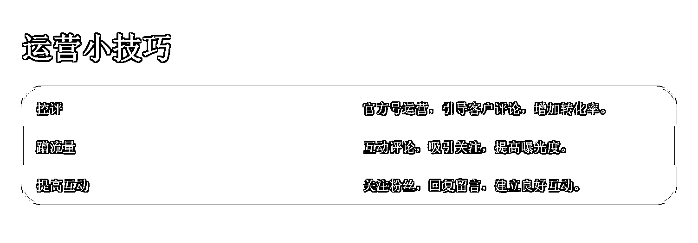

# TikTok 淘汰赛：残酷竞争中细嗅蔷薇。

> 原文：[`www.yuque.com/for_lazy/zhoubao/ghhg2d5ftx02dmkq`](https://www.yuque.com/for_lazy/zhoubao/ghhg2d5ftx02dmkq)

## (11 赞)TikTok 淘汰赛：残酷竞争中细嗅蔷薇。

作者： 梁小伟

日期：2024-09-03

最近，总是忍不住焦虑，市面上又有什么新玩法？别人又搞出了哪些“骚操作”？可每次反复琢磨后，我总是回到同一个结论：哪有那么多“骚操作”能让你一夜暴富？真有这种事，当你听说时，它大概率已经过气了。

做出海电商，尤其是当你的团队已经有了一定积累后，真正的难点早就不再是那些基础技能。选品怎么选？剪辑怎么剪？达人怎么找？流量怎么搞？这些问题不过是初期发展阶段的商家最关心的。

随着市场逐步成熟，信息高度透明，商家的打法越来越同质化。找优质达人？（美区有 60 万达人可选），大家都在做。广告投放、账号运营，这些套路已经是公开的秘密。既然大家的手法都差不多，那么接下来，拼的是什么？

入局者要巩固并扩大，未入局者则需要超越并模仿。

## 当前美区的两种开品思路

### 1\. 深耕供应链的头部商家

这些商家和供应链的磨合如同老夫老妻，默契十足。他们的卖货优势不是一天练成的，而是长期积累的结果。可能他们的核心 SKU 只有十几个甚至几十个，但这些 SKU 都是年复一年精挑细选、不断迭代打磨出来的。

这类商家敢打敢拼，愈战愈勇，充分利用了亚马逊的“飞轮效应”。

**亚马逊的飞轮效应：**

贝佐斯提出的飞轮效应，适用于所有企业，只是操作空间不同罢了。亚马逊的成功，不仅在于它是全球最成功的电商之一，更在于贝佐斯那种坚定不移的商业信念。他自亚马逊成立之初，便始终如一地专注于服务消费者，这种专注，孵化出了 AWS 等与核心业务看似无关但却大获成功的服务。

这些头部商家早已布局多渠道，提升了抗风险能力。独立站、亚马逊、TikTok、Temu、Shein、速卖通，每一条渠道都在他们的掌控之中。

这种多渠道布局，是他们面对市场变局的底气。毕竟，出海电商是个重资产的游戏，从供应链、上架、运输、售卖到回款，整个周期动辄需要 1-2 个月。如果遇到滞销或决策失误，可能半年甚至一年都卖不出去，那库存、仓储、销毁的成本就足以让人头大。

还记得在 TikTok 和 Temu 崛起之前，亚马逊的卖家们就已经在研究如何通过站外折扣、Facebook 帖子清库存、引流站外了。

2023 年，一些品牌和亚马逊大卖家在 TikTok 的闭环电商中尝到了甜头，便更加激进地扩展站外渠道。他们有自己的供应链、商标和电商积累，通过多渠道卖货来分摊风险，这就是他们敢打敢拼的底气。

供应链的优势不是随便能复制的。到 2025 年，肯定会有更多曾在亚马逊观望的卖家涌入 TikTok，试图分一杯羹。

### 2\. 专攻爆品和白牌商品的商家

他们通过数据平台精准分析，寻找市场上的无商标品类来跟卖，或者选择白牌普货进行批量测试。通常通过资料店进行测品，看看是否出单后再正式发货，以此提高开品成功率。还有一些商家压低价格，拼命抢流量，只求在激烈的竞争中获取订单。

对于这些商家来说，能卖就先卖，市场不行了就立刻暂停。而 TikTok 推出的保证金政策，只会让这类玩法越来越难，因为成本正在增加。

如今，做爆品的核心能力有两点：

1.  把控产品时机的精准性；
2.  对海外市场的深刻理解。

这些能力，早在独立站的 FB 爆品模式中就被无数次验证过了，如今的 TikTok 爆品模式不过是延续了这一思路。回头看，这种模式能在残酷竞争中存活下来，真的是靠硬实力。信息透明化，大家都变得越来越专业，你会的，别人也会；你不会的，别人早已学会。

以独立站爆品打法为例，一个专业团队从建站、找供应链到投广告，几乎可以在一天内完成整个流程，半小时开一个单品站，素材拍摄、广告投放几乎是瞬间完成，3-5 天内就能拉起销量。这样的效率，只有亲身经历过的人才知道有多牛。

## 流量渠道分析

目前商品带货的路径主要有四种：直播、达人、自然流、投流。

在美区，2023 年下半年取得大成效的商家，大多选择了大量建联达人，加上重金投放广告。今年的玩法更是五花八门，有些玩家紧跟平台布局直播，搭建直播间，自然流的策略也在加速推进。

投流的门槛实际上在逐渐降低，比如商品卡广告和 GMV Max 广告的推出，投放变得越来越简单。最终，所有的一切都会回归到产品和素材的本质。

### 投流策略

投流的核心在于你的产品成本和售价，能否有 40%以上的利润覆盖投放成本。如果素材获取和迭代顺利，投流并不复杂。

达人素材、自拍素材，这些都可以持续迭代，无非是愿不愿意花钱。花钱了效果不好，换品、换素材再测试。效果好了，抓紧建计划放量。就这样一个逻辑。

投流的核心其实并没有什么神秘之处，我之前写了大量的文章，在此不过多赘述，大家可以查看我的其他文章。

**商品卡广告的玩法：**

商品卡广告就是商城卡片（产品图、产品描述），客户通过搜索或推荐看到商城里的你的产品。

具体操作步骤如下：

1.  准备 10 个不挂车白号。
2.  批量收集互联网素材。
3.  批量拍摄产品素材。

每天每个号发 3-5 条不挂车视频。从标题、内容、标签、视频标题、视频内容、视频场景中埋关键词。这些关键词包括你的产品关键词、常见关键词、用户群体经常搜索的关键词、客户经常问的关键词。

日积月累，假设我一个月埋 10 个关键词，这个关键词一搜，基本都是我们的，那这个事情就成了。店铺后台的热搜关键词调研功能也很好用，接着换十个关键词继续埋。你会发现商品卡搜索量会慢慢增长。

这时，你可以开商品卡广告，效果很好。如果你的产品价格有一定的优势，对比其他产品，效果会更好。

### 直播策略

直播是今年平台的主发力方向，补贴和平台政策都不错。有基建能力的团队，可以考虑布局。

由于我自己没有亲自测试直播，所以在此没有太多可以分享的实战经验。不过可以留意平台的广告金额补贴、直播补贴等相关政策。

### 运营小技巧

在做以上所有带货动作的时候，先思考一下，做的事情是否足够细致？细致到什么程度呢？以下是一些案例来帮助理解：

**1\. 控评：**

我们在做投流素材时，首先会做好官方号的运营和搭建。

起号时，选择账号调性，搭建基础结构。刚开始发布自然流，我们会不断迭代测试创意和脚本，从中筛选出播放高、转化高的创意脚本，每天发布 3-5 条。超过 1000 播放的，投 2-10 美金刺激自然流（24 小时内），做好标题或内容引导，引导客户留下评论。

挂车投流视频时，找 2-10 个白号。

白号使用一些老外真实头像或有 5-10 条生活片段素材的号，通过 AI 将亚马逊或其他渠道的真实评论采集出来，结合功能、真人购买、点评等文案，增加转化率。

**2\. 蹭流量：**

像个街溜子一样，每天拿着官方号去其他同类型账号下猛夸博主和账号，让对方记住我们。可以夸赞、互动、分享见解，也可以创造一些吸引眼球的神评论。

**3\. 提高互动：**

当账号粉丝不多时，每个粉丝都要关注，然后去给他们回复、留言、暖评，让对方记住我们。这样后续我们的作品发布时，老外也会过来暖评论。

### 素材的小心机

**1\. 降低拍摄难度：**

拍摄直接分镜流水线式。通过 Pipiads 找 10 个创意素材，不露脸的视频广告脚本，直接提炼到自己的产品上。每次多账号多创意混合发，10 个创意素材，2-3 个出单效果好，流量好，开始猛干和优化。

**2\. 挖掘不同的人群和需求：**

同样一个摆件，通过不同场景的拍摄，可以转换成多种用途。

例如：

1.  拍摄内容是汽车相关，他就是汽车摆件。
2.  拍摄内容是情人节礼物，他就成了礼物。
3.  拍摄内容是办公室，他就成了办公室摆件。

**记住，市场永远在变，你的步伐必须更快。别停下脚步，做下一个突围的赢家！**

* * *

评论区：

暂无评论

* * *