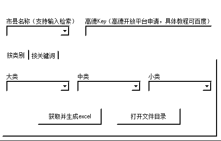
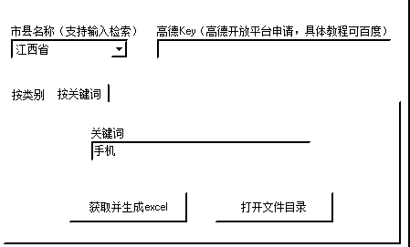
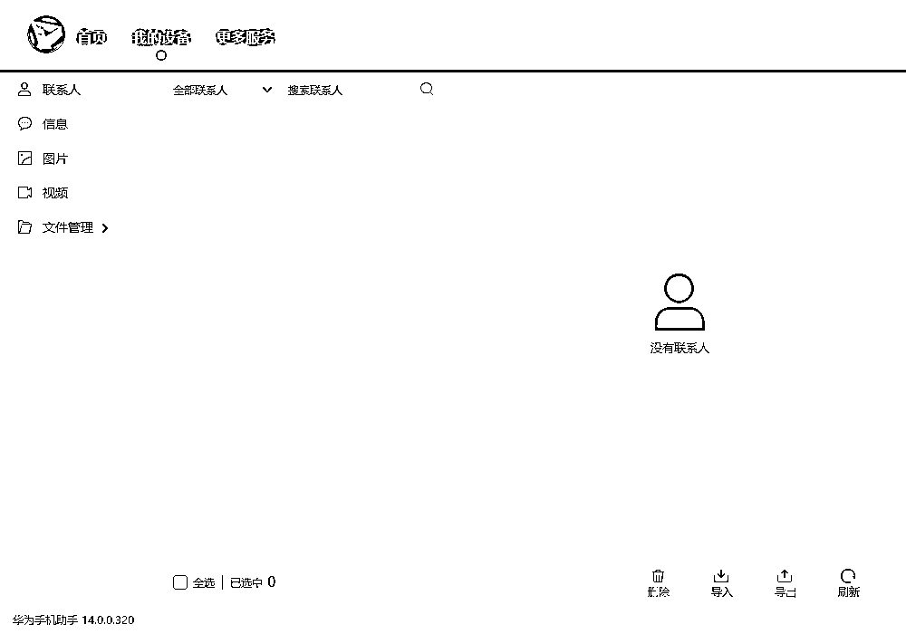

# 通过地图搜索添加商家微信实现简单高效的赚钱方法

> 原文：[`www.yuque.com/for_lazy/zhoubao/toq4cam1em8g09hl`](https://www.yuque.com/for_lazy/zhoubao/toq4cam1em8g09hl)

## (33 赞)通过地图搜索添加商家微信实现简单高效的赚钱方法

作者： 流量卡批发零售

日期：2024-09-02

哈喽大家好。我叫子赫。

以前跟大家分享过一些，闲鱼兼职粉引流日变现 3000+，如果通过线下操作月收入过万，等一些我这边实操过的项目和方法。为一些圈友提供了一些思路。有部分圈友也跟着我做过的实操了下，有起来的也有没坚持下去的。

今天这篇文章跟大家分享一个通过最笨的 方式就可以实现的赚钱方法。

为什么说是最笨的方法呢？

答：因为只是天天重复的操作加 V，加客户 V，主动添加。一天加几百个人。

微信号在哪里找那么多？

答：高德地图，百度地图。上面基本上商家的微信联系方式都有。

听到这里是不是觉得是个人就能做。

其实是个人也能做，但是也不是说所有都适用，因为如果你只是挨个地图搜索，挨个输入手机号进行添加客户，效率太慢，然后通过率 也不高，多了也会出现频繁。

下面我来跟大家该如何操作，然后我是如何变现的。

首先我们因为是做流量卡的，利润呢就是，用户使用充值使用我们就可以赚钱，这样我们就只需要想办法吧流量卡推广销售出去就行。

所以我们就想到了把利润分大部分给代理，自己留 1-3 元利润既可以。

我们的目标群体呢，针对的可以说是所有人，因为每个人出去都需要流量，所以每个人都是我们的目标群体。

哪里有固定的用户群体和流量呢？

答：实体店，手机店，电脑打印店，超市，菜鸟驿站，百货超市，等等都是有固定的客户群体，我们只需要跟他们进行合作就可以销售推广出去。

那么如何加他们的联系跟他们进行合作呢?

答：主动出击，初步合作洽谈。赚钱的东西谁也想。

现在基本上每个实体店都在高德，百度地图上都有显示，他们的联系方式都在上面。

操作方法 1：

直接再上面收集联系方式，收集一个，添加一个，（效果慢加多了会出现频繁）

操作方法 2：

直接再上面收集联系方式，收集一个，导入到电脑表格，然后通过电脑导入到手机，通过添加新朋友然后挨个添加（收集联系方式就比较慢了）

操作方法 3：

通过电脑采集软件进行采集，

然后再进行导入到手机，

通过添加新朋友(用这种方式可以避免频繁）然后挨个添加（效率高，添加的快，一天添加大几百人问题不大）最后再进行人工搜索捡漏。

目前已经操作 1 年，通过这种方法添加过来的代理，5000 个有的代理卖的多有的少所以不一点点说明这些了。目前月均收入 在 10W 以上，每个月都在递增。

这种方法是最笨的方法也是最简单的获客方法，每个人他都有自己的需求，只要你的量起来了，加的用户足够多，那你就会成功。

以上仅是我自己的变现方式。唯一要准备的就是 多注册几个 V

* * *

评论区：

流量卡批发零售 : 因为都是店家，商家，所以通过率很高。

* * *