# 从 0-1 分享玄学+手串可以怎么做

> 原文：[`www.yuque.com/for_lazy/zhoubao/yt2fuwu5bzv38s56`](https://www.yuque.com/for_lazy/zhoubao/yt2fuwu5bzv38s56)

## (28 赞)从 0-1 分享玄学+手串可以怎么做

作者： 匠叔

日期：2024-09-03

你好，我是匠叔，一直在探索玄学的商业化可能。

在 6 月份的时候，我开始探索玄学手串的可能性，

产品是自己设计的手串，

转化模型是**“根据用户八字推荐或者设计手串。”**

流量来自于自己现有用户和小红书。

几个学员一起跑。

3 个月，大概算了一下，营业额将近 10W。

单价最高的一款是 4077 元，是小红书来的客户。

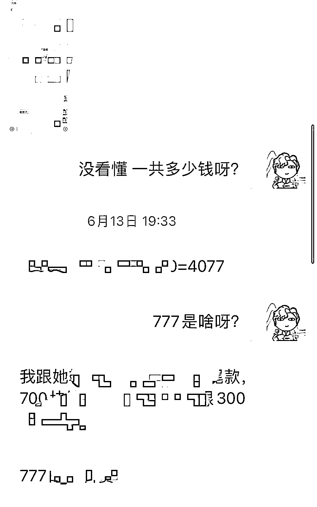

普通款一般在 498 以上，888 居多。

为啥我觉得玄学手串这个可以做，是因为它有三个非常不错的优势：

**第一：市场被教育的好，入局 0 成本**

“好运手串”“水晶手串”“疗愈手串”这些关键词目前已经被做的很好，你不需要去过多解释背后的逻辑，用户本身是信任的，这对很多生意来说特别重要。

如果一个生意还要有解释成本，还要给用户去解释你这个为什么有用，那这个生意除非你有足够多的钱，否则很难做成。

线上做水晶基本上就是 0 成本，你卖了之后再进货就行了，不需要压货，算好成本。

一开始是不建议压货的，压货其实更多的是为了去降低成本，一开始哪怕利润低一些，不需要投入，就没有风险嘛！

**第二：公域引流简单**

我们玄学最难的是引流，不是说内容不好，主要是封的跟举报的太多，围绕着水晶手串来说，基本上是完全不违规的。

水晶手串+一些玄学内容甚至加上一些电商内容，引流是特别厉害的，这个后面会给大家讲清楚。

**第三：变现后复购容易**

水晶手串有一个特点，就是用户不可能经常买，基本上买一串能带一年，下一次可能就是明年了。

但是我们加上了一些玄学，这样用户她不复购手串，她可以复购玄学，这样的话整个的复购频次就上来了。

所以组合起来就不错。

那今天，我就从三个角度来分享一下如何去做水晶：

**1、如何设计产品**

**2、如何引流**

**3、如何变现**

# 1、如何设计产品

所有的商业，我认为最重要的是产品，你得知道自己靠什么变现才能说其他的。

产品设计我分享三部分：**1、产品品类；2、产品定价；3、产品设计思路**

## 1、产品品类要基于用户需求而不只是特性

水晶是有基础的功能的，大家去搜一搜就会有很多。

比如粉水晶旺人员，黄水晶旺财之类的。

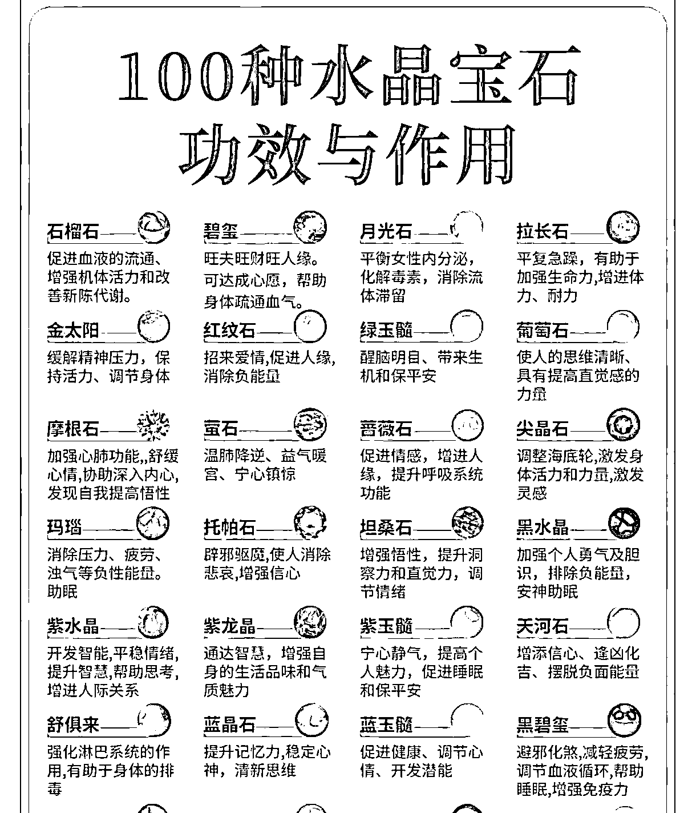

传统的分类是基于水晶的不同分类，这样其实类别很多，作为没有供应链的新入局的人来说，不好卖的。

因为来一个用户你给他特别多的选择，对他对你压力都很大，万一人家看上的你没有货，更难受了。

所以要基于用户需求，围绕着 5 个点：

**1、旺财**

**2、旺学业**

**3、旺事业**

**4、旺姻缘**

**5、旺健康**

这样你的产品就是 5 个类别，看看用户需要哪个，然后推荐。

这样有两个好处。

第一，用户不会专注于你的产品跟别人比价，因为你的产品是满足他的需求，而他的需求是独一无二的。

第二，你也不需要有很多产品介绍，你只需要跟他谈玄学的问题就行，只不过最后是落到手串而不是咨询上。

## 2、定价要基于用户的需求而不只是成本

水晶的产品是有梯度的。

很多人习惯于根据水晶的成本去设计产品，比如白水晶便宜就价格低，黄发晶的高一些。

的确产品是要考虑成本的，但是你要是做玄学的手串，你的定价不是只参考成本。

核心是用户的需求。

用户想为解决他的问题花费多少钱，这才是你定价需要思考的。

我这边是设计了三个级别：

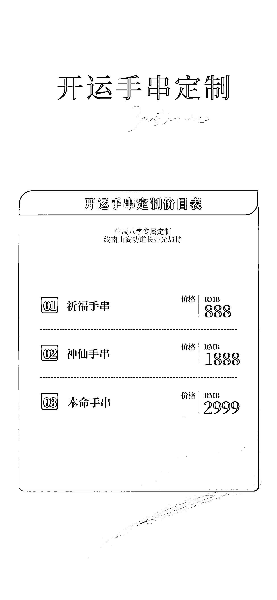

第一类 基础旺运。

这类就是传统的通过五行去调整能量。

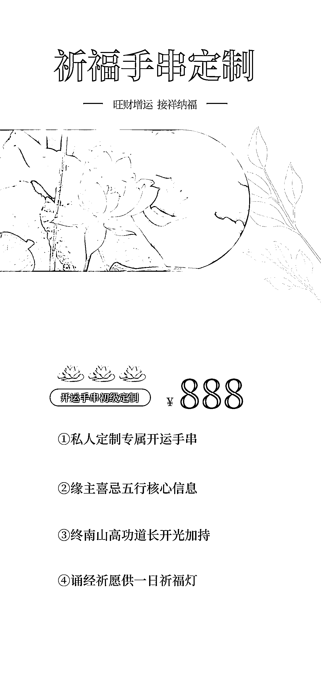

第二类 神仙手串

基于道家神仙，结合着开光请神去调整能量。

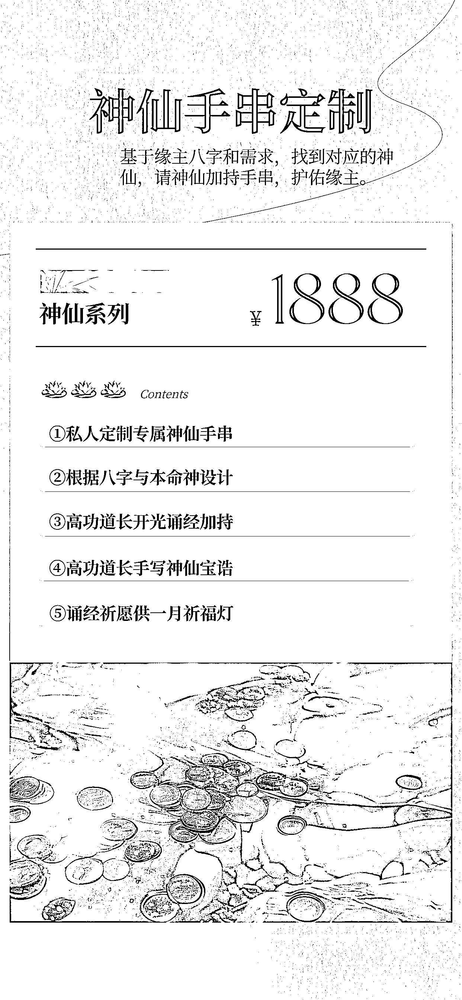

第三类是本命手串

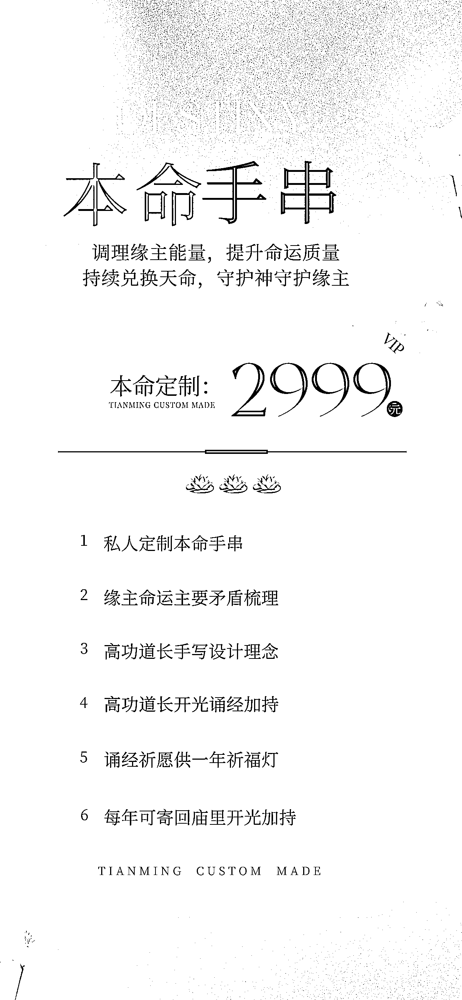

这三个有明显的区别，所以如果你设计产品的话，尽量也是从用户需求的角度去设计。这样没有人去跟你讨论定价的成本，也没有人会跟你去比价，因为没有同行跟你一样的东西吗，大家立足点是不一样的。

## 3、五步设计法教你设计玄学手串

这部分是给大概懂一些玄学的小伙伴分享一下手串的简单设计思路：

### **第一步：了解用户的用忌神**

基于八字能够知道用户五行用什么，

这个目前应该有一些软件，你们可以自己找找， 我这边是有方法论的，但是你们小白自己可以找现成软件。

举个例子，你得到了用户是用“水”。

### **第二步：基于用户的用忌神匹配水晶**

比如水是黑色系，你可以匹配蓝色或者黑色的珠子，蓝色一般是海蓝宝，青金石，黑色一般是黑曜石之类的，你配一下看看哪个好看，有的用户小女生带黑曜石不好看你就推荐海蓝宝。

### **第三步：基于用户需求匹配配件**

就是用户求财你可以配元宝貔貅，求姻缘配小狐狸等等，这些都是很 ok 的。

### **第四步：给用户讲好手串价值**

你用水，用黑色，水对于用户代表着什么？可能代表着财，可能代表着事业，这些你都要讲清楚，让用户看到手串就知道为什么带它，这种起心动念是有效的。

**这样用户就跟手串建立连接，就是他专属的。**

### **第五步：开光加持送东西**

最后，你可以根据自己资源，对于手串再次赋能。

匠叔有庙，所以可以开光，你们根据自己情况来，就是提升独一无二性，让人有足够的得到感。

这五步就是很典型的一个设计手串的五步，你只要有那么一点点玄学基础，谁都可以做到。

还有比较复杂的设计方法就不是这一篇文章能解决的了，我只能保证你按照这 5 步可以交付的很靠谱。

# 2、如何引流

引流部分我以小红书为例吧，抖音其实也是一样。

我分享两个万试万灵的引流方法：

**1、知识分享+免费推荐引流法**

**2、低价电商引流法**

## 1、知识分享+免费推荐引流法

目前公域展示水晶有比较多的方法，经常出现的是：

1、互动贴

2、产品展示贴

3、知识分享贴

### 互动贴

互动贴就是提一个问题，让大家在评论区互动。

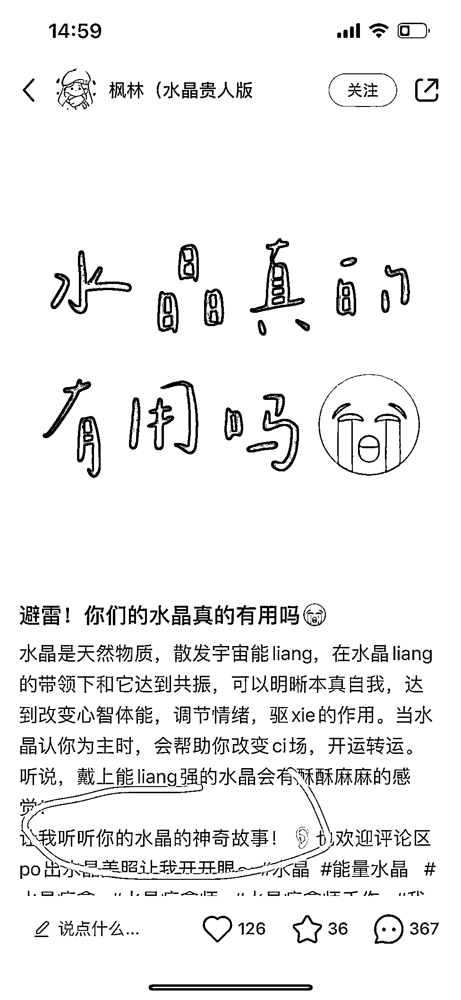

还有类似于那种《姐姐们敢不敢晒出你们的水晶》《谁能给几个叠戴好看的图》之类的，

这种一般评论量很大，

而评论又是小红书推荐的一个核心内容。

所以这种帖子特别容易出现爆款。

但是我个人认为互动贴可以提升权重，但是对你的人设帮助不大，也就是说对于最终的“卖水晶“这件事儿帮助不大。

所以我觉得前期可以发几篇，但是这个不是一个好的选择。

### 产品展示贴

产品展示贴是靠着精美的手串去引流，这种大家都会说：哇！好美，怎么买？

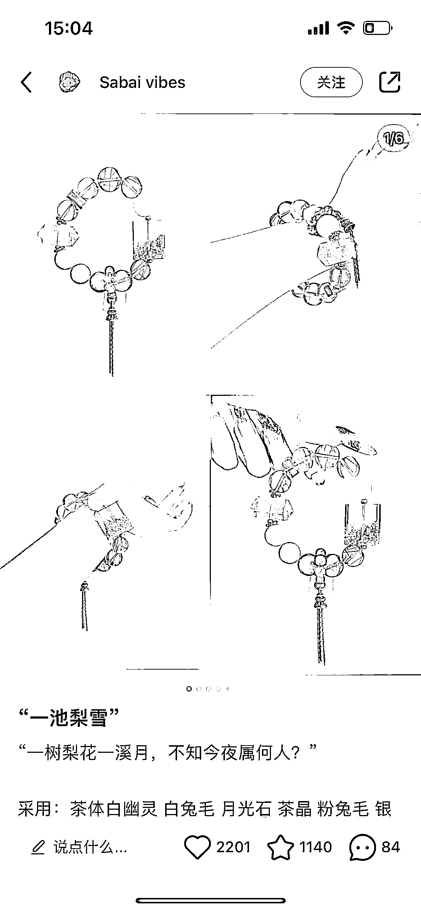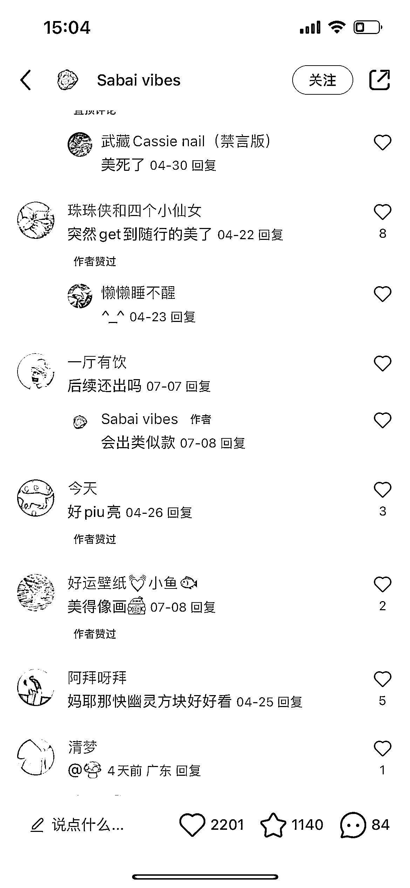

这种也挺好，但是有两个关键问题。

**第一，需要强供应链+强设计水平**

你作为刚入行的人，你没有那么多品拍的那么漂亮，一般是强供应链的容易这么样做。

**第二，这种手串卖不上价格去。**

我看的比较多的，大都 100-300，而且还有大量的模仿者，在这里偷图，低价去卖，让你失去竞争力。

### 知识分享贴

知识分享贴就是针对水晶各个角度去分享，这种是目前特别主流的，一搜一大堆。

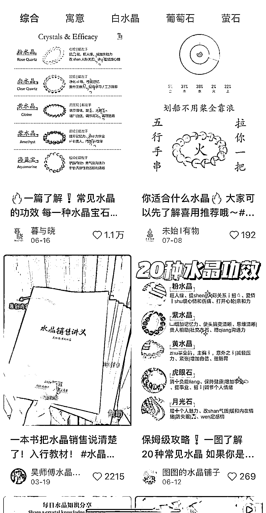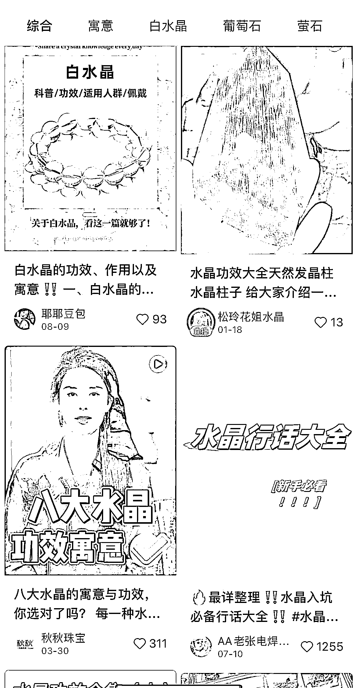

这个是让人看到都会对你有信任，是一个能够提升人设的方法。

对于初期入局的小伙伴来说，匠叔非常建议选择知识分享贴。

**什么叫免费推荐呢？**

免费推荐就是说你加我，我告诉你你适合什么样的手串，说白了就是用户加我，把八字给我，我给她说他适合什么样的手串。（类似于这种）

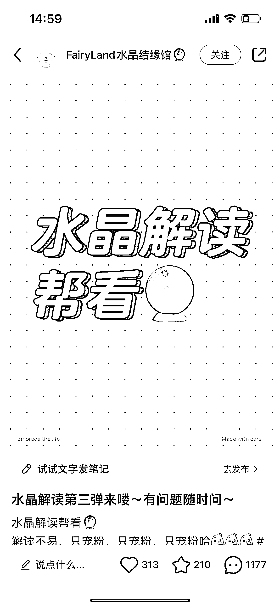

当然她是在评论区看，我们可以评论区回复几个，然后还是引导微信去看。

这样好处是来的都是信任八字同时又想买手串的，引流也会很简单，赶上了也能买你的手串。

这个钩子一定要留好，当你引到 20 个人的时候，只要你仔仔细细给他讲明白一些事情，有可能就会变现。

**这就是知识分享+免费推荐引流法**

具体小红书怎么让用户加你，咱们星球里面都是有的，你可以去搜搜。直接星球搜索”小红书引流“就行。

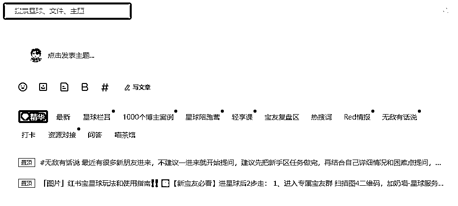

## 2、低价电商引流法

电商引流法也很简单，就是你通过产品去引流，弄一些水晶手串相关的产品，便宜点就直接卖，然后盒子里面加上自己的介绍，比如加我可以免费推荐手串之类的，这种方式就可以。

比如下面这个产品。

几千份，如果留好信息，加大几百人问题不大。

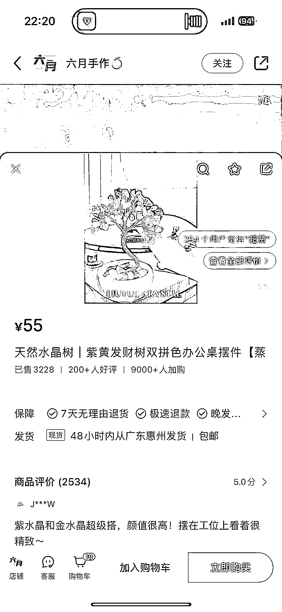

逻辑都是一样的，只要相关的产品卖出去，就能引流。核心点是两个：

1、你的产品要跟你水晶相关。

2、要足够低价，尽量 10 块 20 块最好。

这个就需要开个个人店，交上个 1000 的保证金，具体怎么开店啥的，咱们星球也是都有 SOP 的，我也不说了。

## 3、其他我没有测试但是看别人做的不错的方法

### 1、直播法

咱们星球里面包括我学员里面有做直播做的特别好的，一个月变现 10W 的这种，不过我没做过，大家如果有供应链，或者自己嘴皮子利索，可以去搜一搜各种直播间，卖的还是不错的。

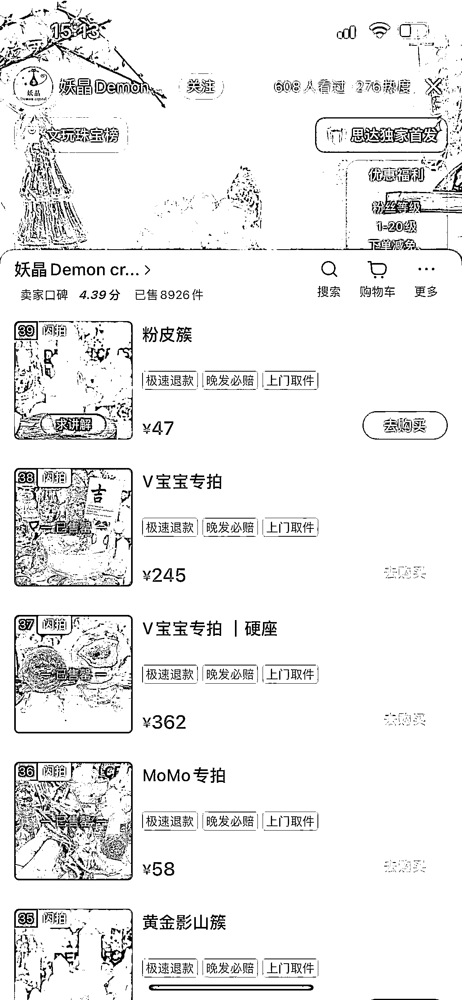

### 2、定制法

定制就是在小红书直接发给用户的定制流程，一般视频会比图文更好一些，因为我没做过视频，所以也没测试，大家有机会也可以测试一个，推荐一个做的比较好的：

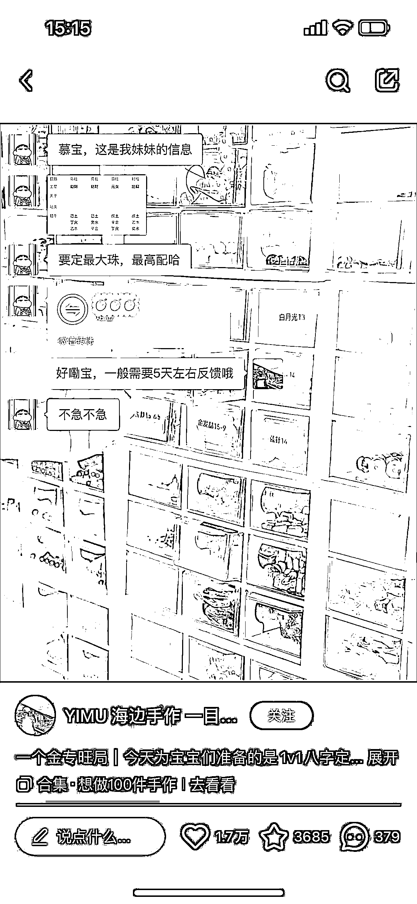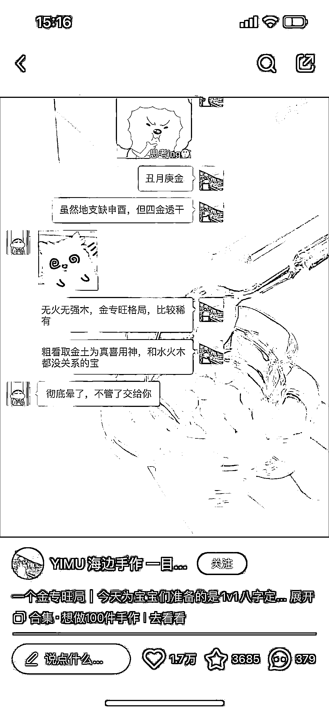

可以看一下他的数据，这算是定制部分已经特别顶尖的博主了。

# 3、如何变现

用户加到微信了，也有了基础的交流，怎么变现呢？

我从三部分分享一下：

1、朋友圈发什么

2、都要用户什么信息

3、除了手串还要交付什么

## 1、朋友圈发什么

朋友圈我们只需要发两方面内容：

### **第一设计理念**

图片：各种手串

我设计这个手串，是怎么思考的

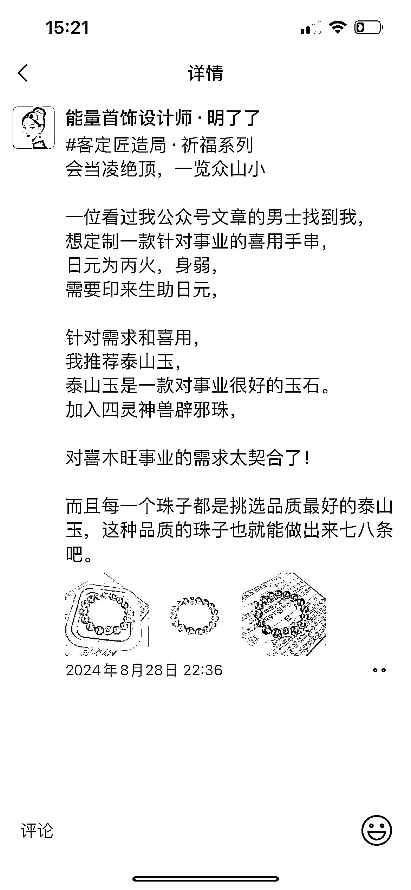

这样是为了加深你的专业性，

你说我没那么大专业性，

你就多去看看人家同行怎么说，同行讲的，你仿写一些发朋友圈总是没问题的。

### **第二用户反馈**

图片：用户反馈

用户拿到了这个手串，有什么感觉。

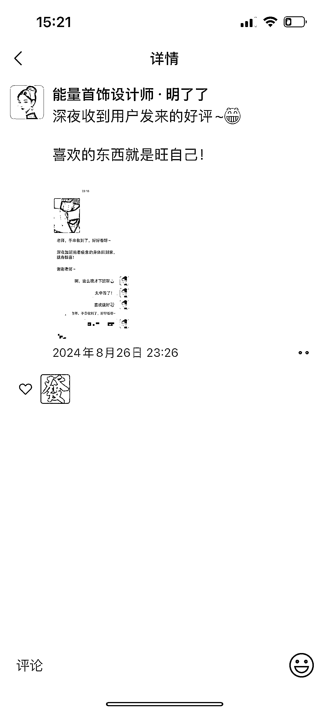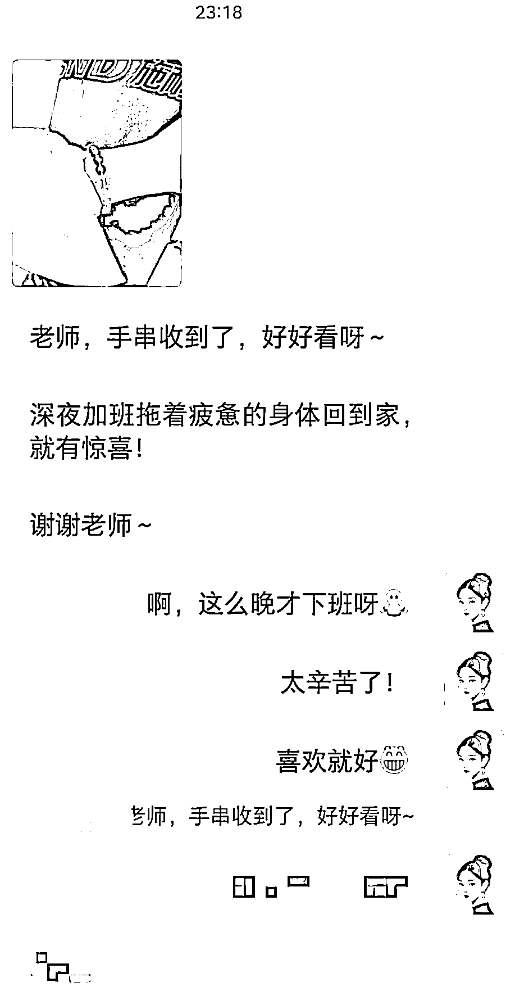

这部分也是加深你手串的牛逼，

就是朋友圈的每一句话，每一张图，都是加深你的人设，放大你的专业性，这个就不会有问题。

## 2、售卖时都要用户什么信息

用户问你产品，要付钱了，这时候你是需要收集用户信息的，

一定要专业一些。

**【祈福手串】**

**需要你的：**

**性别：**

**出生年月日：阴历**

**出生时间：**

**出生城市：**

**祈福内容：**

**手围:**

**特殊需求：**

我一般是用这个模板，这样的话用户会多次说明他的祈福内容，帮助你设计手串的时候紧抓需求，跟用户平常交流也要围绕着他的需求来是最好的。

## 3、除了手串还要交付什么

最后我们给到用户手串了，寄过去了。

这时候这个生意是结束了，但是我们作为玄学还没有结束。

**首先你要问一下用户戴手串的感觉，加深一下他的正反馈。**

**第二你要再次介绍一下自己，让用户未来有其他方面玄学的事情可以咨询你。**

**第三你要承诺，手串的有什么问题再来问你。**

给用户一个好的终值体验，有的人，可能就成为了你一辈子的客户和朋友。

=========

大概先写这么多了，有机会再聊。

哪里有没有说清楚的，大家留言就行，我看到都会回答。

* * *

评论区：

忧愁小松鼠 : 好厉害，但是我有一个问题，就是新手想学这种关于玄学的知识，是要去哪里找资料呢匠叔？
夜息 : 这行业个人做做，一个月赚个万把块可以。接到几个纯小白只看寓意的。只要入坑，拼杀的就是价格。否则无复购。水晶作为低端彩宝，已经是超级红海。走玄学最终体量上去就是进去。
匠叔 : 拼多多
匠叔 : 一个月多赚 2000 也行呀，多赚 200 也行呀。
嘻嘻又嘻嘻了 : 一直在关注这个 我还会塔罗牌 就是没货源[撇嘴]
匠叔 : 生财肯定有人有货源，去发个帖子问问就行了。
范 xiaoxia : 还想了解更多这个赛道，请问怎么联系呢？
匠叔 : jjjiang826

* * *