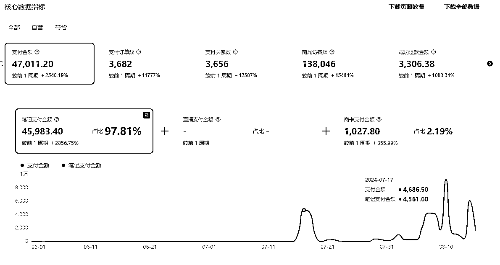
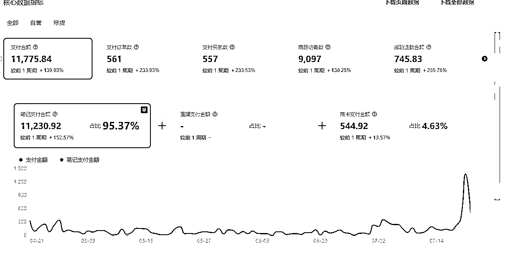
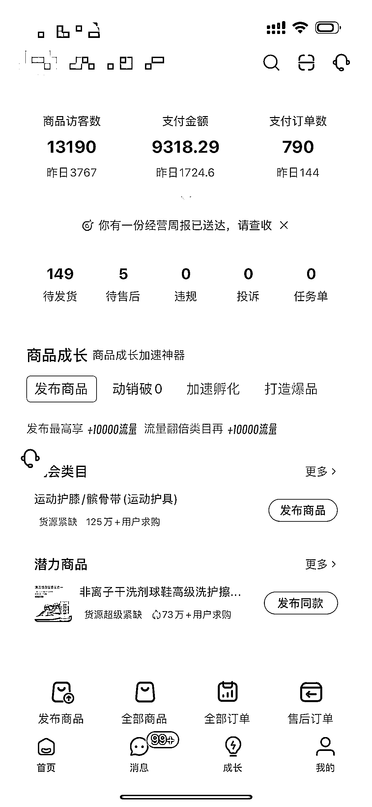

# 金融男，小红书店铺半年 GMV7 万+复盘

> 原文：[`www.yuque.com/for_lazy/zhoubao/qlx9a7hd65lugb3g`](https://www.yuque.com/for_lazy/zhoubao/qlx9a7hd65lugb3g)

## (30 赞)金融男，小红书店铺半年 GMV7 万+复盘

作者： 古思豪

日期：2024-08-26

大家好，我是重庆的圈友古生。

目前一边在上班，一边下班之后在家自己做小红书店铺。

大家也知道，这几年金融行业一直被打压和监管，不管是股票还是房子都通通缩水。

在现金流比较紧缺的这个阶段，恰好发现了小红书电商这个项目的巨大潜力，仔细研究了项目的可行性后，我开启了自己的电商之旅。

  **一：我为什么会选择小红书电商？**

这一年来，我一直有关注目前市场上比较火的项目，比如公众号爆文、视频号带货等，但综合评估后，我发现这些项目不太适合自己，无法激起和满足我内心对做生意的渴望，可能跟我本人是广东人有关。

直到小红书电商项目出现，我才正式入局。

不仅是因为这个项目可以带来良好的现金流，它的市场潜力也非常大，而且整个运营流程所需要的技能跟我也比较匹配，所以我几乎很快就决定了加入这个项目。

  **时间成本**

工作日 2-4 小时（我个人是在职状态）

周末 8 小时

  **二：现阶段成绩？**

我是今年 3 月份开始的，截止到 8 月中旬，我的小店小爆了 5 个产品，累计销售额超过 7 万多的 GMV。

  

虽然这个成绩并不算非常亮眼，但持续的正反馈也给到了我一定的信心，也坚信这个项目能够让我赚到钱。

  

而且经过这两个小爆的品，我也更有信心去迎接真正属于我的大爆单！

  **三：挑战？**

**挑战一：视频剪辑**

我觉得初入这个项目，最难的不是选品，而是剪辑，因为只有搞定了剪辑，才具备发挥出选品能力的基础技能。

我看了小红书航海@书豪教练的一个小时混剪出 20 条小红书带货笔记的视频后，从一开始 3 个小时才能剪辑出 1 条视频，到现在平均 5 分钟就可以出一条视频，而且混剪质量都比较高。

6 月以来，我也开始尝试一些简单的实拍，后期只要是能够实现实拍的品，我尽量都会实拍。

  **四：选品**

在选品上，我严格遵守了@书豪教练的选品方法。

新手选品，千万不要陷入自嗨，一定要按照前辈的方法进行，不然可能连选品的门槛都迈不进，反而备受打击，惨淡退局。

当我开始具备一定的选品能力后，我发现现在小红书电商的竞争也越来越激烈，有时候一个爆品出来，一窝蜂的人都进去了，这个时候拼的就是账号的权重、内容素材是否是最新、标题封面有没有测到位，一旦一环出现问题，这个品可能就跟不上。

所以近期，我在选品过程中会开始思考每一个产品背后的用户需求，通过需求挖掘新品，希望能在激烈的市场中脱颖而出。

  **五：测品**

选品定生死，测品也是决定产品能否大卖的关键。

我给自己制定了几条测品的规则，分享给大家：

（1）一个品，至少会测 15 条视频，如果有开单，就会持续测，但会慢慢减少笔记量，同时加入新品；

（2）小眼睛过 500 或者有开单，会人工干预，加至少 5 条评论，做下单引导；

（3）把对标的爆款测到位，比如，找到三个对标视频，就会有三个脚本、封面、标题，重新组合成九个笔记，每一个都要测到位。

  **六：多向优秀的人学习**

以前我属于闷头苦干型，可能过程中做了很多无用功，还容易内耗。

在做这个项目的过程中，我一直在不断的跟@书豪教练交流，有人一起做一个项目，每天可以互相交流，我真的少走了很多弯路。

以上是我的小红书电商带货之路，希望我的分享能为大家带来启发和帮助。

特别感谢@书豪哥在我一路以来的帮助和指导，是他成为我进入电商行业的领路人。在我中途想放弃的时候，都是豪哥在关键时期拉了我一把，让我能继续坚持。

回头来看，半年前的自己，还是抱着试试的心态，如今已经把小红书电商作为了人生的新期待，也希望大家在电商之路上都能勇敢前行，实现自己的梦想！

最后警醒自己一句：

降低期待，不要内耗，干就对了！

最后希望大家都早日爆单！

也感谢生财这个大家庭，能够让我链接到很多优秀的人，做小红书店铺，感谢@书豪教练，在我从 0 到 1 的路上，给了我很多选品测品的建议。

也希望所有圈友，都能够在这个变化的时代，找到适合自己的路，找到自己热爱的生活方式。

* * *

评论区：

花生黄油 : 感谢分享
林家少爷 : 以后有机会单独出来成立电商公司，这才是生意的开始

* * *