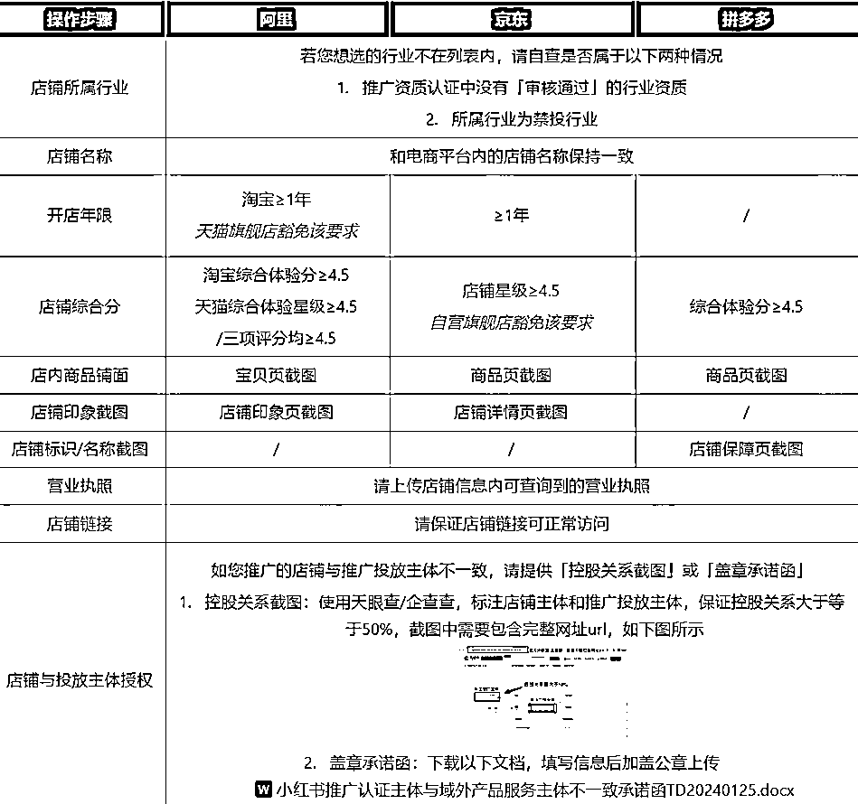

# 小红书 cid：跨平台种草收割神器

> 原文：[`www.yuque.com/for_lazy/zhoubao/ms6if6hcsvckkgoq`](https://www.yuque.com/for_lazy/zhoubao/ms6if6hcsvckkgoq)

## (8 赞)小红书 cid：跨平台种草收割神器

作者： 金坐

日期：2024-08-29

全文大概 2900 字，看完共需 5 分钟

和抖音一个阶段打一仗的路线不同，小红书商业化的路线可以说是全面开花。种草平台、站内电商闭环、直播带货、付费广告，可以说是全方位发力，主打一个样样精通。

今天就来了一个很容易被人忽视的机会，小红书 cid。

不清楚 cid 概念的朋友，可以先看一下我这篇旧文：[聊聊 cid，抖音引流投放神器](https://mp.weixin.qq.com/s?__biz=MzAxODQyMTMzNQ==&mid=2649095155&idx=1&sn=45ef386442828b0e12428b6062edfd59&chksm=83c7d8cbb4b051dd6100e9d3bc5aad326a039e42c6acd4b64e59ec52a8e92bed61df2aaa2fcc&token=761975018&lang=zh_CN#rd)

简单来说，CID 的就是 Click ID，用户的点击数据。

当我们在一个在信息流平台投放跨平台引流广告的时候，可以用 cid 工具来解决平台间投放的数据回传问题，用来优化投放效果，提升投放 roi 的工具。

因此业内经常用“cid”来代称跳转广告

简单说一下跑 cid 跳转广告有哪些好处：

首先是是，**cid 打通了跨平台的链接，从内容浏览到产品成交**，用户的整个行为都被串起来了，很丝滑，减少了流失率

传统的跨平台种草广告，也是从小红书到(淘宝)成交平台，但是是以用户打开淘宝 app 搜索行为为链接，这一步会有不小的流失，比如嫌麻烦，或者搜索出来却点进了其他店铺的链接

跨平台直接跳转就不会有这部分流失

其次是，**cid 广告可以利用好品牌方在成交平台的沉淀。**

比如某个品牌在淘宝上面有一家经营多年的店铺，已经有不少的粉丝沉淀和用户评论基础

这个时候如果要再开一个小红书店铺，相当于是开辟了一个新战场。对运营团队会是一个不小的考验，尤其是内部的内容团队没有特别成熟的情况下

并且在小红书的这个店铺也是新的，没有太多的沉淀

但是如果是跑 cid，那么他们只需要经营好在小红书的官方账号以及基础的公关维护，做好基本的品牌背书即可。

用户的成交全部交由更有沉淀的淘宝店来完成，这样对团队的运营压力也更小。

只要跑广告的投产比可以，就可以长期跑下去了，因为实际的投入并没有增多多少，只是换了个渠道去买流量而已。

再次，**cid 广告使笔记种草效果可度量，数据可视化**，便于持续的效果追踪与优化

因为小红书 cid 广告形式是搜索广告。

商家在小红书平台内投放种草内容，官号直投、达人、a 种 b 收等形式都可，然后种草内容被推送到用户面前。

这一步的数据是很难被具体量化的，只能统计到曝光、点击、互动等数据，无法统计到转化数据。

然后被成功种草的用户，在小红书发起搜索行为，搜到广告贴，点击组件跳转到成交平台。

这一步，就可以借由 cid 来实现统计和度量，考核本批次种草的实际效果。

总之，**cid 广告可以保证在数据可控的情况下，同时拿到内容平台便宜的流量，以及成交平台的高转化率**

虽然门槛比直接在小红书开店要高一点，不过总体的收益确实也更大

* * *

小红书其实很早就推出了官方的跳转工具，比如与淘宝合作的小红星，就是一个达人种草+跳转成交的工具

不过小红星先是经历了一系列改版，再是之前的门槛一直偏高，商家找不到自助操作的入口不说，投放的门槛就是先充个 5w，对品牌还有一定要求

对成熟品牌方来说是没什么所谓，但是对广大小商家和打品团队来说，这个门槛确实有点高了

问题是品牌方本身也不缺这个渠道，品牌效应本身就具有全域成交的属性。真正对跳转成交有强需求的，恰恰是白牌上架、打品团队

同样，一个平台的内容活力其实主要也是由广大中小商家提供的

于是，618 前后，聚光后台上线了一个新的投放链路：种草直达

  

  

具体呈现形式如下：

  

**评论区呈现**    

用户点击胶囊按钮或者评论区的链接之后，就会“直达”对应的电商平台，淘宝、京东、小程序等等

所以聚光的种草直达，其实本质上就是 cid 跳转

原本需要 5w 充值还要开白才能玩的功能，现在相当于把门槛放开了，开个户就能跑了

官方应该是看明白了

当然，说是门槛放开了，其实还是有一些门槛的，首先在平台上的店铺有一些浅浅的要求：

  

其次是，跳转到电商平台，需要官方认可的技术服务配合

这个还挺麻烦的，不过问题也不大，都有渠道。

除了跳转到电商平台，小红书的 cid，可以直接跳转微信小程序

**唤起小程序**    

并且跳转微信小程序，不需要技术服务商协助。只要自己有开发能力，配合聚光后台实现数据回传即可。

比如如果团队是做私域成交的，把产品上架到小程序，然后再找服务商开通一个聚光账户就可以了，调整一下数据回传的参数，马上就可以实现无缝跳转的私域成交了。就算没有成交，也可以利用小程序引导区个微或者企微，非常的丝滑快捷。

如果没有小程序开发能力，可以找 saas 服务商套壳，或者我们的技术团队也能提供开发服务

去年和前年，我们在抖音上面跑 cid 的客户还挺多的，主要是大健康的品类，还有一些美妆护肤品都有，然后抖音现在流量贵了，也卷起来了。部分客户就尝试来小红书的跑 cid，毕竟门槛已经下来了

那么，**现在小红书 cid 适合哪些品类，哪些玩家：**

*   1.

单价高于 200，且卖点足够清晰的品

*   2.

类目擦边的品类，利用好平台的规则差

*   3.

在传统电商平台有积累的商家/品牌

*   4.

想要利用小程序做私域电商的玩家

重点解释一下第二点和第四点

利用好平台的规则差，指的是，可以在小红书推广一些在单小红书内不能上架的商品，或者对营销内容有限制的产品

比如说某款带功效的保健品，由于资质问题或者功效问题，在小红书内不能上架，但是可以在拼多多可以上架，这个时候就可以用 cid 功能把用户引流去拼多多成交

一方面我在拼多多交了保护费，我在小红书也交了买路钱，我这个行为合规的，不会像以往，在评论区粗暴引流导致封号或者违规。

并且这部分数据还是可度量可优化的，可以很方便跑量

如果再配合上达人种草，a 种 b 收等打法一起跑，会有奇效。

想象一下这个场景，用户刷到某个博主或者某个素人推荐的你们家产品，然后点击搜索关键词，或者直接回主页发起搜索，关键词就是刚才笔记里面种下的词汇。然后搜到了你们在投放的 cid 广告，点击小胶囊直接跳转到了淘宝店，他一看淘宝店里面你们的商品链接有非常多的好评，价格也还不错，于是就下单了

另外就是，利用小程序在做私域电商的玩家，可以留意一下这个渠道

抖音也好，小红书也好，终归是终归是内容平台，兴趣电商，短期内很难有复购粉的沉淀

未来的流量成本必然是逐年变贵的，想要毛利更高，复购率必须得高

而在信息流推荐为主的内容平台力，你的产品是很难有复购的，用户很难有忠诚度

但是在传统电商平台，尤其微信私域，就可以比较轻松做到这一点

二次触达用户的成本也会变得很低

尤其是跳转到小程序成交之后，可以非常丝滑的用企微去承接住它，那么再用企微和小程序去触达用户是几乎没有成本的

不知道你们有没有发现，这几年利用小程序做私域的团队越来越多了，品牌侧的有远方好物等，工具侧的有快团团等

早年大家还在是没适应社交媒体的发展，所以大家对微商的包容度也还好，但是随着越来越多私域团队的操盘，把整个朋友圈生态已经做乱了

导致大部分用户的微信朋友圈已经不堪重负，朋友圈里的广告和折叠内容比正常的内容多了好多

因此，2024 年，还指望单纯的加靠加好友发营销朋友圈来做成交，这个事儿成本已经变得非常高了

因此有很多反应快的团队都选择用小程序去做承接和成交，原因之一就是，不会对用户造成太多的打扰，同时又可以留住用户，方便复购

原因之二则是解决了收款问题，这个懂得都懂，就不展开说了

所以如果想跑私域高客单产品的团队，都可以尝试一下小红书 cid 跳转到小程序的链路

我们最近也在寻找合适的品类，如果手里有合适产品的，可以交流一下

最后，祝各位老板，天天爆量

## < 以上 >

* * *

评论区：

加麻 : 感谢分享🙏🏻

* * *