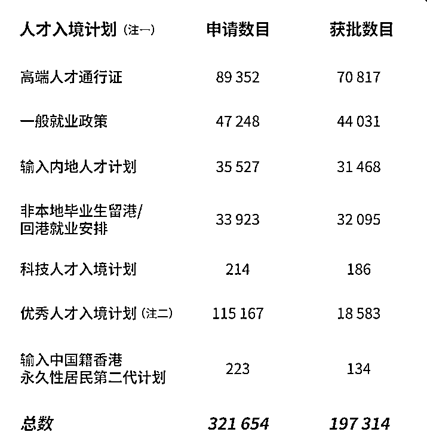
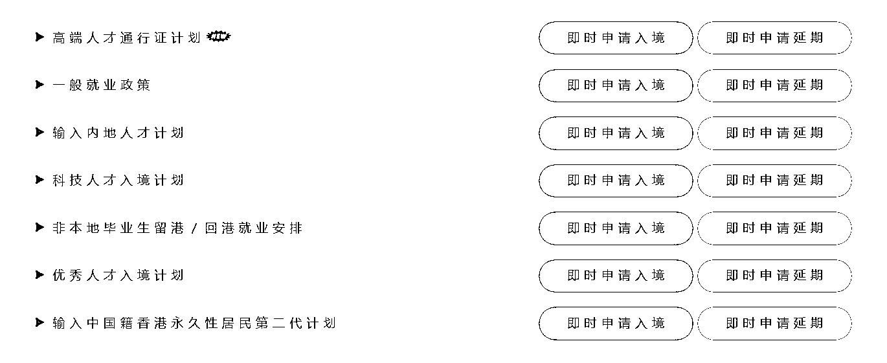
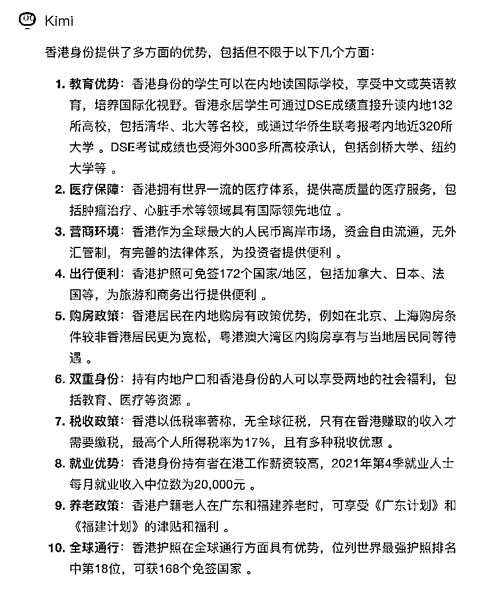
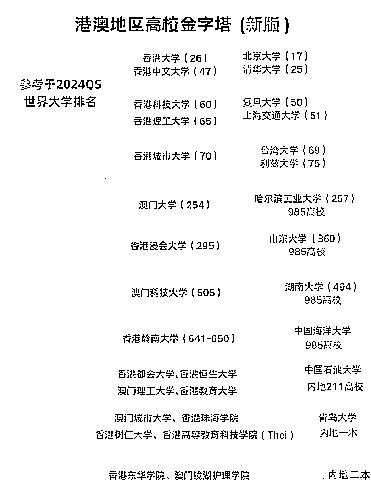
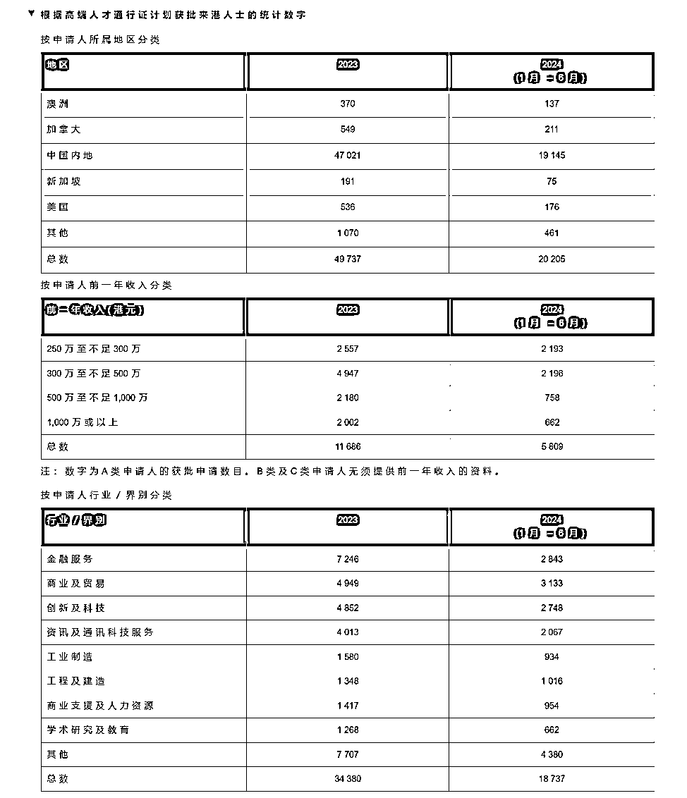
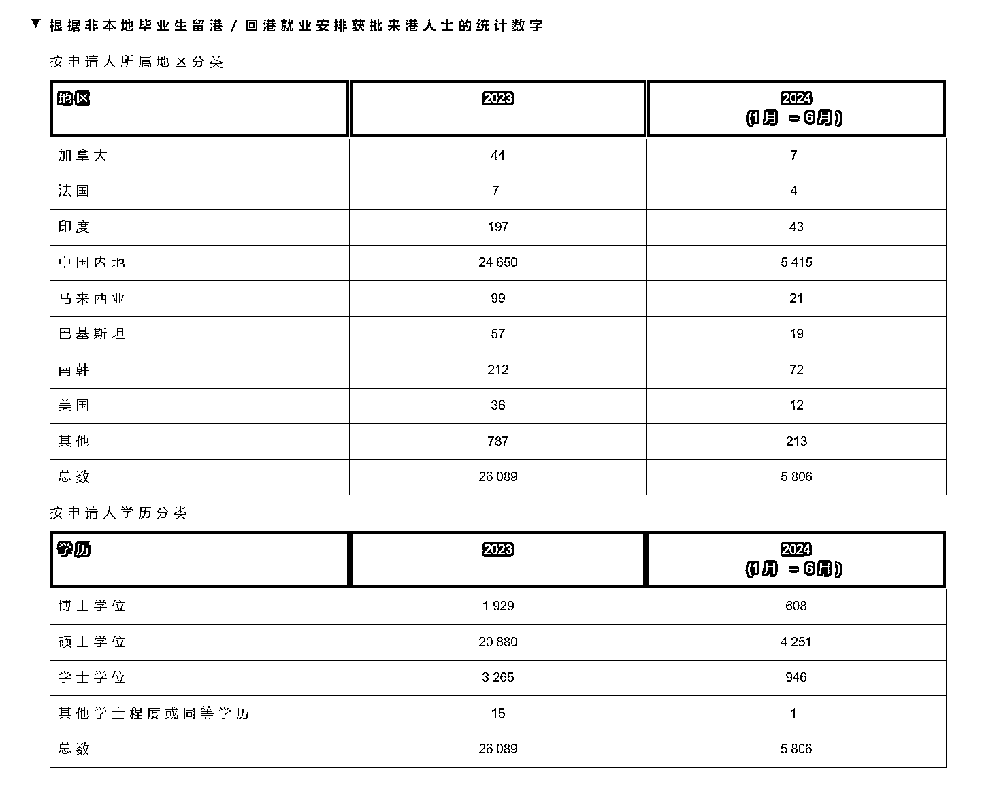
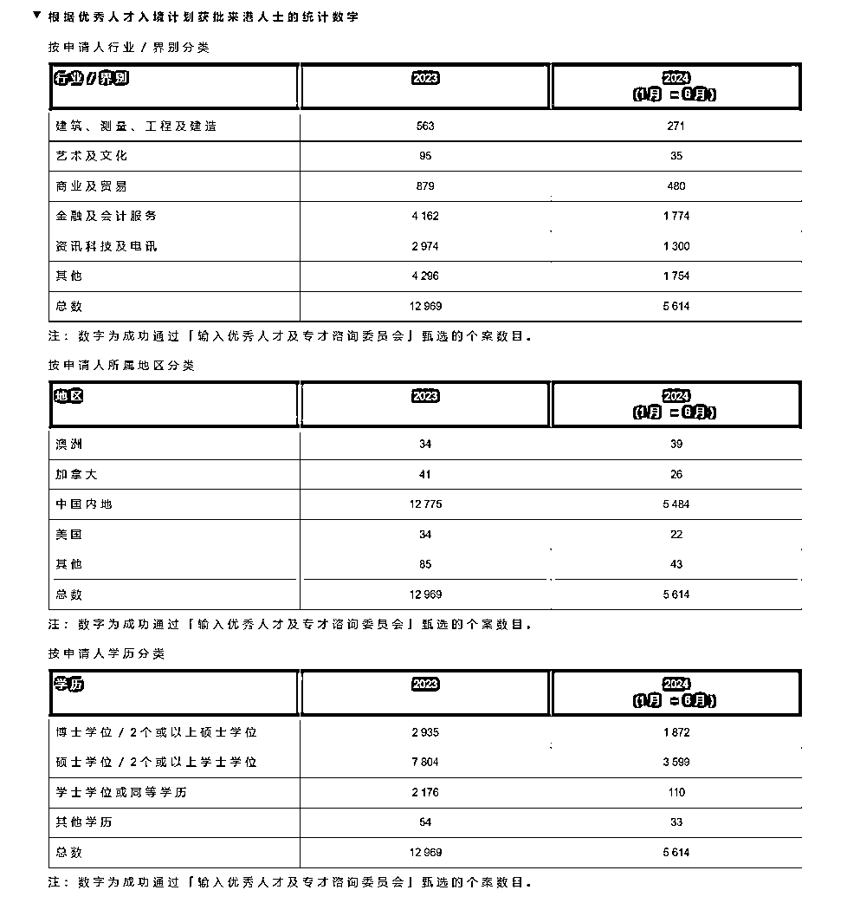

# 香港身份到底多久才能拿到？怎么每个月都有人说马上要关了

> 原文：[`www.yuque.com/for_lazy/zhoubao/ww041xm61vg8l594`](https://www.yuque.com/for_lazy/zhoubao/ww041xm61vg8l594)

## (19 赞)香港身份到底多久才能拿到？怎么每个月都有人说马上要关了

作者： 阿明

日期：2024-08-28

**先说结论：香港身份的申请中，适合大家的是香港读研和高才，优才可以试一下**

**↓**这是 23 年初到 24 年中的 6 月获批数据

时间上倒推，读研今年 11 月开始申请，所以 10 月份开始准备资料和准备面试

目前已颁布官方政策；高才申请和优才的取消限额今年底截止，所以理论上高才是 9 月底截止，优才是 10 月截止

**那么很多生财的朋友会问，办了有啥好处，为什么要办，怎么拿到身份**

这个得看申请人的具体情况和需求来决定，一手信息帮大家避坑，已成功帮助 52 个家庭成功拿到香港身份

如果你的年收入＜50 万或者在香港每年累计呆一个月以上，**不建议考虑**

游戏规则就是这样，除非用钞能力解决，但是性价比就没有那么高了

**一，香港身份的优势**

翻译翻译：（升学和大学），经商优势（税收和政策），医疗优势（前沿水平和养老）

再大白话一点：

**教育**：小孩想更容易读上好学校有用，具体可以参考“谷爱凌”，逻辑上都是避开卷赛道，去一个分母更小的细分板块取得更容易的成果；所以很多父母考虑办身份，一方面是为了小孩的教育多一个赛道

从幼儿园开始小孩读公立不要钱，而且租售同权不需要买学区房；当然更考验小孩的面试能力，学的越好越能去好的学习；港八大前五所都是 qs100 的，内地的大学 qs100 只有 5 所（清北复交浙）

而且还没提及深圳多少人成绩高考，香港多少人参加 dse 考试

**经商**：目前去香港确实有一些新的机会以及和深圳不一样的东西，比如经商氛围(特首站台香港 Web3.0),高性价比的菲佣，19 万新港漂的新需求等等

比如袁记云吞，农耕记、杨国福麻辣烫、探鱼、呷哺呷哺、太二酸菜鱼、木屋烧烤纷纷入驻香港

去年，蜜雪冰城在香港开业第一天，门口就直接大排长龙。价格上，蜜雪冰城 5 港币一个冰淇淋甜筒，9 港币一杯柠檬水，16 港币一杯珍珠奶茶，这定价着实给香港奶界带来不小的震撼

**医疗**：香港的医疗机构配备了世界上最先进的医疗设备，提高诊断的准确性并减少治疗过程中的副作用。例如，在癌症早期检测方面，香港的技术能够发现更小的癌细胞。医疗费用：相较于美国等国家，香港的医疗费用较为合理。只有美国的三分之一。癌症治疗：在一些癌症治疗领域，如乳腺癌、肺癌、胃癌等，香港的存活率和治愈率居于**世界领先地位**。

比如香港乳腺癌患者的五年生存率为 89.8%，居世界第二；香港在胃癌和肺癌的治疗上也有显著成就。

医疗监管和医生素质：**香港的医疗监管制度严格**，医生需要经过高标准的培训并通过定期考核才能执业。此外，医生的详细信息可以在香港医管局网站上公开查询，增加了医疗系统的透明度。

药物更新速度：香港能够快速引入最新的药物和技术，这意味着患者可以及时获得最新的治疗方法

而且本地和非本地居民收费分别为**$180 和$1230**；如果后续需要留院的话，差别更达到**$100 与$5,100**

而且经常在香港看到很多行动不便老年人独立出门，有配套设施提供帮助，而且有绿色通道

**二，目前内地的家长比较容易拿到香港身份的途径**

主要是**读研**“非本地毕业生留港”和高才的“高端人才通行证计划”所谓的性价比**优才**优秀人才入境计划”

从官方现有披露的数据上可以看到→读书 95%，高才通过率 80%，优才 16%

当然不排除数据的审批滞后性，但是从已获批的学历，行业，地区，来看其实有才的申请案例大家也都心理有数了

而且实际上香港读研是百分百可以拿到临时身份，高才得看申请客户情况且需要准备材料，优才不予评价

官网数据链接：[`www.immd.gov.hk/hks/facts/visa-control.html`](https://www.immd.gov.hk/hks/facts/visa-control.html)

**结语**

好福利背后肯定是有人买单的，澳门每个月有养老金每月 3740 元，但是拿到澳门身份的门槛很高，维持成本未知（新发布），香港身份需要花七年的时间和精力去做，也并不适合每个家庭，量力而行。

局中人有的东西确实会看不透，出了局才豁然开朗，这也是我为什么一直以来没有发文章的原因，不想那么市侩，但凡了解过香港身份或者翻过抖音小红书的，都会知道今天写的含金量

有任何香港身份的疑问在评论区写就可以，看见就会回复。（不解答续签问题，不提供续签落地方案）

* * *

评论区：

果冻 : [呲牙]大佬 解释的太详细了
阿明 : 谢谢夸奖，欢迎提问

* * *