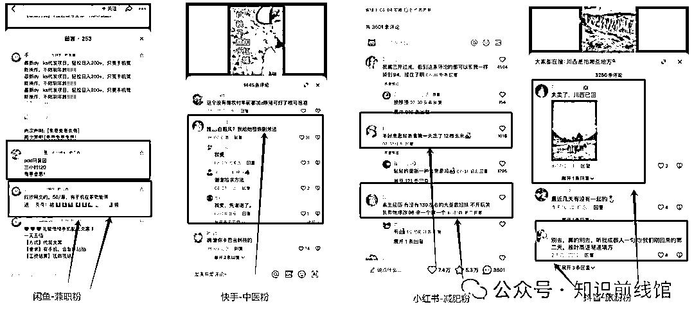
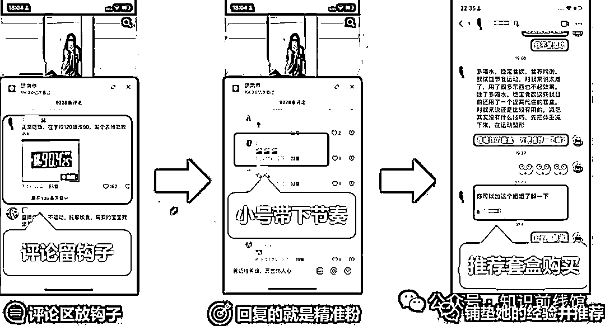
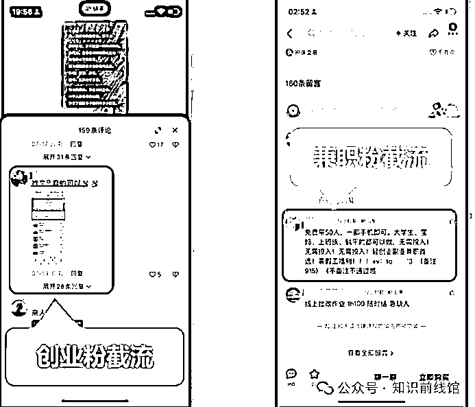
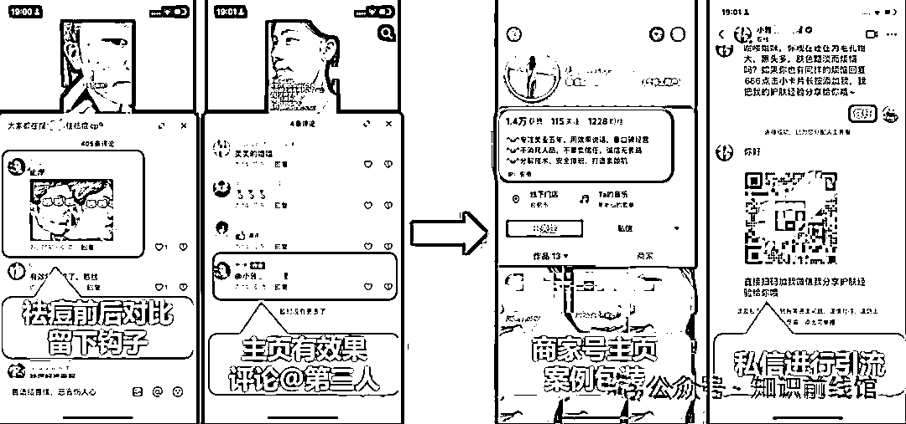
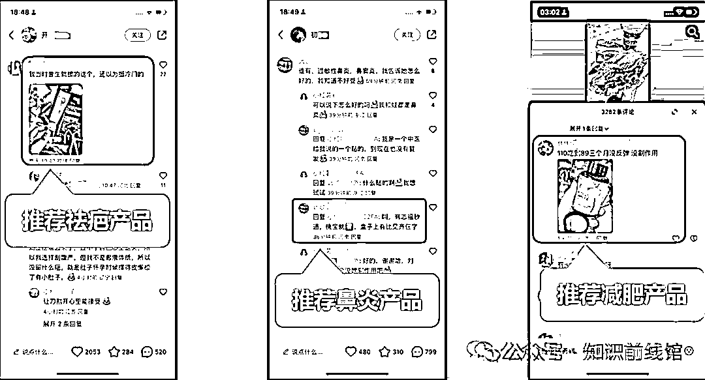
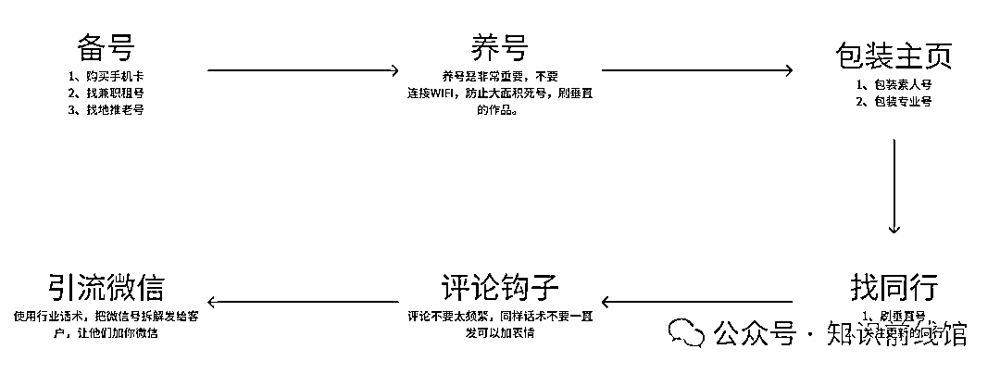

# 前端获客：评论区被动截流

> 原文：[`www.yuque.com/for_lazy/zhoubao/rfxv5afs8wnyz3nb`](https://www.yuque.com/for_lazy/zhoubao/rfxv5afs8wnyz3nb)

## (16 赞)前端获客：评论区被动截流

作者： 知识前线馆

日期：2024-08-26

评论区被动截留是什么意思，就是说我们在别人的热门作品的评论区里面进行发表我们的评论，这个评论我们是带有钩子，钩子让别人主动来找我们，我们从而偷走别人的客户。

但是截流也是普通人入行最简单最实用的技术了，因为 80%的私域粉丝都可以适用截流技术。

## **演示：说了那么多不如来个演示图让你们一目了然**

1、闲鱼-兼职粉截流

1.  我们打开闲鱼 app，搜索：**兼职**，我们随便刷一下，点一个作品，就可以看到下方评论有很多截流，有作者自己的，也有我们所说的被动截流。

2、快手-中医粉截流

1.  我们打开快手 app，搜索：**偏方**，我们随便刷一下，点一个作品，就可以看到下方评论有很多截流，有作者自己的，也有我们所说的被动截流。

3、小红书-减肥粉截流

1.  我们打开小红书，搜索：**减肥**，我们随便刷一下，点一个作品，就可以看到下方评论有很多截流，有作者自己的，也有我们所说的被动截流。

4、抖音-旅游粉截流

1.  我们打开抖音，搜索：**旅游**，我们随便刷一下，点一个作品，就可以看到下方评论有很多截流，有作者自己的，也有我们所说的被动截流。

## **评论区被动截流的底层逻辑**

1、找大量同行的账号

1.  养号刷垂直作品
2.  看见同行就关注
3.  找相关话题，如：#兼职、#创业 等等....

描述：比如说我们养号的时候，要大量的去进行刷同行的作品，比如说我们想做创业粉的，那么我们就可以去搜索关键字，然后大量的点击作品，偶尔可以点赞收藏一下，也可以关注一下。

2、在作品评论下进行留钩子

1.  通过纯文字进行留钩子
2.  通过文字+图片留钩子
3.  @承接的账号

描述：就是说我们看到同行的作品，我们就可以进行的留钩子，留钩子可以纯文字或者图片留钩子也可以，如果流量太大了，我们就要注册一个小号，我们艾特小号来承接流量。

3、及时回复私信+引流

1.  私信引流加微信
2.  主页简介留微信
3.  图文作品留微信

描述：客户来找我们了，那我们怎么去进行引流到私信（微信）里面呢？

## **演示：说了那么多不如来个演示图让你们一目了然**

## **评论技巧的方式有哪些呢**

因为不同的**平台**和**行业**的评论技巧是多样性的，这里馆主就给小伙伴们演示四套玩法：

**第一人称直接下钩子：客户找我们本人**

图一：创业粉，在快手平台上我们可以直接炫耀赚多少钱的

图二：兼职粉，我们可以在闲鱼评论区发布类似招聘兼职的文案

**第三人称视角推荐他人：使用素人号推荐商家号**

我们使用一个素人号在痘痘作品评论区里面，发布自己使用了某个商家的商品后的效果图，然后我们直接艾特出这个商家的快手号。

**第三视角配合一级评论的提问+二级回复的推荐**

**第三人称视角分享产品：独家产品的商家，可配合素人代发**

如果全平台就只有一家是卖这个商品的话，那么我们就可以使用大量的素人号，发表使用某个商品效果图，推荐你们到某宝、某多购买。

### **整个流程图**

**小结**

这里先给小伙伴们讲解什么是评论区被动截流，以及后续的文章中**馆主也**会给小伙伴们详细讲解更多关于前端获客的知识。

* * *

评论区：

知识前线馆 : 最近状态很好，巅峰写作状态
知识前线馆 : 👻

* * *