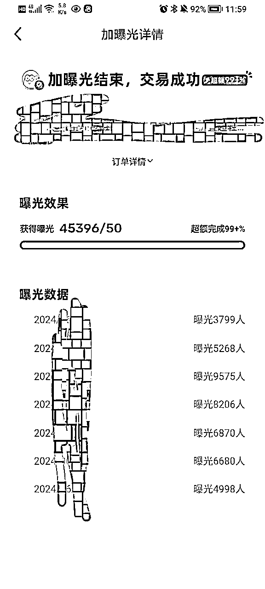

# 给生财航海的见面礼——流量篇

> 来源：[https://pxt8xmjdee.feishu.cn/docx/A0tOd4TJgoZjsQxBq60cV2VYnBx](https://pxt8xmjdee.feishu.cn/docx/A0tOd4TJgoZjsQxBq60cV2VYnBx)

大家好啊，好久不见。

我是生财六月份闲鱼高客单价的教练，陈不胖。

这期航海因为种种原因，导致不能陪伴大家一起在闲鱼里披荆斩棘。

但我国著名将领楚云飞少爷曾讲过：不管是谁在攻打平安县城，我楚云飞一定要帮帮场子。

所以虽然肉体不能陪伴大家，但是精神陪伴还是可以的，于是就诞生了这篇帖子。

在写这篇文档之前，本来心里面已经大概3-5选题可以写的，比如说，心态，流量，客户转化等等。

但细想之下，好像大多数人在做项目时碰到的第一个卡点就是没有流量。

只要有流量，心态自然好，只要有客户，自然有转化，毕竟销冠也都是客户喂出来的。

所以在这一篇帖子的选题我选择流量，虽然我是一个干臭闲鱼的，但是并不影响文中的思维照样可以指导大家在其他公域平台里乘风破浪，希望大家看完之后能有所收获。

我自己在带团队时，我的习惯向来是思维影响动作，动作影响结果，所以这篇文章大多都是以思维的角度去探析流量密码，毕竟方向对了，还怕日复一日的拱卒嘛。

废话少说，言归正传，本篇文章主要构成为以下几点：

1，市场绝不是一潭死水，而是存在变化的海洋。

2，流量绝不是数据的开端，而是内容是否优质的结果。

3，60分及格很容易，但流量更倾向于100分。

4，拒绝流量玄学，注重科学提高流量。

# 1，市场绝不是一潭死水，而是存在变化的海洋。

上个月，亦仁在生财开启小灯塔计划时，在文章中说自己想写内容又不敢写，主要是担心会有人因为自己的一些想法从而误导圈友做出错误的动作。

其实这种顾虑我也有，虽然咱没有亦仁如此浩瀚的影响力，但也的确非常担忧因为自己的一些不成熟的认知和思考影响别人赚钱的速度。

而我之所以产生这种顾虑，是作为一个在闲鱼中沉浮四年的老手，一个在网络冲浪七八年的高手，我比任何人都清楚，市场从来都不是一潭死水，它反而充满变化，水面之上波涛汹涌，水面之下同样也是暗流涌动。

之所以敢笃定市场存在变化的原因是，市场的最小元素是由一个个具体的用户进行构成的，而用户的需求一定会发生变，这种变化的演变逻辑一定是从无到有，从有到好，从好到更好。

比如说：

在短视频领域中，肉眼可见的是17年的爆款在24年的市场中很难翻红；

在数码领域中，触屏手机出现之后，按键手机开始在市场逐渐消失；

在闲鱼的内容当中，生命周期结束的链接很难在短期内再次出现大爆款。

仔细观察一下不难发现，这些产品的变迁迭代本质上都源自于用户需求的急剧变化。

而在另一方面，用户需求的急剧变化就一定会导致市场风向的转变，谁若提前知晓市场的风向谁就能掌握下一次市场的份额。

毕竟当年的iphone4横空出世算是直接打断了诺基亚的腰，一次堪称重新定义手机的大创新也让苹果至今依旧占据在手机的龙头位置。

所以在当下的手机领域中，各大厂商品牌依旧每年不遗余力的投资研发未来的手机，保持创新，本质上是谁也不想在下一个市场中丢失市场份额，所以开始主动迭代，被动内卷。

从这个实例上看，市场产生变化的主要原因除了用户的需求发生变化之外，也源自于同行之间的主动创新，被动内卷。

（ 如果你不明白同行之间的相互内卷为什么会引起市场的变化，不妨让我们换一个例子。）

如果市面上的客户需求是1块钱，最开始商家们都不知道这个需求，直到有一天有一个商家发现了这个需求，于是开始给客户们发1块钱，于是整个市场的客户开始蜂拥而至，渐渐的其他商家也发现了这个秘密，于是大家都在给1块钱，于是整个市场有呈现出一个平衡。

直到某一天，一个新进来的商家一看，大家都在给1块钱，那我也给1块钱怕是激不起水花，那我就给10块钱吧，于是整个市场的客户又开始蜂拥而至。

.......

由此循环下去，总会有人给出更高的价格去博取市场的流量。

在这里商家们给的钱并不是具体的钱，而是产品价值，产品价值的高低取决于解决用户需求的多寡。

在这二者的交叉影响之下，整个市场就产生出一种完全不可预测的变化。

而这种变化带给我们的教训是：

1，过往的经验观点可能并不适用于当下的市场，不论这个观点是谁说的，不妨放在市场里辩证一番，去伪存真。

2，要主动求变，在大家都在给1块钱的时候要擅于给10块钱，不断的满足客户需求，解决客户顾虑就是在提升产品价值。

3，要培养挖掘客户需求的路径，即使赛道不行，但是洞察和路径依旧在，学会在同行的产品表达上找需求，在跟客户的聊天沟通去找顾虑。

闲鱼的大部分爆款链接之所以有生命周期的原因也正是这里，要不然就是同行找到了用户新的需求变化，要不然就是同行的内容呈现比你更好。

（除非还有一点原因，就是你的链接被全平台抄袭了，被同行截流，但这真的是极少数）

但不论哪种原因，其核心原因必然是因为有比你更优秀的产品表达抢走了你的流量，市场竞争是残酷的。

tips：如果你在闲鱼上卖的是实体产品，无法更改产品卖点和属性，不妨好好钻研一下产品表达。

这个时候比的就是产品卖点信息的传递是否充足。

# 2，流量绝不是所有数据的开始，而是内容优质与否的结果。

大部分人在第一次实操项目之前都会非常容易陷入一个误区，就是因为我的作品没有流量，所以没有人看我的内容，因为没人看我的内容，那自然也就没人买我的产品，所以归根结底，我不赚钱的原因就是因为没有流量。

既然问题出现在没有流量上，那我就想办法提高流量，于是由此产生各种谣言和玄学动作，例如流量的分配是根据账号权重进行分配的，活跃账号可以增加账号权重，每天完成xxxxx样的动作也可以增加账号权重云云。

好了，可以停止这场闹剧啦，老爷们！

平台绝不会因为你在平台里多买了几件商品就给你分配流量。

平台给你分配流量的唯一的核心的本质的打根儿起的原因就只有一个：你符合平台的利益，你能产生价值帮平台留住用户。

是的，你没有听错，平台的核心利益也是用户，也是流量。

任何一个平台的构成永远都有两个角色参与其中，一个是提供价值（卖）的角色，一个是享用价值（买）的角色。

比如说抖音，提供价值的是博主，享用价值的是用户；

比如说闲鱼，提供价值的是商家，享用价值的是用户；

但就大多数公域平台现状来说其实并不缺卖家，真正稀缺的反而是买家。

因为商人的天性就是逐利，当一个平台具有大量未开发的流量，商人自己就会闻着味道赶来。

这也就能解释为什么抖音现在卷成这个样子，但做自媒体的老爷们首选依旧是抖音，说白了不还是还是因为抖音的流量大嘛。

其次平台的流量也是有成本的。

比如说，转转在抖音里铺天盖地的广告宣传都是需要给博主充值。

比如说，抖音在前期的拉新政策。

比如说，五万人难砍成一刀的pdd。

这样一说，你才开始意识到平台的流量确实是有成本的，只不过在这之前我们很难意识到这一点，还是不当家不知柴米油盐贵啊

所以在上述的分析中，我们不难发现在公域平台里，平台对流量的分配也是在算账，你产生的价值越能留住用户，你就越容易获得流量。

但在这个分配逻辑中就极易产生一个问题，那就是由谁来界定价值的高低？

在目前大多数的公域平台里，基本上都把用户动作形成数据，再通过数据进行赛马机制来决定价值的高低，再来决定流量的分配高度。

我们以闲鱼举例：

闲鱼的数据面板只有3个数据：

曝光：浏览：想要

曝光数据指的是有多少用户看到过你的链接；

浏览数据指的是有多少用户在看到你的链接之后点击了你的链接；

想要数据指的是有多少用户在点击了链接之后找你咨询的。

你看每一个数据基本上都是把用户的动作量化，且每一个数据都跟上一个数据存在转化关系，平台利用这些数据之间的转化比例去跟大部分的同行竞争，让数据优秀的链接进入到下一个流量池，让数据较差的链接呆在现有的流量池，避免损害用户跟平台的粘性。

1，在上一期航海中，有不少学员反馈闲鱼的闲鱼币推广根本不管用，即使昨天用闲鱼币推广，但是结果还是没有新增流量，闲鱼会在第二天的时候会把闲鱼币退回来。

说直白点，其实就是内容做的太差，闲鱼不能因为回收这点闲鱼币就冒着流失用户的风险去推广。

换位思考一下，如果你是用户，你下载一个软件之后看到的都是铺天盖地的垃圾信息，你有多大概率会选择继续保留这个软件呢。

2，也正是因为平台在分配流量参考的标准是以数据作为核心，所以只要是货架电商的平台，就永远避免不了（刷）单。

是因为这个动作确实是实打实的影响数据，会让系统误以为你的链接非常优秀，从而给你持续推流。

所以不论在哪个货架电商中，这个行为屡禁不止，因为它确实能获得流量。

但这种行为能不用就不用，毕竟即使你通过这个动作获得了不少流量，但内容拉跨，真实的用户就是不想点击，不想咨询，那你也没办法。

不好意思，刚才有个小插曲，现在请把思绪再转回来。

让我们持续深挖下去，既然数据是用户动作的量化，那也就是说提升数据就是提高用户动作的几率，而用户产生动作的诱因是什么？

落脚点还是要放在内容上，放在信息的传递上。

就好比；

为什么小红书的首图和标题，货架电商的主图，知乎的开头都这么重要，是因为用户在没点进来之前只能看到这些信息。

我们要做的就只能是利用这些信息的传递，去刻意引导用户产生点击的动作，让用户自己产生数据。

同理可推公众号的标题和首图.....

抖音的前5s讲清主题.....

那也就是说当我们的内容足够好，数据就能足够好，数据足够好平台凭什么不给我流量反而给数据差的呢？

所以说我们最后的结论是：流量是我们内容优质程度的结果，而不是项目失败的原因，当我们把心思放在内容优化，数据优化上，那就没有什么能阻止你获得流量。

# 3，60分及格很容易，可流量更倾向于100分

其实我觉得搞流量跟赚钱的本质是一样的，二者都是先提供价值然后顺带收获结果（流量和钱）。

我前两天在抖音刷视频的时候，看到一个博主专门采访头等舱的乘客，让这些成功人士给年轻人一些建议，我看完了这个系列的所有内容，其中最频繁的一个答案就是：把当下事做好就行，钱会顺其自然的来。

当时看到之后觉得是心灵鸡汤，纯纯废话，但细思之下觉得还是很有一番道理的。

商业的本质就是价值交换，价值的高低取决于稀缺性，稀缺性越高价值越高。

在这个社会中，样样通样样松的人并不少，但真正稀缺的是在一厘米的宽度往下做深一万米（这条金句出自生财大佬）。

在一万米的深度会相当有稀缺性，也相当有价值。

在这个角度去看流量好像也是一样的。

平台从来都不会缺内容，缺的是真正优秀的内容。

市场也从来不缺产品，缺的是真正的好产品。

要搞流量，其实需要我们做的就是用100分的内容去碾压60分的市场。

雷军在《小米创业思考》中分享了去邀请一个技术大牛做空气净化器的故事：

最开始的时候雷军在邀请这位技术大牛去做空气净化器的时候，这位技术大牛觉得产品太简单，自己有这么强的技术做这种小儿科的产品有点丢人。

雷军在劝这位大牛好几次都无果之后，就让大牛自己去空气净化器的市场去逛一圈回来，再决定做不做。

大牛在市场上逛了两天之后，回来很兴奋的跟雷军说要做空气净化器。

雷军问他改变的初衷是什么的时候，大牛说自己去市场看了一圈，这些空气净化器做的都太简陋了，外形也丑，就这都能买四五千。

大牛觉得自己做的产品能甩出市场好几条街，所以这个产品不可能不赚钱。

我在看这本书的时候就刻意关注小米的几个现象级产品，发现在小米发售这些现象级产品之前，几乎在国内都有市场，且定价偏高。

例如；小米充电宝，小米手环，小米巨能写，小米空气净化器等等等等。

雷军在决定做这些产品的第一想法可能并不是觉得这些产品有足够的利润空间，更多的是觉得这个产品不好用，还有相当大的优化空间，也就是说这个产品在雷军的心目中就只有60分。

可既然60分的产品都能在市场上获取相当一部分的份额，那如果这个产品有100分是不是意味着就能抢占市场的大部分份额？

所以你看雷军的选品逻辑几乎都是建立在已经市场上已经有的这个产品，且产品值得优化的空间相当大，再动用自身的资源去完善这些产品的缺陷，直至产品达到当下的100分。

雷军选品是为了卖，我们选品也是为了卖，所以我们和雷军是没差的，都是在选择市场。

只不过不同的是，雷军有资源可以通过修改产品本身的方式直接迎合用户，而我们只能通过改变产品的呈现方式才能迎合用户。

在这里值得我们借鉴的是，在选品的时候要去找60分的内容呈现却依旧有市场的品，然后用100分的内容去碾压60分的市场就会事半功倍

所以在大部分时候大部分产品并不是没有机会，只是说对处于当下水平的我们没有机会。

真正的机会源自于自身对内容的拿捏程度。

新人在开始项目之前，在0—60分的时候，抄袭或者模仿都能达到这个要求，可简单也就意味着平平无奇，意味着没有稀缺性，意味着没有价值，所以在前期学习模仿的时候没有流量是正常的。

但这并不意味着这个过程是冗余的，事实上这个过程是在后期内容能不能达到100分的关键点。

我的学员在找对标或者在抄袭同行的时候，我经常会跟他们讲，要透过数据看内容，透过内容看心理，一定要把自己融进客户心理当中。

做互联网的经常会提起网感的好坏。

同样的选题，网感好的人发布就能爆火，网感差的人发布，流量却平平无奇。

在我看来，网感的本质就是对客户心理的了解程度，是有对内容好坏（抛开数据，单纯的内容）的评判标准。

网感好的人更知道受众群体喜欢看那类内容，通过对受众群体的把握程度去调整内容方向的侧重点。

而网感的训练也正是在0—60分的透过数据看内容，透过内容看心理的不断否定，不断迭代的认知。

事实上没有任何一个项目能经得起连续50个对标的拆解。

之前抖音有一个视频赛道很火，就是抹除视频的所有点赞收藏等数据，让老外猜这条视频的点赞数据是多少。

我觉得很好用，所以我们在培养运营的时候基本上也是把内容的数据打码，然后让他猜数据，然后再看跟实际数据相差多少。

当真实数据比猜的数据高很多的时候，也就意味着这条链接有他们没有察觉到的用户心理。

然后再掉过头去拆解内容，去分析用户心理。

除了在0—60分的基础网感训练之外，还有一个节点可以快速的帮助我们去洞察受众的心理。

那就是异常值，我们在前面说在数据背后是用户的动作，用户产生动作就一定有诱因，异常值存在的本身就代表一部分的用户心理。

还记得我在第一段写的小故事嘛，当市场都在给用户1块钱的时候，只要其中有一个商家给了10块钱，那用户就会蜂拥而至到10块的商家里。

在这里异常值就是”蜂拥而至“，1块钱就是市场的标准，10块钱就是造成异常值背后的诱因，要找到哪个10块钱。

值得注意的是，跟异常值对立的标准要与时俱进，毕竟我们刚在在前面说过市场存在变化的，那这些标准自然也要与时俱进。

# 4，拒绝流量玄学，注重科学提高流量。

前面我们已经论证过一个观点：平台对流量分配是根据数据进行赛马机制而来的；数据则是用户动作的量化，而用户产生动作的诱因一定是内容，所以内容好等于数据好，数据好就不可能没有流量。

基于这个观点，所以当我们在没有流量的时候，首要解决的一定是内容问题，而内容的优化方向在数据中也会体现出来，数据本身就会说话。

在这里我们尝试用数据来演示一下：

如果你的链接数据比例是，曝光（8000)：浏览（80）：想要（3）：下单（1）

前期在上架以及在对同行的拆解中，你认为这个产品的爆款链接的数据比例标准为：

曝光：浏览：想要：下单=1000：20：3：1.

这个时候我们看整条链接的数据丢失比较严重的是两个地方

①，爆款的标准点击率是在2%，可实际的点击率却只有1%

②，爆款的标砖浏览咨询比是在15%，可实际的转化率却只有3.75%

从数据上我们能看到客户在点击和咨询的这两个动作当中丢失的最多，所以就需要我们透过数据去调整数据背后的内容。

比如说：

点击率不行，就去调整主图和标题等。

咨询不行，就去调整文案和配图。

而在这个实例当中优先调整点击数据，因为用户都没有点击，也就意味着用户连咨询的入口都没有。

值得注意的是在闲鱼里，单一数据的转化高并不能让你获得流量，一定是整体的数据都要好才具有爆款的潜质，只要你的内容足够优秀，平台自己会想办法帮你找流量推送的。

至于其他类的同城流量，定时上传，按时做完小任务之类的，可能的确在流量上能有一些体现，但如果主图不好，真实的用户不想点击，即使给链接分配百万曝光又能有什么用呢。

不妨沉下心认真钻研一下内容的深度，琢磨一下用户心理，提高数据转化。

# 5，小步快跑，快速迭代是互联网秘籍的不二真传。

雷军在《小米创业思考》中对小米方法论的总结当中，其中有一个核心要素就是要快，这个快不仅仅指的是行动的过程要快，更多的是迭代的速度也要快。

因为在迭代复盘的过程中，其实就是在不断的试错，不断的去找到用户心中新的需求点，即使在第一次得零蛋也没关系，多次迭代之后总能有个及格分。

怕就怕完美主义过甚，非要逼着自己不出手则已，出手就是满堂红。

虽然在后期的这种完美主义会让自己的内容呈现拿到足够大的结果，但那是建立在对市场有足够的了解，对用户心理有足够好的认知。

如果在前期什么都不了解的情况硬着头皮搞一个完美的内容出来，大概率创作的时间周期过久，市场的变化可从来不会等人。

当外部环境产生变化，内部却没有改观的时候，结果往往都是悲剧的，希望大家不要走上这条经常犯错的老路

一个阶段有一个阶段要完成的事情，不要给未来的自己越俎代庖。

最后，祝愿大家在航海之路一帆风顺，捷报连连。

最后的最后，附上之前拿到的闲鱼精华，希望在这里能对闲鱼高客单价的小伙伴有帮助。

链接直达：

https://wx.zsxq.com/dweb2/index/topic_detail/811218581824512