# 做个人品牌、IP、私域，都不能学大冰

> 来源：[https://rnadkgsgne.feishu.cn/docx/AFYzdQyVyonM21xq0nzcFsnJntd](https://rnadkgsgne.feishu.cn/docx/AFYzdQyVyonM21xq0nzcFsnJntd)

# 前言

各位生财有术的会员圈友大家好，我是林林，一名全职撰稿人，目前主要与一些头部的公众号合作供稿。

今天之所以要在生财有术的社群里发这篇帖子，起因是想吐槽一个现象，一开始觉得简单，发个生财朋友圈吐槽一下就行。

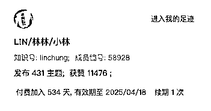

然而刚在知识星球app打完字，突然想到这现象背后，也能让我们去形成更有实用价值、负面价值的正向思考，而非只有情绪价值的负向吐槽。

如果你早已了解畅销书作家大冰这些年在互联网圈子引起的争议，相信你也早已明白我起的标题有什么意义。如果不了解也没关系，因为我会简单解释一下。

# ❓ 为什么是大冰？

起因是畅销书作家大兵早些年在自我介绍时，往往会加挂十来个毫不相干的头衔：不是主持人就是民谣歌手，不是背包客就是酒吧掌柜……仿佛自己有限的人生可以装下无限的职业和身份，令网友们觉得，如此简历包装更多是在自我吹嘘。

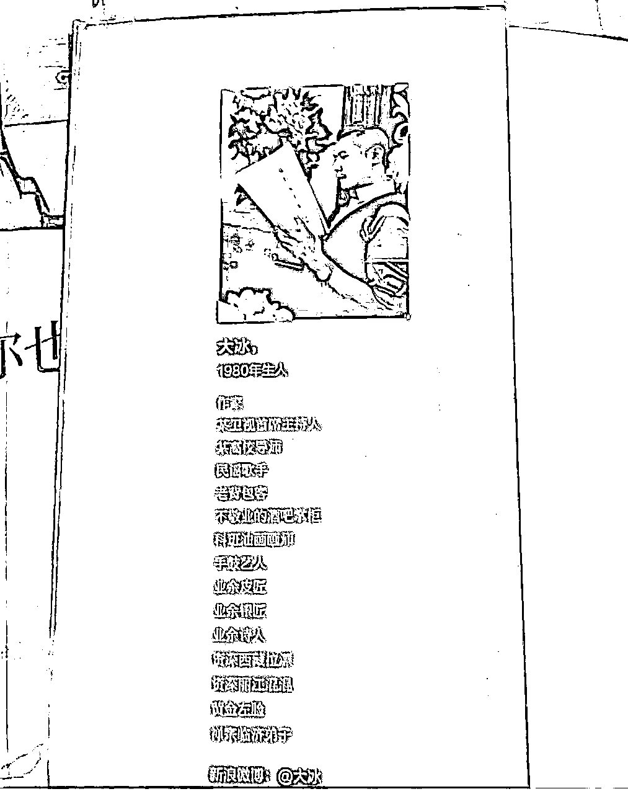

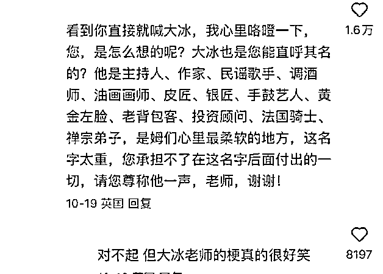

而我也在生财社群里发现了“大冰现象”：有很多素未谋面的会员，通过各种渠道跟我链接。当我刚加上他们的微信，看他们的自我介绍，或是朋友圈与个性签名，都能看到，他们是很多互联网社群、投资项目的合伙人，或者同时经营好几个彼此互不相干的业务。（这里就不放截图示例了，相信你朋友圈里就有，我也没必要得罪圈友。）

# 🚫 为什么不行？

如果不是跟他们一样在吃互联网这碗饭的人，可能看到被这样的人加微信会感到是一种荣幸，因为能感觉到对方非常有事业心，甚至觉得对方会想努力通过多种渠道去提高收入水平，让自己和家人过上更加幸福美好的人生，摆脱贫困和愚蠢，实现人生价值。

然而即便是我这个在2023年5月才加入咱们社群的普通人，过去一年多时间里通过添加圈友们的微信，发现很多圈友在网络上的形象设计与大冰有着异曲同工之妙，无论是他们的处境，还是生财的氛围，我都发自内心地感觉到不妙。

# 🙅🏻 哪里不行？

我之所以非常反对、厌恶、摒弃这一现象，不光是这一现象让我三番五次情绪失控，更是因为在情绪失控以后，发现这一现象并不少见。既然自己有点写作的能力和经验，比如把这一现象带到更多人面前，哪怕我的观点过于主观，圈友们的反馈，也能让我看到更客观的一面。

## 1️⃣ 无法背书你参与的所有项目。

现在加上一些会员的微信，都能看到他们的业务布局相当多元相当丰富，唯独欠缺专业度欠缺垂直度。

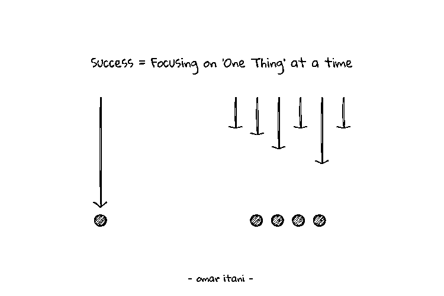

然而业务太多垂直度不高，给人感觉啥都会，但是没有一样遥遥领先。

举例来说，人家卖手机你也卖手机，但是人家做得更深入更细致，比你更懂手机，如果有人要买手机，你又有什么理由让人优先考虑？

更丰富多元的业务布局，看似能让你链接到更多人，实际上却很难找到追着你给你的产品和服务买单的人。

## 2️⃣ 给人留下你到处加人无脑爆粉的坏印象

充满广告感的问候语、个性签名和朋友圈，往往会让被加好友的人觉得你缺少诚意，觉得你就是为了加微信而加微信，说难听点真的“醉翁之意不在酒”。

更何况此情此景，就像是你正在办公室干活干到了进入心流，结果突然一个上门推销员未经同意直接进门，就这样打乱了你的工作节奏。

《县委大院》里的富商郑三，为了跟新上任的梅县长套近乎（也是有求于对方），见面后加到了微信，都得客气打声招呼，站在对方的角度献上一阵“彩虹屁”，用这样的方式表达自己的尊重。

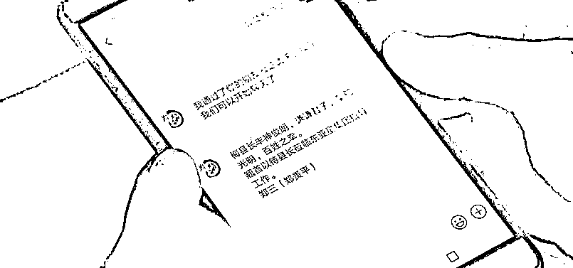

你我素未谋面，一上来却是堪比电线杆上，牛皮癣广告似的自吹自擂，如此糟糕的沟通体验，不光让我看不到你对我的尊重，还可能让我都不想在现实中和你打个照面。

## 3️⃣ 无法实现更高更快的增长。

再来，生财社群今年邀请不少航海家一起共读《10x is easier than 2x》这本书，本书有一个核心观点就是，比起在增量赛道追求2倍数增长（2x），在存量赛道实现10倍数增长（10x）也会更容易一些。

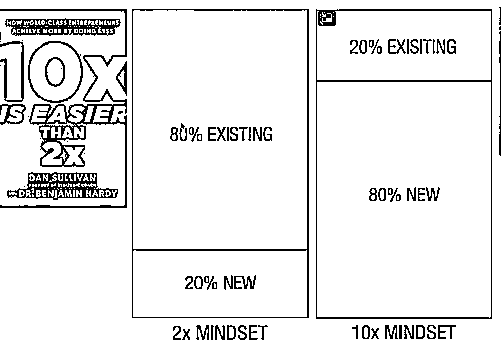

因为我自己也粗略读过这本书，所以觉得，这种“冰味”十足的个人形象，会让我对他们留下这样的印象：他们到处找新的项目新的机会2x，却无法将自己最擅长或是最有经验的项目和机会10x。

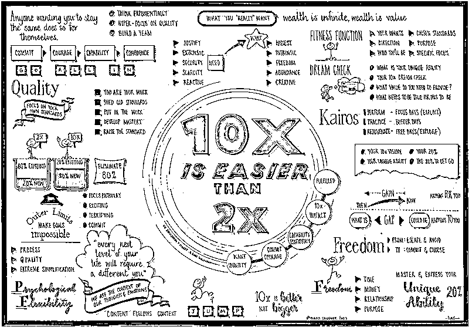

如此一来，我无法对他们在自己布局的项目取得的成就，感到充分的信任，哪怕真有他们提到的那些需求，也很难有优先考虑他们的理由。

# 🤷🏻 学大冰这事，关生财什么事？

生财有术从2017年创建至今，6万多会员共同经营，能有今天的氛围属实不易。然而树大有枯枝，总能在社群里遇到很多令我不适的人和事。诚然，以上内容都是我的一面之词，让我可能被不少会员圈友删好友或者拉黑。

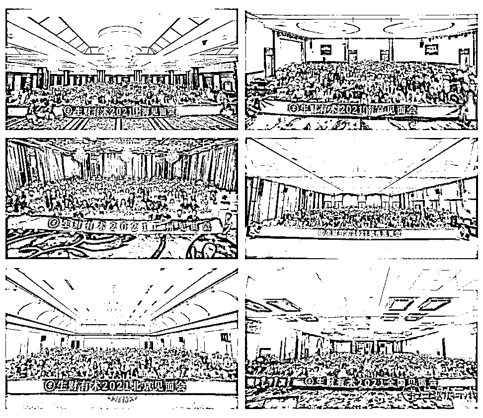

可事实是，如今已有一些会员因为一些很不愉快的事被劝退，那还在参与线上航海和线下组局的你，还在发帖子写风向标的你，为何不与6万多会员一起，直面你我身上有待改进之处？

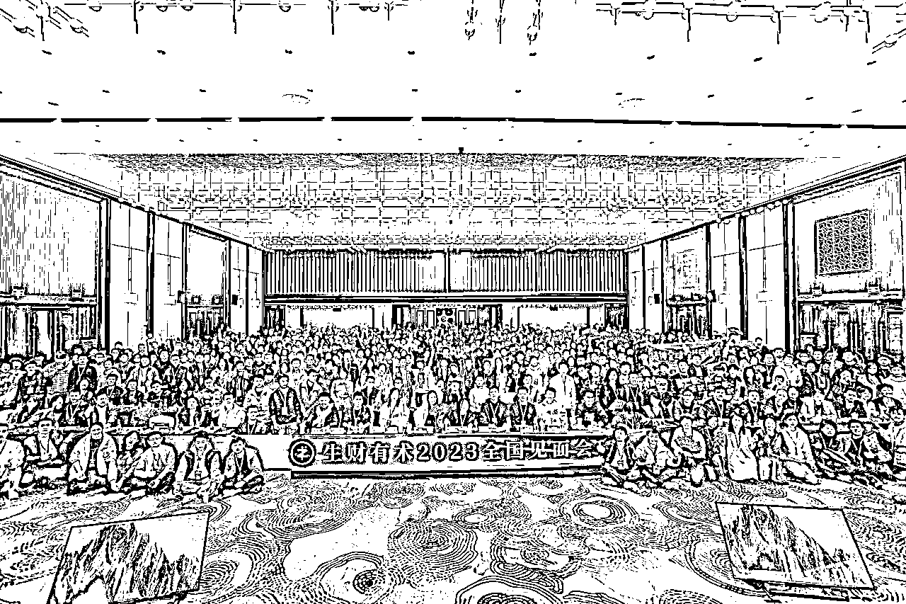

更何况对生财而言，劝退绝非目的，因为这些做的意义更在于让更多会员明白自己该如何正确使用生财的资源，如果发现自己不适合呆在生财，等到会员到期的时候，自然可以不用留下来，而是关掉手机和电脑，好好感受这世界的美好。

# 🤷🏻 不做大冰我们又能做什么？

如果只是为了吐槽甚至表达我对这类行为有多不满，我觉得也没必要写这篇帖子，浪费自己也浪费广大生财会员圈友的精力与时间。

所以在我看来，哪怕自己针对这类问题也给不出具有高度普适性与实用性的解决方案，那我也未尝不可以结合个人经验抛砖引玉，只要我把自己看似不够完美的方案丢出去，相信也有更多志同道合的会员圈友愿意与我一起把这套方案完善下去。

在我看来，你可以尝试在自己的个人IP公众号（有精力、时间、兴趣的话，不妨搞一个），专门写一篇文章作为个人经历的自我介绍，让初次结识的圈友能够降低他和你之间的信息差。

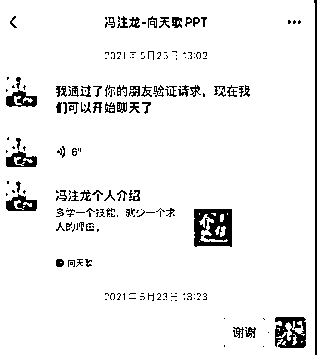

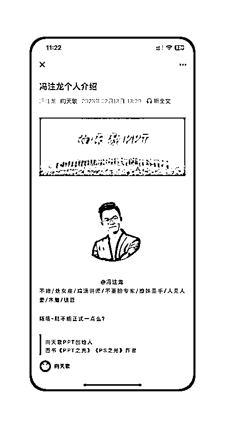

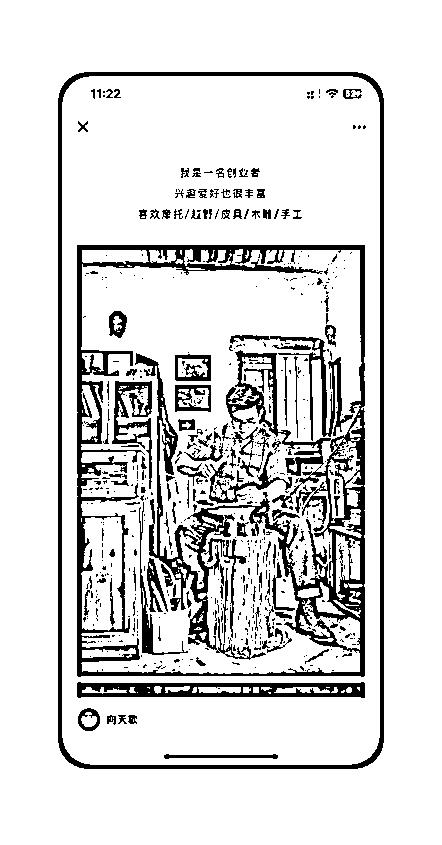

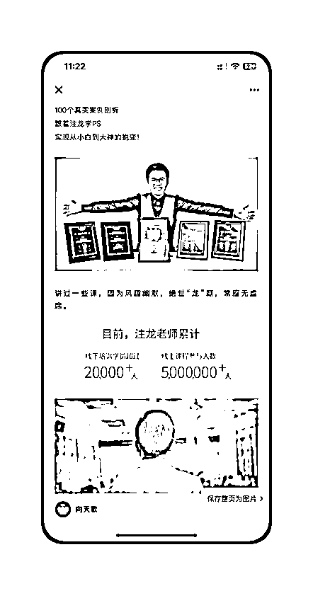

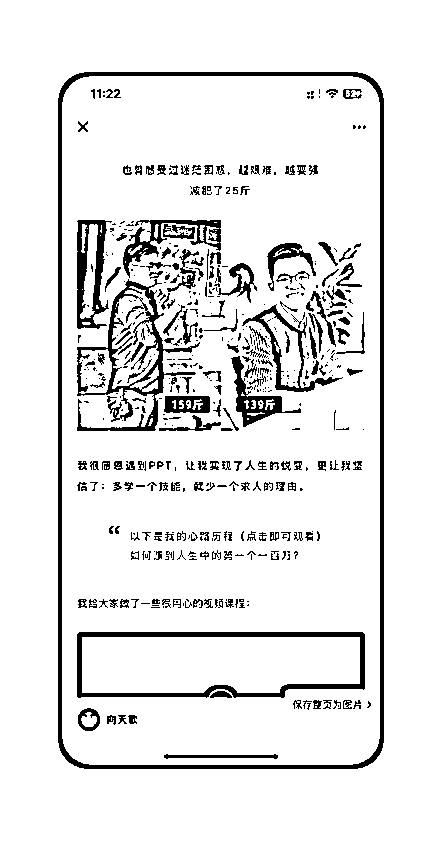

当然你也可以用飞书甚至是个人网站（有条件也可以搞一个）做一个个人说明书，用这种更显技术含量的方式来展示自己的基本情况、兴趣特长、工作履历、创业经验。

总而言之，我的方案未必是最佳的方案，但我相信即使再怎么不完美的方案，也都值得我们随着实操的深入、经验的累积而去逐步完善。

# 💆🏻‍♂️ 写在最后

正如我在开头所说的那样，如果只是为了吐个槽发个牢骚，我完全简单发个生财朋友圈就完事了。然而我也发现光是吐槽和发牢骚不能解决问题，既然如此，那不如把问题放在显微镜下分析分析，说不定也能从起因和经过里找到解决方案。

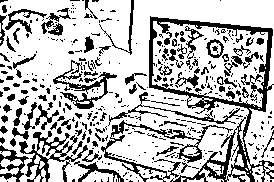

如果换成很久以前，这种和大冰自我介绍如出一辙的做法也是无伤大雅，毕竟身边没多少人会用这样的方式来包装自己。然而久而久之，好多人如法炮制，用刻奇式的陈腔滥调，给人留下负面想法。

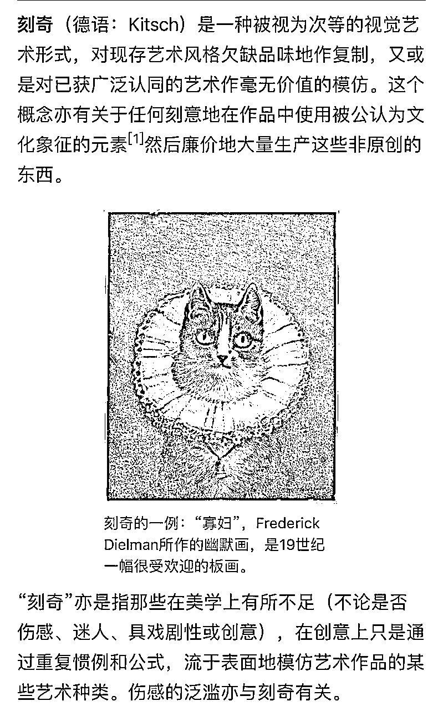

如果真意识到这类行为的不可取之处，相信你也会明白，我写这篇帖子，真不是为了人身攻击某某会员某某社群，要真想那样做，我完全可以采取更直接的方式（比如带上微信聊天截图，在星球里疯狂吐槽）。

成年人的世界，只有利弊没有对错，与其纠结有些事做是对还是错，不如大胆承认，要想利大于弊，我们又该怎么做？