# 分享一个巨大红利：付费流量，同城获客，三个月埋头苦干，从0-1，一个月过50万营收

> 来源：[https://hcn9k3ag2a4j.feishu.cn/docx/UXOndcymrodLPfxI4Cwc7KCHn8f](https://hcn9k3ag2a4j.feishu.cn/docx/UXOndcymrodLPfxI4Cwc7KCHn8f)

大家好，我是大家的老朋友丛政，加入生财4年，最早的时候做地产自媒体，中间转行跨电商了，但是我做的事儿一直都是围绕着流量，我做自媒体写公众号也好，做抖音也好，都是给自己的后端项目做赋能，只不过说后端的项目在不断的变化。

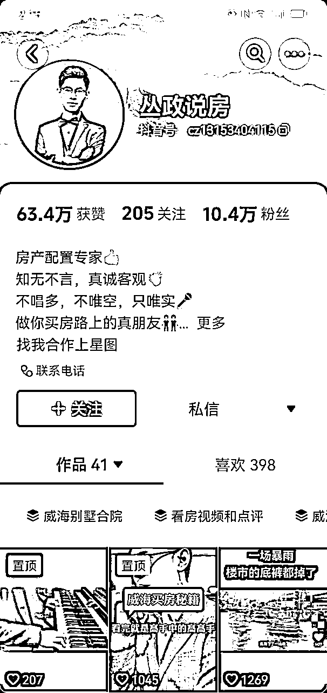

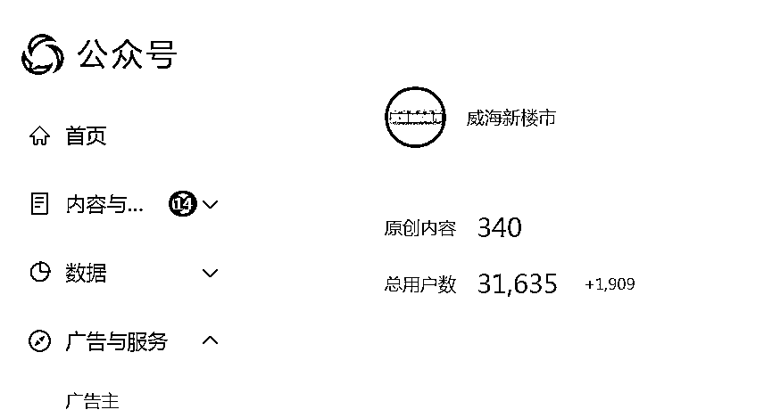

现在，我给大家分享一个我认为的一个机会，而且也是我已经把握住了的机会，通过这个机会，目前，我的本地线业务已经做到10万+，全国线业务做到40万+的，下个月预计还能加倍。

# 我的经历

关于我之前的经历，大家感兴趣的可以看一看我之前在生财发过的帖子，这里就简单说一下最近这两年的经历。

21年我们当时做的韩国平台酷胖，越来越卷，又加上疫情，公司产生了一些亏损，就把这个项目停掉了。之后呢，经历了很长的项目断档期啊，一直在找项目、0～1测试，但是都没有很成功的项目打出来。一方面，确实市场环境很差。另一方面是，我一直是指挥下面员工在做动作，自己不太上心，相信跟很多圈友的心态是一样的，结果没有一个干成的。总喜欢开会的时候说等着项目打出来，带着大家喝个庆功酒。结果拖了半年，也没有喝成。

去年的时候，我身边有个老哥跟我讲多接触接触政商，现在的资源都在政府的手里。再加上看到身边这两年稳定能挣到稳定钱的朋友都是做供应链的，自己也想接触接触这块，正好有一个机会，就是威海经区政府要投资15亿打造一个国际生鲜产业基地项目，有位领导很认可我的能力，我就担任了这个项目的整体的操盘手，负责整个线上和线下的运营统筹工作。

这个基地的建设周期比较长，我自己的自媒体和招商团队也没有停。在孵化一个项目的过程中，我发现了两个很严重的问题，我相信大多数做短视频公司的也都遇到过这两个问题：

①不管是陪跑，还是代运营的业务很难开展很难签单，主要是因为我们不是大的IP，头部的项目资源很难向你靠拢。谈单签单的时候没有足够的说服力，很难收到高客单，客户的信任度也不足，最关键的是你很难通过自然流量让客户真正有什么效果，我相信这是大多数短视频运营团队的一个痛点。前段时间参哥那个50万的，就是一个很典型的事件，对吧。

②第二个问题是我在做两个合作分润的项目过程中发现的。我们给威海一个女性私密项目做流量，合作分润，我们是矩阵和IP一起打的。结果花了一个多月的时间，矩阵打出来了，播放量粉丝量非常高，但是客资整体数量并不多。再就是就是IP，在经历过三轮拍摄之后，播放量反而只有1000多，我都开始怀疑自己的能力了。但事实并不是这样，我考察了一圈发现，事实就是平台的自然流量确实萎缩了，哪怕你内容做的很好，你也不一定能火。那么，如何能保持你的销售团队有稳定的进线有稳定的客资？如何能让一个项目快速的得到验证，产生0～1这个过程。我认为这是我必须要解决的问题。

# 市场机会

我在各地出差寻找解决方案的时候，对市场也有了一个更全面的掌握。

现在市场的情况，大家不管说是卖矩阵系统、传统的互联网广告公司、建站、小程序服务，还是现在的AI系统、数字人，又或者是代运营陪跑，包括电话外包，客服外包，所有的业务都存在一个比较致命的问题，就是大家都是先让客户交钱，但是无法保证客户一定能达到什么样的效果，也无法有一个客户体验，那么商家被割韭菜割多了，他们就害怕啊，他们怕自己拿不到结果，所以说你的签单压力就会很大。再就是各类型的产品五花八门，有的确实无法保证一个真实实际的好的效果。但是实体环境越来越难，大家都在为获客发愁。这里面就存在一个信息差。就是巨量ad用户的习惯已经发生改变，从原来的表单线索变成了现在的私信动作，成本就会降低很多，而且标签成熟，用户非常精准。其实我当时也很纳闷，像山顶会波波，他是靠着什么能收到那么多人？到后来，走过这一切，我才发现，其实很多人他们都是在通过付费流量快速的闷声发财。我相信大家现在都刷到了很多的广告，对吧，有全屋定制行业，有兴趣类的培训行业，然后包括美业，包括这个餐饮招学员，很多的项目现在都是可以先体验后合作的，他们其实本质上就是在利用这个机会。像苏州的星哥，他是专注于这个全屋定制赛道，他的团队是5个投手，30多个销售，单月业绩能做到300万。他就是在做垂类行业，先让客户体验，客户看到效果之后，选择帮客户做代运营或者教学。这种打法的销转成功率非常非常高，因为客户能看到结果，先看到结果再付费。

过去的商家找达人或者找代运营，它其实本质上都是把做流量能力交给了外面，而现在利用本地推，是自己掌握流量。

再有一个我通过这个事情发现的市场机会，包括我朋友在做的事情，我给大家分享一下。我菏泽的大哥现在自己在做卤味的招商加盟，单月的学员量能收到200～300个，同时他还单独起了一个盘，教这帮餐饮老板怎么招学员，也是大家常刷到的广告视频，他这个业务线单月能做到50万。他的团队3个投手，10个左右销售的配置，利润也非常可观，我们之间交流也非常多。而我合肥那个朋友，现在主要在做家居建材类目的教学和代运营。因为这个行业客单价比较高，这些老板过去找代运营公司效果非常不好，那么我们现在可以先体验，客户看到效果再付费。就是说垂直类目，通过这种方式做真的很香。

第二个机会在本地同城。本地同城的机会有两个啊，一个是头部，你去问头部，现在很多连锁型的企业，他们都在为流量发愁，在为获客发愁。下面这个是我朋友做的案例，合肥有一家头部的连锁企业，有1200家成人体验馆，现在遇到的问题是，流量不足，很多加盟门店业绩不好，他很着急解决这个问题，我朋友他用100块钱打出来了20个线索成功转换了三个，客单价是300，毛利润是70%，这是一个单店引流的案例，大家算投产比就好。现在他跟这个连锁企业谈的就是59800，加上分阶段的30%、20%、10%的一个毛利润的分润，如果你去服务这么一家头部连锁企业，基本上整个团队的基本盘就稳住了，所以说去切这种头部是非常香的。另一个机会就是切到好的项目里，像我刚才说的餐饮招商加盟招学员，或者是好的项目。你过去测试一个项目0～1可能需要很长时间，现在可能花了一两千块钱就能快速的打出100个客资测试销转率，能快速的验证一个项目是否能完成闭环。我们多数都不是大的IP，优质的项目信息很难向我们聚集和靠拢。但是现在的话，你可以通过这种方式在同城里筛选优质项目，只要你觉得它的利润可观，客单价也比较高，符合一个好项目的几个判断点。那么你就可以直接跟他谈分润，你帮他做流量，他去做成交，一起分钱就好。这个赚的是项目的钱，它会远比赚服务的钱要轻松且持久，且利润会高很多。当然这里面还有很多种玩法，有的也在打灰黑，但是我建议大家还是顺着平台去做事。

再加一点，这个事情红利期能有多久？我和身边的朋友聊过，包括做大健康的，做美业的，做国学的，大家都会遇到平台的严厉打击，封号很严重，这种情况本质上就是在对着平台干，这种项目往往活得不长久，包括无人直播，对吧，这种项目往往周期很短，或者无法做到一个持续稳定性，所以说我现在对创业的理解是，不是你能力多牛逼，而是平台在推动某个业务线的时候，你一定跟着去做，会有红利的。现在抖音官方大力在推本地推，对吧？本地生活也是抖音的一个很重要的方向，所以说巨量ad加上这个本地推，基本就完成了抖音体系内多数行业的一个全覆盖。Ad适合打线索，本地推适合去打同城。当然这里面还有一些细的区分啊，大家感兴趣的我回头可以把资料发给大家看一看，了解一下。

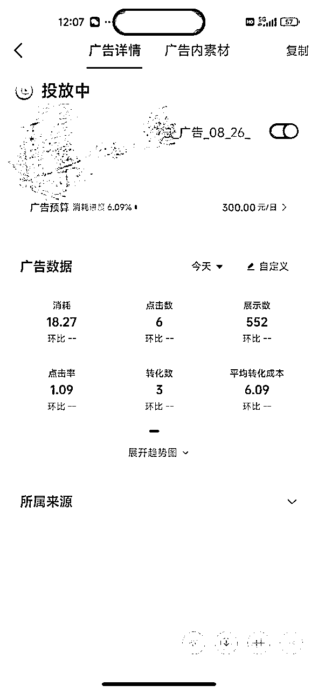

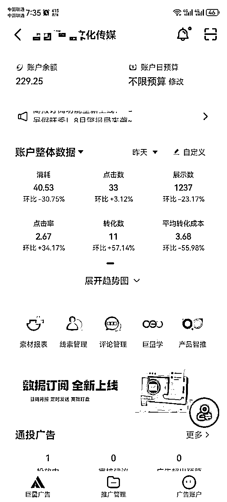

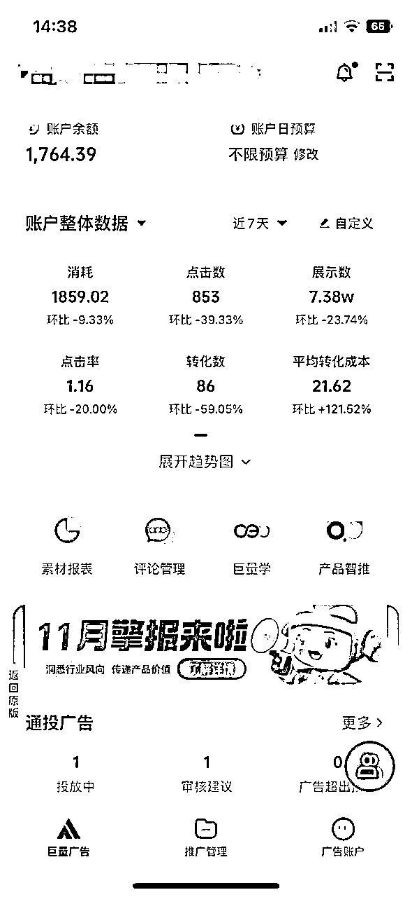

这是官方的数据啊，这是官方的行业统计，目前低成本的行业。像全屋定制，目前的客单价的线索水平基本上就在二三十，但是可能在半年之后，这个成本会增加到五六十啊，意味着现在两百块钱帮客户能打出10组咨询的，而半年后可能会有5组，但是在两年之后呢，可能200块钱只能出一组客户，这个就像千川一样，他是必然会经历的一个过程，到最后拼的就只剩下真正有实力有品牌的头部。那么无论是本地商家也好，还是咱们也好，如果说抓住这一波机会的话，还是可以大有作为的啊，至于说赚多赚少，全凭大家自己的方向的判断，包括能力、包括投入的一个整体的把握。

# 圈子的重要性

就是走过一圈之后，我发现要解决我前面说的问题，现在只有一个办法，就是付费流量。

那么为什么我会在这个阶段我才开始接触付费流量呢？因为在19年到20年这个时间段，地产下行的时候，我为了解决流量和客源的问题，去过海南的美房网，去过北京的安居乐业网，他们都是付费流量的团队，我跟他们都有过合作，也付了大几万找他们给我打客资，但我发现线索很不精准，我自己当时也尝试投放了朋友圈广告，包括头条系的广告，找代理投的。效果非常差，钱就跟打水漂一样，从那个时候我就种下一个认知，觉得付费流量都是骗人的，根本拿不到结果，这也导致我之后一直没有接触付费流量。

聊到圈子呢，我在20年做Tik Tok的时候，当时在合肥待过一段时间，交了一个朋友叫老谢。后来正好在一个群里遇到，他跟我分享，他发现了一个很好的机会，就是他有个朋友（四个字，业内是人尽皆知）在江苏那边，表面上他的公司是做直播带货体系，但是他们单独做了一个项目线，就是他带了一个助理，每天投600左右，就能加100多个百业的客户，紧接着晚上开一场直播，讲一讲后台怎么投放计划怎么搭建，收几个陪跑或者线下学习的，一天挣个1万就喝酒去，我朋友老谢呢就打算到他那边学习。

我得到这个消息的时候，觉得这个事儿挺靠谱的，就直接飞去合肥，跟老谢当面聊。当我看到了他们后台的数据，看到了他们抖音进线和微信进线的情况之后，我坚信这个就是我想要的。我当时就跟我这个朋友谈怎么合作，因为他也是花钱学的嘛，我就直接说给他1万块钱，后期如果说做项目能挣钱的话，再给分润，当时大概是这么定的。当时他还没有开始，我只是捕捉到了这么一个机会，因为我知道等到老谢把这个事情打出来的时候，那就不是我三五万能学到的，甚至有可能给多少钱人家都不教我，这个很正常，人之常情。

我回威海就专注在研究这个付费，中间踩了无数的坑，每天晚上盯计划盯到凌晨2点，早晨7点就起来，赶紧看看钱有没有跑飞跑烧。我首先进行的是一些行业的测试，

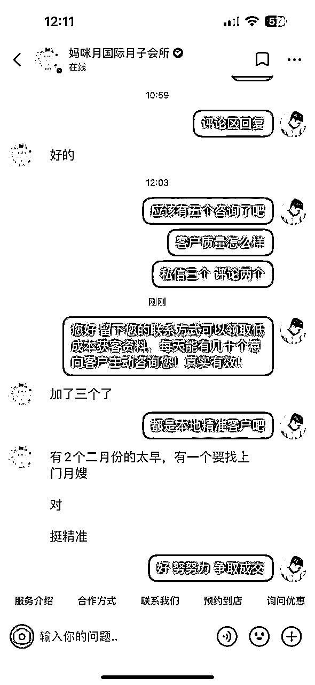

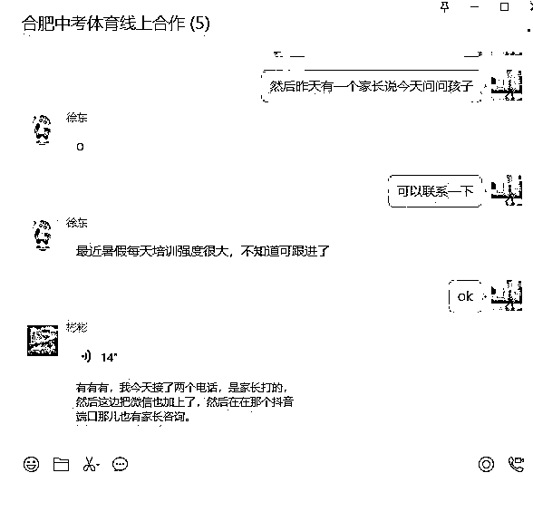

月子中心100块钱，我们带来了15组有效的咨，家居全屋定制5组，当我打出来一些案例之后呢，我就很有信心了，因为这些客户他们是通过一百两百块钱就看到了效果，后面他们就会主动的来问你怎么学习或者怎么合作啊，你可以挣这个学习的钱，你可以挣这个带人的钱。

但是如果说就威海市场的话，哪怕我每天都能签单，我的业绩一个月无非就是十几万二十几万。于是我就开始研究全国的模型，因为投流是很烧钱的，前后大概投入了近二十万，去进行百业的测试和全国的测试，最终我把这个全国的模型打出来了，我能做到任何一个城市每天都能加二三十组企业的客户，各个行业都有，它可能是个人的实体店，也可能是大的企业工厂。

我当时第一个念头就是说我要做自营体系，于是我就把销售组拉来，我给他们打线索，他们电话去谈单，但是在落地的过程中，测试了3天，我发现一个很严重的问题，当时烟台一个客户马上就要签了，结果，合同发过去之后，他说你们销售能不能来一趟，我说我们都在总部办公啊，不能外出，他说连面都不见，来都不愿意来一趟，那就算了，别谈了。再就是当时想的太理想化，我还想着一个人去负责一个城市，主管去负责一个省的管理。但现在再回头想想，我这个体系要做的多重啊，而项目的变化是很快的，我为什么不把团队做轻做小，做一个人效很高的团队？我现在回头再想，如果我当时真这么做，哪怕这个东西能打出来，我可能也会死的很惨，因为我的管理会非常非常重，我的人员成本会非常非常高啊。幸好最后我放弃掉这个模型，开始往各个城市复制这个模型，我把这个复制的体系叫做城市合伙人，他们到我们这里来学习我打出来的0～1这整套技术方法，然后他们回当地去开展业务，我给到他们的是从获客端到交付产品的一个完整的闭环，而不是单单的一个技能培训或者知识培训。

合作形式的话，我选择的是把门槛降到最低，因为它不是一个系统或者工具我可以掌控，而我也不可能说一分钱不收的教给大家，毕竟我打出这个项目也有成本，我的人员体系也有成本，所以说我最终把前置的费用定在了1万，后端的话，我定的是分润，纯利润的10%，关于这块我说说我的思考：

①首先第一个，就是合作做项目情况下，因为大家都不认识，你靠人性这个事儿根本就不成立，我哪怕合资成立公司，我派个财务过去，对方如果说不想分这个钱，那么他照样不会分。

②第二个就是，因为我是踏踏实实在这个项目打磨了2个多月，我是玩命死干干出来的，他不可能在极短的时间内拥有我所有的能力啊，包括打出来所有行业的案例，而这些是我们积累下来财富，也就是说他需要一个比较长的一个学习周期、需要我们去跟随服务的这么一个过程，短期内他是没办法脱离我们的。这个可以说是我们的一个控点吧。当然如果说这个合作伙伴他没有分润意识，没有分钱意识，我们也就不会有这个长期的赋能动作。

③第3点的话，像前面所说的，我经历过项目断档，所以我希望搭建这么一个体系出来，大家抓住这么一波红利期，都能赚钱。但是任何一个项目都是有周期的，而我们每个人都有发掘项目的能力，那未来有好的项目，我搭建的这套体系这个渠道，可能就能成为大家的渠道，比如说你现在打了一个项目出来，过去你可能说要从0～1的去做动作，而现在直接就有一个能覆盖全国的渠道网络，只要你的项目落地，只要你的工具能得到市场的认可，那么大家直接就可以把这个事情快速的推动起来。这是我想搭建这个平台的目的。而我会做什么呢？持续的给大家赋能巨量ad、本地推，包括小红书聚光的一系列打法啊。

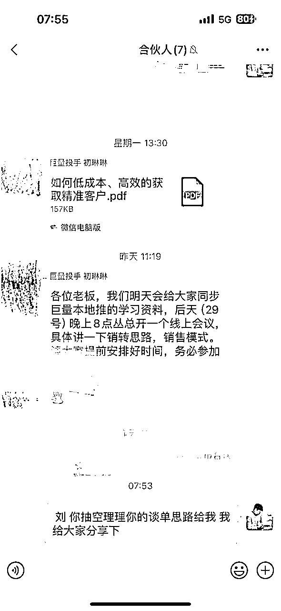

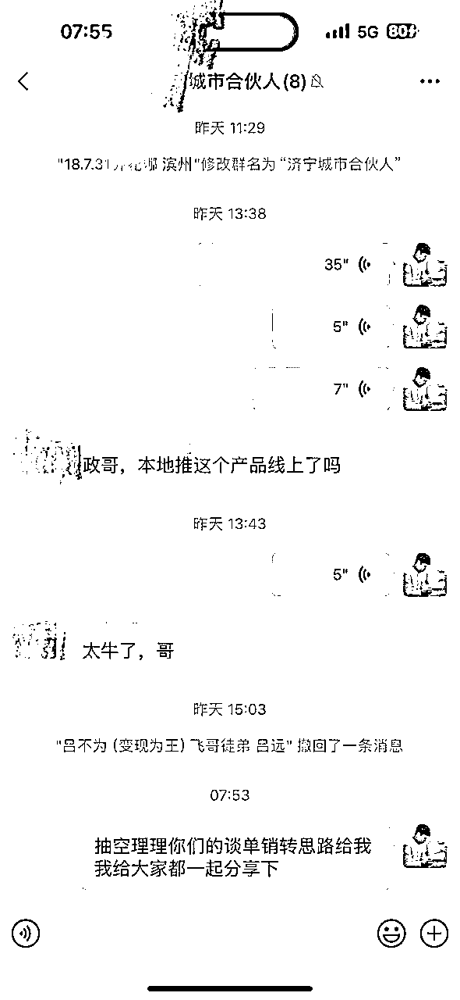

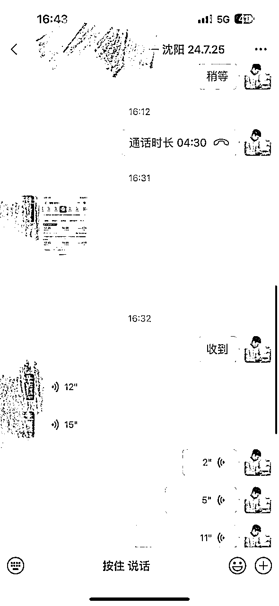

# 结语

其实这个事情，我之前没想发在生财里面，因为我也知道这个市场机会我最好是能悄悄把握住啊，但是在做了一段时间之后，我真的觉得这个市场是很大的，它这里面是有很多纵向发展机会，光靠我个人和我们这个团队无法短期内就做到什么样的程度。像是中间，我们的合作伙伴湛江的老吴，他有一个产品是一个矩阵产品，当时我尝试着帮生财的圈友投流，我自己掏腰包投流大家去销售，但是因为这个产品线他做不到像我们的产品线可以先体验后付费，这种炸弹式的威力。所以说在圈友落地过程中阻力很大。虽然这个项目也在进行，但我估计预期的效果不会特别好。所以说针对生财圈友，我的态度是这样的，就是第一大家如果说在投放上有什么问题，都可以来跟我们交流沟通，第二如果说大家愿意到我们这儿跟随着我们一起做的话，我的承诺是现场保证拿到结果，拿不到结果的话直接退款。第三，圈友们可以先体验后合作，无论你是垂直行业，还是类似于短视频自媒体的团队，都可以让你先体验来证明我说的事情都是成立的。我们能做到用投流的方式，让精准的意向客户主动来找你，而我们投流的成本非常低，也不需要你拍视频做直播。

最后，简单说几点，第一个我想对群友说的话是，这个项目是我自己从0～1完全跑通的，我自己做了前端的投放获客到销售到交付的一个完整闭环之后，我才开始把项目放大了。我希望大家在做任何项目，无论你小白也好，你是很强的牛人也好，我希望你都有这种0～1，这样的话，无论出现什么情况你都能抵御，你对团队的进展也了如指掌。第二个我希望做到的事情就是说能把这个平台搭建出来，我们持续的为大家赋能、投放相关的知识，不局限于这个巨量产品、小红书的聚光，

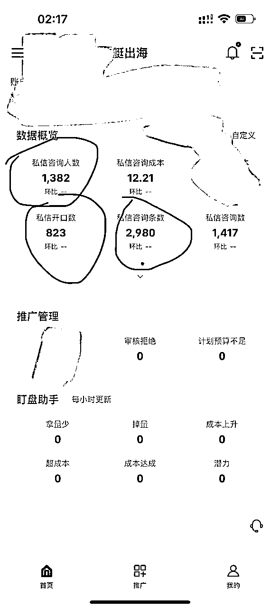

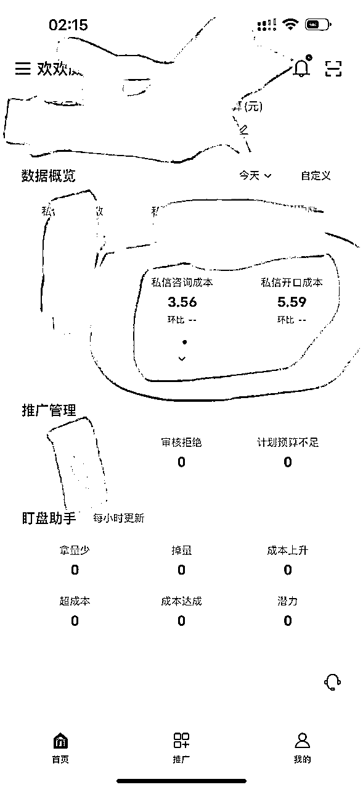

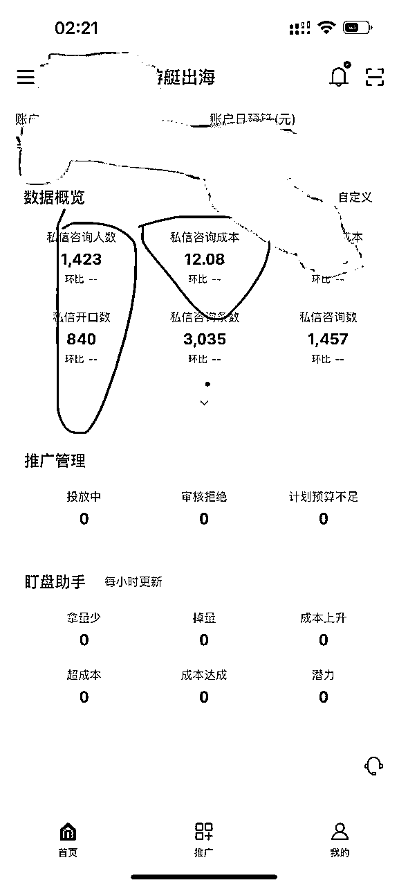

包括未来的视频号和TikTok，这些我们都会陆续的为合作伙伴去赋能，而且都是我们自己实战实操出来的，就换句话说就是我的计划怎么搭，你就跟着怎么搭，你搭的计划跟我是一模一样的，而我这边是有结果的。第三个点的话，大家如果说有优质的完成0～1的项目，大家可以和我对接，我可以带着我的这整个平台体系，大家一起帮你直接推向全国，而且我的这帮人是已经检验过的、有分润意识的。只要你的项目能落地，能挣钱，靠谱的，那么大家就会在全国各个城市搞，而不用你自己苦哈哈的做着招商的动作。第四个点，如果说你有自营的项目，需要流量需要放大，也可以跟我讨论，就像我前面所说，无论是付费流量还是自流端，我们团队都很擅长，做流量的几个板块，自热、节流、工具还有投放，我们在内容端和付费端都能够给你做增量，大家如果说觉得有合作的机会，可以一起交流。第五个点：目前我们这个项目0-1闭环项目模型完全打通，有做流量能力的，在找好的项目机会的朋友，欢迎来山东威海，共创事业。