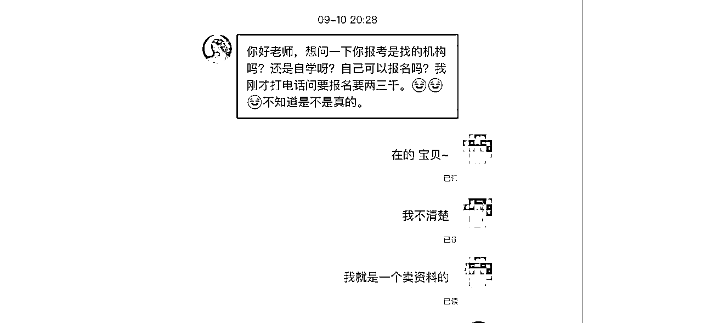

# 普通人如何借助影刀Rpa，操作闲鱼虚拟项目（附完整流程 +影刀代码 ）

> 来源：[https://riodtlbegu.feishu.cn/docx/BjISdPeNfoEPWuxyRuwcbpmpnRe](https://riodtlbegu.feishu.cn/docx/BjISdPeNfoEPWuxyRuwcbpmpnRe)

# 一.项目结果：

＇大家好 我是锦城

我从6.16日开始操作闲鱼虚拟项目，写文章的日期是9.16日,刚好三个月

大家可以先看我的成绩。

三个月累计营业额 2,平均一天下来大概98.28元.

还有一部分网盘转存和拉新的收益

还有一些客户是加到微信成交的,就不另算了！算上去的话 大概100-120元每天！

最初我给这个项目定的小目标是,在不花费太多精力的情况下

每天收益能有80-120元

就可以,合一个月2-3k！

成绩不是很出众,不过每个月能多赚2-3k的话

对于普通人来说也可以算是一个不错的副业了！我们福州这边平均工资大概4000-6000元!

# 二.为什么选择这个项目

### 1.了解闲鱼平台

闲鱼无货源模式很早就了解了,自己也去尝试过一段时间,虽然有出单,也赚到过一些钱

不过每天投入的时间也会比较多,后面就没有坚持下来了！

### 2.半自动项目

再加上自己之前操作过闲鱼平台

所以打算测试一下这个平台,测试一下 闲鱼+虚拟资料+自动发货 这个模式！

今年有在星球里面看到过几篇文章是关于闲鱼虚拟项目的,刚好自己对虚拟产品比较有兴趣

# 三.项目介绍

### 1.基本介绍

闲鱼虚拟项目就是在闲鱼平台上面出售一些资料,包括模板素材教程等不需要物流就可以完成交易的商品！

也很好理解,不需要物流意味着不需要繁琐的售后流程,单价也比较低

不需要像做闲鱼高客单价的商品一样需要压很多的资金,最快的订单可能刚自动发货发出去,客户看了资料没问题就会马上确认收货！

### 2.项目优点

优点1:门槛比较低,适合绝大多数的普通人尝试

优点2:没有复杂的售后服务,出单了之后发送相关资料就可以

优点3:零成本,第一次出单之后,第二单开始就都是利润

### 3.项目缺点

缺点1:门槛低意味着竞争大,容易造成价格战

缺点2:上限太低,适合当做一个副业去发展

缺点3:前期起步比较慢,大部分容易在前期放弃

# 四.怎么开始

### 前期准备:

1.保持好的心态,执行力

2.保持初心,沉下心来坚持一个月看看效果

3.就算目前一块钱也赚不到,还是需要把每天该做的事情都安排好

4.做互联网项目急不来,前期需要打好基础,后期才会轻松一些

可以看一下我最前面一个月是怎么开始并且坚持下来的:

可以看到第一天的收益为1.9元,第20天的时候收益才27.07元。

直到第30天收益才刚破百,106.27元！

前面20天左右我还没有写脚本,每天都是手动操作的,从采集到去水印到上传

全程都是人工操作的,大概一天需要3-4个小时左右才能全部搞定！

后面实在是有点想放弃了,就想着怎么可以提升一下效率,把自己的时间放在更有价值的事情上

花了一天多的时间,使用影刀Rpa写了3个脚本

1.闲管家网页版上传商品【模拟人工通过闲管家网页版上传商品】

2.闲管家客户端上传商品【模

3.小程序模拟人工去水印【可以看看效果,可以省人工,但是效率还是比较慢】

### 1.注册闲管家账号:

闲管家的作用是可以在电脑上面实现闲鱼商品的上传,当然手机也可以的

但是我觉得不是很方便【手机上传商品脚本我也写了】

当然电脑上面上传商品的不止闲管家,我自己对闲管家比较熟悉

如果有别的当然同样也是可以的,大家按需挑选自己需要的平台就行

注册地址: https://www.goofish.pro/register

注册闲管家账号,这里的账号跟闲鱼号无关,是专门拿来登录闲管家的

商家名称随便写就可以了

注册完了就可以直接登录到闲管家网页版

建闲鱼店铺,从弹出来的窗口直接进行登录即可！

目前闲管家高级版会员一个月28,一年117元，注意这是一个闲鱼店铺的,并不通用

如果你有多个闲鱼账号,每个账号都需要开通会员才能使用自动发货功能！

闲管家自动发货设置流程:

需要先设置一个自动发货模板,点击管家后台左边的模板,点击创建内容模板,具体怎么设置可以参考我的模板！

右边还有很多变量都可以选择使用,我就简单的选了一些！

在设置完了发货模板之后,我们点击左边的发货，选择销售中，选择对应的商品点击设置,进入设置页面

选择我们刚才创建的模板,发货附言就是我们要放我们资源链接的地方,点击完成

这样就设置好一个商品的自动发货！

每一个商品都需要独立设置一次自动发货,这样客户下单之后,才会自动发送商品链接！

目前闲管家的核心功能都已经了解完毕,包括网页上传商品和自动发货

还有别的很多功能就不一一说明了,大家有兴趣的可以自己注册一个了解了解！

### 2.下载影刀rpa

影刀RPA是一款软件机器人，能模拟人的各种操作，在任何应用程序上进行鼠标点击、键盘输入、信息读取等操作，释放各种有逻辑规则、重复性的人工工作。

下载地址:https://www.yingdao.com/client-download/

大家选择自己对应的版本就行了,一般都是win版本的,如果是苹果电脑有双系统的也是可以的

苹果系统我没测试过,好像有小伙伴测试过,是不行的,还有一个信创版没听说过不是很了解

下载完之后按照步骤直接点击下一步,选择适合己电脑的路径直接安装,直到完成即可！

打开影刀直接点击注册

直接按照步骤正常注册即可!

* * *

* * *

到目前为止我们就把准备工作都做完了,但是今天这篇文章主要是讲思路和逻辑

讲的是新人如何开始操作闲鱼虚拟这个项目,所以今天脚本代码部分不会占用太多比例

目前主要的影刀rpa代码主要功能有:

1.手机端的采集对标账号功能

2.网页端采集爆品功能

3.通过接口取商品链接和文案标题

4.通过网页取商品链接的文案标题

5.批量降价脚本

这几个功能已经可以提升非常大的效率

一会文章结尾我会把目前最新版本所有的脚本代码贴出来,大家直接抄作业就可以了

有一些影刀基础的小伙伴,基本都可以复刻出来

### 3.两种打法

1.精细化玩法:

每天上架5-8个商品,文案借鉴同行的,稍微做修改,检测违规词,图片用小程序取出来,然后简单的去重,上传的时候打好标签等等

总之每一步都需要精细化和时间来投入。

2.铺货流玩法:

每天上架20-30个商品,通过采集到的商品链接,提 选

在闲鱼搜索相关关键词,找到的爆品,点进对标账号的主页

可以在该店铺里面采集对应的其他爆款

同时可以获得一堆爆品的关键词,通过新获取的爆品关键词

又可以找到新的对标账号店铺,这样反复循环,就可以得到非常多的爆品！

比如我们搜索数据这个词语:

挨个点击店铺,比如我点进来第一家店铺:【做演示,实际需要多选 择几家才有更多的关键词】

可以看到,他店铺里面不止数据那个商品想要数量比较高

同时发现 他这里有一个游戏品类也卖的非常好！

这个时候我们可以做两个动作:

1.记录采集该同行店铺的爆品

2.第一步完成之后,在闲鱼搜索 “植物大战僵尸”这个关键词

挨个点击店铺,这里选择第一个店铺做演示:

可以看到,这个店铺有专门的游戏类目,并且每款游戏的想要数量都非常多

我们这个时候可以记录这个关键词,继续搜索其他店铺,并且获取到更多的关键词

以此类推...

这样我们就可以获得很多我们不知道的并且销量还不错的商品！这个方法比较适合新人前期找品

但是需要比较多的时间！

##### 2.AI+行业的细分领域

通过AI抓取热门或者冷门的细分领域关键词

在闲鱼平台搜索,配合方法1,也可以获得很多关键词,很多冷门但是卖的比较好的商品！

还有很多都可以细分,比如可以问AI全世界都有哪些运动,哪些乐器等等

都可以去搜索对应的教程！在配合方法1的话,可以找到很多关键词和爆品！

这个也方法也可以适合前期没有头绪的新人,让AI帮你找头绪,可以找到部分竞争比较小的行业 ！

##### 3.长尾关键词联想词

比如我们获取到一个关键词为:课程 我们可以在闲鱼搜索“课程”,由此我们可以得到

新的关键词"课程代找" "课程下载" “课程管理系统”这几个长的很像虚拟产品的词语

通过搜索结果发现,这几个确实是虚拟产品的关键词！我们在挨个搜索采集,筛选到自己的店铺即可！

当然我们还可以更细分的搜索上面的长尾关键词

我们可以得到更多的长尾关键词细分词,越到后面就越细分,竞争也更小！

我们可以手动或者使用脚本把这些长尾词都采集下来

挨个搜索，配合方法1实现更多关键词的覆盖和收集！

### 核心2:运营

1.账号准备:

大家还是尽量使用正规营业厅的卡,移动电信联通的都可以

保持一机一卡一IP

每个人的身份证都可以注册三个支付宝，三个支付宝就可以绑定三个闲鱼号

相当于一个人可以注册三个闲鱼号

这个闲鱼虚拟项目，尽量准备两个以及两个以上的闲鱼号,一个闲鱼号的话可能看不出来效果！

##### 2.养号

每天把签到任务里面能做的都做掉，每天都要做，这样可以获取闲鱼币，可以抵扣曝光

出单的商品需要开启闲鱼币的抵扣

##### 3.上架新产品

手动,自动上传都可以,每天需要有上传商品的动作,做精细化就上传的少一些,并且都做好优化

如果走的铺货流就使用脚本上传,每天上架商品,只有每天更新商品,闲鱼才会给你曝光量

##### 4.下架商品

每天需要把数据比较差的商品给下架掉,一般几天之后曝光还是几十一百多的,直接下架掉

如果你没有开通鱼小铺的话,前期需要更加频繁的下架商品！

##### 5.定期降价

如果你的对标账号的商品价格是1元的话,你可以定价1.2元,然后每天进行1-2次的降价动作

有脚本就使用脚本,没有的话就手动降价,降价也可以提高曝光量

##### 6.开通闲鱼币推广

##### 7.开启闲鱼币抵扣

##### 8.刷闲鱼

每天有看到好的同行,好的商品,及时记录下来,如果看到自己不熟悉的商品,但是销量还不错的话

可能是个异常值,也需要及时记录下来,然后去上架测试流量。

##### 9.适当的补单

前期如果一直都没有开单的话,可以适当的补一些单【据说现在补单会违规,我还没出现过】

我的做法是:

比如A账号需要补单,我会用B账号去闲鱼搜索小黄鱼0.01,小黄鱼等关键词

如果对方说可以的话,我们用B账号把A账号的商品链接发给对方,这样进行补单

这边有小伙伴测试新号一天补几十块钱,第二天曝光从几千提升到两万,营业额也提高很多,仅供参考

以上这些都是仅供参考,也可能是运气好没违规,可能你操作就违规了也不好说

##### 10.每天擦亮宝贝

打开闲鱼app,点击右下角我的,点击我发布的,一键擦亮

### 核心3:扩大收益

1.闲鱼虚拟资料可以配合网盘拉新来配合提高收益,我们来算一笔账:

比如你有三个支付宝,也就是三个闲鱼账号,你的所有推广的会员成本为:

闲管家一年117*3+百度会员一年188+夸克网盘会员一年120

总支出为: 351+188+120=659元

如果你每天的网盘收益为2元的话,一年的网盘收益为:730

相当于如果你每天能出2元的网盘收益,就可以覆盖掉你所有会员的成本

并且最近有活动,只要7天内转存超过6元,有送10T的空间,这个非常划算

最重要的是,你不需要做任何动作,你原本就应该需要发送资源给客户,你现在只需要开通了推广在发给客户

所以可以说是白嫖所有的会员！

2.我这边网盘推广选择的是右豹小程序

微信搜索小程序:右豹,直接按照正常步骤用手机号注册即可,邀请码可以留空

#### 1.开通百度网盘推广:

点击首页 拉到最底下 选择百度网盘推广 拉到最底下有一个二维码 用你的百度网盘扫码可以获取到UK

点击做任务,按照步骤填写就可以了！

百度网盘现在好像第二天自动通过的,点开这个链接能显示收益,说明通过了,首次通过赠送半个月的svip

https://pan.baidu.com/operation/activitys/promotionData/mine

#### 2.开通夸克网盘推广:

点击首页 拉到最底下 选择百度夸克网盘推广 拉到最底下有一个链接 用你的夸克网盘访问,绑定1008,根据步骤走!

点击做任务,按照步骤填写就可以了！夸克审核好像是2天左右就会通过了！

点击夸克网盘,显示查看关键词，显示发布中！说明已经开通了夸克网盘推广！

目前有活动,移动端拉新,原来是5元,现在是7元！

#### 3.引流到私域：

##### 案例1:

在出一些相关资料的时候,有的客户会问到一些相关的问题,比如这样的:

我在出售一个瑜伽是教程的时候,会有人客户问是不是本地上门的

我看了我商品的发货地选择的是深圳这样的一线城市,如果当时我有深圳当地的瑜伽上门教学服务

那么我这一单可能远远不止成交1元那么简单！

而且这样的瑜伽上门服务，如果你后端靠谱优秀的话可能长期都有复购也是有可能的！

##### 案例2:

我在出售某个课程笔记的时候,有很多客户都找不到报名的渠道或者机构

因为我在商品介绍里面说的是自用备考的,所以客户以为我有渠道

如果我真的有渠道,那么就可以跟渠道谈一下分成等等

我把客户介绍过去,如果成交了话,他给我一些返佣

那么就远远不止一天100元了！

##### 案例3:

教辅赛道在闲鱼同样是可以做的,可以看到想要人数和浏览的比例也挺高的

如果你目前在做小红书的教辅或者抖音的教辅,也可以尝试做一下闲鱼的教辅赛道

不过闲鱼的单价会比别的平台低一些！

##### 案例4:

大概就是有一个商品,我发布在本地,商品大概就是孩子发育比较迟缓,然后又有专门的机构针对这样的孩子做的服务

但是我找不到跟客户的聊天记录了,可能被清理了

当时因为是福州本地的客户,我就在美团上随便联系了两家问问有没有介绍分成什么的

然后就有了以下的短信聊天,反正最后人是推荐过去了

有没有成交就不知道了!

##### 案例5:

我们在客户确认收货之后,可以跟一段客户感兴趣商品,放在夸克网盘或者百度网盘,发对应的链接

因为是免费发的链接,尽量选择夸克网盘,用户使用量会低一些,可能会有拉新收益

具体如何设置：

这个可以根据大家自己的需求自己去设置

如果你出售一份小学一年级语文的资料,可以从中得出的信息是

客户的小孩子目前在上一年级,那么可以在确认收货之后赠送

点击闲管家后台左边的发货,点击销售中,可以设置商品付款之后发送,确认收货之后发送,好评之后发送

小学一年级数学的资料,一年级的相关资料都可以的

也可以得出可能是宝妈在家里带孩子,也可以赠送母亲所需要的商品等

以此类推,不要局限某一种商品,如果你卖了一份大学资料,也可以同行赠送大学创业相关的等

# 五.这三个月中得到的经验分享

1.每个人都是独立的个体,每个人的认知也都是不一样的

但是如果这样只要每天按照步骤完成几乎都能拿到一定的结果的项目,你还是拿不到成绩的话,可能是个人的问题

在和小伙伴的聊天过程中,能清晰的看到每个人都是不一样的,包括对项目的理解,和执行力和认知.

2.做项目的核心是你自己,脚本只能提高你的效率,如果你没有好好做的话

依靠脚本或者工具对你也不会有任何提升

有一些小伙伴认为,有了脚本,直接每天挂机就可以轻松躺赚,这个想法是非常愚蠢的

跟市场上一些挂机项目一样的,挂机单窗口一天几块几十块的,每天轻松收益几百几千的

如果有这样的项目,怎么不交给亲戚做呢,怎么会轮到你,我增加几百个设备,自己闷声发大财就可以了！

3.如果身上没有钱的话,不要轻易在互联网付费,现在互联网上面能学习的地方太多了

4.在互联网上面的各种项目宣传,你看到的都是别人想让你看见的,包括我也是这样的

当你宣传自己的项目的时候,还是会忍不住把其中做的最好的成绩展示出来

可能绝大部分人操作这个项目平均收益为100元,当你某个小伙伴一天收益稳定400+

你可能就会选择宣传这个400+而不是这个100+, 但是可能100个人里面就出了1个这个400+

5.当你的爆品周期已经过去的时候,也不用太在意,可能一个商品连续一两个礼拜每天都能出单几单几十单

突然有一天就一单都不出了,说明这个爆品的周期已经到了,是正常现象。

6.尽量避免违规,有的时候一个违规直接给你账号永久封号了,上传商品的时候注意要规避人名和机构名称

当然即使这样,一些违规我们还是不能避免,也要平稳心态,正常看待就行。

# 六.最新影刀Rpa相关的代码【抄作业】:

有基础的就直接抄作业就行了,如果一点基础都没有的话也看不懂

有基础的话 有这个截图应该差不多可以复刻百分之八九十了

如果还有问题的话,可以在评论区多交流,报错截图给我,我会给你合理的解答

#### 1.闲管家网页上传商品:

#### 2.闲管家网页批量降价【有高级版会员才能使用】:

#### 3.API接口去水印

#### 4.网页版闲鱼关键词采集:

#### 5.网页版取商品文案和图片

#### 6.影刀对接智谱API【可以使用API修改商品文案】

# 七.总结和感悟

1.闲鱼虚拟是一个非常适合互联网新手赚到第一块钱的项目,只要你每天投入固定的时间

每天把该做的动作都做一下,基本都可以很快得到正反馈。

2.如果你取得了一定的成绩,比如三个账号都有稳定产出,每天都能收益100-200的区间

可以尝试增加一些账号,看看有没有放大的机会,当然不可能每个账号都能起来的

3.选品永远是核心,怎么发现爆品就是我们每天的工作,每天就是不断的上下架产品,不断的出单

以便获得更大的曝光

4.这样的一个半自动化的副业项目,其中也有用到对标思维,Mpv思维,异常值思维,第一块钱思维,蓝海思维,运营经 验,Rpa技术等,所以沉淀很重要

如果以尝试一个项目即使没赚到钱,但是你可能会学习到别的东西,可以是思维,可以是技术,也可以是经验等, 以便 在未来发挥更大的作用

5.无论你做任何项目,至少要以月为周期,沉下心来,全身心投入进去,如果坚持1-3个月,还是看不到结果,说明这个项 目可能并不适合你。如果你坚持了一个礼拜看不到效果,就放弃了,说明互联网并不适合你。

6.Xx项目你怎么看,能赚到钱吗？ 不要问这样愚蠢的问题,每个项目都有人在赚钱，二八定律永远存在的,只有自己 下场实践了才知道行不行.在实践中成长,在实践中沉淀。

7.不要害怕违规,违规是常态,上架的时候避免出现机构名称,人名,违规率会大大降低，偶尔吃了几个违规也不用太 担心！保持好心态继续就行！在互联网上做项目,违规,封号是常态,不用把账号看的太重,引流账号都可以当做是消 耗品,只要产出的价值大于账号的价值就可以。

8.在向别人请教的时候,不管对方是谁,请保持尊重的态度去咨询,可以先表明自己遇到了哪些问题,目前自己做了哪 些操作,还是没有搞明白等等.而不是一上来就问问题,还理直气壮的,我就算知道,我也不搭理你。

9.互联网赚钱就跟开卷考一样,东西都告诉你了,狠狠执行就行了,很多人宁愿懒散几十年,也不愿意好好辛苦一年,宁 愿先甜后苦。