# Claude绘制SVG图形，新手入门实操教程与结果展示

> 来源：[https://lv9qj6hfr4z.feishu.cn/docx/CcfWdaFxbo2SNxxMZOtcbCXMnMC](https://lv9qj6hfr4z.feishu.cn/docx/CcfWdaFxbo2SNxxMZOtcbCXMnMC)

# 

在写作变现的这几年中，一直有一个问题困扰着我，就是数据可视化和做图表以及海报这些商单，很多情况下我都无法独立解决，必须求助外援。之前没有Claude的日子里，我都是苦哈哈的用wps流程图一个一个画图，用Excel输入数据一个一个制作统计图 扇形图等等。当我第一次接触Claude时，瞬间被它的强大图像创作能力所吸引。起初我以为使用Claude进行绘图会很复杂，但事实却出乎意料，只需要简单的文字描述，我就能轻松生成各种图形，无论是基础的几何形状，还是复杂的商业图表，Claude都能帮助我们实现。

经过我一周的研究琢磨写出了本篇教程，我希望通过这篇教程，帮助更多像我一样的初学者快速掌握Claude的基本操作，探索它丰富的创作功能。无论你是为日常工作制作图表，还是为创意项目设计视觉效果，Claude都可以成为你的得力助手。

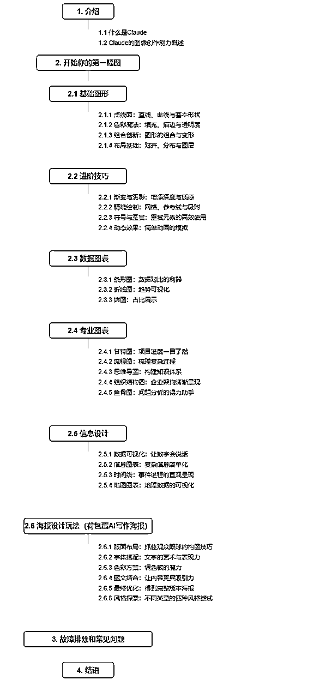

# 介绍

## 1.1 什么是Claude

Claude是由Anthropic公司开发的先进人工智能语言模型，代表了自然语言处理领域的尖端技术。作为大型语言模型（LLM）家族的杰出成员，Claude展现出卓越的语言理解和生成能力，能够处理各种复杂的语言任务。

Claude的核心优势包括:

1.  视觉理解:能处理和分析图表、图形等视觉输入。

1.  工具使用能力:可与外部API和函数交互,执行复杂任务。

1.  企业级安全性:具备SOC II Type 2认证,可选HIPAA合规。

1.  可靠性:低幻觉率,能准确处理长文档。

1.  灵活性:提供多个模型选项(Opus、Sonnet、Haiku),平衡智能、速度和成本。

1.  强大的语言处理能力:精通多语言,擅长文本生成、代码编写和复杂分析。

## 1.2 Claude的图像创作能力概述

我们通过提示词，准确无误的告诉CLAUDE我们想要生成的图形，可以生成SVG（可缩放矢量图形）代码，这些代码可以被浏览器或其他支持SVG的软件渲染成图像，只要我们的提示词指令准确 ，持续优化，明确细节，它会尽最大可能帮助我们完成图形的创作。

Claude的图像创作能力

图像分析与描述

*   能详细描述上传图像的内容识别图像中的对象、场景、颜色和文字

视觉数据解释

*   分析图表、图形和数据可视化，，从视觉信息中提取见解和数据

SVG代码生成

*   可以创建简单图形的SVG（可缩放矢量图形）代码，这些代码可被浏览器或支持SVG的软件渲染成图像

图像创作指导

*   提供详细的文字说明，指导如何创建特定图像，以描述绘画技巧、构图建议等

视觉问答

*   回答关于图像内容的具体问题，比较多张图像，指出差异或相似之处

辅助设计

*   提供色彩搭配建议，讨论设计原则和最佳实践

## 开始你的第一幅图

## 2.1基础图形

### 2.1.1点线面：直线、曲线与基本形状

提示词：画 ，直线、曲线与基本形状

自动生成代码：

<path d="M20,60 Q60,20 100,60" fill="none" stroke="black" stroke-width="2"></path>

得到结果图形如下：

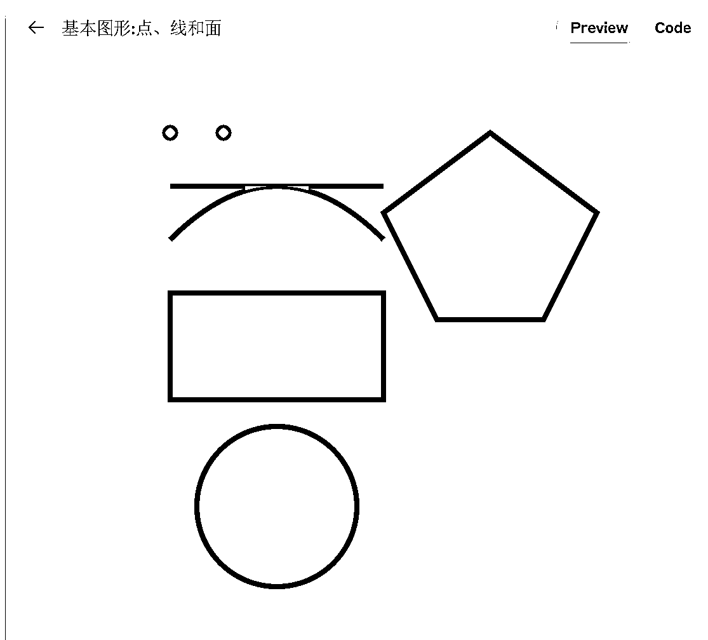

### 2.1.2 色彩魔法：填充、描边与透明度

我们可以尝试更加详细的提示词：比如画一个黄色的圆形 旁边有一个黑色边框的三角形 还有一个长方形 透明度为0.3

代码：

得到结果图

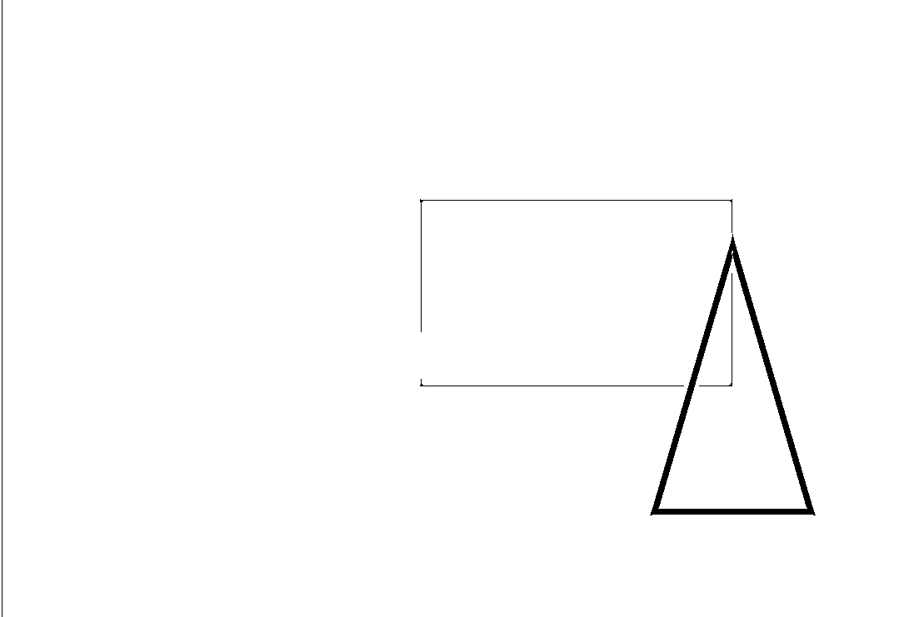

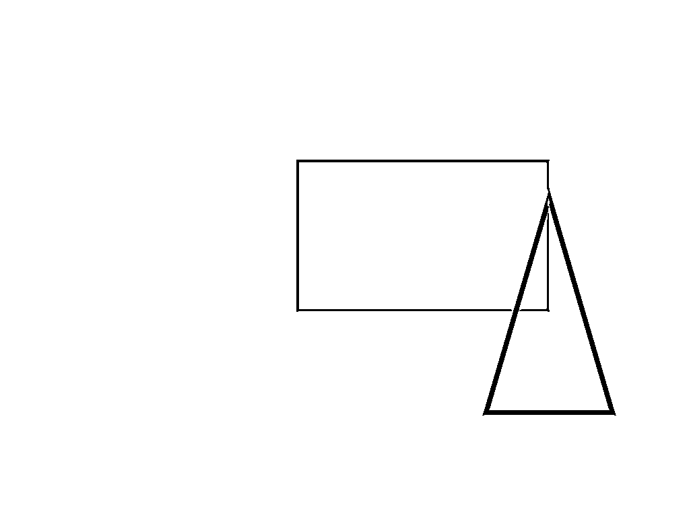

我们可以继续调整长方形的透明度，由0.3调整到0.7

代码：

得到结果图，与之前的图片对比，确实颜色更深了 透明度更高了 。

### 2.1.3 组合创新：图形的组合与变形

组合图形花朵的设计

提示词：

创建了一个组合图形,展示了一朵花和一只蝴蝶。解释这个设计:

1.  花朵:

*   花瓣: 由四个重叠的粉色圆形组成。

*   花心: 一个黄色的圆形位于中心。

*   茎: 用一个细长的绿色矩形表示。

*   叶子: 使用路径（path）元素创建了一个简单的叶子形状。

1.  蝴蝶:

*   翅膀: 用两个浅蓝色的圆形表示。

*   身体: 用一个简单的紫色三角形路径表示。

颜色选择:

*   花瓣: 柔和的粉色 (#FF9999)

*   花心: 明亮的黄色 (#FFFF66)

*   茎和叶: 清新的绿色 (#66CC66)

*   蝴蝶翅膀: 淡蓝色 (#99CCFF)

*   蝴蝶身体: 淡紫色 (#9966CC)

代码：

<path d="M103,180 Q120,170 103,160 Q86,170 103,180" fill="#66CC66"></path>

<path d="M170,40 L170,50 L175,45 L170,40" fill="#9966CC"></path>

得到结果图：

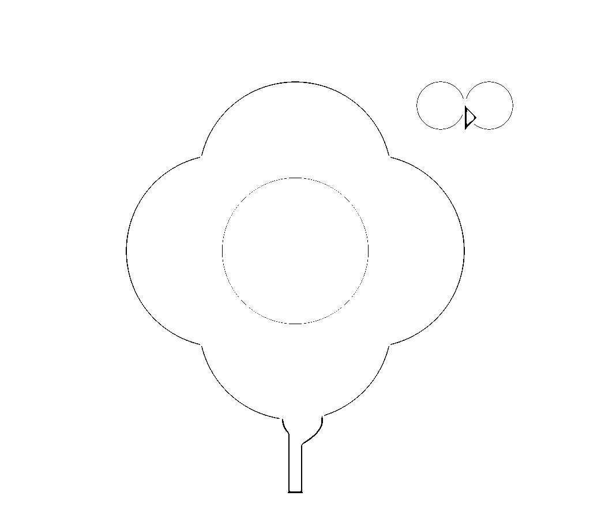

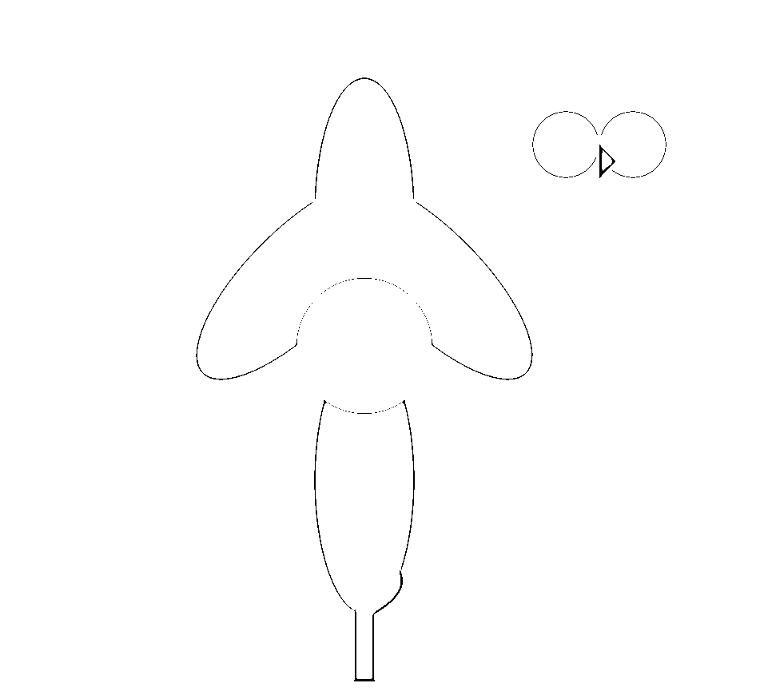

变形代码：

<path d="M103,180 Q120,170 103,160 Q86,170 103,180" fill="#66CC66"></path>

<path d="M170,40 L170,50 L175,45 L170,40" fill="#9966CC"></path>

### 2.1.4 布局基础：对齐、分布与图层

提示词：

整体布局：

*   SVG画布被分为左右两部分，每部分包含一个复杂图形。

*   右侧图形是左侧图形的镜像，通过SVG的变换属性实现。

每个复杂图形包含以下元素：

*   两条弯曲的路径，使用二次贝塞尔曲线创建波浪形状。

*   一个半透明的大圆形。

*   两条交叉的直线，形成十字。

*   中心的一个小圆点。

色彩设计：

*   左侧图形使用粉红色到红色的渐变。

*   右侧图形使用浅蓝色到深蓝色的渐变。

*   渐变通过SVG的<lineargradient>元素定义。</lineargradient>

对称性：

*   右侧图形通过transform="translate(400,0) scale(-1,1)"实现水平镜像。

*   这创造了一个完美的轴对称效果。

复杂性：

*   使用了多种SVG元素：<path>, <circle>, <lineargradient>。</lineargradient></circle></path>

*   结合了曲线和直线元素。

*   应用了透明度和渐变效果。

代码：

<path d="M50,100 Q75,50 100,75 T150,50 Q175,75 200,100" fill="none" stroke="url(#grad1)" stroke-width="3"></path>

<path d="M50,100 Q75,150 100,125 T150,150 Q175,125 200,100" fill="none" stroke="url(#grad1)" stroke-width="3"></path>

<path d="M85,100 L165,100 M125,60 L125,140" stroke="#ff5555" stroke-width="2"></path>

<path d="M50,100 Q75,50 100,75 T150,50 Q175,75 200,100" fill="none" stroke="url(#grad2)" stroke-width="3"></path>

<path d="M50,100 Q75,150 100,125 T150,150 Q175,125 200,100" fill="none" stroke="url(#grad2)" stroke-width="3"></path>

<path d="M85,100 L165,100 M125,60 L125,140" stroke="#5555ff" stroke-width="2"></path>

得到结果图

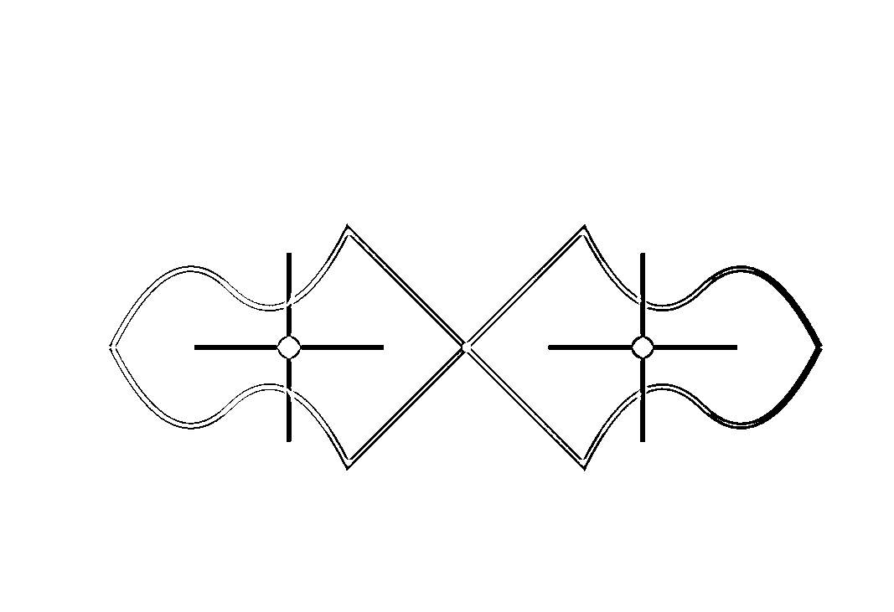

## 2.2进阶技巧

### 2.2.1 渐变与阴影：增添深度与质感

提示词：

我创建了一副时尚眼镜的SVG图形。以下是设计的详细说明：

1.  整体结构： 设计了一副典型的全框眼镜，包括两个圆形镜框、镜腿、鼻托和镜片。

1.  镜框： 使用深灰色（#505050）的粗线条绘制了两个圆形镜框。镜框的粗细设计给人一种现代感和稳固感。

1.  镜腿： 在两侧添加了简单的镜腿设计，与镜框颜色一致。镜腿略微向上倾斜，模拟实际眼镜的形状。

1.  鼻托： 用曲线连接两个镜框，形成简单而优雅的鼻托。

1.  镜片： 使用了蓝色渐变来表现镜片，给人一种轻微的色彩和反光效果。渐变从浅蓝色到深蓝色，增加了一些深度感。

1.  视觉效果： 在镜片上方添加了白色的弧线，模拟光线反射，增加真实感。

1.  技术亮点： 使用了SVG的<defs>和<lineargradient>元素来定义可重用的镜片渐变效果。利用<path>元素绘制了曲线形状的鼻托和镜腿。</path></lineargradient></defs>

得到代码：

增加深度与细节提示词：

<lineargradient id="lensGradient" x1="0%" y1="0%" x2="0%" y2="100%"></lineargradient>

<path d="M35,50 L5,40" stroke="#505050" stroke-width="4" fill="none"></path>

<path d="M265,50 L295,40" stroke="#505050" stroke-width="4" fill="none"></path>

<path d="M115,55 Q150,65 185,55" stroke="#505050" stroke-width="4" fill="none"></path>

<path d="M55,30 Q75,25 95,30" stroke="white" stroke-width="2" fill="none" opacity="0.6"></path>

<path d="M205,30 Q225,25 245,30" stroke="white" stroke-width="2" fill="none" opacity="0.6"></path>

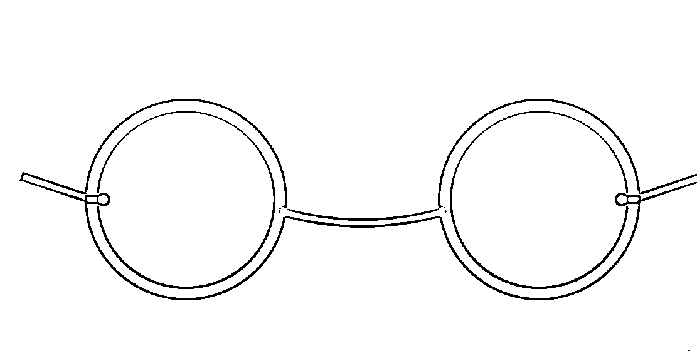

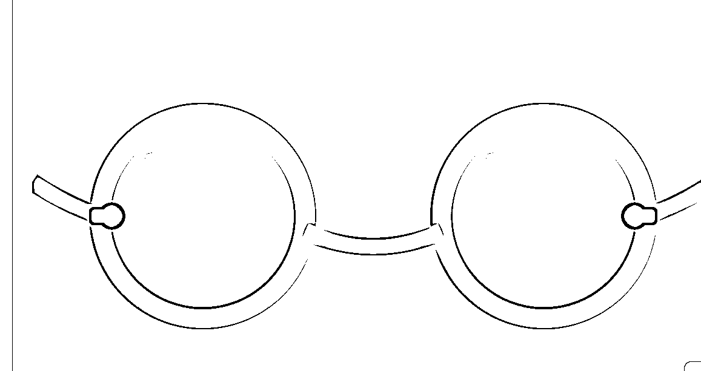

增加深度与质感

提示词：

我对眼镜设计进行了以下改进，以增加深度感和质感：

1.  镜框渐变：

*   添加了线性渐变(linearGradient)到镜框，从顶部的浅灰色过渡到底部的深灰色，创造出金属质感和立体感。

1.  阴影效果：

*   使用SVG滤镜(filter)为整个眼镜框架添加了柔和的阴影，增强了整体的深度感。

1.  镜腿改进：

*   将直线镜腿改为曲线，更符合实际眼镜的形状。

*   同样应用了渐变效果，与镜框保持一致。

1.  细节添加：

*   在镜框和镜腿连接处添加了圆形细节，模拟螺丝或装饰。

*   增加了简单的铰链设计，增强真实感。

1.  镜片效果：

*   保留了原有的蓝色渐变，但由于阴影效果的加入，镜片看起来更加立体。

1.  高光效果：

*   保留了镜片上方的白色弧线高光，现在与新增的阴影形成对比，更加突出。

这些修改大大增强了眼镜的视觉效果：

*   渐变和阴影创造了更强的立体感和金属质感。

*   曲线镜腿和额外的细节增加了设计的复杂性和真实感。

*   整体效果更加精致和高端。

代码：

<path d="M55,30 Q75,25 95,30" stroke="white" stroke-width="2" fill="none" opacity="0.6"></path>

<path d="M205,30 Q225,25 245,30" stroke="white" stroke-width="2" fill="none" opacity="0.6"></path>

### 2.2.2 精确绘制：网格、参考线与吸附

提示词：

SVG图形展示了网格、参考线与吸附的概念。

1.  网格：

*   整个画布上覆盖了一层浅灰色的网格。

*   网格间距为20像素，这在说明文字中有提到。

*   网格帮助用户对齐元素和保持一致的间距。

1.  参考线：

*   两条红色虚线贯穿画布的中心，一条水平，一条垂直。

*   这些线代表用户可以添加的自定义参考线，用于精确对齐。

1.  图形元素：

*   一个蓝色矩形和一个绿色圆形，代表设计中的元素。

*   这些形状是半透明的，以便更好地展示它们与网格和参考线的关系。

1.  吸附指示：

*   红色小圆点表示吸附点。

*   它们位于矩形的角落和圆形的中心，表示这些是元素可能会自动对齐（吸附）的点。

1.  说明文字：

*   添加了文字标签来解释图中的各个元素。

这个设计展示了这些概念如何在设计软件中工作：

*   网格提供了一个视觉参考系统，帮助用户保持设计的一致性和对齐。

*   参考线允许用户创建自定义的对齐辅助线。

*   吸附功能（由红点表示）帮助用户精确地将元素对齐到网格、参考线或其他元素。

代码：

<path d="M0 20 H300 M0 40 H300 M0 60 H300 M0 80 H300 M0 100 H300 M0 120 H300 M0 140 H300 M0 160 H300 M0 180 H300 M0 200 H300 M0 220 H300 M0 240 H300 M0 260 H300 M0 280 H300"></path>

<path d="M20 0 V300 M40 0 V300 M60 0 V300 M80 0 V300 M100 0 V300 M120 0 V300 M140 0 V300 M160 0 V300 M180 0 V300 M200 0 V300 M220 0 V300 M240 0 V300 M260 0 V300 M280 0 V300"></path>

<text x="10" y="20">网格</text>

<text x="260" y="20" text-anchor="end">20px 间距</text>

<text x="10" y="295">参考线</text>

<text x="260" y="295" text-anchor="end">吸附点</text>

得到结果图：

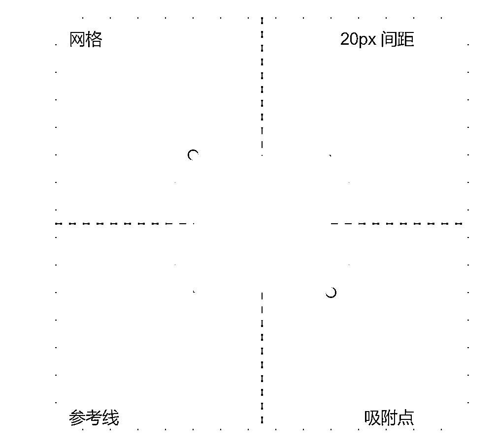

### 2.2.3 符号与图案：重复元素的高效使用

我创建了一个逼真的荷包蛋SVG图像。

提示词：

1.  蛋白：

*   使用不规则的路径创建了蛋白的形状，模拟其自然流动的外观。

*   应用了径向渐变，从中心的纯白色过渡到边缘略微灰暗的颜色，增加立体感。

*   添加了轻微的模糊效果，使边缘看起来更加柔和自然。

1.  蛋黄：

*   使用圆形代表蛋黄，位于蛋白的中心。

*   应用了从亮黄色到橙色的径向渐变，模拟蛋黄的自然色彩变化。

1.  质感细节：

*   在蛋黄上添加了一个椭圆形的高光，增加光泽感。

*   在蛋白上绘制了一些曲线，模拟蛋白的自然褶皱和纹理。

*   添加了一些小圆点代表煎制过程中产生的细小气泡或焦褐斑点。

1.  光影效果：

*   通过渐变和高光的精心放置，创造出立体感和真实的光照效果。

1.  边缘处理：

*   为蛋白和蛋黄添加了细微的描边，增强形状定义。

这个设计成功地捕捉了荷包蛋的关键特征：

*   不规则但圆润的蛋白形状

*   明亮、饱满的圆形蛋黄

*   蛋白上的细微纹理和煎制痕迹

*   整体的光泽感和立体效果

代码：

<radialgradient id="eggWhiteGradient" cx="50%" cy="50%" r="50%" fx="50%" fy="50%"></radialgradient>

<radialgradient id="yolkGradient" cx="50%" cy="50%" r="50%" fx="40%" fy="40%"></radialgradient>

<fegaussianblur in="SourceGraphic" stddeviation="1"></fegaussianblur>

<path d="M30,100 Q30,60 70,40 Q110,20 150,40 Q190,60 190,100 Q190,140 150,160 Q110,180 70,160 Q30,140 30,100 Z"></path>

fill="url(#eggWhiteGradient)"

stroke="#e0e0e0"

stroke-width="2"

filter="url(#eggBlur)" />

fill="url(#yolkGradient)"

stroke="#ffa500"

stroke-width="2" />

fill="white"

opacity="0.5"

transform="rotate(-30 90 90)" />

<path d="M40,100 Q40,70 70,50 Q100,30 130,50"></path>

<path d="M50,130 Q80,150 110,140 Q140,130 170,140"></path>

使用重复的元素，提示词与代码如下：

新设计展示了如何高效地重复使用荷包蛋元素来创建一个有趣的图案。

1.  定义可重用元素： 在<defs>部分定义了一个完整的荷包蛋元素（包括蛋白和蛋黄）。这个元素被赋予了ID "friedEgg"，可以在整个SVG中重复使用。</defs>

1.  重复使用： 使用<use>元素多次引用了定义好的荷包蛋。每次使用都应用了不同的变换（平移、缩放、旋转），创造出变化。</use>

1.  变化技巧： 缩放（scale）：改变荷包蛋的大小。旋转（rotate）：改变荷包蛋的角度。倾斜（skew）：稍微改变荷包蛋的形状。透明度（opacity）：使某些荷包蛋看起来更加淡化。

1.  布局： 荷包蛋被放置在画布的不同位置，创造出一种随意但平衡的构图。

1.  额外细节： 添加了一些小圆点作为装饰元素，增加整体设计的趣味性。

代码：

<radialgradient id="eggWhiteGradient" cx="50%" cy="50%" r="50%" fx="50%" fy="50%"></radialgradient>

<radialgradient id="yolkGradient" cx="50%" cy="50%" r="50%" fx="40%" fy="40%"></radialgradient>

<fegaussianblur in="SourceGraphic" stddeviation="0.5"></fegaussianblur>

<path d="M5,50 Q5,30 35,20 Q65,10 95,20 Q125,30 125,50 Q125,70 95,80 Q65,90 35,80 Q5,70 5,50 Z"></path>

fill="url(#eggWhiteGradient)"

stroke="#e0e0e0"

stroke-width="1"

filter="url(#eggBlur)" />

fill="url(#yolkGradient)"

stroke="#ffa500"

stroke-width="1" />

fill="white"

opacity="0.5"

transform="rotate(-30 60 45)" />

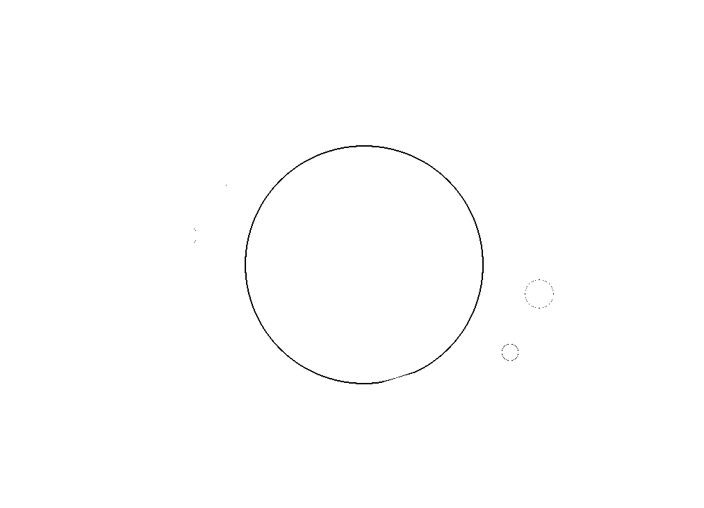

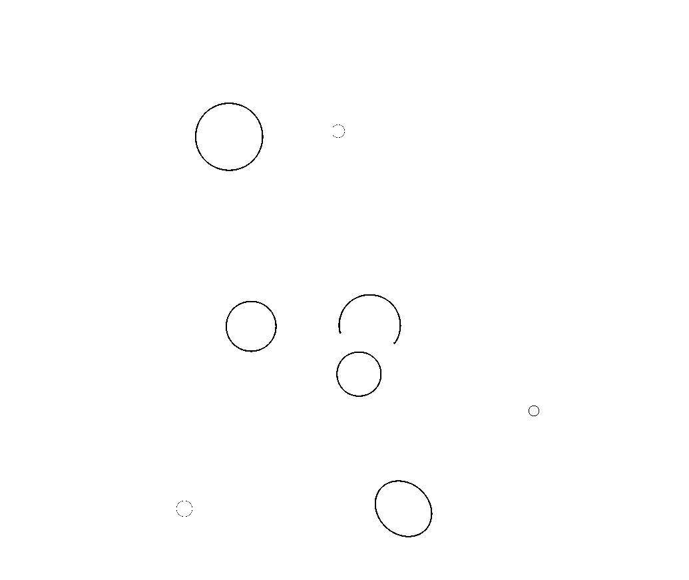

### 2.2.4 动态效果：简单动画的模拟

动画效果的荷包蛋

提示词：

这个新设计为荷包蛋添加了简单的动画效果，模拟它们在煎锅中的样子。

以下是动画效果的详细说明：

1.  蛋白变形： 使用 <animate>元素来轻微改变蛋白的形状，模拟煎炸过程中的轻微变化。</animate>

1.  蛋黄移动： 为蛋黄添加了轻微的上下移动动画，模拟煎炸时的轻微跳动。

1.  高光闪烁： 蛋黄上的高光会轻微变化其透明度，模拟光线的变化。

1.  整体晃动： 为整个荷包蛋组添加了轻微的晃动效果，模拟煎锅中的微小震动。

1.  油花效果： 添加了几个变化大小的圆点，模拟煎炸过程中的油花。

1.  背景： 添加了深色背景，代表煎锅表面。

这些动画效果共同创造了一个生动的场景：

*   蛋白的轻微变形给人一种正在煎炸的感觉。

*   蛋黄的移动和高光的变化增加了真实感。

*   整体的轻微晃动模拟了煎锅中的微小震动。

*   油花的效果增添了煎炸过程中的细节。

代码：

<radialgradient id="eggWhiteGradient" cx="50%" cy="50%" r="50%" fx="50%" fy="50%"></radialgradient>

<radialgradient id="yolkGradient" cx="50%" cy="50%" r="50%" fx="40%" fy="40%"></radialgradient>

<fegaussianblur in="SourceGraphic" stddeviation="0.5"></fegaussianblur>

<path d="M5,50 Q5,30 35,20 Q65,10 95,20 Q125,30 125,50 Q125,70 95,80 Q65,90 35,80 Q5,70 5,50 Z"></path>

fill="url(#eggWhiteGradient)"

stroke="#e0e0e0"

stroke-width="1"

filter="url(#eggBlur)">

<animate attributename="d"></animate>

dur="3s"

repeatCount="indefinite"

values="M5,50 Q5,30 35,20 Q65,10 95,20 Q125,30 125,50 Q125,70 95,80 Q65,90 35,80 Q5,70 5,50 Z;

M5,50 Q5,35 40,25 Q70,15 100,25 Q130,35 125,50 Q120,65 90,75 Q60,85 30,75 Q5,65 5,50 Z;

M5,50 Q5,30 35,20 Q65,10 95,20 Q125,30 125,50 Q125,70 95,80 Q65,90 35,80 Q5,70 5,50 Z" />

fill="url(#yolkGradient)"

stroke="#ffa500"

stroke-width="1">

<animate attributename="cy"></animate>

dur="2s"

repeatCount="indefinite"

values="50;48;52;50" />

fill="white"

opacity="0.5"

transform="rotate(-30 60 45)">

<animate attributename="opacity"></animate>

dur="4s"

repeatCount="indefinite"

values="0.5;0.7;0.3;0.5" />

<animatetransform attributename="transform"></animatetransform>

type="translate"

dur="6s"

repeatCount="indefinite"

values="0,0; 2,-2; -2,2; 0,0"/>

<animate attributename="r"></animate>

dur="2s"

repeatCount="indefinite"

values="3;5;3" />

<animate attributename="r"></animate>

dur="3s"

repeatCount="indefinite"

values="2;4;2" />

<animate attributename="r"></animate>

dur="2.5s"

repeatCount="indefinite"

values="4;6;4" />

动态结果展示：

## 2.3商务图表

### 2.3.1 条形图：数据对比的利器

比如我们在做数据可视化的过程中，我们收集到了一些数据，但是平时用Excel一条一条输入数据再制作图表太麻烦了，因此 我们可以使用Claude 来快速根据数据生成条形图与柱状图。

我提供的数据：

泽鑫电力科技公司2020年-2022年主要经营指标表单位：万元

把数据输入克劳德，命令克劳德根据数据生成条形图与柱状图，每个年份都有三个条形,分别代表这三个指标。从图中可以看出:资产总额(蓝色)在这三年中保持相对稳定,略有增长。负债总额(橙色)呈现逐年下降的趋势。营业收入(红色)有显著增长,特别是在2022年有大幅提升。

代码：