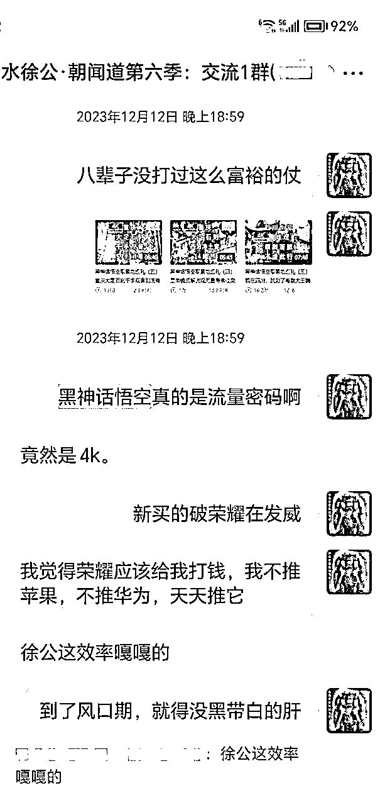
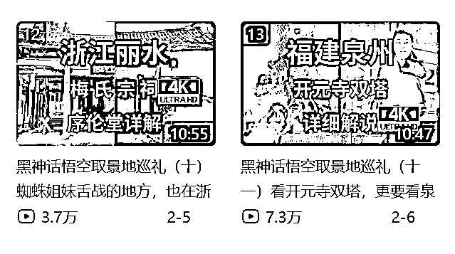

# 关于黑神话悟空的热点预判详解

> 来源：[https://x32zygbonn.feishu.cn/docx/DTDAdLcLroaDfKxRizrc7p1OnIh](https://x32zygbonn.feishu.cn/docx/DTDAdLcLroaDfKxRizrc7p1OnIh)

近期最大的热点，便是横空出世的黑神话悟空了。而我，则是提前一年就预判到了它，并且在B站布局了内容。并做到了10万粉丝，拿到了知名出行up主的认证。

当热点正式到来的时候，我也使劲跟了一波流量。目前我的这10万粉丝里，差不多有半数的粉丝，都和这个热点有关。

严格来说，B站的变现水平其实挺一般。我这个级别的账号，每个月也不过是小几千块，只有接了大商单，才能月入大几千甚至上万，这样的商单几个月才能轮到一次。但好就好在，当我成为10万级的博主之后，就能参加B站的很多扶持奖励活动，这些活动都是有额外收入的。这多少也是一笔钱，当然也是值得期待的了。

那么下面，我就根据时间线，来重新梳理一下，我是如何观察到黑神话悟空这个热点，并且如何一步步提前布局，最终彻底跟上这波东风的。

（一）2023年9月

在此之前，我并不了解黑神话悟空这款游戏。毕竟我现在工作也忙，日常要做的事情也多，更重要的是，我这年纪也逐渐大了，已经不再是那个激情澎湃打游戏的年代了。所以对游戏，也没有多少关注了。

而且我从没想过真去当游戏博主。要知道，能被互联网推到前台的游戏博主，要么是一等一的游戏高手，要么是一等一的整活高手。拥有这种天赋的人，本来就是凤毛麟角，而且还需要花大力气去练习。这种快要卷成麻花的赛道，非常不值得我们去选择，所以这绝不是一个好的变现方向。

言归正传，在2023年8月20日前后，也就是黑神话悟空正式发售一年之前，他们官方在杭州，搞了一次线下试玩会。这次的声势非常非常大，尤其在B站，这个热点几乎都要屠版了。只要在那时候点开B站，就必然能刷到黑神话悟空的相关内容。

我也是在试玩结束后的9月，才看到了虎先锋、靡道人这些游戏角色的相关内容。当时我就感觉，虎先锋的战斗特别有梗，而且非常有难度。事实也是如此，我今年在通关的时候，打虎先锋整整打了三天，才算是打过去。

而靡道人本身，则是个小角色，在游戏里面的存在感，本来不应该很高，但是靡道人的配音森中人，是个非常厉害的配音角色。这直指人心的灵魂配音，一下子就给我俘获了，于是我，就在那个时候入了坑。

然后我顺藤摸瓜，顺便找到了他们在2022年，发布的实机剧情视频，以及当时公布的歌曲《戒网》。这首歌非常好听，而且演唱人也是专业的水准，填词则是游科的老板冯骥本人。就这首歌曲的制作水平，我们将其称为国手作品，都丝毫不为过。

如果一款游戏在发售之前，就能从边边角角的方向，发现国手的痕迹。这足以证明它有爆款的潜质。何况这游戏还没发售，就有了巨大的热度。倘若有一天真的发售了，那这个热度，不得把人吓死？

我2023年开始布局这个热点的内容，已经算是比较晚的了。根据我的观察，早在2020-2021年，就已经有人开始布局这个内容，并且获得了巨大的成功。

不过我后来发现，对于旅游博主来说，我2023年底开始，到2024年上半年开始布局，反而赶上了最好的时机。到后面我们细说。

不过当时，我只知道应该提前布局，但并不知道该怎么做这件事。因为我在b站的账号，要么是知识类账号，要么就是旅游号。这到底该怎么去做，才能蹭到这个热点呢？

也就在这个时候，我刷到了别人发的黑神话悟空取景地视频。然后我顺藤摸瓜，发现这款游戏的很多取景地，都是用中国古建筑实景扫描而成的。这一下子，恰好就可以和我的旅游号结合起来了。也就是，出几期取景地视频。

说干就得干起来。但前期不能投入太多，也就是简单试试水，试水效果好了再继续。所以我选的第一个取景地，便是河北张家口蔚县的玉皇阁，因为蔚县和我距离最近的，大交通成本最低，当然就先从这边开始了。

当时我的手里，恰好有京津冀年票。本着省钱的原则，我既然到了蔚县，就把当地那几个年票所包含的收费景点，通通都转了一大圈，然后顺便跑了河北周边的几个县城，逛了附近的很多景区，然后才回的家。

当时我心里根本没底，但第1期内容做出来之后，我发现流量还不错。起码游戏的粉丝，对我还是比较支持的。于是，我就有把这个系列，继续做下去的打算。

（二）2023年11月

就在那段时间，我心血来潮，打算去川渝贵旅行一圈。正好顺路看一看重庆的大足石刻，以及逛一逛四川的醴峰观、安岳石窟等等，这些都是黑神话悟空的取景地。

但是很可惜，我大老远去了一趟川渝，却没有拍太多的素材出来。因为我在中途旅行的时候，不幸把脚给崴了，整个人的行动能力也差了很多。最后是一瘸一拐地，才把这趟十几天的旅行走完。

因为这一趟走得时间太长，所以我直接就病倒了。当我回去的时候，就带着病，把黑神话悟空第2期和第3期的音频，给录了出来。然后做成了视频。

如今再去回看这两期视频，你会发现我当时的声音，都是嗡声嗡气的，一听就是阳了还没好利索。但我们也不难发现，虽然音质很差，并不耽误我这些视频起爆。

原因包括以下几条。一来，是因为我这些内容，在当时的平台算是比较稀缺的；二来是运气好。在我发布第3集视频的时候，恰好赶上黑神话悟空2023年12月8日的发售预告，然后借着这波热量，就这么火起来了。所以我2-3期的黑神话视频，就能爆成这样的水准。

在之后的日子里，我就趁热打铁，把黑神话悟空相关的视频，都更了出来。

等这个系列吃完了之后，我就开始更其他的视频，然后我的流量，又回到了最初不温不火的状态。

与此同时，我也提醒我的老学员们，这个热点是一定要蹭的。只是不知道有多少人，真的落实了这件事。

当时被我吸引过来的黑猴粉，普遍觉得我这一系列的内容，流量应该更高一些。但我们关起门来，说句私心的话：其实我对这个流量水平，已经是挺满足了，毕竟我当时也没多少粉丝。我本身又不是多重要的up主，这几期视频能有这个流量，就已经很不错了。

（三）2024年1月

我在2024年年初，已经不打算出门了。因为我当初，在川渝贵也拍了不少素材，之前还囤积了很多北京的、山东的素材。靠吃这些素材过一个冬天，那也未尝不可。

但在那个时候，家人要去福建旅行，重点去福州和厦门。在这两个城市里，没有我要重点拍的地方。但距离福州不远的泉州，以及不远处的浙江丽水时思寺，这可都是黑神话悟空的取景地。来都来了，怎么能不顺便跑一趟呢？

所以，我就借着这次旅游的机会，拍了时思寺和梅氏宗祠这两期视频（梅氏宗祠也是时思寺景区的一部分）。然后我又到福建泉州，拍了开元寺双塔的素材。

我做的是旅游视频，所以一般都是在外面拍完，然后回到家里，静下心来再去写文案，出视频。如果你们是做其他领域的内容，完全可以比我更快。就直接在家写文案，原地起爆都是OK的。

而我的这几期视频，则是卡在春节前夕更出来的。因为游科每年过年时，都会发一期拜年视频，给大家透一些信息出来。但这次我卡点卡得不是很好，所以流量也比较普通，只开元寺双塔好一些。

而在今年820的前夕，游科官方和B站一起，点名让我给时思寺，再出一期视频。所以我就拿剩余的素材，又凑了一期时思寺视频出来，重点解说之前没有重点说过的三清殿。

但我万万没想到，这期拿边角碎料做出来的视频，反而爆得特别凶。我自己没想到，运营也没想到，属实是把所有人都给震惊了。

这其实就告诉我们，闲来无事时要多做准备，因为机遇来临时，你不知道会在哪里能用到它。书到用时方恨少，素材到用时，又何尝不是如此？

（四）2024年2月份

按道理来说，1月份都已经出门了，那2月份就不该再出去了。毕竟我之前那几个月，压根就没闲着，全程累得像狗一样，是又跑川渝贵，又跑福建浙江的。这些地方和天津之间的距离，可一点都不近，我春节可是应当好好歇歇了。

但实际上，歇不了。因为百家号那边，在春节期间，发布了一个城市商单，每个人定额给5000块钱，反正去近处，给这么多钱绝对是富裕的。既然眼睁睁的给咱钱，这难道还能不去吗？

然后，我就选择去了山西大同，给官方交了几期宣传社火的视频，顺便把市内的华严寺、善化寺视频素材给拍了。

这其实不是重点。重点在于，我把官方的任务完成之后，就可以租车自驾，在大同的周边，好好跑上一圈了。

我在大年初七跑了云冈石窟，大年初九跑了应县木塔，大年初十跑了悬空寺。就这样，在大同的周边，跑了整整一个大圈，刷了好多黑神话悟空的取景地。也都在当时做了视频。

只有应县木塔例外。因为我当时的造诣，还解说不了应县木塔。直到黑神话悟空发售的前夕，我的应县木塔视频才算是见了亮，虽然里面插了广告，但流量依然是不错的。

这里多说一句：我刚才说过，在2023-2024年布局这类内容，对于我来说，无疑是最好的时机。那么我为什么要这么说呢？

因为山西的古建筑，在此之前是完全不让拍照的。但在2023年下半年开始，古建筑的内部就逐渐放开拍照了，我也得以借着这波东风，做出全网第一批完整的山西古建筑视频来。这样的历史机遇，只能在这个阶段遇到，所以这个时候，便是我最好的时机了。

与此同时，我在大同和当地的一个姐姐（同时也是我的终身会员）吃饭的时候，就提前告诉了她：黑神话悟空是个热点，一定要把它抓起来。而且，她是有条件抓这个热点的。

毕竟她以前，就在华严寺附近开了个小店。我就建议她办个业务，也就是在店内消费任意金额，就给赠送黑神话悟空的天命人盖章。只要这个章盖得好看，当然就会有人陆陆续续过来，口耳相传，把你这个店铺的知名度顶起来，那可是一波泼天的富贵。

只是可惜，她终归还是没能抓住这波热点。这件事情，也让我感到很遗憾。有一种预料到未来，却无法改变它的宿命感。

（五）2024年春夏

春季和夏季的行程，相对来说是比较松散的。而我的内容更新节奏，相对来说也是比较松散的，这里就简单说几句。

我春节的大同周边之旅，在正月十一前后戛然而止了。因为大同突然大降温了。我本打算顺便跑朔州和忻州，但降温之前的应县木塔，就差点没给我冻死，降温之后那还得了？干脆老老实实回家吧！

然后我3月又去了一次山西，这一次跑了晋北的其它地方，也把这几期视频给做了出来，流量依然吊打其他的视频。

然后在这个时候，天水热点突然来了。我除了喊话社群伙伴，让大家抓紧追热点之外，更是从山西急匆匆返回天津，然后一纸机票飞到天水去了。从此就给我的抖音入池了。

与此同时，我在天水意外地发现，博物馆里有个藏品看着很眼熟，好像在黑神话悟空里出现过，也就是酷似黄眉的人种袋。于是我就根据这个印象，做了一期特别节目，反响也很不错。

入夏之后，我跑了晋南和晋中。晋南包括运城和临汾，晋中包括太原、晋中和吕梁。不过晋南的视频拍得比较早，所以都更新出来了，但是晋中的视频，目前还没怎么更新。

以上的小西天视频，又是个巅峰作品，这个内容将会成为B站的一个经典视频。

我计划在今年的秋冬两季，给这些视频，陆陆续续地剪辑出来，发布出来，这就又会带来一波相对长尾的流量。

到那个时候，我已经确认了黑神话悟空，会成为8月份的一个大热点，因为我每次出相关的内容，这流量都是比较好的。而且那还是没发售，一旦发售了那还得了？

所以，我就提前把内容大范围铺开，布局起来。等热点来了之后，我这些提早做出来的视频，就还能吃到一大波长尾流量。如今回头看去，这波长尾流量已经是吃到了。

而在肉眼可见的将来，我还会吃到更多的长尾流量，躺着照样有钱有粉丝。

（六）2024年8月20前后

在临近820的时候，B站运营就找到了我，希望从我这边定制几期视频。然后，我就做了一期川渝取景地汇总，一期山西取景地汇总，以及我们刚才提到的，用边角落做出的时思寺拾遗。

官方邀约的待遇当然不同。不出意料地，这三期视频都成了爆款，而且涨粉的数量非常可观。

与此同时，我也在很多评论区朋友的提醒之下，做了一个黑神话通关解析，也就是一边通关，一边去考证沿途的建筑原型，以及文物原型。这个专栏，毫无意外地也爆了。

昨天我写公号文，晒这个专栏的时候，它是71万的播放量，现在已经升到74万多了。这还仅仅是一夜之间的数据而已。等到了明天，它必将是一个全新的数据。

在我集齐以上全部内容之后，我的粉丝总数量，也终于一路冲到了10万粉丝。我这个账号，也终于在B站，登上了一个大大的台阶。

（七）总结

文武之道，一张一弛。持续做内容输出，其实也是如此。

之前我做的那么多期视频，都是慢速更新。做视频的过程，本身也是一个学习的过程。在热点真正到来之前，我完全可以一边做内容，一边学习新知识，以输出倒逼输入，从而让自己实现积累和成长。

当热点真的来了，我就没时间去积累成长了，就只能用现有的知识，去迎战热点。从而让自己在这个阶段，尽量能有一个好的发挥。

等这波热点过去之后，我们就继续放慢更新节奏，中途输出倒逼输入，以积累知识，并等待着下一个大热点的来临。并在以上的循环中，周而复始，循环不息。

如果在热点来临时，你有了之前的积累，以及长期的思考，自然而然就能把这个热点抓住。但如果平时不积累不思考，没有攒下任何的知识基础，那就算是泼天的富贵到了眼前，我们也照样承接不住。

种一棵树最好的时间，要么是十年前，要么是现在。我们不妨就从现在开始，多多积累视频方面的知识，一步一步地摸清楚自己的赛道。说不定，就能找到一条可以吃半辈子的道路。