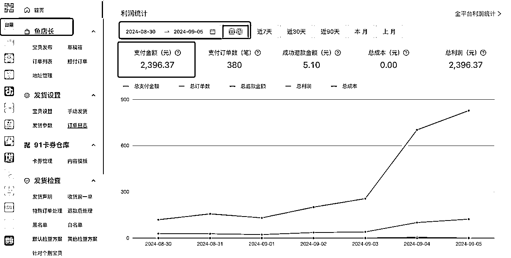

# 一条风向标，一篇精华帖，咸鱼虚拟资料也能日入800+

> 来源：[https://fiazd3hbob.feishu.cn/docx/EPW3daro8oDT08xziE9cbOtanOb](https://fiazd3hbob.feishu.cn/docx/EPW3daro8oDT08xziE9cbOtanOb)

最近通过一条风向标和一篇精华帖，跑通了咸鱼虚拟资料这个“小项目”，从最初的每天几十块，到昨天一天收入 800+，一直潜水，没怎么发过帖子，来详细拆解一下自己是怎么做的，感谢这么多圈友们的分享，学到很多！

先上收益图吧，近一周收入近 2400，昨天 828，平均客单价超过 6 块，对于虚拟项目来说已经很不错了，而且都是同一个链接出的单。

## 一、从风向标获取信息差并快速试错

跑通的这个小项目源于看到的一条中标的风向标，链接：

https://wx.zsxq.com/dweb2/index/topic_detail/8855184181245852

说的是校招信息整合售卖，看到某条信息之后，我首先会按照自己的标准评估一下是否可以快速测试，只要是可以低成本试错，自己又有能力去做的，我可能都会去尝试一下，试错多了，加上迭代，自然会有跑出来的项目。

首先去咸鱼搜索了一下“校招”、“秋招”这两个关键词，发现有几个想要数过 1000 的链接，而且想要数：浏览数都超过了 1:10（咸鱼高客单航海手册里的选品参考标准），数据很好，所以就用自己的闲鱼号上架测试。上架也很简单，不意淫，就是抄，把文案图片都扒下来，标题简单更换顺序，文案基本不动，主图通过裁剪加小角度旋转去重，就可以去发布了。咸鱼对查重并不严，甚至后边我发现有人用我的图带着我咸鱼账号水印都可以，而且我去举报盗图还没通过，也是奇葩。

上架之后一开始曝光数据并不好，也就没管它，继续每天上架优化其它品。但过了一周左右突然开始出单了，我就赶紧去对标那里买了一份资料发给了我的买家。接下来几天陆陆续续的每天卖个几十块。

爆单转机出现在我看了一篇精华帖之后，按照精华帖里的方法，优化了这个校招品的链接，然后客单价开始涨，单量开始涨，赶紧开通了阿奇索自动发货，开始了“躺赚”。

## 二、一篇精华帖带来的转机，客单价和单量开始上升

咸鱼上的虚拟资料很卷，都是 1 块 2 块的链接，最开始我定价也是 2 块多，每天卖个几十块，正好看到了航海领队大钟老师的精华帖：一个账号收入放大5倍——不做矩阵，闲鱼虚拟资料项目也能办到！，通过分析精华帖的方法，成功把账号日收入从几十块做到了昨天的 800+，大家看文章开头的图就可以发现，收入曲线一直是仰头向上的。

我总结大钟老师精华帖里的内容成一句话的话，就是“搭着卖”，来买校招表的都是即将毕业的大学生，找工作除了找招聘信息外，还需要哪些资料？通过在各大电商平台搜索“校招”、“秋招”等关键字，结果找到了内推表、简历模板、笔试题库等等相关的品。有时候对某个品的领域不是特别熟悉，如何找到相关联的品？去各大电商平台搜索品的关键字就可以了，比如我搜索了“校招”、“秋招”，在咸鱼上本身就可以出来不少相关的品，内推表、简历模板和笔试题库都是这么找出来的。

找到这些关联品之后，把这些品加到上边每天卖几十块的那个链接里，开通鱼小铺之后可以在一个链接里添加多 SKU，比如校招表+内推码、校招表+简历模板、校招表+大厂笔试题库、全都要，客单价一下子就上去了，“全都要”我定价 8.8，单校招表卖 2.88，别的卖 5.5，通过最近几天的观察和数据计算，买 8.8 的买家比例超过 50%，每天的平均客单价能到 6.7左右，成功把只卖一两块的资料，翻了好几倍。而且咸鱼上卖校招表的好多都只卖 1 块钱，但还是有很多人在我这里下单。

感谢大钟老师的精华帖分享！

风向标和精华帖里有宝藏！！

## 三、继续深挖相关品

做这个品之后，就会经常在咸鱼搜索相关关键词，然后刷推荐页的时候，会发现很多数据不错的链接，比如有不少人单卖京东笔试题库、银行笔试题库、银行面经等等，而且有的买家过来询单时也会带来需求，我一个买家就问我的笔试题库里有没有某个地方银行的题，我查了一下没有，但是立马在咸鱼搜索了一下有卖的，最终促成了这单。而且立马就又去单独上架了这个地方银行的笔试题，虽然这个没有爆，但也零零散散的出了几单～

随着账号出单越来越多，账号权重也会提升，测新品的时候搜索结果也会比较靠前，就更容易出单。

## 四、坑

不要和墨迹的用户对抗，浪费时间，买了之后找各种理由退款的，只要不是特别离谱，能退就退了。一般我都是让他确认收货给个好评，我直接把钱转给用户（咸鱼可以直接给用户转账）。因为咱们这个虚拟资料的边际成本本身就很低，没必要因为一两单退单浪费时间，即使有的退款用户态度很差！

这个品我卖了几百单，出了四五个要退款的，开始我还跟用户杠，气不过，现在有想退的，只要理由不是特别奇葩无理取闹的那种，基本就直接给退了。

爆单之后的链接，尽量不要去多次编辑。

我爆单的那个链接前前后后编辑了得有五六次，虽然前边流量也都又起来了，但尽量不要去冒这个风险，链接编辑之后可能会降低链接权重，这个航海手册里也提到了。

## 五、完结、撒花🎉