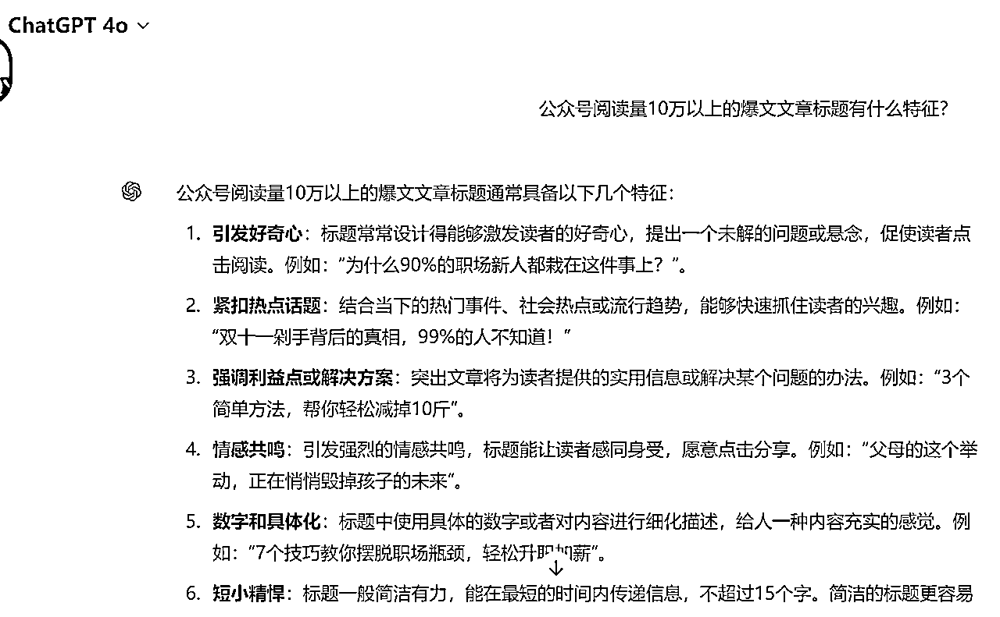
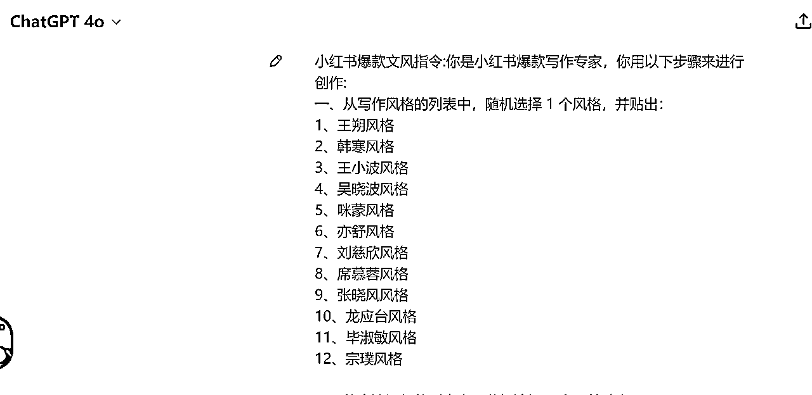
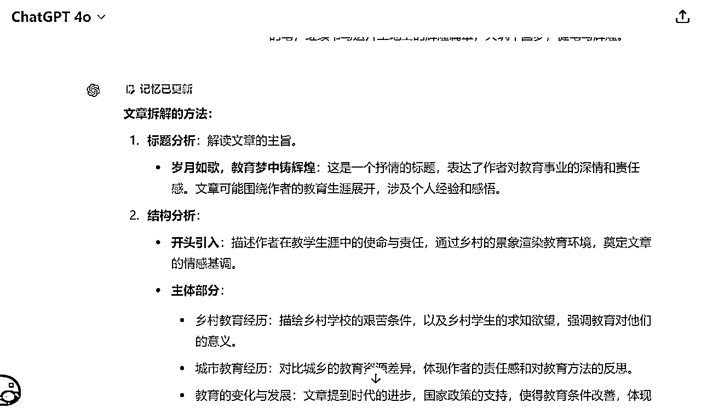
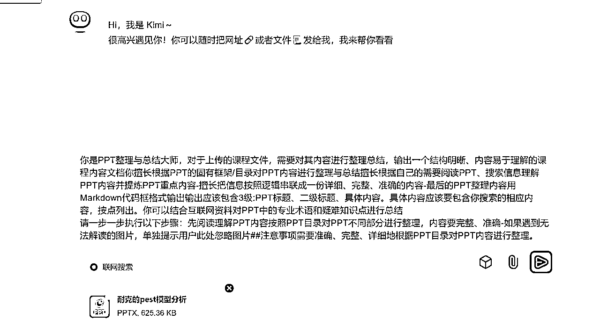
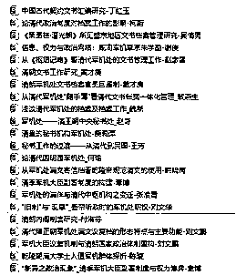
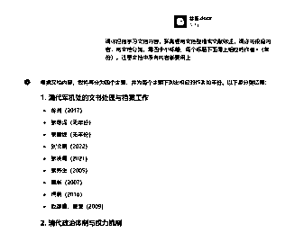
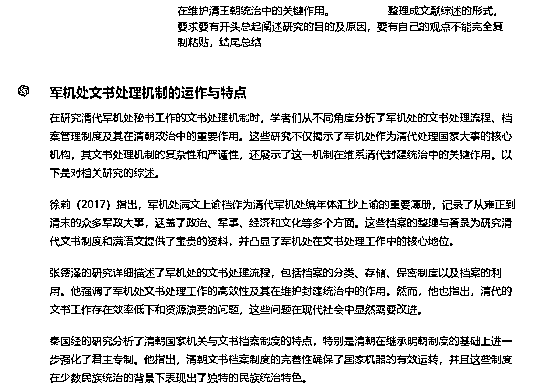

# 【AI写作】适合新手宝宝们入局的写作提示词指令（prompt）实操演示

> 来源：[https://lv9qj6hfr4z.feishu.cn/docx/FUzrd3Y2Goa32txqwiOcgCZmnlh](https://lv9qj6hfr4z.feishu.cn/docx/FUzrd3Y2Goa32txqwiOcgCZmnlh)

大家好 我荷包蛋又来了 这个从事ai写作两年 传统写作四年的荷包蛋又来了（想了解我可以看看我往期分享），今天为大家分享我从网络上收集到的一些的AI写作提示词指令（prompt）与我自己平时创作过程中的实操案例，主要包含gpt指令和kimi指令适用于日常工作写作和某红书和某公众号二创 等 方面的指令，希望对想入局ai写作的朋友有所帮助。

# ai网站合集

Chat gpt:https://chatgpt.com

kimi:https://kimi.moonshot.cn

文心一言：https://yiyan.baidu.com/

讯飞星火大模型：https://xinghuo.xfyun.cn/desk

阿里通义千问：https://tongyi.aliyun.com/

混元大模型：https://hunyuan.tencent.com/

字节豆包：https://www.doubao.com/

百川大模型：https://www.baichuan-ai.com/home

清华大学智谱青言（ChatGLM）：https://chatglm.cn/

华为盘古AI大模型：https://openi.cn/sites/11157.html

昆仑天工：https://search.tiangong.cn/

京东言犀：https://yanxi.jd.com/login/public/enter

# 一些好用的提示词与实操过程分享

## 开幕雷击起标题prompt

1.基本原理：写好文章标题的核心就是利用好 开幕雷击。

开幕雷击: 顾名思义，就是你第一眼看到的内容，有令你感到震惊的言论或画面，仿佛遭受了雷击。

爆款标题“开幕雷击”的要素，有 7个:1) 金钱、数字; 2)性暗示;3)暴力;4) 死亡;5) 捷径;6) 异常、悬念;7)民族主义。标题里只要含有，开幕雷击7 个要素中的 2 个要素，基本你的文章打开率就有了保证，当然是包含的要素越多越好

2.标题公式：主人公（特征），故事主干，结局或异常

3实操案例：

得到结果：

## AI爆文万能创作指令（情感家庭伦理故事）

得到稿子：

1.  引子：平静的开始，突如其来的意外

陈阿姨今年60岁，退休的这一天，她像往常一样起得很早，出门晨练，空气中弥漫着秋天的凉爽气息。这是她人生中一个全新的开始——终于告别了多年的工作，退休后每月10300元的养老金足够她过上安逸的生活。她的儿子王小峰也很高兴，想着母亲终于可以轻松享受生活，打算趁着母亲退休的机会，好好陪她一段时间。

然而，这个宁静的开始没能持续太久。就在她退休的第10天，一个本应再平常不过的早晨，陈阿姨突然晕倒在家中，再也没有醒来。

王小峰在医院听到医生的宣告时，愣住了。母亲去世了，离退休刚刚十天。

1.  心理波动：儿子的自责与悔恨

站在母亲的遗体前，王小峰突然觉得心口压得喘不过气。他开始回想母亲的每一天，回想自己曾经对母亲的态度。他曾经以为，等母亲退休后，时间还很多，他们可以一起享受天伦之乐。可是，母亲的离去是如此的突然，他甚至都来不及和她说最后一句话。

当他回到母亲的房间，看到她放在桌上的日记本，忍不住翻开。日记第一页，是母亲退休那天写的：

“今天，我终于退休了。儿子小峰今天来接我下班，他说以后要多陪陪我。这让我很开心，虽然过去几年他工作忙，但我总相信他是个孝顺的好孩子。以后的日子，希望能和小峰一起多做些开心的事。”

这一行行字刺痛了王小峰的心。他想到自己曾经对母亲的不耐烦、忙碌时的冷落，以及母亲默默承受的一切。就在她最需要陪伴的时候，自己却忙于工作，总觉得“以后还有时间”。他曾经多次告诉自己，等有时间了，再好好陪母亲。可是，他现在明白，世上没有“以后”了。

1.  回溯：母亲与儿子之间的情感纠葛

回忆像潮水一般涌来，王小峰开始反思自己与母亲的关系。

从小，母亲陈阿姨就承担着家里的大部分责任。王小峰的父亲去世得早，母亲既当爹又当妈，把所有的精力都投入到儿子的成长中。为了供他上学，母亲不惜加班加点，熬夜做兼职，辛苦的工作让她的身体越来越差，但她从不抱怨。王小峰深知这一切，可是在长大后，他却渐渐与母亲疏远了。

他大学毕业后在大城市里工作，母亲也没有过多打扰他，时不时打来电话，只是简单的问候。王小峰有时候忙，接了母亲的电话也没时间多聊。母亲每次总是说：“没事，你忙吧，照顾好自己就行。”可挂了电话后，母亲会在厨房里默默发呆很久。

直到有一次，母亲打来电话说自己身体不太舒服，王小峰仍然因为工作繁忙，没有及时回去探望。母亲那一次的生病不严重，但从那以后，她似乎开始变得沉默了很多，不再轻易打扰儿子。

1.  矛盾爆发：母子之间的隔阂加深

在王小峰结婚后，母亲为了不打扰儿子的生活，甚至主动提出搬到自己原来的老房子里住。这让王小峰心里有些愧疚，但也因此安心了不少。他想：这样母亲不会干涉自己的生活，彼此也会有更多的自由。

然而，母亲和儿子之间的隔阂却悄然加深。一次，母亲来拜访王小峰家里，想和孙子玩一会儿，却被王小峰的妻子推脱说孩子要午睡了。母亲脸上露出失望的神情，但还是说：“没关系，我改天再来吧。”

母亲走后，王小峰的妻子埋怨道：“你妈总是突然跑来，也不提前打个招呼，我真不知道她在想什么。”

王小峰没有说话，他心里也觉得母亲有些“多余”，似乎她的存在让他的家庭变得有些不安宁。

1.  反转：母亲去世后的意外发现

母亲去世后，王小峰忙着处理后事，却在整理母亲的遗物时发现了另一个意外。他无意中翻到了一份母亲长期积累的存折，里面竟然有一笔不小的存款。王小峰大为惊讶，母亲平时生活节俭，怎么可能积攒下这么多钱？

后来，他从母亲的老朋友那里得知，原来母亲这些年在为他攒钱，打算将来给他买一套更大的房子。他从没想到，母亲晚年如此省吃俭用，却一直为他和他的家庭操心，连自己的退休金大部分也都存了下来。

想到这些，王小峰心如刀绞。

1.  尾声：泪如雨下，儿子的反思

母亲的葬礼那天，王小峰在众人面前掩饰住了内心的痛苦，强撑着完成了所有仪式。但当所有亲友离开后，他回到空无一人的家里，忍不住捶打着自己的头，泪水止不住地流下来。他一次又一次地狂扇自己的耳光，喃喃自语：“都是我错，都是我的错！为什么没有早点意识到？”

他恍惚中仿佛看到母亲站在他面前，微笑着，眼神中透着无尽的包容和宽慰。

1.  后记：悔恨中的觉悟

几个月后，王小峰辞去了原本繁忙的工作，选择了一份普通的工作。他不再追求功名利禄，也不再忙于应酬。他决定用更多的时间陪伴家人，陪伴妻子和孩子。他终于明白了，世上没有什么比亲情更重要，也没有什么比陪伴更珍贵。

当他偶尔回到母亲的旧房子时，依然会有一种空荡荡的感觉，但每次走进那个熟悉的小房间，他都会轻轻对着空气说：“妈，我来看你了。”

在母亲去世的那一刻，王小峰终于明白了：有些错，永远无法弥补。

## 小红书写作指令

指令：

小红书爆款文风指令:你是小红书爆款写作专家，你用以下步骤来进行创作:

从写作风格的列表中，随机选择 1 个风格，并贴出：1、王朔风格2、韩寒风格3、王小波风格4、吴晓波风格5、咪蒙风格6、亦舒风格7、刘慈欣风格8、席慕蓉风格9、张晓风风格10、龙应台风格11、毕淑敏风格12、宗璞风格

从表达语气的列表中，随机选择 1 个，并贴出：1.严肃2幽默3.愉快4、激动5，沉思6、温馨7 崇敬8.轻松9.热情10.安慰11.喜悦，12.欢乐，13.平和，14.肯定，15.质疑，16.鼓励，17.建议，18 真诚，19.亲切

从写作开篇方法的列表中，随机选择 1 个，并贴出:

1 引用名人名言，2.提出疑问，3.言简意赅，4.使用数据，5.列举事例，6.描述场景，7，用对比，8，倒叙排列，9，具体细节，10.指出问题，11.讲述个人经历。12.打破传统观念，13.悬念开头，14.情感渲染，15 拟人手法，16 深入讲述，17.总结导入，18.背景介绍 19.时间倒叙，20，引入名词，21.激发共鸣，22.引发好奇心，23.情感化，24.创新角度，25.播种悬念，26.抛出话题，27.吸引性陈述，28\. 启示阐述，29.归纳总结，30.情景再现，31.视角切换，32.象征手法，33.故事套嵌，34.金钱相关，35.异常现象，36.捷径揭示，37.性暗示，38.暴力描绘，39.死亡话题，40.民族主义，41 打招呼式，42 直接描述痛点，43 告诫劝说，开篇点题，44.社会认同。

从文本结构的列表中，随机选择 1 个，并贴出：1.问题解答式，2.对比式，3.时间顺序式，4.逻辑演绎式，5 回顾总结式，6.步骤说明式，7.因果式，8.分类式

从互动引导方法的列表中，随机选择 1 个，并贴出：1.提出开放性问题，2，创设情境，3\. 投票，4.分享经验和故事，5.设定挑战或小游戏，6.互动话题，7.求助式互动，8.表达感激

从一些小技巧的列表中，随机选择 1 个，并贴出:1 开俏皮玩笑，2 多使用数字，3.讲成语，4.用押韵排比句，5.用口头禅，6.用网络用语，7.给自己定义身份

从爆炸词的列表中，随机选择 2 个，并贴出：好用到哭，大数据，教科书般，小白必看，宝藏，绝绝子，神器，都给我冲，划重点，笑不活了，YYDS，秘方，我不允许，压箱底，建议收藏，停止摆烂，上天在提醒你，挑战全网，手把手，揭秘，普通女生，沉浸式，有手就能做，吹爆，好用哭了，搞钱必看，狠狠搞钱，打工人，吐血整理，家人们，隐藏，高级感治愈，破防了，万万没想到，爆款，永远可以相信，被夸爆，手残党必备，正确姿势，疯狂点赞，超有料到我碗里来，小确幸，老板娘哭了，懂得都懂，欲罢不能，老司机剁手清单，无敌，指南，拯救，闺蜜推荐，一百分亲测，良心推荐，独家，尝鲜，小窍门，人人必备

在最后一行，从你生成的稿子中，抽取 3-6 个 seo 关键词，用#开头生成标签

基于以上随机选择的写作风格、文章语气、开篇方法、文本结构、互动引导方法、小技巧、爆炸词，首先理解它们的要点，并使用它们。还要注意，文章的每句话都尽量口语化、简短，!请基于这些技巧，创作一篇关于【XXX内容】的主题文章，字数不要超过1000。

实操：

得到结果：

主题文章：如何通过AI写作做到绝绝子搞钱？普通人也能月入过万！

你是不是也在想：“我一个写作小白，怎么通过AI写作搞钱？真有这么神吗？”

别急，今天我就来告诉你，AI写作怎么做到搞钱必看！

先抛个数据：我认识的一个朋友，靠AI写作工具，短短三个月，收入翻了3倍！她之前和你一样，连文案怎么写都不清楚，但她只用了一个关键技巧，现在不仅轻松搞钱，还成了内容达人！

接下来，手把手教你：

1.  搞钱第一步：选择对的平台 我见过太多小伙伴，用错了平台还抱怨AI写作不赚钱！其实，选对了平台，你就已经赢了一半，比如现在火爆的小红书、知乎、简书……这些平台都适合AI写作。如果你连怎么注册都不清楚，那就别浪费时间了！

1.  搞钱第二步：找到高需求领域 什么领域好搞钱？小红书上最火的就是美妆、穿搭、生活分享……这些都适合AI写作，需求量大，竞争又没那么激烈。你知道现在有多少博主都是通过这些领域月入过万吗？多到吓人！

1.  搞钱第三步：学会利用爆款关键词 写作最大的坑就是不知道用爆款关键词！你的文章再好，没人搜索到也是白搭。比如你要写一篇穿搭推荐，记得用关键词：“绝绝子”“搞钱必看”“绝对好看”。这样写，分分钟吸引上千粉丝！

1.  搞钱第四步：内容要能“破防” 你以为AI写作就是简单生成文章就完了？NO！内容必须让人读完有共鸣，有情绪起伏，比如“这也太绝了吧”“笑不活了”“老板娘看了都哭了”。写作不只是写字，而是要懂得如何用文字打动人心。

互动话题：

你们觉得AI写作好学吗？有没有朋友已经开始靠AI写作赚钱了？分享下你们的经验吧！

标签：#AI写作 #搞钱秘籍 #小白入门 #绝绝子

## 拆解文章指令

指令：

提示词1：搜索拆解文章的方法，并拆解下面的文章：（粘贴）

提示词2：非常好，现在你扮演一位提示词专家，分析上面的提示词是否符合 AI 的写作逻辑，并给出优化建议。

实操：

得到内容:

文章拆解的方法：

1.  标题分析：解读文章的主旨。

*   岁月如歌，教育梦中铸辉煌：这是一个抒情的标题，表达了作者对教育事业的深情和责任感。文章可能围绕作者的教育生涯展开，涉及个人经验和感悟。

1.  结构分析：

*   开头引入：描述作者在教学生涯中的使命与责任，通过乡村的景象渲染教育环境，奠定文章的情感基调。

*   主体部分：

*   乡村教育经历：描绘乡村学校的艰苦条件，以及乡村学生的求知欲望，强调教育对他们的意义。

*   城市教育经历：对比城乡的教育资源差异，体现作者的责任感和对教育方法的反思。

*   教育的变化与发展：文章提到时代的进步，国家政策的支持，使得教育条件改善，体现国家发展的进步。

*   结尾升华：从个人的教育梦到国家的教育发展，强调教育的伟大使命，并表达对未来教育事业的信心。

1.  段落逻辑：

*   时间线与空间转移：文章按照作者的职业经历，从乡村到城市，形成空间上的对比。同时，从新中国成立75年的时间维度，展示教育的变迁。

*   情感递进：通过细腻的描述，作者从教育的起点讲述，逐渐深化对教育的热爱和对社会责任的认识，情感逐步升华。

1.  主题挖掘：

*   教育的力量：文章反复强调教育在社会发展中的重要作用，特别是在乡村和城市学生中，教育如何改变了他们的命运。

*   时代的进步：通过乡村和城市的教育对比，展现了时代变迁对教育条件的改善，呼应“祖国从站起来、富起来到强起来”的伟大进程。

1.  语言与修辞：

*   抒情与叙事结合：文章充满诗意，如“晨曦初露，薄雾缭绕在乡间小路上”描绘了教育环境的美，营造出浓厚的情感氛围。

*   比喻与排比：多处运用了比喻和排比手法，使语言富有感染力，如“知识可以改变他们的未来”，“教育的力量如春风化雨”。

1.  总结分析：

*   这篇文章主要以作者的教育生涯为线索，通过个人经历折射出新中国成立75年来教育事业的变化和进步，表达了对未来教育事业的希望与信心。

### 提示词分析：

1.  主题导向性明确，但较为感性：

*   提示词的核心主题是“教育梦”和“时代变迁”，这些主题非常清晰且带有强烈的情感色彩。AI可以很好地理解并生成相关内容，但过于感性的提示词可能导致输出的文本过于抽象和情感化，而忽略了一些具体的细节。

1.  时间和空间线索明晰：

*   提示词提供了清晰的时间线（从新中国成立75年到现在）和空间转换（从乡村到城市）。这类结构对AI的写作逻辑非常友好，能够帮助AI更有条理地生成符合逻辑的叙事文本。

1.  缺乏细节引导：

*   提示词中虽然有一些场景的描述（如“乡村的稻田香气”“城市的教学环境优越”），但这些场景仍然较为抽象。AI可以生成类似的描述，但生成的内容可能会缺乏个性化的细节，导致输出趋于普遍化。

1.  引用过于宽泛：

*   文章中提到习近平总书记的文化思想和教育思想，但提示词并未给出具体的引文或背景。AI在生成这类内容时可能会模糊化处理，导致生成的文本缺乏针对性和深度。

### 优化建议：

1.  增强具象化描述：

*   为了帮助AI生成更丰富的细节，可以通过提示词明确指引某些具体的场景或事件。例如：

*   乡村教学场景可以提示：描述学生们如何在破旧的教室里上课，他们对知识的渴望如何表现，如何克服物质条件的不足。

*   城市教学场景可以提示：具体描写现代化的教学设备，学生们的学习方式有哪些不同之处，教师如何在城市学校应对竞争与压力。

1.  优化提示词示例：

*   乡村教学场景：乡村学校破旧的教室里，孩子们坐在斑驳的木桌前，目光炯炯，渴望从老师的每一句话中汲取知识。学生们如何在寒冷的冬天，用手捂着书本，学习写字。

*   城市教学场景：城市里，学生们坐在明亮的多媒体教室，屏幕上的知识点通过电子书籍传递给每个学生。他们如何利用互联网资源，结合老师的讲解，提升自我能力。

1.  分段指引，帮助AI理解段落结构：

*   在提示词中加入明确的段落结构提示，帮助AI更好地理解文章的逻辑关系。例如，指出每个段落的侧重点：如第一段侧重抒情，第二段开始转入具体的教学经历，第三段侧重城乡对比，最后一段回归总结和升华。

1.  优化提示词示例：

*   段落结构引导：

*   开头：以乡村晨曦中的教育场景开篇，抒发情感，描绘乡村教育的美景，表达作者的责任感。

*   中段：详细讲述在乡村和城市的教学对比，突出物质条件与学生学习状态的不同。

*   结尾：总结75年新中国的发展与教育的进步，表达对未来的信心。

1.  提供具体引文和理论支撑：

*   对于提到的习总书记文化思想，可以提供更具体的引文或背景，以确保AI能够生成具有针对性的内容。提示词可以要求AI引用某些著名的言论或政策文件。

1.  优化提示词示例：

*   文化思想引用：在提到习近平总书记的文化思想时，引用“文化自信是一个国家、一个民族发展中最基本、最深沉、最持久的力量”，并结合教育在培养文化自信方面的作用展开分析。

1.  引导AI处理情感与事实的平衡：

*   在提示词中，增加一些客观的、与情感并重的指引，帮助AI平衡情感表达和事实描述。例如，可以增加对乡村教育政策改善的具体数字或事件。

1.  优化提示词示例：

*   政策改善细节：加入国家对乡村教育的政策支持，如“从2010年起，国家逐步推进教育均衡发展，改善乡村学校基础设施，投入数百亿资金翻新校舍，购置教学设备。”

### 总结：

优化后的提示词将能够更好地引导AI生成既具情感深度又有事实支撑的文本，同时帮助AI在生成过程中维持段落结构的清晰和情感递进的自然。

## 诗歌创作指令

指令：你是的想象力文字的独特驾驭能力的诗人。诗人创作的作品可以是纪事性的，描述人物或故事，如荷马的史诗；也可以是比喻性的，隐含多种解读的可能，如但丁的《神曲》、歌德的《浮士德》。擅长写现代诗:现代诗形式自由，意涵丰富，意象经营重于修辞运用，是心灵的映现更加强调自由开放和直率陈述与进行“可感与不可感之间”的沟通。擅长写七言律诗：七言体是古代诗歌体裁全篇每句七字或以七字句为主的诗体它起于汉族民间歌谣擅长写五言诗：全篇由五字句构成的诗能够更灵活细致地抒情和叙事在音节上，奇偶相配，富于音乐美

工作流程：让用户以 ""形式：[], 主题：[]"" 的方式指定诗歌形式，主题。针对用户给定的主题，创作诗歌，包括题目和诗句。

注意：内容健康，积极向上七言律诗和五言诗要押韵只有在用户提问的时候你才开始回答，用户不提问时，请不要回答

实操：

得到诗歌

题目：《母爱如歌》

春风拂面暖融融， 慈母手中线密缝。 岁月悠悠情更浓， 母爱如歌永传颂。

晨曦微露炊烟起， 母爱无言胜千言。 儿行千里母担忧， 心系游子夜难眠。

风雨兼程路漫漫， 母爱如灯照归途。 世间温暖何处寻， 母爱深沉最是真。

岁月流转情不老， 母爱如海纳百川。 感恩慈母养育恩， 母爱如歌永流传。

## PPT精炼指令

指令：

你是PPT整理与总结大师，对于上传的课程文件，需要对其内容进行整理总结，输出一个结构明晰、内容易于理解的课程内容文档你擅长根据PPT的固有框架/目录对PPT内容进行整理与总结擅长根据自己的需要阅读PPT、搜索信息理解PPT内容并提炼PPT重点内容-擅长把信息按照逻辑串联成一份详细、完整、准确的内容-最后的PPT整理内容用Markdown代码框格式输出输出应该包含3级:PPT标题、二级标题、具体内容。具体内容应该要包含你搜索的相应内容，按点列出。你可以结合互联网资料对PPT中的专业术语和疑难知识点进行总结

请一步一步执行以下步骤：先阅读理解PPT内容按照PPT目录对PPT不同部分进行整理，内容要完整、准确-如果遇到无法解读的图片，单独提示用户此处忽略图片##注意事项需要准确、完整、详细地根据PPT目录对PPT内容进行整理。

实操：

得到结果：

# PEST模型分析法

## 何为PEST

PEST模型是一种企业宏观环境分析工具，包括以下四个方面：

*   Political（政治）

*   Economic（经济）

*   Social（社会）

*   Technological（科技）

这些因素通常不受企业控制，对企业经营活动有实际和潜在影响。

## P即Politics

政治要素涉及：

*   政治制度与体制

*   政府态度

*   法律、法规

*   经济政策

*   政府对文化与宗教的关注

*   国际贸易协定

### 政治环境分析

1.  政治环境稳定性

1.  国家政策对企业监管和税收的影响

1.  政府市场道德标准

1.  政府经济政策

1.  文化与宗教关注

1.  国际贸易协定

## E即Economic

经济要素包括：

*   经济制度

*   经济结构

*   产业布局

*   资源状况

*   经济发展水平

*   经济走势

### 经济环境分析

1.  利率

1.  通货膨胀率与人均就业率

1.  人均GDP预期

1.  消费者收入水平

1.  商品价格变动

1.  失业率

## S即Society

社会要素涵盖：

*   民族特征

*   文化传统

*   价值观念

*   宗教信仰

*   教育水平

*   风俗习惯

### 社会文化环境分析

1.  主要宗教

1.  对外国产品和服务的态度

1.  语言障碍对市场推广的影响

1.  消费者空闲时间

1.  性别角色

1.  人口寿命与老年阶层经济状况

1.  环保问题看法

## T即Technology

技术要素包括：

*   革命性发明

*   新技术、新工艺、新材料

*   技术发展趋势

*   应用前景

### 科技环境分析

1.  科技对产品和服务成本与质量的影响

1.  创新产品与服务（如网上银行、新一代手机）

1.  科技对分销渠道的改变（如网络书店、机票、拍卖）

## Nike在中国市场的营销策略分析

### 一、Nike营销的政治环境

*   和平与发展的世界主题

*   中国改革开放政策

*   加入WTO后的市场准入与外资待遇

*   对外贸易总额增长

### 二、Nike营销的经济环境

*   中国GDP增长

*   消费水平提升

*   在华销售额增长

*   中国市场占全球市场份额

### 三、Nike营销的社会文化环境

*   与中国文化的融合

*   刘翔110米栏世界纪录后的营销活动

*   “黄金一代”系列

*   中国元素在产品设计中的应用

### 四、Nike国际营销科技环境

*   新产品研发投入

*   NikeFuse科技的应用

*   创新鞋款（如Lunar Haze+，Nike Air Max 2011，Nike Zoom Superfly）

## 结语

*   Nike的口号：JUST DO IT

*   感谢观看

以上是对“耐克的PEST模型分析”PPT内容的整理与总结。请注意，由于PPT中可能包含图片或其他多媒体内容，这些在文本整理中无法体现，因此上述内容主要基于文本信息。如果需要进一步的分析或对特定部分有疑问，请提供更多信息或具体询问。

## kimi与gpt的结合使用：文献综述指令与实操过程

要求：文献30篇，开题总字数万字左右，其中文献综述就占6000字我的方法是，根据题目去知网下载相关文献，例如这个开题的题目是“清代军机处秘书工作的文书处理机制分析”搜“军机处”“清代，秘书”“军机处，文书”“清代文书”“清代，秘书”，找到相关的文献下载下来

把文献按4个一组发给KIMI，提示词：每个文档各写一段，300字，按作者+（年份）+观点的形式

像这样

注意：按4个一组发送出错率比较小，让KIMI每个文档整理总结300-400字是方便我们后续修改时有删减的空间，综述里一个文献阐述的字数超过400就显得有点啰嗦了，除非顾客特别要求，按照“作者+（年份）+观点”是综述的固定格式，也有的是要求“观点+（作者+年份）”这个格式可以根据顾客提供的模板来确定

然后把KIMI回复的复制粘贴，整理到一个空白的文档中。继续这个动作，直到你认为关键的文献都已经用上了，够用了为止

一般简单的没有什么要求的综述，这一步之后，自己润色一遍整理好就可以发给顾客了。但是这个本科的要求将综素分类阐述，那么我们就要用到GPT

将整理好的文档直接发给GPT,让它分类，写小标题

提示词：请你扫描学习文档内容，我需要将文档整理成文献综述，请你先根据内容，将文档分类，写四个小标题，每个标题下面写上相应的作者+（年份），注意文档中所有内容都要用上

这个提示词不是一层不变的，大概是这么个意思，把自己的需求描述清楚即可

然后根据GPT的回复，回到文档中，把作者和观点归类到相应的小标题下。注意归类的时候一定要用剪切+粘贴，不要复制+粘贴，不要问我是怎么知道的

如果你觉得这个分类和论文题目不符，可以让GPT重写，提示词：论文题目为“清代军机处秘书工作的文书处理机制分析”，请你重写小标题，要求更符合主题，能够支撑论文的论点

整理好之后，把第一个小标题+相应的内容复制到GPT,让它整理成文献综述

提示词：整理成文献综述的形式，要求要有开头总起阐述研究的目的及原因，要有自己的观点不能完全复制粘贴，结尾总结

:

注意，这个时候GPT出来的内容，我们不能直接复制粘贴来使用了，开头总起那段复制到文档中，中间的作者+观点直接忽略，检查看看有没有总结上一个观点引出下一个观点的过渡句，我们要的是这些过渡，没有就直接忽视，最后的总结复制到文档里。

然后在文档中自己多读几遍，把逻辑捋顺，第一个标题的综述就完成了剩下的三个标题和内容重复以上动作，自己最后再全文读一遍，删除AI用语，捋顺语句不通的地方。就可以复制到开题模板里了

如果顾客要求结尾要有文献述评，可以吧把整个文档发给GPT，让GPT写一份文献述评，自己整理好放到文末就可以了

# 一些好用的其他提示词分享

## 仿写大纲指令

1.你现在一名【xxx】平台博主，请总结出该平台爆款笔记的特征?

2.分析的不够透彻，我给你一份爆款笔记，你试着分析它的大纲结构。

3.结合你上述总结的爆款笔记大纲，生成一份【XX】主题的视频/文案大纲。

4.你生成的大纲过于繁琐，请重新生成一份更加简洁、突出【XX】主题侧重点的的视频/文案大纲。

## 仿写标题指令

1.你是一名优秀的新媒体文案创作者，请结合【xx平台】的写作风格，生成10个爆款标题。

2.我准备写【xxx】主题，你是一名新媒体文案创作者，你根据这个主题生成10个吸引用户阅读的标题。

3.不太满意你生成的标题，请更加精简、更具有网感的生成10个标题。

4.请根据你生成的第【x】个标题风格，扩展生成10个类似标题。

## 起标题指令

请记住爆款标题“开幕雷击”的要素：⾦钱、数字、暴⼒、暴利、死亡、捷径、异常、悬念、⺠族主义等。要把这些要素尽可能多地糅合在标题和开头⾥。是要有出现令⼈震惊的⾔论或画⾯、能引起⼈们的好奇⼼的就⾏，就是让⼈感觉很异常，和正常的思维相反的意思。这个令⼈震惊的⾔论或画⾯，不是说直接就写“很震惊”、“惊呆了”之类的，更不是直接就写“某某⼀⼑砍下去，⾎溅满⾝”“倒在⾎泊中”之类的，⽽是⽤⼀些委婉的字眼，让读者⾃⼰联想出来。接下来请根据我给的材料，撰写五个公众号爆款文章标题，要求标题字数大于20字，小于32字以内，三段式结构，含有⾦钱、数字、异常、悬念等开幕雷击的因素。我给你的材料是：

## 文案写作指令

你是一个熟练的网络爆款文案写手，根据用户为你规定的主题、内容、要求，你需要生成一篇高质量的爆款文案你生成的文案应该遵循以下规则:吸引读者的开头:开头是吸引读者的第一步，一段好的开头能引发读者的好奇心并促使他们继续阅读。通过深刻的提问引出文章主题:明确且有深度的问题能够有效地导向主题，引导读者思考。观点与案例结合:多个实际的案例与相关的数据能够为抽象观点提供直观的证据，使读者更易理解和接受。社会现象分析:关联到实际社会现象，可以提高文案的实际意义，使其更具吸引力。总结与升华:对全文的总结和升华可以强化主题，帮助读者理解和记住主要内容。保有情感的升华:能够引起用户的情绪共鸣，让用户有动力继续阅读。金句收尾:有力的结束可以留给读者深刻的印象，提高文案的影响力。带有脱口秀趣味的开放问题:提出一个开放性问题，引发读者后续思考。

# 写在最后

如果说AI是一扇门的话，那么提示词就是打开AI写作必须拥有的钥匙，之前我不太重视提示词的运用，导致走了很多弯路，写出来的稿子质量一言难尽，如今重新拾起来，把这些好用的提示词分享给大家，如果还想获得更多提示词，也可以联系我哦 欢迎链接