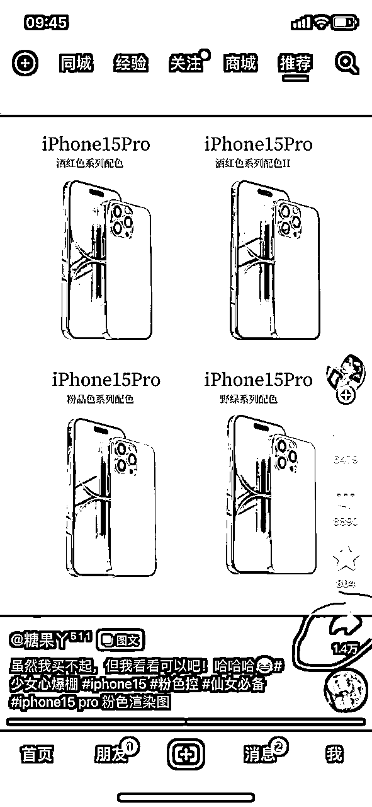
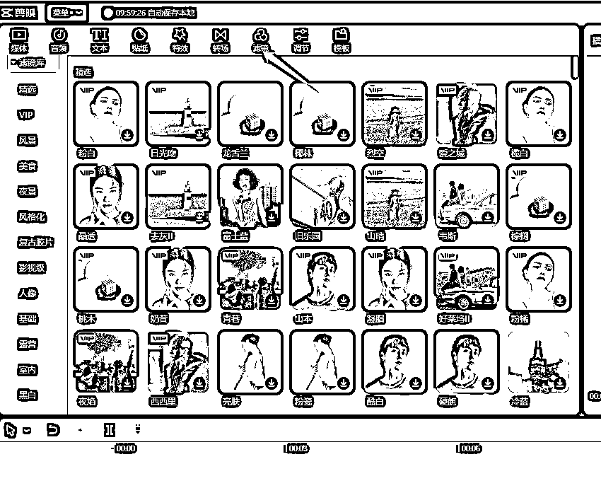
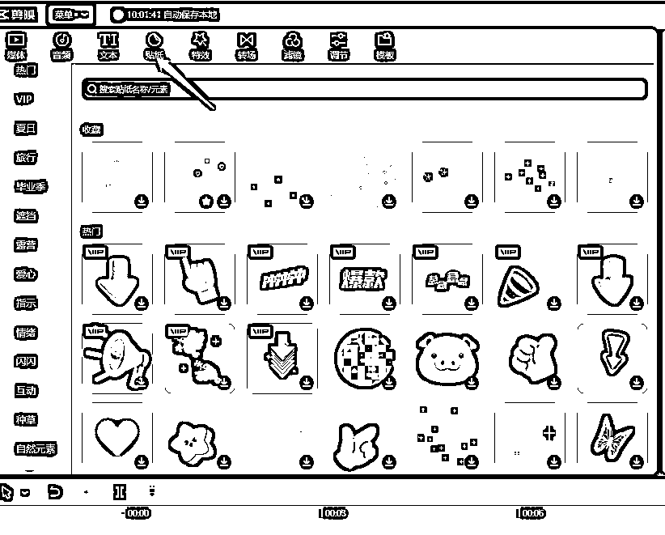

# 人人能做的居家小项目，百家号带货实操

> 来源：[https://au8p0ksnl2.feishu.cn/docx/FlcBdIklQoc78pxRyvvcQgoinwe](https://au8p0ksnl2.feishu.cn/docx/FlcBdIklQoc78pxRyvvcQgoinwe)

# 一、项目介绍

提起短视频带货，大家首先想到的是抖音带货，视频号带货，流量大，也有暴富的机会。

但是大家其实忽略了百家号这个平台，收益也还可以，当然前提是得方法正确。

不过本项目的收益天花板比较低，一个月可能就是几百块，上千块钱，大佬们可能看不上，但是非常适合小白，新手，宝妈。因为一天花个半个小时就能做完了。

一个月多赚几百块是绝对没有问题。如果要收益高的，估计本项目不适合你。

跟抖音的视频带货原理上差不多，注册百家号，发布带货视频添加商品小黄车变现逻辑也很简单，就是跟抖音一样带货，挂小黄车。

在用户刷视频的过程中，系统会根据用户之前看过的产品，给用户推送类似产品的带货视频，进而促进转化。

视频左下角会弹出这种商品卡片，整个购买转化的流程非常丝滑，当用户买完你挂车的产品，你就能拿到佣金了。

# 二、前期准备

下面开始分享实操过程，我从第一步给大家讲起，兄弟们试着做可以拿到结果。

## 1，必须要有电脑！准备2~3个号（找家人实名）

这样多个号拿结果是最快的，一个号也不是不能拿结果，可能会有概率性，而且多个号操作，如果每个号爆率为10%，那你准备10个号去实操，基本可以认定为每10个视频中就有一个号可能会爆

## 2，登陆多多进宝、淘宝联盟、京粉APP

这3个APP分别对应是拼多多、淘宝、京东官方的返佣平台，也是是咱们做这个百家号视频项目，用来查看佣金的后台，做过淘宝客的应该知道，。

以上APP直接应用市场搜索就可以 ，下载好以后注册，注意要用自己常用手机号注册，用来登陆，以后比较方便，也可以设置上密码，注册好以后，分别实名制，绑定上自己的银行卡，用于以后提现。

这边下载操作就不放上来了，大家自行去下载就行，实在不懂再找我吧！

这就是3个APP的样子

## 3，注册百家号

这个是注册链接：https://baijiahao.baidu.com/builder/theme/bjh/login

先去注册完，注册好了以后，去应用市场下载手机百度APP，百家号APP，好看视频APP可下载可不下载。

注册完百家号以后，一定要实名，一定要实名，一定要实名！！！

然后就可以开始发帖了，前面养号非常重要，养号前期一定不能搬运！！！

养号

养号前期，比如你是做美食类目的，你可以发一些做菜的教程，是图文教程，每天都要发，然后手机百度也多用，多去看视频，看帖子等，要让百度知道你是一个正常人，很多人一来就想着搬运，这个基本不会给你流量的，切记！

养号需要7天以上，这段时间每天最好都去用一下百度app，每天都可以发3篇帖子，一定要原创的帖子，想做百家号的圈友，家里一定要有电脑，没有电脑也不建议你做，因为挂载商品需要用电脑，没有电脑无法挂车。

关于原创图文，如果你实在不知道怎么写，可以去抖音查，那些生活小妙招，或者是美食教程，把他们的文字导出来，修改一下，然后在百度上发布即可。

配图的话，一般百度会自动给你配图，所以不用担心是搬运违规，记住前面7天是重中之重，一定要养好号，而且你在选方向，选类目的时候，一定要慎重选好，否则后面会关系到你的收益问题！

这里给个参考https://baijiahao.baidu.com/s?id=1764331665109557704&wfr=spider&for=pchttps://baijiahao.baidu.com/s?id=1675796291118630184&wfr=spider&for=pc

这个文案的图片，基本都是搬运或者百度自动配图的。【配图功能电脑版才有，手机不行】

# 三、起号阶段【一周时间】

一般你发完7天，每天3篇原创的图文，图片就自己去拍一些风景图，然后配一下文字，就跟发朋友圈一样，或者动态以后，你的号基本就稳定了，这个时候找人帮你shua满100个粉丝开橱窗即可。

百家号目前100粉丝就能自动开通带货收益，只要7天内你的账号没有任何违规，然后也发了图文，就可以自动等开通即可。

百家号获取商品卡相对比较简单，十分适合普通人去操作。其他的一些栏目可以自行去摸索一下，都是相对来说比较简单的内容。

起号唯一难的就是前面7天的原创，不过稍微动点脑子就能完成。遇到有不懂的直接问我就行！

# 四、选品思路

1、工欲善其事必先利其器，我们的视频从哪里来？当然是从抖音，快手，视频号上面来。不过在搬运视频之前，我们可以先去做数据分析一下百度上的人群。

（百度app包含了好看视频，百家号等其他百度系app所有功能，所以好看视频很少人看，基本都在百度app上面实现了）

百家号目前的人群基本都是男性居多，而且还是18~24岁的青少年多点，但是这种人群并不是我们购买力的主要人群。我们要选的是购买力的人群是30岁以上的人群多点，那么你在选品的时候，就可以多方面去思考哪些品容易让上述人群购买。

这里面有一个移动设备日活指数网站，大家有空可以多去研究：https://index.iresearch.com.cn/new/#/app

2、重点！！！

这个是我自己

后台的百度粉丝教育水平占比，基本粉丝都在大专以下，百度这个app的属性，作为老牌的国民级app，大家对搜索的依赖还是百度多点，因为高学历的人，接收新鲜事物还是很快的。

所以决定了用它的人学历基本不会太高，学历不高，代表着收入水平也不会特别高，收入水平不高，一样意味着他们在买东西的时候，是追求“性价比”“便宜好用”“低价生活用品”为主。

所以大家在选品的时候，围绕“性价比”“便宜好用”“低价生活用品”来走就可以了，然后可以到考古加，巨量百应，蝉妈妈等数据平台，看看最近的爆款商品。接着就可以搬运视频了。

在以上的选品之外，还有一个非常重要的选品平台！那就是多多进宝pc【pc就是电脑】端。因为我们做百家号，基本带的就是多多进宝的货，为什么不带淘宝联盟，还有京东？还是因为百家号的人群属性导致“性价比”“便宜”才是主旋律。

如果你想带淘宝，或者京东的货，那就可以去看淘宝或者京东的销量榜单。这边只介绍拼多多带货的多多进宝

这个是它的链接：https://jinbao.pinduoduo.com/promotion/hot-promotion

这里有小时榜，日榜，周榜，月榜基本哪些品是容易爆单的，然后佣金也有10%以上的日用品，都是我们可以去选择的，到时候你记录下来就可以了。

百家号的选品思路并不难，不过有一点，如果你选好了一个大类，就尽量不要去更换大类了，因为我们要把号尽量做垂直，如果你选择了食品这个大类，那你以后的视频就尽量发跟食品有关的，如果你选的是日用品的大类，那你以后发的视频就尽量跟日用品有关。百家号如果你的号垂直了，是会有流量扶持的，而且容易过职业认证，到时候广告收益也会增多。

# 五、视频搬运

## 1，确定好选品，然后去抖音找5~10个对标账号

如果你确定好要做哪个类目了，那么你就可以去抖音找对标账号了。我们一般都去搬运抖音，或者快手上的短视频，比如现在举个例子，

我现在确认我就是想做好物分享的家居用品，ok，那么我们就去抖音搜“好物分享”“拖把”“家用好物”等这类关键词。

像这种视频，就是很适合我们去搬运的，找对标账号要求：

1、一定要3W粉丝以下

2、然后发布的视频大于200个以上

3、然后橱窗销量大于1000+单以上的

找到对标账号以后，可以多看看他们发的内容都有哪些，然后看看他们的视频标题怎么写的，再看看他们的配音是怎么配的，这些细节都是非常重要。

因为你看多了，你就会有那种网感，知道哪个品容易出单，哪个品不能出单。这个只能意会，不能言传。反正就是多看多学吧！

雷区！！！！！！

找对标可以找这种博主，但是千万别搬这些博主的视频，搬了必死！！！搬了必死！！！

有电商优质创作者这个认证的，都是经过了原创联盟保护的，如果你搬运了，100%会被识别到，一旦百度认为你搬运，那你的号基本废了。

## 2，开始搬运

无脑搬运法：确定好品的类目，然后去抖音找5~10个对标账号你找满10个，基本够你搬运一年了。为什么说能够你搬运1年呢，因为我们要做的直接把这些博主的视频全部搬运到百家号上面去！

我们从他最先开始发的视频开始搬运即可【比如她最开始的视频是2021年的，那你就搬运2021年开始搬】，每天搬5个左右就行。

如果你是上班族，平时不想动脑子去选品，那么你只需要直接复制对方的视频去发就行。好处是有了，无脑搬运，不费时间，坏处是出单慢，或者不知道什么时候会出单。这个见仁见智就行。

选品搬运法：

选品搬运法，先去各种数据平台，看看本月，本周，本日比较畅销的品，选好了以后，去看看多多进宝的佣金怎么样，不要选低于5%以下的佣金的品，因为抖音跟拼多多不一样，拼多多佣金普遍是偏低的，如果佣金太低，你自己也做着没劲，所以一定要看佣金是否高于5%，然后去找到当天抖音最新发布的视频。接着再看这个人是不是“电商优质创作者”如果都不是，那么就可以开始搬运了。

选品这边，取决于你想要做的类目，如果实在不知道怎么选品，就来找老师，最简单粗暴的选品就是去多多进宝看实时榜单，这些品基本都不差。

# 五、视频剪辑【重要！！！】

## 1、视频下载

先去抖音，选中你想要搬运的视频，然后分享，接下来看下面操作，最好有电脑，最好有电脑，最好有电脑！！

然后依次把你想要的视频，一个个下载下来。

如果你直接用手机上的小程序下载，它需要你看30秒钟的广告，但是电脑版微信打开小程序就不用看广告了，所以家人们一定要有电脑才行！

## 2、视频剪辑

打开电脑版本的剪映软件，然后点击开始创作。如果你还不会使用剪映专业版软件。

那请你到这边看一遍教程再来做，https://www.bilibili.com/video/BV1yP411C7Wj?p=1&vd_source=b163a97d8a38b6b6044ddbccb754bdd8

如果你能用心看完，那么剪辑这一块基本没有任何问题了。

刚刚下载出来的无水印视频添加进去。

接下来就是做混剪处理了，什么是混剪？这里我讲的混剪，只是最简单的切割混剪，其他这边不赘述。这边给大家稍微解释下，混剪就是把多个不一样的视频，进行分割，组合，比如我有一个视频A，我把它切割成3段A1,A2,A3 我有一个视频B，我把它也切割成3段，B1,B2,B3 这样我就可以把这6段视频进行排列组合了，比如我B2A1B1A2,这样我就可以组成一个全新的视频C。【看不懂的话就多看几遍】接下来上实操。

这个混剪属于最简单最基础的操作了，一般这样做了，百家号基本都能过原创。

这个只是最初级的处理，接着往下看。

增加滤镜，选一个你自己喜欢的增加进去就行。

选择转场，尽量每个被你分割的地方，都增加一个转场，转场你自己看着你喜欢的来转就行。

添加贴纸，也一样选择你喜欢的，贴纸尽量不要弄太大，否则容易遮住你的视频画面，导致观看效果不佳。

这个就是弄太大的画面，要把它缩小。做好贴纸以后，把原来的视频给静音掉，如果原来的视频里面有解说，你想那个解说文案，你可以先把音频识别出文案先，然后再把音频静音，接着你再用文字阅读进行识别，这样一个全新的音频就出来了。

视频放大+视频播放速度变快，或者变慢，这些都是基本操作，每个视频都要这样去做！

视频原声或者音频，如果视频原声是带有解说的，那你可以把它的解说识别出来，然后再把这个文字字幕，用AI生成新的语音。最后再增加一个背景音，这样你的原创度就更高了

【百家号虽然现在管的不严，但是如果你搬运搬运太明显，啥都不动就直接搬的话，一旦被查到直接永久封号，就算没永久封号，你这个号的流量也基本废了，而且一个人只能认证一个百家号，所以大家一定要珍惜号】

混剪的整体步骤：

1、视频画面放大

2、视频倍速增加或者减慢

3、视频切割，最少2~3段

4、贴纸，滤镜，画中画，转场，特效尽量都加上

5、音频，文字解说（想加就加，不加也可以只放音乐也行）

如果上述都做完了，恭喜你混剪基本完成。新人第一次搬运操作可能需要花上半个小时才能剪辑好一个视频，其实以上操作都是可以套混剪模板的。接下来给大家说一下怎么极速混剪。

方法：

在刚刚你混剪的基础上，我们先把混剪完的视频导出，然后再重新找视频，切割，排列组合好，然后把这些组合好的视频，直接套入我们第一次混剪的那套模板里面，只需要把音频，或者字幕修改一下就可以了。这样你的混剪时间可能只需要3分钟就能剪好一个视频。

把红色框里面的视频删除，然后替换新的视频就可以

是不是很容易呢？

# 六、视频发布

## 1、发布操作

恭喜你，终于看到最后一步了，咱们把视频混剪做好了以后，就要开始发视频了。

废话不多说，直接上图。

作为一个新手，一定要多去参加任务，这些任务你可以自己挑着来做，不过有一点，发布的视频，一定要是竖屏，不要横屏，竖屏的视频比较多流量，观看的人也多。

比如我先做挑了一个【每周创作进行时】这个任务。

视频=横版视频；小视频=竖版视频；图文=就是文章；动态=相当于朋友圈动态

我们目前主要做的是小视频。

点了小视频，进入就是发布页面了，我们把准备好的视频上传。

百家号有一个特点，如果你选的商品，跟你发布的视频商品不一样，或者牌子不一样，它会驳回你的视频，所以一定要选对商品。

其次就是看佣金率，佣金率越高，赚的钱也就越多。选完商品了以后，就可以直接点发布了。

这个就是发布后，审核通过的视频了，如果百度认为你这个视频跟商品对得上，然后画面清晰，没有其他杂质，它会给你加标“种草视频”这种一般会有流量扶持的。

## 2、注意事项

有些视频发布久了，会出现掉链接的情况，如果链接掉了，你的视频有播放也没用，因为别人想买也下不了单子，而且你的视频链接掉了，百度是会提醒的。

一般情况下，百度是会自动帮你把链接补上去，但是他帮你补的链接，可能会出现佣金很低的情况，所以我们一般要自己去检查。

这个就是掉链接的视频，这个时候我们重新加上商品链接就行了

看图，点这个更多，然后点击增加商品，这样就又会跳到刚发布那边，然后你正常增加商品就可以了

添加完成，点击发布即可。

ok，到这边基本已经把整个流程都已经走完了。

# 七、关于收益

收益一般有2个，一个是百家号的播放收益，一个是多多进宝的佣金收益。

这个项目其实很无脑，也很适合上班族，宝妈，学生去做，难在哪里，难在坚持。

很多人新号刚发，可能会连着一周，甚至半个月每天都是0.1的收益，甚至0收益，但是只要你有一个视频能爆，很快就能带动你其他视频的播放了。

目前百家号1w收益大概是3~6元左右，有的能去到十几二十，不过一般要看你的权重，新号的话大概在1~2元左右，这个不太好判断，反正就是一个字，干！

# 八、心态

做任何项目，如果你没有发满100个视频，就不要说你做过这个项目，就不要说你没有赚到收益。网上一堆无脑吹，说做xx项目，月入过万的，大多数都是想割那种“又懒又蠢又不会思考还想天上能掉馅饼”的人，不可否认的确有人能月入过万，但是人家吃了多少苦，总结了多少经验才做到的？你什么都没做，为什么会轮到你？

所以，保持初心，保持空杯心态，不要想那么多，给自己定一个低点的目标，第一个月，赚够100块钱佣金就好了。如果想快点赚到，那你付出的努力肯定是要比别人多的！