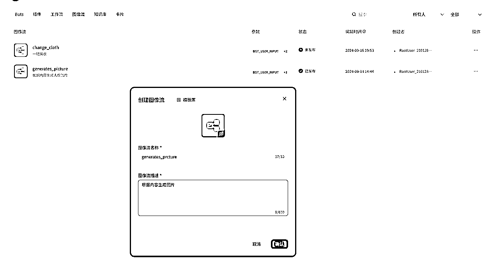

# 【实操分享】扣子自动生成公众号爆文，并发布到公众号

> 来源：[https://s1osl1nvrd.feishu.cn/docx/GfOhdEPY0odAzTxYUP4cPHJynkf](https://s1osl1nvrd.feishu.cn/docx/GfOhdEPY0odAzTxYUP4cPHJynkf)

# 一、简介

感谢生财有术，这篇文章所用到的所有内容，都是通过航海学习到的。

通过这篇文章，我们可以通过扣子工作流，一键生成公众号爆文，并且发布到公众号。

关于公众号爆文，和扣子工作流相关，这里就不展开了，大家自行去看航海手册，现在立马开始教程。

# 二、工作流搭建

## 1、创建工作流

## 2、设置输入参数

这里的公众号APPID和密钥，后续会说到如何获取。

## 3、添加大模型，并设置提示词

我这里提示词是根据标题生成一篇文章，参数是取开始-title，大家可根据自己需要自行调整。

## 4、增加图像流，生成文章封面图

我这里是直接用标题作为提示词，大家也可以根据文章内容生成。

大家还需要再建一个图像流，步骤如下：

## 5、增加公众号插件

### （1）点击插件

### （2）搜索“微信公众号助手”

### （3）添加插件

这里我选择的是发布到草稿，我会人工审核一遍再发布。

## 6、获取公众号配置

### （1）扫码登录

### （2）点击设置与开发-基本配置

### （3）生成密钥

PS：密钥不可查看，生成后立马找地方存放好，不过忘记也无所谓，可以重新生成。

这里把AppID和AppSecret复制出来，等着一会使用。

### （4）获取组件ip

1、回到插件页面，点击查看插件明细。

2、点击“查看更多”展开明细

3、复制ip

### （5）配置IP白名单

公众号安全需要，需要配置可以获取token的ip，这里我们需要配置前面用到的公众号组件的ip。

先回到公众号。

1.点击设置与开发-基本配置

2.查看IP白名单

3.点击修改

4.填入ip后点击确认修改，再扫个码就可以了，刚改完不会立即生效，可能要等几分钟。

## 7、回到工作流 配置wx_access_token节点 获取accessToken

accessToken是我们操作公众号的身份，要先获取。

参数看图片的即可，都是在开始节点要求输入的。

## 8、配置wx_material_upload节点 上传素材

这个是把图片上传到公众号的素材里面，然后得到一个media_id，后续我们可以拿到这个media_id作为封面图的id传入。

参数获取明细：image_url

参数获取明细：access_token

## 9、配置wx_upload_article节点 发布文章到草稿

# 三、效果

## 1、试运行 填入公众号信息，并输入一个标题

## 2、总体流程

可以看到，工作流跑完，就可以在公众号的草稿箱看到了，之后可以直接在这里面选择发布了。