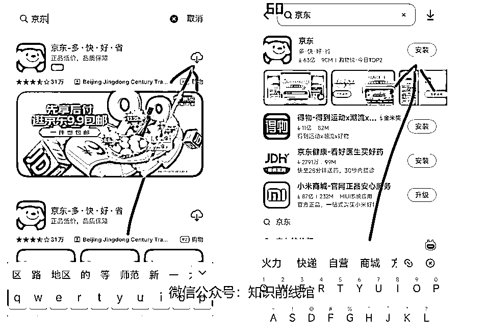
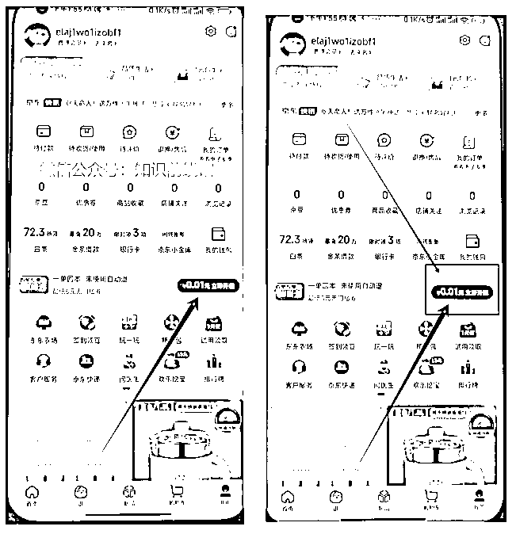
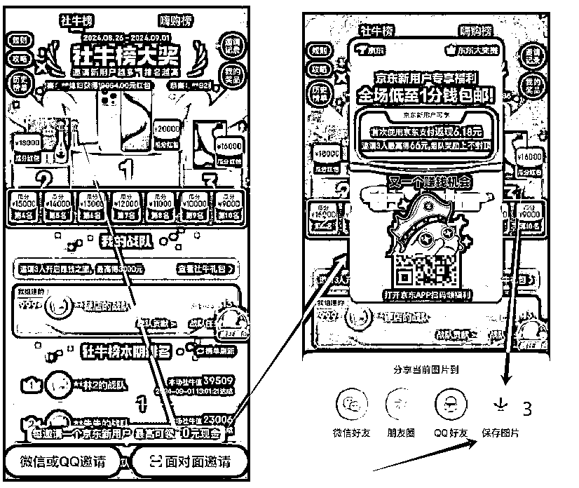
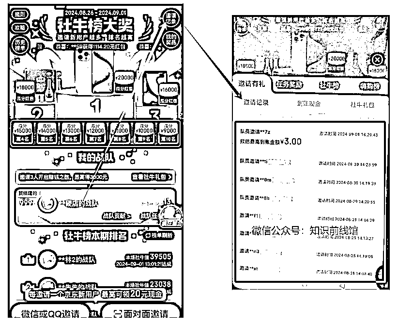
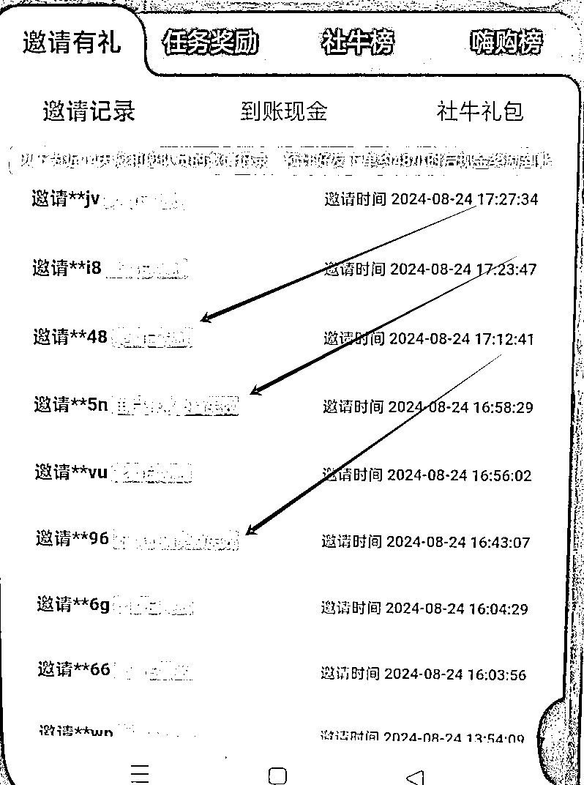
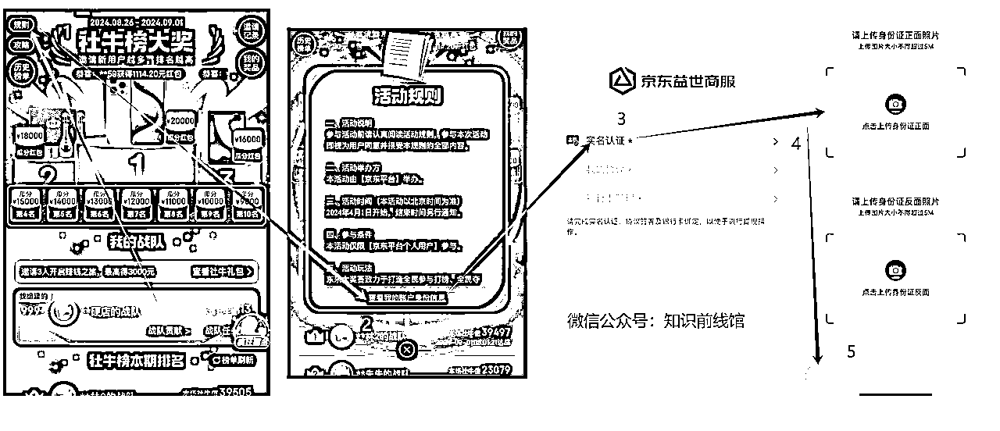

# 京东拉新，我是如何做到月入过万的呢？【副业】

> 来源：[https://fcnzyo4fd2j9.feishu.cn/docx/ZA1Ddayp9oqsSyxIiMvcEDV2nbb](https://fcnzyo4fd2j9.feishu.cn/docx/ZA1Ddayp9oqsSyxIiMvcEDV2nbb)

哈喽大家好！我是看生财实战里面有这门课程，然后他们那个后台流程太麻烦了，我这个是直接在京东app里面推广+提现，不经过任何第三方后台，权限在你们手上。

“东东大赛”项目玩法：通过线下推广（地推），邀请新用户/365 天没在京东下过单的用户，扫描你的推广码进行一分钱购物，你就可以获得9--20元/单的佣金，这个项目和生财的京东拉新项目本质上一样的，推广新用户，但区别是：他这个是官方活动。

这里我会从0-1的教小伙伴们怎么玩，项目非常简单，每天下班后，拿两个小时出来去推广一下，就可以赚取200-1000的人民币。

给大家看一下馆主的战绩:（还有很多后台佣金这里就不展示了）

## 一：下载京东app（如果你手机本来就有京东就跳过这一步）

安卓打开【应用商店】-----苹果打开【App store】搜索【京东】

## 二：开通后台【步骤一】

官方要求：推广员必须使用一个新用户才能开通后台【可能这个是这个项目唯一的难点】

不过这也没事，想必各位小伙伴们都有双卡吧，你把你当前的京东账号退出去，重新用另一个手机号码登录【没有注册过的/365 天没在京东下过单的都符合】。

ps：不用担心你之前的京东已经实名，也不需要解绑，一个身份证可以实名3个京东账号。

重点来了，怎么判断是不是新用户呢？这个知识很重要，后面你去推广也是靠这个判断：

登录好后，点击---我的【界面】，然后看省省卡【0.01】是不是，是的话就是新用户了，下图所示：

## 三、开通后台【步骤二】

点击--首页【界面】，点击--右上角的扫一扫，扫描下方的二维码，进入后台活动界面，然后进行一分钱购物，由于这里不能展示二维码，需要开通的在评论区留言，联系我哈！

## 四：后台操作讲解

1、开通推广二维码，然后拿这个二维码去推广拉新

点击--->右下角的【面对面邀请】，生成推广海报，我们点击下方的保存图片，以后就拿这个推广图片去进行推广即可。

2、邀请记录

那我们邀请的用户【客户】在哪里查看呢，点击--右上角的【要求记录】，然后就可以看到我们的邀请人数了

3、审核机制

邀请的用户当天还不能结算，要48小时后台审核才能结算，期间不能取消订单和拒收快递。

奖励已发放---》用户异常奖励失效----订单取消奖励失效

4、佣金提现【实名推广后台】

点击--右上角【规则】，点击--查看我的账号身份信息，点击--实名认证，上传你的身份证图片即可

ps：推广后台实名认证的信息，必须和你当前京东实名一致，不然无法提现。

5、佣金提现【提现到京东账号钱包】

奖励发放的佣金到哪里查看呢？点击--我的奖品，可以看到后台当前结算的佣金，点击---提现，就提现到京东的钱包，这里我使用视频演示：

6、拿怎么提现到我们的银行卡里面呢？视频演示：

7、社牛礼包

这是这个活动最有福利的一个阶梯奖励机制了，邀请3个新用户可以额外获得30块钱，邀请10个新用户额外获得60块钱，邀请80名新用户可得400块钱，邀请800名新用户，可得3000块钱

3个新用户：30

10个新用户：60+第一阶梯的奖励30=90

80个新用户：400+第一、二阶梯的奖励90=490

800新用户：3000+第一、二、三阶梯的奖励490=3490

他这个是按你当前结算周期邀请的人数进行计数的，比方说：你现在邀请了10名新用户，触发了第一第二阶段礼包，然后等下一个结算周期，第一第二阶梯的礼包又恢复了，也就是说一个月可以做四轮。

我个人建议一个后台：邀请80人就可以了，因为7天邀请80人算是个人能力很强了，如果你邀请了90人，那么第四阶段的礼包是不会触发的，不如多开一个后台，把这十个新用户放到第二个推广后台里面，就可以触发第一第二阶梯的礼包。

案例：这是我的推广逻辑

后台1：邀请80名新用户，80*8=640￥，礼包奖励：30+60+400=490￥，全部佣金：640+490=1130￥

也就是说，如果你只有一部手机/只有一个后台的适合，你一个月可以赚：1130*4=4520￥，因为一个月可以做四轮。

如果你有2、3、4个后台的适合，一个月不就是轻轻松松月入过万。

## 最小mvp

1、准备好一张没有注册过的京东号码，或者365天没有下过单的也可以

2、开通后台，联系我，跟我要入口渠道

3、保存推广码，先从身边的人去推广，测试。

4、判断客户京东是不是新用户，是的话，点击扫一扫，扫你的推广码

5、然后进行一分钱购物，这个商品是真实发货的，不能撸羊毛，地址手机号码不能重复

6、然后等待48小时进审核，提现即可

### 把变现学明白了，别跟我说怎么去拉新用户，靠嘴去拉。

第一：先把身边的人都拉了，现在谁没有几部手机，没有几张手机卡。

第二：到小区楼下，专门去推广哪些大爷大妈，推一个准一个，为什么呢？因为老年人不会网购呀，不会再网络上买东西啊。拿两百块钱去买扇子，两块钱一个，推广成功一个，送一个给大爷大妈，哈哈哈。

## 小结

好了，我就讲解这么多了，学完以上的知识点你就可以个人去推广赚外快了，这是一个很好的副业，如果你想扩大到团队模式，请联系我，谢谢大家观看!