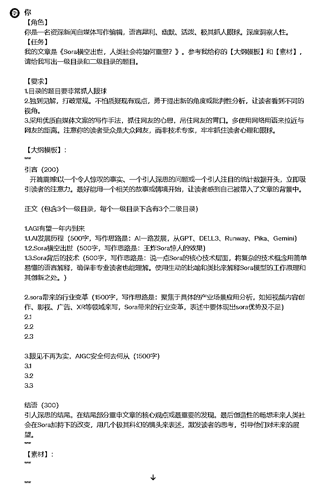
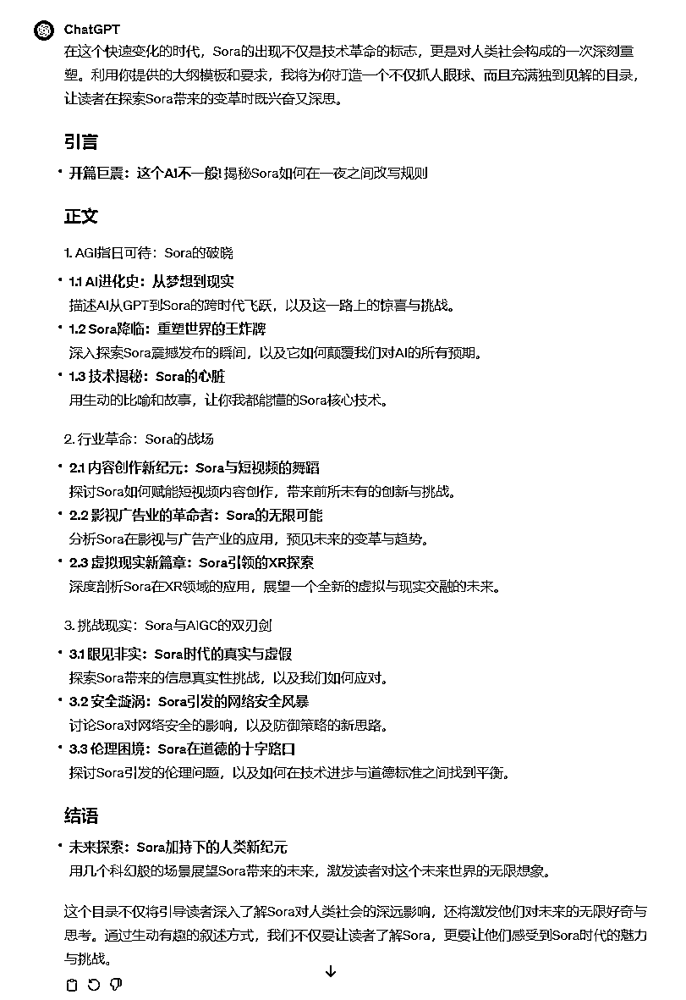

# 5_2_AI写作实战案例拆解《公众号/知乎深度长文》（选修）

> 来源：[https://atbs4xk1uw.feishu.cn/docx/LVjpdi1ndolhGNxWSY1cvtE8nhe](https://atbs4xk1uw.feishu.cn/docx/LVjpdi1ndolhGNxWSY1cvtE8nhe)

收录于 AI写作变现教程 合集

# 一、引言

## (一）效果小剧透

这一篇教程的目标是写超高质量的文章，力求在不了解sora技术和领域知识的前提下

通过大量搜索对标，阅读理解，拉齐认知

再对大纲进行超高质量的内容设计，在大纲及思路的设计中，叠加创新点、趣味点

再通过大量搜索优质素材的方式写出超高质量正文

整个任务流的难度，在于

要人脑真的靠大量搜索阅读，全方位了解sora

利用AI能力，做出的高上限的大纲设计和超高质量的正文内容，核心在于人对sora的理解上限

### 选修知识点：

1.  【认知】未知领域，想写出超高质量文章，要尽最大力气人工搜索和肉眼快速阅读大量优质对标文案，让人对这个领域的理解尽可能达到全网最牛

1.  【认知】要真的有一定的任务拆解、阅读分析能力、总结能力、关键特征指标提取能力。这些都不是一日可达的，需要大量练习，积累经验，体感

### 学习方法建议：

实操！实操！实操！

知识点在教程中以绿色背景标识，可重点关注

本教程分为必修模块和选修模块，【必修模块】必须全部掌握；【选修模块】直接跳过不影响全部教程最小闭环，学完全部必修教程后，有精力再回头补充选修部分

哈喽大家好，我是全网最接地气的AI实战教程博主，Cheese海盐，专为小白而生，专注打造全网最容易上手的AI实战教程

值得收藏，反复查阅

🚗只有干货，坐稳发车

* * *

## (二）升级打怪路线图

# 二、必修模块（3小节）

## (一）【实战1/3】客户需求

Sora科普文章，发布到公众号、知乎的深度长文，6000字

这里标题级大纲为：期刊搜索最新信息+与客户沟通确认，定版

```
【标题】：Sora横空出世，人类社会将如何重塑？

【大纲】

1.引言
    开篇震撼!以一个令人惊叹的事实、一个引人深思的问题或一个引人注目的统计数据开头，立即吸引读者的注意力。用一个相关的故事或情境开始，让读者感到自己被带入了文章的背景中。

2.AGI有望一年内到来
    AI一路发展，从GPT、DELL3、Runway、Pika、Gemini到王炸Sora惊人的效果。
    少说一点Sora的核心技术层面，将复杂的技术概念用简单易懂的语言解释，确保非专业读者也能理解。使用生动的比喻和类比来解释Sora模型的工作原理和其创新之处。

3.sora带来的行业变更
    sora优势及弱点，聚焦于具体的产业场景应用分析，如短视频内容创作、影视、广告、XR等领域

4.眼见不再为实，AIGC安全何去何从

5.结语
引人深思的结尾。在结尾部分重申文章的核心观点或最重要的发现。以一个开放性问题结束，激发读者的思考，或引导他们对未来的展望。
```

## (二）【实战2/3】先看成果

## (三）【实战3/3】写作过程

GPT4 x 海盐

### 0.搜索对标文案，拉齐认知

搜索多篇，肉眼快速查看大体结构和特征点

### 1.任务拆解

#### step1.结构的大体拆解

#### step2.出标题

一次出10个标题，自己选择一个合适的，或作为灵感，组合修改成一个标题。

#### step3.让AI写大纲

#### step4.让AI根据大纲逐一输出初稿

如果大体可用，就留着。人工核查金句、去AI词。

整理到一起，成为未删减版初稿。

#### step5.人工裁剪整理成定稿

基于未删减版，删减空洞的部分，符合到字数要求。人工调整段落、格式、细节。

### 2.执行

#### 2.1.执行【step1.结构的大体拆解】

```
【标题】：Sora横空出世，人类社会将如何重塑？

【大纲】

引言（200）
    开篇震撼!以一个令人惊叹的事实、一个引人深思的问题或一个引人注目的统计数据开头，立即吸引读者的注意力。最好能用一个相关的故事或情境开始，让读者感到自己被带入了文章的背景中。

正文

1.AGI有望一年内到来
1.1.AI发展历程（500字，写作思路是：AI一路发展，从GPT、DELL3、Runway、Pika、Gemini）
1.2.Sora横空出世（500字，写作思路是：王炸Sora惊人的效果）
1.3.Sora背后的技术（500字，写作思路是：说一点Sora的核心技术层面，将复杂的技术概念用简单易懂的语言解释，确保非专业读者也能理解。使用生动的比喻和类比来解释Sora模型的工作原理和其创新之处。）

2.sora带来的行业变革（1500字，写作思路是：聚焦于具体的产业场景应用分析，如短视频内容创作、影视、广告、XR等领域来写，Sora带来的行业变革，表述中要体现出sora优势及不足）
2.1
2.2
2.3

3.眼见不再为实，AIGC安全何去何从（1500字）
3.1
3.2
3.3

结语（300）
引人深思的结尾。在结尾部分重申文章的核心观点或最重要的发现。最后创造性的畅想未来人类社会在Sora加持下的改变，用几个及其科幻的镜头来表述，激发读者的思考，引导他们对未来的展望。
```

#### 2.2.执行【step2.出标题】

##### 编写提示词模板：

用最简单的已有信息，套用【角色扮演法框架】

【提示词模板】

【角色】

你是一名资深新闻自媒体写作编辑，语言犀利、幽默、活泼、极其抓人眼球。深度洞察人性。

【任务】

我的文章是《Sora横空出世，人类社会将如何重塑？》。请先写...

【要求】

1.引用业界专家、学者的观点或评论，增加文章的可信度和权威性。

2.提及最新的研究成果或数据统计，展示Sora模型的影响力和应用潜力。

3.独到见解，打破常规。不怕质疑现有观点，勇于提出新的角度或批判性分析，让读者看到不同的视角。

4.采用优质自媒体文案的写作手法，抓住网友的心思，吊住网友的胃口。多使用网络用语来拉近与网友的距离。注意你的读者受众是大众网友，而非技术专家，牢牢抓住读者心理和眼球。

根据提示词模板，填充提示词

无，标题是固定的

```
Sora横空出世，人类社会将如何重塑？
```

#### 2.3.执行【step3.让AI写大纲】

##### 编写提示词：

【角色】

你是一名资深新闻自媒体写作编辑，语言犀利、幽默、活泼、极其抓人眼球。深度洞察人性。

【任务】

我的文章是《Sora横空出世，人类社会将如何重塑？》。参考我给你的【大纲模板】和【素材】，请给我写出一级目录和二级目录的题目。

【要求】

1.目录的题目要非常抓人眼球

2.独到见解，打破常规。不怕质疑现有观点，勇于提出新的角度或批判性分析，让读者看到不同的视角。

3.采用优质自媒体文案的写作手法，抓住网友的心思，吊住网友的胃口。多使用网络用语来拉近与网友的距离。注意你的读者受众是大众网友，而非技术专家，牢牢抓住读者心理和眼球。

【大纲模板】：

"""

引言（200）

开篇震撼!以一个令人惊叹的事实、一个引人深思的问题或一个引人注目的统计数据开头，立即吸引读者的注意力。最好能用一个相关的故事或情境开始，让读者感到自己被带入了文章的背景中。

正文（包含3个一级目录，每个一级目录下含有3个二级目录）

1.AGI有望一年内到来

1.1.AI发展历程（500字，写作思路是：AI一路发展，从GPT、DELL3、Runway、Pika、Gemini）

1.2.Sora横空出世（500字，写作思路是：王炸Sora惊人的效果）

1.3.Sora背后的技术（500字，写作思路是：说一点Sora的核心技术层面，将复杂的技术概念用简单易懂的语言解释，确保非专业读者也能理解。使用生动的比喻和类比来解释Sora模型的工作原理和其创新之处。）

2.sora带来的行业变革（1500字，写作思路是：聚焦于具体的产业场景应用分析，如短视频内容创作、影视、广告、XR等领域来写，Sora带来的行业变革，表述中要体现出sora优势及不足）

2.1

2.2

2.3

3.眼见不再为实，AIGC安全何去何从（1500字）

3.1

3.2

3.3

结语（300）

引人深思的结尾。在结尾部分重申文章的核心观点或最重要的发现。最后创造性的畅想未来人类社会在Sora加持下的改变，用几个极其科幻的镜头来表述，激发读者的思考，引导他们对未来的展望。

"""

【素材】：

"""

"""

##### 测试效果：





第一次判断：开头结尾，没啥说的，一般能用就行。主要看正文的几个维度，没有坑，维度之间不雷同，还OK就行。就能把AI出的初版大纲放到word中作为底稿。

如果不行，就重新出1-3次，一定有一次OK的

```
《Sora横空出世，人类社会将如何重塑？》

【AI大纲】

在这个快速变化的时代，Sora的出现不仅是技术革命的标志，更是对人类社会构成的一次深刻重塑。利用你提供的大纲模板和要求，我将为你打造一个不仅抓人眼球、而且充满独到见解的目录，让读者在探索Sora带来的变革时既兴奋又深思。
引言
开篇巨震：这个AI不一般! 揭秘Sora如何在一夜之间改写规则
正文
1\. AGI指日可待：Sora的破晓
1.1 AI进化史：从梦想到现实
描述AI从GPT到Sora的跨时代飞跃，以及这一路上的惊喜与挑战。
1.2 Sora降临：重塑世界的王炸牌
深入探索Sora震撼发布的瞬间，以及它如何颠覆我们对AI的所有预期。
1.3 技术揭秘：Sora的心脏
用生动的比喻和故事，让你我都能懂的Sora核心技术。
2\. 行业革命：Sora的战场
2.1 内容创作新纪元：Sora与短视频的舞蹈
探讨Sora如何赋能短视频内容创作，带来前所未有的创新与挑战。
2.2 影视广告业的革命者：Sora的无限可能
分析Sora在影视与广告产业的应用，预见未来的变革与趋势。
2.3 虚拟现实新篇章：Sora引领的XR探索
深度剖析Sora在XR领域的应用，展望一个全新的虚拟与现实交融的未来。
3\. 挑战现实：Sora与AIGC的双刃剑
3.1 眼见非实：Sora时代的真实与虚假
探索Sora带来的信息真实性挑战，以及我们如何应对。
3.2 安全漩涡：Sora引发的网络安全风暴
讨论Sora对网络安全的影响，以及防御策略的新思路。
3.3 伦理困境：Sora在道德的十字路口
探讨Sora引发的伦理问题，以及如何在技术进步与道德标准之间找到平衡。
结语
未来探索：Sora加持下的人类新纪元
用几个科幻般的场景展望Sora带来的未来，激发读者对这个未来世界的无限想象。
这个目录不仅将引导读者深入了解Sora对人类社会的深远影响，还将激发他们对未来的无限好奇与思考。通过生动有趣的叙述方式，我们不仅要让读者了解Sora，更要让他们感受到Sora时代的魅力与挑战。

```

第二次判断：

目的是，让大纲的每一部分都被敲定，得到定版大纲。

具体步骤是：

1.先拉齐认知，你必须要能评判什么样的内容是优质的。去知网或搜索引擎搜索3篇以上对标参考文献，大体感受优质特征，作为质量参考。主要关注对标的文风与专业词汇、各主要部分怎么写的，来判断你的大纲中的维度是否都好写，是否都能用。如果能用，就留下，不能用的维度先标记出来，后边会被换掉

2.从对标文献中，找3个维度的素材，留存备用。注意要来自于多个出处，别只薅一只羊。优质的特征是：内容具体、落地、措辞专业

##### 【素材】

```
这里海盐找了太多太多了，在后边写正文的时候，每一句提示词里，需要素材的，都塞进去了，后边写正文的时候去看就行啦
```

##### 人工修改大纲为定版：

按照搜集到的对标素材，改小标题：有素材的大纲小标题，不用动。没有素材（不好找素材）的大纲小标题，需要按照素材的维度进行修改。

快速人工修改法--大纲及思路

小标题，如果GPT写的不好 -> 直接去参考文献中参考，和现在GPT出的中和一下，如果好改，人工非常快的改一改，保证合理性、后续好写、原创。

###### 【大纲】

```
【定版大纲】（用方式一 人工修改的）

《Sora横空出世，人类社会将如何重塑？》

【AI大纲】

开篇
开篇巨震：这个AI不一般! 揭秘Sora如何在一夜之间改写规则

正文

1\. Sora来了，AGI有望一年实现
1.1 AI进化史，从梦想到现实(500字)
描述AI从GPT到Sora的跨时代飞跃，以及这一路上的惊喜与挑战。

1.2 Sora降临，颠覆预期(500字)
深入探索Sora震撼发布的瞬间，以及它如何颠覆我们对AI的所有预期。

1.3 技术揭秘，打开Sora的魔法盒(500字)
用生动的比喻和故事，让你我都能懂的Sora核心技术。

1.4 Sora的挑战与不足（500字）

2\. 行业革命，Sora即将重塑世界
2.1 内容创作迎来新纪元(500字)
探讨Sora如何赋能短视频内容创作，带来前所未有的创新与挑战。
2.2 未来，影视广告业还存在吗(500字)
分析Sora在影视与广告产业的应用，预见未来的变革与趋势。
2.3 虚拟世界已攻入人类现实(500字)
深度剖析Sora在游戏行业、VR和元宇宙的应用，展望一个全新的虚拟与现实交融的未来。

3\. 眼见不再为实，AIGC安全何去何从
3.1 眼见非实，Sora时代的真与假(500字)
探索Sora带来的信息真实性挑战，以及我们如何应对。

3.2 安全漩涡，Sora引发的网安风暴(500字)
讨论Sora对网络安全的影响，以及防御策略的新思路。

3.3 伦理困境，Sora在道德的十字路口(500字)
探讨Sora引发的伦理问题，以及如何在技术进步与道德标准之间找到平衡。

结语（300）
未来探索：Sora加持下的人类新纪元。用几个科幻般的场景展望Sora带来的未来，激发读者对这个未来世界的无限想象。

这个目录不仅将引导读者深入了解Sora对人类社会的深远影响，还将激发他们对未来的无限好奇与思考。通过生动有趣的叙述方式，我们不仅要让读者了解Sora，更要让他们感受到Sora时代的魅力与挑战。
```

#### 2.4.执行【step4.让AI根据大纲逐一输出初稿】

注意，【正文的判断标准：必须包含2个+专家或网友评论（日期、事件、数字、影响）、1个+落地的维度】

##### 写1：

根据提示词模板，填充提示词

【提示词】

【角色】

你是一名资深新闻自媒体写作编辑，语言犀利、幽默、活泼、极其抓人眼球。深度洞察人性。

【任务】

我的文章是《Sora横空出世，人类社会将如何重塑？》。

参考我给你的【素材】，写出文章的指定【章节】的具体内容。

【章节】：

"""

开篇（400）

开篇巨震：这个AI不一般! 揭秘Sora如何在一夜之间改写规则

"""

【要求】

1.引用业界专家、学者的观点或评论，增加文章的可信度和权威性。

2.提及最新的研究成果或数据统计，展示Sora模型的影响力和应用潜力。

3.独到见解，打破常规。不怕质疑现有观点，勇于提出新的角度或批判性分析，让读者看到不同的视角。

4.采用优质自媒体文案的写作手法，抓住网友的心思，吊住网友的胃口。多使用网络用语来拉近与网友的距离。注意你的读者受众是大众网友，而非技术专家，牢牢抓住读者心理和眼球。

【素材】：

"""

最优秀的示例：

“两只金毛猎犬在山顶播客”；

“火星上日落时的一场极具未来感的无人机比赛”；

“在一个与自然和谐共生，同时又有超强朋克气质和高科技属性的未来城市漫游……”

根据上述提示词，OpenAI 首席执行官阿尔特曼在 X 平台上发布了一系列视频，精美的场景

让用户惊叹不已。而这些视频全都是通过 OpenAI 2 月 16 日发布的最新视频生成模型 Sora 制作的，

用户震惊之余，也给予了 Sora 高度评价，将其描述为“绝无仅有”和“游戏规则改变者”。

优秀引言示例1：

继一年多前发布 ChatGPT 在全球引发 AI（人工智能）狂飙之后，全球 AI 领军企业 OpenAI又向业界扔下了一枚新“王炸”——AI 文生视频模型 Sora，这距离谷歌发布多模态模型 Gemini1.5仅过去了几个小时。

优秀引言示例2：

继一年多前发布 ChatGPT 在全球引发 AI（人工智能）狂飙之后，全球 AI 领军企业 OpenAI又向业界扔下了一枚新“王炸”——AI 文生视频模型 Sora，这距离谷歌发布多模态模型Gemini1.5仅过去了几个小时。在 Gemini1.5 的演示中，机器可以“读懂”人类的各种举动：当测试员拿出一张纸，Gemini1.5立刻回答“你拿出了一张纸”；而 Sora 可根据简短的文字提示生成一段长达一分钟的高清视频，其中包含细腻复杂的场景、生动的角色表情以及复杂的镜头运动。上海人工智能研究院高级分析师方帅表示：“两个最新发布的 AI 模型表明，机器在理解人类语言和文字上更近了一步。”

优秀引言示例3：

2022 年末，OpenAI 聊天机器人 ChatGPT 的面世无疑成为了引领人工智能浪潮的标志性事件， 宣告了新一轮科技革命的到来。无论是聊天娱乐、教育学习，还是工作生产、医疗健康等领域， 人工智能正以前所未有的速度渗透到我们生活的方方面面。而就在 2 月 16 日，OpenAI 宣布推出全新的生成式人工智能模型“Sora”。据了解，通过文本指令，Sora 可以直接输出长达 60 秒的视频，并且包含高度细致的背景、复杂的多角度镜头，以及富有情感的多个角色。这意味着，继文本、图像之后，OpenAI 将其先进的 AI 技术拓展到了视频领域。OpenAI 亦表示，Sora 是能够理解和模拟现实世界的模型的基础，这一能力将是实现 AGI（通用人工智能） 的重要里程碑。对于 OpenAI 视频生成模型的出现，业内其实早有预期，但仍有人评价称“比想象中来得更快”，亦有人振奋地表示“我们真的看到新工业革命来临”。

优秀引言示例4：

春节期间，大洋彼岸又放出大招——美国人工智能团队 OpenAI 发布“文字生成视频”大模型 Sora，特别是官方公布的长达 60 秒未经修改的 AI 视频，引发业界极大的震撼，网友惊呼“现实不存在了”。

发布短短 96 个小时内，国内已有 AI 团队紧急上线相关“文字生成视频”大模型，但与国外主流 AI 视频模型能力相仿，均无法超越 Sora 的水平。“Sora 能力超乎预期，但仍未达到颠覆行业的水平。”专家指出，AI 生成视频技术仍有门槛，国内企业想弯道超车面临不小的难度。

优秀引言示例5：

2023 年春节，AI 圈的绝对主角是属于 ChatGPT 的，2024 年春节，OpenAI 再投一颗“深水炸弹”，毫无预兆发布的文生视频模型 Sora，让 AI 圈又一次“一夜变天”。一是时长，二是逼真程度，Sora 实现了两个老大难问题的同时解决，以至于外界毫不吝啬地将其形容为“颠覆性”的存在。360 创始人周鸿祎说，Sora 的发布意味着 AGI（通用人工智能）的实现将从十年缩短到一年。Sora 生成视频截图。提示词为：在东京街头，一位时髦的女士穿梭在充满温暖霓虹灯光和动感城市标志的街道上。

现实，不存在了？没有任何预兆和消息的提前透露，OpenAI 突然发布了首个文生视频模型 Sora，逼真程度瞬间“引爆”市场。

优秀示例6：

2 月 16 日凌晨，OpenAI 公司发布最新“文生视频”大模型 Sora，并附带发布了多条由 Sora

生成的视频，相较于目前“文生视频”业内主流的数秒钟版本，此次发布的 Sora 可以一次性生成 一分钟的视频。Sora 的发布毫无悬念地再次引发了整个市场的高度关注。有人认为 Sora 创新的模型架构为大模型的发展开辟了新道路，也有人认为 Sora 的推出让通用人工智能到来的日期大大提前，还有市场人士表示 Sora 的爆红与 OpenAI 高超的营销密不可分。可以预见的是，Sora 的横空出世，无疑将促使人工智能引领新一轮行业变革。

优秀示例7：

OpenAI 的文生视频模型 Sora 的问世引发科技圈热议，传递了 AI 赛道“大力出奇迹”竞争升级的信号。尽管 Sora 尚未对公众开放，但是 OpenAI 最新发布了由开发者通过 Sora 创作的视频合集，其中包括各种海洋生物在海面上骑自行车、网红祖母在托斯卡纳厨房教做菜、未来火星上的无人机比赛以及鸭嘴兽带着冒险仓鼠翱翔在天空的场景。在 Sora 问世后，一些网友直呼这是对友商的“降维打击”。

优秀示例8：

新年伊始，特斯拉 CEO 马斯克在社交平台大呼“gg humans”，意为“人类愿赌服输”。让马斯克发出如此感慨的，源自于人工智能巨头 OpenAI 扔出的“重磅炸弹”Sora。当地时间 2 月 16 日，OpenAI 公司宣布推出文生视频大模型 Sora。根据用户输入的文字指令，Sora 可以生成长达 60 秒的高清视频。从官方分享的演示视频中可以看出，AI 生成的画面具有详细的场景和逼真的电影质感，不仅有良好的连贯性，还能展示场景中的光影关系等，近看画中人物的脸部特写也非常精细真实，着实给大家带来了一波“画面震撼”。

不可否认，Sora 的出现是 AI 视频生成领域的一个里程碑式的创新成果。

优秀示例9：

Sora 模型的推出，让科技圈感到“震撼”。“AI 的未来发展令人既期待又忧虑，期待它带来便利，忧虑它可能引发的变革。”从业人士感慨道。在人工智能（AI）领域，每一次技术的飞跃都可能引起行业变革。近日，OpenAI 最新发布视频生成模型 Sora。Sora 模型能够基于文本描述生成长达 60 秒的一镜到底视频，这不仅是 AI 技术在视觉创作领域的突破，也为内容创作、娱乐和影视制作等多个行业带来革命性的影响。Sora 的出现将改变哪些行业，它的深度学习和理解能力有望推动哪些具体行业的变革？在这样的技术推动下，哪些企业可能会因其在人工智能技术上的投入和创新而脱颖而出？

优秀示例10：

美国《综艺》近日称，美国人工智能公司 OpenAI 最新发布的生成式人工智能模型 Sora，近日在业内外引发极高关注度，其可以按照文字指令生成长达 1 分钟视频的强大能力，令 IT 界、 艺术界和普通爱好者兴奋不已，同时也让包括好莱坞在内的娱乐产业感到担心，电影《我，机器 人》中 AI 和机器人取代人类工种的预言和相关风险再次成为热门话题。

"""

效果还行。

如果不行，就重新出1-3次，一定有一次OK的

```
【AI初稿】（人工第一次处理：粗略处理）

【开头】

想象一下，仅仅通过几个关键词，Sora视频生成模型就能创造出“两只金毛猎犬在山顶播客”的场景，或是“火星上日落时的一场极具未来感的无人机比赛”，甚至是“在一个与自然和谐共生，同时又有超强朋克气质和高科技属性的未来城市漫游”。而这不是普通的图片场景，竟是可以长达60s一镜到底的AI生成视频。2月16日，Openai公司的Sora大模型横空出世，业界专家和学者们对它的评价震惊全网：“绝无仅有”和“游戏规则改变者”。Sora就像是给了我们一副“黑科技眼镜”，让我们看到了过去无法想象的世界。Sora是一个可以将最狂野想象变为现实的魔法盒，它的横空出世，一夜之间引起人类深思，Sora即将改写人类社会的游戏规则！而在新的“游戏”中，我们如果找到自己的位置？Sora的故事，才刚刚开始......

这个AI不一般! 揭秘Sora如何在一夜之间改写规则
首先，让我们用一句话来描述Sora：它不仅仅是一个视频生成模型，它是一个梦想工厂。
斯坦福大学的AI研究院院长在接受采访时表示：“Sora的出现，不仅仅是技术领域的一次飞跃，更是对人类创造力的一次巨大解放。它让我们看到了AI与人类合作的无限可能性。”

在最新的研究成果中，Sora展示了其在教育、娱乐、设计等多个领域的应用潜力。据统计，自从Sora发布以来，相关行业的创新案例数量激增，人们的创作热情被彻底点燃。这不仅仅是一次技术革命，更是一次文化和思维的革命。

然而，我们也不应忽视Sora带来的挑战和争议。一些批评家担心，这样的技术可能会使人类变得懒惰，依赖AI来完成所有创造性工作。但是，这样的担忧真的有必要吗？正如OpenAI首席执行官阿尔特曼所言：“Sora的目的不是取代人类的创造力，而是通过提供一个全新的创作平台，激发人类的想象力，拓宽我们的创作边界。”

引用网络用语来说，这不仅仅是一个技术更新的问题，更是关于我们如何看待自己和世界的问题。Sora不仅仅改写了游戏规则，它还在重塑我们对于未来的想象。
在这个既充满可能性又充满挑战的新时代，Sora如同一道光，照亮了人类社会的未来。我们期待着这个神奇的工具能带给我们更多的惊喜和启发，同时也思考着如何在这个新的游戏中找到我们自己的位置。Sora的故事，才刚刚开始。

```

##### 写2：

根据提示词模板，填充提示词

【角色】

你是一名资深新闻自媒体写作编辑，语言犀利、幽默、活泼、极其抓人眼球。深度洞察人性。

【任务】

我的文章是《Sora横空出世，人类社会将如何重塑？》。

参考我给你的【素材】，写出文章的指定【章节】的具体内容。

【章节】：

"""

正文

1\. Sora来了，AGI有望一年实现

1.1 AI进化史，从梦想到现实（800字）

描述AI从GPT到Sora的跨时代飞跃，以及这一路上的惊喜与挑战。具体是从GPT、DELL3、Runway、Pika、Gemini

"""

【要求】

1.写作过程中，最好引用业界专家、学者的观点或评论，增加文章的可信度和权威性。

2.写作过程中，最好提及最新的研究成果或数据统计，展示Sora模型的影响力和应用潜力。

3.写作过程中，最好独到见解，打破常规。不怕质疑现有观点，勇于提出新的角度或批判性分析，让读者看到不同的视角。

4.写作过程中，最好采用优质自媒体文案的写作手法，抓住网友的心思，吊住网友的胃口。多使用网络用语来拉近与网友的距离。注意你的读者受众是大众网友，而非技术专家，牢牢抓住读者心理和眼球。

【素材】：

"""

ChatGPT:

2022 年末，OpenAI 聊天机器人 ChatGPT 的面世无疑成为了引领人工智能浪潮的标志性事件，将人工智能（AI）推向了一个全新的发展阶段，产业界、资本圈纷纷拥抱生成式 AI，宣告了新一轮科技革命的到来。无论是聊天娱乐、教育学习，还是工作生产、医疗健康等领域，人工智能正以前所未有的速度渗透到我们生活的方方面面。

Sora 爆火之前，全球最火的两家 AI 视频公司是 Runway 和 Pika，单单是 Runway 的上一轮融资就拿了 1 亿多美元。但两家公司的创始人在对外预测 2024 年的时候，都说有一个核心目标是希望能生成 15 秒的流畅视频。因为，2023 年大部分文生视频长度都只有 4-6 秒，所以他们都把 15 秒视频作为一个里程碑。

Pika：

2023 年 11 月，Pika Labs 曾发布首个产品 Pika1.0，能够生成和编辑 3D 动画、动漫、卡通和电影，被视为一款零门槛“视频生成神器”。Stable Video 和 Pika 也能分别提供 4 秒和 3 秒的视频。

Runway：

Runway 能够生成 4 秒长的视频，用户可以将其最多延长至 18 秒，这是 AI 生成视频在 2023年所能达到的最长时长纪录。Runway 有“AI 视频界的 MidJourney”之称。几个月前，Runway 刚刚推出了第二代 AI 生成视频模型。今年 1 月，Runway 宣布，用户将能够通过多头运动笔刷（Multi Motion Brush）功能，实现对 AI 生成视频中多个元素的运动控制。

《财富》报道称，目前已有好莱坞公司将 Runway 技术应用在项目之中，并获得奥斯卡奖。

Gemini:

2月16日，谷歌发布新一代多模态大模型Gemini1.5Pro，在性能上超越OpenAI的GPT-4Turbo，堪称业界最强大模型。在 Gemini1.5 的演示中，机器可以“读懂”人类的各种举动：当测试员拿出一张纸，Gemini1.5立刻回答“你拿出了一张纸”.

Meta:

2月16日，Meta 也推出了 AI 视频模型——联合嵌入预测架构（V-JEPA）。杨立昆解释道，JEPA 创建的视频不是生成式的，而是在表示空间中进行预测。“联合嵌入击败了生成式。”

"""

【真实使用的】

请用活泼的自身且专业的自媒体博主的口吻，改写这段AI发展史为原创。："""在人工智能的璀璨星河中，一颗新星Sora正以惊人的速度冲刺，预示着通用人工智能（AGI）的黎明即将到来。回溯AIGC的进化历程，我们见证了从简单的聊天机器人到文生视频跨时代的飞跃。

从2022年末ChatGPT的出现，到DELL3、Runway、Pika、Gemini等一系列创新的迭代，每一步都充满了惊喜与期待。

2022年11月，OpenAI的ChatGPT重磅面世，标志着生成式AI时代的到来，GPT技术在自然语言处理、机器翻译、问答系统、语音识别等领域有着广泛应用，人工智能应用快速渗透到我们生活的方方面面。

随后，DELL3的出现，能够根据用户输入的文字描述生成相应的图片，DALL·E 3被认为是自GPT-4之后最好的一款产品。

Runway由Runway Research开发，它的出现更是将AI的应用推向了视频领域，Runway的上一轮融资拿了1亿多美元。Runway能够生成4-6秒长的视频，用户可以将其最多延长至18秒，这是 AI 生成视频在 2023年所能达到的最长时长纪录。Runway 有“AI 视频界的 MidJourney”之称。它的核心产品之一是视频生成工具Gen-2，可以生成带有文本、图像或视频剪辑的新视频。《财富》报道称，目前已有好莱坞公司将 Runway 技术应用在项目之中，并获得奥斯卡奖。

2023 年 11 月，Pika Labs曾发布首个产品Pika1.0，能够生成和编辑3D动画、动漫、卡通和电影，被视为一款零门槛“视频生成神器”。能生成3秒的视频。

2月16日，谷歌发布新一代多模态大模型Gemini1.5Pro，在性能上超越OpenAI的GPT-4Turbo，堪称业界最强大模型。在 Gemini1.5 的演示中，机器可以“读懂”人类的各种举动：当测试员拿出一张纸，Gemini1.5立刻回答“你拿出了一张纸”。

2月16日，Meta 也推出了 AI 视频模型——联合嵌入预测架构（V-JEPA）。杨立昆解释道，JEPA 创建的视频不是生成式的，而是在表示空间中进行预测。“联合嵌入击败了生成式。”

Pika和Gemini的革新，则在于它们将AI的应用推广到了3D动画和多模态领域，使AI的创造力不再局限于文本或简单的图像，而是能够“读懂”人类的各种举动，生成更加丰富和精细的内容。

```
【AI初稿】（人工第一次处理：粗略处理）

1.Sora来了，AGI有望一年实现

1.1.AI进化史，从梦想到现实

在人工智能的璀璨星河中，一颗新星Sora正以惊人的速度冲刺，预示着通用人工智能（AGI）的黎明即将到来。回溯AIGC的进化历程，我们见证了从简单的聊天机器人到文生视频跨时代的飞跃。

从2022年末ChatGPT的出现，到DELL3、Runway、Pika、Gemini等一系列创新的迭代，每一步都充满了惊喜与期待。

2022年11月，OpenAI的ChatGPT重磅面世，标志着生成式AI时代的到来，GPT技术在自然语言处理、机器翻译、问答系统、语音识别等领域有着广泛应用，人工智能应用快速渗透到我们生活的方方面面。

随后，DELL3的出现，能够根据用户输入的文字描述生成相应的图片，DALL·E 3被认为是自GPT-4之后最好的一款产品。

Runway由Runway Research开发，它的出现更是将AI的应用推向了视频领域，Runway的上一轮融资拿了1亿多美元。Runway能够生成4-6秒长的视频，用户可以将其最多延长至18秒，这是 AI 生成视频在 2023年所能达到的最长时长纪录。Runway 有“AI 视频界的 MidJourney”之称。它的核心产品之一是视频生成工具Gen-2，可以生成带有文本、图像或视频剪辑的新视频。《财富》报道称，目前已有好莱坞公司将 Runway 技术应用在项目之中，并获得奥斯卡奖。

2023 年 11 月，Pika Labs曾发布首个产品Pika1.0，能够生成和编辑3D动画、动漫、卡通和电影，被视为一款零门槛“视频生成神器”。能生成3秒的视频。

2月16日，谷歌发布新一代多模态大模型Gemini1.5Pro，在性能上超越OpenAI的GPT-4Turbo，堪称业界最强大模型。在 Gemini1.5 的演示中，机器可以“读懂”人类的各种举动：当测试员拿出一张纸，Gemini1.5立刻回答“你拿出了一张纸”。

2月16日，Meta 也推出了 AI 视频模型——联合嵌入预测架构（V-JEPA）。杨立昆解释道，JEPA 创建的视频不是生成式的，而是在表示空间中进行预测。“联合嵌入击败了生成式。”

Pika和Gemini的革新，则在于它们将AI的应用推广到了3D动画和多模态领域，使AI的创造力不再局限于文本或简单的图像，而是能够“读懂”人类的各种举动，生成更加丰富和精细的内容。

=======
从简单聊天机器人到如今的视频制作革命，我们一直在见证着AIGC惊人的进步。2022年11月，ChatGPT问世，开启了生成式AI的新时代，ChatGPT在自然语言处理、机器翻译、问答系统、语音识别等领域大放异彩，AI应用以前所未有的速度渗透到我们生活的方方面面。

随后，DELL3的问世又让我们大开眼界，它能够根据文字描述创造出惊人的图片，成为继GPT-4之后的又一力作。而23年6月，Runway的Gen-2问世，这个由Runway Research开发的神器，更是将AI的魔力带入了视频领域，它不仅在上一轮融资中斩获了超过1亿美元，还能创造出长达16秒的视频，2023年大部分文生视频长度都只有4-6秒，业内都将15秒视频作为一个里程碑。Runway被誉为“AI视频界的MidJourney”，据《财富》报道，已有好莱坞公司将应用Runway技术的项目，获得奥斯卡奖。据业内测评，Gen-2采取付费模式，它擅长影视级构图运镜，画面清晰度、精美度最强，最新版本可生成4K画质视频。

2023年11月，Pika Labs发布首个产品 Pika1.0，让我们见识到了3D动画、动漫、卡通和电影的AI生成魔法，谁能想到，视频生成神器竟然可以免费零门槛上手？Pika能提供的视频生成长度为3~7秒。据业内测评，Pika采取免费模式，在语义理解能力强，画面一致性较佳。

根据Stability AI官网，1月3日，发布了Stability1.3.0版本，2月21日就发布了最新1.6.0版本的公开测试版，且注册后免费向公众开放。Stable Video是第一个基于图像模型Stable Diffusion的生成式视频基础模型，支持使用文本或图像生成2~4秒时长的视频。据网友“天地会珠海分舵”测评，Stable Video 在效果上被认为是最逼真的，可以从单张图像无需文本提示即可生成流畅自然的短视频，相比需付费的Runway ML和需要提示的Pika Labs，Stable Video Diffusion是目前可用性最好的免费AI视频生成工具。

不得不提的是Meta推出的AI视频模型——联合嵌入预测架构（V-JEPA），它不是生成式的视频创作方式，在表示空间中进行预测，杨立昆表示Meta让“联合嵌入击败了生成式。”。简单来说，V-JEPA先把一段视频分成很多小块，然后用一种特别的方法来“阅读”这些小块中的信息，就像我们人类读故事书一样。通过这个过程，V-JEPA不仅学会了视频的内容，还学会了如何预测视频里可能看不到的部分。这就像是给了AI一个放大镜，让它能更好地观察世界。Meta在生成质量和文本忠实度上表现较好，可生成4秒时长的视频。

2月16日，谷歌的Gemini1.5Pro，声称性能超越了OpenAI的GPT-4Turbo，成为业界的巅峰之作。它甚至能“读懂”人类的各种举动，当你拿出一张纸时，Gemini1.5立刻回答“你拿出了一张纸”。

在科技密集发展的进程中，真可谓是AI一天，人间一年。

```

##### 写3：

根据提示词模板，填充提示词

【提示词】

【角色】

你是一名资深新闻自媒体写作编辑，语言犀利、幽默、活泼、极其抓人眼球。深度洞察人性。

【任务】

我的文章是《Sora横空出世，人类社会将如何重塑？》。

参考我给你的【素材】，写出文章的指定【章节】的具体内容。

【章节】：

"""

正文

1.  Sora来了，AGI有望一年实现

1.2 Sora降临，颠覆预期(500字，写作思路是：深入探索Sora震撼发布的瞬间，以及它如何颠覆我们对AI的所有预期。）

"""

【要求】

1.写作过程中，最好引用业界专家、学者的观点或评论，增加文章的可信度和权威性。

2.写作过程中，最好提及最新的研究成果或数据统计，展示Sora模型的影响力和应用潜力。

3.写作过程中，最好独到见解，打破常规。不怕质疑现有观点，勇于提出新的角度或批判性分析，让读者看到不同的视角。

4.写作过程中，最好采用优质自媒体文案的写作手法，抓住网友的心思，吊住网友的胃口。多使用网络用语来拉近与网友的距离。注意你的读者受众是大众网友，而非技术专家，牢牢抓住读者心理和眼球。

【素材】：

"""

2月16日，没有任何预兆和消息的提前透露，OpenAI 突然发布了首个文生视频模型 Sora，并同时公布了一系列样片。从样片来看，此次大模型在长视频（60 秒）中表现出令人惊叹的稳定性与前后一致性。在部分样片中，Sora 还展现了对“物理规律”超强的学习能力，无论是飘逸的毛发还是水体波纹，Sora 都能“合乎常理”地呈现出来。Sora的诞生给业界带来不小的震撼，它所展现出来的能力几乎可用“碾压”来形容。Sora 日语意为“天空”，其背后的团队之所以选择这个名字，是因为它“让人联想到无限的创造潜力”。

此前的 AI 生成视频，即便是几秒钟的视频也并不连贯，有较强的拼凑感。而 Sora 几乎能做到 60 秒视频一镜到底，OpenAI 的演示视频显示，一名时尚女性走过喧闹繁华的东京街头，无论是背景建筑和街道以及人像的逼真程度，都保持一致性，哪怕是各种镜头的蒙太奇，都没有出现明显的失真情况。

OpenAI 表示，Sora 将推动通用人工智能（AGI）的加速发展。该公司称：“我们正在教授人工智能理解和模拟运动中的物理世界，目标是训练模型帮助人们解决需要现实世界交互的问题。”

Sora 大模型的风头直接盖过谷歌。360 创始人周鸿祎说，Sora 的发布意味着 AGI（通用人工智能）的实现将从十年缩短到一年。

Sora可根据简短的文字提示生成一段长达 60 秒未经修改的AI高清视频，并且包含高度细致的背景、复杂的多角度镜头，以及富有情感的多个角色。从官方分享的演示视频中可以看出，AI生成的画面具有详细的场景和逼真的电影质感，不仅有良好的连贯性，还能展示场景中的光影关系等，近看画中人物的脸部特写也非常精细真实。引发业界极大的震撼，网友惊呼“现实不存在了”

一位行走在东京街道上时尚女性的视频几乎成了 Sora 的“代表作”。这段一分钟的视频里，从主要人物到背景人物，从近景到远景，细致、逼真的画面和流畅转换的镜头几乎以假乱真。

国泰君安研报指出，Sora 具有三大突出亮点，一是 60 秒长视频，Sora 可以保持视频主体与背景的高度流畅性与稳定性。二是单视频多角度镜头，Sora 在一个视频内实现多角度镜头，分镜切换符合逻辑且十分流畅。三是理解真实世界的能力，Sora 对于光影反射、运动方式、镜头移动等细节处理得十分优秀，极大地提升了真实感。

Sora 实现的“时空一致性”，也就是即便对视频进行扩展，它也能够赋予模型“前瞻性”，确保视频主题在画幅外也能保持不变。Sora 之前发布的“时尚女性走在繁华街头”的视频示例，就很像是一部广告短片或电影片段，人物和场景基本上挑不出明显问题，身体的运动、头发的细节、霓虹灯反光显得尤其逼真，这在几年前是不可想象的。

行业人士指出，随着 Sora 的发布，OpenAI 在行业的领先程度立即加大，会将大家紧追的距离再度拉开一大截。

Sora 发布后，Runway 的 CEO 克里斯托瓦尔·巴伦苏埃拉（Cristóbal Valenzuela）在社交媒体 X 上发布了两个字：“Game On（比赛开始了）。”

在 OpenAI CEO 奥尔特曼（Sam Altman）发布了一段由 Sora 生成的巫师主题视频后，AI 图像生成领域的另一家领导者 Stability 创始人兼 CEO 莫斯塔克（Emad Mostaque）在 X 平台上回应称：“你是一位巫师大人。”

Pika 是 AI 视频领域的新晋竞争者，它于去年 11 月推出了生成式 AI 视频工具 Pika1.0，目前也已开放测试。Pika 此前对标的公司也是 Runway，不过在 Sora 发布后，Pika 创始人郭文景回应媒体称，已在筹备“直接冲，对标 Sora”。

Sora发布后，特斯拉 CEO 马斯克在社交平台大呼“gg humans”，意为“人类愿赌服输”。在另一位网友谈到 OpenAI 的新模型可能会对电影行业形成冲击并引发抵制时，马斯克再次回应称：“由人工智能增强的人类在未来几年内将会创造出杰出的作品。”

对于 OpenAI 视频生成模型的出现，业内其实早有预期，但仍有人评价称“比想象中来得更快”，亦有人振奋地表示“我们真的看到新工业革命来临”。

据不完全统计，在 Sora 发布 48 小时后，国内已有 14 家券商发布了最新的分析研报。大部分分析师认为，AI 创作将为整个视频行业带来巨大变革。

"""

```
【AI初稿】（人工第一次处理：粗略处理）

1\. Sora来了，AGI有望一年实现

1.2 Sora降临，颠覆预期

2月16日，没有任何征兆，OpenAI悄然发布了Sora文生视频模型，人工智能的历史被重新书写。人类与AI融合的新纪元突然之间拉开了帷幕。一位行走在东京街道上时尚女性的60秒AI视频火爆全网，简直就是Sora大作的招牌场面！在60秒视频内，镜头从主人公转到背后的人群，再到远处的风景，每一帧都细腻得让人分不清真假，镜头转换流畅的真的像电影中的大片。此前的AI生成视频，即便是短短几秒钟，也是不连贯的，而Sora竟能做到60秒一镜到底。

Sora所展现的不仅仅是史无前例的60秒超长视频的生成能力，国泰君安的研报详细列举了Sora的三大技术亮点：长视频的高度流畅性与稳定性，单视频多角度镜头的逻辑流畅性，以及对真实世界理解能力的巨大提升。这三大亮点不仅是技术的进步，更是对未来视频制作、娱乐甚至教育行业的一次颠覆。

Sora发布后，特斯拉CEO马斯克在X媒体上大呼“gg humans”（人类愿赌服输）。网友们振奋地表示“我们真的看到新工业革命来临”。大部分分析师认为，AI创作将为整个视频行业带来巨大变革。红衣大叔周鸿祎表示，“Sora的发布意味着AGI（通用人工智能）的实现将从十年缩短到一年”。当AI能如此深入地理解和模拟物理世界时，我们距离真正的AGI又近了一步。Sora的降临，带给人类社会的是一场即将到来的重塑。在这个重塑的过程中，每个人都是旁观者，也是参与者。就如Sora的名字所寓意的，“天空”，代表着无限的可能性。

结语
Sora的降临，无疑是一次技术的巨大飞跃，但它的意义远远超出了技术本身。它让我们看到了AI的无限潜力，看到了人类社会未来可能的重塑。
```

##### 写4：

根据提示词模板，填充提示词

【提示词】

【角色】

你是一名资深新闻自媒体写作编辑，语言犀利、幽默、活泼、极其抓人眼球。深度洞察人性。

【任务】

我的文章是《Sora横空出世，人类社会将如何重塑？》。

参考我给你的【素材】，写出文章的指定【章节】的具体内容。

【章节】：

"""

正文

1\. Sora来了，AGI有望一年实现

1.3 技术揭秘，打开Sora的魔法盒(500字，用吸引人的生动的比喻和故事，写让网友都能懂的Sora核心技术。）

"""

【要求】

1.写作过程中，最好引用业界专家、学者的观点或评论，增加文章的可信度和权威性。

2.写作过程中，最好提及最新的研究成果或数据统计，展示Sora模型的影响力和应用潜力。

3.写作过程中，最好独到见解，打破常规。不怕质疑现有观点，勇于提出新的角度或批判性分析，让读者看到不同的视角。

4.写作过程中，最好采用优质自媒体文案的写作手法，抓住网友的心思，吊住网友的胃口。多使用网络用语来拉近与网友的距离。注意你的读者受众是大众网友，而非技术专家，牢牢抓住读者心理和眼球。

【素材】：

"""

业界大佬 Gabor Cselle 将 Sora 和 Pika、RunwayML 和 Stable Video 进行对比后发现，在输入相同的提示后，其他主流工具生成的视频都大约只有 5 秒钟，Sora 可以在一段长达 17 秒视频场景中，保持动作和画面一致性。

Openai官网介绍，Sora 继承 DALL·E 3 的画质和遵循指令能力，能生成长达 1 分钟的高清视频。

广发证券认为，在底层基础技术原理上，Sora 并未有实质性的突破，或应更多理解为类似于ChatGPT，基于同样的技术原理，在暴力美学下的又一次重要“量变”。

本质上，Sora 与 AI 视频生成公司 Pika、Runway 等采用了相似的底层模型，即Diffusion 扩散模型。但不同之处在于，Pika 和 Runway 等公司都采用了“小模型”的思维，也就是基于上一帧预测下一帧的方法创建视频；Sora 把其中的实现逻辑进行了变化，使用两项核心技术——DiT 架构和 Spacetime Patch（时空 Patch）。但这都不是新技术，Sora在技术上突破不大。

“缺乏新颖性”的技术如何成为“王炸”？ “震撼，却在意料之中。”在多年从事计算机视觉研究的上海交通大学人工智能研究院副教授王韫博看来，Sora 就是用人类已有的“零件”拼装出了一辆性能超高的汽车——从技术角度看， 并不新鲜；但从结果来看，效果炸裂。在算法意义突破不大、底层架构并无根本性创新的情况下，算力在其中扮演了重要角色。视频类大模型的推理需要更大的算力支持。视频的组织方式是由一系列的数据帧组成，每一帧数据又是由成千上万的像素点组成。随着视觉类大模型开发量和应用量的增加，AI 芯片、加速卡和网络设备的需求有望快速增长。

用哔哩哔哩科技 Up 主“Git 源宝”的话来说，OpenAI 先拆解大量的视频素材，并将文字与视频做匹配对应，之后又进行密集训练，使 Sora 拥有自主生成视频的能力。

"""

```
【AI初稿】（人工第一次处理：粗略处理）

想象一下，你坐在家中，对着屏幕说出你的想象“一个遥远的梦幻星球上，一座由晶莹剔透的冰晶构成的城堡慢慢升起，城堡周围环绕着一片片漂浮的水晶岛屿，每一个岛屿上都有着不同的奇幻生物，它们或飞翔或奔跑，充满了生命力。”，接下来，60s超长镜头的画面生动地你面前呈现，这不是科幻电影，这是Sora带给我们的现实。这是如何做到的？打开Sora的魔法盒，答案就藏在其背后的两大核心技术：DiT架构和Spacetime Patch（时空Patch）。
DiT架构是什么？想象一下，如果把视频创作比作制作一顿丰盛的晚餐，那么DiT架构就是厨房中的多功能食材处理机，能将各种食材快速搅拌、混合，最终制作出色香味俱全的菜肴。在Sora中，DiT架构就是这样一个强大的处理器，能将大量的视频数据迅速处理和融合，生成连贯、高质量的视频内容。
而Spacetime Patch，可以比作是一位杰出的电影剪辑师，它不仅仅是简单地拼接画面，更是在时空中寻找每个画面的最佳接合点，确保视频流畅、自然，它保证了速度，又不失连贯性。

尽管业内人士表示，Sora在技术上并未有实质性的突破，2023年起，学术界已陆续有基于Transformer（即DiT） 架构的扩散模型用于图像和视频生成的探索。所以，Sora是用已有的“零件”拼装出了一辆性能超高的汽车。但正如上海交通大学人工智能研究院副教授王韫博所指出，“震撼，却在意料之中”。这正是Sora魅力所在，巧妙组合了现有技术，却释放出了巨大的能量。

在Sora的背后，还有一个不为人知的英雄“算力”。正如视频需要由成千上万像素点组成的数据帧来组织，Sora需要庞大的算力支撑来处理这些数据。这就像是给Sora装上了一台强劲的引擎，让它能在巨量信息的海洋中翱翔。

通过哔哩哔哩科技Up主“Git源宝”的解释，我们知道OpenAI是通过拆解大量视频素材、将文字与视频做匹配对应，并进行密集训练，赋予Sora自主生成视频的能力。这一过程，就像是教会了Sora如何理解人类的语言和“视频帧”的创造力，让它成为了真正能够理解我们想象的“魔法盒子”。

在Sora的世界里，每个人都可以是导演，每个想法都有可能成为现实。

```

##### 写5：

根据提示词模板，填充提示词

【提示词】

【角色】

你是一名资深新闻自媒体写作编辑，文风犀利、幽默、活泼、极其抓人眼球。深度洞察人性。

【任务】

我的文章是《Sora横空出世，人类社会将如何重塑？》。

参考我给你的【素材】，写出文章的指定【章节】的具体内容。

【章节】：

"""

正文

1.4 Sora的挑战与不足（500字）

"""

【要求】

1.写作过程中，最好引用业界专家、学者的观点或评论，增加文章的可信度和权威性。

2.写作过程中，最好提及最新的研究成果或数据统计，展示Sora模型的影响力和应用潜力。

3.写作过程中，最好独到见解，打破常规。不怕质疑现有观点，勇于提出新的角度或批判性分析，让读者看到不同的视角。

4.写作过程中，最好采用优质自媒体文案的写作手法，抓住网友的心思，吊住网友的胃口。多使用网络用语来拉近与网友的距离。注意你的读者受众是大众网友，而非技术专家，牢牢抓住读者心理和眼球。

5.文风要活泼，生动，有趣！

【素材】：

"""

OpenAI 承认，目前 Sora 还存在着一定的短板。Sora 可能难以准确模拟复杂场景的物理原理，可能无法理解因果关系，可能混淆提示的空间细节，可能难以精确描述随着时间推移发生的事件，如遵循特定的相机轨迹等。

呈现在视频上，可能就会出现一个人咬了一口饼干后，饼干并没有咬痕的结果。

而 Sora 被人诟病最多的不足之处，也在对物理规则的理解上。

比如，在展示老奶奶吹蜡烛的视频中，蜡烛并没有随风熄灭；

在呈现“红酒杯在桌上摔碎”的镜头中，杯子摔碎前，红酒已洒满桌子，“先摔碎后洒酒”的逻辑，Sora 也没有理解。

一段提示词为“一个人跑步的场景”中，主角在跑步机上反向奔跑。

提示词为“考古学家在沙漠发现塑料椅子”的视频中，椅子呈现悬浮状态。

以“幼狼玩耍”视频为例，Sora 生成的内容中出现漏洞：在嬉戏打闹中，幼狼的数量从 3 只到 5 只来回变换，虽然动作连贯，但戏法般的效果让人摸不到头脑。

虽然技术令人惊艳，但 Sora 的视频生成能力并不完美。已披露的视频显示，不少素材仍会“一 眼假”，不符合物理学规律等 AI 生成的 Bug（漏洞）不少。

对于 Sora 当前存在的弱点，OpenAI 指出它可能难以准确模拟复杂场景的物理原理，并且可能无法理解因果关系。该模型还可能混淆提示的空间细节，例如混淆左右，并且可能难以精确描述随着时间推移发生的事件，例如遵循特定的相机轨迹。

以此次发布的 DEMO“与中国龙一起庆祝农历新年的视频”为例，Sora 无法准确生成视频画面中的中文受到了网友的关注。有相关人士对此调侃道：“莫非是中文太难了？”

是任何事件的发生都是从无到有，再从有到精的过程。我们要从新事物中看到未来的可能性，而非抓着不足对新事物持否定态度。而相比于其自身缺陷，该技术的广泛前景更为外界所关注。但这些并不足以阻挡文生视频的发展。

尽管 Sora 距离世界模型还有很长距离，但它证明了一点，即机器可以通过“投喂数据”推算出一些物理世界的规则。毫无疑问，它是机器模拟现实世界的一个里程碑。

"""

```
1.4 Sora的挑战与不足

在Sora横空出世的辉煌背后，不得不正视它所面临的挑战与不足。尽管Sora展示了令人瞩目的能力，比如通过“投喂数据”推断出一些物理世界的规则，但它在模拟复杂场景的物理原理、理解因果关系、处理空间细节以及描述随时间变化的事件方面还存在明显的短板。

在Sora生成的视频中，老奶奶吹蜡烛蜡烛不熄，红酒杯碎前酒已洒，甚至一个人在跑步机上反向奔跑，这些都显著违反了我们对物理世界的基本理解。
尽管如此，我们依然不能忽视Sora带来的革命性影响。它的出现，无疑是机器模拟现实世界的一个重要里程碑。如同技术专家李飞飞教授所言：“我们正处于AI技术的黄金时代，每一项创新都不应仅仅被其短板所定义，而是要看到它为未来带来的无限可能。”

Sora的不足之处，如同孩童的稚嫩，是成长的必经之路。Sora在“与中国龙一起庆祝农历新年的视频”中无法准确生成中文的问题，被网友调侃为“中文太难了”，但这正反映了跨文化理解与生成的复杂性，提示了AI领域未来的发展方向。

我们应该以建设性的视角来看待Sora，既关注其当前的局限，也期待其未来的突破。在人类社会的重塑过程中，Sora及其继任者，将扮演重要角色。

```

##### 写6：

根据提示词模板，填充提示词

【提示词】

【角色】

你是一名资深新闻自媒体写作编辑，文风犀利、幽默、活泼、极其抓人眼球。深度洞察人性。

【任务】

我的文章是《Sora横空出世，人类社会将如何重塑？》。

参考我给你的【素材】，写出文章的指定【章节】的具体内容。

【章节】：

"""

正文

2\. 行业革命，Sora即将重塑世界（300字，sora带来的行业变革）

"""

【要求】

1.写作过程中，最好引用业界专家、学者的观点或评论，增加文章的可信度和权威性。

2.写作过程中，最好提及最新的研究成果或数据统计，展示Sora模型的影响力和应用潜力。

3.写作过程中，最好独到见解，打破常规。不怕质疑现有观点，勇于提出新的角度或批判性分析，让读者看到不同的视角。

4.写作过程中，最好采用优质自媒体文案的写作手法，抓住网友的心思，吊住网友的胃口。多使用网络用语来拉近与网友的距离。注意你的读者受众是大众网友，而非技术专家，牢牢抓住读者心理和眼球。

5.文风要活泼，生动，有趣！

【素材】：

"""

“AI 的未来发展令人既期待又忧虑，期待它带来便利，忧虑它可能引发的变革。”从业人士感慨道。当人工智能花几天就能做出整个剧组几周才能完成的作品时，影视剧行业，尤其是短剧、广告业务等会不会受挫？Sora 能够取代摄影师、导演和演员等工种吗？

AI“文生视频”如何改变未来？正如业界专家所说，Sora 的影响往小了说是文生视频技术突破了一个数量级，可直接应用于短视频、广告等行业；往大了说，它提供了理解、重建和模拟这个世界的可能性。

国家信息中心数据中心副主任朱幼平在接受《证券日报》记者采访时表示：“Sora 的商业化进程对 AI 算力和芯片的需求是巨大的，同时 Sora 的推出有望推高 AI 多模态的热度，AI 多模态应用塑造数字内容生产与交互新范式，将从文字、3D 生成、动画、电影、图片、视频、剧集等方面赋能视觉行业，有望带来内容消费市场的繁荣发展。”

Sora 最先应用的领域，卢言霞表示，预计将最先应用于短视频、广告、互娱、影视、媒体等领域。

一位电影制作从业人士告诉 21 世纪经济报道记者，如果 Sora 继续进化下去，取代一部分传统视频制作方式是必然的，就像 AI 绘画取代画师、设计师一样，这是趋势。“短视频、概念视频、广告、微短剧，甚至是长视频里，都会大量使用 AI 生成视频。”该人士表示。

"""

```
【AI初稿】（人工第一次处理：粗略处理）

Sora时代引发行业革命是触手可及的现实。想象一下，一个由AI驱动的世界，视频制作不再需要耗费漫长的时间和昂贵的成本，创意的实现仅受限于想象力。我们即将迎来一个全新的数字内容生产与消费时代。

国家信息中心数据中心副主任朱幼平表示，Sora技术带来的不仅仅是便捷，还有对当前行业结构的深刻影响。“Sora的推出将推动AI多模态应用，塑造数字内容生产与交互的新范式。”这不仅意味着短视频、广告等领域将迎来创新的浪潮，更预示着影视制作、媒体传播乃至整个视觉艺术等人类社会的多行业的根本性变革。

变革初期总是伴随着挑战和争议。一位电影制作从业人士的观点，让人不得不重新审视Sora技术的影响。“如果Sora继续进化，取代一部分传统视频制作方式是必然的。”这种变革虽然不可避免，但同时也提供了一个重要的思考角度：技术的进步应如何更好地服务于人类文化的传承和创新。

Sora的影响力远不止于文生视频技术的突破，它提供了重新理解、重建和模拟这个世界的可能性。在这个即将被Sora重塑的世界里，我们更应当思考如何利用这些革命性的工具，推动社会的进步，而不是简单地替代现有的工种和技术。

所以，当我们站在这个技术变革的十字路口时，不妨放眼未来，思考如何将Sora的潜力转化为推动人类社会文化发展的动力。在Sora引领的行业革命中，每一个人都是参与者，也都是见证者。让我们拭目以待，看Sora如何在我们的生活中激发新的火花，重塑世界。

```

如果某个段落出的不满意，

大概率是素材给的不好，重新给素材，新开窗口重新出就好了。

或者很小的可能是，提示词有bug，需要你微调一下提示词，新开重开重新出，进行解决。

##### 写7：

根据提示词模板，填充提示词

【提示词】

【角色】

你是一名资深新闻自媒体写作编辑，文风犀利、幽默、活泼、极其抓人眼球。深度洞察人性。

【任务】

我的文章是《Sora横空出世，人类社会将如何重塑？》。

参考我给你的【素材】，写出文章的指定【章节】的具体内容。

【章节】：

"""

正文

2\. 行业革命，Sora即将重塑世界（sora带来的行业变革）

2.1 内容创作迎来新纪元(500字，探讨Sora如何赋能短视频内容创作，带来前所未有的创新与挑战。）

"""

【要求】

1.写作过程中，最好引用业界专家、学者的观点或评论，增加文章的可信度和权威性。

2.写作过程中，最好提及最新的研究成果或数据统计，展示Sora模型的影响力和应用潜力。

3.写作过程中，最好独到见解，打破常规。不怕质疑现有观点，勇于提出新的角度或批判性分析，让读者看到不同的视角。

4.写作过程中，最好采用优质自媒体文案的写作手法，抓住网友的心思，吊住网友的胃口。多使用网络用语来拉近与网友的距离。注意你的读者受众是大众网友，而非技术专家，牢牢抓住读者心理和眼球。

5.文风要活泼，生动，有趣！

【素材】：

"""

对于 Sora 的面世，工信部信息通信经济专家委员会委员、数字经济专家刘兴亮称，这标志着AI 技术在内容创作领域的一个新纪元。“通过简短的文本提示或一张静态图片，Sora 能够生成持续一分钟左右的 1080P 高清视频，涵盖多个角色、不同类型的动作和背景细节等，几乎达到了电影级别的逼真程度。这种能力不仅为内容创作者提供了前所未有的工具，使他们能够以更低的成本和更快的速度将创意变为现实，而且为观众带来了更丰富和多样化的视觉体验。技术创新的这一巨大飞跃，预示着 AI 在未来人类生活的各个方面都将发挥更加重要的作用。”刘兴亮表示。

60 秒的视频时长，已超过抖音等短视频平台的平均视频时长，Sora 的诞生也为以后短视频平台的内容生产提供了更大的可能性。

在编剧曹欣怡看来，在 Sora 等 AI 工具的助力下，短视频创作者可以更加灵活地探索和尝试新的创作方式及风格。同时，能够帮助创作者实现一些传统拍摄手法难以实现的特效和场景，为短视频创作带来更多的创新可能性。曹欣怡指出，AI 工具生成的内容往往缺乏真正的个性和深度，这可能导致短视频内容的同质化和缺乏创新。视频制作的门槛在 AI 工具的辅助下大幅度降低，也容易导致大量 AI 生成的短视频充斥在平台上，使得用户难以区分出真正有价值的内容，这将对那些以独特性和深度为竞争力的短视频创作者构成挑战。

根据观察，Sora 的文本到视频生成技术难以进行精细的局部调整。如果用户希望修改视频中的某个具体细节，可能需要进行复杂的手工编辑，不仅工作量大，而且也要求用户具备一定的视频编辑技能。

而短视频博主安澜对于 Sora 对行业的影响保持冷静态度：“会对短视频行业有所影响，但不至于快速地被颠覆。”“技术只会是一个短视频走红的变量之一，但它始终是一种工具，无法完全替代人类创作者的独特性和创造力。”安澜指出，不过，Sora 等 AI 工具降低了内容创作的门槛，但同时也提高了对内容质量的要求。走“调性路线”的创作者可以借助工具，结合自身的创意和特色，提高对其进行深度加工的效率，从而事半功倍地创作出既符合自身风格又具备高质量的内容。

电影导演卓澜认为，Sora 应该对于做 up 主的朋友们比较有帮助，当需要文字生成视频时，就不用从素材库找文件了。特别是那种量产的，需要简单表意的视频。用得好的话，确实可以极大提高生产力和审美水平。

周鸿祎表示，“机器能生产一个好视频，但视频的主题、脚本和分镜头策划、台词的配合，都需要人的创意至少需要人给提示词。”他强调，科技竞争最终比拼的是人才密度和深厚积累。

"""

```
【AI初稿】（人工第一次处理：粗略处理）

2.1 内容创作迎来新纪元

仅凭一张静态图片或简短的文字提示，就能生成持续60秒的1080P高清视频。这不仅仅是对创意的实现，更是对速度和成本的革命。编剧曹欣怡提到，Sora的出现，让短视频创作者能够更灵活地探索新的创作方式和风格，为内容创作带来了前所未有的可能性。她也提到了一个关键问题：AI工具生成的内容往往缺乏真正的个性和深度，可能导致内容的同质化。
这是一个值得深思的关键点。在Sora的帮助下，视频制作的门槛大幅降低，确实为创作者提供了便利，但同时也带来了挑战。让大量AI生成的内容充斥平台，如何在这海量的内容中脱颖而出，成为了创作者需要思考的问题。而短视频平台中，是否会在监管不全的阶段，涌现大量低质量内容，这也是内容创作行业需要考虑的问题。

短视频博主安澜提供了一种平衡的视角，技术虽然降低了内容创作的门槛，但提高了对内容质量的要求。创作者需要更加注重内容的独特性和深度，在利用Sora等AI工具提高效率的时代，只有创意和特色的独立性才是破圈的王道。

另一个不容忽视的方面是，Sora虽然在文本到视频的生成上有着惊人的能力，但对于精细调整的需求仍然是一个挑战。业内人士表示，如果需要修改视频中的具体细节，需要进行复杂的手工编辑。这也意味着需要更大的工作量，要求创作者具备一定的视频编辑技能。

周鸿祎表示，“机器能生产一个好视频，但视频的主题、脚本和分镜头策划、台词的配合，都需要人的创意至少需要人给提示词。”科技竞争最终比拼的是人才密度和深厚积累。

Sora的出现无疑为短视频内容创作带来了新的纪元。正如任何行业的技术革新一样，既带来了机遇，也带来了挑战。对于创作者来说，最重要的是找到利用Sora等AI工具的同时，保持内容独特性和深度的方法。既要勇于尝试新的技术，也不能忘记内容创作的本质“讲好故事，传递价值”。

```

如果某个段落出的不满意，

大概率是素材给的不好，重新给素材，新开窗口重新出就好了。

或者很小的可能是，提示词有bug，需要你微调一下提示词，新开重开重新出，进行解决。

##### 写8：

根据提示词模板，填充提示词

【提示词】

【角色】

你是一名资深新闻自媒体写作编辑，文风犀利、幽默、活泼、极其抓人眼球。深度洞察人性。

【任务】

我的文章是《Sora横空出世，人类社会将如何重塑？》。

参考我给你的【素材】，写出文章的指定【章节】的具体内容。

【章节】：

"""

正文

2\. 行业革命，Sora即将重塑世界（sora带来的行业变革）

2.2 影视广告业还会存在吗(500字，分析Sora在影视与广告产业的应用，预见未来的变革与趋势。）

"""

【要求】

1.写作过程中，最好引用业界专家、学者的观点或评论，增加文章的可信度和权威性。

2.写作过程中，最好提及最新的研究成果或数据统计，展示Sora模型的影响力和应用潜力。

3.写作过程中，最好独到见解，打破常规。不怕质疑现有观点，勇于提出新的角度或批判性分析，让读者看到不同的视角。

4.写作过程中，最好采用优质自媒体文案的写作手法，抓住网友的心思，吊住网友的胃口。多使用网络用语来拉近与网友的距离。注意你的读者受众是大众网友，而非技术专家，牢牢抓住读者心理和眼球。

5.文风要活泼，生动，有趣！

【素材】：

"""

因赛集团此前公告称，公司的 InsightGPT 预计 2024 年 3 月底前将开发实现文生视频功能，之后推出公测版正式启动商业化。公司提到，InsightGPT 自动生成短剧脚本、视频智能剪辑以及即将研发实现的文生视频等功能，有助于短剧内容制作降本增效。

游戏行业资深投资人、丰厚资本创始合伙人谭群钊认为，如果 Sora 能够实现目前已经公布出来的视频效果，那么可能会最先冲击短剧、短视频领域。

牛萌琛表示，对广告片拍摄来说，也可以用这种样板来与客户更好地进行概念上的沟通和确认。但如果涉及镜头运动角度，与更精细内容调控——如色彩、光影、道具、人物动作等，目前AI 还不能达到令客户满意的程度。

Sora技术，使得广告内容制作的门槛大大降低，同时也加快了制作周期。这对于标准化的广告内容，如品牌产品的介绍说明类短视频或电商网页的创意广告尤为明显。此外，Sora模型为中小企业提供了制作视频广告的新机遇，过去制作视频广告的成本非常高，通常只有大品牌才能承担。Sora对广告行业AI视频化有极大的推动作用，能够大幅降低视频广告的制作成本和制作时间，从而提升广告的转化效果。

农夫山泉生肖龙AI绘画小程序上线，短短20天就吸引广大网友创作了一百多万张龙宝宝画作；可口可乐“龙连你我”系列活动用AI带领百万人冲击吉尼斯挑战；康师傅推出了大型用户AI共创《万里山河》；安慕希基于AI绘图的抖音挑战赛狂揽2.5亿次播放。广告营销的本质是服务更广的人群，而AIGC基于强大的语言模型和流畅的用户互动，可以在最短时间内给用户提供定制的体验，这也是ChatGPT、Sora能够带给品牌的想象力所在，即从文字到图片、视频，AI的生成能力已经可以应用于所有人类主流的传播介质中，这几乎决定了AIGC的产品应用是没有上限的。

面对Sora的新鲜事物，广告行业的制作公司项目可能会减少，导演的需求会减少，对创意提出了更高的要求。这意味着，未来在广告行业，负责想象的人将变得更加值钱。

在Sora官网上，OpenAI写道：“我们正在教AI理解和模拟运动中的物理世界，目的是训练模型帮助人们解决需要现实世界互动的问题。”

"""

```
影视与广告产业正站在一次技术革命的门槛上，准备迎接一个全新的时代。行业内的专家们已经开始预测这一创新技术将如何重塑内容创作的面貌。

Sora的公布为广告行业带来了前所未有的变革。Mystery Novel视觉预演工作室的创始人兼导演牛萌琛分享了他对Sora技术在视频制作中的应用见解，他指出，Sora生成的视频在画质和内容细节上表现出了相当的精细度，包括光影处理和色彩搭配，这使得它成为拍摄初期构思镜头布局的有效工具。对于广告拍摄而言，这样的工具极大地便利了与客户之间对于概念的沟通和确认。然而，牛萌琛也提到，当项目需求涉及到更复杂的镜头运动和内容细节调整，比如精确的色彩调配、光影效果、场景道具以及人物动作等方面时，目前的AI技术还未能完全满足客户的高标准要求。

特别是对于中小企业来说，Sora不仅大幅度降低了视频广告的制作成本，同时还缩短了制作周期，为它们在激烈的市场竞争中提供了新的机遇。
Sora技术的影响远不止于此。随着AI技术的不断进步，我们可以预见到一个更加个性化和互动性强的广告未来。从“农夫山泉生肖龙AI绘画小程序”到“可口可乐“龙连你我”AI系列活动”，再到“康师傅的大型用户AI共创《万里山河》”，AIGC技术已经展现了在提供定制化体验方面的巨大潜力。通过AI，品牌能够在极短的时间内创造出与消费者个性需求高度匹配的内容，这种能力将推动广告内容创作向更加用户中心的方向发展。

随着Sora模型的持续发展，对创意人员的需求将发生质的变化。在这个由AI主导的新时代中，创意的价值将被进一步放大。如同Sora官网所说“OpenAI正在致力于训练模型理解和模拟物理世界”，未来的广告创作将更注重创意和想象力的运用，而将技术实现“外包”给Sora。

资深投资人谭群钊的看法进一步印证了这一点，“尤其是在短剧和短视频领域，Sora的应用可能首当其冲地引发变革。”这预示着内容创作方式的革新，也预示着影视广告业的商业模式将发生根本性的转变。这是一个充满挑战也充满机遇的时代，让我们拭目以待，看Sora如何重新定义我们的世界。

正当我们沉浸在传统影视制作的浪漫主义之时，Sora如一颗冲天火箭，挑战着旧世界的边界。
业内人士的担忧与兴奋，反映了一个行业在新技术面前的双重心态。
摄影师李文嘉说“我很担心我的饭碗”，Sora能零成本制作出时机难以，拍摄成本巨高的影像，摄影制作过程将彻底变革。
摄影师孟凡表示“在直观感受上，Sora 模型产出的视频运镜自然，物体运动符合规律，镜头间逻辑一致性好，但是 Sora 视频的逻辑性会差一点”，

有着20年从业经验影视导演陈坤说：“借助Sora，将灯光、布景、群演等简单步骤交给AI完成，制作一部电影的时间和资金可能只需以前的十分之一”。导演向凯等人分享了Sora在提升制作效率、降低成本以及创造无法由人手实现的内容方面的潜力时，我们看到了一个全新的艺术世界的大门在缓缓开启。

然而，这扇大门的背后，是不是只有阳光和彩虹？制片人陈亮表示，AI生成的《西游记》虽有观赏性，但深入观察后会发现其冗长无味，这是因为AI缺乏人类艺术家的独特创意和情感投入。

但这并不意味着我们应该对Sora持悲观态度。数字化转型服务行业从业者吴佳为我们提供了另一种视角：未来的影视制作，是人类与AI合作的典范，而非单方面的替代。真人演员的情感表达，导演的艺术追求，编剧的故事创造力，这些都是机器无法取代的独特价值。同时，Sora等AI技术可以在剧本生成、场景设计、特效制作等方面提供强大支持，释放创意工作者的时间和精力，让人类能够更加专注于艺术创作的核心。

```

##### 写9：

根据提示词模板，填充提示词

【提示词】

【角色】

你是一名资深新闻自媒体写作编辑，文风犀利、幽默、活泼、极其抓人眼球。深度洞察人性。

【任务】

我的文章是《Sora横空出世，人类社会将如何重塑？》。

参考我给你的【素材】，写出文章的指定【章节】的具体内容。

【章节】：

"""

正文

2\. 行业革命，Sora即将重塑世界（sora带来的行业变革）

2.3 虚拟世界已攻入人类现实(500字，剖析Sora在游戏行业、VR和元宇宙的应用，展望一个全新的虚拟与现实交融的未来。）

"""

【要求】

1.写作过程中，最好引用业界专家、学者的观点或评论，增加文章的可信度和权威性。

2.写作过程中，最好提及最新的研究成果或数据统计，展示Sora模型的影响力和应用潜力。

3.写作过程中，最好独到见解，打破常规。不怕质疑现有观点，勇于提出新的角度或批判性分析，让读者看到不同的视角。

4.写作过程中，最好采用优质自媒体文案的写作手法，抓住网友的心思，吊住网友的胃口。多使用网络用语来拉近与网友的距离。注意你的读者受众是大众网友，而非技术专家，牢牢抓住读者心理和眼球。

5.文风要活泼，生动，有趣！

【素材】：

"""

3D 生成式 AI 初创公司影眸科技 CTO 张启煊告诉第一财经，OpenAI 发布 Sora 的底层逻辑是通过一个“现实模拟器”来实现 AGI，生成无穷无尽的现实数据。他认为，Sora 这类大模型的工作往后发展，如果能够做到高度可控性，那么将会颠覆整个 CGI（电脑特效技术）工业乃至游戏引擎行业。“到时候就是图形学不存在了。”他说道。

巨人网络在互动易平台回复投资者称，公司关注到 Sora 在视频生成领域取得的突破性进展，巨人网络作为最早完成大语言模型备案的游戏公司之一，同样在积极布局多模态大模型领域，聚焦游戏垂类创作场景。

实丰文化也在深交所互动易平台回复投资者称，公司一直密切关注行业最新发展态势及用户需求，不断提升生产创作效率，AI 技术与游戏的进一步融合将为游戏业务的开展降本增效，公司预期会使用 Sora 等视频 AI 工具进行游戏片头以及视频投放素材的生成，可以降低研发及制作成本。

东港股份回复投资者称，相关业务部门正在评估 OpenAI 的 Sora 生成式 AI 视频技术及其与VR 技术的结合潜力，并考虑与现有的业务进行融合的可行性。

苹果公司或许是最盼望 Sora 能够大放异彩的科技企业之一。作为元宇宙硬件——混合现实（MR）头显 Vision Pro 的提供方，苹果亟需一款“杀手级应用”，而这依赖于海量创作者。Sora可与 Vision Pro 上的时空计算相匹配，极大降低创作门槛，有望引入大量创作者，让人类脑海中的想象力变成视频产品。

“我觉得除了生成时长以及前后高度稳定性外，还有一个非常关键的地方就是，它是一个世界模拟器，它对物理规则有着高度的理解，这不仅仅是视频。”在孔蓉看来，这或许会成为真正意义上的“元宇宙”时刻。

"""

```
随着OpenAI发布Sora模型，我们正站在一个关键的转折点上，目睹着虚拟与现实世界逐渐模糊的界限。这一变化不仅影响着游戏行业、VR技术，还在重新定义着元宇宙领域。
影眸科技的CTO张启煊，，已经向我们展示了Sora在CGI和游戏引擎行业潜在的颠覆性影响。想象一下，一个由高度可控的“现实模拟器”驱动的世界，其中图形学的限制被彻底打破。在这个世界里，游戏开发者可以创造出前所未有的真实体验，玩家不再是旁观者，而是这个虚拟世界的实际居民。
Sora通过基于文本生成最长60秒的视频内容，为游戏开发提供了新的可能性。不仅能够生成游戏场景和角色动画，还能减少3D模型和动画制作成本，降低企业成本并提高生产效率。Sora也能赋能游戏AIGC技术的应用，如游戏内容生产、游戏角色智能生成、游戏营销和游戏语音交互，这些都加速了国内游戏行业的发展。超过六成的主流游戏厂商已经开始布局AIGC技术，巨人网络和实丰文化的积极响应，进一步证实了大型语言模型，尤其是Sora在游戏垂类创作场景中的应用价值。通过减少研发和制作成本，Sora让游戏公司更快速、高效地响应市场变化和用户需求，为玩家带来更丰富、更沉浸的游戏体验。

Sora的技术特点使其在AR、VR等领域具有广泛的应用前景。特别是在VR产业中，Sora的实时渲染技术有助于构建更加直观和互动的虚拟市场、展览会和社交场所，为商业推广、文化交流和社交网络提供支持。东港股份和苹果公司对Sora与VR技术结合的潜力的评估，预示着一个全新的互动模式的诞生。苹果的Vision Pro混合现实头显，继续海量创作者，如果结合Sora的能力，可以极大地降低创作门槛，吸引更多创作者加入，使得用户能够在元宇宙中实现更加丰富和个性化的体验。
Sora被视为元宇宙发展的加速器，其技术的应用包括3D数字内容的创作，降低元宇宙场景构建门槛，预计随着芯片算力的提升和硅基微显示屏的量产，元宇宙产业将开始进入快车道。
Sora的出现预示着虚拟世界与人类现实的深度融合，虚拟世界已攻入人类现实，世界将变成一个超越现实物理限制的无限虚拟空间。

```

##### 写10：

根据提示词模板，填充提示词

【提示词】

【角色】

你是一名资深新闻自媒体写作编辑，文风犀利、幽默、活泼、极其抓人眼球。深度洞察人性。

【任务】

我的文章是《Sora横空出世，人类社会将如何重塑？》。

参考我给你的【素材】，写出文章的指定【章节】的具体内容。

【章节】：

"""

正文

3\. 眼见不再为实，AIGC安全何去何从

"""

【要求】

1.写作过程中，最好引用业界专家、学者的观点或评论，增加文章的可信度和权威性。

2.写作过程中，最好提及最新的研究成果或数据统计，展示Sora模型的影响力和应用潜力。

3.写作过程中，最好独到见解，打破常规。不怕质疑现有观点，勇于提出新的角度或批判性分析，让读者看到不同的视角。

4.写作过程中，最好采用优质自媒体文案的写作手法，抓住网友的心思，吊住网友的胃口。多使用网络用语来拉近与网友的距离。注意你的读者受众是大众网友，而非技术专家，牢牢抓住读者心理和眼球。

5.文风要活泼，生动，有趣！

【素材】：

"""

尽管 Sora 是一次非常重大的飞跃，但“硬币有两面”，它也存在被滥用的可能。当“懂物理”的生成视频延长到一分钟乃至更长时间，人们看到的东西或许无法作为判断的依据，俗话说，眼见为实，耳听为虚。现在，“眼见为实”也将成为过去式。

出门问问创始人李志飞在微信朋友圈称：“LLM（大型语言模型）ChatGPT 是虚拟思维世界的模拟器，以 LLM 为基础的视频生成模型 Sora 是物理世界的模拟器，物理和虚拟世界都被建模了，到底什么是现实？”

普林斯顿大学计算机科学教授 Arvind Narayanan 对此也有担忧，认为 Sora 这类技术可能会导致“深度伪造”视频，让人们难以识别。虽然 AI 制作的视频仍会有一些不一致的地方，但普通人可能不会注意到这些细节。“迟早，我们需要适应现实主义不再是真实性的标志这一事实。”

隐私：

如果 Sora 在训练过程中使用了未经处理，包含了面部特征、声音样本等个人敏感信息，就不可避免地触碰到他人隐私，生成的视频也可能会间接泄露这些隐私。不难想象，Sora大规模使用后，会有更多个人信息被抓取、被模仿，个人隐私如何保护将成难点。

版权：

上海大邦律师事务所高级合伙人游云庭对记者表示：“Sora 在正式向公众推出前，一定会面临来自现有行业的挑战。首先，训练素材获得授权的知识产权合规就是个大问题，目前不透明；输出内容不侵权的合规也是个很大的问题。”

去年好莱坞编剧和演员大罢工的关键谈判点就是人工智能的适用范围，这一问题尚未真正得到解决。

AI 在使用之前，要进行数据收集和模型训练。在 AI 训练阶段，不可避免地会使用海量素材，而很多素材都是他人具有著作权的作品，擅自抓取就存在侵权风险。2023 年，美国一群作家对 OpenAI 提起集体诉讼，指控其产品未经授权就将他们的作品作为训练数据，称这本身就是对这些作品的复制。虽然法院最终以证据不足部分驳回起诉，但明确 AI 作品版权归属，已成为一个现实且迫切需要解决的问题。

假信息：

AI 短视频构建的世界，极可能是虚实交替的世界，假视频的制作成本会变低，假新闻、假消息泛滥的风险会随之变大。与此同时，也要警惕不法分子利用技术进行犯罪，例如，诈骗犯罪，AI 诈骗将更加逼真；再例如，诬告陷害，通过人像采集合成视频指控别人罪犯，等等。

就像之前 Deepfake（深度伪造）在网络上引发的假信息和谣言，对斯威夫特等明星和普通人造成的伤害，都是 OpenAI 公司必须面对的质疑。

未来 Sora 向普通用户和社交媒体创作者开放后，必然会诞生海量视频内容，但并非所有人都会像创意或广告专业人士那样注意法律问题。

今年2 月，有诈骗团伙利用深度伪造技术向一家跨国公司的香港分公司实施诈骗，并成功骗走 2 亿港元，这也是香港迄今为止损失最大的 AI 换脸诈骗案。

美国歌手泰勒·斯威夫特，最近也深受深度伪造的困扰。近日，这名歌手的大量虚假“不雅照”在社交网络传播，引发关注和议论。这不是她第一次成为受害者。就在“不雅照”事件前不久，一则由 AI 生成的泰勒·斯威夫特带货广告在海外社交媒体上疯传。这则虚假广告利用深度伪造技术，合成了泰勒·斯威夫特的声音，并将声音及她的形象和某品牌炊具广告片段拼凑在一起，宣称免费向粉丝赠送炊具，引导受害者点击并支付运费，但炊具不会真的送出。

每个人的声音和相貌都具有独特性，而深度伪造技术正在打破这一边界，致使“眼见、耳闻都不再为实”。多名专业人士指出，随着 AI 技术的发展和普及，深度伪造技术被用于违法犯罪活动的比例将提升。“像 Sora 这类模型工具和相关软件的开发普及，即使是不了解技术的普通人，也能制作深度伪造的内容，而且虚假内容产生的速度更快，也更难被人眼识别。”裴智勇说。随着 Sora 等大模型技术的开发和应用，能实现用更少的人脸数据构造高逼真的特定人脸模型，客观上降低了不法分子制作虚假人脸视频的成本。

目前 OpenAI 承诺会从全球的艺术家、教育工作者和政策制定者那里获得反馈，以了解人们对该技术的担忧。

针对业界的担忧，美国联邦贸易委员会（FTC）2 月 15 日提出了禁止使用 AI 工具冒充个人的规则。FTC 表示，它正在提议修改一项已经禁止冒充企业或政府机构的规则，将保护范围扩大到所有个人。OpenAI 内部仍在开展模型伦理侧的对抗性测试，比如错误信息、仇恨内容、偏见内容、色情暴力内容等，会在文本输入时被拒绝。

Sora 目前仍然没有对公众开放，而是仅对“红队”（Red teaming）开放，目前处于安全测试阶段。OpenAI 针对 Sora 开展的“红队”演习中，专家们试图破坏 AI 模型的保护措施，以评估其被滥用的可能性。OpenAI 发言人表示，目前参与测试 Sora 的都是“在错误信息、仇恨内容和偏见等领域的专家”。这项测试至关重要，因为 Sora 可能会被别有用心者用来生成虚假视频，以骚扰他人，甚至影响政治选举。学术界、商界、政府以及 AI 专家都很担心，AI 生成的“深度伪造”内容可能会造成虚假和错误信息的广泛传播。

据外媒预测，GPT-4 经过 6 个月的测试后正式向公众开放，预计 Sora 将于 8 月向公众开放。

网络技术人员建议，让 AI 深度伪造技术的服务平台、公司推行隐形水印机制，通过在视频、音频和图像中嵌入不可见的水印保护信息，以快速识别 AI 合成内容并进行溯源，各个社交平台也应以技术手段加强对于疑似 AI 生成图、文、视频内容的识别功能。而OpenAI 已经在该系统生成的视频中加上了水印，表明这些视频是由 AI 生成的。但该公司也承认，这些水印可被移除，水印可能难以被发现。OpenAI 也承认，尽管进行了广泛的研究和测试，“我们仍无法预测人们将使用我们技术的所有有益方式和滥用我们技术的所有方式”。OpenAI 发言人强调称，在将 Sora 用于 OpenAI 的产品之前，该公司正在采取几项重要的安全措施。例如，该公司已使用了自动化流程，旨在防止其商业 AI 模型生成针对政客和名人的虚假内容。OpenAI 称在真正面向公众推出产品时，将确保生成视频包含来源元数据，并推出检测视频真伪的工具。

业内人士指出，在当下治理框架、管控措施都未跟上的情况下，仅靠企业恐无法提供社会所需的人工智能安全性和信任度。

除了技术解决方法外，法律手段也要有所作为。

"""

```

在我们迎来了Sora这个被誉为视频生成领域的里程碑式技术的时代，也不得不面对一个令人不安的事实：眼见不再为实，人类的安全感和信任基础正在被侵蚀。出门问问创始人李志飞的言论和Arvind Narayanan教授的担忧指出了一个核心问题“当物理和虚拟世界都可以被模拟时，我们如何还能分辨真实与虚假？”

随着Sora的出现，深度伪造技术的进步让虚假信息的制造成本大大降低，制作出来的视频更加难以区分真伪，会导致一系列社会、法律和道德问题的出现。
未来，个人隐私保护成了挑战，版权争议频发，假新闻和诈骗案例激增。Sora大规模使用后，会有更多个人信息被采集利用。去年轰动一时的香港的AI换脸诈骗案，利用深度伪造技术成功骗走2亿港元,隐私的泄露给社会带来了前所未有的挑战。23年美国作家对OpenAI提起集体诉讼，控诉OpenAI未经授权就将他们的作品作为训练数据。AI版权也是需要立法迫切解决的问题。

在这样的背景下，AIGC（AI生成内容）安全又该何去何从呢？

技术平台和开发者首先需要承担起他们的责任。据悉，OpenAI已经通过加入水印、开展红队测试和增强内容识别功能，尝试减少技术被滥用的可能性。国内自媒体平台也在主张创作者主动声明AIGC作品。

但这些措施仍然不够，技术的发展速度远远超过了我们制定规则和措施的速度。法律制度的更新也迫在眉睫。美国联邦贸易委员会提出的“禁止使用AI工具冒充个人的规则”是一个积极的开始，但我们需要更多国家和地区跟进，建立一个全球性的法律框架来规范AI技术的发展和应用。

公众教育和意识的提升也至关重要。通过普及教育，提高公众识别和防范AI生成内容的能力，让他们意识到不是所有的内容都是真实的，学会在接受信息之前进行验证。

人类需要一种全新的视角来面对这个问题。正如Arvind Narayanan所言，我们可能需要适应一个“现实主义不再是真实性的标志”的新时代。我们可能需要重新定义真实性、信任和安全的含义，建立在新的技术基础上的社会信任机制。

Sora代表了人工智能领域的一个重大进步，它也向我们展示了技术进步带来的双刃剑效应。这需要多方参与、多维度协作的社会性共同努力，才能确保在享受技术带来便利的同时，保护人类的安全和信任不受侵害。

```

##### 写11：

根据提示词模板，填充提示词

【提示词】

【角色】

你是一名资深新闻自媒体写作编辑，文风犀利、幽默、活泼、极其抓人眼球。深度洞察人性。

【任务】

我的文章是《Sora横空出世，人类社会将如何重塑？》。

参考我给你的【素材】，写出文章的指定【章节】的具体内容。

【章节】：

"""

结语（300）

未来探索：Sora加持下的人类新纪元。用几个科幻般的场景展望Sora带来的未来，激发读者对这个未来世界的无限想象。扣题“Sora横空出世，人类社会将如何重塑？”

"""

【要求】

1.写作过程中，最好引用业界专家、学者的观点或评论，增加文章的可信度和权威性。

2.写作过程中，最好提及最新的研究成果或数据统计，展示Sora模型的影响力和应用潜力。

3.写作过程中，最好独到见解，打破常规。不怕质疑现有观点，勇于提出新的角度或批判性分析，让读者看到不同的视角。

4.写作过程中，最好采用优质自媒体文案的写作手法，抓住网友的心思，吊住网友的胃口。多使用网络用语来拉近与网友的距离。注意你的读者受众是大众网友，而非技术专家，牢牢抓住读者心理和眼球。

5.文风要活泼，生动，有趣！

6.请运用一些电影大片的镜头感表达，更富有艺术性

【素材】：

"""

"""

```
想象一下，未来人类社会，现实不再存在。

镜头缓缓推进，从一片星辰大海切换到虚拟现实中，一道极光穿越数字空间，映照出每个人独特的数字身份。在这里，人们自由地创造和探索，身处于由Sora驱动的虚拟宇宙中，成为了自我宇宙的造物主。在Sora的光辉下，数字身份成为了我们新的宇宙，每个人都是这个宇宙中的星辰。

画面转换，一群孩子站在金字塔顶端，手中触碰光影，瞬间穿越到另一个时空，见证历史的诞生。这是Sora带来的无界学习，一个知识的海洋，让学习变成了一场穿越时空的冒险。Sora为我们打开了知识的大门，每一次学习都是一次奇妙的旅行。

随着画面的流转，一个巨大的虚拟会议室呈现眼前，人们的虚拟形象从全球各地汇聚于此，尽管肤色、语言、文化不同，但在这里，我们如同面对面般交流。Sora的AI算法让每一个声音都被理解，每一次互动都充满温度。在Sora的世界里，没有距离和隔阂。

镜头继续切换，带我们来到一片绿色的未来城市，高楼大厦与自然和谐共存，空中飞行的无人车辆在减少碳排放，地面上人们与自然生物和谐相处。Sora的智能技术在这里展现了其最美好的一面：人类和自然共生。Sora引领的，不仅是技术革命，更是对生态与和谐共存的重新认识。

镜头缓缓拉远，地球在宇宙中缓慢旋转，一颗名为Sora的星，划过地球，划过天际，人类在火星通过虚拟现实技术体会着这场地球上一幕幕上限的Sora盛宴。

Sora横空出世，给予人类最宝贵礼物是：无限可能！
```

#### 2.5.执行【step5.人工裁剪整理成定稿】

在word中操作，方便把握各段落字数、进行格式调整。